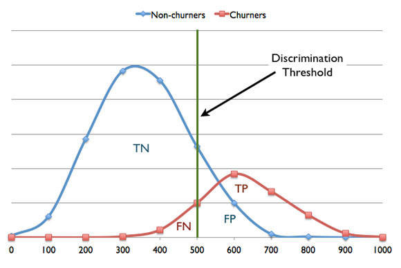
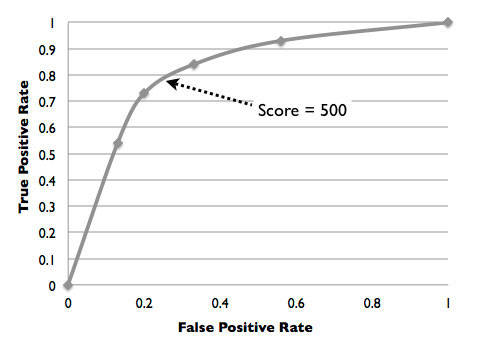
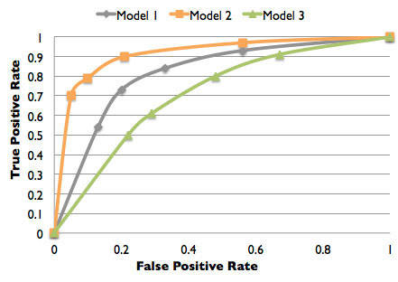

# 创建一个预测解决方案
学习如何使用预测建模技术来构建预测分析解决方案

**标签:** 分析

[原文链接](https://developer.ibm.com/zh/articles/ba-predictive-analytics3/)

Alex Guazzelli

发布: 2013-02-26

* * *

## 简介

对未来的预测可以追溯到看手相的时代。预测分析需要对大量的历史数据进行分析和预处理，然后将结果提交给预测技术进行培训。一个预测模型需要将数据与良好的数学方法结合起来解决特定的问题。假设有一个明确定义的问题和一个旨在解决此问题的模型，那么必须详尽地衡量和评估所有预测错误。因此使用模型评估确定模型的准确度。随后使用评估结果选出最佳模型并设定理想的鉴别阈值。当结合业务规则后，预测模型将能够真正地对您的企业的底线产生影响。预测解决方案就是将数据、良好的数学方法和业务规则组合在一起，它们共同交付增强的业务决策功能。

预测分析允许公司和个人构建能够利用历史数据预测未来的解决方案。通常，如果未对试图解决的问题进行充分的定义，那么再优秀的预测模型也将派不上用场。

所有人都认为构建预测解决方案的第一步是数据分析和预处理，然后才是构建模型等，然而实际过程要比这更加简单。预测解决方案就是将数据和良好的数学方法结合起来解决特定问题。解决方案成功的前提是对问题进行明确定义。如果问题定义有误，那么解决方案评估结果将变得难以衡量，并因此无法进行有效的部署。另一方面，一个明确定义的问题将有助于清晰地评估所建议的解决方案的好坏。这使得所有参与方能够更轻松地理解并信任评估结果。

假设有一个明确定义的具体问题，数据科学家可以查看历史数据来确保它支持解决方案构建。即使数据并不完美，但可用的数据仍然可以提供足够的信息来构建成功的预测解决方案。完成数据分析后就将开始执行预处理。这一阶段之后就是模型构建，最终会产生一个预测模型。对模型进行评估（是否能够使用）后，将其放到一个业务上下文中并最终投入使用。本文将介绍创建预测解决方案的所有阶段，从数据预处理一直到实现有效部署。下面，我将使用 IBM SPSS Statistics 来阐述这几个阶段。

## 数据预处理：从原始数据到特性

是否应当从原始数据中直接构建预测模型？或者，在构建模型之前是否应先对数据进行预处理？答案照例是 “视情况而定”。尽管可能会按原样使用某些数据字段，但是大部分字段需要进行某种处理 (massaging)。

历史数据的形式多种多样。例如，数据可能包含有关某位客户的结构化和非结构化信息。在这种场景下，结构化数据包含诸如客户年龄、性别、最近一月内的购买次数等字段。这些信息是从客户帐户记录和历史交易中获得的。非结构化数据可能包括相同客户针对所购买商品或服务提供的反馈意见。在本系列文章的第 1 部分和第 2 部分中，我使用了类似的数据字段演示预测分析的一种应用：根据人员缩减预测客户流失。如果您按顺序阅读了前几篇文章，那么您现在应该已经对此问题有了大致的了解。

要构建一个预测模型来输出客户流失风险，我们决定将某些输入字段的值放到一起。例如，所有年龄在 21 岁以下的客户都划分在学生类别中。类似地，所有 55 岁以上的客户将划分到退休人员类别中。年龄介于 21 至 55 之间的客户则属于工人类别。很明显，这对最初的年龄字段进行了简化，然而这样做增加了将数据提交给某种预测技术以进行培训时的可预测性。实际上，数据预处理的最终目标就是增强输入字段的可预测性。通过从原始数据中挖掘特性，我们实际上突出显示了数据中的关键信息。通过这样做，我们简化了使用预测技术从数据中了解隐含的重要模式的过程。

预处理的另一个目的是修改数据，从而使数据适合于培训。例如，根据模型构建使用的技术，可能需要对前面提到的三个与年龄有关的分类进行离散。对于这种情况，如果客户 A 是 25 岁，那么她的年龄将通过三个不同的字段表示：学生、工人和退休人员，分别映射为 0、1 和 0。出于同样的考虑，任何连续的字段都需要进行标准化。在本例中，最近一个月内的购买次数将转化为一个介于 0 和 1 之间的数。注意，原始字段本身已经是经过预处理后的结果，因为它表示一个聚合：某段时期内发生的所有交易的总购买次数。

此外，我们还决定使用文本挖掘在评论中找出损耗提示并创建一个损耗度量，也由 0 到 1 之间的一个值表示。我们的想法是使用客户的特性列表表示每个客户并将它们结合为一条记录。如果选择了 100 个特性并且存在 100K 名客户，那么最终数据集将包含 100k 个行（或记录）以及 100 个列。

要让数据处理变得更简单，除了允许用户按照以上描述操作数据外，还有许多统计包可以使用户选择一个选项来自动预处理数据。例如，IBM SPSS Statistics 就允许自动构建特性。只需要选择 **Transform menu > Prepare Data for Modeling** 并单击 **Automatic** 即可。随后，您将被要求描述您的目标。可以从以下四个选项列表中选择。这些选项是：1) 平衡速度和准确度；2) 优化速度；3) 优化准确度；以及 4) 自定义分析。最后一个选项只推荐有经验的用户使用。IBM SPSS Statistics 还允许对数据应用各种转换。这可以通过 Transform 菜单轻松访问。

对数据进行适当的处理后，接下来将进行模型培训。

## 模型培训：从数据中获悉模式

在培训期间，所有数据记录都呈现给一种预测技术，该技术负责从数据中获悉模式。如果发生客户流失，数据中将包含可以区别流失客户和非流失客户的模式。注意，这里的目标是在输入数据（年龄、性别、最近一月购买的商品数量等）和目标或因变量（流失和非流失）之间创建一个映射函数。预测技术有许多种，诸如神经网络 (NN) 和支持矢量机等，都具有强大的功能，且能够学习复杂的任务。这些技术也具有通用性，可以用于解决各种问题。其他技术（如决策树和记分卡）也能够解释其预测背后的原理。由于本系列的第 2 部分已经对这些技术有所介绍，因此本文将主要侧重于 NN 技术。注意，相同的模型构建原理也适用于所有其他技术。从现在起，我将假设您是一名数据科学家，负责任务建模任务。

要在 IBM SPSS Statistics 中构建一个 NN，选择 **Analyze menu > Neural Networks** 并单击 **Multilayer Perceptron** 。之后，将显示一个以制表符分隔的窗口，允许您为预测模型的构建配置所有必要的参数。

在 “Variables” 选项卡中，选择目标或因变量，以及您希望呈现给网络以供培训的所有输入变量。IBM SPSS Statistics 要求您将输入分为 Factor 和 Covariate。Factor 表示分类输入字段（如年龄），我们之前已将其转化为特定值：学生、工人和退休人员。IBM SPSS Statistics 将在培训开始前自动对这些值进行离散。Covariates 表示连续的变量。这些变量也将自动进行重新调节来改善网络培训。考虑到默认情况下会对分类变量进行离散，对连续变量进行重新调节，因此您无需在模型培训前做这些工作。

一种常见的做法是将包含处理过的数据的数据集分为两部分：一部分为模型培训预留，另一部分用于测试。第一个数据集通常包含总数据量的 70%。第二个数据集包含其余的数据，将用于模型验证（见下文）。这是 IBM SPSS Statistics 默认提供的分离。您可以通过选择 Partitions 选项卡来进行修改。

与任何其他预测技术一样，NN 附带了一些参数，可以根据数据和尝试解决的问题进行调整。在 Architecture 选项卡中，您可以选择使用某个选项实现自动架构选择，或者可以根据自己的专业水平对网络进行自定义，指定网络的层数和每个层的节点数。有关 NN 架构及其对培训的重要性等更多信息，请参阅本系列的第 2 部分。在 Training 选项卡中，您将看到其他参数，包括学习速度（网络学习应当有多快？）和优化算法。注意，选择错误的参数可能会导致无法实现学习。还需注意，和任何其他机器一样（使用或未使用计数器），针对某种预测技术设置某个参数总会产生副作用。例如，将 NN 的学习速度设置得过低将导致 NN 无法正常运行。如果设置得过高，那么 NN 将无法聚合。建议在一开始就使用 IBM SPSS Statistics 提供的默认参数。

IBM SPSS Statistics 还提供了其他配置选项卡，我们将在后面的小节中讨论。如果所有选项卡都进行了适当的配置，那么接下来就可以正式构建模型了。为此，在包含所有不同配置选项卡的窗口底部单击 **OK** 按钮。

## 模型验证：判断准确度

预留多达 30% 的数据用于模型验证，这是一种很好的做法。使用一个未用于模型培训的数据样本将允许对其精确度进行客观的评估。

在 “Output” 选项卡中，选择输出 “Classification results”。当模型培训完成后，”Classification table” 将提供有关模型健康状况的即时快照。这个快照让您能够快速了解模型是否能够获悉目前涉及的任务。模型不需要达到 100% 的准确度。事实上，预测模型是因做出错误预测而为人所知。我们的目的是确保模型尽量减少错误，同时能够做出大量正确的预测。用预测分析的专业术语来说，您希望模型具有较低的假阳性 (FP) 率和假阴性 (FN) 率，这意味着具有高真阳性 (TP) 率和真阴性 (TN) 率。对于客户流失问题，如果模型为某位即将流失的客户准确指定了一个高流失风险，那么您将得到 TP。如果对某位实际上将继续保持高度忠诚的客户指定了一个低流失风险，那么您将得到 TN。然而，模型每次向某个满意客户指定高流失风险时，您将得到一个 FP。同样，如果模型向某个即将丢失的客户指定了一个低流失风险，那么您将得到一个 FN。

图 1 显示了评分后的测试数据的图形表示。该图形假设模型输出了一个介于 0 到 1000 之间的风险评分值，并且分值越高，流失的风险就越大。因为测试数据进行了标记，我们可以将其分为两个不同的曲线：红色曲线表示流失客户，蓝色曲线表示非流失客户。绿色线条表示鉴别阈值，我们将其定为 500。这样，如果客户分数低于这个值，那么就可认为是非流失客户。如果分值高于 500，那么就认为是流失客户。然而，正如从图 1 中所看到的，将阈值定为 500 将发生一些错误：FP 和 FN。选择一个更高的阈值，比如 600，我们可以最小化 FP，但是会出现一些 FN。如果选择一个较低的阈值，比如 400，我们可以极大地缩小 FN，但是会出现更多 FP。这就会引出一个问题：考虑到所有可能的阈值选择，哪一个才是最理想的？答案取决于业务目标和各种类型错误的相关成本。

##### 图 1.评分测试数据显示模型使用 0 到 1000 的分数表示流失客户和非流失客户。鉴别阈值 = 500。

与 FN 相关的成本通常有别于与 FP 相关的成本。以客户流失为例，如果没有识别出即将流失的客户 (FN)，公司就会丢失该客户可能在未来带来的收入。如果向满意客户提供免费赠品和挽留计划 (FP)，那么无疑是浪费公司的资金。因此，根据与每种错误相关的成本，您可以确定 FN 少于 FP 的预测模型，反之亦然。这个决策将确定理想的鉴别阈值。

要评估模型将数据分类的准确度，一个好方法是审查它的 ROC（受试者操作特性）曲线，这种曲线还可用于选择理想的鉴别阈值。您可以在 IBM SPSS Statistics 中输出该曲线，方法是选择 Output 选项卡并单击 ROC Curve。ROC 曲线提供了一个二元分类器随其鉴别阈值变化的真阳性率（灵敏度）和假阳性率 (one minus specificity) 的图形表示。图 2 显示了一个流失风险模型的 ROC 曲线，其中，通过用 TP 数除以流失客户的总数获得不同鉴别阈值情况下的真阳性率（在图 1 中用红色曲线表示）。类似地，通过用 FP 数除以非流失客户的总数获得不同鉴别阈值情况下的假阳性率（在图 1 中用蓝色曲线表示）。如 [图 2](#roc-图形显示了在不同鉴别阈值情况下的真阳性率和假阳性率。曲线中的点表示不同的鉴别阈值。分别为：0、200、400、600、800-和-1000。) 所示，分值 500 表示曲线中的一个临界点，在该点处，我们仍然获得一个相对较低的假阳性率和一个较高的真阳性率。

##### 图 2.ROC 图形显示了在不同鉴别阈值情况下的真阳性率和假阳性率。曲线中的点表示不同的鉴别阈值。分别为：0、200、400、600、800 和 1000。

此外，您可以使用 ROC 曲线（IBM SPSS Statistics 结合 ROC 图形的输出）下方的区域来比较不同的模型（假设您使用了不同的参数构建了多个模型）。该区域的面积越大，那么模型的准确度就越高。 [图 3](#使用-roc-曲线表示的三个模型。由于模型-2-中曲线下方的区域最大，因此认为其比模型-1-和模型-3-更精确。) 显示了三个不同模型（1、2 和 3）的 ROC 图形。我们可以顺利得出一个推论：模型 2 要比模型 1 和模型 3 更精确。

##### 图 3.使用 ROC 曲线表示的三个模型。由于模型 2 中曲线下方的区域最大，因此认为其比模型 1 和模型 3 更精确。

## 数据后处理：从评分到业务决策

预测模型的原始输出通常为一个介于 0 到 1 或 1 到 -1 之间的值。但是，为了符合人们的阅读习惯，这个输出经常扩展为 0 到 1000 之间的值。模型的输出还可以根据给定的函数进行扩展，这样可以确保某个分数可以表示一个理想的 TP 和 FP 值。

后处理还意味着将评分嵌入到操作流程中。在这种情况下，需要将评分转换为业务决策。例如，对于客户流失问题，您的公司可能需要为高流失风险的客户提供更好的挽留计划。事实上，可以根据评分使用不同的鉴别阈值制定不同的业务决策，以及 TP、FP 及其成本方面的含义。

过去仅包含业务规则的决策管理解决方案如今也嵌入了预测模型。它们是通过将模型封装到规则中实现这一点的。通过结合业务规则和预测分析，企业能够从两种类型的知识中获益：专家知识和数据驱动的知识。在这种情况下，基于不同阈值的决策可以立即实现，甚至可以进行扩展以包含其他重要的决定性因素。例如，要判断某个客户的真正价值，该客户的流失风险评分可能还伴随提供了该客户在过去消费的金额。如果该金额巨大，同时流失风险也很高，那么说明阻止这名客户的流失将非常重要。

通过结合专家知识和数据驱动知识，决策管理解决方案将变得更加智能，这是因为它们能够提供增强的决策功能。

## 结束语

要构建预测解决方案，首先要清晰地定义该解决方案尝试解决的问题。有了定义明确的目标，数据分析科学家就可以着手构建精确的预测模型，这个模型将为所有相关方带来显而易见的利益。

定义了尝试解决的问题后，我们将对历史数据进行分析和预处理，以便为模型培训做好准备工作。该流程的结果是一些可以增强原始数据预测价值的特性。数据预处理也十分有必要，它可以使原始数据适合于模型培训。考虑到有许多种不同的预测技术，因此预测解决方案可以采用某种特定的技术（如 NN），或者同时使用多种技术来解决当前问题。

构建完预测模型后，我们需要对其进行评估。由于预测分析难免会出现错误，因此我们可以使用不同的鉴别阈值来最大程度地减少错误，同时还减少与之相关的成本。由于不同的阈值可以结合业务规则使用，因此可以使用一种分层系统来优化预测模型产生的评分。结合使用业务规则和预测分析将可以产生真正的预测解决方案。

本系列文章的第 4 部分（也是本系列的最后一篇）将着重介绍预测分析的部署和预测解决方案的实际应用。

本文翻译自： [Create a predictive solution](https://developer.ibm.com/articles/ba-predictive-analytics3/)（2013-02-26）