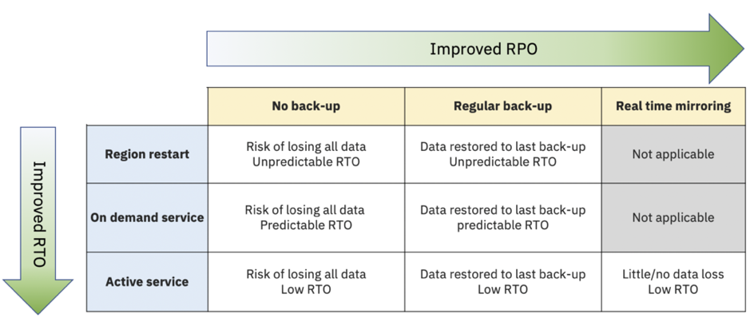

# 创建具有灾备能力的高可用性 Kafka 应用程序
IBM Event Streams on Cloud 的高可用性和灾难恢复

**标签:** Apache Kafka,IBM Event Streams,消息传递

[原文链接](https://developer.ibm.com/zh/articles/ha-dr-kafka-ibm-event-streams/)

Adrian Preston

发布: 2020-11-09

* * *

[高可用性 (HR)](https://en.wikipedia.org/wiki/High_availability) 和 [灾难恢复 (DR)](https://en.wikipedia.org/wiki/Disaster_recovery) 都是十分复杂的主题，它们与您的业务及其需求和价值有关。在本文中，我将在构建系统时介绍以下主题：

- “可用性范围”
- 管理风险（可用性的期望值和注意事项）
- IBM Event Streams on Cloud 提供的功能以及如何增强 Event Streams 灾难恢复功能

IBM Event Streams ( [https://www.ibm.com/cloud/event-streams](https://www.ibm.com/cloud/event-streams)) 是 IBM Cloud 中提供的一项托管 Kafka 服务。它提供了一种具有灾备能力的安全事件流服务，此服务可处理业务关键型工作负载。

本文介绍了如何确保基于 IBM Event Streams on Cloud 构建的应用程序的可用性随企业对这些应用程序的依赖程度的增长而增长。（虽然在通常情况下也可以对 Apache Kafka 实例应用类似的技术，但本文的其余部分中仅描述了 IBM Event Cloud on Cloud 的特定实现。）

## “可用性范围”

您对“高可用性”(HA)、“镜像”和“灾难恢复”(DR) 等术语肯定不陌生。这些术语通常被错误地解释为二元选项：

- 要么有 HA，要么无 HA。
- 要么有 DR，要么无 DR。

可用性实际上是一个范围，而企业要在该范围中处于的位置将取决于您的业务需求。

企业会在业务连续性计划中定义以下两个重要指标： _恢复时间目标 (RTO)_ 和 _恢复点目标 (RPO)_。这两个指标是企业为整个系统（而不只是像 Event Streams 这样的单个服务，也不是像 Kafka 部署这样的单个系统组件）定义的。

- **RTO：恢复时间目标** – RTO 是一个时间量，在灾难或中断发生后为避免因业务连续性中断而导致难以接受的后果，必须在这段时间内恢复业务流程。 即，“在业务流程中断之后，需要多久才能恢复业务？”

- **RPO：恢复点目标** – RPO 是由于重大事件而可能导致 IT 服务丢失数据（事务）的最大目标时间段。 即，“在不严重影响业务的情况下，我可以恢复多长时间内的备份？”

任何特定的 HA 解决方案都由以下三个因素决定：

1. 服务可用性 (RTO) – 在没有服务的情况下，可以维持多久？
2. 数据可用性 – 可以承受丢失多少数据？
3. 成本 – 预算是多少？

## 管理风险（可用性的期望值和注意事项）

降低业务风险是改善服务可用性的主要动力。简而言之，风险可被视为以下两个因素的组合：

- 发生事件的概率
- 事件的影响

### 风险 = 概率 x 影响

假设有个人可以熟练地走钢丝。无论绳索是刚刚离地还是挂在两座高楼之间，他们从绳索上掉下的概率是相同的。但是，从高处掉落的影响会大大增加。可以肯定的是，与在离地面近的地方走钢丝相比，在高空走钢丝时承受的风险会更高一些。

首先，考虑在构建高可用性服务时需要减轻的风险类型。

在最低级别，我们要减轻服务的基本组件（机器、网络、磁盘等）的故障影响。此场景适合使用云原生方法，即，假设所有组件都可能发生故障，并通过冗余来降低风险。

除此之外，我们正在研究局部自然灾害（例如洪灾、火灾和停电）使整个数据中心停运的情况。像 IBM Cloud 这样的云原生解决方案通过提供 _可用性区域_ (AZ) 来减轻这些灾难的影响。这包括单个区域内用于托管该服务的所有数据中心。

例如，我的本地 IBM Cloud 区域位于伦敦，而 IBM 并未公布其确切位置，但我知道 AZ 数据中心分布在英格兰东南部，因此洪灾或火灾不太可能会使所有数据中心都停运。

最高级别的灾难是整个区域故障，例如，大规模的自然灾难、网络攻击或级联软件故障。要减轻这类事件的影响，必须能够将故障转移到另一个区域中的备份服务。

如果您的要求是能够容忍整个区域故障，那么根据定义的 RPO 和 RTO 要求，可以使用以下多种策略：

从 RTO 的角度来看，可以使用以下选项：

- **区域重新启动：** 等待区域重新联机以及服务重新启动
- **按需服务：** 根据需要在其他区域中构建新服务
- **活动服务：** 在另一个区域中提供永久运行的备用服务

从 RPO 角度来看，可以使用以下选项：

- **无备份：** 不进行备份，从头开始
- **定期备份：** 根据 RPO 定期对活动服务数据进行备份
- **实时镜像：** 实时地将所有数据发送到远程区域中正在运行的服务

每个列表越往下走，RTO/RPO 达成率就越高，而成本也越高。

### 综合 RTO 和 RPO

一定要记住，您的服务只是系统的一部分，而您的 RTO/RPO 要求适用于系统的所有部分。

除了您的服务外，您还需要考虑如何处理前端和后端应用程序。如果它们都位于故障区域内，那么需要确保它们在新环境中得到妥善安排。如果它们位于该区域外，那么需要使用一种机制来将它们重新连接到新环境（DNS 交换或硬编码端点）。

您还需要考虑由哪种事件触发切换到新区域。是人工操作员关闭与故障区域相关的所有服务并在另一个区域重新启动这些服务的手动过程吗？还是应用程序本身检测到问题并在其他地方查找该服务？

## IBM Event Streams on Cloud 服务提供的功能

IBM Event Streams 承诺提供 99.99％ 的可用性（平均每天停机时间少于 9 秒）。下面我们来介绍实现此目标的几种方法。

### 使用三个可用性区域

如果使用托管的 Kafka 服务 IBM Event Streams on Cloud，那么 Event Streams 服务的 Enterprise 和 Standard 套餐都可以通过将其 Kafka 节点分布在同一个地区的三个可用性区域中来提供灾备能力。

参阅我的博客文章“ [使用可用性区域来增强 Event Streams 灾备能力](https://www.ibm.com/cloud/blog/using-availability-zones-to-enhance-event-streams-resilience)”，了解可用性区域如何提供出色的灾备能力，以及如何编写应用程序来利用这种能力。

### 定期执行灾难恢复测试

Event Streams 团队会定期执行灾难恢复测试。最近，我们在美国西部地区模拟了一起网络攻击，然后在华盛顿创建了一个新的 Event Streams 集群，并从位于第三个地区的备份中恢复了所有主题。

由于我们是使用 IBM Cloud 来运营业务，因此我们还在新地区中重建了一个交付管道，用以证明即使主要地区停运，我们也可以在全球范围内每天多次将更改推送到生产环境中！

### 如何使用 IBM Event Streams 增强高可用性和灾难恢复功能

如果您的要求是能够容忍整个区域故障，那么根据 RPO/RTO 要求，可以使用以下多种策略：

- 按需构建新的企业集群：

    - 备份中不含事件数据
    - 从备份恢复事件数据
- 永久运行备份集群（其配置与原始集群保持一致）：

    - 备份中不含事件数据
    - 根据需要从最新备份恢复事件数据
    - 定期从备份加载事件数据以实现 RPO
- 永久运行备份集群，以近乎实时或定期方式（仍符合 RPO）将主要集群上收到的所有事件做成镜像。

IBM Cloud Object Storage (COS) ( [https://www.ibm.com/cloud/object-storage](https://www.ibm.com/cloud/object-storage)) 是可用于存储备份的服务。使用它的跨区域功能，辅助区域可以轻松访问备份以在新区域中进行恢复，因此它适用于此用例。（本文不讨论如何实现这一点。）

#### 按需构建新集群

这是性价比最高的选项；但是，最多需要 3 个小时来完成创建过程，并且必须备份配置数据，以便可以恢复相关主题。最初，任何主题都没有相关数据。如果您在 IBM Cloud Object Storage 中保留了定期备份，那么就可以恢复事件。

#### 永久运行预先配置的备份集群

由于 Kafka 集群已在运行，因此 RTO 由应用程序连接到新服务的速度来确定。最初，任何主题都没有相关数据。如果您在 IBM Cloud Object Storage 中保留了定期备份，那么就可以在灾难发生后或定期恢复事件，这有助于在访问辅助集群时最大限度地降低 RPO/RTO。

当数据寿命很短时，最适合使用此方案，它仅在出现故障后开始收集新数据时才适用。在这种情况下，您需要较低的 RTO，但不必考虑 RPO。

也可以使用此环境根据 RPO 来定期恢复事件，因此 Kafka 集群始终保持在适当的级别。可以使用 IBM Cloud Object Storage 备份或跨区域镜像功能来实现此目标。

#### 永久运行预先配置的备份集群（近乎实时地镜像事件或消息）

如上所述，RTO 接近瞬时。此方案的区别在于，传递给主要集群的任何事件都会实时复制到备份集群，从而最大限度地降低了 RPO。

IBM Event Streams on Cloud Enterprise 套餐提供了用于在两个服务实例之间启用完全托管镜像的选项。您可以使用该选项将消息数据从主要服务实例持续复制到备份实例中。通常，这些实例位于同一地理位置的不同区域内，例如达拉斯和华盛顿。

例如，假设您已设置了从达拉斯的 Event Streams 实例（主要）到华盛顿的 Event Streams 实例（备份）的镜像。如果发生了影响整个达拉斯地区的重大事件，那么 Kafka 应用程序可以切换为使用华盛顿实例并继续正常运行。华盛顿实例现在是主要实例。此时，可以使用以下两个选项：

- **故障恢复：** 等待达拉斯实例可用，将所有新数据从华盛顿实例重新镜像到达拉斯实例。完成此操作后，将 Kafka 应用程序重新改为使用达拉斯实例，再次使该实例成为主要实例。

- **配置一个新的 Event Streams 实例，使其充当备份实例。** 华盛顿实例仍然是主要实例，并且已建立镜像，可以将消息数据从华盛顿实例复制到新配置的备份实例。

使用内置的镜像功能时，RTO 时间是指将 Kafka 应用程序重新连接到备份站点所用的时间。通常，可以用秒为单位来测量该时间。保持较低的 RPO 时间，可能会限制 Kafka 应用程序生成要发送给主要服务实例的消息数据的速率。这可以使镜像过程跟上新消息到达的速率，从而将 RPO 时间保持在几秒钟。回到达拉斯实例与华盛顿实例之间的镜像示例，达拉斯实例中每秒可生成不超过 35MB 的消息数据，这样可以保持较低的 RPO 时间。

要继续了解 Event Streams 实例之间的镜像，可查看我们的 [Event Streams on Cloud 文档](https://cloud.ibm.com/docs/EventStreams?topic=EventStreams-mirroring)。

## 结束语及后续步骤

高可用性和灾难恢复是一个十分复杂的领域，需要进行大量的思考和设计才能实现正确的业务目标，同时兼顾服务的可用性、数据的一致性和预算。

尽管本文着重介绍了 IBM Event Streams on Cloud 的高可用性和灾难恢复功能，但是务必要查看更广泛的系统环境（Event Streams 只是其中的一个组件）中的这些功能。

至关重要的一点是，无论您采用哪种方法实现高可用性和灾难恢复，都要确保定期记录和测试该过程！

您可以在 [IBM Cloud Architecture Center](https://www.ibm.com/cloud/architecture/architectures/resilience) 或 [IBM Cloud 文档](https://cloud.ibm.com/docs/solution-tutorials?topic=solution-tutorials-strategies-for-resilient-applications) 中进一步研究如何在云上构建具有灾备能力的应用程序。

本文翻译自： [Creating resilient and highly available Kafka applications](https://developer.ibm.com/articles/ha-dr-kafka-ibm-event-streams/)（2020-08-28）