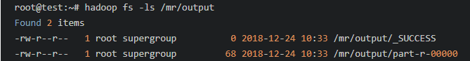
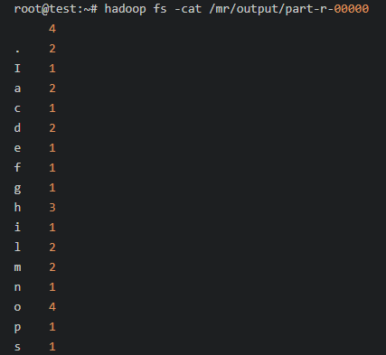
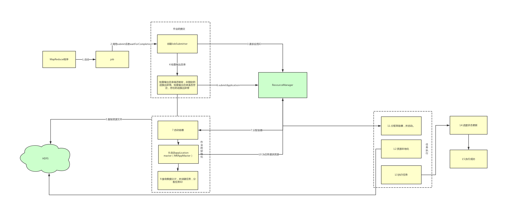
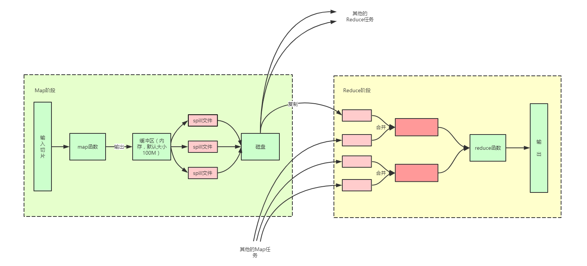

# 初识 Hadoop
Hadoop 入门

**标签:** Apache Hadoop,分析

[原文链接](https://developer.ibm.com/zh/articles/ba-lo-acquaintance-hadoop/)

甘 朝阳

发布: 2019-03-20

* * *

## 简介

Hadoop 是一个能够对大量数据进行分布式处理的软件框架，框架最核心的设计就是：HDFS 和 MapReduce。HDFS 为海量的数据提供了存储，而 MapReduce 则为海量的数据提供了计算。这篇文章就主要从 HDFS 和 MapReduce 两个大的方面展开对 Hadoop 讲解，当然为了直观的测试 HDFS 提供的丰富的 API 以及我们编写的 MapReduce 程序，在阅读下面的内容之前，你需要准备一台安装了 Hadoop 的机器（也可以是虚拟机），如果你还没有安装的话，可以参考 [《在 Ubuntu 上安装 Hadoop》](https://itweknow.cn/detail?id=52) 。

## HDFS

### HDFS 概念

在说 HDFS 之前我们先来解释一下什么是 DFS，DFS 的全称是 Distributed File System，翻译过来就是分布式文件系统，而 HDFS 就是 Hadoop 自带的分布式文件系统。

### 相关名词

为了后面大家更容易理解文章，这里使用一定的篇幅来简单的介绍一下与 HDFS 相关的一些组件或者名词的概念。

1. NameNode，管理节点，管理系统的命名空间，维护着整个文件系统的结构和目录信息，通常情况下一个 Hadoop 集群只会有一个工作的 NameNode。
2. DataNode，工作节点，文件系统的工作节点，主要是根据需要进行存储或者检索数据块，并且定期向 NameNode 报告它们所存储的数据块列表。
3. 数据块，同我们常使用的磁盘上的文件系统一样，HDFS 也有数据块的概念，默认的大小为 128M。
4. 块缓存，一般情况下，我们通过 HDFS 从 DataNode 中检索数据时，DataNode 都是从磁盘中读取，但是对于访问很频繁的文件，它所对于的数据块可能会被缓存到 DataNode 的内存中，以加快读取速度，这就是所谓的块缓存。
5. 联邦 HDFS，其实这个就是为了解决 Hadoop 不适合存储数量庞大的文件的问题，同时由多个 NameNode 来维护整个文件系统的系统树以及文件和目录，每个 NameNode 负责管理文件系统命名空间中的一部分。

### 特性

下面我们就一起来看下 HDFS 有哪些特性：

1. 存储超大文件，由于 HDFS 是分布式的文件系统，所以不受单台机器的存储大小的限制，可以存储超大文件，目前已经达到了 PB 级了。
2. 流式访问数据。
3. HDFS 对硬件的要求并不是很高，可以运行在廉价的商用硬件上。
4. 不适合低延迟的数据访问，由于 Hadoop 的流式数据访问，访问数据会有写延迟，所以不太适合低时间延迟的数据访问，一般情况下这种需求我们会使用关系型数据库来实现。
5. 不适合大量的小文件存储，原因是 NameNode 将文件系统的元数据存储在内存中，每存储一个文件都需要在 NameNode 中存储该文件的目录、存储在哪个 DataNode 中等等的数据。所以如果文件的数量达到数十亿的话 NameNode 的内存很可能不够用了。
6. 不支持多用户写入，以及任意的修改文件，只可以在文件末尾添加内容。

### HDFS 的命令行操作

命令行接口是 HDFS 所有类型的接口中最简单的，也是每个开发者都必须要掌握的。下面我们就列举几个简单的命令行操作，但是在操作前你必须按照第一章的内容安装好了 Hadoop，并且启动了 HDFS。

1. 创建目录。

    清单 1\. 创建目录命令


    ```
    hadoop fs -mkdir /test

    ```


    Show moreShow more icon

2. 查看目录。

    清单 2\. 创建目录命令


    ```
    hadoop fs -ls /

    ```


    Show moreShow more icon

3. 上传文件，紧跟-put 后面的 test.txt 是要推送到 HDFS 中的文件，/test 是指定要推送到 HDFS 上哪个目录下面。

    清单 3\. 上传文件


    ```
    hadoop fs -put test.txt /test

    ```


    Show moreShow more icon

4. 删除文件。

    清单 4\. 上传文件


    ```
    hadoop fs -rm /test/test.txt​

    ```


    Show moreShow more icon


其实通过上面例举的几个命令我们可以看出 HDFS 的文件操作命令几乎和 Linux 上的命令一致，这样我们使用起来会很容易上手。

### HDFS 的 JavaAPI

在 Java 项目中使用 HDFS 提供的 API 我们需要依赖 hadoop-common 和 hadoop-hdfs 两个包，为了方便测试，我们这里还引入了 junit，篇幅原因这里就不对项目本身做太多的讲解，这里附上 [项目源码地址](https://github.com/ganchaoyang/blog/blob/master/bigdata/src/main/java/cn/itweknow/bigdata/hdfs/JavaApi.java) 供大家参考。

1. 读取 HDFS 中文件的内容。

    清单 5\. JavaApi 读取文件内容


    ```
            @Test
    public void read() throws IOException {
    // 文件地址。
    URI uri = URI.create("/test/test.txt");
    // 用于接收读取的数据流。
    FSDataInputStream in = null;
    try {
          in = fs.open(new Path(uri));
          // 最后的一个 boolean 类型的参数是指是否在调用结束后关闭流，我们这里选择在 finally 里面手动关闭。
          IOUtils.copyBytes(in, System.out, 4096, false);
    } finally {
          IOUtils.closeStream(in);
    }
    }
    }

    ```


    Show moreShow more icon

    不出意外的话，你可以在控制台看到你指定文件的内容。在这一步我遇到一个问题，就是无法直接在 windows 下操作 HDFS,具体的解决方法可以参照 [这篇文章](https://blog.csdn.net/sunshine920103/article/details/52431138) 。FSDataInputStream.seek()方法还可以实现从文件输入流的任意一个绝对位置读取文件内容，比如我们可以在上面代码中添加如下的内容来实现在控制台重复打印文件内容。

    清单 6\. JavaApi 任意位置读取文件内容


    ```
            in.seek(0);
    IOUtils.copyBytes(in, System.out, 4096, false);

    ```


    Show moreShow more icon

2. 创建目录。

    清单 7\. JavaApi 创建目录


    ```
    @Test
    public void mkdir() throws IOException {
    fs.mkdirs(new Path("/test/api"));
    }

    ```


    Show moreShow more icon

3. 查询文件目录。

    清单 8\. JavaApi 查询文件目录


    ```
    @Test
    public void ls() throws IOException {
    FileStatus[] fileStatuses = fs.listStatus(new Path("/"));
    if (null == fileStatuses || fileStatuses.length == 0) {
    return;
    }
    for (FileStatus fileStatus : fileStatuses) {
    System.out.println(fileStatus.getPath() + "   " + fileStatus.getPermission());
    }
    }

    ```


    Show moreShow more icon

    这里引入一个类 FileStatus,这个类封装了 HDFS 中文件和目录的元数据，包括文件长度、块大小、复本、修改时间、所有者以及权限信息。FileSystem 里面提供的 listStatus 方法可以获取一个目录下的所有目录或者文件的 FileStatus,但是它不会递归获取下级目录的内容，这里可以开发你的想象自己实现一下（Tips：fileStatus.isDirectory()可以判断这个 fileStatus 是否是一个文件夹）。

4. 删除文件或目录。

    清单 9\. JavaApi 删除文件或目录


    ```
           @Test
    public void delete() throws IOException {
    fs.delete(new Path("/test/api"), false);
    }
    @Test
    public void deleteNonEmptyDir() throws IOException {
    fs.delete(new Path("/test"), true);
    }

    ```


    Show moreShow more icon

    我们可以看到 fs.delete()这个方法有两个参数，第一个参数很好理解，就是我们要删除的目录或者文件的地址。那么第二个 Boolean 类型的参数呢，如果删除的是文件或者空目录这个参数实际上是会被忽略的，如果删除的是非空目录，只有在这个参数值为 true 的时候才会成功删除。

5. 创建文件和文件写入。

    我们通过 FileSystem.create()方法来创建一个文件，这个方法会顺带着创建不存在的父级目录，如果不需要这个的话，最好是在创建之前调用 exists()方法来判断一下，如果父级目录不存在直接报错即可。

    清单 10\. JavaApi 创建文件和文件写入


    ```
    @Test
    public void create() throws IOException {
    FSDataOutputStream out = null;
    try {
    out = fs.create(new Path("/test/api/test.txt"));
    out.writeChars("hello hdfs.");
    } finally {
    IOUtils.closeStream(out);
    }
    }

    ```


    Show moreShow more icon

    文件创建好后，可以通过 append()方法在文件末尾添加内容。

    清单 11\. JavaApi 追加文件内容


    ```
    @Test
    public void append() throws IOException {
    FSDataOutputStream out = null;
    try {
    out = fs.append(new Path("/test/api/test.txt"));
    out.writeChars("hello hdfs.");
    } finally {
    out.close();
    }
    }

    ```


    Show moreShow more icon

6. 从本地上传文件到 HDFS。

    清单 12\. JavaApi 上传文件至 HDFS


    ```
    @Test
    public void copyFromLocal() throws IOException {
    fs.copyFromLocalFile(new Path("d:/local.txt"), new Path("/test/api"));
    }

    ```


    Show moreShow more icon

7. 从 HDFS 上下载文件。

    清单 13\. JavaApi 从 HDFS 下载文件


    ```
            @Test
    public void copyToLocal() throws IOException {
    fs.copyToLocalFile(new Path("/test/api/local.txt"), new Path("E:/"));
    }

    ```


    Show moreShow more icon


## MapReduce 实战

### 什么是 MapReduce

MapReduce 是一种编程模型，”Map（映射）”和”Reduce（归约）”，是它们的主要思想，我们通过 Map 函数来分布式处理输入数据，然后通过 Reduce 汇总结果并输出。我们编写一个 MapReduce 程序的一般步骤是：

1. 编写 map 程序。
2. 编写 reduce 程序。
3. 编写程序驱动。

### 本章节的目标

本节中我们将使用 MapReduce 框架来编写一个简单的例子，这个例子是用来统计 HDFS 指定目录下的文件中每个字符出现的次数并将统计结果输出到 HDFS 的指定目录中。点击 [此处](https://github.com/ganchaoyang/blog/tree/master/mr-test/src/main/java/cn/itweknow/mr) 获取本章节源代码。

### Map 程序

我们继承 Mapper 类并重写了其 map 方法。Map 阶段输入的数据是从 hdfs 中拿到的原数据，输入的 key 为某一行起始位置相对于文件起始位置的偏移量，value 为该行的文本。​​输出的内容同样也为键-值对，这个时候输出数据的键值对的类型可以自己指定，在本例中 key 是 Text 类型的，value 是 LongWritable 类型的。输出的结果将会被发送到 reduce 函数进一步处理。

清单 14\. Map 程序 {: #清单-14-map-程序}

```
public class CharCountMapper extends Mapper< LongWritable, Text, Text, LongWritable> {
@Override
protected void map(LongWritable key, Text value, Context context)
throws IOException, InterruptedException {
// 将这一行文本转为字符数组
char[] chars = value.toString().toCharArray();
for (char c : chars) {
// 某个字符出现一次，便输出其出现 1 次。
context.write(new Text(c + ""), new LongWritable(1));
}
}
}

```

Show moreShow more icon

### Reduce 程序

我们继承 Reducer 类并重写了其 reduce 方法。在本例中 Reduce 阶段的输入是 Map 阶段的输出，输出的结果可以作为最终的输出结果。相信你也注意到了，reduce 方法的第二个参数是一个 Iterable，MapReduce 会将 map 阶段中相同字符的输出汇总到一起作为 reduce 的输入。

清单 15\. Reduce 程序 {: #清单-15-reduce-程序}

```
        public class CharCountReducer extends Reducer< Text, LongWritable, Text, LongWritable> {
    @Override
    protected void reduce(Text key, Iterable< LongWritable> values, Context context)
            throws IOException, InterruptedException {
        long count = 0;
        for (LongWritable value : values) {
            count += value.get();
        }
        context.write(key, new LongWritable(count));
    }
}

```

Show moreShow more icon

### 驱动程序

到目前为止，我们已经有了 map 程序和 reduce 程序，我们还需要一个驱动程序来运行整个作业。可以看到我们在这里初始化了一个 Job 对象。Job 对象指定整个 MapReduce 作业的执行规范。我们用它来控制整个作业的运作，在这里我们指定了 jar 包位置还有我们的 Map 程序、Reduce 程序、Map 程序的输出类型、整个作业的输出类型还有输入输出文件的地址。

清单 16\. 驱动程序 {: #清单-16-驱动程序}

```
public class CharCountDriver {
          public static void main(String[] args) throws Exception {
          Configuration configuration = new Configuration();
          Job job = Job.getInstance(configuration);
          // Hadoop 会自动根据驱动程序的类路径来扫描该作业的 Jar 包。
          job.setJarByClass(cn.itweknow.mr.CharCountDriver.class);
          // 指定 mapper
          job.setMapperClass(CharCountMapper.class);
          // 指定 reducer
          job.setReducerClass(CharCountReducer.class);
          // map 程序的输出键-值对类型
          job.setMapOutputKeyClass(Text.class);
          job.setMapOutputValueClass(LongWritable.class);
          // 输出键-值对类型
          job.setOutputKeyClass(Text.class);
          job.setOutputValueClass(LongWritable.class);
          // 输入文件的路径
          FileInputFormat.setInputPaths(job, new Path(args[0]));
          // 输入文件路径
          FileOutputFormat.setOutputPath(job, new Path(args[1]));
          boolean res = job.waitForCompletion(true);
          System.exit(res?0:1);
          }
          }

```

Show moreShow more icon

### 执行 MapReduce 作业

1. 打包作业，我们需要将我们的 MapReduce 程序打成 jar 包。

    清单 17\. 打包作业


    ```
    mvn package -Dmaven.test.skip=true

    ```


    Show moreShow more icon

2. 将 jar 包复制到 hadoop 机器上。

3. 在 HDFS 上准备好要统计的文件，我准备的文件在 HDFS 上的/mr/input/目录下，内容为”hello hadoop hdfs.I am coming.”。
4. 执行 jar。

    清单 18\. 执行作业


    ```
    hadoop jar mr-test-1.0-SNAPSHOT.jar cn.itweknow.mr.CharCountDriver /mr/input/ /mr/output/out.txt

    ```


    Show moreShow more icon

5. 查看结果。

    我们先看看输出目录，结果如下，最终输出的结果就存放在/mr/output/part-r-00000 文件中。

    图 1\. MapReduce 作业输出目录




然后我们再看看输出文件中的具体内容，如下所示：

图 2\. MapReduce 作业输出结果



## MapReduce 运行原理

我们可以将一个 MapReduce 作业的运行过程简单的拆分成 6 个过程，分别是作业的提交、作业初始化、任务分配、任务执行、进度和状态的更新、作业完成。下面我就一起来具体了解下这么几个步骤。

### 作业的提交

当我们调用 job.submit()或者 job.waitForCompletion()方法（其内部也会调用 submit()方法）的时候，会创建一个 JobSubmitter 对象，在 JobSubmitter 内部所实现的作业提交过程如下：

1. 向资源管理器请求新的应用 ID 作为 MapReduce 作业的作业 ID。
2. 检查作业的输出目录，如果没有指定输出目录或者输出目录已经存在就会抛出错误，这也就是为啥我们在执行 MapReduce 作业时为啥需要保证指定的输出目录不存在。
3. 将作业运行所需要的资源文件（作业 JAR 包，配置文件，输入分片）复制到一起（一个以作业 ID 命名的目录下）。
4. 调用 submitApplication()方法提交作业。​

### 作业的初始化

1. 首先资源管理器会将作业请求传递给 YARN 调度器。
2. 调度器会为作业分配一个容器。
3. 资源管理器在节点管理器的管理下在容器中启动 application master。
4. application master 的主类 MRAppMaster 会创建多个簿记对象来跟踪作业的进度。
5. 接收输入分片。
6. application master 为每个分片创建 map 任务以及确定 reduce 任务，并且分配任务 ID。

### 任务的分配

application master 会为创建的任务向资源管理器请求容器，先是为 map 任务请求资源，后为 reduce 任务请求资源。为 map 任务分配资源的时候需要考虑到数据本地化的局限，会尽量保证运行的 map 任务所需要的数据块存储在当前机器或者当前机架中，这样会极大的节省带宽资源。而 reduce 任务则不存在这个限制。

### 任务的执行

1. 资源管理器为任务分配好容器后，application master 就通过与节点管理器通信启动容器。
2. 在运行任务之前，会将任务所需要的资源本地化。
3. 运行任务。

### 进度和状态的更新

任务在运行的过程中，会对其精度保持追踪，对与 map 任务，其任务进度就是已经处理的输入所占总输入的比例。对与 reduce 任务来讲就比较复杂了，因为这个部分包含资源复制阶段、排序阶段和 reduce 阶段三个阶段，每个阶段都占整个完成比例的 1/3，也就是说当我们完成 reduce 的一半的时候进度应该为 5/6。对与状态的更新，客户端会每秒轮询一次 application master 以接收最新的任务状态。

### 作业的完成

当 application master 收到作业最后一个任务已经完成的通知后，便把作业的状态设置为”成功”。

为了方便大家理解，我这里将整个过程总结为一张图，贴在这里仅供大家参考。

图 3\. MapReduce 程序运行图解



## Shuffle

## 简介，什么是 Shuffle

MapReduce 程序会确保每个 reduce 函数的输入都是按键排序的。系统执行排序以及将 map 函数的输出传给 reduce 函数的过程称之为 shuffle。整个 Shuffle 分为 Map 端和 Reduce 端，下图是 MapReduce 的 Shuffle 的一个整体概览图，大家先看一下整个图，我们后面再做进一步的解释说明。

图 4\. Shuffle 概览图



### Map 端 Shuffle

其实 Map 函数产生的输出会写到磁盘上而不是 HDFS。但是它也不是简简单单的直接写到磁盘，这中间有一个复杂的过程，下面我们就来拆解一下。

从上面的图可以看到每个 Map 任务都会有一个缓冲区，这个缓冲区会临时存储 map 函数输出的内容，缓冲区的个大小默认是 100M，我们可以通过 mapreduce.task.io.sort.mb 这个配置项配置，当缓冲区中的内容达到其设定的阈值（阈值的设置值是占整个缓冲区的大小，默认为 0.8，我们可以通过 mapreduce.map.sort.spill.percent 来配置）时就会产生溢出，这个时候会有一个后台线程将缓冲区中的内容分区（根据最终要传给的 Reduce 任务分成不同的区，分区的目的是将输出划分到不同的 Reducer 上去，后面的 Reducer 就会根据分区来读取自己对应的数据）

然后区内按照 key 排序，如果我们设置了 Combiner（Combiner 的本质也是一个 Reducer，其目的是对将要写入到磁盘上的文件先进行一次处理，这样，写入到磁盘的数据量就会减少。）

的话，这个时候会运行 Combiner 函数，最后再写入磁盘。而在这个过程中 Map 任务还会继续往缓冲区中输出内容，如果出现缓冲区空间被占满的情况，Map 任务就会阻塞直到缓冲区中的内容被全部写到磁盘中为止。

每次缓冲区溢出时都会新建一个新的溢出文件，这样最后其实是会出现多个溢出文件的，在 Map 任务结束前这些溢出文件会被合并到一个整的输出文件。

### Reduce 端 Shuffle

Reduce 端的 Shuffle 分为三个阶段，复制阶段、合并阶段和 Reduce。

首先是复制阶段，Reduce 任务需要集群上若干个 map 输出作为其输入内容，在每个 Map 任务完成的时候 Reduce 任务就开复制其输出，上面也提到过 Map 任务在写入磁盘前会将输出进行根据 Reduce 任务进行分区，所以这里 Reduce 任务在复制的时候只会复制自己的那个分区里的内容。如果 Map 的输出非常小，那么 Reduce 会直接将其复制到内存中，否则会被复制到磁盘。

合并阶段，因为有很多的 Map 任务，所以 Reduce 复制过来的 map 输出会有很多个，在这个阶段主要就是将这些 Map 输出合并成为一个文件。

Reduce 阶段，这个阶段主要就是执行我们的 Reduce 函数的代码了，并产生最终的结果，然后写入到 HDFS 中。

在文章的最后，提供我在撰写本文的过程中所编写的一些 [源代码](https://github.com/ganchaoyang/blog)，供大家参考。也希望大家能够从本文中收获一些帮助。

## 结束语

本文主要从 HDFS 和 MapReduce 两个大的方面讲解了 Hadoop 的相关知识，并且编写了一个简单的 MapReduce 程序，最后还深入了解了一下 MapReduce 程序的运行原理以及 Shuffle 相关的内容。如果您想对本文做补充或者有什么问题的话欢迎发邮件给我 (gancy.programmer@gmail.com) 。

## 参考资源

- [Hadoop 主页](http://hadoop.apache.org/)
- [本文源码地址](https://github.com/ganchaoyang/blog)
- [在 Ubuntu 上安装 Hadoop](https://itweknow.cn/detail?id=52)
- [IDEA 远程调试 Hadoop 步骤及出错解决整理](https://blog.csdn.net/sunshine920103/article/details/52431138)