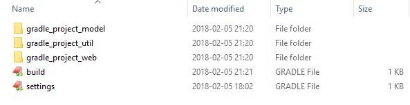
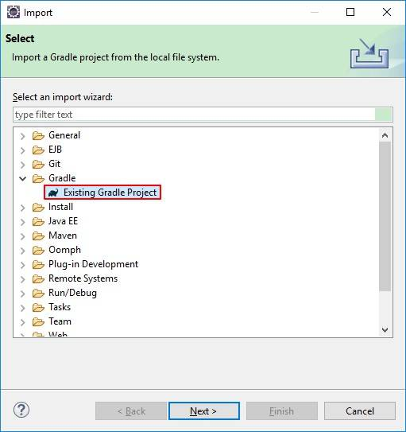
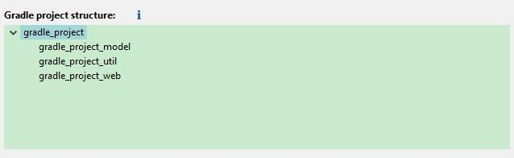
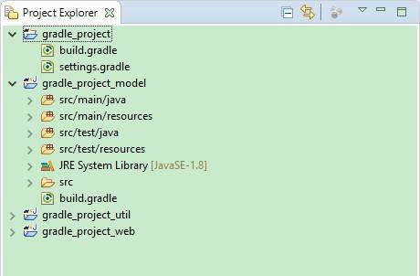
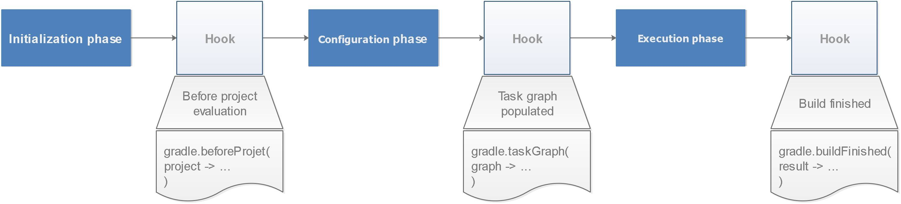
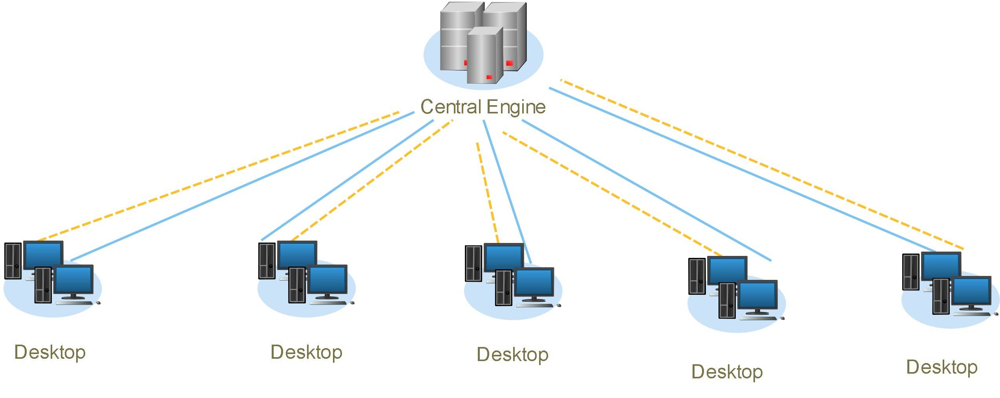

# 利用 Gradle 构建 Docker 镜像
基于 Gradle 提供无需安装 Docker Toolbox 即可生成 Docker Image 的方案

**标签:** 容器

[原文链接](https://developer.ibm.com/zh/articles/os-using-gradle-to-build-docker-image/)

李林锋

发布: 2018-03-28

* * *

## 概览

Docker 是一个开源的基于 LXC 的轻量型容器管理器，借助 Docker，开发人员只需将应用程序及所依赖的运行环境打包到一个可移植的容器中，就可以正常运行，而不必考虑语言、框架及底层操作系统的限制，使用 Docker 可以缩短开发时间、探索时间和部署周期，从而可以更富有成效地编码，简化开发环境，消除依赖项冲突等，并最终提升开发生产力。但 Windows 平台使用 Docker 技术时需要额外安装、配置 Docker 工具，势必会多花额外的工作时间，并且如果要在 Dev 环境中配置一套与生产环境一致的构建环境，将会需要不小的 Effort，为此便有 Central Docker Engine 的概念，后续会继续展开探讨使用 Gradle 脚本开展构建、编译生成 Docker 镜像。

为了在开发场景中加快开发搭建和显著提高开发效率，推荐使用 Gradle 进行构建，使用 Gradle 脚本能够高效、便捷的管理项目中的差异、依赖和编译、打包、部署等过程。本文将重点介绍 Gradle 的具体使用以及使用 Gradle 创建 Docker Image，从开发人员角度讲如何利用 Gradle 脚本以及如何利用 Central Docker Engine 构建 Docker 镜像。

## Gradle 与传统构建工具比较

传统构建系统中，会使用 Ant、Maven 作为构建工具，这里推荐给大家的是 Gradle，Gradle 没有使用 xml 作为配置文件，而是使用基于 Groovy 开发的 DSL，所以 Gradle 的配置文件比 Ant 和 Maven 的更加高效和简洁。下面将介绍下 Gradle 与 Ant、Maven 的主要区别：

- Ant 是最早的构建工具，其核心是由 Java 编写，采用 XML 作为构建脚本，因为是基于 Java 的，这样就允许在任何环境下，运行构建。Ant 基于任务链思想，任务之间定义依赖，形成先后顺序。缺点是使用 XML 定义构建脚本，导致脚本臃肿，Ant 自身没有为项目构建提供指导，导致每个 build 脚本都不一样，开发人员对于每个项目都需要去熟悉脚本内容，没有提供在 Ant 生态环境内的依赖管理工具。
- Maven 意识到 AntU 的缺陷，采用标准的项目布局、统一的生命周期和强大的依赖管理，运用”约定优于配置”的思想，减少构建脚本配置，提高开发效率和管理秩序，且拥有活跃的社区，可以方便使用合适插件进行扩展。缺点是采用默认的结构和生命周期，有很多限制，编写插件扩展麻烦，而且使用 XML 作为构建脚本导致构建脚本冗长。
- Gradle 同时拥有 Ant 和 Maven 的优点，具有 Ant 的强大和灵活，继承了 Maven 的生命周期管理。它使用基于 Groovy 的 DSL，提供声明式的构建语言，构建脚本简单、明了，使 Gradle 构建脚本更加简洁、清晰，同时采用标准的项目布局，拥有完全的可配置性。还可以通过插件扩展，提供默认的构建生命周期，也可以自定义任务、单独运行任务、定义任务间的依赖。Gradle 沿用、改进了 Maven 的依赖管理，可以与 Maven 和 Ivy 仓库结合；同时与 Ant 天生兼容，有效的重用 Ant 的任务；兼具多种实现插件的方式，拥有强大的官方插件库；从构建级别，支持从 Ant、Maven 的逐步迁移；通过包装器，无缝无缝兼容各个平台。

## 使用 Gradle 创建 Java Project

### 开发工具

- JDK：下载最新 Java8 版本，并安装、配置环境变量。
- Gradle Build Tool：请到 [网站下载最新 Complete 版](https://gradle.org/releases/)。
- Eclipse：Eclipse IDE for Java EE Developers 版本，请到 [网站下载最新版](http://www.eclipse.org/downloads/)。

### 准备环境

1. Gradle 核心是 Groovy，Groovy 的本质又是 Java，很明显 Gradle 环境必须依赖 JDK 与 Groovy 库，所以需要先安装 JDK 并配置好环境变量。
2. 下载 gradle-4.5-all ，从 [Gralde 网站](https://gradle.org/) 上选择最新版本下载，然后解压到指定目录，并将 Gradle 的 bin 目录添加到 Path 变量中配置好环境变量。
3. 检查 Gradle 环境变量是否配置成功。在 Cmd 命令行中输入：gradle -v，如果出现类似如下提示，则表示 Gradle 环境配置成功。


    ```
    ------------------------------------------------------------
    Gradle 4.5
    ------------------------------------------------------------
    Build time: 2018-01-24 17:04:52 UTC
    Revision: 77d0ec90636f43669dc794ca17ef80dd65457bec
    Groovy: 2.4.12
    Ant: Apache Ant(TM) version 1.9.9 compiled on February 2 2017
    JVM: 1.8.0_151 (IBM Corporation 2.9)
    OS: Windows 7 6.1 amd64

    ```


    Show moreShow more icon

    注：以上信息根据不同 Gradle 版本或者不同的环境或许有些不同。


### 创建项目

1. 新建一个 root 目录，命名为 gradle\_project，这里使用多个子项目来示例介绍，所以还需要在目录 gradle\_project 下创建子目录：

```
gradle_project_util；
gradle_project_model；
gradle_project_web；

```

Show moreShow more icon

1. 创建 build.gradle 文件，内容如下：

#### 清单 1\. 根项目 Gradle 配置

```
subprojects {
    apply plugin: 'eclipse'
    repositories {
    maven {
        url 'http://repo1.maven.org/maven2'
    }
    jcenter {
        url "http://jcenter.bintray.com/"
    }
}
    dependencies {
}
    version = '1.0'
    jar {
        manifest.attributes provider: 'Company Name'
}
}

```

Show moreShow more icon

1. 创建 settings.gradle 文件，settings.gradle 文件用于管理整个项目，声明当前项目中含有什么 module 等。具体内容如下：

#### 清单 2\. 根项目 settings 配置

```
rootProject.name = "gradle_project"
include "gradle_project_util",
"gradle_project_model",
"gradle_project_web"

```

Show moreShow more icon

创建完成之后如下图：

##### 图 1\. 目录结构示例



1. 在子项目中创建 build.gradle 文件，并添加如下内容：

#### 清单 3\. 子项目 Gradle 脚本

```
apply plugin: 'java'
    repositories {
    }
    dependencies {
    }
    /***project template***/
    task createDirs {
    sourceSets*.java.srcDirs*.each {
        it.mkdirs()
    }
    sourceSets*.resources.srcDirs*.each {
        it.mkdirs()
    }
}

```

Show moreShow more icon

1. 在 Cmd 命令行中执行：gradle createDirs，执行完命令之后会创建 Java 项目标准目录结构。

Gradle 遵循 COC（convention over configuration 约定优于配置）的理念,默认情况下提供了与 Maven 相同的项目结构配置。大体结构如下：

sub-project root

- src/main/java(项目代码目录)

- src/main/resources(项目资源目录)

- src/test/java(测试源码目录)

- src/test/resources(测试资源目录)

- 将 gradle\_project 导入至 Eclipse 中：


在 Eclipse 菜单中选择 File->Import->Gradle，具体如下图：

##### 图 2\. 项目导入示例



选择 Next 之后选择 gradle\_project 所在目录，后面继续选择默认值继续 Next 直到 Project Structure 解析完成，如下图：

##### 图 3\. Gradle Project Structure 示例



导入完成之后，在 Eclipse 中 Project Explore 中所显示的 Project Structure 如下图所示，至此与 Maven 中一致的项目结构创建完毕。

##### 图 4\. Project Explore 示例



## 使用 Gradle 进行 Code 构建

### 基础介绍

基于 Gradle 的实质就是 Groovy 脚本，执行一种类型的配置脚本时就会创建一个关联的对象，譬如执行 Build script 脚本就会创建一个 Project 对象，这个对象其实就是 Gradle 的代理对象。下面给出来各种类型 Gradle 对应的对象类型：

##### 表 1\. Gradle 构建对象表

脚本类型关联对象类型Init scriptGradle InitializationSettings scriptSettingsBuild scriptProject

Gradle 的三种主要对象解释如下：

- Gradle 对象：构建初始化时创建，整个构建执行过程中只有这么一个对象，一般不推荐修改这个默认配置。
- Settings 对象：每个 settings.gradle（Gradle 所定义的一个约定名称的设置文件 settings.gradle）会转换成一个 Settings 对象，该文件在初始化阶段被执行，对于多项目构建必须保证在根目录下有 settings.gradle 文件，对于单项目构建设置文件是可选的，不过建议还是需要配置上。
- Project 对象：每个 build.gradle 会转换成一个 Project 对象。

Gradle 的三种不同时期脚本用途如下：

1. 初始化脚本 Init script（Gradle）

Gradle 对象：初始化脚本 Init script（Gradle）类似于 Gradle 的其他类型脚本，这种脚本在构建开始之前运行，主要的用途是为接下来的 Build script 做一些准备工作。我们如果需要编写初始化脚本 Init script，则可以把它按规则放置在 USER\_HOME/.gradle/相关目录下。

初始化脚本的Gradle 对象代表了 Gradle 的调运，我们可以通过调用 Project 对象的 getGradle()方法获得 Gradle 实例对象。

1. 设置脚本 Settings script（Settings）

Settings 对象：在对工程进行配置（譬如多项目构建）时 Settings 实例与 settings.gradle 文件一一对应，它用来进行一些项目设置的配置。这个文件一般放置在工程的根目录。

1. 构建脚本 Build script（Project）

在 Gradle 中每个待编译的工程都是一个 Project（每个工程的 build.gradle 对应一个 Project 对象），每个 Project 在构建的时候都包含一系列 Task，这些 Task 中很多又是 Gradle 的插件默认支持的。所谓的我们编写 Gradle 脚本，实质大多数时候都是在编写构建脚本 Build script，所以说 Project 和 Script 对象的属性和方法等 API 非常重要。

每一个 Project 对象和 build.gradle 一一对应，一个项目在构建时都具备如下流程：

1. 为当前项目创建一个 Settings 类型的实例。如果当前项目存在 settings.gradle 文件，则通过该文件配置刚才创建的 Settings 实例。
2. 通过 Settings 实例的配置创建项目层级结构的 Project 对象实例。
3. 最后通过上面创建的项目层级结构 Project 对象实例去执行每个 Project 对应的 build.gradle 脚本。

### 生命周期

作为一个构建脚本的开发者，不应只局限于编写任务动作或者配置逻辑，有时候想在指定的生命周期事件发生的时候执行一段代码，这里就需要了解生命周期事件。生命周期事件可以在指定的生命周期之前、之中或者之后发生，在执行阶段之后发生的生命周期事件就该是构建的完成了。具体执行周期见下图：

##### 图 5\. Gradle 生命周期图



- Initialization phase：Gradle 支持单项目和多项目构建，在初始化阶段 Gradle 决定那些项目需要加入构建，并为这些需要加入构建的项目分别创建 Project 实例，实质为执行 settings.gradple 脚本。

- Configuration phase：配置阶段将整个 build 的 Project 及 Task 关系确定，它会建立一个有向图来描述 Task 之间的相互依赖关系，解析每个被加入构建项目的 build.gradle 脚本。

- Execution phase：执行阶段就是 Gradle 执行 root-project 及每个 sub-project 下面自定义的 Task 任务及其所依赖的 Task 以达到进行最终构建目标的生成。


可以看见，生命周期其实和上面构建脚本 Build script 的执行流程是可以关联上的。

### 构建基础

多项目构建中需要指定一个树根，树中的每一个节点代表一个项目，每一个 Project 对象都指定有一个表示在树中位置的路径；一般做法是保证在根目录下有 settings.gradle 文件，这个在最初创建 gradle\_project 的时候已经定义好，所以后续将针对构建脚本文件展开。

前面提过 Gradle 构建脚本是由一系列 Task 组成，有必要先了解下 Task 的写法：

#### 清单 4\. 有、无 Action Task 脚本

```
//有 Action 的 task
task hello {
    doLast {
    println 'Hello world!'
    }
}
//无 Action 的 task，这是快捷写法，用<<替换 doLast，后面解释
task hello << {
    println 'Hello world!'
}

```

Show moreShow more icon

在上面这个例子中，如果 Task 没有加”<<“，则这个任务在脚本初始化 Initialization 阶段（即无论执行什么 Task 都被执行）被执行，如果加了”<<“则在 gradle actionTask 后才执行。因为没有加”<<“则闭包在 task 函数返回前会执行，而加了”<<“则变成调用 actionTask.doLast()，所以会等到 gradle actionTask 时执行，这个一定要记住，因为在具体使用过程中，会发现同一个 Task 可能没有按照 Task 先后依赖顺序执行，此时就应该考虑是否是这个写法所影响。

1. 通过上面 Task 基础感受的例子可以发现，一个 build.gradle 文件中定义多个 Task 互相没有关系，决定执行的是 gradle 命令后面跟的 Task 名字；如果我们想要让他们之间有依赖关系，先执行什么、后执行什么，应该怎么办呢？且看如下：


    #### 清单 5\. Task 依赖脚本


    ```
    task taskX(dependsOn: 'taskY') << {
         println 'taskX'
         }
         task taskY << {
         println 'taskY'
    }

    ```


    Show moreShow more icon

     运行结果如下：


    ```
    $ gradle taskX
    > Task :taskY
    taskY
    > Task :taskX
    taskX
    BUILD SUCCESSFUL in 0s
    2 actionable tasks: 2 executed

    ```


    Show moreShow more icon

     以上就是使用 dependsOn 将两个独立的 Task 相互连接起来。

2. 还可以在 Gradle 中使用 Groovy 来创建动态 task，如下：


    #### 清单 6\. 创建动态 Task 脚本


    ```
    4.times { counter ->
         task "task$counter" << {
         println "I'm task number $counter"
    }
    }

    ```


    Show moreShow more icon

     运行结果如下：


    ```
    $ gradle task1
    > Task :task1
    I'm task number 1
    BUILD SUCCESSFUL in 0s
    1 actionable task: 1 executed

    ```


    Show moreShow more icon

3. 除过在上面定义任务 task 时指明依赖以外还可以通过 API 为任务加入一个依赖，如下：


    #### 清单 7\. Task 指明依赖脚本


    ```
    4.times {
         counter ->
         task "task$counter" << {
         println "I'm task number $counter"
         }
    }
    task0.dependsOn task1, task1

    ```


    Show moreShow more icon

     运行结果如下：


    ```
    $ gradle task0
    > Task :task1
    I'm task number 1
    > Task :task2
    I'm task number 2
    > Task :task0
    I'm task number 0
    BUILD SUCCESSFUL in 0s
    3 actionable tasks: 3 executed

    ```


    Show moreShow more icon

4. 还可以通过 API 为任务加入一些新行为，如下：


    #### 清单 8\. Task doFirst、doLast 脚本


    ```
    task hello << {
         println 'Hello Earth'
         }
         hello.doFirst {
             println 'Hello Venus'
         }
         hello.doLast {
             println 'Hello Mars'
         }
         hello << {
             println 'Hello Jupiter'
    }

    ```


    Show moreShow more icon

     运行结果如下：


    ```
    $ gradle hello
    > Task :hello
    Hello Venus
    Hello Earth
    Hello Mars
    Hello Jupiter
    BUILD SUCCESSFUL in 0s
    1 actionable task: 1 executed

    ```


    Show moreShow more icon

     可以发现，doFirst 和 doLast 可以被执行多次，”<<“操作符实质就是 doLast。

5. 还可以通过美元符将一个 task 作为另一个 task 的属性，如下：


    #### 清单 9\. Task 引用脚本


    ```
    task hello << {
         println 'Hello world!'
         }
         hello.doLast {
             println "Greetings from the $hello.name task."
    }

    ```


    Show moreShow more icon

     运行结果如下：


    ```
    $ gradle hello
    > Task :hello
    Hello world!
    Greetings from the hello task.
    BUILD SUCCESSFUL in 0s
    1 actionable task: 1 executed

    ```


    Show moreShow more icon

     上面脚本中使用的 name 其实是任务的默认属性, 代表当前任务的名称。

6. 还可以给任务 task 加入自定义的属性，如下例子：


    #### 清单 10\. Task 自定义属性脚本


    ```
    task task1 {
         ext.property = "value"
         }
    task printTaskProperties << {
         println task1.property
    }

    ```


    Show moreShow more icon

     执行结果如下：


    ```
    $ gradle printTaskProperties
    > Task :printTaskProperties
    value
    BUILD SUCCESSFUL in 0s
    1 actionable task: 1 executed

    ```


    Show moreShow more icon

7. 另外 Gradle 允许在脚本中定义一个或多个默认任务，如下：


    #### 清单 11\. Task 自定义任务脚本


    ```
    defaultTasks 'clean', 'run'
    task clean << {
         println 'Default Cleaning!'
    }
    task run << {
         println 'Default Running!'
    }
    task other << {
         println "I'm not a default task!"
    }

    ```


    Show moreShow more icon

     执行结果如下：


    ```
    $ gradle
    > Task :clean
    Default Cleaning!
    > Task :run
    Default Running!
    BUILD SUCCESSFUL in 0s
    2 actionable tasks: 2 executed

    ```


    Show moreShow more icon


### 项目构建

前面说过，Gradle 在构建脚本中定义了一个 project，对于构建脚本中每个 sub-project,Gradle 都创建了一个 Project 类型的对象来关联，当构建脚本执行时，它会去配置所关联的 Project 对象；构建脚本中每个被调用的方法和属性都委托给了当前 Project 对象。

Project 对象提供了一些标准的属性，在构建脚本中很方便的使用他们，如下：

##### 表 2\. Gradle 属性表

NameTypeDefault ValueprojectProjectProject 实例对象nameString项目名称pathString项目绝对路径descriptionString项目描述projectDirFile包含构建脚本的目录buildFile项目构建目录 projectDir/buildgroupObject构建结果 GroupversionObject构建结果版本antAntBuilderAnt 实例对象

具体关于 Project 的方法详情参阅 Project 的 [相关文档](https://docs.gradle.org/current/dsl/) 。

对于 Java 项目，一般构建开始之前需要先 Clean 之前的 Build 结果、开始 Build、Copy 构建结果到指定目录、Copy 其它需要的配置、脚本等至指定目录，以上步骤都是构建 Docker 镜像的预备步骤。具体如下：

#### 清单 12\. Gradle 构建脚本

```
apply plugin: 'java'
    repositories {
    }
    dependencies {
    }
    task cleanDocker(type: Delete) {
        delete fileTree("${buildDir}/docker") {
            include '**/*'
    }
    }
    task copyBuild(type: Copy, dependsOn: build) {
        dependsOn cleanDocker
        from "build/libs/${project.getName()}-${version}.jar"
        into 'build/docker'
    }
    task copyScript(type: Copy, dependsOn: copyBuild) {
        from project.file("${buildDir}/resources/main/script")
        into project.file("${buildDir}/docker/script")
}

```

Show moreShow more icon

执行完成之后，结果如下：

```
$ gradle copyScript
BUILD SUCCESSFUL in 1s
5 actionable tasks: 5 executed

```

Show moreShow more icon

同时可以发现项目构建目录$projectDir/build 下已经有 Build 生成的文件和 Copy 过来的配置文件、Script 文件，具体如下图：

##### 图 6\. 构建结果图


## 使用 Gradle 发布 Jar 到 Repository

在 Java 项目中，有些 Common 代码同时被多个 project 引用，对于这样一部分 code 需要提至 Common project 中，并且编译成 Jar 包发布至 Repository 中，这样需要使用 Common 代码的 project 只需要按照 Jar 包信息到 Repository 中去 Download 最新版本的 Jar 包即可。

一般都是如下来添加项目依赖：

```
dependencies {
    compile project(':gradle_project_common')
}

```

Show moreShow more icon

### 依赖配置

在 Gradle 中依赖可以组合成 configurations（配置），一个配置简单地说就是一系列的依赖，通俗理解就是依赖配置，可以使用它们声明项目的外部依赖，也可以被用来声明项目的发布。下面我们给出几种 Java 插件中常见的配置，如下：

- compile

    用来编译项目源代码的依赖；

- runtime

    在运行时被生成的类需要的依赖，默认项，包含编译时的依赖；

- testCompile

    编译测试代码依赖，默认项，包含生成的类运行所需的依赖和编译源代码的依赖；

- testRuntime

    运行测试所需要的依赖，默认项，包含上面三个依赖；


### 外部依赖

Gradle 可以声明许多种依赖，其中有一种是外部依赖（external dependency），它是在当前构建之外的一种依赖，一般存放在远程（譬如 Maven）或本地的仓库里。如下是一个外部依赖的例子：

```
dependencies {
    compile group: 'org.springframework.boot', name: 'spring-boot-starter-web', version:
    '1.5.6.RELEASE'
    compile 'org.springframework.boot:spring-boot-starter-web:1.5.6.RELEASE '
}

```

Show moreShow more icon

由此可见，引用一个外部依赖需要用到 group、name、version 属性。上面是一种外部依赖的两种不同的写法，其中第二种写法是简写。

### 项目发布

按照 Java 发布 Jar 包的规范，一般发布 Jar 包的同时也需要附带源代码以供使用者参阅使用。所以在打包成 Jar 的同时也会将源码也打包，如下代码：

#### 清单 13\. Jar 打包脚本

```
task sourceJar(type: Jar) {
    classifier 'sources'
    from sourceSets.main.allJava
}

```

Show moreShow more icon

另外还需要配置上传 Jar 包、Repository 信息：

#### 清单 14\. Jar 发布脚本

```
publishing {
    publications {
        mavenJava(MavenPublication) {
        from components.java
        artifact tasks.sourceJar
        }
    }
}
    artifactory {
        contextUrl = ARTIFACTORY_CONTEXT_URL
        publish {
        repository {
        repoKey = ARTIFACTORY_REPO_KEY
        username = REPO_USERNAME
        password = REPO_PASSWORD
        maven = true
    }
    defaults {
        publications ('mavenJava')
    }
}
}

```

Show moreShow more icon

此处的配置为：远程 Repository 的 URL 地址、用户名、密码等信息，按照以上 Gradle 脚本就会将 Common project 的代码 Publish 出去，以供其他 project 使用。

## 使用 Gradle 生成并发布 Docker

类似以往使用 War 包来发布 Java 应用，当前大多数微服务、Web 应用都是用 Docker 镜像来发布，Docker Image 发布的便利之处，本文开篇已经介绍过，在此就不深入展开。

本节将介绍：对于团队任务中，怎样保证每个 Developer 发布出来测试的 Docker 镜像跟 Production 环境发布出来的是一致的？在此引入 Central Docker Engine 的概念，以保证每位 Developer 都是通过 Central Engine 来构建出 Docker Image，而无需每位 Developer 在开发环境中配置 Docker Engine，通过这种方式可以排除不同 Docker Toolbox 版本、不同 OS 导致的 Docker Build 环境的差别。Central Docker Engine 的概念如下图所示：

##### 图 7\. Central Docker Engine 示例图



### 引擎配置

集中构建需要有一台 Central Docker Engine，后面的配置信息是基于 CentOS 7.3，其它操作系统也可以基于上述理念来进行配置。配置主要理念为：在 Linux Server 上安装 Docker Engine，在 Docker Engine 中配置 2375/tcp 端口，并在 Firewall 中放开此端口，以便其它服务可以远程连接构建。具体操作步骤如下：

1. 使用如下命令安装 Docker、Docker Engine:

    sudo yum install docker-io

    sudo yum install docker-engine

    以上命令安装完成之后，还需要进行 Docker 配置。

2. 修改/lib/systemd/system/docker.service 中如下两行内容为：

    EnvironmentFile=-/etc/sysconfig/docker

    ExecStart=/usr/bin/dockerd $DOCKER\_OPTS

3. 修改/etc/sysconfig/docker 中内容为如下值：

    DOCKER\_OPTS=’-H tcp://9.125.241.224:2375 -H unix:///var/run/docker.sock’

4. Firewall 中放开 2375/tcp 端口

    firewall-cmd –zone=public –add-port=2375/tcp –permanent

    firewall-cmd –reload

    以上配置完成之后，Central Docker Engine 既已搭建完成。


### 插件介绍

由于主要使用 Plugin：com.bmuschko.docker-remote-api 来完成 Remote Docker Engine 的调用，这里主要将介绍 Gradle Plugin.。

其实 Gradle 的核心主要是一个框架，所谓的 Gradle 构建方便、快捷，其实都是由一系列插件提供支持的，插件添加了新的任务。在 Gradle 中一般有两种类型的插件，如下：

- 脚本插件

是额外的构建脚本，它会进一步配置构建，通常会在构建内部使用。脚本插件可以从本地文件系统或远程获取，如果从文件系统获取则是相对于项目目录，如果是远程获取则是由 HTTP URL 指定。

- 二进制插件

    是实现了 Plugin 接口的类，并且采用编程的方式来给构建提供一些实用的 Task。

    引用插件需要通过 Project.apply()方法完成声明应用，相同的插件可以应用多次。如下例子：

    //脚本插件

    apply from: ‘build.gradle’

    //二进制插件

    apply plugin: ‘java’

    插件还可以使用插件 ID，插件的 ID 作为给定插件的唯一标识符，可以给插件注册一个缩写字符的 ID，以便于后续使用。譬如下面例子：

    //通过 Java 插件的 ID 进行引用

    apply plugin: codecheck


### 构建镜像

上一节大概介绍了下 Gradle 中 Plugin 的使用方式，这一节将介绍使用 Gradle Plugin 来构建 Docker Image，主要依赖于 Plugin：com.bmuschko.docker-remote-api 完成 Docker 镜像的 Remote Build 和 Publish。

在构建 Docker Image 之前，需要使用 Gradle 脚本完成一系列准备工作，包括将配置文件、启动脚本 Copy 到指定目录、build 生成目标 Jar 包，前期准备工作完成之后使用 Gradle Plugin 生成 Dockerfile，继而根据 Dockerfile 信息来 publish。

1. 配置 Docker Engine 信息


    #### 清单 15\. Docker Engine 信息配置脚本


    ```
    docker {
         if (isWin) {
             url = 'tcp://docker_engine:2375'
         } else {
             url = 'unix:///var/run/docker.sock'
         }
         registryCredentials {
             url = 'http://docker_engine'
             username = 'user'
             password = 'password'
         }
    }

    ```


    Show moreShow more icon

     上述脚本会根据是 Windows 平台还是 Linux 平台使用不同的 URL，Linux 平台直接使用 docker.sock 即可，Windows 平台则需要通过 TCP 端口连接 Docker Engine。

2. 准备工作，包括：清除之前构建遗留、Copy 编译结果至目标目录。


    #### 清单 16\. Docker 前期准备脚本


    ```
    task cleanDocker(type: Delete) {
         delete fileTree("${buildDir}/docker") {
             include '**/*'
         }
    }
    task copyBuild(type: Copy, dependsOn: build) {
         dependsOn cleanDocker
         from "build/libs/${project.getName()}-${version}.jar"
         into 'build/docker'
    }
    task copyScript(type: Copy, dependsOn: copyBuild) {
         from project.file("${buildDir}/resources/main/script")
         into project.file("${buildDir}/docker/script")
    }

    ```


    Show moreShow more icon

3. 生成 Dockerfile


    #### 清单 17\. 生成 Dockerfile 脚本


    ```
    task createDockerFile(type: Dockerfile, dependsOn: copyScript) {
         from centos
         maintainer 'test demo'
         addFile "${project.getName()}-${version}.jar", DOCKER_WORK_HOME
         addFile 'script', "${DOCKER_WORK_HOME}/script"
         environmentVariable 'JAVA_OPTS' , JAVA_OPTS
         environmentVariable 'BOOT_TARGET' , "${project.getName()}-${version}.jar"
         runCommand "chmod +x /home/root/script/*.sh"
         entryPoint("sh", "-c", /home/root /script/startup.sh")
    }

    ```


    Show moreShow more icon

4. Build Docker Image、打上 Tag、Publish


    #### 清单 18\. 发布 Docker 镜像脚本


    ```
    task buildDockerImage(type: DockerBuildImage, dependsOn: createDockerFile) {
         inputDir = createDockerFile.destFile.parentFile
    }
    task buildDockerTagImage(type: DockerTagImage, dependsOn: buildDockerImage) {
         targetImageId {
             buildDockerImage.imageId
    }
         repository = DOCKER_IMAGE
         conventionMapping.tag = {
             'latest'
    }
         force = true
    }
    task pushImage(type: DockerPushImage, dependsOn: buildDockerTagImage) {
         conventionMapping.imageName = {
             buildDockerTagImage.getRepository()
         }
         conventionMapping.tag = {
             buildDockerTagImage.getTag()
         }
    }
         artifactoryPublish {
             dependsOn pushImage
    }

    ```


    Show moreShow more icon


最后，在 Cmd 中执行命令： gradle artifactoryPublish ，即可完成 Docker Image 构建、发布。

## 结束语

对于团队协作环境，与其每个 Developer 单独搭建 Docker 环境，不如搭建一套与生产环境一致的 Central Docker Engine 环境，既方便维护，也能保证 Developer 生成的 Docker Image 与生产环境生成的 Docker 镜像一致。以上只是个人在实际项目中的一点思考，如有不足之处，还望各位读者能够海涵，如可以，希望读者们能够反馈意见，交流心得，一同进步。