# 利用 IBM Alert Notification 实现警报管理和工作调度
通过应用程序接收通知和处理警报

**标签:** DevOps

[原文链接](https://developer.ibm.com/zh/articles/d-using-ibm-alert-notification-to-implement-alarm/)

陈宏亮, 王兴华

发布: 2018-03-07

* * *

## 引言

IBM Alert Notification 是一种易于使用的简单通知系统，它满足了使用各种监视工具的 IT 运营团队成员之间对于灵活、有效协作的不断增加的需求。它向 IT 人员提供了 IT 运营环境中任何问题的即时警报通知，优化其业务性能，增加客户满意度，并保护收入。因为 Alert Notification 作为服务提供，由 IBM 来安装和管理所需服务器基础结构，从而缩短了实现价值的时间并提供低维护所有权。Alert Notification 移动应用程序与您预订的 Alert Notification 实例同步，并提供 iOS 和 Android 设备上部分 Alert Notification 功能。您可以通过应用程序接收通知和处理警报。在”我的警报”和”所有警报”之间切换，并按通知状态过滤警报。

## 创建你的 Alert Notification 服务实例

如果你还没有 IBM Cloud 账号，请先访问 [注册](https://cocl.us/IBM_CLOUD_GCG) 你的 IBM Cloud 账号。

如果你已经注册了 IBM Cloud 账号，登录 IBM Cloud，选择”目录”，搜索”Alert Notification”或者选择”DevOps”，找到”Alert Notification”，你就可以创建自己的 Alert Notification 服务实例。

## 发送你的第一个警报

服务实例创建成功后，你可以在你的”仪表板”中找到你创建的实例。双击服务实例，可以打开服务实例管理界面。如图 1 所示。

图 1\. Alert Notification 服务实例管理界面

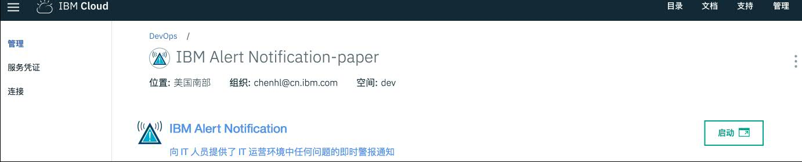

选择管理界面左侧的”管理”，点击右侧的”启动”可以进入服务配置和管理系统”IBM Agile Operations Management”，如图 2 所示。 从左到右依次有”管理通知策略”、”管理集成”、”警报查看器”、”现在谁在当值？”和”入门”菜单。

在本小节中，主要介绍如何发送你的第一个警报，我们只关注”警报查看器”。

图 2\. Alert Notification 服务配置和管理系统


回到服务实例管理界面，选择左侧的”服务凭证”，如果不能在右侧找到创建好的”凭证”，可以点击”新建凭证”创建一个新的凭证。

点开创建好的凭证，我们可以看到清单 1 所示内容：

##### 清单 1\. Alert Notification 服务凭证

```
{
    "url": "https://ans-us-south.opsmgmt.bluemix.net/api/alerts/v1",
    "name":
    "c6b0995d-d2b6-42ec-b6ee-7dcf87f8638f/b3906039-1458-4fd9-86db-23b20c33a6cb",
    "password": "iPt8+jLOCvtNSURICilO/9E5D09PVWFU",
    "swaggerui": "https://ans-us-south.opsmgmt.bluemix.net/docs/alerts/v1"
}

```

Show moreShow more icon

swaggerui 是系统内嵌的 swagger 工具的地址，我们可以用它来发送我们的第一个警报。

首先通过浏览器访问 swaggerui 的地址，按提示输入”凭证”中的用户名”name”和密码”password”。我们可以看到四个接口，如图 3 所示。

图 3\. Alert Notification swagger 工具

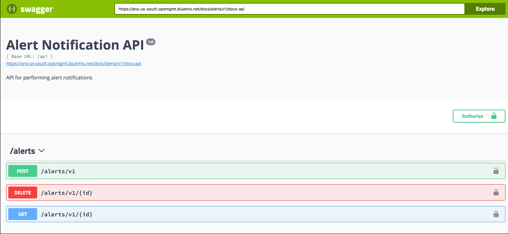

展开”POST”，点击”Try it out”，编辑”body”内容，使用示例模版”Example Value\|Model”，如清单 2 所示，并对其进行红色字体改动。

##### 清单 2\. 发送第一个警报

```

{
"Identifier": "string",
"What": "This is the first alert.",
"Where": "IBM Cloud",
"Severity": "Fatal",
"When": "Unknown Type: string, integer",
"Type": "Problem",
"Source": "string",
"ApplicationsOrServices": [
"string"
],
"URLs": [
{
"Description": "string",
"URL": "string"
}
],
"Details": [
{
"Name": "test",
"Value": "This is my first alert!"
}
],
"EmailMessageToSend": {
"Subject": "string",
"Body": "string"
},
"SMSMessageToSend": "string",
"VoiceMessageToSend": "string"
}

```

Show moreShow more icon

点击”Execute”。”Responses”显示具体的 Curl 命令和当前命令的执行结果。

命令执行成功之后，我们回到”警报查看器”，将会看到我们刚刚发送的警报。并可以对警报进行”确认”和”通知”等操作。到这里，我们完成了我们的第一个警报。

## 管理用户和组

在本小节中，我们将学习如何管理用户和组。

回到服务配置和管理系统”IBM Agile Operations Management”，我们可以看到在最上面有两个按钮”Alert Notification”和”管理用户和组”，点击他们可以切换不同的管理界面。在这里，我们点击”管理用户和组”，可以看到下面的菜单变成了”管理用户”和”管理组”，如图 4 所示。

图 4\. 切换管理用户界面

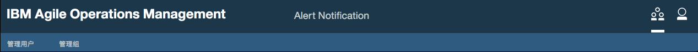

点击”管理用户”菜单，进入了用户管理页面，这里我们可以新建用户或编辑已经存在的用户。

点击”新建用户”，打开新建用户界面，如图 5 所示。

图 5\. 新建一个用户

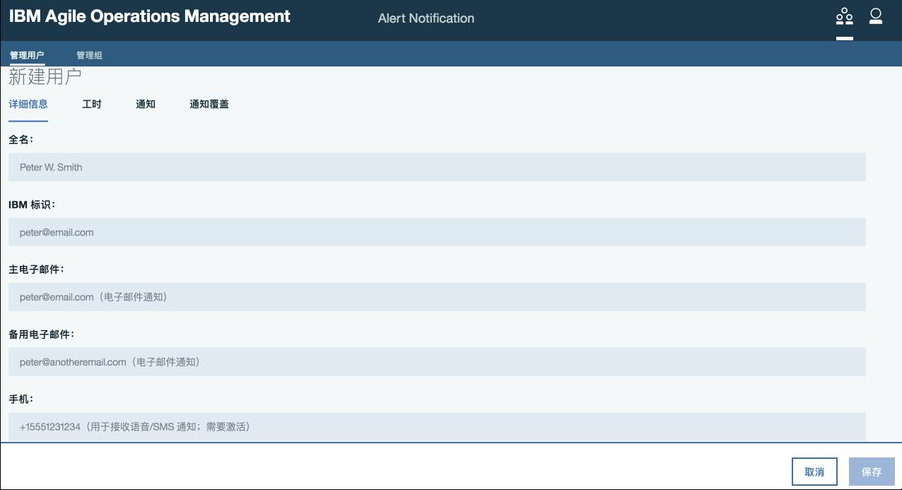

输入”用户名”、”IBMid”等信息，输入”电子邮件”和”手机号码”用于以不同方式接收警报信息，设置”用户角色”，勾选”发送欢迎邮件”，点击”保存”生成新用户。

电子邮件和手机号码需要验证后生效，在电子邮件验证过程中，点击验证邮件里的链接，输入 IBMid 登陆后完成电子邮件验证。在手机验证过程中，系统会给所添加的手机发送验码短信，输入验证码，激活成功后完成短信的验证。

点击现有用户名右侧的编辑图标，打开编辑用户界面，如图 6 所示。

图 6\. 编辑用户信息

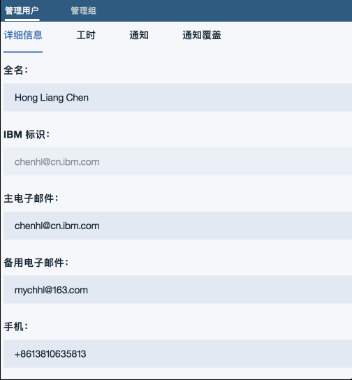

这里可以编辑用户的信息，点击”工时”菜单，配制当前用户的工作时间，点击”通知”菜单，配制当前用户的通知方式，点击”通知覆盖”添加例外的通知策略。对于通知策略的概念我们将会在下面章节中详细介绍。你也可以随时编辑用户信息。

回到”管理用户和组”界面，点击”管理组”菜单，就进入到组管理界面，我们可以新建组或编辑已存在的组。点击”新建组”，打开如图 7 所示界面。

图 7\. 新建一个组

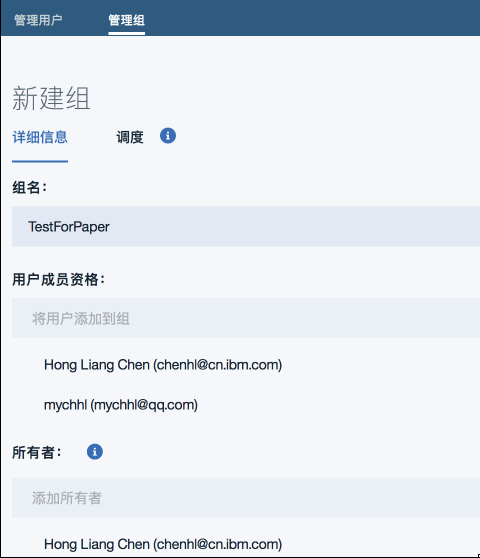

在详细信息中输入”组名”，添加”组成员”，添加”所有者”，在”调度”菜单中可以设置调度策略，这里不进行设置，我们会在后面的章节中详细介绍工作调度。保存新建的组。你也可以随时编辑组信息。

## 管理你的通知策略

在发送你的第一个警报一章，我们只能通过”警报查看器”查看和进行操作，通过本小节我们将学习如何管理你的通知策略，通过通知策略自动将警报通过多种方式通知相应的人。

回到服务配置和管理系统”IBM Agile Operations Management”，选择”管理通知策略”，通过点击”新建通知策略”创建你的第一个策略。如图 8 所示。

图 8\. 添加规则

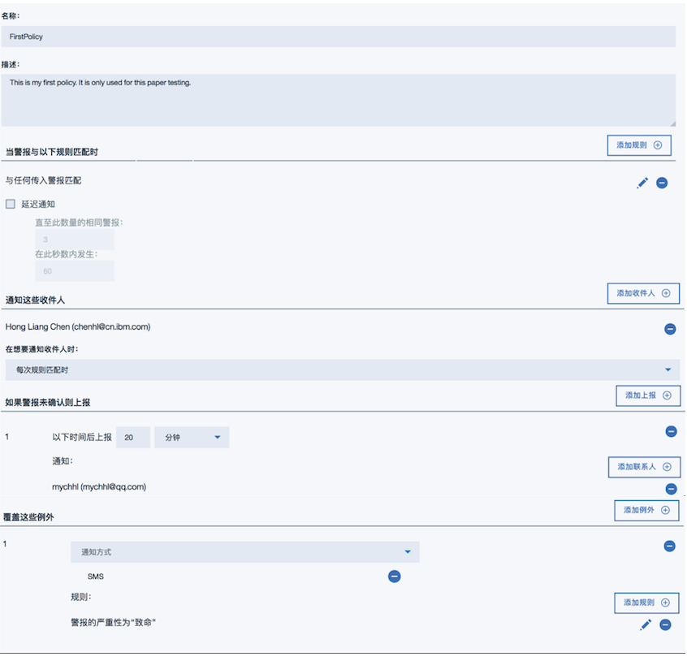

首先，输入策略”名称”、”描述”，点击”添加规则”，系统有”预定义规则”可以进行自由组合，用户也可以添加定制规则。在这里我们选择第一个预定义规则”与任何传入警报匹配”，并保存。可以勾选规则”延迟通知”。在这里我们就不选择”延迟通知”了，感兴趣的同学可以试试看。

然后，点击”添加收件人”。这里选择用户，也可以选择一个组进行警报通知，这里选择当前用户，保存。并选择通知策略为”每次规则匹配时”。

除此之外，我们还可以添加上报规则，点击”添加上报”，输入上报规则为 20 分钟，并添加联系人或联系组。通常上报联系人应当与警报收件人不同，所以在这里我们选择了另外一个用户。

最后，我们还可以”添加例外”，就是当出现满足例外规则的警报时使用例外规定的通知方式。这里我们定义了当规则为警报严重性为”致命”，通知方式为使用短信。

完成以上步骤我们就可以保存这个通知策略，并将列表中策略名称右边的右侧的”Enablement”拖动到”开启”，启用这个通知策略。

由于我们在”例外”里面使用了短信通知，这需要所通知的联系人事先配置移动电话号码。 配置方法见上一节的编辑用户信息。

这时我们可以回到 swaggerui，去发送一个 严重（critical）的警报，请看清单 3 示例：

##### 清单 3\. 发送严重警报

```

{
"Identifier": "string",
"What": "This is a critical alert.",
"Where": "IBM Cloud",
"Severity": "Critical",
"When": "Unknown Type: string, integer",
"Type": "Problem",
"Source": "string",
"ApplicationsOrServices": [
"string"
],
"URLs": [
{
"Description": "string",
"URL": "string"
}
],
"Details": [
{
"Name": "test",
"Value": "This is a critical alert!"
}
],
"EmailMessageToSend": {
"Subject": "A critical alert!",
"Body": "Hi, you received a critical alert!"
},
"SMSMessageToSend": "string",
"VoiceMessageToSend": "string"
}

```

Show moreShow more icon

发送成功后，检查”警告查看器”会发现警报被更新；检查 email，会发现收到了一封警报邮件！

然后我们回到 swaggerui，去发送一个致命（Fatal）的警报，请看清单 4 示例：

##### 清单 4\. 发送致命警报

```

{
"Identifier": "string",
"What": "This is a fatalalert.",
"Where": "IBM Cloud",
"Severity": "Fatal",
"When": "Unknown Type: string, integer",
"Type": "Problem",
"Source": "string",
"ApplicationsOrServices": [
"string"
],
"URLs": [
{
"Description": "string",
"URL": "string"
}
],
"Details": [
{
"Name": "test",
"Value": "This is a fatal alert!"
}
],
"EmailMessageToSend": {
"Subject": "A fatal alert!",
"Body": "Hi, you received a fatal alert!"
},
"SMSMessageToSend": " A fatal alert!",
"VoiceMessageToSend": " Hi, you received a fatal alert!"
}

```

Show moreShow more icon

发送成功后，检查”警告查看器”会发现警报被更新；检查手机，会发现收到了一条警报短信！

如果一个警报发出后没有在警报查看器里确认，超过规定的时间后，警报会上报到指定联系人。

## 管理集成

IBM Alert Notification 支持与其他 service 的集成，现在支持 New Relic，Runbook 和 Slack，同时还支持传入/传出的 Web 挂钩。

在本章节中，我们将学习如何创建传入的 Web 挂钩，并创建自己的警报模版。

点击”Alert Notification”回到服务配置和管理系统”IBM Agile Operations Management”，选择”管理集成”，点击”传入的 Web 挂钩”并点击”新建传入的 Web 挂钩”。打开如图 9 所示页面。输入”名称”，编辑自己的”警报模版”。这里我们可以使用系统提供的使用示例。点击右下角的”使用示例”我们可以得到警报模版和 JSON 样本，然后可以通过修改警报模版来创建适合自己的模版。

图 9\. 创建传入的 Web 挂钩

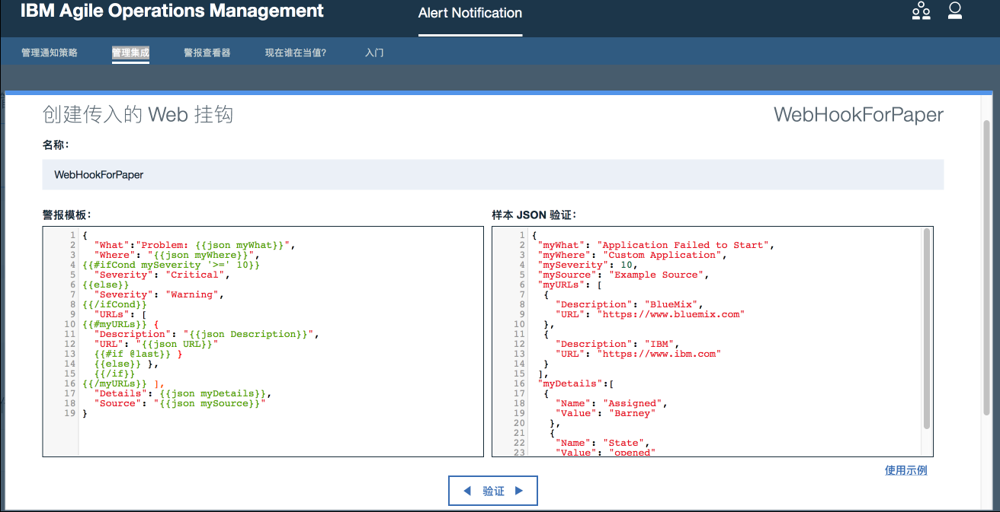

保存，我们会发现一个”传入的 Web 挂钩 URL”被创建出来。第三方的 Available Monitoring 服务就可以通过这个 URL 将警报传到 IBM Alert Notification。

点击”确定”，将”传入的 Web 挂钩”右侧的”Enablement”拖动到”开启”，这个传入的 Web 挂钩就可以用了。下面我们通过 Firefox 的 Poster 插件来做测试。如图 10 所示。

图 10\. 利用 Web 挂钩 URL 发送一个警报

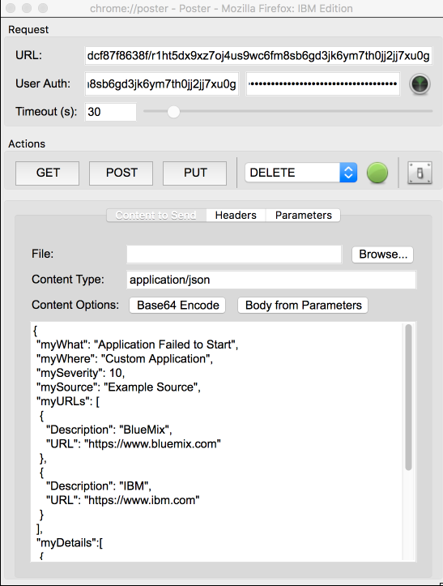

URL 是我们刚刚得到的”传入的 Web 挂钩 URL”；

User Auth 是服务实例凭证里面的”name”和”password”；

Content Type 是”application/json”；

内容是之前创建传入的 Web 挂钩示例”样本 JSON 验证”的内容。

点击 POST，警报将会被发到 IBM Alert Notification。

检查”警报查看器”我们可以看到这个新的警报， 我们也可以同时验证一下上节中的警报未确认上报的内容，如图 11 所示。

图 11\. 收到新的警报

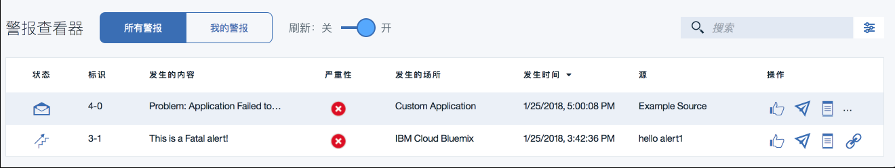

如上图所示，标识”4-0″的状态图标表示已经电子邮件通知，标识”3-1″的状态图标表示警报在规定时间没有确认，已经上报。

## 实现工作调度

工作调度实际上是组管理的一部分，在配置工作调度之前，首先要配置组成员的”详细信息”、”工时”、”通知”和”通知覆盖”。其中”详细信息”是配置当前用户基本信息，”工时”是设置当前用户的工作时间，”通知”是设置当前用户的通知策略，”通知覆盖”是设置当前用户的例外规则。

当我们配置好用户和组之后，就可以打开组管理，选定”组”，点击”编辑”，然后选择”调度”，并选择了调度模式之后，我们会看到如图 12 所示界面。

图 12\. 编辑组调度界面

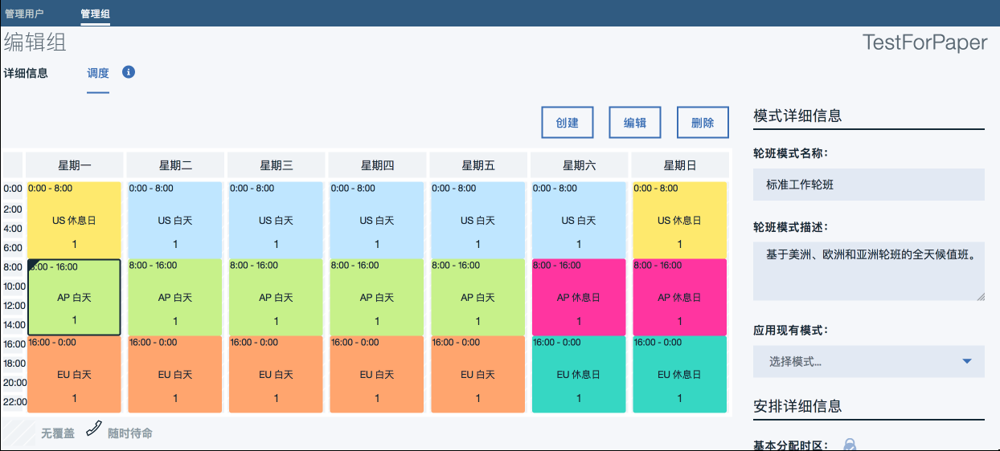

页面右侧是调度模式的详细信息，系统提供了一些内置的模式可供选择，默认的是标准工作轮班，基于美洲，欧洲和亚洲的全天候值班。选择模式后，页面左侧显示调度表，表上面有”创建”、”编辑”和”删除”三个按钮，是用来修改轮班模式的，比如我们可以通过选定周一的亚洲时间段进行编辑，将工作时间调整为 08:00～12:00.并在 12:00-14:00 创建新的轮班，然后我们看到原来的 AP 白天分为了两个时间段，我们还可以指定这一时间段的轮班类型，”值班”还是”随时待命”

然后我们可以给我们修改好的模式起个名字，保存一下，选择创建新的模式。当我们再次打开调度配置的时候就会看到这个新模式。

选择好我们的轮班模式后，就可以点击页面下面的”调度分配”，去设置具体的值班情况，如图 13 所示。

图 13\. 调度人员分配界面

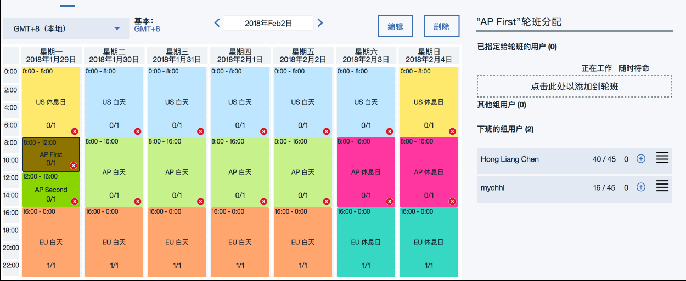

上图中我们可以选中同一颜色的时间段去分配相应的值班人员，点击右边相应人员的+号或者将相应人员拖到虚线框里就可以设置值班人员。完成设置后点击”保存”就可以了。

这时我们就可以返回”管理通知策略”，去修改我们通知策略，将收件人改为相应的组，这样就实现了工作调度。

## 与移动设备的集成

本节中我们将使用 IBM Alert Notification 移动应用程序与 IBM Cloud Alert Notification 实例同步。在 iOS 或 Android 设备的应用商店中下载 IBM Alert Notification 应用程序，并安装它 。打开应用程序，我们看到登陆 IBM Alert Notification 首先需要预定这个应用程序。如图 14（左）所示。

找到我们添加用户后所收到的欢迎邮件，点击里面的链接，在浏览器打开，用 IBMid 登陆后，显示如图 14（中）界面，点击”添加对移动应用程序的预定”，显示图 14（右）界面，然后”轻触以下某个实例”选择 IBM Cloud 上的 Alert Notification 实例名（实例凭证中的”name”）即可完成应用的登陆以及实例的连接。

图 14\. IBM Alert Notification 应用程序登陆和实例连接

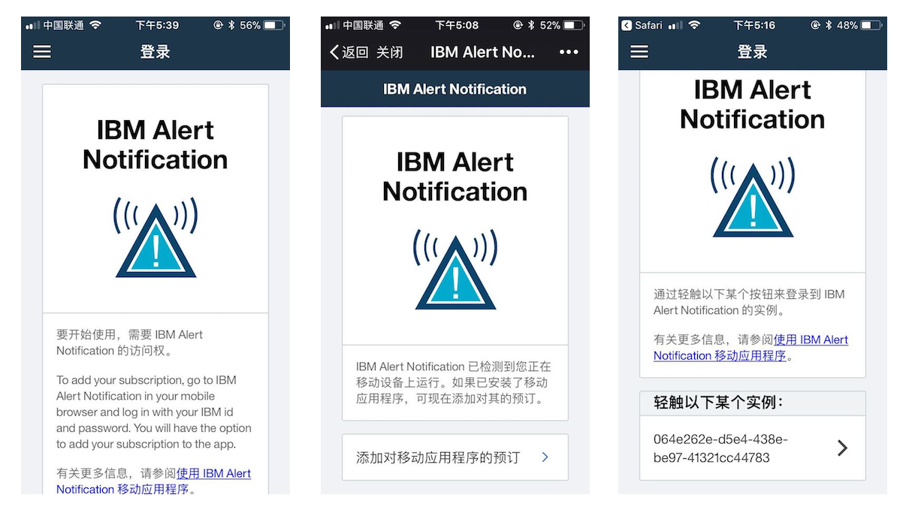

重新打开 IBM Alert Notification 应用程序，我们看到警报概述页面，并且已经与 IBM Cloud Alert Notification 服务同步，这里显示了我们所收到的所有警报信息，如图 15（左）所示。与服务配置和管理系统”IBM Agile Operations Management”中的”警告查看器”相同。可以在”我的警报”和”所有警报”之间切换。

图 15\. IBM Alert Notification 应用程序接收警报

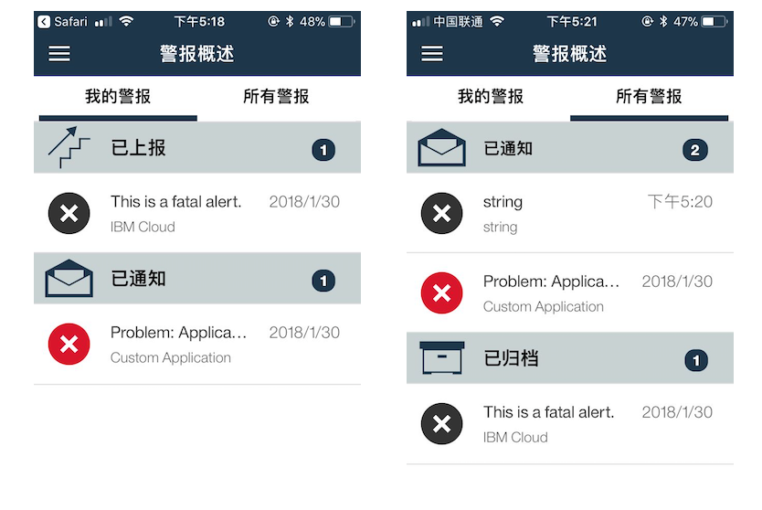

利用 swaggerui 发送一个新的警报，发送成功后，检查”警告查看器”会发现警报被更新；检查手机 IBM Alert Notification 应用程序，会发现出现了一条新的警报信息！如图 15（右）所示。

点击一条警报信息，打开警报内容页面，可以点击”确认”按钮，确认警报。此时看到警报状态显示为”已确认”，向下拖动可以查看警报的历史记录。警报内容和警报确认过程如图 16 所示。

图 16\. 警报内容与警报确认

在 IBM Alert Notification 应用程序的左上角的菜单中，你还可以选择”已上报”、”已通知”和”已确认”，切换不同的视图对警报进行查看。

## 结束语

本文详细介绍了在 IBM Cloud 上，使用 Alert Notification 服务实现发送通知，管理通知策略，定制警报模版，管理用户和组，实现工作调度等各种功能，以及 IBM Alert Notification 与移动设备的集成。相信可以为 IBM Alert Notification 用户提供更直观的了解和可操作性指导。