# 利用 IBM Cloud ToolChain 集成工具构建部署应用到 Kubernetes 集群
简化客户对应用的操作和管理

**标签:** DevOps

[原文链接](https://developer.ibm.com/zh/articles/d-using-the-ibm-cloud-toolchain-integration-tool-to-kubernetes-clusters/)

杨晓蓓, 王兴华, 王璐

发布: 2018-03-14

* * *

## 概述

在 IBM Cloud Kubernetes 系列的第一篇文章中，详细介绍了如何利用 IBM Cloud ToolChain 集成工具的 Eclipse Orion Web IDE，并针对项目进行需求分析以及代码制作。本文在此基础上，介绍如何利用 IBM Cloud ToolChain 集成工具将我们的应用部署到 Kubernetes 集群中，如何利用 ToolChain 集成工具管理应用，以及在 Kubernetes 控制台中如何针对负载均衡和应用伸缩做出相应的配置。

## 相关核心概念简介

### Kubernetes

Kubernetes 是一款开源的容器编排工具。它能够保证基于容器的应用程序运行在集群中正确的主机上，并且能够保证客户端的大量请求均匀的分布在集群中的各个节点上，同时还能够根据客户端请求数量的高低来动态调整容器的数量。

1. Pod：它是调度的最小单元。在 Kubernetes 中 Pod 指的是一组容器，它们一起工作并且统一对外提供一个或一组相同的功能。
2. Node 节点：指的是集群中的主机，Pod 运行在 Node 节点之上。由 Kubernetes 来决定选择备选节点，从而保证节点能够满足 Pod 中容器的资源需求。
3. Service 服务：服务是逻辑概念的一组 Pod（也称为 Replicas 副本）。这组 Pod 提供了相同的功能，但是客户端直接访问 Pod 及其副本的话会产生很强的耦合性，达不到负载均衡的目的。所以客户可以直接访问服务，并不直接访问 Pod，也就是说服务的出现，解除了客户端和 Pod 的耦合度。
4. Replica 副本：每个服务实例都提供了一个 标签选择器，用于标识与当前服务相关联的 Pod 的 Replica 副本。客户端访问服务时，调度器使用标签选择器来为客户的请求选择正确的服务。
5. Replication 控制器：通过保证运行的副本数量来达到负载均衡的目的。如果某一个副本死掉，控制器会自动创建新的副本，相反，如果副本数量过多，控制器会自动关闭相应数量的实例。

### IBM Cloud Continuous Delivery 服务和 ToolChain

IBM Cloud Continuous Delivery 服务支持 DevOps 工作流程，提供了用于自动构建和部署应用程序的集成开放式工具链（Toolchain）来支持开发、部署和操作任务的工具集成。更多细节请参考 IBM Cloud 文档。

ToolChain 是一组集成工具，可用于以协作方式开发、构建、部署、测试和管理应用程序，并使得操作可重复使用且更易于管理。Continuous Delivery 服务提供多种工具链模版以满足不同需要。

## 需要做的准备工作

1. IBM Cloud 帐户。如果您还没有 IBM Cloud 帐户，可以先注册一个 [免费试用](https://cocl.us/IBM_CLOUD_GCG) 帐户。
2. 安装 [Cloud Foundry CLI](https://github.com/cloudfoundry/cli#downloads)

    **Cloud Foundry CLI 是** [Cloud Foundry](https://cloudfoundry.org/) **的官方命令行客户端**

3. 安装 [IBM Cloud CLI](https://cloud.ibm.com/docs/cli?topic=cloud-cli-getting-started)

## 第 1 步：在 IBM Cloud 上创建 Kubernetes 集群

打开 IBM Cloud 控制台左上角的菜单，选择 Containers，点击创建一个新的集群，选择集群类型，输入集群名称，集群创建需要一段时间，创建完成后会显示 Ready 状态。如图 1 所示。

##### 图 1\. 创建 Kubernetes 集群

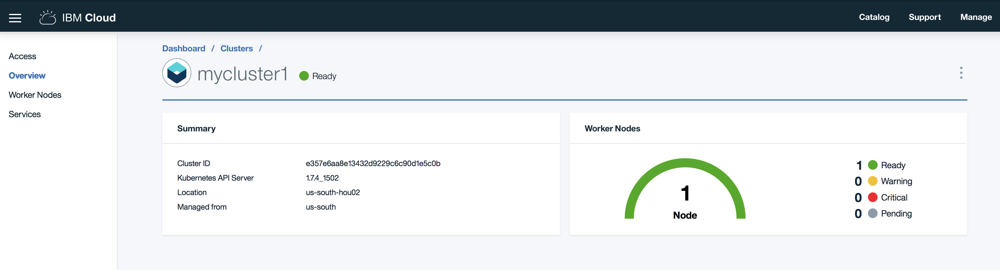

## 第 2 步：在 IBM Cloud 上创建 ToolChain 集成工具

打开 IBM Cloud 控制台左上角的菜单，选择 DevOps，进入 Toolchains 页面。如果是第一次使用 Toolchain，需要先创建 Continuous Delivery 服务实例。然后开始使用该服务提供的 Toolchain 集成工具。

点击创建一个新的 Toolchain，进入 Toolchain 模版页面，这里列出了适用于不同应用和不同部署方式的预定义好的模版。本文需要部署 Docker 应用到 Kubernetes 集群上，所以选择 Secure container toolchain (v2)模版，创建 Toolchain。如图 2 所示。

##### 图 2\. 选择 Toolchain 模板

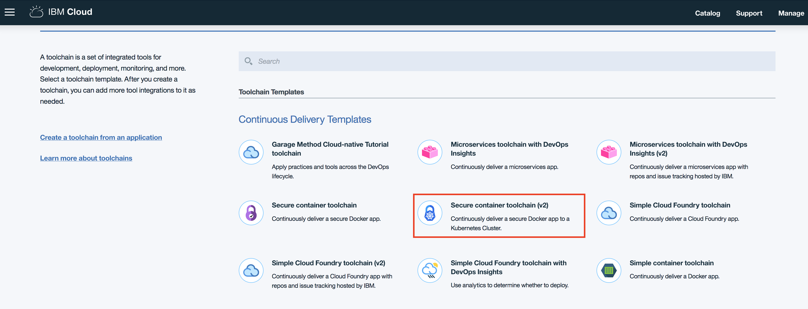

打开创建 Toolchain 的页面进行参数设置。首先点击 Git Repos and Issue Tracking 图标，因为我们在 Kubernetes 系列第一篇文章中已经利用 Eclipse Orion Web IDE 编写好了应用源代码，所以这里需要将 Git Repository 指定到已经存在的 Git Repository URL。如图 3 所示：

Repository Type=Existing

Repository URL=准备好的应用程序的 Git Repository URL

##### 图 3\. 设置 Git Repository

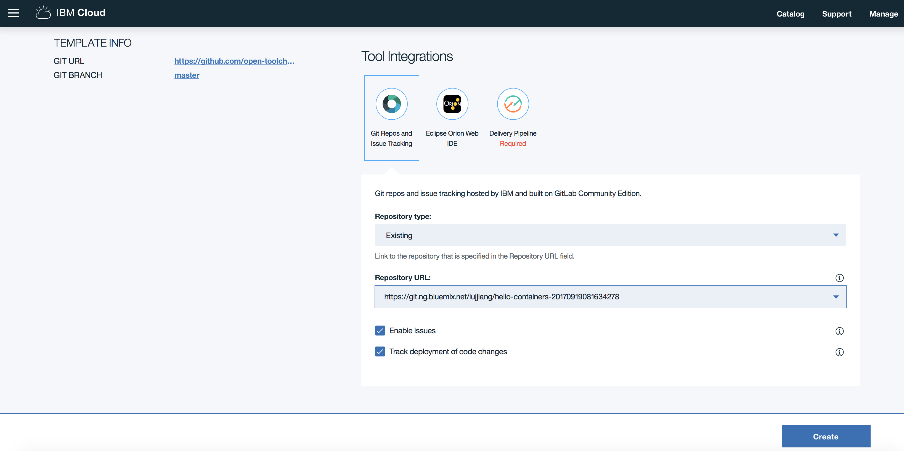

当然在其他情况下你也可以选择其他 Repository 类型的选项，比如创建一个新的空 Repository，选择 New；或者使用示例 Repository 创建新的 Repository，选择 Clone。

然后点击 Delivery Pipeline 图标，设置应用的名称，选择 IBM Cloud API Key（请注意，此处的 API Key 必须事先创建好，具体创建方式请参照 [创建 API Key](https://cloud.ibm.com/docs/iam?topic=iam-userapikey#creating-an-api-key) ），并输入第 1 步创建好的集群名称，如图 4 所示。点击创建。

##### 图 4\. 设置 Delivery Pipeline

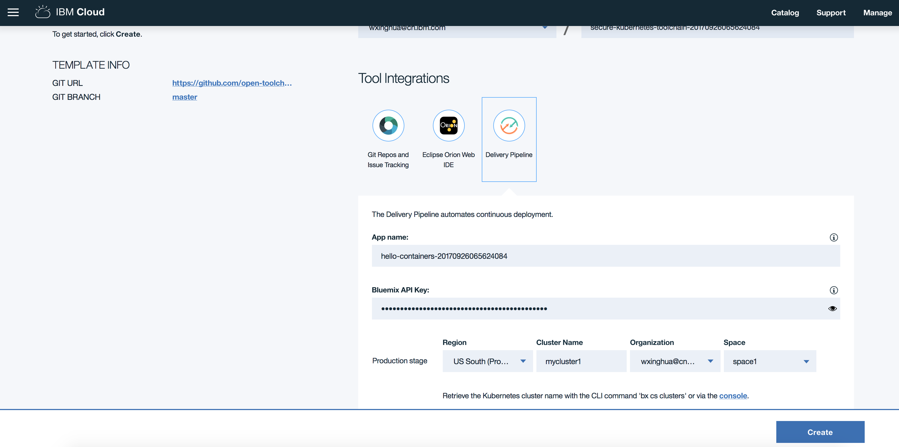

创建完成后，打开创建好的 Toolchain，如图 5 所示。我们看到 CODE 阶段是在 Kubernetes 系列第一篇文章中介绍的如何把设计变成代码，本篇则要继续介绍 DELIVER 阶段，部署并运行代码。使用 Toolchain 集成工具完成整个开发、部署应用的流程。

##### 图 5\. Toolchain 工具及流程图

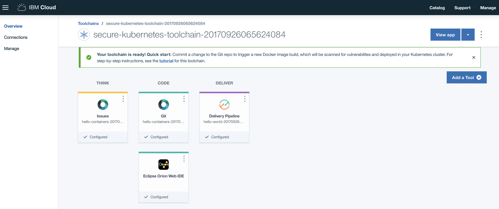

## 第 3 步：利用 Delivery Pipeline 将应用部署到 Kubernetes 集群上

点击 Toolchain 上的 Delivery Pipeline 图标，可以看到模版预定义好的三个阶段：Build，Validate，Deploy。这里重点介绍 Build 和 Deploy 阶段。

点击 Build 上的编辑图标，可以看到它的输入是应用的 Git Repository 链接，在工作页面定义了 Build 的目标和名称等参数，使用默认值，不需要任何修改。Build 脚本里可以看到在 Build 阶段将要完成的主要工作为将应用的代码转化为集群上所使用的 Image。

点击 Build 上的运行图标，等待运行完成，Build 阶段图标变成绿色，自动进入下一个 Validate 阶段继续运行。

Build 完成后可以检查运行结果，使用 bx 命令行，运行 bx cr images 可以看到新创建的 Image，运行结果如图 6 所示。

##### 图 6\. Build 后查看生成的 Image

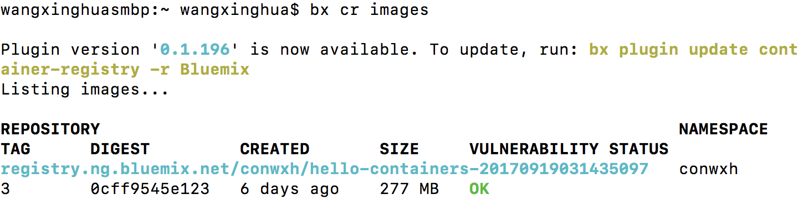

然后点击 Deploy 上的编辑图标，可以看到它的输入是 Build 阶段的结果，在工作页面定义了 Deploy 的目标集群，和 API Key 等，这些都是创建 Toolchain 时我们所添加的值，不需要进行任何修改。Deploy 脚本里可以看到 Deploy 阶段将要完成的主要工作是根据应用中 deployment.yml 的定义，将 Image 部署到集群上。

Deploy 阶段会在上一个阶段完成后自动运行，等待运行完成，当 Deploy 阶段图标变成绿色，代表当前的部署已经完成。

在任何一个阶段，如果出现错误，都可以点击”View logs and history”来查看当前步骤对应的的运行日志以定位导致错误的原因，如图 7 所示。

##### 图 7\. Delivery Pipeline 阶段执行结果

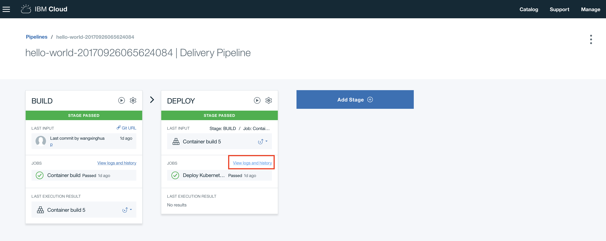

## 第 4 步：访问并验证应用

当 Build 和 Deploy 都成功以后，在日志的最后显示了该应用部署成功后对应的访问链接，本文中应用示例对应的链接为 `http://184.173.5.215:32588`。

打开应用，检查是否运行正常。我们可以看到图 8 中，Kubernetes 系列第一篇文章中所开发的应用在 Kubernetes 集群上已经可以成功运行了。

##### 图 8\. 通过链接访问应用

## 第 5 步：在 Kubernetes 控制台上查看应用的运行情况

在 IBM Cloud 上打开我们第 1 步创建的集群的 Access 页面，参照上面的步骤，用命令行登陆 IBM Cloud，设置 Kubernetes 集群，然后启动 Kubernetes 控制台，如图 9 所示。

##### 图 9\. 运行命令设置并启动 Kubernetes 控制台

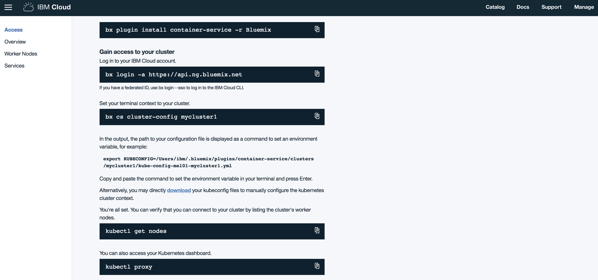

访问启动的 Kubernetes 控制台链接 [http://127.0.0.1:8001/ui](http://127.0.0.1:8001/ui) ，在控制台的 Overview 页面，我们可以看到应用在 Kubernetes 集群上的部署情况，如图 10 所示。

##### 图 10\. 查看 Kubernetes 控制台

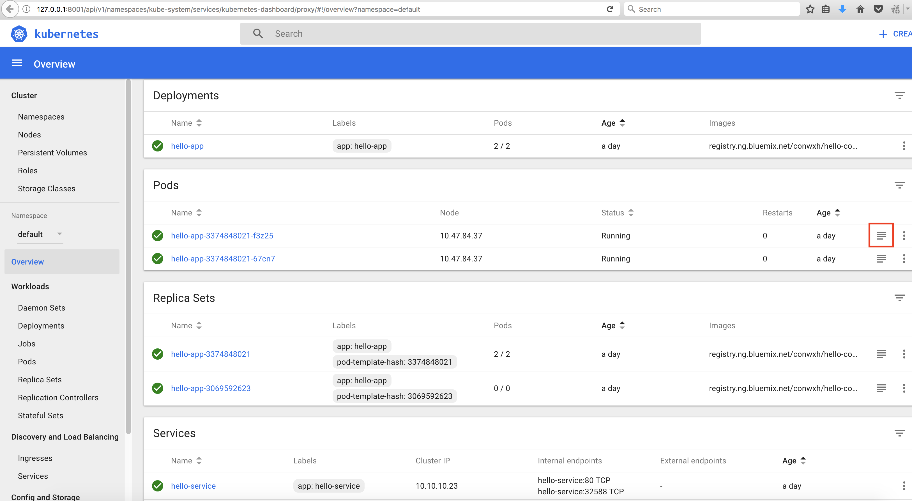

查看应用运行状态良好，在 Pods 区域，点击应用右边的菜单项，可以看到应用输出的日志。

## 第 6 步：在 Kubernetes 控制台上对所部署的应用进行配置

Kubernetes 集群可以通过 Pod 的设置来实现应用伸缩和负载均衡的目标。我们增加 Pod 的个数来满足应用规模增长的需求。具体操作是，点击 Kubernetes 控制台左边的 Deployment 链接，找到应用记录，点击最右边的图标，在展开的菜单里，选择 Scale 操作，可以增加预设的 Pod 数量。如图 11 所示。

##### 图 11\. Kubernetes 控制台配置 Pod 数量

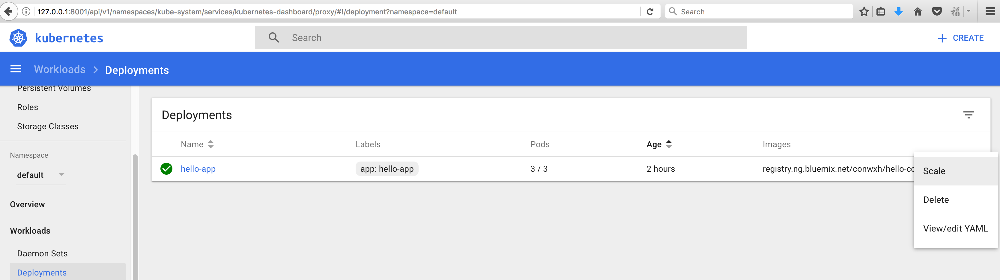

设置后，点击控制台的 Pods 菜单，可以看到所修改的应用对应的 Pod 已经自动增长为 3 个。

系统运行时可能会有意外情况发生宕机，我们删除一个 Pod 模拟 Pod 意外损坏的情况。这时没有损坏的 Pod 继续工作，而且自动生成一个新的 Pod 从而达到预设的 Pod 数量，如图 12 所示。

##### 图 12\. Kubernetes 控制台 Pod 配置界面

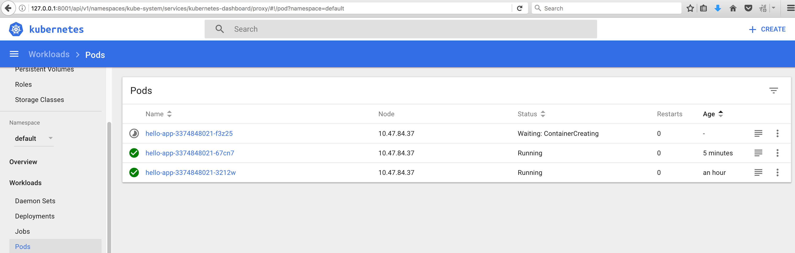

## 结束语

本文详细介绍了如何通过 IBM Cloud ToolChain 集成工具来部署应用到 Kubernetes 集群之中，并通过 Kubernetes 控制台对应用进行管理，并通过一个简单的应用示例展示了整个部署管理的过程。ToolChain 集成工具的使用简化了客户对应用的操作和管理，而 Kubernetes 集群负责了应用在容器中的调度、对客户端请求的负载均衡以及应用的弹性伸缩。在本文的基础之上，客户可以继续将 Availability Monitoring 服务也集成到 ToolChain 中，利用该服务来保证应用始终保持稳定运行，并且持续检测系统的性能，以达到在性能问题影响到客户之前修复它。

## 参考资源

- 访问 [IBM Cloud Forum](https://developer.ibm.com/answers?community=bluemix) ，在论坛中讨论 IBM Cloud 相关的问题
- 访问 [IBM Cloud 专栏](http://www.ibm.com/developerworks/cn/cloud/bluemix/) ，在这里您可以获得最新最实用的 IBM Cloud 资讯和技术资源。
- 访问 [IBM Cloud CLI](https://cloud.ibm.com/docs/cli?topic=cloud-cli-getting-started) 了解如何创建和管理容器的集群
- 访问 [Kubernetes 文档](https://kubernetes.io/docs/home/) 了解 Kubernetes 具体的功能和操作