# 利用 IBM SPSS Modeler 整合不同数据库之间的数据
IBM SPSS Modeler 上手

**标签:** IBM SPSS Modeler,分析

[原文链接](https://developer.ibm.com/zh/articles/ba-1403spssintegrate/)

梁 二强, 朱 维博, 吴 邻燕

发布: 2014-03-18

* * *

## 简介

由于目前企业客户的业务量和数据量都在不断的提高，随着企业的发展，很多企业的数据存储都不局限于同一个数据库上，如果要对这些存储在不同数据库上的数据进行处理和建模，就需要将这些存储在不同数据库之间的数据进行有效的整合，本文将介绍通过 IBM SPSS Modeler 如何对不同数据库之间的数据进行整合，然后进行建模处理。

## IBM SPSS Modeler 介绍

IBM SPSS Modeler 是 IBM 在分析与预测领域解决方案的重要组成部分，它是一组数据挖掘工具，通过这些工具可以采用商业技术快速建立预测性模型， 并将其应用于商业活动，从而改进决策过程。Modeler 的界面如图 1 所示：

##### 图 1\. IBM SPSS Modeler 界面

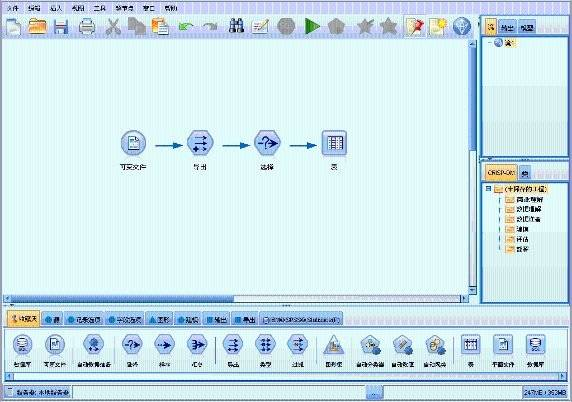

IBM SPSS Modeler 通过节点对数据进行处理，然后将这些节点连接起来，就形成了对数据处理的一系列过程，我们将这一过程称为数据流。也可以说 IBM SPSS Modeler 是以数据流为驱动的产品，这一系列节点代表要对数据执行的操作，而节点之间的链接指示数据的流动方向。IBM SPSS Modeler 将节点分为如下几种类型：

- 源：此类节点可将数据导入 IBM SPSS Modeler，如数据库、IBM SPSS Analytic Server 数据源、文本文件、SPSS Statistics 数据文件、Excel、XML 等。
- 记录选项：此类节点可对数据记录执行操作，如选择、排序、抽样、合并和追加等。
- 字段选项：此类节点可对数据字段执行操作，如过滤、导出新字段和确定给定字段的测量级别等。
- 图形：此类节点可在建模前后以图表形式显示数据。图形包括散点图、直方图、网络节点和评估图表等。
- 建模：此类节点可使用 IBM SPSS Modeler 中提供的建模算法，如神经网络、决策树、贝叶斯网络、聚类算法、支持向量机、和数据排序等。
- 输出：节点生成数据、图表和可在 IBM SPSS Modeler 中查看的模型等多种输出结果。
- 导出：节点生成可在外部应用程序（如 IBM SPSS Data Collection、数据库、XML、IBM SPSS Analytic Server 数据 或 Excel）中查看的多种输出。
- IBM SPSS Statistics：节点将 IBM SPSS Statistics 数据导入或导出为 SPSS Statistics 数据，以及运行 SPSS Statistics 提供的功能。

## IBM SPSS SDAP 介绍

### 1\. SDAP 的安装

IBM® SPSS® Data Access Pack（简称 SDAP）是在 Modeler 的安装盘附带的 ODBC 驱动程序，运行 setup.exe 文件以启动驱动程序安装，并选择所有相关的驱动程序即可。安装的 SDAP 必须和你使用的 Modeler Server 在同一台机器，也就是说如果你使用本地的 Modeler Server, 那么就安装在 Modeler Client 所在的机器，如果使用的 Modeler Server 和 Modeler Client 不在同一台机器，那么就需要安装在 Modeler Server 所在的机器。

##### 图 2\. SDAP 的安装

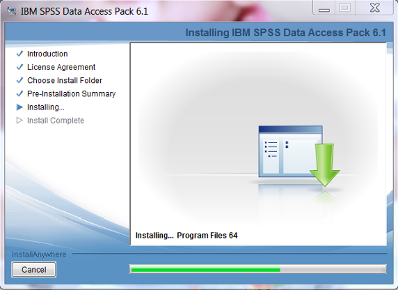

### 2\. 创建 ODBC

这里以 Windows 7 为例，装好 SDAP 驱动后，从“开始”菜单中选择所有程序，选择管理工具，选择数据源 (ODBC)，在打开 的对话框中选择系统 DSN 选项卡，然后单击添加，在打开的对话了狂选择要添加的数据库的驱动，如图 3 所示：

##### 图 3\. 选择驱动

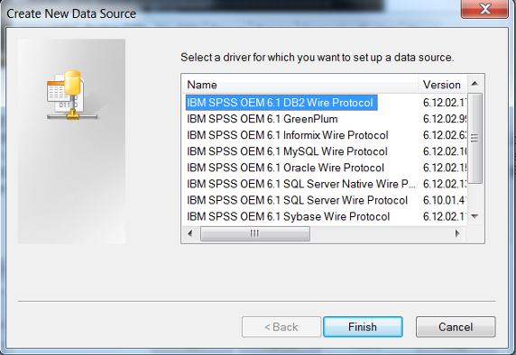

点击完成按钮后，配置数据库的信息，对于不同的数据需要输入不同的信息，本文将以主流的 IBM DB2、Oracle 和 SQL Server 为例。如图 4 所示：

##### 图 4\. 创建 DB2 ODBC

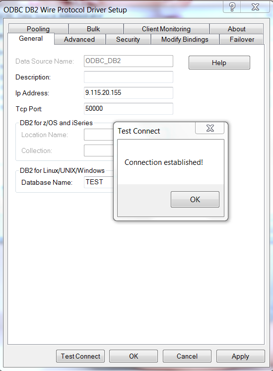

在 “ODBC DB2 Wire Protocol 驱动程序设置”对话框中需要指定如下内容：

- 数据源名称（指定一个 ODBC 的名字）；
- IP 地址，指定 DB2（Oracle，SQL Server） RDBMS 所在服务器的主机名或者 IP 地址；
- TCP 端口 ( 对于 DB2，默认是 50000，Oracle 是 1521，SQL Server 是 1433)；
- 数据库的名称（指定需要连接的数据库）；

点击“测试连接”后，输入要连接数据库的用户名和密码，然后单击确定按钮。此时会显示“连接已建立！”的消息，说明配置成功。

对于 Oracle 数据库来说，如图 5 所示：

##### 图 5\. 创建 Oracle ODBC

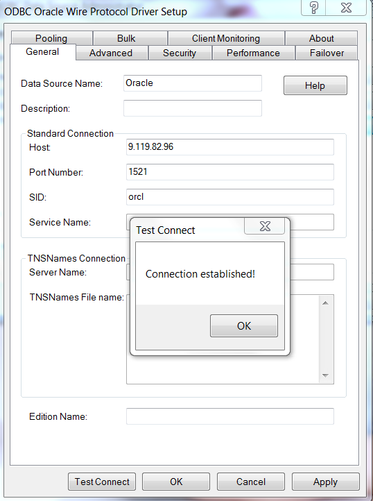

对于 SQL Server 数据库如图所示：

##### 图 6\. 创建 SQL Server ODBC

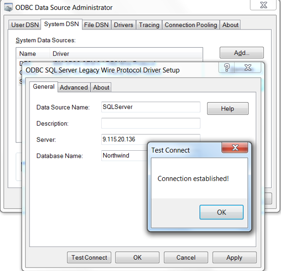

## 利用 IBM SPSS Modeler 数据库源节点获取数据

### 1.获取数据

打开 IBM SPSS Modeler 客户端，点击左下角的 Server 按钮，选择要连接的 Modeler Server，这里需要说明的就是如果你的 SDAP 装在和 Modeler Client 在一台机器，那么就选择 Local Server， 如果不在同一台机器，而是和单独的 Modeler Server 装在一台机器，就选在添加按钮，输入机器的主机名或者 IP 地址，设置登录的用户名和密码，点击完成按钮，如图 7 所示：

##### 图 7\. 连接 Modeler Server

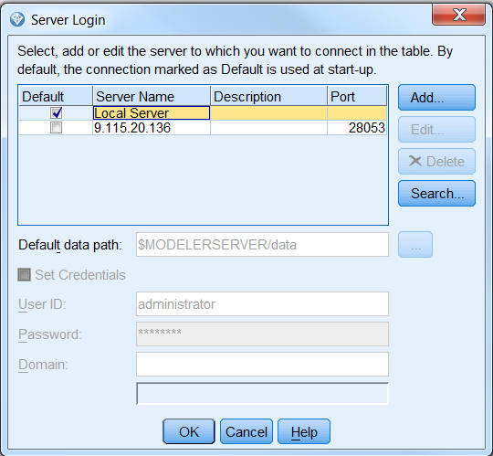

连接上 Modeler Server 之后，在源选项双击数据库节点，然后就可以添加数据库源节点到数据流工作区，双击节点，在数据项选择添加一个数据库连接，然后 Modeler Client 会将 Modeler Server 所在机器的所有 ODBC 查询出来，找到需要连接的数据库连接信息，输入用户名和密码后，点击连接按钮，选择完成然后进入选择表，这里以 SQL Server 为例，如图 8 所示：

##### 图 8\. 添加数据库连接

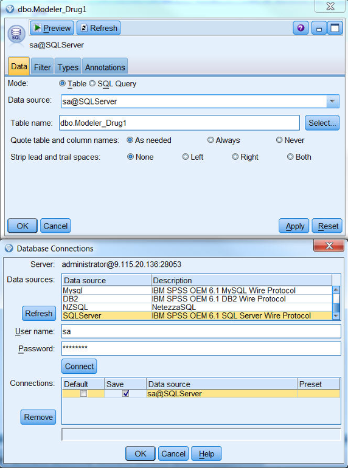

点击完成按钮后，在表名列点击选择按钮，选择表名，这里我们以 dbo.Modeler\_Drug1 为例，如图 9 所示：

##### 图 9\. 选择表名

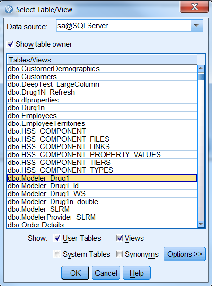

选择表后，节点自动读取表结构，如图 10 所示：

##### 图 10\. 来自 SQL Server 的数据

用同样的方法再添加两个数据库节点，选择 ODBC 为 DB2 和 Oracle， 输入用户名和密码之后，就可以选择要读取数据的表名了。这样就完成了用 Modeler Client 读取数据库数据的操作，然后要进行的就是对数据的处理。

首先我们利用 Modeler 的 Merge 节点对 DB2 和 Oracle 中的两张表的数据进行合并，处理后的结果是我们得到的数据一部分来自 DB2 数据库，一部分来自 Oracle 数据库。对于来自 Oracle 数据库的数据，我们取 3 个字段的值，如图 11 所示：

##### 图 11\. 来自 Oracle 的数据

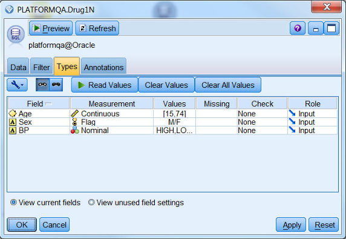

对于来自 DB2 数据库的数据，我们取 4 个字段，如图 12 所示：

##### 图 12\. 来自 DB2 的数据

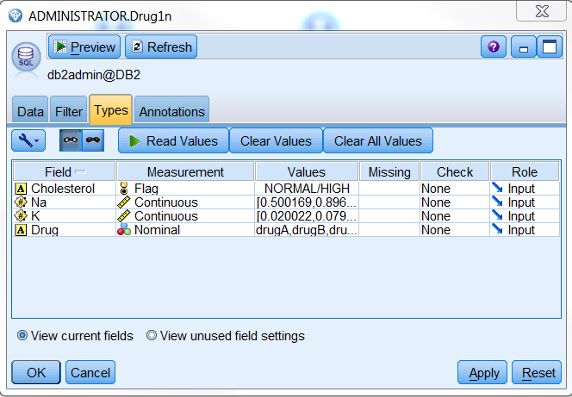

### 2.数据处理

双击记录选项中的 Merge 节点，然后将 DB2 和 Oracle 两个节点与之连接，双击 Merge 节点，可以看到处理后的数据包括来自 DB2 和 Oracle 的 7 个字段，如图 13 所示：

##### 图 13\. Merge 后的数据

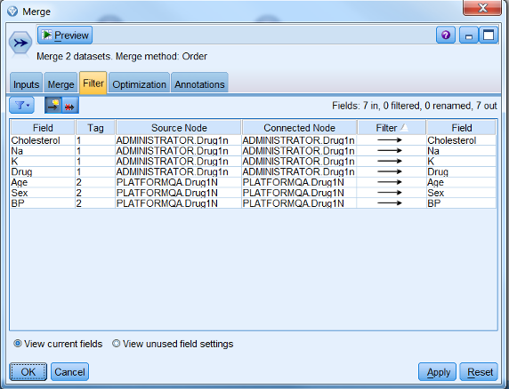

然后我们需要通过 Modeler 的 Append 节点将 Merge 后的数据追加到来自 SQL Server 数据库的数据。双击记录选项中的 Append 节点，在流工作区中将 Merge 节点和 SQL Server 数据源节点与之连接，这样得到的就是来自三个数据库的数据了。如图 14 所示：

##### 图 14\. Append 后的数据

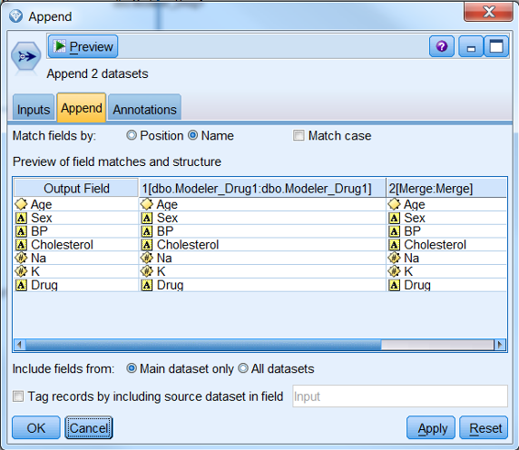

我们还可以通过 Modeler 的其他节点对数据进行进一步的处理，比如通过选择节点，可以设置条件来选择我们需要的数据，或者通过排序节点对某几个列进行排序等等，这里就不详细介绍了。

### 3.建模

最后要做的就是对处理过的数据进行建模了，首先我们需要设定一个 Target 列，也就是需要预测的列。我们通过 Modeler 的 Type 节点设置 Target 列，在字段选项双击 Type 节点，在流工作区中将 Append 节点与之连接，双击 Type 节点，修改 Drug 列的角色为 Target，其他默认为 Input，如图 15 所示：

##### 图 15\. 设置 Target 列

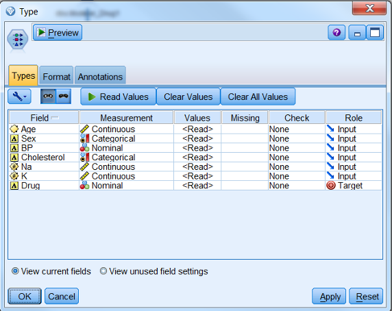

然后就是选择我们要使用的模型了，这里以神经网络为例，在模型选择中双击神经网络节点，在流工作区中将 Type 节点与之连接，打开神经网络节点，可以看到我们是通过所有的角色为 Input 的列来预测觉得为 Target 的列，当然我们可以在这里修改 Input 和 Target，我们将年龄的角色从 Input 修改为 Target，如图 16 所示：

##### 图 16\. 设置 Input 和 Target

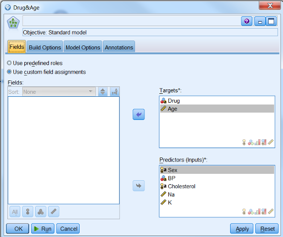

点击运行按钮，生成一个新的模型块，该模型块会被自动连接在流工作区，并带有指向创建它的建模节点的链接。要查看模型的详细信息，右键单击模型块并选择浏览（在模型选项板上）或编辑（在工作区上）。如图 17 所示：

##### 图 17\. 包含模型块的流

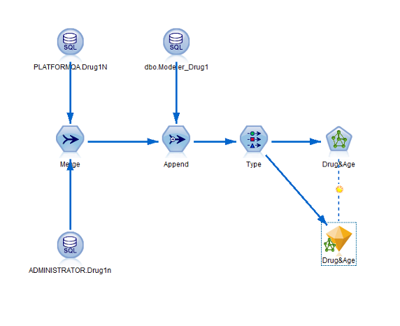

双击打开生成的模型块，可以看到哪些值对预测结果的影响最大，线条宽深说明影响越大，如图 18 所示：

##### 图 18\. 预测变量的重要性

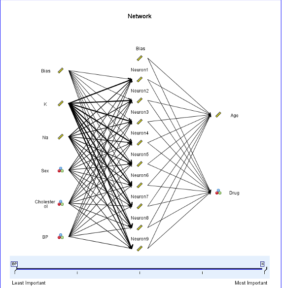

## 4.模型评估

建模完成后，需要评估模型的准确度，就是对一些记录进行评分，我们这里用原始数据进行评估，并将模型预测的结果与实际结果进行比较。如图 19 所示：

##### 图 19\. 包含输出的流

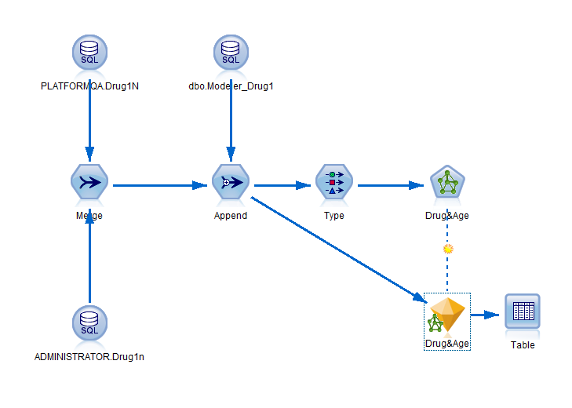

要查看分数或预测值，如上图将表节点连接到模型块，双击表节点，然后单击运行。可以从表中看到，模型创建了两个名为 $N-Age 和 $N-Drug 的字段，用来显示预测值。

## 结束语

本文通过图文详细介绍了如何通过 Modeler 的数据库源节点获取不同数据库中的数据，然后对数据进行合并、追加，最后进行建模的过程。而对于 Modeler 来说，还有非常强大的数据获取功能和数据处理功能，这里就不做过多介绍了，希望本文对大家有所帮助。