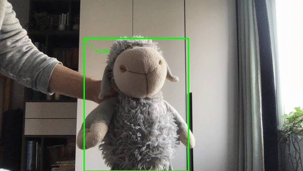
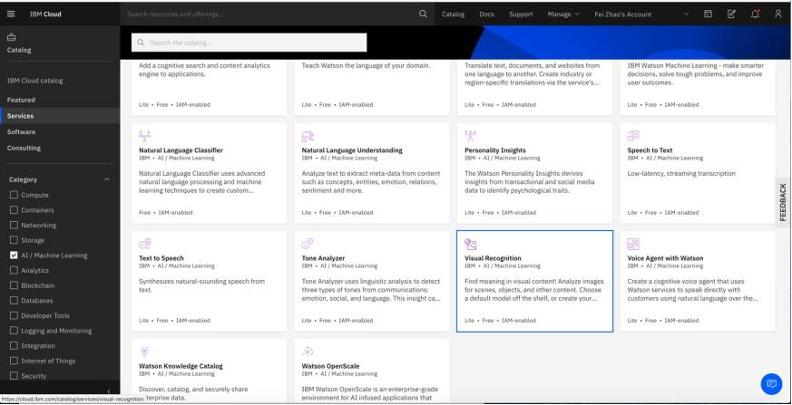
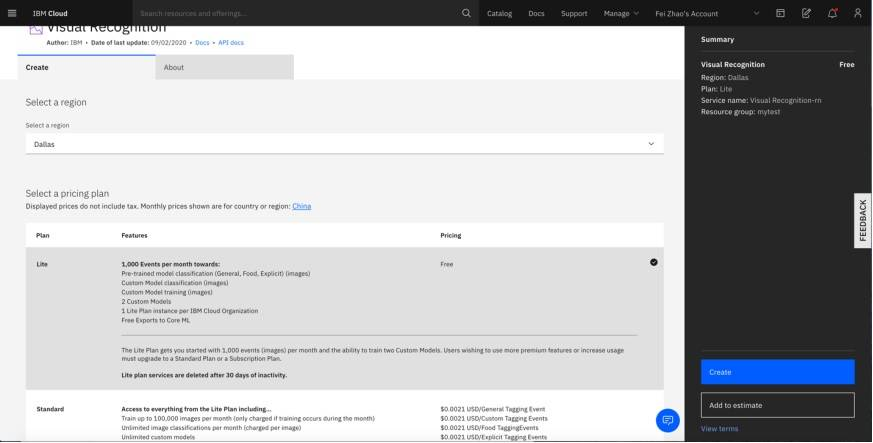
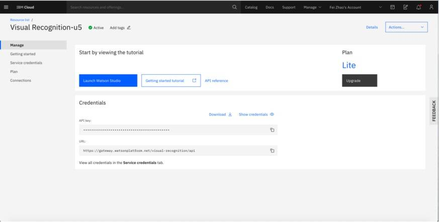
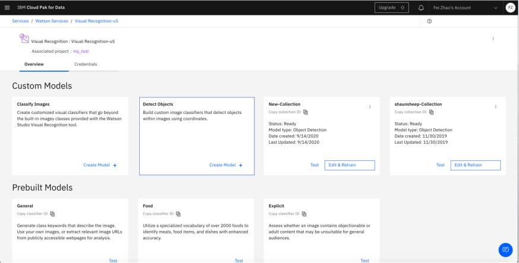
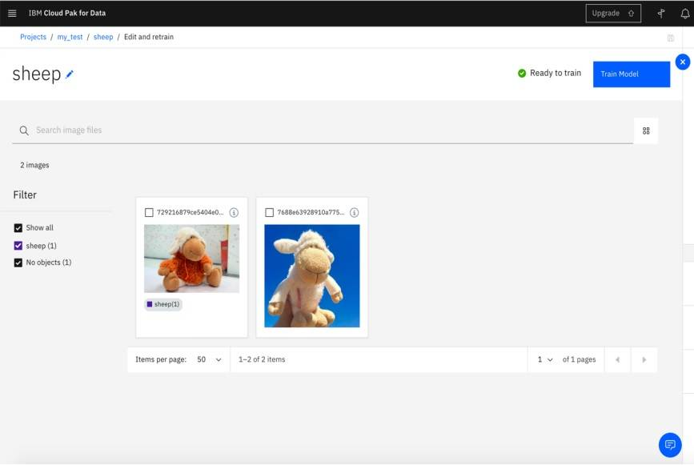
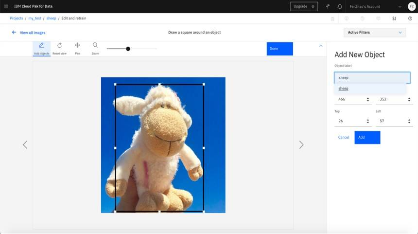
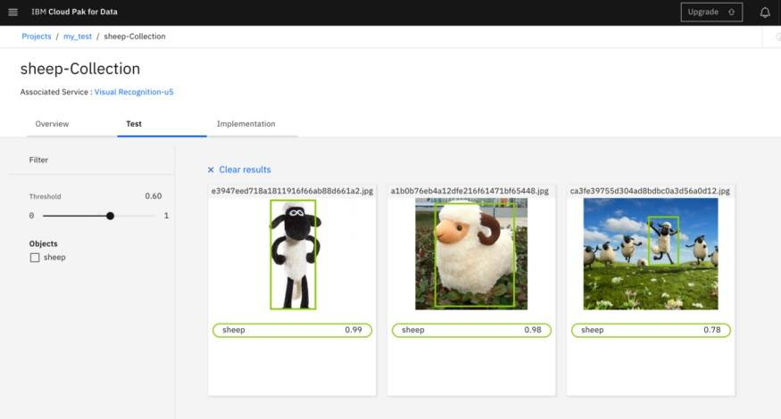
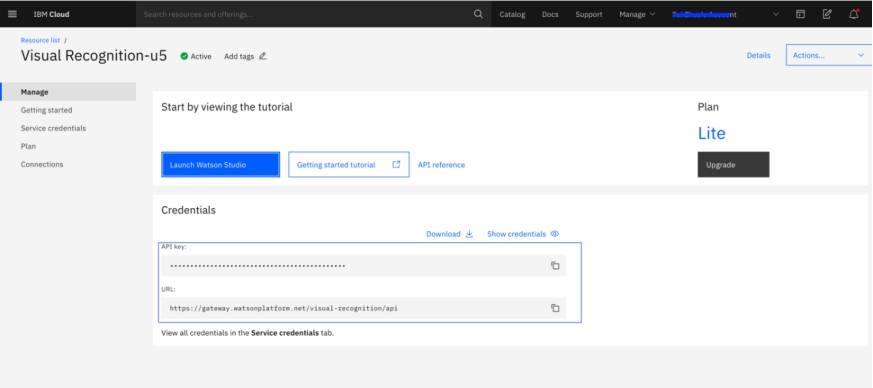
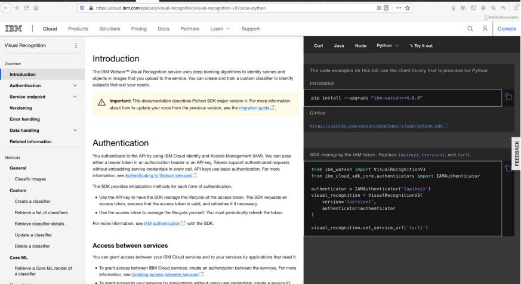

# 利用 IBM Watson Visual Recognition 实现自定义图像模式识别
快速上手 IBM Watson Visual Recognition

**标签:** 分析,机器学习,视觉识别

[原文链接](https://developer.ibm.com/zh/articles/realize-customer-defined-image/)

杨晓蓓, 卢江, 赵斐, 陈宏亮, 唐伟峰

发布: 2020-11-30

* * *

## 概述

提到“视觉”，很多人会联想到街道上各种各样的摄像头。实际上，摄像头和眼睛一样，充当的是图像采集的工作，完成了“视”的功能，而对图像的识别也就是“觉”则需要依靠人类的认知功能来实现。AI 中的视觉认知（Visual Recognition）技术让计算机有了与人相近的图像识别认知能力，与摄像头相配合便可以完成以前必须由人来完成的工作。

过去在铁路和电网等一些行业中，存在巡查员这种职业。他们需要经常沿着纵横交错、蜿蜒千里的铁路或者高压线进行巡视，观察线路和设备有无损坏的迹象，以确保行车安全。这是一项艰苦而危险的工作，巡查员经常需要翻山越岭、深入荒漠和不毛之地。一次巡查往往要持续数天或数月之久。现在这项艰苦的工作可以由摄像头配合视觉认知技术来完成。铁路和电网公司在沿线安装多个摄像头，自动对现场图像进行采集，再将图像数据传输给视觉认知服务，如果发现问题则通知相关人员采取相应的措施进行维修。从而使整个图像采集和信息分析的过程都不再需要人的干预。

## 应用场景实现方案描述

本文我们就要通过一个例子向大家展示如何利用笔记本上的摄像头和 IBM Cloud 中的 Visual Recognition 服务实现这一场景。众所周知，图像识别的准确度与机器学习的数据量密切相关。为了便于演示，也为了便于读者实践，在本文的例子中我们使用易于找到的羊型玩偶作为识别对象，来代替线路上出现问题的设备。
在本文中，我们使用 IBM Cloud Visual Recognition（以下简称 Visual Recognition）服务的免费版本来完成场景，读者不需要为此支付任何费用。然而免费版本存在一定的局限性。首先，每个服务的实例每个月只能响应一千次请求，而且也无法提供充足的带宽。这种限制无疑会为我们的工作增加不小的难度。不过在实际工作中，我们总会遇到相似的问题。例如，如何减少对 Visual Recognition 服务的访问频次，以降低我们服务的运行成本，如何减少传输过程中的数据量，以保证响应时间。在本文中，我们也将针对这些问题给出我们的解决方案。

下图是用 python 语言和 OpenCV 函数库编写的示例。在这个例子中，客户端程序调用笔记本上的摄像头录制视频，再利用 Visual Recognition 服务，识别图像中的羊型玩偶，经过对三十余幅羊型玩偶图片的学习，便可从其他图像中将玩偶辨认出来。识别准确度会随着对更多素材的学习而变的更高。

**图 1\. 用 python 语言和 OpenCV 函数库编写的示例**



如果你想如上图一样，利用笔记本的摄像头和 Visual Recognition 服务来实现对动态视频中的羊型玩偶对象进行实时识别，就必须要解决一个问题。摄像机录制的是流媒体数据，它具有连续性和实时性。但是 Visual Recognition 服务接受的是单个的图像，并不连续。那我们应该怎么处理这个问题呢？

在这里我们要介绍一下对视频数据的处理以及在此处的应用。当我们看电视的时候觉得视频信号是连续的，但电视利用的是人们在视觉上的错觉，实际上如果图像的连续变化超过 25 帧每秒，人眼就会认为图像是连续的。通常情况下，网络视频的采集帧数在 30 帧每秒左右，如果高于 30 帧，文件会过大，如果低于 25 帧每秒就会出现卡顿的感觉。然而在图像识别的过程中，图像内容通常是静止画面，而非高速运动的画面（例如：体育比赛。）。因此，我们可以将采样的频率进一步降低到约 15 帧每秒。上方的动态图就是以 15 帧每秒录制的，我们并没有感觉到严重的卡顿现象。

采用每秒 15 帧的方式对视频进行采样，录制出来的 10 秒钟的视频将被分解成一百五十余幅静态图片。由于我们使用的是免费版本，每月只能响应一千个请求，如果我们把每一幅静态图像都发送到 Visual Recognition 的服务端，几分钟之内额度就会用光。而如果使用付费版本，程序的运行成本将会非常昂贵。接下来我们就要解决这个问题。

通常情况下，监控画面中的图像不会快速频繁发生变化。这里所说的频繁以秒为单位。也就是在一秒钟的时间里，图像中的内容不会频繁变化。如上面的动态图所示，视频中的羊型玩偶始终位于屏幕的中间位置，只是观察角度发生微弱的变化。所以，当我们对图像进行抽样分析的时候，抽样频率可以降至 0.5 秒甚至一秒。在上面的动态图中，我选取 0.5 秒的频率抽取图像，送至 Visual Recognition 的服务端进行对象识别。待识别结果返回之后，两个识别点 T1 与 T2 之间的画面全部用 T1 采样的识别结果标注。上面动态图采取的就是这样的方式，在图像内容变化并不频繁的情况下，通过降低视频采样送检的频率以降低图像识别应用的运行成本。

另外，Visual Recognition 服务可以接受对 ZIP 压缩包中的图像进行批量分析的请求。如果能够接受略微降低实时性的条件，我们可以将对各个时间点的采样图像合并压缩到一个 ZIP 的压缩包中，再上传到 Visual Recognition 的服务端，进行批量处理。在演示的程序中，我将录制 10 秒的视屏以 0.5 秒的频率进行采样，并将 20 幅图片制作成一个 ZIP 压缩包，上传到 Visual Recognition 的服务端进行分析。待得到响应之后，从返回信息的 JSON 文件中提取相应的结果，并重新标注在视屏相应的时间点上。利用这样的方法，我们利用一次 Visual Recognition 服务的请求完成了对 10 秒钟视屏图像识别分析，识别出响应的对象并标注在原始视频中，完成我们所需要的功能。

## 环境搭建

上面我们已经对客户端程序实现的技术细节进行了深入讲解，实际上客户端代码实现只有一百余行，这是因为我们调用了 OpenCV 的函数库。相比于客户端程序，在自己的电脑上搭建运行环境的难度更高。下面我们就几个主要问题进行讲解。

无论您是想学习如何将图像识别应用于视频流，建立完整的深度学习通道以进行图像分类，还是只是想对视频和图像进行修改，加上水印，您都需要学习 OpenCV。实际上，学习 OpenCV 曾经非常具有挑战性，所以本文中我们花一些篇幅来对搭建环境的必要步骤给予简单的介绍。

本文使用的系统是 Mac OS， 所以此篇文章针对的是在 Mac OS 上搭建环境的方法。如果你的系统是 Ubuntu 或者 Windows，请在官方网页下载其对应版本。

搭建环境包含几个步骤：安装 Xcode 并设置 Homebrew，之后我们将建立 Python 虚拟环境，最后从源代码编译 OpenCV 4。从源代码进行编译使我们可以完全控制编译和构建，以及安装完整的 OpenCV 4 Build。

1. 安装 Xcode
    启动 Apple App Store，找到 Xcode 应用并安装。单击“安装”按钮，等待约 5 分钟以完成安装。Xcode 是 Homebrew 的依赖项，因此在 macOS 上如果要使用 OpenCV 4 这是必要的一步。

2. 安装 Homebrew
    Mac 社区软件管理器 Homebrew 在流行的编程语言 Ruby 上运行。利用它可以让我们的编程工作变得简单，复制以下整个命令以安装 Homebrew：


    ```
    $ /usr/bin/ruby -e "$(curl -fsSL https://raw.githubusercontent.com/Homebrew/install/master/install)"

    ```


    Show moreShow more icon

    安装完毕之后，我们运行下面的命令对其进行升级。


    ```
    $ brew update

    ```


    Show moreShow more icon

3. 使用 Homebrew 安装 OpenCV 必备软件

    - 安装 Python 3.6

注意本文使用 Python 3.6，因为 OpenCV 的某些版本与 Python 3.7 可能存在不兼容的问题，在这里不建议选择该版本。

```
$ brew install https://raw.githubusercontent.com/Homebrew/homebrew-core/f2a764ef944b1080be64bd88dca9a1d80130c558/Formula/python.rb
$ brew switch python 3.6.5_1

```

Show moreShow more icon

运行下列命令来验证一下安装是否成功。

```
$ python3
Python 3.6.5 (default, Jun 17 2018, 12:13:06)
[GCC 4.2.1 Compatible Apple LLVM 9.1.0 (clang-902.0.39.2)] on darwin
Type "help", "copyright", "credits" or "license" for more information.
>>>

```

Show moreShow more icon

如果看到提示符，就表明已经安装成功了，下面再验证一下 python 的版本：

```
$ which python3
/usr/local/bin/python3

```

Show moreShow more icon

如果看到/ usr / local / bin / python3， 那么我们正在使用 Homebrew Python（这正是我们所需要的版本）。如果看到/ usr / bin / python3 那么您正在使用系统 Python，这里可能需要修复 bash 配置文件以调用正确的命令。

- 其他必备软件

在我们编译 OpenCV 之前，首先需要满足一些先决条件。 这些软件包括用于构建和编译的工具，用于图像 I / O 操作（即，从磁盘上加载各种图像文件格式，例如 JPEG，PNG，TIFF 等）的相关库和优化库。
请执行下面的命令在 macOS 上安装 OpenCV 所依赖的这些库：

```
$ brew install cmake pkg-config
$ brew install jpeg libpng libtiff openexr
$ brew install eigen tbb

```

Show moreShow more icon

4.安装 Python 调用 OpenCV 需要的依赖

在这一步中，我们将为 OpenCV 4 安装 Python 的依赖项。利用 wget 可以方便的安装这些依赖。首先使用下面的命令安装 wget：

```
$ brew install wget

```

Show moreShow more icon

接下来运行下列命令来下载并安装 pip（Python 软件包管理器）：

```
$ wget https://bootstrap.pypa.io/get-pip.py
$ sudo python3 get-pip.py

```

Show moreShow more icon

现在已经安装了 pip，下一步我们要开始安装 virtualenv 和 virtualenvwrapper 这两个用于管理虚拟环境的工具。 Python 虚拟环境是 Python 开发的最佳实践，这里建议用户充分利用它们，因为使用 virtualenv 可以避免因为环境不同引发的各种问题。

运行下面的命令安装 virtualenv

```
$ sudo pip3 install virtualenv virtualenvwrapper
$ sudo rm -rf ~/get-pip.py ~/.cache/pip

```

Show moreShow more icon

在这里我们还要对环境变量文件 bash profile 进行编辑，以确保刚刚安装的工具能够正确运行。

```
export WORKON_HOME=$HOME/.virtualenvs
export VIRTUALENVWRAPPER_PYTHON=/usr/local/bin/python3
source /usr/local/bin/virtualenvwrapper.sh

```

Show moreShow more icon

最后不要忘记执行 source 命令让之前所有的修改生效。

```
$ source ~/.bash_profile

```

Show moreShow more icon

用如下命令为 OpenCV 创建 Python virtual environment。

```
$ mkvirtualenv cv_vr -p python3
Running virtualenv with interpreter /usr/local/bin/python3
Using base prefix '/usr/local/Cellar/python/3.6.5_1/Frameworks/Python.framework/Versions/3.6'
New python executable in /Users/admin/.virtualenvs/cv/bin/python3.6
Also creating executable in /Users/admin/.virtualenvs/cv/bin/python
Installing setuptools, pip, wheel...
done.
virtualenvwrapper.user_scripts creating /Users/admin/.virtualenvs/cv/bin/predeactivate
virtualenvwrapper.user_scripts creating /Users/admin/.virtualenvs/cv/bin/postdeactivate
virtualenvwrapper.user_scripts creating /Users/admin/.virtualenvs/cv/bin/preactivate
virtualenvwrapper.user_scripts creating /Users/admin/.virtualenvs/cv/bin/postactivate
virtualenvwrapper.user_scripts creating /Users/admin/.virtualenvs/cv/bin/get_env_details

```

Show moreShow more icon

本文中的虚拟环境名字是 cv\_vr， 接下来我们将在这个环境中安装 NumPy。用下面的命令激活该环境。

```
$ workon cv_vr

```

Show moreShow more icon

需要用户注意的是，每次使用该环境或在其中安装软件包时，都应先使用 workon 命令切换到 cv\_vr 虚拟环境中，否则运行程序时可能会出错。

5.在 macOS 上安装 OpenCV 4

我们可以使用库管理器（例如 pip，Homebrew 和 Anaconda）安装相应的程序。但从源代码进行编译可以使你拥有最大的控制权。库管理器确实很方便，但你有可能无法获得最新版本的 OpenCV，并且在某些情况下它可能不适用于当前虚拟环境或者缺少部分功能。而这些问题在程序编写过程中很难诊断。因此我们这里介绍从源代码进行编译的方法。

- 下载 OpenCV 4

首先，跳转到我们的工作目录并下载 opencv 和 opencv\_contrib。contrib 存储库包含额外的模块和功能，有的时候会用到。使用如下命令获得 OpenCV 源代码。

```
$ cd ~
$ wget -O opencv.zip https://github.com/opencv/opencv/archive/4.0.0.zip
$ wget -O opencv_contrib.zip https://github.com/opencv/opencv_contrib/archive/4.0.0.zip
$ mv opencv-4.0.0 opencv
$ mv opencv_contrib-4.0.0 opencv_contrib

```

Show moreShow more icon

- 解压缩 OpenCV 4 文件

```
$ unzip opencv.zip
$ unzip opencv_contrib.zip

```

Show moreShow more icon

如果需要修改文件夹名字的话，请注意需要同时更新 CMake 中的路径。然后我们就可以开始设置环境了。

- 从源代码编译 OpenCV 4

首先进入 opencv 目录。创建一个名为 build 的文件夹。运行 workon 命令切换到 cv\_vr 虚拟环境中。执行 cmake 命令来编译源代码。

```
$ workon cv_vr
$ cmake -D CMAKE_BUILD_TYPE=RELEASE \
-D CMAKE_INSTALL_PREFIX=/usr/local \
-D OPENCV_EXTRA_MODULES_PATH=~/opencv_contrib/modules \
-D PYTHON3_LIBRARY=`python -c 'import subprocess ; import sys ; s = subprocess.check_output("python-config --configdir", shell=True).decode("utf-8").strip() ; (M, m) = sys.version_info[:2] ; print("{}/libpython{}.{}.dylib".format(s, M, m))'` \
-D PYTHON3_INCLUDE_DIR=`python -c 'import distutils.sysconfig as s; print(s.get_python_inc())'` \
-D PYTHON3_EXECUTABLE=$VIRTUAL_ENV/bin/python \
-D BUILD_opencv_python2=OFF \
-D BUILD_opencv_python3=ON \
-D INSTALL_PYTHON_EXAMPLES=ON \
-D INSTALL_C_EXAMPLES=OFF \
-D OPENCV_ENABLE_NONFREE=ON \
-D BUILD_EXAMPLES=ON ..

```

Show moreShow more icon

请注意一下输出的结果。以确保 Python3 的 Interpreter 和 numpy 都在 cv\_vr 虚拟环境中。如果在输出中找到 python3 Interpreter 和 numpy 的字样，确定他们的路径在类似“virtualenvs/cv\_vr/”目录下。如果没有看到，那很有可能是因为在执行 CMake 的时候没有在“cv\_vr”的虚拟环境中，针对这种情况，用户需要把当前的 build 删除并激活“cv\_vr”虚拟环境，然后再次运行重做 build 即可。

接下来执行下面的命令进行编译：

```
$ make -j4

```

Show moreShow more icon

值得注意的是，-j4 参数是可选的，它将指示 make 利用 4 个 CPU 内核。 您可以调整数值或不使用这个参数。现在我们只要等待编译完成就可以使用下面的命令，安装 OpenCV4 到我们的环境之中了。

```
$ sudo make install

```

Show moreShow more icon

- 在 MacOS 上将 OpenCV 4 链接到虚拟环境的 site-packages 上

现在，让我们来创建连接。我们需要把 cv\_vr 虚拟环境中的 site-packages 连接到系统的 site-packages 上，在那里刚刚编译并安装了 OpenCV4。

首先先确认一下当前环境中的 Python 版本，以防因多个 Python 版本不一致而导致的混乱。

```
$ workon cv
$ python --version
Python 3.6

```

Show moreShow more icon

把名字改成 cv2。

```
$ ls /usr/local/python/cv2/python-3.6
cv2.cpython-36m-darwin.so
$ cd /usr/local/python/cv2/python-3.6
$ sudo mv cv2.cpython-36m-darwin.so cv2.so

```

Show moreShow more icon

接下来我们用下面的命令建立连接。

```
$ cd ~/.virtualenvs/cv/lib/python3.6/site-packages/
$ ln -s /usr/local/python/cv2/python-3.6/cv2.so cv2.so

```

Show moreShow more icon

测试安装是否成功：
为确保已建立正确的链接，测试你的 OpenCV 安装始终很重要。我们可以在虚拟环境中启动 Python shell，并检查它是否正确导入并且版本是我们所需要的：

```
$ workon cv
$ python
>>> import cv2
>>> cv2.__version__
'4.0.0'
>>> exit()

```

Show moreShow more icon

到此为止环境搭建基本完成。

## 第 1 步：注册 IBM Cloud 账户

首先，我们需要有一个 IBM Cloud 的免费账户。如果没有可以 [点击](https://cloud.ibm.com/registration?cm_sp=ibmdev-_-developer-articles-_-cloudreg) 这里进行注册。

## 第 2 步：创建 Visual Recognition 实例

注册成功后，进入 [IBM Cloud](https://cloud.ibm.com/?cm_sp=ibmdev-_-developer-articles-_-cloudreg) 主页面。在主页面右上角点“Catalog”菜单，之后在左边菜单栏点击“Services” 选项。进入 service 页面之后，选择 Visual Recognition 服务，并创建一个 Lite Plan 的实例。

**图 2\. 选择 Visual Recognition 服务**



**图 3\. 创建 Lite Plan 的实例**



实例创建好之后，可以在 IBM Cloud 操作面板上找到并点击进入该实例，选择“Launch Watson Studio”。

**图 4\. 选择 Launch Watson Studio**



## 第 3 步：模型训练

Visual Recognition 中有两个主要功能：“Classify Images”和“Detect Objects”。 我们重要选取“Detect Objects” 功能演示。点击“Detect Objects” 选项中“Create Model”按钮建立一个新模型。我们要训练这个模型找到图片中的玩偶。

**图 5\. 创建模型**



首先把 collection 的名字改成“shaunsheep”。接下来如图所示，上传含有玩偶的图片。上传完毕之后，选中图片，点击“Add to model”按钮把他们加入 model 中。操作完成之后，可以在主窗口看见新加入的图片。

**图 6\. 修改模型**



点击其中一幅，进入编辑状态。在该状态中，点击“Add objects”按钮，框选中图中的玩偶，并在右面“Add New Object”菜单中给它设置一个标签 “shaunsheep”。 点击“Add”按钮，并点击主窗口中的“Done”按钮将其保存。

**图 7\. 保存新创建的对象**



重复上述操作，上传多幅包含玩偶的按钮。完成对多幅图的编辑工作之后，在 Collection 窗口中点击“Train Model”按钮，对 AI 进行训练。训练可能需要一段时间。

训练完毕之后，我们可以对训练的结果进行测试。点击“shaunsheep-collection” 上“Test” 按钮，进入 Collection 页面点击“Test”标签，将需要测试的图片拖入页面上传完毕之后，AI 就会在图片中标记目标对象。在我们的例子中，目标对象是玩偶。调节左侧的阈值，过滤噪音对象。一般情况下，对象的权重越高，得到的对象越准确。AI 的准确度由 AI 学习了多少素材决定。

**图 8\. AI 测试学习**



## 第 4 步：客户端程序的编写

服务做好之后，便可以开始编写客户端程序。为了调用笔记本上的摄像头，我们需要使用 OpenCV 库。 在这个例子中，我使用 Python 语言编写客户端程序，因此使用的是 OpenCV-Python。 安装好 OpenCV 之后，利用 python 语言编写程序，调用笔记本上的摄像头录制视频，再利用 Visual Recognition 服务识别图像中的玩偶。OpenCV-Python 的安装步骤请参见参考文档。

因为要进行图像处理，所以在这里要简单讲解一下图像处理的相关知识。众所周知，连续的动态视频由若干幅独立的图像组成。根据画质要求不同，每秒需采集的画面不等。在我们这个例子中，因为使用免费 Lite Plan 的 Visual Recognition 服务，一次只能处理 20 幅图片。所以，无法录制高清视频。视频采集频率为每秒 15 帧。录制 10 秒视频，总共采集 150 幅图像。将 150 幅图像等分成 20 份，每份抽取一幅图片，利用 Visual Recognition 识别其中是否存在玩偶，再将识别结果标记在视频的相应位置，就可以实现对一段动态视频中的特定物体的识别。

要调用 Visual Recognition 服务，只要得到该服务的 URL 和 API Key。这两个变量可以在 Visual Recognition 实例的 dashboard 中找到。

**图 9\. 设置 Visual Recognition 的 URL 和 API Key**



点击旁边的“API reference” 打开 API 文档。选择编写程序的语言，参考文档提示安装 SDK，并调用 Visual Recognition 服务的 API。

**图 10\. 安装 SDK 并调用 Visual Recognition 的的 API**



[下载样例代码](https://s3.us.cloud-object-storage.appdomain.cloud/developer/default/articles/realize-customer-defined-image/static/code deam.rar)

## 总结

本文从最基础的环境配置入手，深入浅出的介绍如何利用 IBM Watson Visual Recognition 对 AI 进行培训，从而实现对用户自定义的图像、物体或场景进行识别。通过一个简单的程序，利用笔记本上的摄像头展示功能实现的整个过程，协助你更好的理解视觉识别。

## 参考资源

- 访问 [IBM IBM Cloud](https://cloud.ibm.com/?cm_sp=ibmdev-_-developer-articles-_-cloudreg) 了解具体 IBM Cloud 提供的服务和功能
- 访问 [IBM IBM Cloud Forum](https://developer.ibm.com/answers?community=bluemix)，在论坛中讨论 IBM IBM Cloud 相关的问题
- 访问 [OpenCV](https://docs.opencv.org/master/d2/de6/tutorial_py_setup_in_ubuntu.html) 了解在 Ubuntu 中安装 OpenCV-Python
- 访问 [IBM Watson Visual Recognition](https://cloud.ibm.com/apidocs/visual-recognition/visual-recognition-v3?code=python) 了解其具体的 API