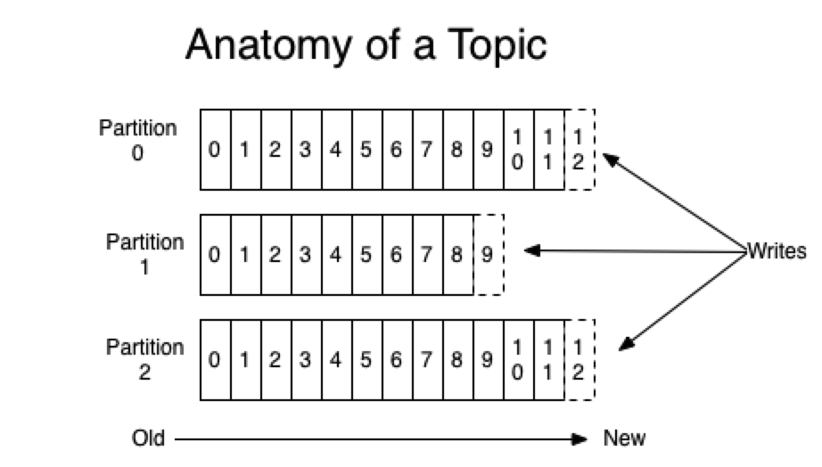
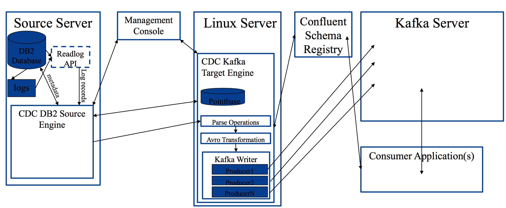
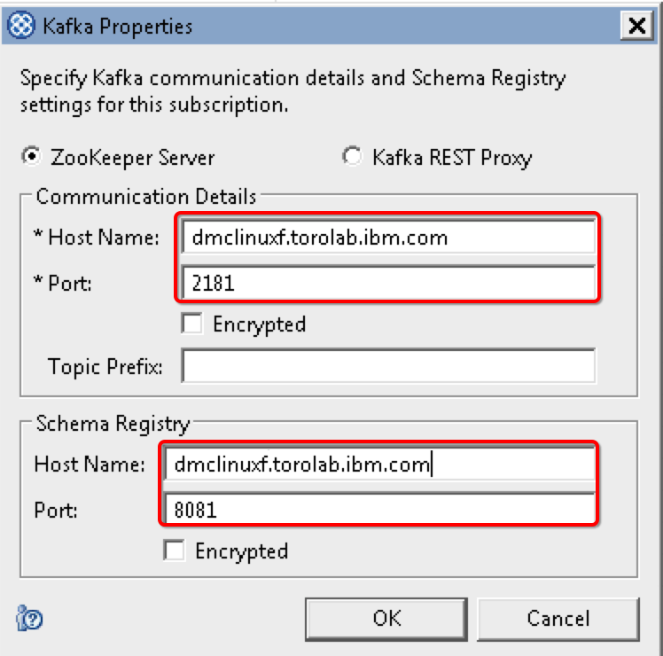
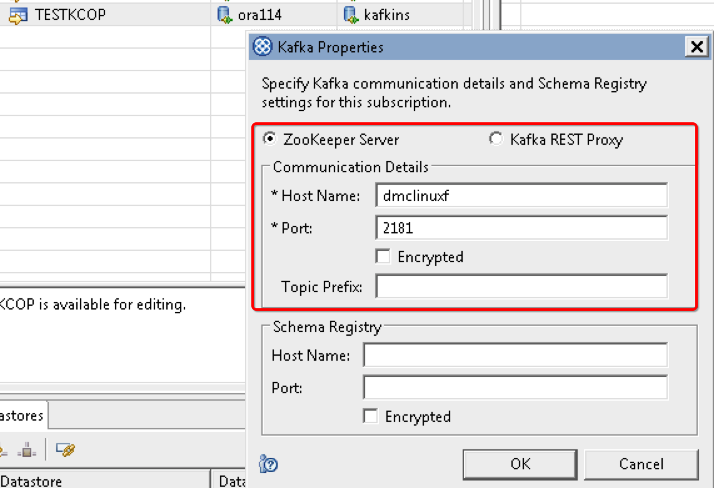
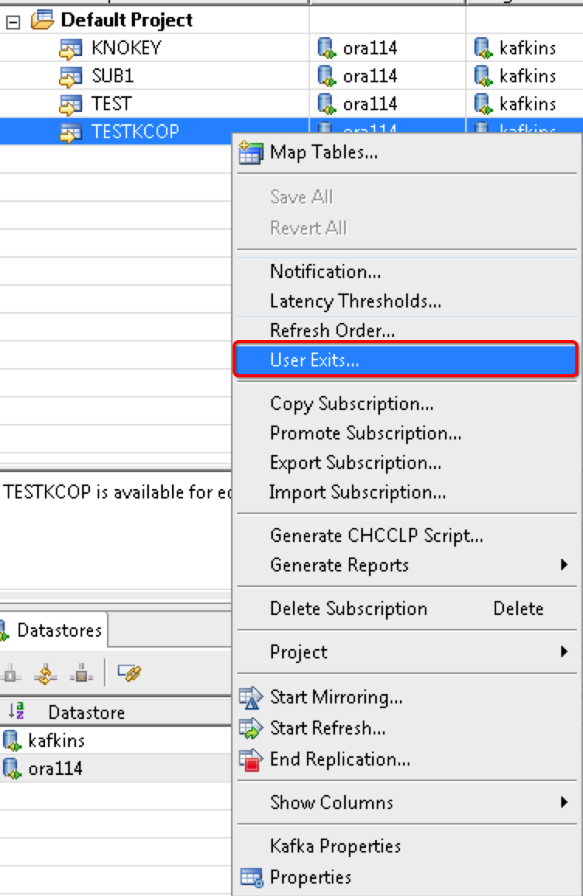
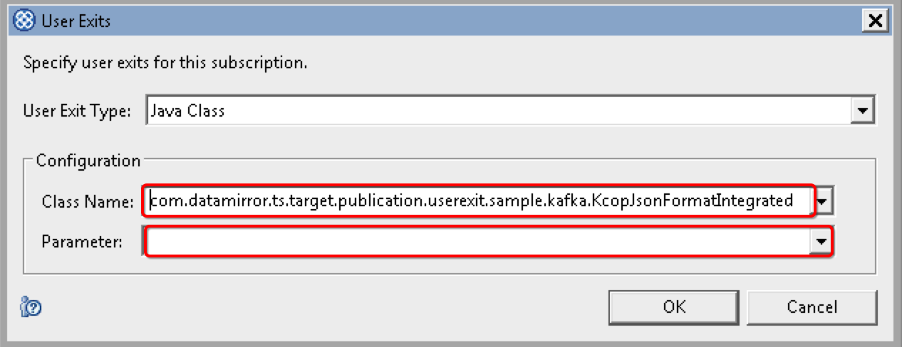
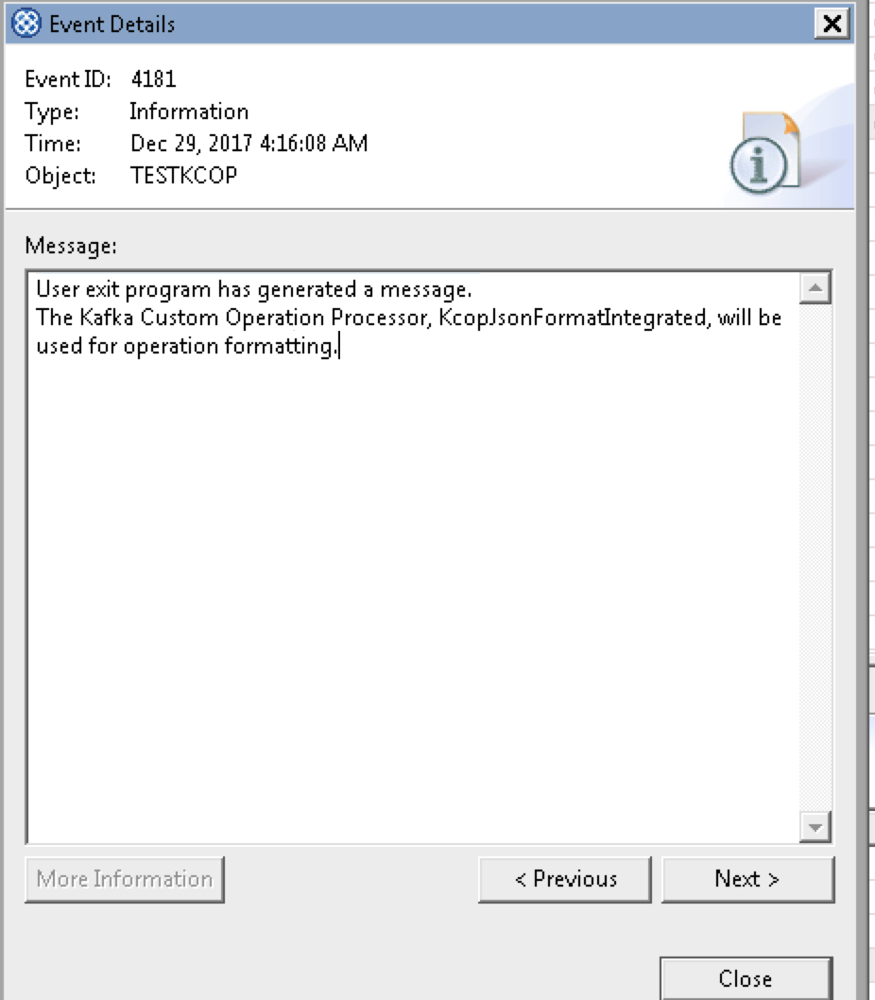
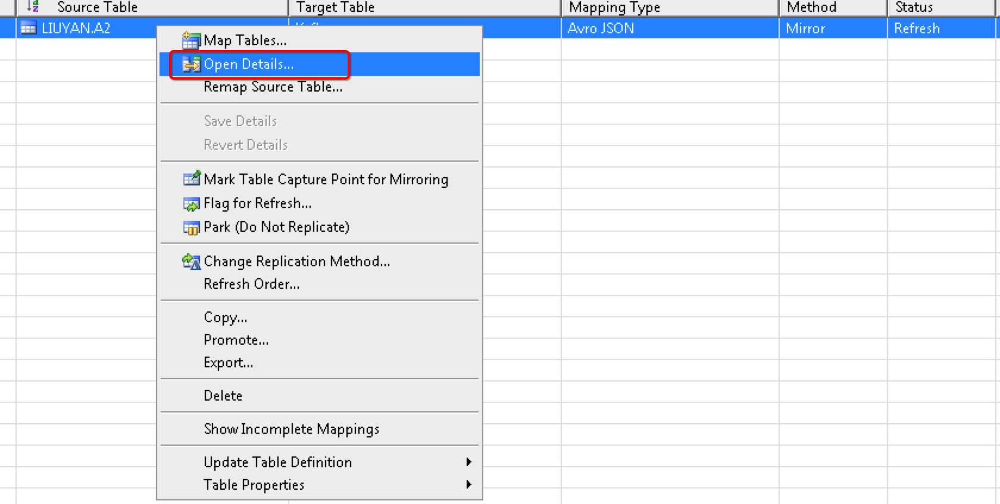
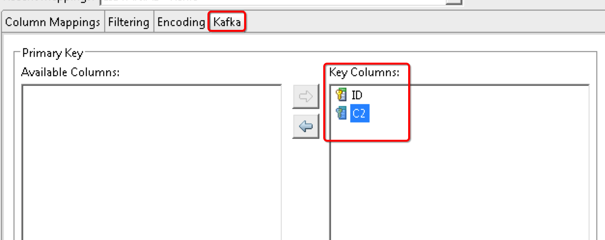
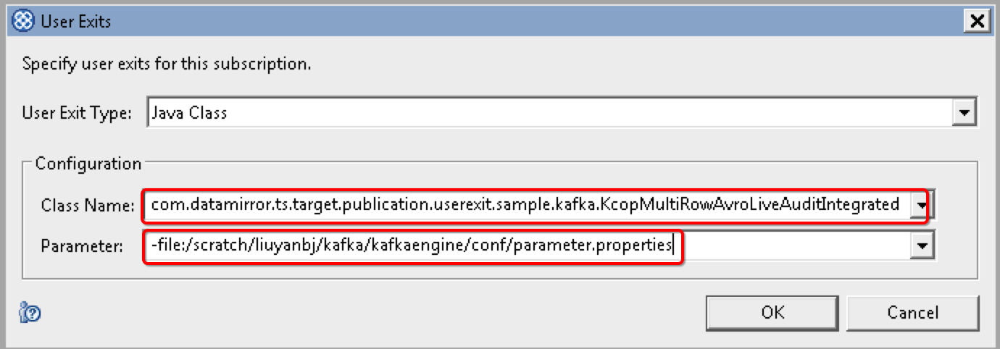

# 利用 InfoSphere Data Replication CDC for Kafka 实现高效数据复制
深入了解 Kafka

**标签:** Apache Kafka,分析,消息传递

[原文链接](https://developer.ibm.com/zh/articles/ba-lo-infoshpere-data-replication-cdc-for-kafka-implement-data-copy/)

刘艳, 陈永杰, 曲阳

发布: 2018-02-14

* * *

## Apache Kafka®简介

Apache Kafka® （以下简称 Kafka）是一个分布式流平台，最早由 LinkedIn 开发，用作 LinkedIn 的活动流和运营数据处理管道的基础。现在已经被越来越多的不同类型的公司作为多种类型的数据管道和消息系统使用。

Kafka 是一种分布式的，基于发布/订阅的消息系统。主要设计目标如下：

- 以时间复杂度为 O(1)的方式提供消息持久化能力，即使对 TB 级以上数据也能保证常数时间复杂度的访问性能。
- 高吞吐率。即使在非常廉价的商用机器上也能做到单机支持每秒 100K 条以上消息的传输。
- 支持 Kafka Server 间的消息分区，及分布式消费，同时保证每个 Partition 内的消息顺序传输。
- 同时支持离线数据处理和实时数据处理。
- 扩展性：支持在线水平扩展。

### Kafka 相关概念

1. Broker：Kafka 集群中包含的服务器，每台机器是一个 broker。
2. Topic：每条发布到 Kafka 集群的消息属于的类别，即 kakfa 是面向 topic 的。

对每个 topic，Kafka 集群维护一个 partitioned log，如图 1 所示：

##### 图 1\. Topic 剖析



每一个 partition（区）都是一个有序的、不可变的消息序列，它在存储层面是以 append log 文件形式存在的。任何发布到此 partition 的消息都会被直接追加到 log 文件的尾部。每条消息在文件中的位置称为 offset(偏移量)，offset 为一个 long 型数字，它是唯一标记一条消息。每个 topic 包含一个或多个 partition，也是 Kafka 的分配单位。

1. Producer：消息生产者，发布消息到 Kafka 集群的终端或服务。
2. Consumer：从 Kafka 集群中消费消息的终端或服务。

## CDC for Kafka 架构

##### 图 2\. CDC for Kafka 架构



用户可以复制任何 CDC 支持的源到 Kafka 目标。

CDC 有两种方式把数据写入 Kafka topic，分别是 Java API 和 REST 服务协议。当使用 Java API 的时候，Kafka 消费者通过兼容 CDC Avro 二进制格式的反序列化程序来消费 topic 中的数据，目前支持的产品有 Hortonworks 和 Confluent 的 schema registry 组件，也可以使用 KCOP 对 Avro 二进制数据进行反序列化处理，这样 Kafka 普通的 consumer 就可以直接消费 topic 中的数据。通过使用 HTTP 协议连接 Kafka REST 服务也可以对 Kafka topic 中的数据进行消费，目前只有 Confluent 产品中包含的 REST Server 被支持。

Schema Registry 服务在 CDC 同步架构中作为 Avro Schema 的存储库，主要完成下面功能：

- 侦听 topic 传入的消息中包含的描述 schema 的消息，并返回一个关联该 schema 的数字
- 当从 Kafka topic 中请求数据的时候使用这个数字返回对应的 schema 信息
- 这种方式可以自动处理 schema 更改的情况，因为在 schema registry 中每一个 topic 的 schema 都有特定的记录版本与之对应，当第一条记录检测到 schema 变更了，就会基于新的 schema 信息生成一个新的数字，已经存在的旧的 schema 信息对应的旧的 schema 的数据将不受影响，也就是变更前后的 schema 对应的数据可以存储在同一个 topic 中。

使用 Avro 的优势：

- Avro 以有效压缩的格式来存储数据
- Avro 提供二进制格式的模式（schema）信息，允许没有开销的情况下编写每一个数据
- Avro 格式数据可以提高序列化和反序列化的效率
- Avro 提供模式演变（schema evolution）支持

使用 Schema Registry 的优势：

- 支持随时间变化的源数据库表模式
- 不需要依赖模式兼容性
- 支持一个主题的多个表
- 提供模式使用的高透明度
- 用数字编号存储模式映射，最大限度减少消息大小
- 反序列化器缓存模式（schema）信息以在数据消费期间减少开销
- 可以在 Kafka 的反序列化处理上下文之外使用，比如把 Avro 数据发送到 Hadoop 平台

## CDC for Kafka 部署

1. 从 Confluent 官网下载 confluent-3.0.1.tar.gz （版本用 3.0\*之后的）、CDC for Kafka 安装文件和 114 Access server、MC （版本使用 11.4.0.0-10262 之后的）
2. 解压 confluent-3.0.1.tar.gz，并启动 4 个服务

设置环境变量：$CONF\_HOME 为 confluent 包所在的文件夹，$TEMP\_HOME 为启动服务的日志所在的文件夹

#### 示例代码清单 1

```
nohup $CONF_HOME/bin/zookeeper-server-start $CONF_HOME/etc/Kafka/zookeeper.properties > $TEMP_HOME/zookeeper_server.log 2>&1 &
sleep 5

nohup $CONF_HOME/bin/Kafka-server-start $CONF_HOME/etc/Kafka/server.properties > $TEMP_HOME/Kafka_server.log 2>&1 &
sleep 5

nohup $CONF_HOME/bin/schema-registry-start $CONF_HOME/etc/schema-registry/schema-registry.properties > $TEMP_HOME/schema-registry.log 2>&1 &
sleep 5

nohup $CONF_HOME/bin/Kafka-rest-start $CONF_HOME/etc/Kafka-rest/Kafka-rest.properties > $TEMP_HOME/Kafka-rest.log 2>&1 &

```

Show moreShow more icon

检查日志文件，确认所有的服务都启动完毕，并没有错误。

1. 安装 CDC for Kafka，并建实例，创建用户名为 tsuser，密码 tsuser。
2. 建 datastore，订阅及表映射
3. 右键订阅，配置 Kafka Properties，在此以使用 Zookeeper 为例，添加 Zookeeper Server 的主机名和端口号及 Schema Registry 的主机名和端口号。如图 3 所示：

##### 图 3\. Kafka Properties



1. 启动镜像，并往源表做插入、删除和更新操作
2. 检查输出

#### 示例代码清单 2:

```
$  ./Kafka-console-consumer --zookeeper dmclinuxf.canlab.ibm.com:2181 --topic Kafkains.testkcop.sourcedb.liuyan.a1-json --property  print.key=true --from-beginning
{"ID":"1"}      {"ID":"1","C2":{"string":"aaaa      "}}
{"ID":"1"}      null
{"ID":"9"}      {"ID":"9","C2":{"string":"aaaa      "}}
{"ID":"2"}      {"ID":"2","C2":{"string":"bbb       "}}
{"ID":"2"}      {"ID":"2","C2":{"string":"update    "}}

```

Show moreShow more icon

## CDC for Kafka 新功能介绍及功能限制

### 新功能介绍

KCOP 全称 Kafka 定制化操作处理器 custom operation processor，是一个 java 类，可以用来定制从源端 CDC 引擎接收到增、删、改数据的格式，之后把定制处理后的数据返回给 CDC for Kafka 引擎并写入 Kafka 的 topic 中。

KCOP 可以产生所有 KafkaProducer 记录，包括每个记录要写入的 topic 的名字和分区，Key 和 Value 的值，以及对于指定的源操作有多少记录写入哪些 topic 里。

使用 KCOP 可以减轻对 Confluent Schema Registry 平台的严格依赖，有些集成好的 KCOP 不用 Confluent 的 Serializer，因此类似这样的订阅就不需要 ConfluentSchema Registry。

### 集成的 Kafka 定制操作处理器

CDC for Kakfa 引擎包含了一些集成的 KCOP，对于这些 KCOP 可以直接使用，在订阅名字上右键，选择”user exit”，输入类名和参数（如果有的话）就可以。如果想要改变集成的 KCOP 或者创建全新的 KCOP，CDC for Kakfa 引擎也支持用户自定义的 KCOP。

- KcopMultiRowAvroLiveAuditIntegrated：您可以使用此 KCOP 把 audit 记录写到 Kafka。Before image 和 after image 是分开的记录。
- KcopLiveAuditSingleRowIntegrated：您可以使用此 KCOP 把 audit 记录写到 kakfa，格式为逗号分隔的 utf8 文本，hdfs audit 记录格式。
- KcopDefaultBehaviorIntegrated：您可以使用此 KCOP 来模拟默认 CDC 复制引擎 apply 的行为。
- KcopJsonFormatIntegrated：您可以使用此 KCOP 来复制源操作到 JSON 格式的 Avro KafkaProducer 记录 Key 和 value。
- KcopTopicMappingIntegrated：您可以使用此 KCOP 来选择哪些源表的操作写入一个 topic。您也可以使用此 KCOP 把一个订阅中的多个源表写入同一个 topic。

下面具两个具体例子，介绍如何使用 KCOP：

### 例子 1: Enabling a KCOP to write JSON format records

这个 KCOP 是不带参数的，请检查 Kafka Properties，使用的是”ZooKeeper Server”，如图 4 所示：

##### 图 4\. Kafka Properties



在建好的预订上右键，点击”User Exits…”，如图 5 所示：

##### 图 5\. User Exits…



输入 Class Name： com.datamirror.ts.target.publication.userexit.sample.Kafka.KcopJsonFormatIntegrated

参数处留空

如图 6 所示：

##### 图 6\. User Exits



点击”OK”，然后启动镜像，查看 event log，如图 7 所示：

##### 图 7\. Event Log



有了上面的消息说明此 KCOP 使用成功。

下面来检查结果：

检查生成的 topic 名字：如示例代码清单 3 所示：

#### 示例代码清单 3:

```
$  curl "http://dmclinuxf.torolab.ibm.com:8082/topics"
["__confluent.support.metrics","__consumer_offsets","_schemas","Kafkains-KAFKAT-commitstream","Kafkains-KNOKEY-commitstream","Kafkains-SUB1-commitstream","Kafkains-TEST-commitstream","Kafkains-TESTKCOP-commitstream","Kafkains.Kafkat.sourcedb.liuyan.a3","Kafkains.knokey.sourcedb.liuyan.nokey","Kafkains.sub1.sourcedb.liuyan.yan","Kafkains.test.sourcedb.liuyan.a4","Kafkains.test.sourcedb.liuyan.a4-audit","Kafkains.test.sourcedb.liuyan.a4-json","Kafkains.testkcop.sourcedb.liuyan.a1-json"]$

```

Show moreShow more icon

使用 Kafka 提供的 consumer 来读取记录：如示例代码清单 4 所示：

#### 示例代码清单 4:

```
$  ./Kafka-console-consumer --zookeeper dmclinuxf.canlab.ibm.com:2181 --topic Kafkains.testkcop.sourcedb.liuyan.a1-json --property  print.key=true --from-beginning
{"ID":"1"}      {"ID":"1","C2":{"string":"aaaa      "}}
{"ID":"1"}      null
{"ID":"9"}      {"ID":"9","C2":{"string":"aaaa      "}}
{"ID":"2"}      {"ID":"2","C2":{"string":"bbb       "}}
{"ID":"2"}      {"ID":"2","C2":{"string":"update    "}}

```

Show moreShow more icon

### 例子 2: Enabling a KCOP to write audit records in Avro format

下面的这个例子 Enabling a KCOP to write audit records in Avro format 带参数

类似例子 1 建预订，然后在表映射上右键选”Open Details”，如图 8 所示：

##### 图 8\. Open Details…



定位到 Kafka 标签，把所有列选为 Key Columns，如图 9 所示：

##### 图 9\. Key Columns



然后在预订上右键点击”User Exits…”，在此我们以参数文件为例。

准备参数文件，如代码清单 5 所示：

#### 代码清单 5:

```
$ cat /scratch/liuyanbj/kafka/kafkaengine/conf/parameter.properties
schema.registry.url=http://dmclinuxf.torolab.ibm.com:8081
audit.jcfs=ENTTYP,CCID,TIMSTAMP

```

Show moreShow more icon

如果想使用其他的 journal control field，请参考 Knowledge Center。

在 User Exits 对话框中，如下图 10 填写：

##### 图 10\. User Exits…



启动镜像，检查输出结果，如代码清单 6 所示：

#### 代码清单 6:

```
$  curl "http://dmclinuxf.torolab.ibm.com:8082/topics"
["__consumer_offsets","_schemas","Kafkains-KCOPAUDI-commitstream","Kafkains.kcopaudi.sourcedb.liuyan.a3"]

$  bin/Kafka-avro-console-consumer --topic Kafkains.kcopaudi.sourcedb.liuyan.a3 --zookeeper dmclinuxf.canlab.ibm.com:2181 --property print.key=true --from-beginning
SLF4J: Class path contains multiple SLF4J bindings.
SLF4J: Found binding in [jar:file:/scratch/liuyanbj/Kafka/confluent-3.0.1/share/java/Kafka-serde-tools/slf4j-log4j12-1.7.6.jar!/org/slf4j/impl/StaticLoggerBinder.class]
SLF4J: Found binding in [jar:file:/scratch/liuyanbj/Kafka/confluent-3.0.1/share/java/confluent-common/slf4j-log4j12-1.7.6.jar!/org/slf4j/impl/StaticLoggerBinder.class]
SLF4J: Found binding in [jar:file:/scratch/liuyanbj/Kafka/confluent-3.0.1/share/java/schema-registry/slf4j-log4j12-1.7.6.jar!/org/slf4j/impl/StaticLoggerBinder.class]
SLF4J: See http://www.slf4j.org/codes.html#multiple_bindings for an explanation.
SLF4J: Actual binding is of type [org.slf4j.impl.Log4jLoggerFactory]
{"ID":"3","C2":{"string":"dddd      "},"A_ENTTYP":"PT","A_CCID":"116489715","A_TIMSTAMP":"2018-01-01 22:32:07.000000000000"}
{"ID":"4","C2":{"string":"ccc       "},"A_ENTTYP":"PT","A_CCID":"116489837","A_TIMSTAMP":"2018-01-01 22:34:16.000000000000"}
{"ID":"3","C2":{"string":"dddd      "},"A_ENTTYP":"UB","A_CCID":"116489854","A_TIMSTAMP":"2018-01-01 22:34:49.000000000000"}
{"ID":"9","C2":{"string":"dddd      "},"A_ENTTYP":"UP","A_CCID":"116489854","A_TIMSTAMP":"2018-01-01 22:34:49.000000000000"}
{"ID":"4","C2":{"string":"ccc       "},"A_ENTTYP":"UB","A_CCID":"116497617","A_TIMSTAMP":"2018-01-02 01:01:44.000000000000"}
{"ID":"4","C2":{"string":"update    "},"A_ENTTYP":"UP","A_CCID":"116497617","A_TIMSTAMP":"2018-01-02 01:01:44.000000000000"}
{"ID":"2","C2":{"string":"bbb       "},"A_ENTTYP":"UB","A_CCID":"116497686","A_TIMSTAMP":"2018-01-02 01:03:11.000000000000"}
{"ID":"2","C2":{"string":"update2   "},"A_ENTTYP":"UP","A_CCID":"116497686","A_TIMSTAMP":"2018-01-02 01:03:11.000000000000"}
{"ID":"1","C2":{"string":"a         "},"A_ENTTYP":"DL","A_CCID":"116498161","A_TIMSTAMP":"2018-01-02 01:11:17.000000000000"}

```

Show moreShow more icon

对于其他的 KCOP，用法类似，详情请参考 Knowledge Center。

### 功能限制

目前只能作目标，不支持 kakfa 作源端；

目标端衍生列表达式不支持；

不支持冲突检测；

不支持冲突检测；

不支持行／列变换；

不支持外部刷新。

## CDC for Kafka 的应用场景

- 通过数据复制直接向 Apache Hadoop 集群提供数据
- 用 Apache Kafka 扩展数据湖部署
- 当 Kafka 被用作数据中心或者落地区时把数据复制到 Kafka
- 为 Kafka 提供准实时动态数据来源

## 总结

本文首先介绍了 Kafka 的功能及相关概念，接着从架构、部署、新增功能及目前功能限制等多方面讲解了如何利用 InfoSphere Data Replication CDC for Kafka实现高效数据复制，最后为大家列举了一些适用场景以方便大家可以更好的使用Kafka 解决实际项目中遇到的问题。

## 参考资源

1. [CDC 114 Knowledge Center](https://www.ibm.com/support/knowledgecenter/en/SSTRGZ_11.4.0/com.ibm.cdcdoc.sysreq.doc/concepts/aboutcdc.html)