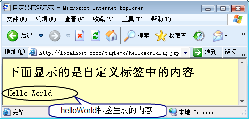
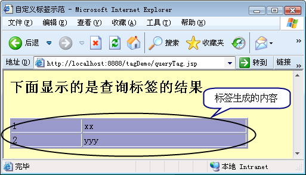
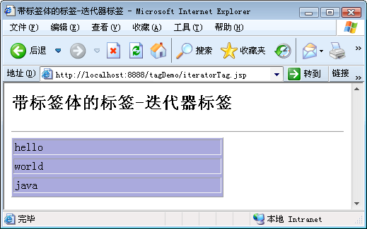

# 利用 JSP 2 提供的 SimpleTagSupport 开发自定义标签
掌握针对特定应用开发自定义标签来简化 Web 应用的表现层开发

**标签:** Java,Web 开发

[原文链接](https://developer.ibm.com/zh/articles/j-lo-jsp2tag/)

李刚

发布: 2010-06-28

* * *

自定义标签库并不是 JSP 2 才出现的，JSP 1.1 版中已经增加了自定义标签库规范，自定义标签库是一种非常优秀的表现层组件技术。通过使用自定义标签库，可以在简单的标签中封装复杂的功能。

为什么要使用自定义标签呢？主要是为了取代丑陋的 JSP 脚本。在 HTML 页面中插入 JSP 脚本有如下几个坏处：

- JSP 脚本非常丑陋，难以阅读。
- JSP 脚本和 HTML 代码混杂，维护成本高。
- HTML 页面中嵌入 JSP 脚本，导致美工人员难以参与开发。

出于以上三点的考虑，我们需要一种可在页面中使用的标签，这种标签具有和 HTML 标签类似的语法，但由可以完成 JSP 脚本的功能——这种标签就是 JSP 自定义标签。

在 JSP1.1 规范中开发自定义标签库比较复杂，JSP 2 规范简化了标签库的开发，在 JSP 2 中开发标签库只需如下几个步骤：

1. 开发自定义标签处理类；
2. 建立一个 _.tld 文件，每个_.tld 文件对应一个标签库，每个标签库对应多个标签；
3. 在 JSP 文件中使用自定义标签。

## 开发自定义标签类

##### 标签库和实际开发

标签库是非常重要的技术，通常来说，初学者、普通开发人员自己开发标签库的机会很少，但如果希望成为高级程序员，或者希望开发通用框架，就需要大量开发自定义标签了。所有的 MVC 框架，如 Struts 2、SpringMVC、JSF 等都提供了丰富的自定义标签。

当我们在 JSP 页面使用一个简单的标签时，底层实际上由标签处理类提供支持，从而可以使用简单的标签来封装复杂的功能，从而使团队更好地协作开发（能让美工人员更好地参与 JSP 页面的开发）。

早期 JSP 自定义标签类开发过程略微复杂一些，但 JSP 2 已经简化了这个过程，它只要自定义标签类都必须继承一个父类：javax.servlet.jsp.tagext.SimpleTagSupport，除此之外，JSP 自定义标签类还有如下要求。

- 如果标签类包含属性，每个属性都有对应的 getter 和 setter 方法。
- 重写 doTag() 方法，这个方法负责生成页面内容。

下面开发一个最简单的自定义标签，该标签负责在页面上输出 HelloWorld。

```
// 标签处理类，继承 SimpleTagSupport 父类
public class HelloWorldTag extends SimpleTagSupport
{
    // 重写 doTag 方法，该方法在标签结束生成页面内容
    public void doTag()throws JspException,
        IOException
    {
        // 获取页面输出流，并输出字符串
        getJspContext().getOut().write("Hello World");
    }
}

```

Show moreShow more icon

上面这个标签处理类非常简单，它继承了 SimpleTagSupport 父类，并重写 doTag() 方法，而 doTag() 方法则负责输出页面内容。该标签没有属性，因此无须提供 setter 和 getter 方法。

## 建立 TLD 文件

TLD 是 Tag Library Definition 的缩写，即标签库定义，文件的后缀是 tld，每个 TLD 文件对应一个标签库，一个标签库中可包含多个标签，TLD 文件也称为标签库定义文件。

标签库定义文件的根元素是 taglib，它可以包含多个 tag 子元素，每个 tag 子元素都定义一个标签。通常我们可以到 Web 容器下复制一个标签库定义文件，并在此基础上进行修改即可。例如 Tomcat6.0，在 webapps\\examples\\WEB-INF\\jsp2 路径下包含了一个 jsp2-example-taglib.tld 文件，这就是示范用的标签库定义文件。

将该文件复制到 Web 应用的 WEB-INF/ 路径，或 WEB-INF 的任意子路径下，并对该文件进行简单修改，修改后的 mytaglib.tld 文件代码如下：

```
<?xml version="1.0" encoding="GBK"?>
<taglib xmlns="http://java.sun.com/xml/ns/j2ee"
    xmlns:xsi="http://www.w3.org/2001/XMLSchema-instance"
    xsi:schemaLocation="http://java.sun.com/xml/ns/j2ee web-jsptaglibrary_2_0.xsd"
    version="2.0">
    <tlib-version>1.0</tlib-version>
    <short-name>mytaglib</short-name>
    <!-- 定义该标签库的URI -->
    <uri>http://www.crazyit.org/mytaglib</uri>
    <!-- 定义第一个标签 -->
    <tag>
        <!-- 定义标签名 -->
        <name>helloWorld</name>
        <!-- 定义标签处理类 -->
        <tag-class>lee.HelloWorldTag</tag-class>
        <!-- 定义标签体为空 -->
        <body-content>empty</body-content>
    </tag>
</taglib>

```

Show moreShow more icon

上面标签库定义文件也是一个标准的 XML 文件，该 XML 文件的根元素是 taglib 元素，因此我们每次编写标签库定义文件都直接添加该元素即可。

taglib 下有三个子元素：

- tlib-version：指定该标签库实现的版本，这是一个作为标识的内部版本号，对程序没有太大的作用。
- short-name：该标签库的默认短名，该名称通常也没有太大的用处。
- uri：这个属性非常重要，它指定该标签库的 URI，相当于指定该标签库的唯一标识。如上粗体字代码所示，JSP 页面中使用标签库时就是根据该 URI 属性来定位标签库的。

除此之外，taglib 元素下可以包含多个 tag 元素，每个 tag 元素定义一个标签，tag 元素下至少应包含如下三个子元素：

- name：该标签库的名称，这个属性很重要，JSP 页面中就是根据该名称来使用此标签的。
- tag-class：指定标签的处理类，毋庸置疑，这个属性非常重要，指定了标签由哪个 Java 类来处理。
- body-content：这个属性也很重要，它指定标签体内容。该元素的值可以是如下几个：

    - tagdependent：指定标签处理类自己负责处理标签体。
    - empty：指定该标签只能作用空标签使用。
    - scriptless：指定该标签的标签体可以是静态 HTML 元素，表达式语言，但不允许出现 JSP 脚本。
    - JSP：指定该标签的标签体可以使用 JSP 脚本。

实际上由于 JSP 2 规范不再推荐使用 JSP 脚本，所以 JSP 2 自定义标签的标签体中不能包含 JSP 脚本。所以实际上 body-content 元素的值不可以是 JSP。

定义了上面的标签库定义文件后，将标签库文件放在 Web 应用的 WEB-INF 路径，或任意子路径下，Java Web 规范会自动加载该文件，则该文件定义的标签库也将生效。

## 使用标签库

在 JSP 页面中确定指定标签需要 2 点：

- 标签库 URI：确定使用哪个标签库。
- 标签名：确定使用哪个标签。

使用标签库分成以下两个步骤：

1. 导入标签库：使用 taglib 编译指令导入标签库，就是将标签库和指定前缀关联起来。
2. 使用标签：在 JSP 页面中使用自定义标签。

taglib 的语法格式如下：

```
<%@ taglib uri="tagliburi" prefix="tagPrefix" %>

```

Show moreShow more icon

其中 uri 属性确定标签库的 URI，这个 URI 可以确定一个标签库。而 prefix 属性指定标签库前缀，即所有使用该前缀的标签将由此标签库处理。

使用标签的语法格式如下：

```
<tagPrefix:tagName tagAttribute=”tagValue”... >
    <tagBody/>
</tagPrefix:tagName>

```

Show moreShow more icon

如果该标签没有标签体，则可以使用如下语法格式：

```
<tagPrefix:tagName tagAttribute=”tagValue”... />

```

Show moreShow more icon

上面使用标签的语法里都包含了设置属性值，前面我们介绍的 HelloWorldTag 标签没有任何属性，所以使用该标签只需用  即可。其中 mytag 是 taglib 指令为标签库指定的前缀，而 helloWorld 是标签名。

下面是使用 helloWorld 标签的 JSP 页面代码：

```
<%@ page contentType="text/html; charset=GBK"%>
<!-- 导入标签库，指定mytag前缀的标签，
    由http://www.crazyit.org/mytaglib的标签库处理 -->
<%@ taglib uri="http://www.crazyit.org/mytaglib" prefix="mytag"%>
<html>
<head>
<title>自定义标签示范</title>
</head>
<body bgcolor="#ffffc0">
<h2>下面显示的是自定义标签中的内容</h2>
<!-- 使用标签 ，其中mytag是标签前缀，根据taglib的编译指令，
    mytag前缀将由http://www.crazyit.org/mytaglib的标签库处理 -->
<mytag:helloWorld/><BR>
</body>
</html>

```

Show moreShow more icon

上面页面中第一行粗体字代码指定了 `http://www.crazyit.org/mytaglib` 标签库的前缀为 mytag，第二行粗体字代码表明使用 mytag 前缀对应标签库里的 helloWorld 标签。浏览该页面将看到如图 1 所示效果：

##### 图 1\. 简单标签



## 带属性的标签

前面的简单标签既没有属性，也没有标签体，用法、功能都比较简单。实际上还有如下两种常用的标签：

- 带属性的标签。
- 带标签体的标签。

正如前面介绍的，带属性标签必须为每个属性提供对应的 setter 和 getter 方法。带属性标签的配置方法与简单标签也略有差别，下面介绍一个带属性标签的示例：

```
public class QueryTag extends SimpleTagSupport
{
    //标签的属性
    private String driver;
    private String url;
    private String user;
    private String pass;
    private String sql;
    //执行数据库访问的对象
    private Connection conn = null;
    private Statement stmt = null;
    private ResultSet rs = null;
    private ResultSetMetaData rsmd = null;
    //标签属性driver的setter方法
    public void setDriver(String driver) {
        this.driver = driver;
    }
        //标签属性url的setter方法
    public void setUrl(String url) {
        this.url = url;
    }
        //标签属性user的setter方法
    public void setUser(String user) {
        this.user = user;
    }
        //标签属性pass的setter方法
    public void setPass(String pass) {
        this.pass = pass;
    }
        //标签属性driver的getter方法
    public String getDriver() {
        return (this.driver);
    }
        //标签属性url的getter方法
    public String getUrl() {
        return (this.url);
    }
        //标签属性user的getter方法
    public String getUser() {
        return (this.user);
    }
        //标签属性pass的getter方法
    public String getPass() {
        return (this.pass);
    }
        //标签属性sql的getter方法
    public String getSql() {
        return (this.sql);
    }
        //标签属性sql的setter方法
    public void setSql(String sql) {
        this.sql = sql;
    }
    public void doTag()throws JspException,
        IOException
    {
           try
        {
            //注册驱动
            Class.forName(driver);
            //获取数据库连接
            conn = DriverManager.getConnection(url,user,pass);
            //创建Statement对象
            stmt = conn.createStatement();
            //执行查询
            rs = stmt.executeQuery(sql);
            rsmd = rs.getMetaData();
            //获取列数目
            int columnCount = rsmd.getColumnCount();
            //获取页面输出流
            Writer out = getJspContext().getOut();
            //在页面输出表格
            out.write("<table border='1' bgColor='9999cc' width='400'>");
            //遍历结果集
            while (rs.next())
            {
                out.write("<tr>");
                //逐列输出查询到的数据
                for (int i = 1 ; i <= columnCount ; i++ )
                {
                    out.write("<td>");
                    out.write(rs.getString(i));
                    out.write("</td>");
                }
                out.write("</tr>");
            }
        }
        catch(ClassNotFoundException cnfe)
        {
            cnfe.printStackTrace();
            throw new JspException("自定义标签错误" + cnfe.getMessage());
        }
        catch (SQLException ex)
        {
            ex.printStackTrace();
            throw new JspException("自定义标签错误" + ex.getMessage());
        }
        finally
        {
            //关闭结果集
            try
            {
                if (rs != null)
                    rs.close();
                if (stmt != null)
                    stmt.close();
                if (conn != null)
                    conn.close();
            }
            catch (SQLException sqle)
            {
                sqle.printStackTrace();
            }
        }
    }
}

```

Show moreShow more icon

上面这个标签稍微复杂一点，它包含了 5 个属性，如程序中粗体字代码所示，则程序需要为这 5 个属性提供 setter 和 getter 方法。

该标签输出的内容依然由 doTag() 方法决定，该方法会根据 SQL 语句查询数据库，并将查询结果显示在当前页面中。

对于有属性的标签，需要为 tag 元素增加 attribute 子元素，每个 attribute 子元素定义一个属性，attribue 子元素通常还需要指定如下几个子元素：

- name：设置属性名，子元素的值是字符串内容。
- required：设置该属性是否为不需属性，该子元素的值是 true 或 false。
- fragment：设置该属性是否支持 JSP 脚本、表达式等动态内容，子元素的值是 true 或 false。

为了配置上面的 QueryTag 标签，我们需要在 mytaglib.tld 文件中增加如下配置片段：

```
<!-- 定义第二个标签 -->
<tag>
    <!-- 定义标签名 -->
    <name>query</name>
    <!-- 定义标签处理类 -->
    <tag-class>lee.QueryTag</tag-class>
    <!-- 定义标签体为空 -->
    <body-content>empty</body-content>
    <!-- 配置标签属性:driver -->
    <attribute>
        <name>driver</name>
        <required>true</required>
        <fragment>true</fragment>
    </attribute>
    <!-- 配置标签属性:url -->
    <attribute>
        <name>url</name>
        <required>true</required>
        <fragment>true</fragment>
    </attribute>
    <!-- 配置标签属性:user -->
    <attribute>
        <name>user</name>
        <required>true</required>
        <fragment>true</fragment>
    </attribute>
    <!-- 配置标签属性:pass -->
    <attribute>
        <name>pass</name>
        <required>true</required>
        <fragment>true</fragment>
    </attribute>
    <!-- 配置标签属性:sql -->
    <attribute>
        <name>sql</name>
        <required>true</required>
        <fragment>true</fragment>
    </attribute>
</tag>

```

Show moreShow more icon

上面 5 行粗体字代码分别为该标签配置了 driver、url、user、pass 和 sql 等 5 个属性，并指定这 5 个属性都是必填属性、而且属性值支持动态内容。

配置完毕后，就可在页面中使用标签，先导入标签库，然后使用标签。使用标签的 JSP 页面片段如下：

```
<!-- 导入标签库，指定mytag前缀的标签，
    由http://www.crazyit.org/mytaglib的标签库处理 -->
<%@ taglib uri="http://www.crazyit.org/mytaglib" prefix="mytag"%>
...
<!-- 其他HTML内容 -->
<!-- 使用标签 ，其中mytag是标签前缀，根据taglib的编译指令，
    mytag前缀将由http://www.crazyit.org/mytaglib的标签库处理 -->
<mytag:query
    driver="com.mysql.jdbc.Driver"
    url="jdbc:mysql://localhost:3306/javaee"
    user="root"
    pass="32147"
    sql="select * from newsinf"/>

```

Show moreShow more icon

在浏览器中浏览该页面，效果如图 2 所示。

##### 图 2\. 使用带属性的标签执行查询



图 2 中看到从数据库里查询到 2 条记录，当然这也需要底层 javaee 数据库里包含 newsinf 数据表，且该数据表里包含这两条记录才行。

在 JSP 页面中只需要使用简单的标签，即可完成”复杂”的功能：执行数据库查询，并将查询结果在页面上以表格形式显示。这也正是自定义标签库的目的——以简单的标签，隐藏复杂的逻辑。

当然，并不推荐在标签处理类中访问数据库，因为标签库是表现层组件，它不应该包含任何业务逻辑实现代码，更不应该执行数据库访问，它只应该负责显示逻辑。

## 带标签体的标签

带标签体的标签，可以在标签内嵌入其他内容（包括静态的 HTML 内容和动态的 JSP 内容），通常用于完成一些逻辑运算，例如判断和循环等。下面以一个迭代器标签为示例，介绍带标签体标签的开发过程。

一样先定义一个标签处理类，该标签处理类的代码如下：

```
public class IteratorTag extends SimpleTagSupport
{
    //标签属性，用于指定需要被迭代的集合
    private String collection;
    //标签属性，指定迭代集合元素，为集合元素指定的名称
    private String item;
    //collection属性的setter和getter方法
    public void setCollection(String collection)
    {
        this.collection = collection;
    }
    public String getCollection()
    {
        return this.collection;
    }
    //item属性的setter和getter方法
    public void setItem(String item)
    {
        this.item = item;
    }
    public String getItem()
    {
        return this.item;
    }
    //标签的处理方法，简单标签处理类只需要重写doTag方法
    public void doTag() throws JspException, IOException
    {
        //从page scope中获取属性名为collection的集合
        Collection itemList = (Collection)getJspContext().
            getAttribute(collection);
        //遍历集合
        for (Object s : itemList)
        {
            //将集合的元素设置到page 范围
            getJspContext().setAttribute(item, s );
            //输出标签体
            getJspBody().invoke(null);
        }
    }
}

```

Show moreShow more icon

上面标签处理类与前面处理类并没有太大的不同，该处理类包含 2 个属性，并为这两个属性提供了 setter 和 getter 方法。标签处理类的 doTag 方法首先从 page 范围内获取了指定名称的 Collection 对象，然后遍历 Collection 对象的元素，每次遍历都调用了 getJspBody() 方法，如程序中粗体字代码所示，该方法返回该标签所包含的标签体：JspFragment 对象，执行该对象的 invoke() 方法，即可输出标签体内容。该标签的作用是：遍历指定集合，每遍历一个集合元素，即输出标签体一次。

因为该标签的标签体不为空，配置该标签时指定 body-content 为 scriptless，该标签的配置代码片段如下代码所示：

```
<!-- 定义第三个标签 -->
<tag>
    <!-- 定义标签名 -->
    <name>iterator</name>
    <!-- 定义标签处理类 -->
    <tag-class>lee.IteratorTag</tag-class>
    <!-- 定义标签体支持JSP脚本 -->
    <body-content>scriptless</body-content>
    <!-- 配置标签属性:collection -->
    <attribute>
        <name>collection</name>
        <required>true</required>
        <fragment>true</fragment>
    </attribute>
    <!-- 配置标签属性:item -->
    <attribute>
        <name>item</name>
        <required>true</required>
        <fragment>true</fragment>
    </attribute>
</tag>

```

Show moreShow more icon

上面配置片段中粗体字代码指定该标签的标签体可以是静态 HTML 内容，也可以是表达式语言。

为了测试在 JSP 页面中使用该标签的效果，我们首先把一个 List 对象设置成 page 范围的属性，然后使用该标签来迭代输出 List 集合的全部元素。

JSP 页面代码如下：

```
<%@ page import="java.util.*"%>
<%@ page contentType="text/html; charset=GBK"%>
<!-- 导入标签库，指定mytag前缀的标签，
    由http://www.crazyit.org/mytaglib的标签库处理 -->
<%@ taglib uri="http://www.crazyit.org/mytaglib" prefix="mytag"%>
<html>
    <head>
        <title>带标签体的标签-迭代器标签</title>
    </head>
    <body>
        <h2>带标签体的标签-迭代器标签</h2>
        <hr>
        <%
        //创建一个List对象
        List<String> a = new ArrayList<String>();
        a.add("hello");
        a.add("world");
        a.add("java");
        //将List对象放入page范围内
        pageContext.setAttribute("a" , a);
        %>
        <table border="1" bgcolor="aaaadd" width="300">
        <!-- 使用迭代器标签，对a集合进行迭代 -->
        <mytag:iterator collection="a" item="item">
            <tr>
                <td>${pageScope.item}</td>
            <tr>
        </mytag:iterator>
        </table>
    </body>
</html>

```

Show moreShow more icon

上面页面代码中粗体字代码即可实现通过 iterator 标签来遍历指定集合，浏览该页面即看到如图 3 所示界面：

##### 图 3\. 带标签体的标签



图 3 显示了使用 iterator 标签遍历集合元素的效果，从 iteratorTag.jsp 页面的代码来看，使用 iterator 标签遍历集合元素比使用 JSP 脚本遍历集合元素要优雅得多，这就是自定义标签的魅力。

实际上 JSTL 标签库提供了一套功能非常强大标签，例如普通的输出标签，像我们刚刚介绍的迭代器标签，还有用于分支判断的标签等等，JSTL（JSP 标准标签库）都有非常完善的实现。除此之外，Apache 下还有一套 DisplayTags 的标签库实现，做得也非常不错。