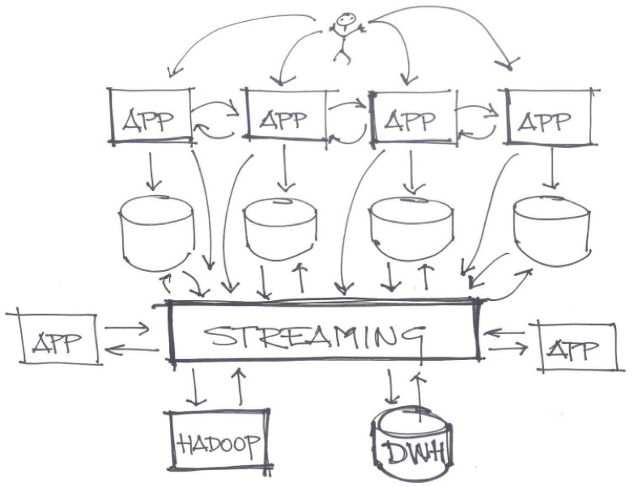
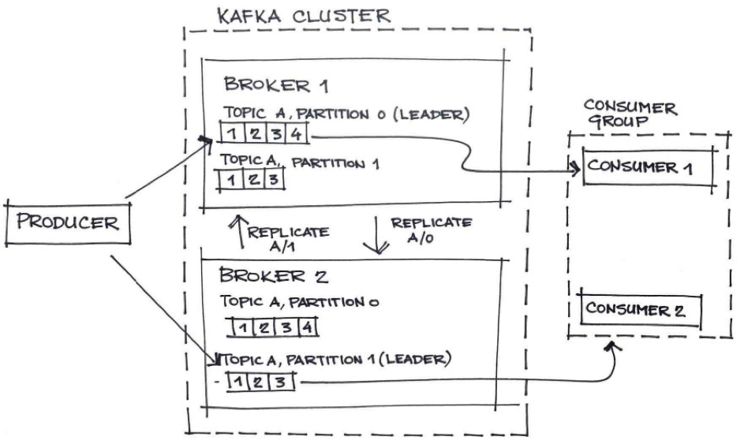
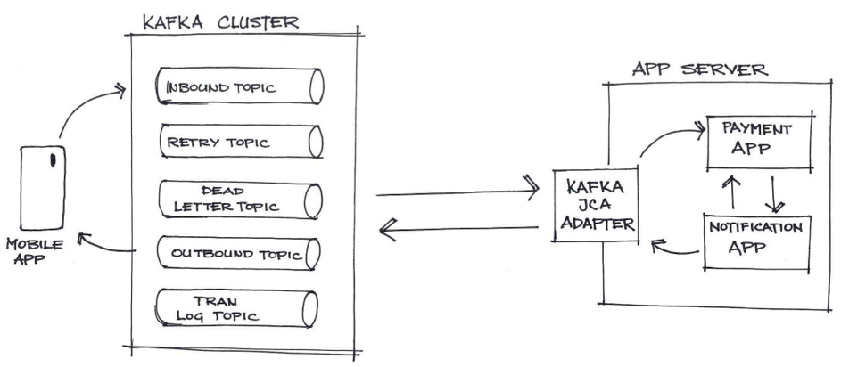
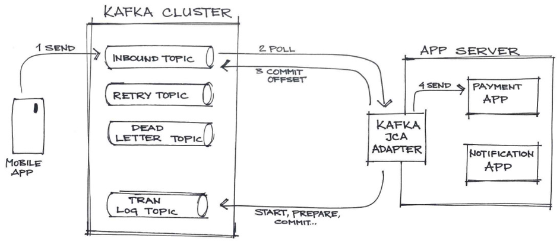
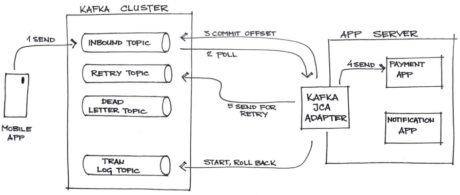
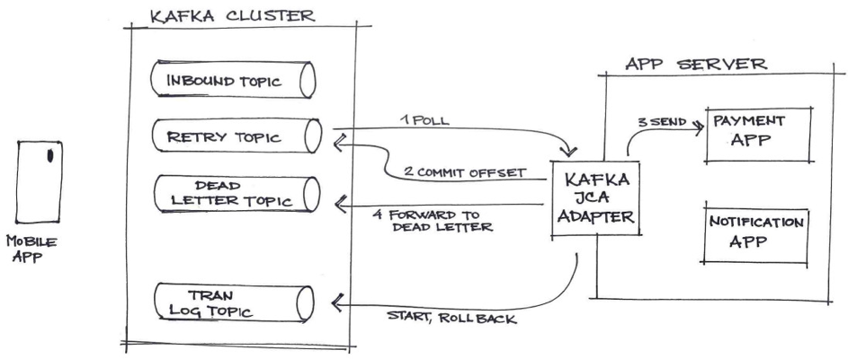
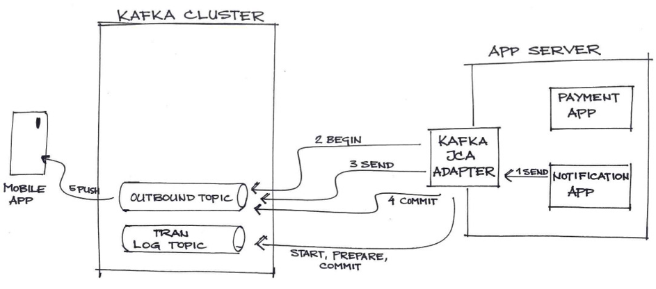

# 利用 Kafka 设置可靠的高性能分布式消息传递基础架构
实施资源适配器以集成 Kafka 与企业 Java 解决方案

**标签:** Apache Kafka,Jakarta EE,Java,消息传递

[原文链接](https://developer.ibm.com/zh/articles/set-up-a-reliable-high-performant-distributed-messaging-infrastructure-with-kafka/)

Irena Kezic, Anamarija Talijanac

发布: 2019-08-12

* * *

世界已经迈进“移动”时代，现在应用程序必须能够实时提供数据，这不仅包括数据库表中存储的重要最终结果，还包括用户使用应用程序时执行的所有操作。任何可用信息，例如，用户点击量、日志数据或传感器数据都可用于改善用户体验、生成报告、向机器学习系统提供数据，等等。现如今，开发者必须关注基于实时事件流的系统。

下图展示了基于事件流处理的架构示例。

Apache Kafka 已成为构建基于事件的高度可扩展系统的首选解决方案。Kafka 可为事件流平台提供快速升级换代的功能，以供开发者在现代化业务解决方案中使用。然而，开发者通常需要将现有 Java EE 业务解决方案（基于 IBM MQ 或 IBM WebSphere Application Platform 之类的技术而构建的）集成到这些新的事件流架构中。

考虑以下示例： 某个网上商店拥有一个移动应用程序，该应用程序使用 Kafka 向企业 Java 中实施的分布式支付系统发送支付请求数据。该解决方案必须绝对保证一次性完成支付请求的处理（避免多次向买家收费）。但是，在分布式系统中，故障是不可避免的，因此该解决方案需要采用稳妥的方式来处理故障。

## 使用 Apache Kafka 实施消息传递

Apache Kafka 是一种用于事件流处理的分布式系统，广泛应用于微服务架构和基于云的环境中。它在同一个平台内提供事件的消息传递、存储和处理。

下图展示了 Apache Kafka 组件的基本拓扑，其中包括通过 Kafka 集群基础架构交换消息的生产者和使用者。

即使 Kafka 具有诸多优势，但 Kafka 仍面临如下问题：

- 消息处理失败时需要实施手动补偿逻辑，这可能导致无法处理消息
- 不支持 XA 事务处理
- 确保在使用者应用程序中仅执行一次交付处理
- 需要完成额外的开发和可维护性工作才能将其集成到企业解决方案中

要解决 Kafka 集成问题，您可以应用传统消息传递拓扑概念，例如，事务日志、恢复日志和 XA 事务。 您可以实施基于 Java EE Connector Architecture (JCA) 的资源适配器。利用此 JCA 资源适配器，您可以为应用程序服务器提供 ACID 功能，以便进行 Kafka 消息处理。此 JCA 资源适配器随后可提供与企业 Java 应用程序的无缝 Kafka 集成。

## 实施 JCA 资源适配器

Java EE Connector Architecture 可定义一组可扩展且十分安全的事务性机制。您可以将 JCA 资源适配器安装到兼容 Java EE 的任意应用程序服务器中，例如，IBM Websphere Application Server、IBM Business Process Manager、JBoss、WebSphere Liberty、Glassfish 或 Weblogic。

Java EE Connector Architecture 规范还提供了一组标准合约，用于支持企业应用程序与企业信息系统（如 Kafka）之间的通信。JCA 资源适配器可以插入到应用程序服务器，可通过处理所有系统级别的机制（事务、连接管理、崩溃恢复、错误跟踪和日志记录）来支持 Kafka 集成。JCA 资源适配器将对需要与之集成的企业应用程序隐藏所有 Kafka 通信逻辑。通过实施 JCA 资源适配器，企业应用程序提供商可以集中精力实施业务和演示逻辑，而无需担心与 Kafka 集成相关的低级别逻辑。因此，JCA 资源适配器只需开发一次，即可供各种应用程序复用。

让我们将它与网上商店支付场景联系起来，观察下图，它展示了指定的解决方案系统上下文。

移动应用程序向 Kafka发送支付请求数据， 该Kafka 已通过资源适配器与企业支付应用程序进行了集成。此外，还可以使用此适配器向 Kafka 推送支付通知。此适配器会启动 XA 事务，该事务将传递到企业支付应用程序和通知系统。因此，与支付请求处理相关的所有任务都将在同一个全局事务内运行，并且同时完成或者同时失败。除了从中读取数据或向其中写入数据的主题外，该设计还在 Kafka 上设置了重试、死信和事务日志主题。

现在，我们来更详细地探索与移动应用程序往来的消息的处理过程。

### 传入流

在我们的支付场景中，传入流表示由网上商店移动应用程序发起的通信，该应用程序会向 Kafka 发送支付请求数据。资源适配器提供了 Kafka 连接，并向应用程序服务器上存在的消息端点异步传递消息。可使用 JCA 规范所定义的消息传入流合约来实现这一点。

Kafka JCA 资源适配器会实施激活规范 JavaBean，其中包含一组用于端点激活配置的配置属性。这些配置详细信息将作为应用程序服务器配置的一部分来进行定义。

资源适配器会定期从传入 Kafka 主题轮询一批支付请求。成功完成数据轮询后，它会迭代数据批次，并异步向端点实例传递消息。每个消息端点可能存在多个端点实例，因此能够并行使用消息并提供高吞吐量。

[Kafka 使用者偏移](https://kafka.apache.org/22/javadoc/org/apache/kafka/clients/consumer/KafkaConsumer.html) 在安排消息送达后立即落实，从而避免了批次受阻的问题。这种设计是可行的，因为该资源适配器通过需要在 Kafka 上设置的重试、死信和事务日志主题来实施故障转移过程。在我们的例子中，端点需要支持 XA 事务，并且需要在向端点发送数据之前创建事务上下文，从而提供原子消息使用。

如果应用程序服务器异常终止了事务，那么由端点实例执行的所有工作都应回滚，并且消息应转发到 Kafka 重试主题。

适配器使用来自 Kafka 重试主题的消息，并对其进行重新处理。超出已配置的消息处理重试次数后，该适配器会将此消息传递到 Kafka 死信主题。发送到死信主题的消息包含有价值的业务数据，因此监视该主题至关重要。

### 传出流

传出流表示由企业应用程序发起的 Kafka 通信。在我们的例子中，这是用于向移动应用程序发送支付确认的通知系统。JCA 规范定义了一个连接管理合约，可让应用程序服务器合并 Kafka 连接，从而提供支持大量客户端的可扩展环境。

Kafka 传出连接配置详细信息是使用 Managed Connection Factory JavaBean 进行定义的。利用这些配置详细信息，管理员和开发者可使用适配器来配置 Kafka 生产者，并决定所需的功能，例如，可靠性、可用性、吞吐量、延迟和事务支持。这些配置详细信息将作为应用程序服务器配置的一部分来进行定义。

Kafka JCA 资源适配器将公开用于实施公共客户端接口 (CCI) 和 Java 消息服务 (JMS) 接口的 Kafka Connection Factory 和 Kafka Connection。应用程序组件会使用 Java 命名和目录接口 (JNDI) 名称来查找连接工厂。成功获取连接工厂后，应用程序会使用它来获取连接，以便访问 Kafka。这样，您就可以为通知系统应用程序无缝添加 Kafka 集成，该应用程序当前将数据发送到 JMS 消息传递提供程序（如 IBM MQ 或 Active MQ）。

资源适配器传出流会封装低级别的 Kafka 通信逻辑，并提供：

- 连接合并
- 使用 Kafka 事务性机制来保证仅传递一次
- 采用稳妥的方式来识别、记录和处理 Kafka 故障
- 实施 XA 事务，从而在分布式系统中通过 Kafka 提供可靠的消息处理

要在传出流中管理事务，Kafka 资源适配器可使用由 JCA 规范定义的事务管理合约。

在我们的例子中，连接工厂需要设置为支持 XA 事务，该适配器需要在客户端获取连接时启动 Kafka 事务。无论应用程序服务器何时回滚 Kafka 事务，该事务都会异常终止。如果发生 XA 事务落实，那么事务管理器会在正在运行的事务所使用的所有资源上执行两阶段落实协议。这可保证对受管资源的所有读写访问权要么全部落实，要么全部回滚。

最后，该资源适配器会通过向 Kafka 事务日志主题写入事务数据来跟踪正在运行的事务。写入事务日志主题的数据将用于崩溃恢复处理，以便在分布式系统中提供可靠的消息处理。

## 结束语

Kafka JCA 适配器的设计方法为标准企业 Java 解决方案提供了 JMS 与 Kafka 事件处理平台的“即插即用式”集成。此设计支持将 Kafka 与现有企业应用程序无缝集成，而无需实施补偿逻辑。通过该适配器，应用程序服务器还可以提供企业应用程序所依赖的基础架构和运行时环境，以用于建立 Kafka 连接并执行事务管理。

本文翻译自： [Set up a reliable, high performant distributed messaging infrastructure with Kafka](https://developer.ibm.com/articles/set-up-a-reliable-high-performant-distributed-messaging-infrastructure-with-kafka/)（2019-08-12）