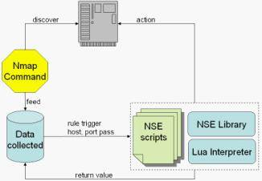
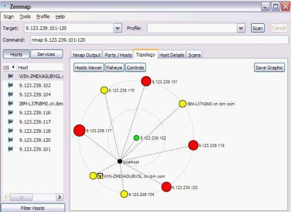

# 利用 Nmap 实现快速的网络发现与管理
让你快速上手 Nmap

**标签:** 

[原文链接](https://developer.ibm.com/zh/articles/os-cn-nmap/)

胡 沙, 王 全剑, 华 超

发布: 2011-03-03

* * *

快速并准确掌握网络中主机、网络设备及运行的网络服务信息是管理大型网络的基础，传统基于预定义端口的扫描或者基于 SLP 协议的发现机制，很少考虑到实际的网络环境，网络发现的效率和可侦测的主机或服务类型都非常有限。Nmap 软件可以有效地克服这些问题，帮助网络管理员实现高效率的日常工作，如查看整个网络的库存信息、管理服务升级计划，以及监视主机和服务的运行情况。

**值得注意的是，在使用 Nmap 软件之前，需要确认该软件符合公司网络安全管理规定，且用于合法的用途；否则，请不要使用。**

本文主要从六个方面介绍 Nmap 在网络发现中的应用：

- Nmap 实现网络发现的基本原理
- 主机发现
- 服务与相关端口的侦测
- 操作系统的侦测
- Nmap 脚本引擎
- 库存信息的输出与图形化工具 Zenmap

## Nmap 实现网络发现的基本原理

Nmap 使用 TCP/IP 协议栈指纹来准确地判断出目标主机的操作类型。首先，Nmap 通过对目标主机进行端口扫描，找出正在目标主机上监听的端口；然后，Nmap 对目标主机进行一系列的测试，利用响应结果建立相应目标主机的 Nmap 指纹；最后，将此指纹与指纹库中的指纹进行查找匹配，从而得出目标主机类型、操作系统类型、版本以及运行服务等相关信息。

由 Nmap 精心构造并发送到主机的探测包是实现网络发现的关键，Nmap 根据不同的探测包将测试分为以下几种类型。

### Sequence generation (SEQ, OPS, WIN, and T1)

该测试由六个 TCP 包的序列组成，包之间的时间间隔是 100 毫秒。每次探测会发送一个 TCP SYN 数据包到远程主机开放的 TCP 端口上。这些测试的结果将会包含四行类型行，第一行是 SEQ，包含探测包的序列分析结果；第二行是 OPS，包含每个探测包的 TCP 选项；第三行是 WIN，包含探测响应的 TCP window size；最后一行是 T1，包含序列中第一个包的测试值。

### ICMP echo (IE)

该测试将会连续发送两个 ICMP echo 请求包给目标主机，两次探测的结果将被合并一起，以便后续响应测试处理。

### TCP explicit congestion notification (ECN)

该测试主要探测目标 TCP 栈对显式拥塞通知（ECN）的支持。ECN 是一种允许路由器提前告知数据包丢失问题从而提升网络性能的方法。Nmap 通过发送一个 TCP SYN 包并设置其 ECN CWR 和 ECE 拥塞控制标签来达到检测目的的。

### TCP (T2 – T7)

T2 到 T7 这六个测试都是发送一个 TCP 探测包，其具体描述如下：

- T2 发送一个空的 TCP 数据包（无 Flag 设置）到一个开放的端口上；
- T3 发送一个 TCP 数据包（Flag=SYN，FIN，URG，PSH）到一个开放的端口上；
- T4 发送一个 TCP ACK 数据包到一个开放的端口上；
- T5 发送一个 TCP SYN 数据包到一个关闭的端口上；
- T6 发送一个 TCP ACK 数据包到一个关闭的端口上；
- T7 发送一个 TCP 数据包（Flag=FIN，PSH，URG）到一个关闭的端口上。

### UDP (U1)

该测试是发送一个 UDP 数据包到一个关闭的端口上，如果端口确实关闭且没有防火墙阻拦的情况下，Nmap 将会收到一个 ICMP 端口不可到达的消息。

Nmap 通过以上这些探测的组合，获取响应结果并做一系列标准的测试，从而实现网络发现的系列功能。

## 主机发现

主机发现（Host Discovery）指确定一个 IP 地址范围内存在的主机，它是进行网络管理的第一步。Nmap 为此提供了一系列的选项来满足各种需求，它的功能远远超越了 Ping 命令发送简单 ICMP 请求来探测主机是否在线。用户可以通过列表扫描选项 -sL 或者禁用 Ping 选项 -Pn 跳过 Ping 的步骤，也可以使用多个端口把 TCP SYN/ACK, UDP, SCTP INIT and ICMP 探测组合起来扫描，用以确定某个 IP 地址是否活动以及对应的主机或网络设备的情况。Nmap 命令的格式如下：

```
nmap [Scan Type(s)] [Options] {target specification}

```

Show moreShow more icon

命令参数分为三个部分，Scan Types 指探测类型，如 -PS 指 TCP SYN Ping，-PA 指 TCP ACK Ping，-PU 指 UDP Ping 等等；Options 指探测选项，如 -n 指不对活动的 IP 地址进行反向域名解析，用以提高扫描速度，-R 指对活动的 IP 进行反向域名解析；target specification 指探测的目标地址或 IP 地址范围，如 9.123.239.101-120，指范围在 9.123.239.101 到 9.123.239.120 内 20 个 IP 地址。用户可以用 `nmap -help` 获得主机发现的参数说明。

如果用户使用命令 `nmap 9.123.239.101-120` 进行默认的主机扫描，Nmap 会发送一个 ICMP echo 请求，一个 TCP SYN 包给 443 端口，一个 TCP ACK 包给 80 端口和一个 ICMP 时间戳请求，这就等价于使用命令 `nmap -PE -PS443 -PA80 -PP 9.123.239.101-120` ，运行之后的部分输出结果如下所示：

```
......
Nmap scan report for WIN-ZMEXAGUBVGL.cn.ibm.com (9.123.239.108)
Host is up (0.00s latency).
Not shown: 996 filtered ports
PORT     STATE SERVICE
135/tcp  open  msrpc
139/tcp  open  netbios-ssn
445/tcp  open  microsoft-ds
5357/tcp open  unknown
MAC Address: 00:0C:29:E6:2C:F3 (VMware)
......
Nmap scan report for 9.123.239.120
Host is up (0.00s latency).
Not shown: 990 closed ports
PORT      STATE SERVICE
80/tcp    open  http
135/tcp   open  msrpc
139/tcp   open  netbios-ssn
445/tcp   open  microsoft-ds
1038/tcp  open  unknown
1723/tcp  open  pptp
2522/tcp  open  unknown
2967/tcp  open  symantec-av
3389/tcp  open  ms-term-serv
20000/tcp open  unknown
MAC Address: 00:0D:60:AC:D1:85 (IBM)

Nmap done: 20 IP addresses (9 hosts up) scanned in 12.42 seconds

```

Show moreShow more icon

通过对上述输出结果的分析，可以知晓在一个 IP 地址段中活动的主机及其 IP 地址，主机域名，开启的服务以及相应的端口，MAC 地址等信息，为深入的网络发现提供了基础数据。

## 服务与相关端口的侦测

服务和相关端口的侦测是 Nmap 的最基本功能。Nmap 能够侦测出端口的基本状态，通过 `Nmap < 主机 >` 这个命令扫描目标主机上的超过 1660 个 TCP 端口。传统情况下只列出端口的开放还是关闭状态，而 Nmap 将端口细分为六个状态：open，closed，filtered，unfiltered，open\|filtered，closed\|filtered。对于 filtered( 过滤状态 ) 指的是在通向目标主机的链路中有包过滤机制（防火墙，路由器规则或者主机上的软件防火墙），Nmap 无法确定发送的探测报文是否到达端口的情况。unfiltered（未被过滤的）状态意味端口可以访问，但是不能确定是否开放或关闭，只有用于映射防火墙规则集的 ACK 扫描才会把端口分类到这种状态。当无法确定端口是开放还是被过滤时，Nmap 就把端口状态设置为 open\|filtered，当一个开放的端口不响应时，Nmap 的探测报文或者目标主机的响应报文被过滤，此时 Nmap 无法确定端口到底是开放还是被过滤的状态。closed\|filtered 和前者有类似的含义。

Nmap 支持的端口扫描技术有十几种，命令格式为 nmap -s(C) host,C 指定端口扫描所使用的技术。大部分情况下的扫描技术通常都单独使用，除了 UDP 扫描（-sU）可能和任何一种 TCP 扫描联合使用。这里主要例举下面几种：

- TCP 连接扫描（-sT）：使用操作系统的网络连接系统调用 connect()，对目标主机发起 TCP 三路握手，待完成后 Nmap 立即中断此次连接。Nmap 通过获取每个尝试连接的状态信息来判定侦测端口的状态。
- SYN 扫描 (-sS)：这是另外一种形式的 TCP 扫描，不同之处在于 Nmap 自身产生探测报文并且监控目标主机返回的响应，Nmap 产生一个 SYN 数据报文，如果侦测端口开放并返回 SYN-ACK 响应报文，Nmap 据此发送 RST 报文给侦测端口结束当前连接，这样做的好处在于缩短了端口扫描时间。
- UDP 扫描 (-sU)：UDP 本身是无连接的协议，Nmap 向目标主机的端口发送 UDP 探测报文，如果端口没有开放，被侦测主机将会发送一个 ICMP 端口不可到达的消息，Nmap 根据这个消息确定端口闭合（closed）或者被过滤 (unfiltered)。通常没有回复意味着端口是开放（open）状态。
- ACK 扫描 (-sA)：这种扫描比较特殊，它不能确切知道端口的基本状态，而是主要用来探测防火墙是否存在以及其中设定的过滤规则。
- FIN 扫描 (-sF)：和 SYN 扫描相比，这种方式更为隐蔽，因此能够穿过防火墙的过滤，关闭（closed）端口将会返回合适的 RST 报文，而开放端口将忽略这样的侦测报文。具备类似防火墙不敏感特性的还有 -sN NULL 扫描，-sX X-mas 扫描。

除了这些扫描选项外，还可以在命令中指定扫描端口的范围 (-p )，方式（快速扫描有限的端口 -F），顺序（不要按随机顺序扫描端口 -r），例如：

```
nmap -sT -p 1-1000 insecure.org

```

Show moreShow more icon

执行的是按照 TCP 扫描方式对 insecure.org 主机上端口号 1 到 1000 的端口进行侦测。

对于常用端口，其对应的服务基本固定，例如 TCP 服务常常在 25/80 端口，UDP 服务在 53 端口，SMTP，HTTP，DNS 等各种常用服务基本都是用公认的端口。Nmap 可以在进行端口侦测的同时对端口上对应的服务（包括服务状态，版本号）进行侦测，利用目标主机反馈的信息和已知的 nmap-services 数据库对比（包含超过 2200 中服务）检测出相应的服务。如：

```
nmap -sV -F insecure.org
nmap -A -T4 -F insecure.org

```

Show moreShow more icon

-sV 开启服务的版本侦测。-A 不仅开启对服务的版本侦测，同时为开启更为严苛的选项做准备，这里 -T4 限定了更为严苛的侦测时间。由于不是所有的 Nmap 侦测都会得到反馈，需要对侦测的强度进行设定，在服务侦测中有三个等级：

```
--version-intensity <0~9>，设定 0 到 9 之间的侦测强度等级；
 --version-light 设定等级为 2；
 --version-all 设定等级为 9；

```

Show moreShow more icon

等级越高，侦测过程中的尝试次数越多，识别服务的可能性就会越大。默认情况下，Nmap 版本及服务探测会跳过 9100 TCP 端口，可以通过选项 -allports 开启侦测所有端口上的服务信息，如：

```
nmap -sV --allports --version-light -F insecure.org

```

Show moreShow more icon

指令对 insecure.org 主机进行服务版本侦测，侦测过程中以较低强度扫描所有端口。

## 操作系统的侦测

在收集网络库存信息时，需要知道除了主机地址及端口服务之外更为详细的信息，操作系统侦测能够帮助人们很方便的实现这一目的。

不同的操作系统以及不同版本的系统在 TCP/IP 协议上指纹参数的设定存在差异，Nmap 通过收集这些参数进行比对得到系统的类型和版本信息。这些参数包括：

##### 表 1\. 参数列表

参数名位长参数名位长Initial packet size16 bitsInitial TTL8 bitsWindow size16 bitsMax segment size16 bitsWindow scaling value8 bits“don’t fragment” flag1 bits“sackOK” flag1 bits“nop” flag1 bits

Nmap 通过解析侦测目标在这 67 个 bit 位上返回的结果和数据库 nmap-os-fingerprints 中已知的操作系统对应的指纹进行比较得到操作系统的分类、供应商、系统名称、版本和设备类型（通用设备，路由器，交换机，游戏控制台）等详细信息。

在 Nmap 中系统侦测，对应的指令选项为 -O，也可以使用 -A 来同时启动系统侦测和版本侦测。另外选项 –osscan-limit 用于筛选满足有一个打开和关闭的 TCP 端口的主机进行系统侦测，这样可以加快检测速度；选项 –osscan-guess 和 –fuzzy 在 Nmap 无法确定所检测的系统时，会尽可能提供最近的匹配，这也是 Nmap 的默认选项，如

```
nmap -O  --osscan-guess IBM-R86M1BP

```

Show moreShow more icon

指令侦测目标主机 insecure.org 的系统属性，侦测得到的关于系统的参数主要有设备类型 (device type)，系统名称 (running)，系统的版本细节 (OS details)，上述指令得到的结果如下：

```
...
Device type: general purpose
Running: Microsoft Windows XP
OS details: Microsoft Windows XP SP2 or SP3, or Windows Server 2003
Network Distance: 1 hop

```

Show moreShow more icon

其中 Network distance 为 1 表明待测试主机和发动测试的 nmap 客户端在同一个以太网内。使用 -v 选项还能开启显示更多系统的详细信息，包括主机系统的启动时长估计 (Uptime guess)，TCP 序号预测 (TCP Sequence Prediction) 等信息。

## Nmap 脚本引擎

Nmap Scripting Engine(NSE) 是 Nmap 非常重要的特性，它允许用户使用 Lua 语言编写简单的脚本程序来实现各种网络管理任务的自动化运行。目前 Nmap 已提供超过 150 个脚本，您可以在 [这里](http://nmap.org/nsedoc) 查看和下载这些脚本，或者在本地 Nmap 安装目录下的 scripts 目录中查看这些脚本，或者编写 Lua 程序定制脚本。

NSE 的执行非常简单，以 `nmap --script http-auth.nse target` 命令为例，–script 参数后面跟的是需要执行的脚本名。如果将— script 替换为 -sC，表明执行 default category 中的所有脚本。

##### 图 1\. NSE 执行流程



NSE 执行流程如图 1 所示。首先 Nmap 扫描 target，将扫描到的信息，如 name, ip, port 状态等信息收集起来；http-auth.nse 中的 portrule 触发 action 方法，host，port 信息被作为参数传入到 action 方法中；http-auth.nse 的 action 方法进行更进一步的扫描，将 target 的 http server 的用户名和密码返回。

## 库存信息输出与图形化工具 Zenmap

Nmap 支持多种输出格式：1）Interactive Output，直接输出到控制台上，不需要特殊的输出命令；2）Normal Output, 基本和 Interactive Output 一样，通过 -oN 来指定输出到哪个文件；3）XML Output，将输出的结果转换为 XML 形式然后输出，通过 -oX 指定输出到那个 XML 文件；4）Grepable Output，这种输出方式适合于用 grep 命令提取信息，通过 -oG 指定输出到那个文件。其中值得一提的是 XML Output，第三方的 XML 解析库可以帮助用户进行 XML 结果分析，Nmap 也可以将 XML 格式的文件转化为 HTML 格式，方便用户通过浏览器进行查看和结果分析。对于希望将 XML 文件中的数据导入到数据库中的用户来说，可以通过 nmap-sql 小工具将结果导入到 MySQL 数据库中。对于开发人员来说，该输出格式为利用 Nmap 网络发现功能提供了便利的开发接口。

除了多样的库存信息输出格式，Nmap 还为用户提供了的图形化管理工具 [Zenmap](http://nmap.org/zenmap/) 。除了可在该软件上直接执行命令外，其比较有特色的地方是可以显示已经扫描网络的拓扑结构，帮助管理员直观的掌握网络发现的结果（如 图 2）。在 Zenmap 的 Command 输入框中加入 –traceroute 参数，可以在 Topology 选项卡中可以查看从本机到 targethost 的路由图。点击 Controls 按钮以后弹出的对话框中可以根据需要显示网络拓扑节点上主机的详细信息。

##### 图 2\. Zenmap 拓扑结构图界面



## 结束语

综上所述，利用 Nmap 工具实现网络发现与管理，无论在效率上还是准确性上，都比传统基于 SLP 或者基于预定义端口扫描技术都要有优势。更为重要的是，它是一种带外（Outband）管理方法，无需在被管理主机上安装任何 Agent 程序或者服务，增加了网络管理的灵活性和松散耦合性，因此值得广大网络管理员和开发者了解与掌握。