# 利用 OpenCV 识别图片中图形的轮廓
Windows 环境下 OpenCV, Cygwin, Eclipse 开发环境搭建与开发实例

**标签:** 分析,机器学习,深度学习,视觉识别

[原文链接](https://developer.ibm.com/zh/articles/use-opencv-to-recognize-contours/)

王野川

发布: 2020-12-09

* * *

## Open CV 简介

OpenCV 是基于 BSD (Berkeley Software Distribution，伯克利软件套件)的开源的非商业盈利的计算机视觉和机器学习软件库，用来促进视觉的商业应用发展。它可以跨平台运行在 Windows，Android，Maemo，FreeBSD，OpenBSD，iOS，Linux 和 Mac OS 操作系统上。OpenCV 主要由 C++语言编写，但是提供了 Python、Ruby、MATLAB 等编程语言的接口，实现了图像处理和计算机视觉方面的很多通用算法。使用者可以在 SourceForge 获得官方版本，或者从 SVN 获得开发版本。本文从 OpenCV 的整体架构开始介绍，逐步深入介绍 Cygwin 的安装和配置、在 Eclipse 环境中 Cygwin 与 OpenCV 的集成以及安装配置中常见的问题和解决方案。最后用实际案例展示 OpenCV 如何忽略图片中的背景，识别出图形的轮廓。

## 搭建 OpenCV 开发环境

### 前提条件

1. Windows 10
2. Java 8.0
3. OpenCV 最新版
4. Eclipse CDT 4.1.6
5. Cygwin 3.1.7

### 关系图及流程图

开发环境的关系图与流程图如下图所示。

**图 1\. 关系图**

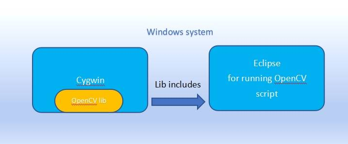

**图 2\. 流程图**

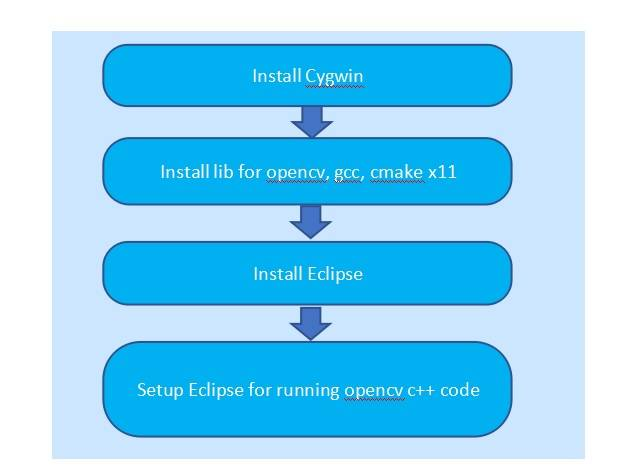

### Cygwin 安装

1. 首先打开 [Cygwin 官网](http://cygwin.com/)，点击链接 setup-x86\_64.exe（64 位）或 setup-x86.exe（32 位）下载安装程序并保存在本地。（不要保存在 c:\\cygwin64，该目录将作为安装目录），然后运行安装程序 setup-x86\_64.exe。
2. 安装方式选择 Install from Internet，这种安装方式会保存安装程序供以后复用。
3. 安装路径通常都使用默认的 c:\\cygwin64，使用对象也选择默认值 All Users，选择一个路径存放安装程序，如 C:\\Download，如果没有使用代理服务器，选择 Direct Connection，最后选择距离最近的网址作为下载源进行安装。

### Cygwin 中 OpenCV 的安装与配置

在 Cygwin 安装过程中，可以搜索“libopencv-devel” 和“libopencv2.4”，选择最新版来安装 OpenCV。

**图 3\. Cygwin Setup**

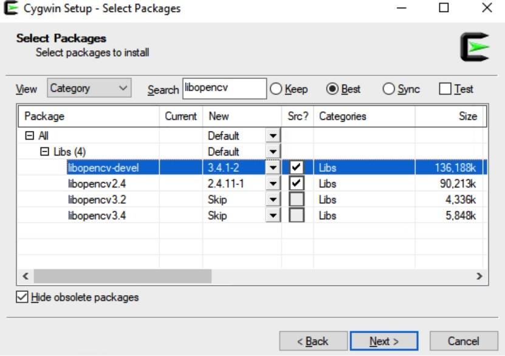

搜索 gcc 并安装下图所示的包做为 C++编译器。

**图 4\. gcc**

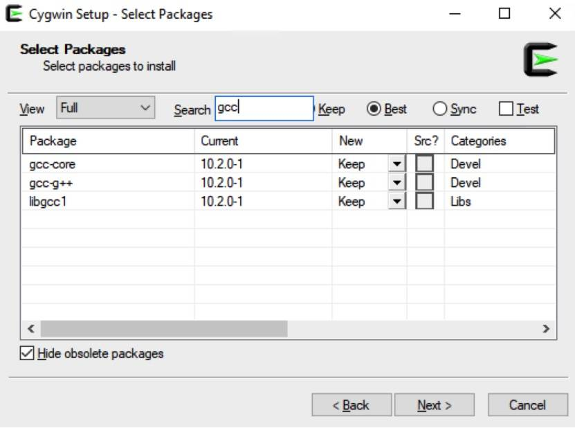

搜索“cmake“,选择 Devel 下的 cmake 最新版，来安装 cmake 作为 C++的编译工具。

**图 5\. cmake**

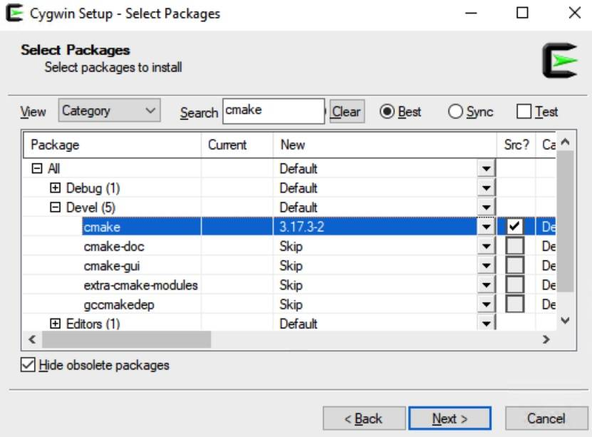

搜索 X11 目录下的“xinit”, “xorg-server”, “xorg-x11-fonts-XXXXX”的最新版，来安装用于 OpenCV 项目图形显示的 Xserver。

**图 6\. Xserver**

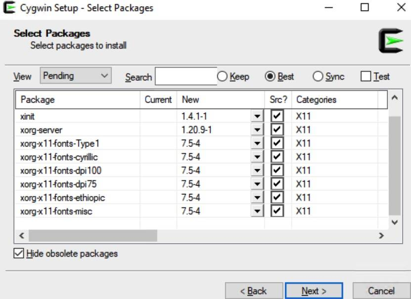

最后完成安装即可。

### Eclipse 中 Cygwin 与 OpenCV 的集成

从Eclipse 官网下载并安装 Eclipse IDE for C/C++ Developers 202009。安装完成后运行 eclipse.exe 文件启动 eclispe。新建一个 C++项目（如果是第一次使用 eclipse 请新建一个 workspace）。点击 File > New > C++ Project，在 workspace 中创建 C++Project。

**图 7\. 创建项目**

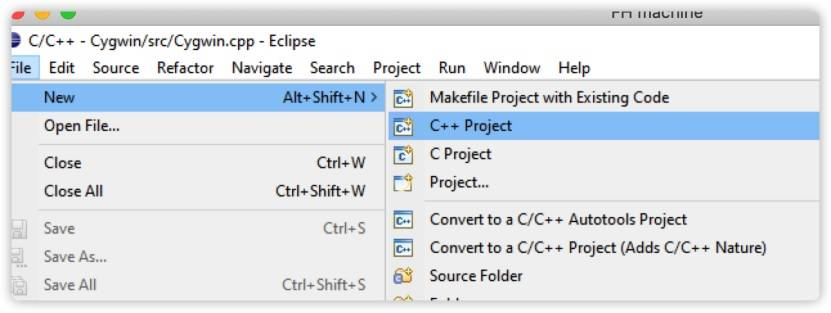

在 C++ Project 弹出页面，输入 Project name。选择“Empty Project”和“CygwinGCC”，其他选择按照默认选项，点击“Finish”按钮。

**图 8\. 选择编译器**

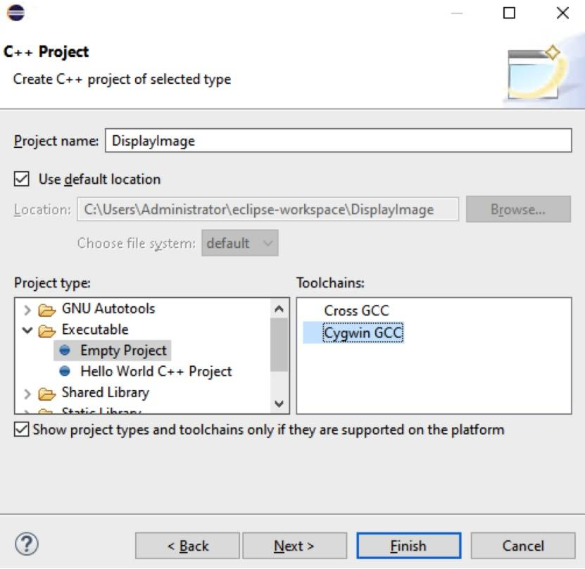

使用 OpenCV 添加一个源文件：

- 右键点击已创建的 project，点击 New > Folder 。

**图 9\. 创建文件夹**


- 在 Source File 弹框中为源文件命名，完成创建含有一个空的 .cpp 文件的项目。

**图 10\. 创建源文件**

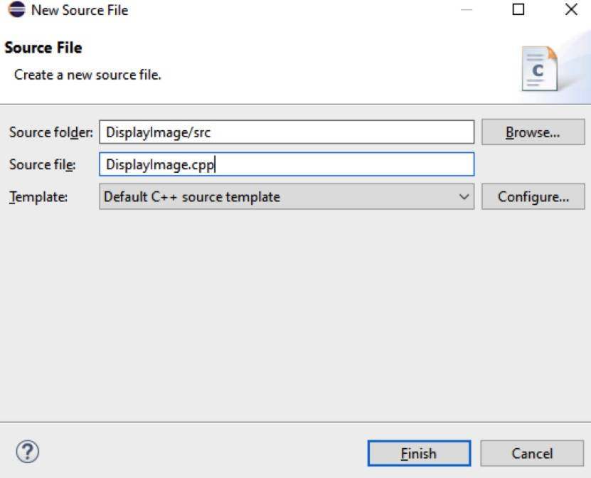

在 cpp 文件中写入简单的显示图片的代码，如下：

```
#include <opencv2/opencv.hpp>
using namespace cv;
int main( int argc, char** argv )
{
Mat image;
image = imread( argv[1], 1 );
if( argc != 2 || !image.data )
    {
      printf( "No image data \n" );
      return -1;
    }
namedWindow( "Display Image", WINDOW_AUTOSIZE );
imshow( "Display Image", image );
waitKey(0);
return 0;
}

```

Show moreShow more icon

最后在 C++ Linker 处添加库以及库搜索路径。右键 Displayimage 项目，选择“Property”，在 properties 弹出框中选择 C/C++ Build > Settings, 在 setting 界面选择 Cygwin C++ Linker > Libraries，在 Librariessearch path 中输入 OpenCV 的文件位置/lib 和/usr/lib。在 Libraries 中输入文件库，所需文件库如下图所示。

**图 11\. 添加 lib**


接下来在 C/C++ Build > Tool Chain Editor > Current builder 中选择 CDT internal Builder，点击“Apply”按钮。

**图 12\. 配置编译器和 Linker**

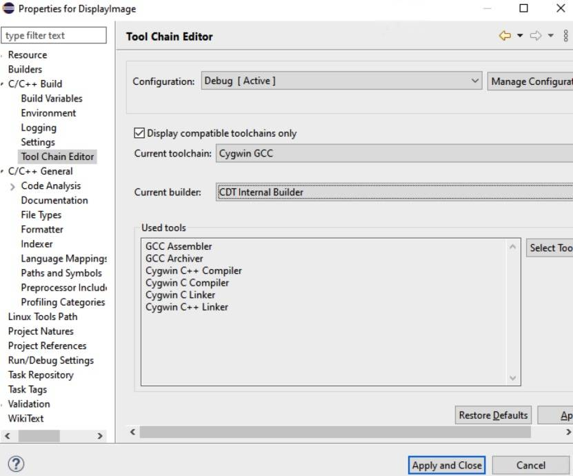

下一步配置项目。右键 Displayimage，选择 Run As > Run Configurations… ，在弹出的 Run Configurations panel 中展开 C/C++ Application > DisplayImage Debug，如下图所示。

**图 13\. 配置应用**

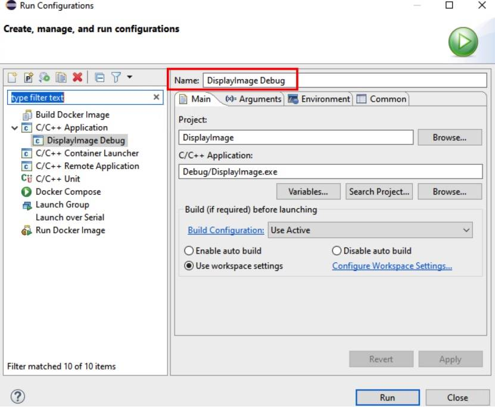

选择 Arguments menu 输入图片途径和图片名称。在 Environment menu 增加 DISPLAY variable，如下图。

**图 14\. 配置应用参数**

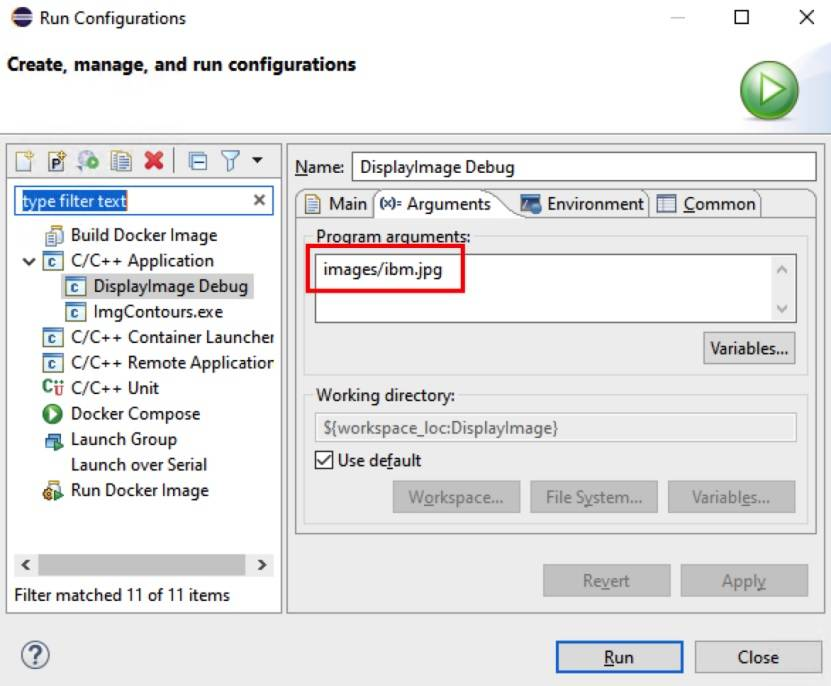

配置完成后运行 Project -> Build Project 对项目进行编译。

**图 15\. Build Info**

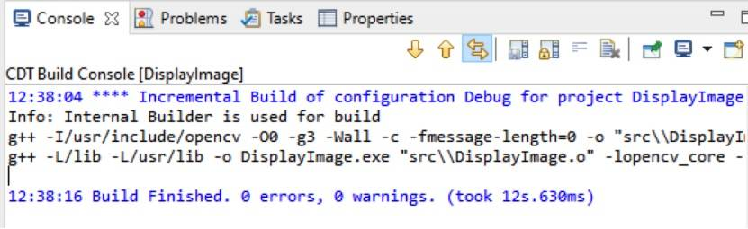

点击 C:\\cygwin64\\bin\\XWin.exe 运行 Cygwin 程序，再点击界面上部的 Run button，程序运行结果如下图所示。

**图 16\. 运行结果**

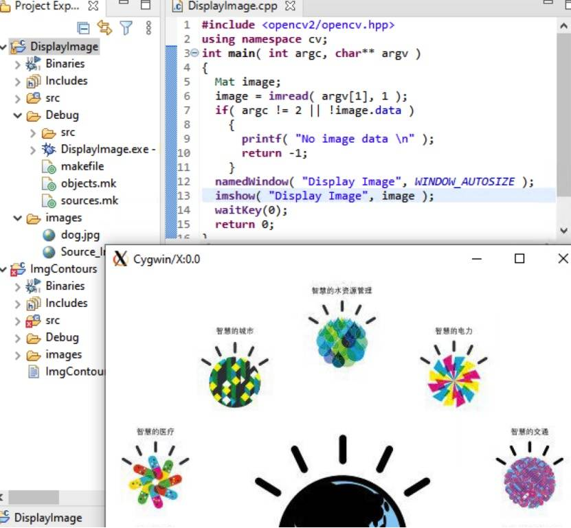

## 利用 OpenCV 识别图片中图形的轮廓

下面用一个例子介绍 OpenCV 图片处理的几个功能。图片中一般会包含多个图形，如果我们用图片处理的方法获得图形的轮廓，那么对后期人工智能训练模型会比较有帮助。所以，我们介绍如何用 OpenCV 来识别图片中多个图形的轮廓，并画出图形的轮廓，以及包含这个轮廓的最小圆形。

请打开此 [链接](https://github.com/liujul/ImgContours) 查看源代码。

第一步，读入图片，调用 cvtColor 方法将彩色图片转成灰度图，再调用 blur 方法对图片做平滑处理，目的是减少噪音。平滑处理需要一个滤波器，缺省情况下使用的是线性滤波器，本例未设置滤波器类型，所以使用缺省滤波器。blur 方法的第三个参数 Size(3,3)是指滤波器的大小。平滑处理后，图片存放到目标图片 img\_gray 中。

```
Mat img;
Mat img_gray;
img = imread( argv[1], IMREAD_COLOR );
cvtColor( img, img_gray, COLOR_BGR2GRAY );
blur( img_gray, img_gray, Size(3,3) );

```

Show moreShow more icon

第二步，threshold 方法是把灰度图变成黑白图。threshold 方法支持多种 threshold type，本例用到的 type 是 THRESH\_BINARY。对于这种 type，大于阈值 thresh 的像素值设置为 255，小于阈值 thresh 的像素值设置为 0。目标图片存放到 img\_gray 中。

```
threshold( img_gray, img_gray, thresh, 255, THRESH_BINARY );

```

Show moreShow more icon

第三步，获取图片中图形的轮廓。我们先定义两个向量，向量 contours 用来保存所有的轮廓，向量 hierarchy 用来保存多个轮廓之间的继承关系。方法 findContours 来找到图片中所有图形的轮廓，结果存放到 contours 向量。轮廓之间的关系放到 hierarchy 向量。第四个参数定义轮廓的检索模式，本例用 RETR\_TREE 模式。RETR\_TREE 模式检测所有的轮廓，并建立一个等级树状结构，外层轮廓包含内层轮廓，内层轮廓进而包含内嵌轮廓。第五个参数定义轮廓的近似方法。CV\_CHAIN\_APPROX\_SIMPLE 只保存轮廓的拐点，轮廓拐点上的点存放到 contours 向量中。

```
vector<vector<Point> > contours;
vector<Vec4i> hierarchy;
findContours( img_gray, contours, hierarchy, RETR_TREE, CHAIN_APPROX_SIMPLE );

```

Show moreShow more icon

第四步，得到图形轮廓后，我们开始绘制轮廓多边形，并画出包含轮廓的最小圆形。
approxPolyDP 方法根据图形轮廓 contours 上的点来获取包含该轮廓的多边形点集合，多边形点集合存放到 poly 向量中。第三个参数定义输出精度为 5。第四个参数表示输出是封闭图形。
接下来我们画出该多边形，方法 drawContours 将多边形 poly 绘制到目标图片 dst 上。
然后我们获取并绘制包含轮廓的最小圆形。首先调用方法 minEnclosingCircle 来获取包含多边形 poly 的最小圆形的圆心 circle\_center 和半径 circle\_radius。然后调用方法 circle 将圆形画到目标图片 dst 上。

```
vector<vector<Point> > poly( contours.size() );
vector<Point2f>circle_center( contours.size() );
vector<float>circle_radius( contours.size() );
Mat dst = Mat::zeros( img_gray.size(), CV_8UC3 );
if(!contours.empty())
{
    RNG rng(time(0));
    size_t i = 0;
    for( ; i < contours.size(); i++ )
    {
        Scalar color = Scalar( rng.uniform(0, 255), rng.uniform(0,255), rng.uniform(0,255) );
        approxPolyDP( Mat(contours[i]), poly[i], 5, true );
        drawContours( dst, poly, (int)i, color, 1, 8, vector<Vec4i>(), 0, Point() );

        minEnclosingCircle( poly[i], circle_center[i], circle_radius[i] );
        circle( dst, circle_center[i], (int)circle_radius[i], color, 2, 8 );
    }
}

```

Show moreShow more icon

第五步，保存图片到文件。经过第四步，图片 dst 上包含了图形轮廓信息以及包含图形轮廓的最小圆形。最后我们调用 imwrite 方法将图片保存到文件。

```
imwrite( "images/Output_Image.jpg", dst );

```

Show moreShow more icon

你可以查看 [源代码](https://github.com/liujul/ImgContours)，将源代码导入到 Eclipse，然后按照上文中 Eclipse 的配置方法配置 Eclipse 项目，然后构建并运行该项目。
运行结果如下：

**图 17\. 源图片**

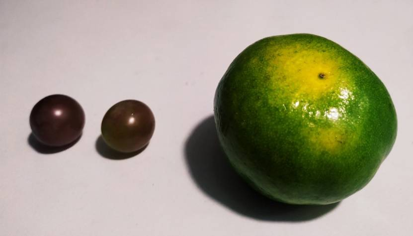

**图 18\. 运行结果**

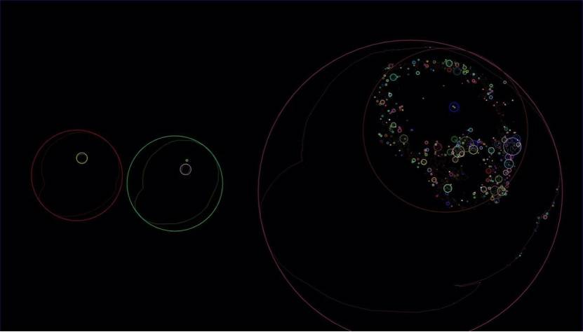

## 遇到的问题

### 问题 1\. opencv 的 lib 没有正确引入

```
13:41:20 **** Incremental Build of configuration Debug for project DisplayImage ****
Info: Internal Builder is used for build
g++ -L/lib -o DisplayImage.exe "src\\DisplayImage.o"
/usr/lib/gcc/x86_64-pc-cygwin/10/../../../../x86_64-pc-cygwin/bin/ld: src\DisplayImage.o: in function `cv::String::String(char const*)':
/usr/include/opencv2/core/cvstd.hpp:602: undefined reference to `cv::String::allocate(unsigned long)'
/usr/include/opencv2/core/cvstd.hpp:602:(.text$_ZN2cv6StringC1EPKc[_ZN2cv6StringC1EPKc]+0x51): relocation truncated to fit: R_X86_64_PC32 against undefined symbol `cv::String::allocate(unsigned long)'
/usr/lib/gcc/x86_64-pc-cygwin/10/../../../../x86_64-pc-cygwin/bin/ld: src\DisplayImage.o: in function `cv::String::~String()':
/usr/include/opencv2/core/cvstd.hpp:648: undefined reference to `cv::String::deallocate()'
……
collect2: error: ld returned 1 exit status

```

Show moreShow more icon

当运行时遇到上面的错时，原因是 opencv 的 lib 没有正确引入。请参照下图进行 opencv 的 lib 配置。

**图 19\. 配置 lib**

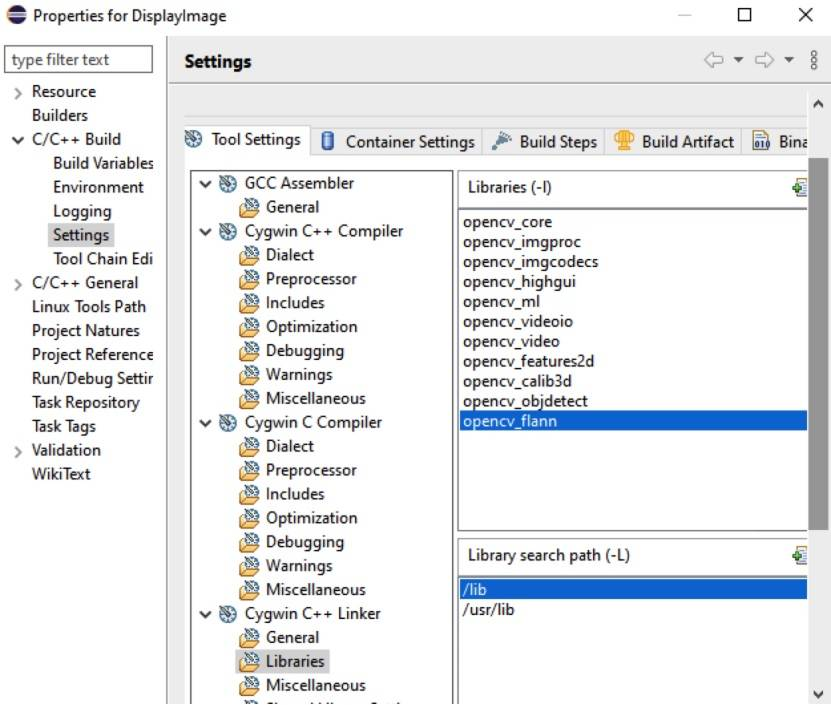

### 问题 2\. 运行上面的程序不能看到图片的显示

首先请在 Eclipse Run Configurations -> Environment 添加配置 Display = :0.0，并在 CMD 运行 C:\\cygwin64\\bin\\XWin.exe （C:\\cygwin64 可替换成 cygwin 安装的目录）。此时再次运行上面的程序，图像将会在 cygwin:0.0 窗口里显示。

**图 20\. 配置 DISPLAY**

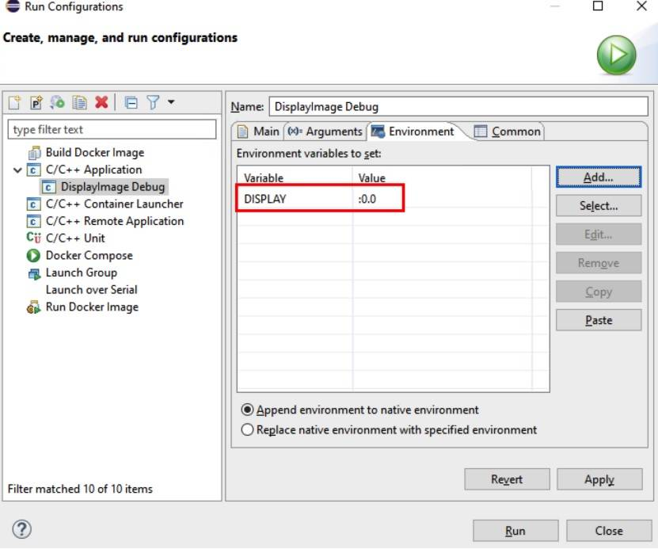

### 问题 3\. Windows Server2012 运行显示图片的程序报错

错误信息：

```
libGL error: Windows-DRI extension disabled for GDI Generic renderer

```

Show moreShow more icon

系统兼容问题，此时可以在命令行窗口或者使用 Windows 10 正常运行程序。

### 问题 4\. make: _\*_ multiple target patterns 错误

编译后一切正常，但是运行的时候会报错：

```
Description Resource Path Location Type
make: *** multiple target patterns.  Stop.

```

Show moreShow more icon

配置 cygwin 的时候，在 Window>preferences>C/C++>Debug>Source Lookup Path 都要新建一个 path mapping，即将/cygdrive/c/映射成 C:\\。 但 ADT Bundle 提供的 Eclipse 里，点确定后/cygdrive/c/自动变成\\cygdrive\\c\\而使映射无效。解决方式为选中项目点 Alt+Enter，在 C/C++ Build>Tool Chain Editor>Current Builder 选择 CDT Internal Builder 代替 Gnu Make Builder。

**图 21\. 配置 Current builder**

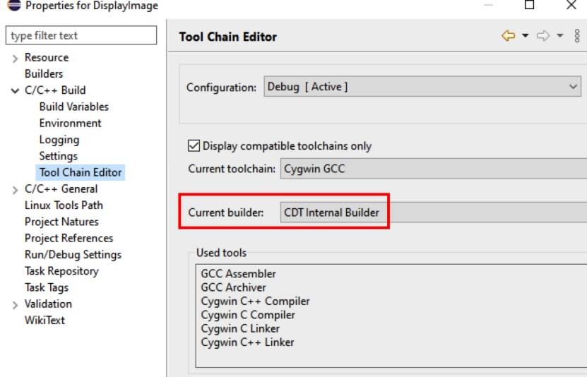

### 问题 5\. Windows 环境中 Can’t open display 错误

即便正确设置了 DISPLAY 为 :0.0，运行程序仍然得到 can’t open display 的错误信息，这是因为 Unix GUI 程序是通过 Xsever 来显示的，而 Cygwin 不会自动启动 Xserver,安装 xorg-server 和 xinit 程序包再执行 startxwin 即可解决。

## 小结

本文介绍了 OpenCV，以及 Windows 上 OpenCV 开发环境的搭建步骤和相关问题。相信通过上面的步骤，你可以搭建属于你自己的开发环境。另外本文介绍了 OpenCV 获取图片中图形轮廓的一个例子。你也可以用 OpenCV 来开发图片，视频，AI 的其他应用，开启你的 OpenCV 之旅。

最后，衷心感谢王丽娜、陈南、刘菊玲在写作过程中提供的帮助。