# 利用 Transformer 设计和构建高效的时序模型
了解 Transformer

**标签:** 机器学习,深度学习

[原文链接](https://developer.ibm.com/zh/articles/ba-lo-transformer-design-and-build-efficient-timing-models/)

尹 鹏

发布: 2020-03-10

* * *

## 简介

在自然语言处理领域，循环神经网络 RNN 一直是被最广泛使用的深度机器学习模型，近年来卷积神经网络 CNN 也逐渐被引入用来提升训练效果。然而这两类模型都有一些难以克服的问题，Transformer 模型以注意力机制为核心，具有计算简单和便于并行等天然优势，并且针对注意力机制的不足做了相关的设计和优化，取得了非常好的效果。本文我们就来一步步的分析和理解这个优秀的时序模型。

## 时序问题

时序（seq2seq）问题是应用机器学习（特别是深度学习）解决的一类常见问题，例如机器翻译，语态分析，摘要生成等自然语言处理问题（NLP），这类问题的最大特点是输入（或输出）以序列的形式出现，序列的长度可变，常见的自然语言处理任务通常要求在分析整个输入序列的基础上才能产生输出。使用机器学习（深度学习）处理时序任务，通常使用图 1 所示编码器-解码器（encoder-decoder）架构，编码器负责将输入序列转换为包含整个序列所有特征的序列编码（context vector），解码器负责根据这个内部表示按照任务需要产生输出。

##### 图 1.编码器-解码器架构

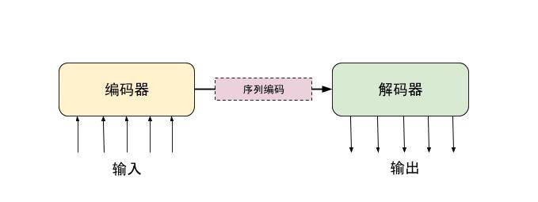

处理时序问题的传统方法是使用循环神经网络 RNN 模型，RNN 能够保存状态，它将输入序列以元素为单位分为多步，依靠每步输入和上一步的状态更新当前的状态（和输出），通过重复这种步骤在读入所有序列元素后得到序列编码。由于 RNN 有存储机制并且不限制序列的长度，从模型结构上来说比较适合时序问题，但是它的这些特性也导致了以下几个问题：

- 长序列的训练很困难，梯度下降算法在长序列的训练中容易发生梯度爆炸或梯度消失，虽然 LSTM 可以改善这个问题，但是在较长序列的训练中仍然无法完全避免。
- 由于每一步的状态由上一步状态决定，因此只能顺序执行，无法通过并行加速训练。
- 固定的存储空间不利于处理长度可变的序列。

为了解决 RNN 长序列训练问题，除了不断改进原生 RNN 之外，人们还尝试借助于卷积神经网络 CNN。这是由于 CNN 有能力处理一段输入序列而不是单个输入元素，虽然单个卷积核尺寸有限，可以通过堆叠多层卷积操作的方式逐步放大视域。但这样做会不可避免的导致信息丢失（卷积操作中的上采样过程会丢失信息），同时也增加了模型的复杂度。

上述两种模型对于长序列的处理都有缺陷，RNN 需要一步一步的处理输入序列，CNN 做出了一些改进但并不彻底。从根本上的解决长序列处理问题需要能一次性的处理全部输入，并且能根据这些输入信息分析序列元素之间的关联关系。人们从自己快速浏览的方式获得了启发，当人们需要快速浏览的时候不会按输入的顺序依次阅读，而会直接跳到需要关注的的部分，这种根据需要在不同位置跳跃的阅读方式和注意力相关，因此这种新的序列处理方式被命名为注意力机制（Attention mechanism）。

## 注意力机制

基于组成整体的各个元素在整体中发挥的作用不相同这样一个事实，注意力机制的基本思想是在一定的目标下使用相对应的的权重组合各个序列元素来重新描述适合该目标的序列。这就好像在日常生活中，带着不同的目的看同一个事物会产生不同的理解。在图 2 中寻找生物会发现鱼和珊瑚，而寻找人工建筑则会发现钻井平台的支柱，正是由于不同的目标导致对图片的的物体分配了不同的权重，因此产生了不同的理解。

##### 图 2.珊瑚，鱼和钻井平台支架

从实现上来讲，注意力运算表现为加权求和运算，即对输入序列中的元素赋予相应的权重并相加。这里的权重来自任务目标，具体来说是根据目标对输出序列的要求，确定输出序列元素和输入序列元素之间的关系，再通过这种关系确定输入元素的权重。举个例子，对于机器翻译任务来说，由于我们需要让输入元素与输出元素表达相同的意义，因此需要比较它们的相似性，给相似性高的元素较高的权重，而对相似性低的元素赋予较低权重。

如图 3 所示，X 表示输入序列集合 {x1,x2,…xn}，w2i 表示在以为 x2 目标的计算过程中 xi 的权重，可以将 X 对 x2 的注意力运算形式化的表示为

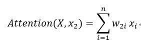

##### 图 3.序列 X 对元素 x2 的注意力计算

如上所述，w2i 决定于 xi和 x2 的相关性 Score(xi,x2 )，由于所有 X 都参与 x2 对应的计算，所以使用 softmax 来保证所有权值之和等于 1。

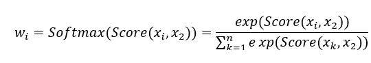

Score(xi,x2) 可以根据不同任务选择不同的计算方法，对于机器翻译任务来说，通常用矢量相似性来衡量元素的相关性，可以使用点积运算（dot product）

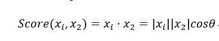

θ 表示两个向量之间的夹角，由于 θ 越小，cosθ 越接近 1，因此向量越相似。图 4 展示了向量 A,B 在不同夹角时的相似度。

##### 图 4.向量夹角和相似度的关系

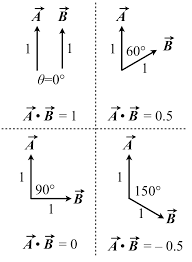

上述表示对于目标为单个元素时注意力计算的方法，大部分时序任务要求输出为序列，序列对于目标为序列的注意力计算方法是先分别计算 ，再将计算结果组成序列。

由于都是矩阵，他们的相似度可以表示为矩阵和相乘

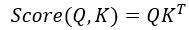

从运算的结果上看，由于 Attention(Q,K) 包含了序列 Q 所有元素的信息，因此我们也可以把注意力运算理解为 **序列（Q）在某一个序列上下文（K）环境中的重新定义**。这是一种对于时序任务非常有用的属性，RNN 由于能够保存输入序列的信息而被广泛应用于时序任务，相比 RNN 通过逐步更新状态最终得到整个序列的信息的机制，注意力机制不但也有能力获取整个序列的信息，更重要的是它能一步直接得到结果，这使得注意力机制具备以下优势：

(1)在并行方面，注意力机制不依赖于前一时刻的计算，可以很好的并行。传统方法使用 RNN 通过一步步的叠加分析过的输入来得到整个序列的内部表示（固定长度），注意力机制可以通过直接加权平均的方式来生成包含所有元素信息，每个元素的注意力计算都彼此独立因此可以同时进行。从图 5 可以发现，在处理由 x1,x2,x3 组成的序列过程中，RNN 需要在依次处理元素 x1, x2 和 x3 之后才能得到整个序列的上下文信息，而注意力则可以同时处理 x1，x2，x3 而得到序列的上下文信息。

##### 图 5.RNN 和注意力机制的比较

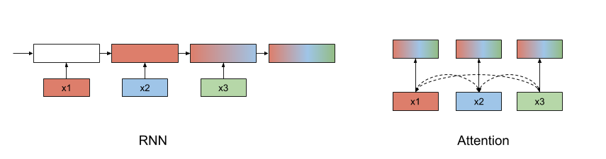

(2)在长距离依赖上，注意力机制不管元素中间距离多远，路径长度总是 1，可以轻松处理长距离依赖关系。RNN 则存在梯度弥散或者梯度爆炸的问题。

(3)注意力机制的计算复杂度更低，下表 1 对注意力，RNN，CNN 在计算复杂度上进行了对比，其中表示序列长度，表示序列元素的维度，表示卷积核的大小。由于在大部分自然语言处理任务中的元素维度都大于序列长度，因此对于这类任务来说注意力运算的计算复杂度要显著低于 RNN 和 CNN。

##### 表 1 Attention, CNN, RNN 计算复杂度比较

注意力O(length2⋅dim)RNNO(length⋅dim2)CNNO(length⋅dim2⋅kernel)

注意力机制可以更一般的表示为

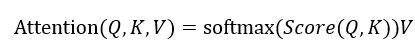

这里的 K,V 分别表示一个键值对中的键 key 和值 value，Q 则表示 query，这样我们之前的定义就变成 Attention(Q,K,V) 在当 K=V 条件下的特殊形式。 图 6 左侧表示了 Attention(Q,K,V) 的计算过程，按照由下向上的顺序:

- 首先通过矩阵相乘 MatMul 运算得到 Q 和 K 的相似度，
- 再通过 Softmax 操作转化为权重概率分布，
- 最后使用 MatMul 加入 V 信息。

对于 4 维向量=[Name, Age, Sex, Weight], 在 4 个维度上的取值分别为 James, 25, male, 68kg，当以 Age 作为注意目标 Q ，以相似度作为注意力规则时。由于 K 的 Age 维度和 Q 的 Age 维度相似度很高，因此 score(K\_Age,Q\_Age) 接近于 1（图中粉色和蓝色向量的方向接近），同理 K 的 Name，Sex 和 Weight 维度和 Q 的 Age 维度相似度接近于 0（可以理解为粉色向量 Q 垂直于 K1， K2 和 K3）。注意力计算的结果是 4 维向量，在 Name，Sex，weight 纬度上接近于 0，该向量所包含的绝大部分信息都来自于 Age 维度，在该维度上的值为 25。

##### 图 6.注意力机制中的 Q,K,V

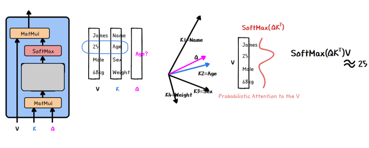

## Transformer 模型

Transformer 来自于 Google Brain 团队 2017 年的文章 Attention is all you need。正如论文的题目所述，整个网络结构完全由注意力机制组成，由于没有使用 RNN 和 CNN，避免了无法并行计算和长距离依赖等问题，用更少的计算资源，取得了更好的结果，刷新了多项机器翻译任务的记录。

如图 7 从整体架构上看，transformer 仍属于编码器-解码器架构，通过编码器（Encoder）将输入序列转换成内部表示，再通过不同解码器（Decoder）实现不同的预测功能。

##### 图 7.Transformer 架构

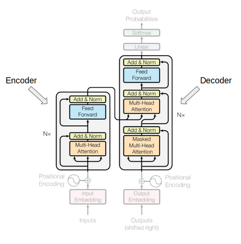

### 为什么 Attention is all you need

作为 Transformer 论文的最大创新，Transformer 模型仅仅使用注意力机制不仅完成了以前需要 RNN 才能做到的工作，而且做的更快更好，下面我们就来看看 Transformer 是如何做到的。

#### 自注意力

Transformer 模型的首要工作就是使用编码器生成序列编码，前面我们介绍了注意力机制具备聚合序列元素信息的能力，在 transformer 的编码器中就是使用这种能力来生成序列编码，由于在编码器中注意力机制的注意对象是输入序列自身，因此被称为自注意力（self attention）。时序问题（特别是自然语言处理问题）中的序列元素表示的含义通常不止该单个元素的的字面意义，而是与整个序列上下文有关系，因此在编码过程中需要考虑整个序列来决定其中每个元素的意义。自注意力机制中将每个元素都作为关注目标进行注意力计算，因此每个元素都对彼此在序列上下文中进行解释，很好的体现了这种通过全局确定局部的思想。 图 8 来自 Jay Alammar 的著名博文 The Illustrated Transformer，它可视化的展示了在机器翻译任务下自注意力机制在对输入元素”it”的解释过程中，”the”和”animal”都发挥了比较大的权重。

##### 图 8.编码器自注意力可视化

#### 注意力遮罩 Attention mask

由于注意力机制可以直接看到所有的元素，因此需要一种手段来防止注意力机制处理“不应该被看到的元素”，这是指在模型训练阶段不能让解码器的自注意力机制看到训练数据中当前时间点之后的正确预测值，否则模型就会利用标准答案”作弊”，如图 9 所示。

##### 图 9.注意力遮罩

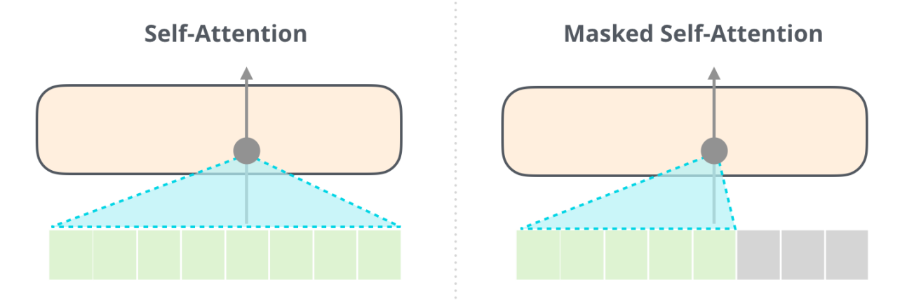

#### Scaled Dot-Product Attention (SDPA)

Transformer 对标准的注意力计算做了一个小小调整：加入特征缩放（feature scaling）。这样做主要是为了防止 softmax 运算将值较大的 key 过度放大，导致其他 key 的信息很难加入到计算结果中。 特征缩放体现在对 Q 和 K 计算点积 QKT 以后，增加了一步除以 √(d\_k ) 运算。

图 10 是上式的图像化表示，其中 Scale 就是特征缩放的操作。

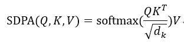

##### 图 10.SDPA

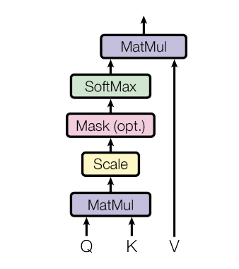

##### 位置编码 Positional encoding

与 RNN 和 CNN 不同，在注意力机制中没有先后顺序的概念（如第一个元素，第二个元素等），输入序列的所有元素都以没有特殊顺序或位置的方式输入网络，模型不知道元素的先后顺序。因此，需要将与位置相关的信号添加到每个元素中，以帮助模型理解序列中元素的排列顺序。最简单直接的位置编码方式是将每个元素的序号加入元素编码后再输入模型，这样做是否可行呢？考虑到序列的长度可以是任意长度，只讨论元素的绝对位置是不全面的（同一个词，在由 3 个词组成的句子中的第三个位置和 30 个词组成的句子中的第三个位置所表达的意思很可能是不一样的）。因此 Transformer 使用了基于周期函数（sin/cos 函数）的位置编码方法。Transformer 的位置编码 PE 可以表示为

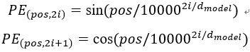

其中 pos 表示位置，i 表示元素编码的维度，dmodel 表示模型的维度，这种位置编码有如下优点：

- 利用 sin/cos 函数的周期性它能够进行任意长度序列的位置编码。
- 由于 sin(i+x) 函数可以展开为 sin(i)和 cos(i) 的线性表达式，使得 PE(i+x) 的计算可以展开为 PEi 的线性表达式，因此计算相对位置的效率比较高。
- 使用多个不同频率来保证不会由于周期性导致不同位置的编码相同。
- sin/cos 函数的值总是在 -1 到 1 之间，这有利于神经网络的学习。

计算产生的位置编码是一个与元素具有相同维度的向量，使用相加的方式将位置信息叠加进元素中，如图 11 所示。在 Transformer 论文中没有解释为什么使用相加方式，直观感觉相加操作会造成对元素向量的污染，而串联（concatenate）就不会有这种问题。实验显示在高维中随机选择的向量几乎总是近似正交的，也就是说元素向量和位置编码向量是相互独立的。因此尽管进行了矢量相加，但两个向量仍可以通过一些变换而彼此独立地进行操作。也是正因为这种向量正交关系，串联并不会比相加表现得更好，但会大大增加学习参数方面的成本。

##### 图 11.位置编码与元素编码进行相加操作

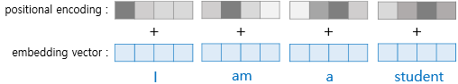

#### 多头注意力 Multiple Headed Attention, MHA

Transformer 仅仅使用注意力机制处理输入生成序列编码，由于注意力机制本质上只是对输入进行加权平均运算，没有引入新参数也没有使用非线性运算，这导致复杂特征提取能力不足，为了解决这个问题论文提出了多头注意力的方法。和卷积神经网络通过使用多个卷积核来发掘不同特征的思路类似，多头注意力也是通过多次随机初始化过程来提取不同特征。 图 12 中通过三次随机初始化分别得到了三种特征：红色表示动作，绿色表做动作施加者，蓝色表示动作承受着，可以看到在对”踢”进行了三次自注意力运算，分别对应三种特征。在对于动作信息的自注意力运算中，”我”和”球”的权值（灰色细线表示）比”踢”的权值（红色粗线）要小很多；同样，对动作施加者的自注意力运算中，”我”（绿色粗线）则是主要贡献者。在将三次自注意力运算的结果相加后，得到的新的”踢”的编码中就包含了三种特征的信息。理论上随机初始化测次数越多就越有可能发现有效的特征，不过随之增长的是训练参数的增加，这意味着训练难度的提高，因此需要平衡，在 Transformer 模型中这个值是 8。

##### 图 12.多头注意力的作用

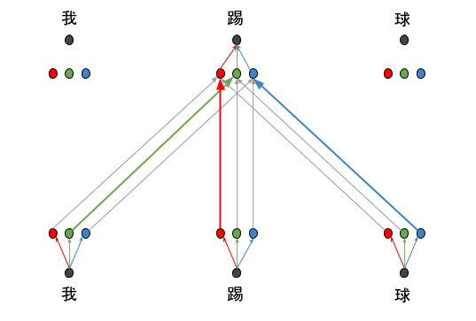

具体实现来说多头注意力是对同一个元素进行多次注意力运算，每次注意力计算之前分别使用随机生成的参数 W^Q,W^K,W^V 通过矩阵相乘来初始化 Q,K,V，

其中：

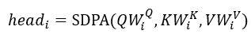

- 对于编码器多头自注意力 MHSA，Q,K,V 都是输入元素编码 xi。
- 对于解码器多头自注意力 MHSA，Q,K,V 都是已生成的输出元素编码 yi。
- 对于编码器-解码器多头注意力 MHA，Q 是输出元素编码 yi, K,V, 是 context vector 中的元素 ci。

在分别完成 i 次注意力运算之后，再将运算结果进行合并。合并的方法是首先对 i 次结果进行串联（concatenate），由于 Transformer 模型要求输出和输入具有相同的维度来实现多个编码层串联，因此再通过对串联结果和 WO进行矩阵相乘得到和输入同样维度的结果。

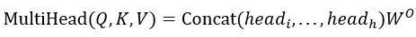

##### Transformer 全貌

在介绍了 Transformer 的主要组成部分之后，我们再来完整看一下 Transformer 模型。整体上来看，Transformer 模型属于编码器-解码器架构，由于解码器需要根据序列编码和上一步的解码器输出来产生下一个输出，因此 Transformer 属于自回归模型（autoregressive model）。

##### 图 13.Transformer 全貌

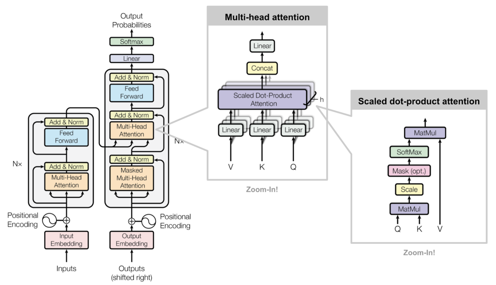

#### 编码器

Transformer 的编码器负责处理分析提取输入序列的特征并生成序列编码。它由若干个编码层构成，所有编码层的结构完全一样，这些编码层相互串联在一起，编码器的输入首先进入第一个编码层，结算结果输入第二层，依次经过所有编码层后作为编码器的输出。 每个编码层由多头自注意力单元和按位前馈网络两部分组成。输入首先进入自注意力计算单元，再将计算结果输入按位前馈网络，这里的按位的含义是指每个位置的元素各自输入前馈网络里进行计算，前馈网络的结构为 2 个串联的全连接层，中间层维度较大（是元素编码维度的 4 倍），最后一层的维度和元素编码的维度相同。这个设计的目的和多头注意力的设计类似，还是由于注意力机制在特征合成能力的不足，需要借助全连接网络的非线性计算来增加复杂特征合成的能力。

#### 解码器

解码器负责根据序列编码和上一步的解码器输出预测下一步的输出。它同样由多个结构相同的解码层串联而成，每个解码层由三部分组成，按照处理的先后顺序分别是解码自注意力单元 MHSA，编码器-解码器注意力单元 HMA 和按位前馈网络。作为解码器的核心，编码器-解码器 HMA 接收两个输入 Q，K,第一个输入Q 由解码器上一步输出经过带遮罩的解码器 HMSA 处理后得到，第二个输入 K 是编码器的输出：序列编码。编码器-解码器 HMA 的输出在经过按位前馈网络合成复杂特征。经过多个解码层处理后在通过全连接运算映射到目标词典空间，最后通过 softmax 选择可能性最大的元素作为输出。

图 14 展示了 Transformer 在进行英-中翻译任务中的主要工作流程：

1. 输入元素进行位置编码，位置编码与输入元素编码按位相加
2. 在编码层
     a. 首先进行输入元素自注意力（多头注意力）计算
     b. 再将结果输入按位前馈网络
3. 重复多次编码层结算，结束编码阶段，得到 context vector
4. 开始解码阶段，首先对输出元素进行位置编码（第一个输出为开始标记 SOS）, 输入元素与其位置编码按位相加
5. 在解码层
     a. 首先进行输出元素（当前已输出）的多头自注意力计算
     b. 进行解码器-编码器多头注意力计算
     c. 对 5.2 结果按位前馈网络
6. 重复多次解码层计算
7. 通过全连接网络转化为目标词典维度向量，使用 softmax 确定输出元素（可能性最大）
8. 将当前输出元素输入 4 开始下一个输出元素的计算，直到输出为结束标记符 EOS

##### 图 14.使用 Transformer 进行机器翻译的流程

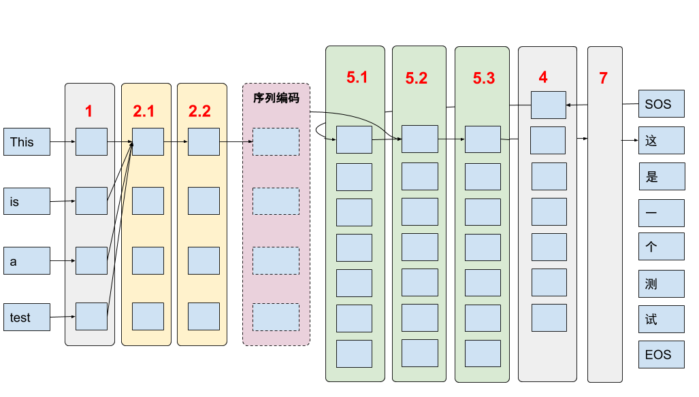

总结来说，注意力机制是 transformer 的核心，它具有计算效率高，可并行，容易训练等优势，但是同时也带了一些新问题：比如无序和特征合成能力下降。Transformer 针对这些新问题分别提出了解决方案，如使用位置编码生成位置信息，使用多头注意力和按位前馈网络增强特征合成能力。

## Transformer 优化技巧

由于 Transformer 属于比较复杂的深度模型，因此要通过使用一些优化技巧才能进行训练。Transformer 中运用到的优化技术比较多，我们选择其中比较重要或者是有针对性的来进行简单介绍。

### 1\. 残差链接 Residual connection

网络越深，表达能力越强，所以在需要表达复杂特征（如 NLP，图像）的场景中使用的神经网络正在变得越来越深，但是深层网络带来了两个问题：

a. 梯度弥散、爆炸，使得模型难以训练。
b. 网络退化（degradation），当网络深度到达一定程度后，性能就会随着深度的增加而下降。

##### 图 15\. 残差连接

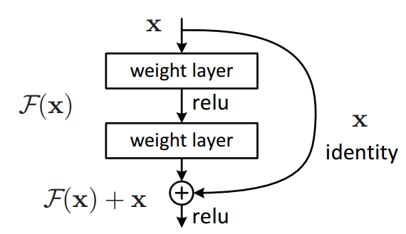

残差链接用一个简单的办法巧妙的解决了这两个问题，就是将两个不相邻网络层直接连接（短接）。这样梯度 gradient 可以跨越中间层直接传递，避免经过中间层时梯度被多次缩放导致梯度弥散（爆炸）的问题；另一方面，实验证明当使用 RELU 作为激活函数时，残差连接也能有效防止网络退化。Transformer 中的每一个编码层（解码层）都使用了残差连接来分别短接多头注意力和按位前馈网络，这样做一来解决了梯度传递的问题，同时还能帮助位置信息顺利传递到高层去。

### 2\. 层归一化

层归一化是机器学习中常用的一种数据预处理方法，为了更有效的运行机器学习算法，需要将原始数据”白化”（Whitening），也就是在统计学中常常提到的使数据”独立，同分布”。 目前在深度学习中最常用的是批归一化（Batch Normalization），它对不同训练数据的同一维度进行归一化，这种方法可以有效缓解深度模型训练中的梯度爆炸、弥散的问题。而在 transformer 采用了相对冷门的层归一化，主要原因是批归一化很难应用在训练数据长度不同的时序任务上，而这正是层归一化的优势所在，由于它是作用在单个训练数据的不同维度上，因此它能够在一条数据上进行归一化。

### 3\. 标签平滑归一化

通常我们使用交叉熵来计算预测误差时使用独热（one-hot）编码表示真实值，梯度下降算法为了减小误差会尽量使预测结果接近独热编码，也就是说，网络会驱使自身往正确标签和错误标签差值大的方向学习，在训练数据不足以表征所有的样本特征的情况下，预测结果的置信度过高会导致网络过拟合。 标签平滑归一化通过”软化”传统的独热编码，使得训练时能够有效抑制过拟合现象。它的实现非常简单，通过一个超参数 ϵ∈(0,1) 将原来的 0，1 分布变成 ϵ,1-ϵ 分布（对于二值分类问题），这样就缩短了真假值之间的距离，最终起到抑制过拟合的效果。

### 4\. 学习率热身

训练初期由于离目标较远，一般需要选择大的学习率，但如果训练数据集具有高度的差异性则使用过大的学习率则可能导致不稳定性。这是由于如果初始化后的数据恰好只包含一部分特征，则模型的初始训练可能会严重偏向于这些特征，这会增加模型学习其他特征的难度。 所以可以增加一个学习率热身阶段，在开始的时候先使用一个较小的学习率，然后当训练过程稳定的时候再把学习率调回去。在预热期间，学习率呈线性增加。如果目标学习率是 p ，预热期是 n，则第一批迭代将 p/n 用作学习率；第二个使用 2 _p/n ，依此类推：迭代 i 使用 i_ p/n，直到我们在迭代 n 次后达到学习率 p。

## Transformer 的改进和发展

Transformer 取得巨大成功引起关注的同时，学术和产业界都在尝试在实现和理论层面对他进行改进和增强。

### 应用（Transformer-XL）

虽然理论上 Transformer 可以处理任意长度的输入，但在实际的运用中资源是有限的，因此 Transformers 目前使用固定长度的上下文来实现，即将一个长的文本序列截断为几百个字符的固定长度片段，然后分别处理每个片段。这种操作会使相邻块片段之间的上下文丢失 ，导致上下文碎片化。Transformer-XL 基于以下两种关键技术解决了这个问题：

- 片段级递归机制(segment-level recurrence mechanism) 主要解决上下文碎片化问题，使上下文信息现在可以跨片段边界流动。思路是将上一片段 segment 的 memory 传到下一片段的同样位置。
- 相对位置编码方案(relative positional encoding scheme) 由于 transformer 上的位置编码方案会导致不同块的元素具有相同的位置编码，因此提出了一种新的位置编码，它是每个 attention 模块的一部分，基于元素之间的相对距离而不是它们的绝对位置。

##### 图 16.Transformer-XL 片段级递归机制

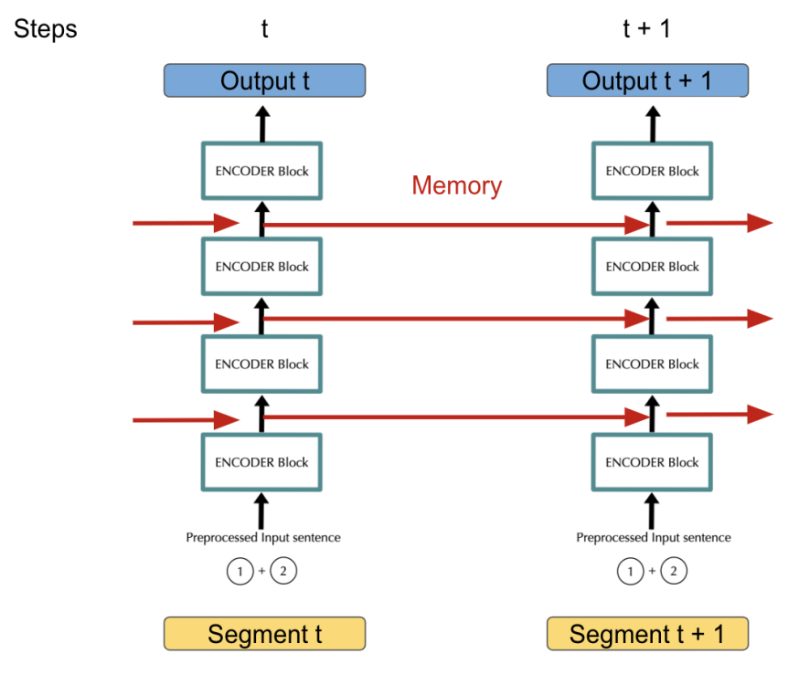

### 理论（解码并行化）

由于 Transformer 在解码阶段仍然属于自回归模型，这意味每一步输出的生成都需要运行整个网络，这样不仅计算复杂，而且无法并行。Salesforce Research 和香港大学的研究人员在最近的一篇论文中试图使整个过程可并行化。他们的建议是为序列中的每个输入单词计算肥力（Fertility），并使用它代替先前的输出来计算当前输出。 从图 17 中可以看到，新模型在编码器-解码器 MHA 阶段并不依赖解码器输出，只接受序列编码。于此相应的，在编码阶段除了生成序列编码，还增加了 fertility Predictor 单元来计算输入单词的肥力，然后将肥力加入原始输入（编码器输入）后输入解码器开始解码。

##### 图 17.解码并行化

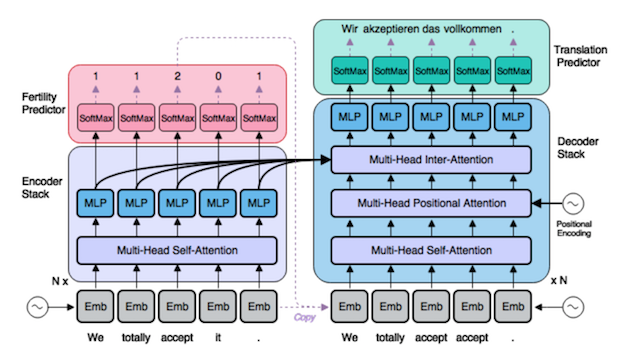

## 总结

Transformer 在自然语言处理领域取得突破性成绩是由于它针对时序任务的特点做了相应的设计，比如位置编码，自注意力，多头注意力，并结合了多种相关的优化技巧，如残差连接，层归一化等。 对于任何任务，都需要针对任务目标进行相对应设计，并且要进行优化才能充分发挥模型的优势。一个好的模型不会从天而降，需要不断地分析解决问题才能逐渐完善，通过对 Transformer 的学习，可以掌握对已有模型进行改进的基本思路：

- 找到痛点并针对主要问题进行设计
- 建立核心模型后要对随之产生的新问题提出解决方案
- 通过实验进行验证，还有利用已有的优化方法进行优化