# 利用包含 Cloud Function 的 IBM Watson Assistant 搭建智能微信机器人
利用微信公众号部署机器人服务

**标签:** 人工智能

[原文链接](https://developer.ibm.com/zh/articles/cl-lo-build-intelligent-wechat-robot-with-watson-assistant/)

潘磊, 黄朝源

发布: 2019-04-04

* * *

## 前言

目前，Watson Assistant 越来越多被用于用来搭建智能机器人。但是这个服务有自己的局限性，比如初始版本在设计 Dialog 时，回复的内容通常只能设计成既定的内容。但是我们实际使用时有很多是需要调用外部程序的，所以 Watson Assistant 推出了一个新的 Beta 功能 Program Call 来满足这项需求。在实际的项目经历和文档中，我发现对这个强大的功能的介绍并不详细，于是创建了本文来帮助有这个需求的程序员来更好的了解并且熟练运用该功能。

## 工具简介

1. [Watson Assistant](https://cloud.ibm.com/catalog/services/watson-assistant?cm_sp=ibmdev-_-developer-articles-_-cloudreg) 是一款用来快速打造能用自然语言进行交流的机器人的工具。
2. [Cloud Function](https://cloud.ibm.com/openwhisk?cm_sp=ibmdev-_-developer-articles-_-cloudreg) 通过实现无服务器微服务，公开应用程序逻辑。通过使用 Web 操作或最新的 API 网关集成，将您的函数映射到任何客户端都可以调用的定义精确的 API 端点。
3. [IBM® SecureGateway for IBM Cloud](https://cloud.ibm.com/catalog/services/secure-gateway?cm_sp=ibmdev-_-developer-articles-_-cloudreg) 服务提供了一种快速、简单且安全的解决方案，可将任何内容与任何内容相连接。通过部署轻量级且本机安装的 Secure Gateway Client，可以在您的环境和云之间建立安全持久的连接。有了它，您可以安全地连接所有应用程序和资源，无论它们位于何处。Secure Gateway 不是像传统 VPN 那样在网络层面桥接您的环境，而是以最小权限原则作为其核心原则提供精细资源控制。

## 创建 Secure Gateway 并配置

1. 您需要一个 IBM Cloud 账号。可以通过这个 [链接](https://cocl.us/IBM_CLOUD_GCG) 登录或者注册。
2. 登录到 IBM Cloud，打开 [Secure Gateway 介绍页](https://cloud.ibm.com/catalog/services/secure-gateway?cm_sp=ibmdev-_-developer-articles-_-cloudreg)，建立服务，如图。点击”创建”按钮，确认建立服务。请确保在区域性选择时选择”达拉斯”，后续讲述的 Cloud Functions 目前只在改区域可以生效。


    ##### 图 1\. Secure Gateway 创建页面


    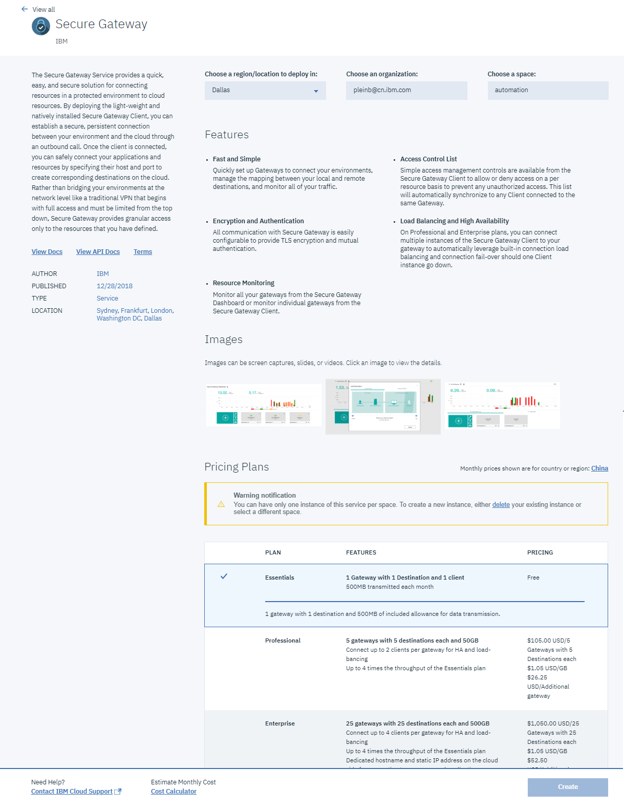

3. 点击 Add Gateway 按钮。
4. 输入 Gateway Name，点击 Add Gateway 按钮。
5. 点击 Connect Client。
6. 安装 Secure Gateway Client。有三种方式可供您选择，这边选择通过 Docker 安装 Secure Gateway Client。


    ##### 图 2\. Secure Gateway Client 安装向导页面


    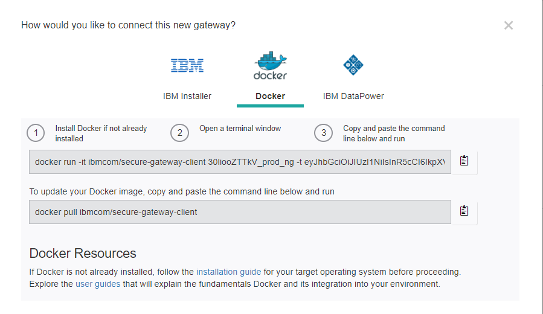

7. 选择一台 Linux Ubuntu VM，安装 [Docker](https://docs.docker.com/install/linux/docker-ce/ubuntu/) 。
8. 根据图 2 页面提示安装 Client。
9. 切换到 Destinations tab，添加一个新的 Destination，其中括号内为我填入的数据，下同。

    1) 根据需要选择 On-Premises 或 Cloud(On-Premises)。

    2) 填入 Host IP 和 Port（9.xxx.xxx.xxx/xxxx）。

    3)根据需要选择合适的 Protocol(TCP)。

    4)根据需要选择合适的验证方式（None）。

    5)根据需要将 Destination 设置成私有（未设置）。

    6)为 Destination 输入一个标识名（Insurance Demo）。

    7)点击 Add destination 按钮。

10. 创建完成后，点击该 Destination 的配置按钮，记录下 Cloud Host，以供后续访问 API Json data 时利用。


    ##### 图 3\. Destination 详细配置数据页面


    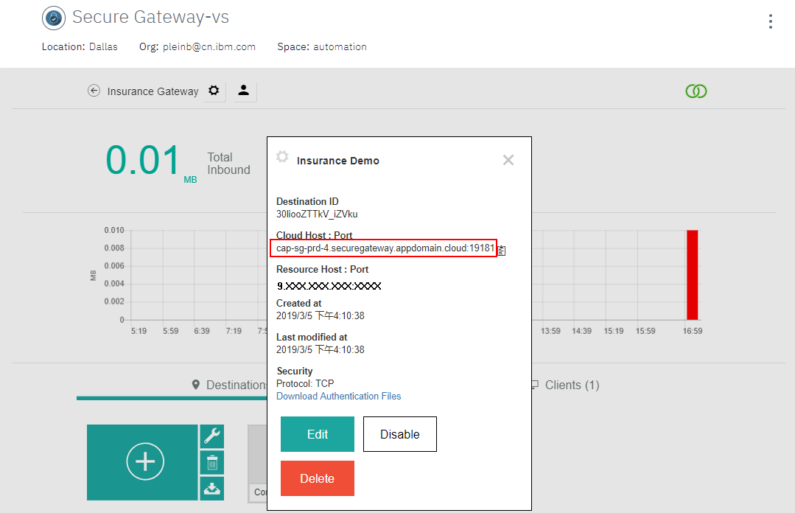

11. 切换回 Linux console，配置 Access Control list，输入以下命令，其中 Ip 和 Port 为上述配置过的数据。

    - acl allow （acl allow 9.xxx.xxx.xxx:xxxx）
    - quit
    - telnet  //Pass BSO if needed
    - docker run -it ibmcom/secure-gateway-client  -t  (docker run -it ibmcom/secure-gateway-client 30liooZTTkV\_prod\_ng -t )
12. 如果一切顺利，此时可以通过浏览器访问 Restful API 数据。


    ##### 图 4\. Restful API 数据页面


    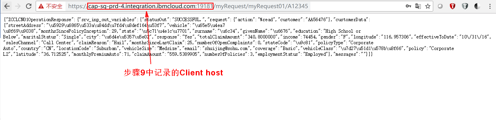


## 创建 Cloud Function 访问 Restful API

1. 在 IBM Cloud 中打开 [Cloud Function](https://cloud.ibm.com/openwhisk?cm_sp=ibmdev-_-developer-articles-_-cloudreg) 界面。
2. 在左侧导航栏中点击 Actions。
3. 点击 Create 按钮创建一个新的 Cloud Function，需要注意的是在页面顶部的 REGION 选择 Dallas。


    ##### 图 5\. Cloud Function 创建页面


    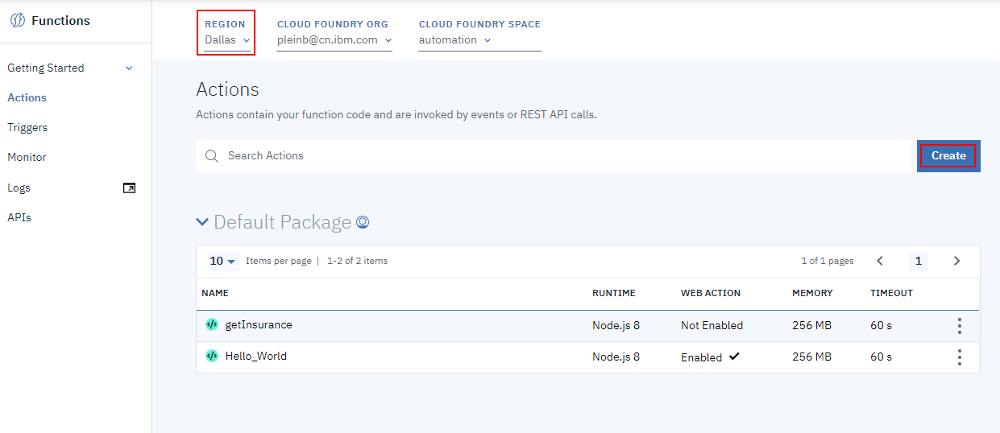

4. 选择 Create Action。
5. 为你的 Action 命名，配置后点击 Create 按钮。
6. 为 Action 创建访问过程。


    ```
    /**
    *
    * main() will be run when you invoke this action
    *
    * @param Cloud Functions actions accept a single parameter, which must be a JSON object.
    *
    * @return The output of this action, which must be a JSON object.
    *
    */
    process.env["NODE_TLS_REJECT_UNAUTHORIZED"] = 0;
    const request = require('request-promise');
    function main(param) {
        //The parameter policy_number is passed from the Watson Assistant Context
        let insuranceNumber = param.policy_number;
        let insuranceJson = getInsurance(insuranceNumber);
        return insuranceJson;
    }
    function getInsurance(insurance) {
        let options = {
          //The URI is the Secure Gateway Cloud Host and Restful API
          uri: "https://<Cloud Host>/<Restful_API>/" + insurance,
          auth: {
            //The credential to Access API if needed
            'user': <userid>,
            'pass': <password>
          },
          rejectUnauthorized: false,
          json:true
        }
        return request(options).then(response => {
            console.log('response', response);
            //Return Context with json data to Watson Assistant
            return response.ZCCLCN01OperationResponse.srv_inp_out_variables.customerData;
        });
    }

    ```


    Show moreShow more icon

7. 点击 Save 按钮，创建完成。
8. 在左侧导航栏中选择 Getting Started > API Key。
9. 拷贝下当前 namespace 的 Key，此 Key 将用于 Watson Assistant 访问上述 Cloud Function 的凭证。

## 在 IBM Cloud 上创建 Watson Assistant 并配置

1. 打开 [Watson Assistant 介绍页](https://cloud.ibm.com/catalog/services/watson-assistant?cm_sp=ibmdev-_-developer-articles-_-cloudreg) ，建立服务，如图。点击”创建”按钮，确认建立服务。请确保在区域性选择时选择 **“达拉斯”** 。前文的 Cloud Functions 目前只在改区域可以生效。


    ##### 图 6\. Watson Assistant 创建页面


    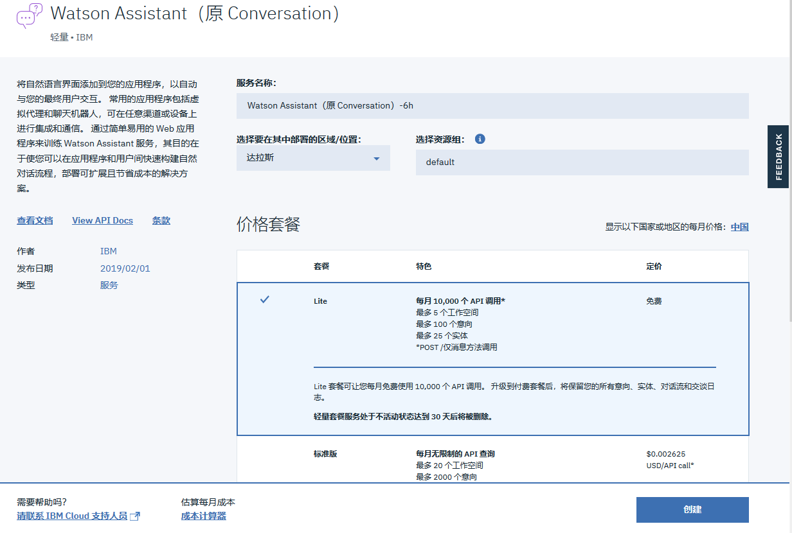

2. 记录下用户名与密码，并点击”启动工具”打开图形化工具窗口。


    ##### 图 7\. Watson Assistant Launch 界面


    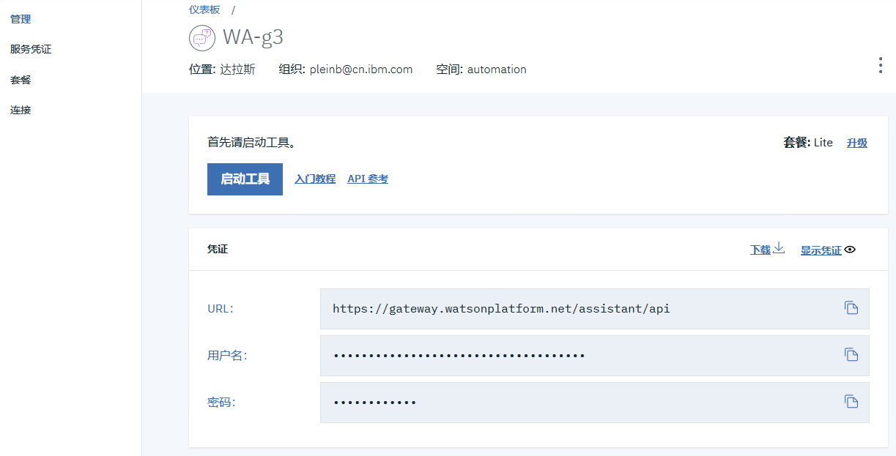

3. 切换到 Skills Tab。
4. 点击 “Create new” 按钮。


    ##### 图 8\. Skills 创建界面


    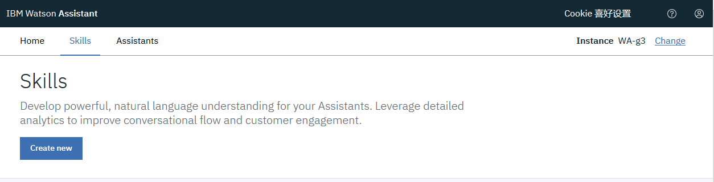

5. 切换到 Dialog 界面。
6. 点击 “Add node” 按钮。
7. 打开 Node 里的 Context 设置面板，按照下面所示对节点的 Context 进行设置：


    - `policy`：`"<? input.text ?>"`
    - `private`：`{"my_credentials":{"api_key":"<上一章节中的 API key>}}`


    ##### 图 9\. 节点设置界面


    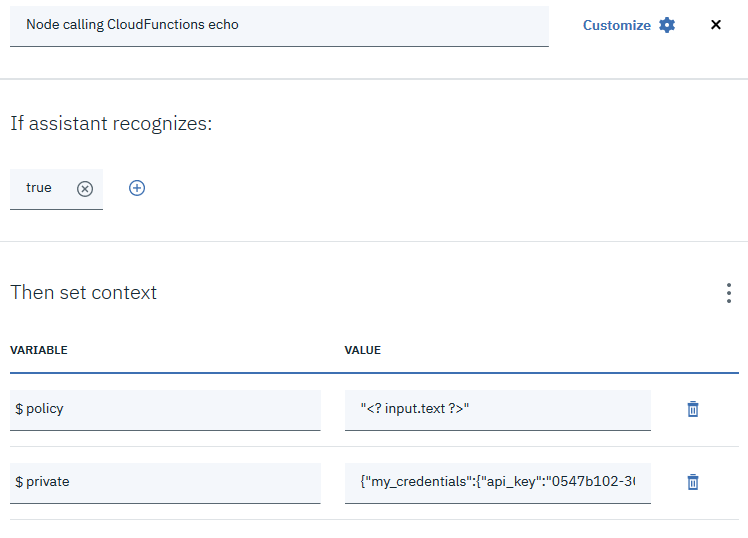

8. 打开该节点的 Json Editor，在 Output 下增加 action 调用代码，最终代码如下所示。


    ```
    {
    "output": {
        "text": {
          "values": [],
          "selection_policy": "sequential"
        }
    },
    "actions": [
        {
          "name": "/ <myIBMCloudOrganizationID>_<myIBMCloudSpace>/actions/getInsurance",
          "type": "cloud_function",
          "parameters": {
            "policy_number": "$policy"
          },
          "credentials": "$private.my_credentials",
          "result_variable": "context.my_input_returned"
        }
    ],
    "context": {
        "policy": "<? input.text ?>",
        "private": {
          "my_credentials": {
            "api_key": "0547......"
          }
        }
    }
    }

    ```


    Show moreShow more icon

    Action 区域代码说明：

    - `name`：Cloud Function 名称包括路径
    - `Type`：cloud\_function
    - `parameters`：传入 Cloud Function 的参数
    - `credentials`：访问 Cloud Function 的凭证
    - `result_variable`：接收 Cloud Function 返回数据的 Context
9. 在上述节点下创建子节点并设置子节点。


    ```
    {
    "output": {
        "text": {
          "values": [
            "$my_input_returned"
          ],
          "selection_policy": "sequential"
        }
    }
    }

    ```


    Show moreShow more icon


    ##### 图 10\. 子节点设置界面


    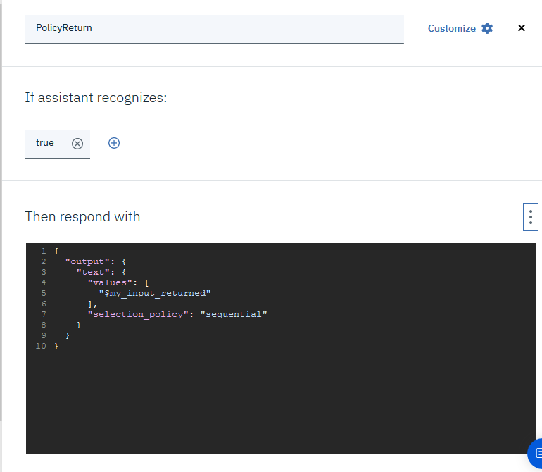

10. 将父节点的 finally 区域设置成跳转到子节点并且将模式设置成 Respond。


    ##### 图 11\. 跳转设置方法


    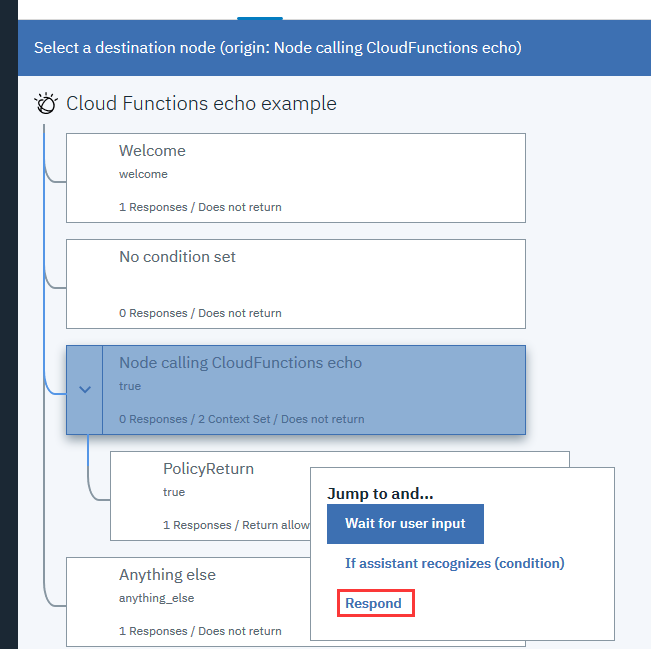

11. 打开 Try it Out panel，在输入框里输入 Cloud Function 需要参数的具体值，查看返回结果，如果能像下图一样输出返回结果，证明 Watson Assistant 连接到了创建好的 Cloud Function 上。


    ##### 图 12\. Try it out panel 结果图


    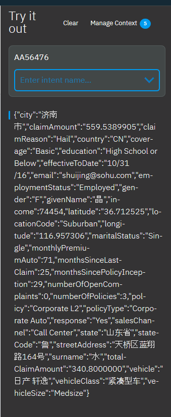

12. 点击当前页面的 Skills 链接返回上一层。
13. 找到上述 Skills，点击菜单按钮选择 View API Details。


    ##### 图 13\. View API Details


    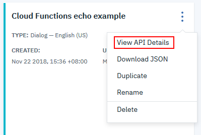

14. 记录下 Workspace ID、Service Credentials 这些数据，将在后续配置中用到。

## 注册微信公众号并配置

1. 您需要一个微信的公众号。如果还未申请，可以 [在这里注册](https://mp.weixin.qq.com/) 。
2. 注册完成之后可以在页面下方找到 **开发 – >基本配置** 进行开发者配置，点击修改配置。


    ##### 图 14\. 微信公众号基本配置界面


    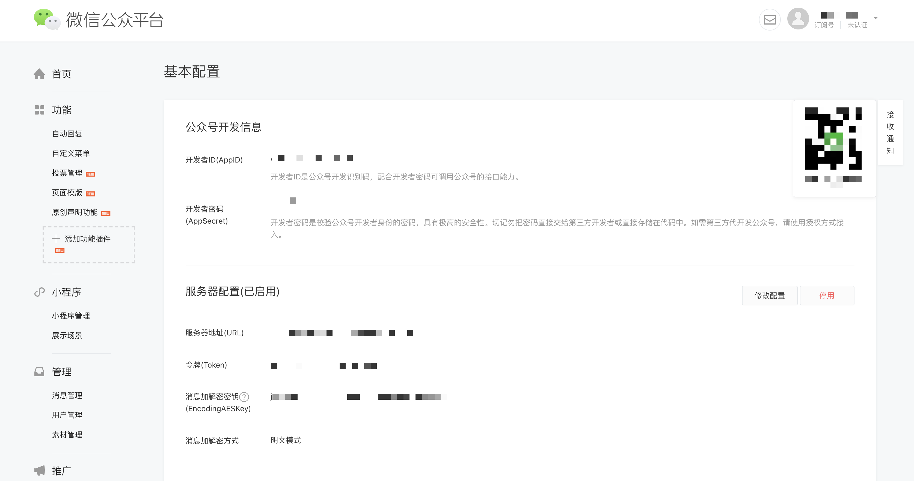

3. 按图提示输入自己所选的 Token，并自动生成 EncodingAESKey。推荐使用明文模式（因为本文不会涵盖如何对微信的信息进行解密）。然后将 Token 与 EncodingAESKey 牢记下来，并保持该窗口打开。由于我们还未设置服务器，因此提交将不会通过的。

## 部署微信和 Watson Assistant 连接

1. 请先直接下载我们的示例程序，运行下面的命令：

    `git clone git@github.com:cognitive-class/wechat-watson-conversation.git`

2. 我们刚刚注册的 IBM Cloud 账号提供免费的 Cloud Foundry App 服务，打开这个 [链接](https://ibm.biz/wechat-cf) 即可创建。
3. 输入必要的信息，并且记住图中所分配的应用域名，e.g. my-wechat-demo.mybluemix.net。点击创建。


    ##### 图 15\. Cloud Foundry 创建


    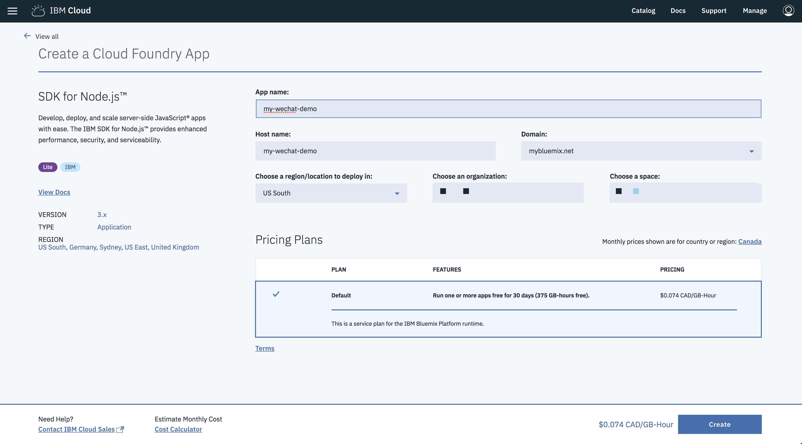

4. 进入设置页面，输入你刚刚所选的环境变量，都是以上步骤所获得的。

    `– WATSON_USERNAME – Watson Assistant` 服务的用户名密码与 workspace ID

    `– WATSON_PASSWORD`

    `– WATSON_WORKSPACE_ID`

    `– WECHAT_TOKENv – 微信开发者配置里的 token` 与 `encoding key`

    `– WECHAT_ENCODING_AES_KEY`

5. 打开 clone 下来的示例程序里的 manifest.yml 文件，将文件里的 name 换成创建好的 Cloud Foundry App name。
6. 下载 [IBM Cloud CLI](https://cloud.ibm.com/docs/cli/reference/ibmcloud/download_cli.html#download_install) 来完成部署应用。

    1)安装 CLI 之后，打开 Windows command line or MAC Terminal，进行如下操作。


    ```
    bx login –sso
    bx target -c <ACCOUNT_ID> -o <ORG_NAME> -s <SPACE_NAME>//设置对应的 Account、Org 和 Space

    ```


    Show moreShow more icon

    2)Locate 到刚刚 github clone 下来的目录，进行如下操作。

    `bx cf push //完成部署`

7. 最后应用部署完毕之后，请回微信公众号开发者设置，输入 Cloud Foundry App 的应用链接。然后按提交即可。
8. 在微信中关注该微信公众号，打开聊天界面，输入 Cloud Function 的参数，可以看到从 Cloud Function 传输过来的 Restful API 数据。


    ##### 图 16\. 微信公众号聊天界面


    


## 结束语

至此，该包含 Cloud Function 这一进阶用法的机器人已经配置完成。通过这个 Demo，我们可以更快的上手 Watson Assistant, Cloud Function 这些应用，为我们构建更强大的智能机器人打下坚实的基础。

## 参考资源

- [人工智能在邮件领域的应用](http://www.ibm.com/developerworks/cn/cloud/library/cl-lo-application-of-artificial-intelligence-in-mail/index.html)