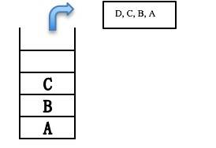
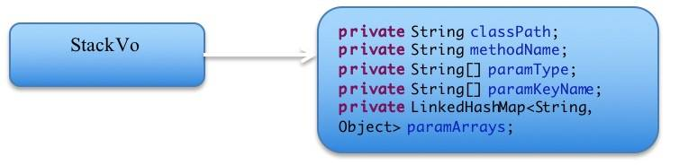
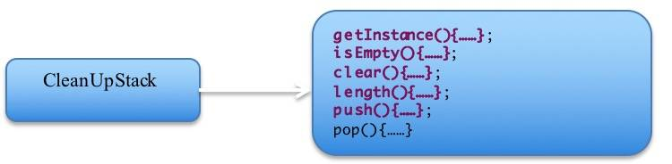
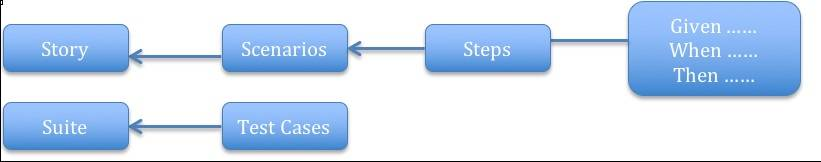
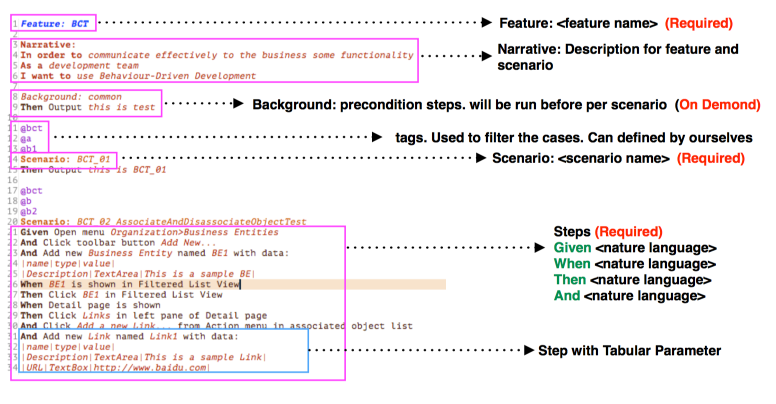
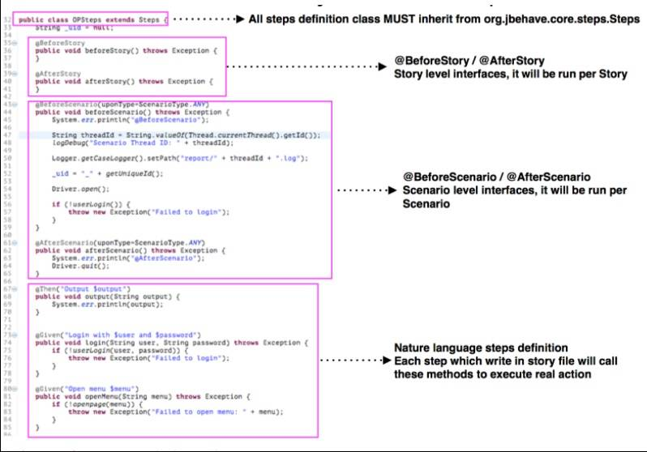
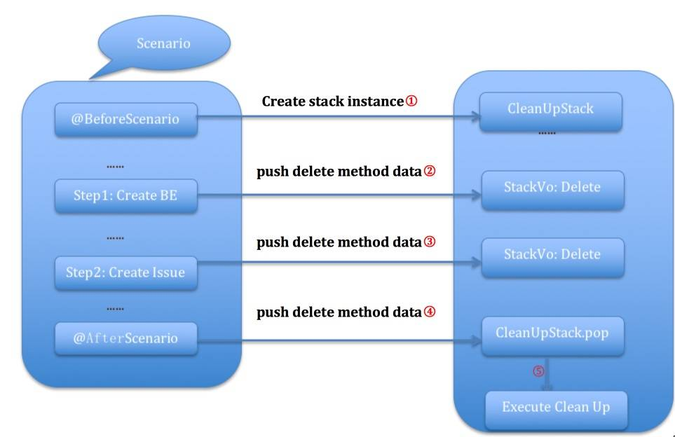

# 利用栈的思想设计实现测试用例的 clean up
利用数据结构中栈“先进后出”的原理来实现测试用例中数据的 clean up

**标签:** DevOps

[原文链接](https://developer.ibm.com/zh/articles/j-us-sta-th-te-ca-f-cl-up/)

李 敏敏, 朱 琳, 姜 河

发布: 2018-05-08

* * *

## 背景介绍

由于在写自动化测试用例时，自动化的用例中除了有基本的用例步骤以外，还包括了大量的用例执行所形成的数据，而这些数据有可能会影响到之后用例的自动化执行。所以在我们的自动化用例中就包含了大量的清除这些数据的步骤。为了能够简化我们的自动化测试用例，使自动化测试步骤执行中形成的数据自动被清除，我们想到了栈。由于自动化测试用例中清除数据的步骤刚好符合”先进后出”的原则，所以我们可以将每一个自动化测试用例的每一个步骤进行压栈，当这个自动化测试用例执行完之后，所有需要做所有需要做数据清除的步骤都会依次压栈，当测试用例执行完之后，压栈的步骤会依次出栈，执行这些步骤对应的数据清除的相应地操作。

## 栈的原理介绍

栈又名堆栈，它是一种线性表，这种线性表仅允许在表的一端进行插入和删除的操作。能够进行插入和删除操作的这一端叫栈顶，那么这个线性表的另一端就叫做栈尾。向一个栈插入新的元素叫做进栈，入栈或者压栈，入栈是将新的元素放到当前栈顶元素的上面，使新的元素成为入栈之后的新的栈顶元素。从一个栈删除元素又叫做出栈或者退栈，出栈是将栈顶元素删除掉使相邻的元素成为新的栈顶元素。关于栈的出栈和入栈请看如下的图 1 和图 2。

##### 图 1\. 入栈图

依次入栈 A, B, C, D


##### 图 2\. 出栈图



## 什么是测试用例的 clean up

在自动化测试用例执行的过程中，由于一个测试用例执行完成之后对测试环境中的数据做了部分的修改，为了不影响其它测试用例执行，我们每一个自动化测试用例最后执行的 clean up 则是清除当前测试用例对测试环境数据的修改。我们把这一部分清楚修改数据的操作步骤叫做测试用例的 clean up。

## 如何用栈实现测试用例的 clean up

本文我们以 java 语言为例，在使用栈之前我们首先要定义栈的类，以及栈中的一些具体操作的实现，由于需要压栈的是测试用例中的每一个具体的方法实现，再利用 java 的反射机制映射对应的具体方法。我们将这些方法的对象称之为栈中的元素，在本文中我们将栈中的每一个元素的定义类命名为 StackVo, 所以在 StackVo 类中主要包含方法的一些基本参数。本文中对栈定义的类命名为 CleanUpStack. CleanUpStack 类中主要包含了栈的一些基本的操作。简单的讲，CleanUpStack 就是一个栈体, 而 StackVo 就是入栈的元素，每一个 StackVo 就是测试用例中需要做 clean up 操作的方法。关于 StackVo 类和 CleanUpStack 类的具体定义请看如下图 3 和图 4。

##### 图 3\. StackVo 类



##### 图 4\. CleanUpStack 类



在讲解用栈实现 clean up 之前，为了便于理解整个流程，我们首先给大家介绍一下 JBehave 自动化测试用例的书写，在 JBehave 中一个 scenario 就相当于一个 test case，一个 story 就相当于一个 suite。测试用例可以根据功能以及设计的不同书写在不同的 story 文件里。它们的对应关系如图 5。

##### 图 5\. JBehave 自动化测试用例与一般测试用例的比较



JBehave 自动化测试用例中一个 story 文件中可以包含很多个 scenarios，同时 story 文件中也包含很多的关键字，下边本文会对这些关键字依次做介绍

```
    Feature:对 story 文件中功能或者测试用例的描述。
    Narrative:对功能以及测试用例的描述。
    Background:预先处理的步骤都会放在 Background 中，Background 的步骤是在 scenario 之前执行。
    Tags: 像图 6 中的@bct,@a, @bl 就是一个 scenario 的 tags,这个 tags 用于过滤测试用例，可以自己来定义。
    Scenario: 一个测试用例标实，后边可以写测试用例的名字。
    @Given:一个事件的先决条件步骤。
    @When: 事件发生的步骤。
    @Then: 事件结果验证步骤。
    @BeforeScenario/@AfterScenario: 一个 scenario 之前或者之后需要执行的方法。
    @BeforeStory/@AfterStory: 一个 story 之前或者之后需要执行的方法。

```

Show moreShow more icon

##### 图 6\. JBehave 自动化测试用例



前文已经介绍了 JBehave 测试用例的书写，在这一章节我们介绍一下 JBehave 对一步测试用例的实现。如下图 7 所示。

##### 图 7\. JBehave 测试用例的实现



下面本文将以具体的 JBehave 的自动化测试用例为例来说明用栈来实现 clean up 的整个流程。首先我们使用一个图来说明整个的流程，并且对该图依次进行阐述以方便大家理解。如图 5 所示，此图中以一个非常简单的测试用例来阐述在测试用例执行的过程中如何创建栈的对象，什么时候入栈，什么时候出栈。

##### 图 8\. CleanUpStack 类工作流程



图 8 中标注的数字则为整个流程中的步骤顺序。在 JBehave 自动化测试用例中， 本文将按照这个简单的测试用例来讲解栈实现 clean up 的原理。

在每一个 scenario 开始执行前，最先执行 beforeScenario 方法中的方法体，每一个 scenario 中所有步骤都是在同一个线程中执行的。CleanUpStack 的对象就是在这一步创建的。

在第二步中，当前的测试用例要创建一个 BE, 由于 create 的步骤是需要做 clean up 操作的，那么在创建完 BE 之后，我们还会创建一个栈的元素 StackVo，并且用 delete 方法参数构建一个完整的 StackVo 对象，并且将这个对象压栈。

在第三步中同样也是 create 的步骤，这一步也是需要做 clean up，那么在创建完 Issue 之后我们仍然会创建一个元素 StackVo, 并且用 delete 方法参数构建一个完整的 StackVo 对象，并且将这个对象压栈。

第四部这个测试用例的所有步骤已经执行完成，最后执行 afterScenario 方法中的方法体，在这个方法体中步骤执行完后我们会去检查当前 CleanUpStack 栈对象中是否为空，如果为空则不做任何的处理，如果不为空则将栈中的元素依次出栈，在出栈的时候利用 java 的反射原理机制一次执行对应的栈元素对应的方法。这样就完成了自动的 clean up。

## 结束语

通过对本文的阅读，相信大家对栈以及如何使用栈的思想实现自动化测试用例的 clean up 有了非常清楚的认识。在编写自动化测试用例的过程中对栈的灵活应用使得我们的自动化测试用例步骤得到了精简，为自动化测试人员节省了编写 clean up 步骤的工作量，大大的提高了自动化测试用例的编写。