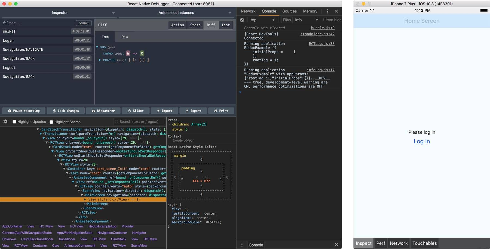
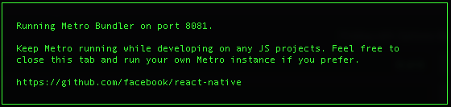
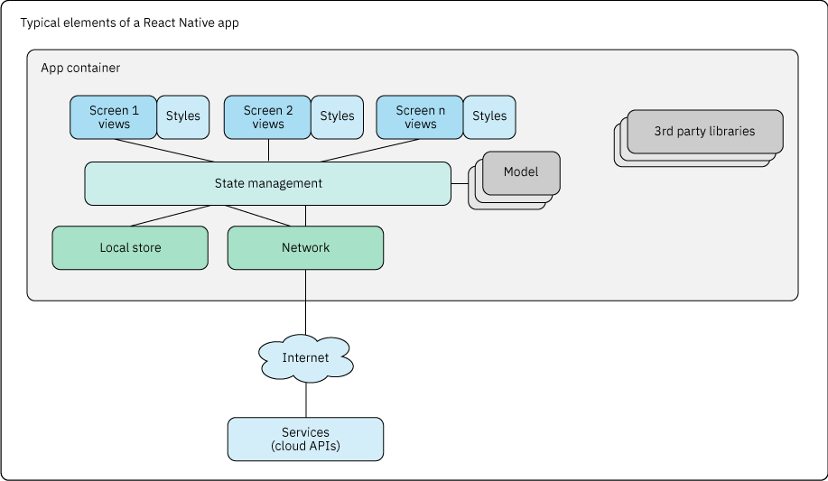

# 剖析 React Native
React Native（一种混合移动应用开发框架）入门

**标签:** Android,Apache Cordova,JavaScript,Node.js,移动开发

[原文链接](https://developer.ibm.com/zh/articles/dissecting-react-native/)

C. Enrique Ortiz

更新: 2019-02-26 \| 发布: 2018-10-26

* * *

React Native 是一种流行的跨平台移动应用开发框架。本文将概述 React Native，内含现有相关资源的链接并建议了一些编写您自己的 React Native 移动应用的最佳实践。

开发移动应用时，可以选择完全原生、纯基于 Web，或者使用一种 _混合_ 方式（即结合使用原生和基于 Web 的技术）。您可以利用 [Apache Cordova](https://cordova.apache.org/)（或 Adobe PhoneGap）这样的开源平台，采用 HTML、CSS 和 JavaScript 语言编写跨平台混合应用。这些应用在一个原生 Web 视图（浏览器）内运行，行为更像 Web 应用，但能通过使用 JavaScript 和可用的 Apache Cordova 插件来访问原生功能和 API。得到的应用可以部署到 Apple Store 或 Google Play，其用户界面更类似于 Web 应用，而不是原生应用。或者，您可以使用 C#、XAML 和 CSS，利用 [Xamarin](https://www.xamarin.com/) 来编写原生应用。对于使用 HTML5、CSS 和 JavaScript 语言编写的纯原生 Web 应用，可以使用 [jQuery Mobile](http://jquerymobile.com/) 这样的框架。

值得注意的是，React Native 无法做到 _一次编写，随处运行_ 。React Native 团队采取的方法是 _一次学习，随处编写_ 。这意味着重点在于学习，以及使用同一组技术来开发 iOS 和 Android 原生应用，而不需要对 Android 使用 Java™，对 iOS 使用 Objective-C 或 Swift。对于使用 [JSX](https://facebook.github.io/jsx/)、React Native 组件和 JavaScript 编写的 React Native 应用，您仍需为每种平台创建单独或独立的应用，而且由于平台差异和应用的复杂性，您可能还需要编写特定于平台的逻辑。

React Native 对混合移动应用开发采用了不同的方法。React Native 基于 [React](https://reactjs.org/)，是一个 JavaScript 库，用于构建 _基于 Web_ 的用户界面，而不是生成 _原生_ UI 组件，从而产生更丰富的 UI 体验，更好地与底层平台 UI 相匹配。React Native 已成为一种流行技术，为使用 JavaScript 构建原生跨平台移动应用提供了一种强大框架，但您也可以在需要时使用 Objective-C、Swift 或 Java 编写原生代码。

使用 React Native 有利有弊。有利的一面是，React Native 已经非常流行，有一个支持它的开源社区，您可以使用一组技术（比如 [JSX](https://facebook.github.io/jsx/)、React Native 组件和 JavaScript）为 iOS 和 Android 构建移动应用。这进而有助于保持 iOS 和 Android 应用与新版本发布的同步。但是，React Native 仍在不断完善，在需要 React Native 目前尚未提供的新功能时，比如如何实现 UI 导航或使用地图，决定使用哪些库可能会让您感到困惑。此外，根据应用的复杂性，您可能仍需要编写特定于平台的代码来解决移动平台差异。对于复杂的应用，可能需要编写自定义组件，或者深入研究 iOS 和 Android（例如，必需但不受支持的 UI 行为，性能原因，或者在 [将 React Native 添加到现有原生应用中时](https://facebook.github.io/react-native/docs/integration-with-existing-apps.html)）。

## 准备进行 React Native 开发

React Native 的核心是 JavaScript，具体来讲是 ECMAScript 6 (ES6)。所以，熟悉 ES6 的一些最新功能会对您有所帮助。此外，在可以深入开发第一个 React Native 应用之前，需要安装工具、IDE、JavaScript 库等。最后，您需要了解一些核心的 React Native API。

### ECMAScript 6 的功能

ES6 引入了许多变化，其中某些变化值得一提，因为最新的 React Native 框架中使用了它们：

- **变量和作用域**：关键字 `var`、`let` 和 `const` 表示变量作用域，其中 `var` 表示函数作用域，`let` 表示块作用域，`const` 也表示块作用域。`const` 变量是常量，但在用于对象和数组时除外，对象和数组在JavaScript 中是可变的。对于 `var` 声明，解释器将变量声明上移或移动到作用域顶部，而 `let` 和 `const` 声明不会上移。

- **箭头函数**：一种新函数，它支持更紧凑、更简洁的表示法，具有 `this` 的静态或词法上的定义（它不会在词法上影响 `this`）。请参阅以下这些使用箭头函数的示例。


一个没有指定参数的箭头函数：

```
() => { ...}

```

Show moreShow more icon

一个参数；注意，这里省略了括号：

```
x => { ...}

```

Show moreShow more icon

指定了多个参数：

```
(x, y) => {*
...
}

```

Show moreShow more icon

参数定义和箭头函数的箭头必须在同一行。

- **Promises**：Promises 是一种用于异步编程的替代性 API，它比传统的回调（比如链和并行执行）更有优势。


    ```
    function myAsyncFunc() {
        return new Promise(
        function (resolve, reject) {
              :
        resolve(result);
               :
               if (error) {
                    reject(error);
               }
        });
    }

    ```


    Show moreShow more icon

     要调用上面的异步函数，请运行以下代码：


    ```
    myAsyncFunc().then(result =\> { ¡¤¡¤¡¤ }).catch(error =\> { ¡¤¡¤¡¤ });

    ```


    Show moreShow more icon


这只是新功能的一个样例，还有其他许多新功能。Axel Rauschmayer 编写的 [探索 ES6](http://exploringjs.com/es6/) 是一个不错的 ES6 在线参考资料。

接下来，让我们看看如何搭建您的开发平台和环境。

### 设置环境和项目

开发 iOS 原生应用需要一台 macOS 计算机 – 没有变通方法。因为大多数移动应用都会同时部署到 Android 和 iOS，所以您应该考虑准备一台 Mac 来开发 React Native 移动应用。

在创建项目之前，需要安装一些工具，包括：

- [**Android Studio**](https://developer.android.com/studio/) **和** [**Xcode**](https://developer.apple.com/xcode/) **工具**。请安装最新版本来构建和发布您的应用。对于 Android，请确保为想要运行的 Android API 版本设置了一个虚拟设备模拟器。

- **您最喜爱的 JavaScript IDE 或文本编辑器**。您可能不会使用 Xcode 或 Android Studio 来编写 JavaScript 代码。其实您只需要一个文本编辑器。可以使用 [Atom](https://atom.io/)（由 GitHub 开发）、 [Sublime Text](https://www.sublimetext.com/) 或您喜欢的任何优秀的文本编辑器。

- **JavaScript 或 React Native 包**。在这一步中，将安装一些工具来管理 React Native 包以及第三方库：

    - **从** [**nodejs.org**](https://nodejs.org/en/) **下载 node.js。** 这个 JavaScript 运行时可用于访问 `npm`，npm 是 node.js 项目中创建的一个便捷工具，可用来管理开源包。请确保下载了 node.js 的最新 LTS（长期支持）版本。此下载还包含一个名为 Metro bundler 的开发服务器，它会在调试时提供实时更新。

    - **下载** [**create-react-native-app**](https://github.com/react-community/create-react-native-app)。可以在入门阶段使用此工具。它会为您创建一个基础项目。使用 `npm` 下载该包：


        ```
        sudo npm install -g create-react-native-app

        ```


        Show moreShow more icon

    - **下载第三方库**。React Native 提供了基础组件，但与原生 API 相比，它非常简单。典型的移动应用会使用摄像头，管理状态，而且还拥有导航、地图、图标和复选框。您需要从 React Native 社区获取这些组件：


        - `react-native-navigation`
        - `react-native-vector-icons`
        - `redux`
        - `React-native-maps`


        另外，还可以访问 [React Native Elements](https://react-native-training.github.io/react-native-elements/) 来获取可能需要的其他 UI 元素。开发全功能的应用时，会需要使用这些包。运行以下命令来安装上面提到的这些包：


        ```
        npm install _package-name_ --save

        ```


        Show moreShow more icon
- **React Native Debugger**。这个调试器是一个包含 React Inspector 和 Redux DevTools 的独立应用。它是一个很不错的工具，可以连接到您的 React Native 应用（一次连接一个应用）来实时查看和评估它。

    


现在，需要设置应用基础项目并运该基本应用：

1. **创建应用基本项目。** 这会创建一个目录结构，作为项目的起点：


    ```
    create-react-native-app [APPNAME]

    cd [APPNAME]

    ```


    Show moreShow more icon

    **注意**：这一步将创建一个不含构建配置的基础 React Native 应用模板。请在 GitHub 项目中进一步了解 [`create-react-native-app` 项目](https://github.com/react-community/create-react-native-app#getting-started)。

    完成安装之后，有一些 npm 脚本可供使用：

    - `npm start` 用于在开发模式下运行应用
    - `npm run ios` 类似于 `npm start`，但它还会尝试在 iOS 模拟器中打开您的应用
    - `npm run android` 尝试在已连接的 Android 设备或仿真器 (emulator) 上打开应用
    - `npm run eject` 将应用从当前的 `create-react-native` 模式退出，使您可以完全控制应用的构建流程
2. **启动应用。** 通过运行 `npm run android` 和 `npm run iOS` 在模拟器上运行应用。这一步会在开发模式下启动应用。这还会启动 Metro bundler，后者会自动检测更改并自动部署应用（这在调试移动应用时很有用）。

    


通过上述操作，您应该已经拥有构建移动应用所需的大部分工具了。

### React Native API 快速概述

React Native 从 [React](https://reactjs.org/) 继承了 [JSX](https://facebook.github.io/jsx/)、状态、属性和组件生命周期的概念。然后，它还扩展了 React，以便支持原生 UI 组件和功能。此操作是通过导入 React 和 React Native 功能来完成的，如清单 1 所示：

**清单 1\. 从 React 和 React Native 导入**

```
import React, { Component } from **'react'**

import { View, ScrollView, StyleSheet } from **'react-native**'

:

:

```

Show moreShow more icon

完成导入后，就可以访问 React Native 组件了，它们支持应用需要的许多常见 UI 组件：

- **基本 UI 组件**，比如 [View](https://facebook.github.io/react-native/docs/view.html)、 [Text](https://facebook.github.io/react-native/docs/text.html)、 [Image](https://facebook.github.io/react-native/docs/image.html)、 [TextInput](https://facebook.github.io/react-native/docs/textinput.html)、 [ScrollView](https://facebook.github.io/react-native/docs/scrollview.html) 和 [StyleSheet](https://facebook.github.io/react-native/docs/stylesheet.html)。此外，它还提供了 UI 控件，比如 [Button](https://facebook.github.io/react-native/docs/button.html)、 [Picker](https://facebook.github.io/react-native/docs/picker.html)、 [Slider](https://facebook.github.io/react-native/docs/slider.html) 和一个 [Switch](https://facebook.github.io/react-native/docs/switch.html)（用于呈现布尔输入）。
- **列表**，比如 [FlatList](https://facebook.github.io/react-native/docs/flatlist.html)（用于呈现可滚动的列表）和 [SectionList](https://facebook.github.io/react-native/docs/sectionlist.html)（类似于 FlatList，但用于分段列表）。
- **特定于 Android 的组件**，比如 Android [BackHandler](https://facebook.github.io/react-native/docs/backhandler.html)、 [DatePickerAndroid](https://facebook.github.io/react-native/docs/datepickerandroid.html) 和 [ToastAndroid](https://facebook.github.io/react-native/docs/toastandroid.html)。
- **特定于 iOS 的组件**，比如 [AlertIOS](https://facebook.github.io/react-native/docs/alertios.html)、 [ImagePickerIOS](https://facebook.github.io/react-native/docs/imagepickerios.html)、 [NavitatorIOS](https://facebook.github.io/react-native/docs/navigatorios.html) 和 [TabBarIOS](https://facebook.github.io/react-native/docs/tabbarios.html)。
- **常见组件** 可在 React Native [组件和 API](https://facebook.github.io/react-native/docs/components-and-apis.html) 文档页面中找到。

需要牢记的一点是，有许多功能 React Native 本身并不支持。一个示例就是使用地图，甚至是图标和复选框。虽然底层操作系统支持这些功能，但 React Native 需要安装第三方库。简言之，任何复杂的或不受 React Native 支持的功能（包括开发工具）都需要编写额外的代码或使用第三方库。

## 使用 React Native 构建应用

典型的 React Native 移动应用包含许多组件，如下图所示：



在一个应用容器中，有许多屏幕，其中包含一个或多个视图（和样式）、屏幕间导航、状态管理和数据模型。还有本地存储和用于使用云服务的网络功能。最后但同样重要的是，还有一些第三方库可用来扩展应用的功能。

以下各节将介绍这些区域中的每个区域。

### 屏幕：视图和样式

应用容器中包含应用的屏幕和其他组件的集合。应用本身包含许多屏幕，每个屏幕由许多视图组成，比如按钮、文本输入和列表。 [视图](https://facebook.github.io/react-native/docs/view.html) 是构建用户界面的最基础的组件，视图通常映射到 iOS 和 Android 原生 View 组件。

清单 2 中的屏幕示例包含一个使用 ScrollView 实现的列表，以及一个封装在 Checkbox UI 组件中的任务列表：

**清单 2\. 包含 ScrollView 的 TaskList**

```
# components/TaskList/TaskList.js

import React, { Component } from 'react'
import { View, ScrollView, StyleSheet } from 'react-native'
import { CheckBox } from 'react-native-elements'

import styles from './TaskListStyle;

export default class TaskList extends Component {

    renderTaskItem = (item, idx) => {

        return (
            <View style={styles.row}>
                <Checkbox
                    checked = {item.checked}
                    title = {item.text}
                    onPress = { () => onPressItem(item, idx) }
                />

            </View>
        );
    }

render() {
    const {list} = this.props
    return (
        <ScrollView style={styles.container}>
            {list.map( this.renderTaskItem )}
        </ScrollView>
    )
}
}

```

Show moreShow more icon

TaskList 组件导入各种依赖项，包括 React Native 中没有的第三方 Checkbox UI 组件，您可以从 [React Native Elements](https://react-native-training.github.io/react-native-elements/) 网站下载该组件。

在清单 2 中，UI 组件和样式是分离的。推荐您创建高级 UI 组件并将样式分离。为此，可以将所有组件组织到一个子目录中，每个组件都有自己的 component.js 和 style.js 文件，如清单 3 所示：

**清单 3\. 对组件和样式进行组织**

```
./Components
+-TaskList
+-TaskList.js
+-TaskListStyle.js

```

Show moreShow more icon

或者，如果喜欢更加通用的方法，可以使用以下代码：

```
+-TaskList
+-index.js
+-style.js

```

Show moreShow more icon

此方法可以将组件和样式完全分离，使组件更加紧凑。注意，在共享或重用时，最佳实践是共享组件本身，并避免共享单独的样式。

清单 4 给出了一个样式文件的示例：

**清单 4\. 样式**

```
# components/TaskList/TaskListStyle.js

import { StyleSheet } from 'react-native';

// Define the styles
export default StyleSheet.create({
    container: {
        flex: 1,
        paddingLeft: 20,
      },

      row: {
        flex: 1,
        flexDirection: 'row',
        alignItems: 'flex-start',
      },
});

```

Show moreShow more icon

样式是使用 [StyleSheet](https://facebook.github.io/react-native/docs/stylesheet.html) 组件来定义的，该组件是一种类似于 CSS 样式表的抽象。请参见 [单个 UI 组件](https://facebook.github.io/react-native/docs/getting-started.html)，以了解具体的样式属性。

### 对 UI 应用自适应设计

React Native 提供了一个 [`Dimensions`](https://facebook.github.io/react-native/docs/dimensions.html) 模块来实时检测屏幕的尺寸，例如：

**清单 5\. 使用 Dimensions API**

```
import { Dimensions } from 'react-native'
:
var {height, width} = Dimensions.get('window');
:

```

Show moreShow more icon

`Dimensions` API 有助于您根据需要实时调整 UI；例如，当方向发生改变时，您可以适当使用样式来调整 UI。调节 UI 的示例包括改变横向和纵向模式下的文本输入框的位置和长度。

您还必须准备好处理另一级别的 UI 调整。在某些情况下，需要实现特定于 Android 或 iOS 的行为。这方面的示例包括与底层行为相关的差异，比如 UI 控件的呈现效果或一般行为的方式。要解决这个设计问题，需要应用不同的逻辑或样式，或者在更复杂的情况下，实现自定义组件。React Native 提供了不同的方法来检测底层平台，以便您可以通过编程方式来决定如何操作：使用 [`Platform` 模块](https://facebook.github.io/react-native/docs/platform-specific-code.html#platform-module) 还是使用 [特定于平台的文件扩展名](https://facebook.github.io/react-native/docs/platform-specific-code.html#platform-specific-extensions)。

[`Platform` 模块](https://facebook.github.io/react-native/docs/platform-specific-code.html#platform-module) 检测底层平台并相应地返回“`ios`”或“`android`”。例如：

**清单 6\. 使用 Platform 模块**

```
import {Platform} from 'react-native';

:

if (Platform.OS === 'ios') {
    :
    :
}

if (Platform.OS === 'android') {
    :
    :
}

```

Show moreShow more icon

`Platform` 模块还提供了 `Platform.select` 和 `Platform.Version` 来分别检测平台和平台版本。有关更多信息，请参阅 [Platform 文档](https://facebook.github.io/react-native/docs/platform-specific-code.html)。您应将 `Platform.OS` 和 `Platform.select` 仅用于较小的变化。否则，您最终会获得大量硬编码的 `if` 或 `switch` 语句，让代码变得更难理解。

如果正在编写更复杂的代码或组件，那么您应该使用 [特定于平台的文件扩展名](https://facebook.github.io/react-native/docs/platform-specific-code.html#platform-specific-extensions)。这种方法会使用针对每个平台的文件来拆分代码。也就是说，如果拥有无法跨平台通用的代码，比如我们的 `TaskList`，那么您可以编写两个文件，一个用于 iOS，另一个用于 Android，然后让 React Native 挑选正确的文件。

**清单 7\. 对组件和样式进行组织**

```
./Components
+-TaskList
+-TaskList.io.js
+-TaskList.android.js
+-TaskListStyle.ios.js
+-TaskListStyle.android.js

```

Show moreShow more icon

然后，让 React Native 挑选正确的文件：

```
const TaskList = require('./Components/TaskList/TaskList);

```

Show moreShow more icon

本文不会介绍 iOS 与 Android 之间的具体区别，但要注意的内容包括呈现和一般组件，或者 UI 控件行为。现在，如果发现 Android 与 iOS 应用的布局设计存在重大不同，可以分别使用 index.ios.js 和 index.android.js 文件，而不是主应用的 index.js 来控制这一点。这使您能够完全控制不同平台的应用布局和流。要最大限度地减少重复代码，需要在必要时将其重新打包为可重用的帮助程序。

### 导航

React Native 中的应用导航是一个可能具有挑战性的领域，因为 React Native 提供的导航要么不够强大，要么仅针对 iOS。相比之下，有大量社区项目在尝试解决跨平台导航的问题，其中有一些项目较受欢迎。本文不会详细介绍每个项目，仅重点关注流行的 Wix 开发的 [React Native Navigation](https://wix.github.io/react-native-navigation)。

[React Native Navigation](https://wix.github.io/react-native-navigation) 提供了一个非常完整的 API，这个顶级的 API 可用来注册屏幕组件，启动基于选项卡的应用，以及启动单屏幕应用。它还提供了其他 API 来管理模态和灯箱屏幕，以及较低级别的屏幕 API 来处理屏幕堆栈，处理按钮、屏幕可视性和自定义导航器本身的能力。

安装 `react-native-navigation` 的最新稳定版（运行 `npm install react-native-navigation --save`），按照它们 [网站](https://wix.github.io/react-native-navigation) 上的 Android 和 iOS 安装说明进行操作，根据要求来修改构建脚本或值。

您必须调用 `registerComponent()` 来使用唯一名称注册所有带 `Navigator` 的屏幕组件。完成注册后，就可以启动您的 _基于选项卡的应用_ 或 _单屏幕应用_ 了，如清单 8 所示：

**清单 8\. React Native Navigation**

```
import { Navigation } from "react-native-navigation";
import MainScreen from "./src/screens/MainScreen/MainScreen";
:

// register the MainScreen component
Navigation.registerComponent(
'MainScreen',
() => 'MainScreen'
);

:
:

// Start the (single screen)App
export default () => Navigation.startSingleScreenApp({
screen: {
    screen: "MainScreen",
    title: "Main Screen"
}
});

```

Show moreShow more icon

启动基于选项卡的屏幕稍微复杂一些，因为必须指示不同的选项卡及其关联的屏幕、选项卡细节和样式，例如：

**清单 9\. 启动基于选项卡的应用**

```
// Start the (tab-based) App
export default () => Navigation.startTabBasedApp({
    tabs: [
        {
            screen: "screen unique name",
            label: "label",
            title: "title",
            icon: icons[0],
            navigatorButtons: {
                leftButtons: [
                    {
                        icon: icons[2],
                        title: "title",
                        id: "unique id"
                    }
                ]
            }
        },
        {
            screen: "screen unique name",
            label: "label",
            title: "title",
            icon: icons[1],
            navigatorButtons: {
                leftButtons: [
                    {
                        icon: icons[2],
                        title: "title",
                        id: "unique id"
                    }
                ]
            }
        }
    ],
    tabsStyle: {
        tabBarSelectedButtonColor: "black"
    },
    drawer: {
        left: {
            screen: "drawer screen unique name"
        }
    },
    appStyle: {
        tabBarSelectedButtonColor: "red"
    },
});

```

Show moreShow more icon

通过调用相应的函数，您可以根据需要在单屏幕和基于选项卡的屏幕之间进行切换。另注意，上一个示例中使用了 `drawer`。可以为单屏幕应用和基于选项卡的应用定义一个侧拉式菜单。

### 状态管理

在 React（和 React Native）中，可以使用 `props` 和 `state` 来控制组件。`props`（属性）是在创建组件时，用于定制组件的参数。例如， [Button](https://facebook.github.io/react-native/docs/button.html) 组件支持多个属性；在清单 10 中，`title` 和 `onPress` 都是属性。

**清单 10\. 使用状态**

```
<Button
onPress={onPressHandler}
title="Learn More"
:
/>

```

Show moreShow more icon

属性由 React 自己设置（由父组件设置），并在组件的整个生命周期中保持不变。状态是特定于应用的数据，用于根据需要执行更改，以驱动组件行为。您应该在构造函数中初始化状态，而且只能通过调用 `setState` 来更改状态。清单 11 展示了状态的用法：

**清单 11\. 使用状态**

```
class MyComponent extends Component {
constructor(props) {
    super(props);
    this.state = {isActive: true};
}

toggleActiveState() {
      this.setState(previousState => {
          return { isActive: !previousState.isActive };
      });
}

render() {
      :
}

}

```

Show moreShow more icon

清单 11 是一个简单的状态管理示例，但是，如果您的应用更加复杂，包含许多屏幕组件和组件间状态管理，那么应该利用 [Redux](https://redux.js.org/)。作为一种更高级的状态管理方法，Redux 为状态管理以及相关的操作和处理程序提供了一个框架。但是，使用 Redux 会增加应用的复杂性，所以应该仅在真正需要时才考虑使用它（也就是说，对较大的复杂应用使用 Redux）。

### 本地存储

React Native 通过 AsyncStorage 来支持本地存储。AsyncStorage 是一个容易使用的、基本的键值异步（持久）存储系统，可在整个应用中全局使用。它很简单，因为它不需要进行主要的设置。在 iOS 上，它被实现为一个序列化字典或单独的文件。在 Android 上，它基于 SQLite 或 [RocksDB](http://rocksdb.org/)。

**清单 12\. 通过 AsyncStorage 实现本地存储**

```
import {AsyncStorage} from 'react-native'
:

const USERNAMES_KEY = 'Usernames'

const user = {
    name: 'John',
    last: 'Smith',
    username: 'jsmith'
}

// Storing the item
AsyncStorage.setItem(USERNAMES_KEY, JSON.stringify(user))

:

// Get item promise to retrieve the item
AsyncStorage.getItem(USERNAMES_KEY).then((item) => {
    const userItem = JSON.parse(item)
})

:

```

Show moreShow more icon

但是 AsyncStorage 有许多局限性，比如性能低下、不支持索引和加密。我再重复一遍：AsyncStorage 不支持加密。如果要存储大量数据，而且性能和加密是应用的重要因素，那么应该考虑使用替代方法，比如 [Realm React Native](https://realm.io/blog/introducing-realm-react-native/)。Realm React Native 是跨平台的，性能更佳，支持加密，甚至还提供了自己的 `ListView` 版本（具有与 React Native `ListView` 相同的 API 签名）。这个 `ListView` 版本在 Realm 之上进行了优化，显著改善了访问本地存储的性能。可以使用 [Realm Browser](https://itunes.apple.com/us/app/realm-browser/id1007457278?mt=12) 打开并查看 `.realm` 文件，以进行调试。Realm 使用一种静态的模式定义方法来提高性能。

**清单 13\. 通过 Realm React Native 实现本地存储**

```
class Usernames {
    static schema = {
        name: 'User',
        properties: {
            name: 'string',
            last: 'string',
            username: 'string',
        }
    }
}

let realm = new Realm({schema: [Usernames]});

realm.write(() => {
    realm.create('Usernames', { name: 'John', last: "Smit", username : "jsmith" });
});

```

Show moreShow more icon

### 网络

移动应用通常是通过网络连接的应用。移动应用连接到网络进行身份验证，下载资源或内容，并向云发布信息。React Native 提供了不同的网络 API：

- 原始 Ajax（异步 JavaScript + XML） [XMLHttpRequest API](https://developer.mozilla.org/en-US/docs/Web/API/XMLHttpRequest)。
- [WebSockets](https://developer.mozilla.org/en-US/docs/Web/API/WebSocket)，它通过 TCP 连接提供全双工通信通道。
- [Fetch API](https://developer.mozilla.org/en-US/docs/Web/API/Fetch_API)，网络 API 家族的最新成员，它类似于 XMLHttpRequest，但具有其他功能。

清单 14 使用 Fetch API 从服务器获取一个小的 JSON 用户名文件。

**清单 14\. 使用 Fetch API 进行连网**

```
{
"users": [
    { "name": "John Smith", "username": "jsmith"},
    { "name": "Matt People", "username": "mpeople"},
    { "name": "Graciela Lopez", "username": "glopez"},
    { "name": "Jeff Bezos", "username": "jbezos"},
]
}

--

import React from 'react';
import { View, Text, FlatList, ActivityIndicator} from 'react-native';

export default class FetchUsernames extends React.Component {

constructor(props){
    super(props);
}

// dispatch the fetch once the component mounts
componentDidMount(){
    return fetch('https://...')
      .then((response) => response.json())
      .then((responseJson) => {
this.setState({
          dataSource: responseJson.users,
        }, function(){
        });
      })
      .catch((error) => {
        console.error(error);
      });
}

// render the component, populating the FlatList from the
// state.dataSource that was in turn populated from the JSON
render(){
    return(
      <View>
        <FlatList
          data={this.state.dataSource}
          renderItem={({item}) =>
               <Text>{item.name}, {item.username}</Text>}
          keyExtractor={(item, index) => index}
        />
      </View>
    );
}
}

```

Show moreShow more icon

关于 Fetch API 和连网的一些注意事项：

- 注意，清单 14 中 `Promises` 的使用。即使响应为 HTTP 404 或 500 时，也不会失败（拒绝）。换句话说，它只拒绝网络故障。检测非网络故障的方法是检查 OK 状态。
- iOS 默认情况下会拦截未使用 SSL 进行加密的请求。解决此问题的唯一方法是 [添加一个 App Transport Security 异常](https://facebook.github.io/react-native/docs/integration-with-existing-apps.html#test-your-integration)。
- 您可以使用 [NetInfo](https://facebook.github.io/react-native/docs/netinfo.html) 来检测或网络信息。这是一个很有用的 API，可以检测在线或离线状态、连接类型（Wi-Fi、蜂窝），以及有效连接类型（2G、3G 和 4G）– 而且它是跨平台的（大部分功能是跨平台的）。

## 结束语及后续步骤

本文仅对 React Native 进行了概述。React Native 通常是一个比较复杂的主题。您可以更深入地了解我所介绍的每个领域。

React Native 是一个充满活力且不断发展的框架和社区。但是，React Native 没有原生应用开发那么成熟。您必须为 Android、iOS 和 React Native 保持稳定的环境，包括所有相关开发工具。对于您需要但 React Native 中还没有的组件，可以在 Google 上进行搜索，找到您需要的组件，记住，选定的第三方库可能发生改变，或者它可能停止维护或被放弃，这些都是要考虑的主要风险。如果没有找到所需的组件，请继续编写所需的组件，并与 [React Native 社区](https://github.com/react-native-community) 的其他同僚分享这些组件。另外，可以密切关注 [Facebook 上的 React Native 博客](https://facebook.github.io/react-native/blog/)，以获取相关的最新消息。

不是所有人或所有项目都适合使用 React Native。您需要平衡创建和维护 React Native 代码、工具、开发环境和技能集所花的时间、精力和成本，而不只是关注原生代码。最近就有这样一些大型开发组织的例子，比如 [Airbnb](https://medium.com/airbnb-engineering/react-native-at-airbnb-f95aa460be1c)，在 React Native 上投入了大量精力和投资，但最终决定回归到纯原生开发。

本文翻译自： [Dissecting React Native](https://developer.ibm.com/articles/dissecting-react-native/) (2018-10-26）