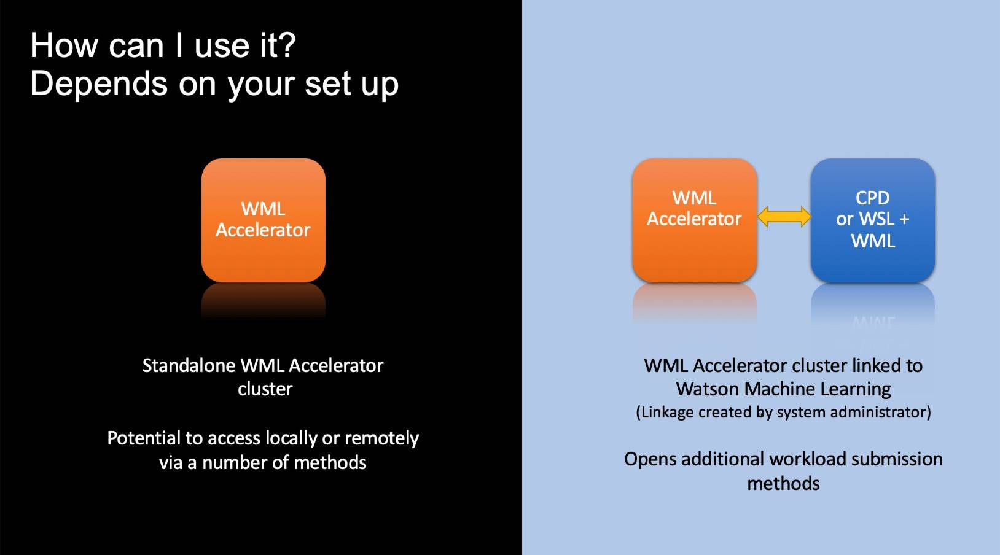
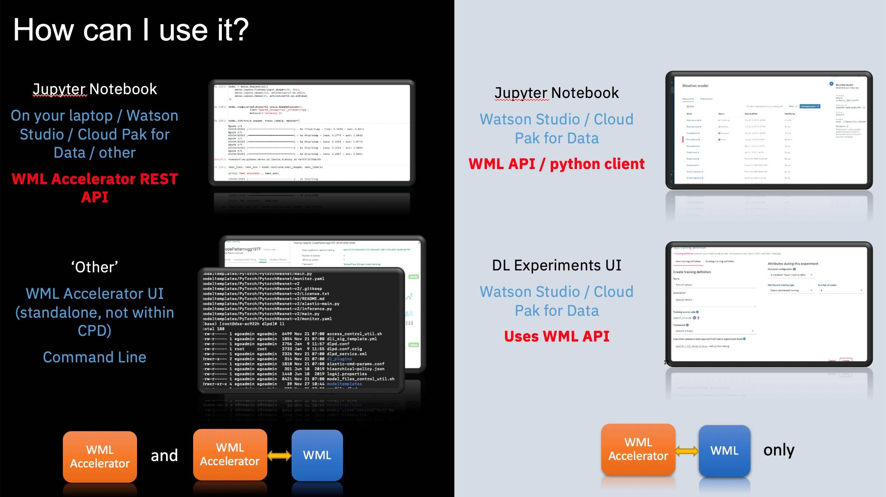

# 加速深度学习和机器学习
借助 IBM Cloud Pak for Data 和 IBM Watson Machine Learning Accelerator

**标签:** IBM Cloud Pak for Data,Watson Machine Learning Accelerator,Watson Studio,人工智能

[原文链接](https://developer.ibm.com/zh/articles/accelerate-dl-with-wmla-and-cp4d/)

Kelvin Lui, Mandie Quartly, Helena Krolak

发布: 2020-10-26

* * *

本文已纳入 [学习路径：Watson Machine Learning Accelerator 入门](https://developer.ibm.com/zh/series/learning-path-get-started-with-watson-machine-learning-accelerator/) 系列。

主题类型[Watson Machine Learning Accelerator 简介](https://developer.ibm.com/zh/articles/introduction-to-watson-machine-learning-accelerator)文章**加速深度学习和机器学习****文章 \+ Notebook**[Watson Machine Learning Accelerator 中的 Elastic Distributed Training](https://developer.ibm.com/zh/articles/elastic-distributed-training-edt-in-watson-machine-learning-accelerator/)文章 \+ Notebook[使用 Watson Machine Learning Accelerator 超参数优化来加快零售价格预测](https://developer.ibm.com/zh/tutorials/expedite-price-prediction-with-watson-ml-accelerator-hyperparameter-tuning)教程[推动更高的 GPU 利用率和吞吐量](https://developer.ibm.com/zh/tutorials/drive-higher-gpu-utilization-and-throughput-with-watson-machine-learning-accelerator/)教程[使用 Watson Machine Learning Accelerator 对图像进行分类](https://developer.ibm.com/zh/articles/classify-images-with-watson-machine-learning-accelerator)文章 \+ Notebook

## 简介

IBM Cloud Pak® for Data 中的 IBM Watson® Studio 和 IBM Watson Machine Learning (WML) 与 IBM Watson Machine Learning Accelerator 相结合，构成了可加速模型训练过程的企业 AI 平台。该平台为您提供了更高的速度和准确性来提升价值，并缩短了将模型推向市场所需的时间。使用 WML Accelerator 的模型训练是由 GPU 加速的过程，可以自动扩展，从而能够在需要时分配更多 GPU。利用我们的企业 AI 平台，数据科学家可以更快速地获取结果，并达到所需的准确性级别。这些技术按如下方式协同工作：

- IBM Cloud Pak for Data 中的 IBM Watson Studio 和 Watson Machine Learning 提供构建、训练和部署模型所需的工具。
- Watson Machine Learning Accelerator 通过并行自动执行超参数搜索来优化训练速度。
- Watson Machine Learning Accelerator 包括一个弹性的分布式训练引擎，有助于在多个 GPU 和计算节点之间分布模型训练。训练作业的分配是弹性的，这意味着 GPU 是动态分配的，并且添加或删除 GPU 不会中断正在运行的作业。由于调度程序会动态分配 GPU，因此您无需将 GPU 拓扑编码到模型中。而弹性分布式训练可处理基于独立系统构建的模型的分配，并使分配对数据科学家可见。

在本文中，您将学习如何：

- 配置并启用 IBM Cloud Pak for Data 中的 IBM Watson Studio 与 IBM WML Accelerator 之间的链接。
- 使用相应方法将 IBM Watson Studio 中的深度学习工作负载提交到 IBM WML Accelerator，包括通过 WML Accelerator Rest API 自动搜索模型超参数，通过 Watson Studio 中的 Experiment Builder UI 利用弹性分布式训练引擎弹性分配训练，以及使用 WML API 通过 WML Python 客户端训练和部署模型。

## 安装和配置

要安装和配置 IBM Watson Studio 和 IBM Watson Machine Learning Accelerator，可考虑以下选项。

在 Cloud Pak for Data 上，安装 Watson Machine Learning Accelerator 和 Watson Machine Learning 以获取完整的 AI 生命周期（查看 [安装 Watson Machine Learning](https://www.ibm.com/support/knowledgecenter/SSQNUZ_3.5.0/svc-wml/wml-install.html) 和 [安装 Watson Machine Learning Accelerator](https://www-03preprod.ibm.com/support/knowledgecenter/SSQNUZ_3.5.0_test/svc-wmla/wmla-install-overview.html)）。阅读 [Connecting Watson Machine Learning Accelerator to Watson Machine Learning](https://www.ibm.com/support/knowledgecenter/SSQNUZ_3.5.0_test/svc-wmla/wmla-connect-wml.html) 从而确保连接这两项服务。

另外，对于使用 Watson Machine Learning Accelerator 的本地解决方案，请学习如何将 Watson Machine Learning Accelerator 环境连接到 IBM Cloud Pak for Data 上的IBM Watson Studio。想了解更多关于按照和配置的信息，可查看 [Installing with Watson Machine Learning or Watson Studio](https://www.ibm.com/support/knowledgecenter/SSFHA8_1.2.2/wmla_wsl_wml_install.html)。

**图 1\. 设置和配置**

## 如何使用

根据 Watson Machine Learning Accelerator 集群的设置方式，在深度学习工作负载提交方面，可以采用多种方法来利用 Watson Machine Learning Accelerator。如果您只有一个 Watson Machine Learning Accelerator 集群，且未将其链接到 Watson Studio 和 Watson Machine Learning，那么可以直接访问 Watson Machine Learning Accelerator API。但如果您的 Watson Machine Learning Accelerator 集群已链接到 IBM Cloud Pak for Data 中的 Watson Studio 和 Watson Machine Learning，那么就可以使用其他的深度学习工作负载提交方法。

**图 2\. 最佳实践**

这些方法之间的主要区别是对 Watson Machine Learning Accelerator 的底层访问方式。可能是直接通过 Watson Machine Learning Accelerator API 来访问，也可能是通过 Watson Machine Learning API 来访问。

## Watson Machine Learning Accelerator API

如果直接使用 Watson Machine Learning Accelerator REST API，则可以通过以下方式来启动 Jupyter Notebook：使用直接通过 Watson Machine Learning Accelerator Rest API 建立的网络连接来访问 Watson Machine Learning Accelerator 集群。该 Jupyter Notebook 可以在任何平台上运行，例如在笔记本电脑上本地运行，也可以在 Cloud Pak for Data 中作为 Watson Studio 来设置。

试用 [Cloud Pak for Data 3.5.0 notebook](https://github.com/IBM/wmla-assets/blob/master/dli-learning-path/tutorials-cpd-wmla/CPD3.5.0-model-hyperparameter-optimization-via-wmla-api.ipynb) 或 [Cloud Pak for Data 3.0.1 notebook](https://github.com/IBM/wmla-assets/blob/master/dli-learning-path/tutorials-cpd-wmla/05-wmla-api-submitting-hyperparameter-optimization.ipynb)，这演示了如何通过Watson Machine Learning Accelerator Rest API 自动搜索模型超参数。

您可以在 IBM Knowledge Center 中找到有关 WML Accelerator Rest API 的更多详细信息：

- [Watson Machine Learning Accelerator 2.2 中用于 REST 深度学习的 REST API](https://www.ibm.com/support/knowledgecenter/SSFHA8_2.2.0/cm/deeplearning.html)
- [REST 深度学习 V1 的 REST API](https://www.ibm.com/support/knowledgecenter/SSFHA8_1.2.2/cm/deeplearning.html)
- [RESTful API 参考](https://www.ibm.com/support/knowledgecenter/SSZU2E_2.4.1/reference_s/api_references.html)

## Watson Machine Learning API

仅当 IBM Cloud Pak for Data 和 Watson Machine Learning Accelerator 之间存在连接时，以下两种方法才可用。这两种方法都是间接使用 Watson Machine Learning API：通过 Watson ML Python 客户端或者 Watson Studio 中的 Experiments Builder。

### Watson Machine Learning Python 客户端

此方法基于 Jupyter Notebook（包含在 Cloud Pak for Data 中的 Watson Studio 中）。这使用了 Watson Machine Learning API，可以直接通过 API 代码或 Python 客户端进行访问。

试用 [Cloud Pak for Data 2.5.0 notebook](https://github.com/IBM/wmla-assets/blob/master/dli-learning-path/tutorials-cpd-wmla/05_cpd2.5-wmla-python-client-e2e-flow.ipynb) 和 [Cloud Pak for Data 3.0.1 notebook](https://github.com/IBM/wmla-assets/blob/master/dli-learning-path/tutorials-cpd-wmla/05_cpd3.0-wmla-python-client-e2e-flow.ipynb)，用于执行 WML Python 客户端，以便使用 WML Accelerator 来训练模型并使用 WML 评分服务来部署模型。

您可以在 [Watson Machine Learning 文档](http://wml-api-pyclient-v4.mybluemix.net/) 中了解有关 Watson Machine Learning Python 客户端的更多详细信息。

### Watson Studio 中的 Experiment Builder

此方法间接使用 Watson Machine Learning API。这种方法使用 Watson Studio UI，在这种方法中，一旦数据就位并且创建了训练工作负载的代码，就可以从 Watson Studio 中的 Experiment Builder UI 创建模型。有了正确的度量标准共享库，甚至可以查看训练运行的准确性报告。

有关更多信息，可查看 [用于提交分布式训练的 Watson Deep Learning Experiment UI](https://github.com/IBM/wmla-learning-path/blob/master/tutorials-cpd-wmla/05_Watson_Deep_Learning_Experiment_UI_for_submitting_distributed_training.md)。

## 结束语

IBM Cloud Pak for Data 中的 IBM Watson Studio 和 IBM Watson Machine Learning 与 IBM Watson Machine Learning Accelerator 共同构成了强大的企业 AI 平台基础。该基础可以帮助您更快地获得结果并提高模型的准确性。在本文中，我们描述了如何通过 Watson Machine Learning Accelerator 使用多种方法来加速模型训练。

阅读 [IBM Cloud Pak for Data 3.5.0](https://www.ibm.com/support/knowledgecenter/SSQNUZ_3.5.0/svc-welcome/wmlaccelerator.html) and [Watson Machine Learning Accelerator 2.2.0](https://www.ibm.com/support/knowledgecenter/SSFHA8_2.2.0/wmla_overview.html) 文档，获得 Watson Machine Learning Accelerator 最新发行版本。

本文翻译自： [Accelerate your deep learning and machine learning](https://developer.ibm.com/articles/accelerate-dl-with-wmla-and-cp4d/)（2020-08-11）