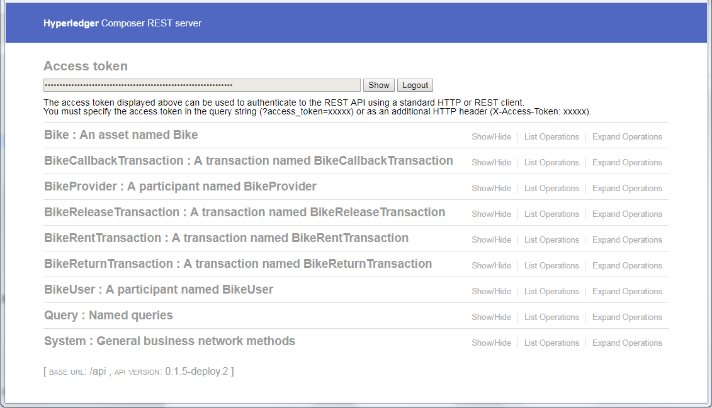
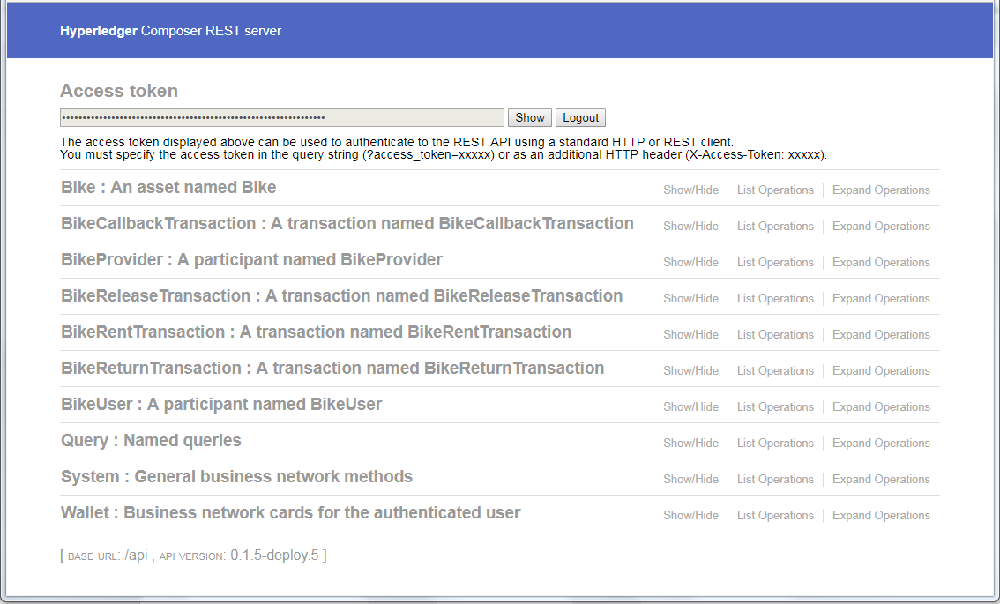

# 区块链网络的基本权限控制与应用程序开发
了解身份认证、授权机制问题

**标签:** 区块链

[原文链接](https://developer.ibm.com/zh/articles/cl-lo-hyperledger-fabric-study-notes3/)

徐 春雷

发布: 2018-06-05

* * *

## 前言

在本系列 [第 2 部分](https://www.ibm.com/developerworks/cn/cloud/library/cl-lo-hyperledger-fabric-study-notes2/index.html) 中，我们设想了一个具有现实意义的 User Story，实现了一个”共享自行车区块链网络” – bikesharing Network 的基础功能，并部署、使用了它。在此过程中，我们学习了 BND，Composer Modeling Language，以及一些基本的通过 Composer 部署、控制 Fabric 区块链业务网络的方法。

但之前的 bikesharing Network 实现并未考虑到权限控制问题，我们甚至没有多用户机制，而这是一个商业应用不可缺少的重要环节。所以，在本文中，我们会着重讲解身份认证、授权机制问题，了解 Composer 框架下的权限控制方式。

之前的介绍中，都是通过浏览器（或 curl 等客户端工具）访问 REST Server 的方式操作区块链业务网络资源，本文中，我们会讲解如何通过 Composer API 进行区块链应用开发。这样，我们就可以将区块链应用与任意其他应用系统进行集成。

本文中以第 2 部分的示例为基础，请先行阅读、执行学习之前的示例。本文示例所使用的 Fabric 的版本为 1.1.0，Composer 的最新版本为 0.19.4。在以后的学习过程，它们可能随时有版本更新，请注意版本更新可能带来的变化。（Micro 版本号对应用应该没有影响，在本文公开后，如继续有升级，请自行升级 Composer 即可。）

## 权限与认证

我们从一些明显的问题出发，来学习如何在区块链网络中处理权限与身份认证问题。

### REST Server 用户认证

之前，任意用户都可以访问 [http://fabric11dev1:3100/explorer（](http://fabric11dev1:3100/explorer（) _fabric11dev1:3100 是我们的示例服务器地址、端口，如有需要，请将其改为你所用的服务器地址、端口。本文均如此，不再另行说明_ ），这是明显不符合实际情况的。所以，我们的第一步是：让 REST Server 支持用户认证功能，未认证的用户不允许访问。

Composer REST Server 是在 LoopBack 基础上开发的，而 LoopBack 通过 loopback-component-passport（这个 module 集成了 Passport）实现第三方登录，使我们可以使用诸如 GitHub，Google，QQ，BaiDu 等第三方账户完成身份验证，登录 REST Server。

[LoopBack](https://loopback.io/doc/index.html) ：是一个高扩展性、开源的 Node.js 框架应用，只需要增加很少（甚至不需要）代码，就可以帮助我们建立动态的 REST API 服务。

[Passport](http://www.passportjs.org/) ：是一个 Node.js 框架下的第三方认证中间件，可以帮助 Node.js 应用支持第三方认证（如 OAuth，Basic）。

[loopback-component-passport](https://github.com/strongloop/loopback-component-passport) ：这是 LoopBack 的一个组件，它集成了 Passport，是其与 LoopBack 二者的桥梁。

GitHub 支持 OAuth 且不需要额外的审核程序，现在我们可以通过 Passport 使 REST Server 支持 GitHub 第三方用户认证，这样，只要有 GitHub 账户就可以登录我们的 REST Server 了。

#### 注册、配置 OAuth App

1. 登录 GitHub，点击右上角的用户头像 / Settings。
2. 点击 Developer settings / OAuth Apps / **New** OAuth **App** 。
3. 在 Register a new OAuth application 表单中输入以下内容：

```
Application name：bikesharing-network
Homepage URL：http://fabric11dev1:3100
Application description：The bikesharing test REST Server.
Authorization callback URL：http://fabric11dev1:3100/auth/github/callback

```

Show moreShow more icon

_注意：比其他一些 OAuth 服务更自由，GitHub OAuth 并不要求 fabric11dev1 是真实的 Internet 地址，也不会去验证它的存在。只要这个 host 可以被你自己的浏览器访问到就可以了。_

1. 点击 Register application。
2. 注册成功后，在 app 详情页面复制 Client ID 与 Client Secret 内容。
3. 在 REST Server 所在机器上，执行如下内容（请替换 _< Client ID>_ 与 _< Client Secret>_ ），以设置系统环境变量 COMPOSER\_PROVIDERS：

```
$ export COMPOSER_PROVIDERS='{
"github": {
"provider": "github",
"module": "passport-github",
"clientID": "<Client ID>",
"clientSecret": "<Client Secret>",
"authPath": "/auth/github",
"callbackURL": "/auth/github/callback",
"successRedirect": "/",
"failureRedirect": "/"
}
}'

```

Show moreShow more icon

_注意：这里的 callbackURL 必须与 “Register a new OAuth application” 表单中的 “Authorization callback URL” 属性对应，只是不需要 host name:port。_

也可以将此系统变量加入 profile 文件中并执行；或将此 export 命令写入 .sh 文件，并以 source 执行。

#### 安装 passport-github

```
$ npm install -g passport-github

```

Show moreShow more icon

#### 重启 Composer REST Server

```
$ composer-rest-server --card admin@bikesharing-network --namespaces
    "never" --port 3100 --authentication true

```

Show moreShow more icon

再访问 [http://fabric11dev1:3100/](http://fabric11dev1:3100/) **auth/github** 。

如果在当前浏览器中用户已经登录过 GitHub，则会自动跳转到 homepage, 并显示 **Access token** 内容，表示第三方认证成功。如果当前浏览器没有登录过 GitHub，则会跳转到 GitHub 页面提示用户登录。

_注意：_

_不要忘记 export COMPOSER\_PROVIDERS;_

_路径 autu/github 应与之前定义的环境变量 COMPOSER\_PROVIDERS 中的 authPath 一致。_

_如果在关闭浏览器后再次访问，可能需要先执行 Logout，再重新访问 [http://fabric11dev1:3100/auth/github。](http://fabric11dev1:3100/auth/github。)_

##### 第三方 OAuth 认证成功后的页面



#### 在 curl 中使用 OAuth

如果需要通过 curl 等命令行工具访问带用户认证功能的 REST Server，需要以下过程：

- 通过浏览器登录成功，如前文所述。
- 点击 Access Token / Show，得到 Token。示例为：n0dsdJdVd4qcmvvTtAKhiBx0bRnkyey2VGTOlunvNgT3M33ASC7blHA6lxViUfAv
- 在 curl 命令中加入此 Token。

示例在 URL 中加入 Token：

```
    $ curl -v http://localhost:3100/api/system/ping?access_token=n0dsdJdVd4qcmvvTtAKhiBx0bRnkyey2VGTOlunvNgT3M33ASC7blHA6lxViUfAv

```

Show moreShow more icon

示例在 Header 中加入 Token：

```
    $ curl -v -H 'X-Access-Token:n0dsdJdVd4qcmvvTtAKhiBx0bRnkyey2VGTOlunvNgT3M33ASC7blHA6lxViUfAv' http://localhost:3100/api/system/ping

```

Show moreShow more icon

_注意：使用时请替换 Token。_

### Identity，Participant 和 Card

我们可能有一个疑虑：虽然上文的方法使得 REST Server 可以要求访问者必须通过一定的身份认证条件；但是 userA@github 与 userB@github 同时访问这个 REST Server，系统又如何区别呢？在这个部分我们将回答这个问题。

#### System Historian

- 我们提交一个 BikeRentTransaction：

```
    {
      "$class": "org.bikesharing.biznet.BikeRentTransaction",
      "user": "resource:org.bikesharing.biznet.BikeUser#bu_1",
      "bike": "resource:org.bikesharing.biznet.Bike#b_1",
      "time": "2018-04-20T18:00:01+08:00"
    }

```

Show moreShow more icon

- 在 System 中使用 GET system/historian，获得一系列系统操作历史，其中有关于这个交易的详细情况如下：

```
    {
        "$class": "org.hyperledger.composer.system.HistorianRecord",
        "transactionId": "ce84461b28c6312146b69c509ab30b688b6da431efd9cf9e7f65fe47f3e1db09",
        "transactionType": "org.bikesharing.biznet.BikeRentTransaction",
        "transactionInvoked": "resource:org.bikesharing.biznet.BikeRentTransaction#ce84461b28c6312146b69c509ab30b688b6da431efd9cf9e7f65fe47f3e1db09",
        "participantInvoking": "resource:org.hyperledger.composer.system.NetworkAdmin#admin",
        "identityUsed": "resource:org.hyperledger.composer.system.Identity#6a3fe31b3d9350484332ff5753e4420b84dbcf49a084d7833781088b5449912a",
        "eventsEmitted": [],
        "transactionTimestamp": "2018-04-30T02:30:17.755Z"
    }

```

Show moreShow more icon

请注意其中的 participantInvoking，“system.NetworkAdmin#admin” 表示实际上是由 admin 将这个交易提交到区块链业务网络的。

- 在 System 中使用 GET system/ping，获得当前用户资料：

```
    {
      "version": "0.19.2",
      "participant": "org.hyperledger.composer.system.NetworkAdmin#admin",
      "identity": "org.hyperledger.composer.system.Identity#6a3fe31b3d9350484332ff5753e4420b84dbcf49a084d7833781088b5449912a"
    }

```

Show moreShow more icon

这里的 identity 与 system/historian 中的 identityUsed 是相同的。看到这里我们应该明白，不管是什么用户登录 REST Server，都只是通过了 REST Server 本身的认证，这个“用户”只是在客户端与 REST Server 的会话中有效，只是保证了用户有权限访问某个 REST API。而当对区块链业务系统的操作被提交时，其实是通过启动 composer-rest-server 时指定的 –card admin@bikesharing-network，也就是 system.NetworkAdmin#admin 这个身份进行操作的。

如果分析更多的 historian records，我们会发现，之前通过 BikeUser / POST 进行添加 BikeUser Participant 的操作，其实也是 system.NetworkAdmin#admin 这个身份提交了一个名为 AddParticipant 的操作。

#### Identity 和 Participant

**Participant** 是区块链业务网络的参与者，可以进行：操作 assets，提交 transactions，与其他 participants 进行 assets 交换等业务。比如示例中建立的 BikeUser#bu\_1 就是一个 Participant，当我们想建立一个 bu\_1 借自行车的交易时，本意是由这个 bu\_1 直接提交交易。但我们如何才能以 BikeUser#bu\_1 自己的名义提交交易，而不是由 NetworkAdmin@admin 代为进行呢？

**Identi t y** （身份）是 Fabric 区块链网络中的重要概念，它表示一个独立的用户身份，它由 Fabric CA 颁发，是权限控制的基础。一个 Participant 会拥有一个或多个 Identity 文档，以表示这个 Participant 的身份的多个方面；正如一个人可以通过护照、身份证、指纹、数字证书等多种文件证明他/她的身份。在与 Fabric 网络交互时，Participant 本身并不被允许直接与 Fabric 网络对话，因为它只是一个 resource，是一个资源实例；它必须通过被 Fabric CA 认可的 Identity 文档证明当前 Participant 的身份。也就是说：我们需要建立 Participant – Identity 的对应关系。

下面有几个相关的重要概念：

- Issue（颁发）

我们可以 Issue 一个新的 Identity 文档给一个 Participant（比如 BikeUser#bu\_1），那个这个 bu\_1 就可以通过这个 Identity 与 Fabric 业务网络进行交互。

- Bind（绑定）

我们可以 Bind 一个现有的 Identity 文档给一个 Participant。

- Revoke（撤回）

既然有 Issue 与 Bind，就会有相反的操作。当 Identity 不再被允许使用时（比如：过期、被盗用）， 我们可以通过 Revoke 操作使这个 Identity 不再被允许用来访问业务网络。Revoke 操作并不会影响相关的 Participants 或 Assets，这二者与 Identity 是相互独立的。

- Identity Registry（身份注册表）

Composer 框架下的区块链业务网络会维护一个 Identity Registry，保存所有的 Issue、Bind 产生的 Identity-Participant 之间的对应关系。

当一个 Participant 利用拥有的 Identity 文档连接到业务网络、提交交易时，Composer 会从 Identity Registry 中寻找当前连接所用的 Identity 对应的 Participant，并将找到的 Participant 作为 Current Participant。这样，我们就可以将 Fabric CA 所认证的身份转化为业务网络中的一个具体的参与者（Participant）。

在之前的 Access Control Rule 学习中，我们可以看到，所有的授权规则都是以 Participant 为基础的，而 Identity 与 Participant 的对应正是其重要的实现步骤。

- Active（激活）

当 Identity 第一次被连接到 Fabric 网络使用时，会被激活，并产生、记录一些信息，比如：证书等。

#### Card 文件

Business Network Card 文件（.card）是 Identity 的载体，它包含了到业务网络的连接信息，Identity 认证信息。执行 Issue Identity 时，会生成相应的 Card 文件；客户端连接业务网络时，就是通过指定 Card 名称（注意：并不是 Card 文件名称）来确认 Identity 的。

- Card 文件结构

Card 文件是一个 zip 格式的压缩文件，主要有以下几个文件构成。

**m etadata. json** （Identity 的相关信息），示例：

```
    {
        "version": 1,
        "userName": "admin",
        "businessNetwork": "bikesharing-network",
        "enrollmentSecret": "adminpw"
    }

```

Show moreShow more icon

_< username > @_ 即组成以后通过 –card 参数使用的 Card 名称。

**connection.json** （到业务网络的连接信息），示例：

```
    {
        "name": "hlfv1",
        "x-type": "hlfv1",
        "x-commitTimeout": 300,
        "version": "1.0.0",
        "client":...,
        "channels":...,
        "organizations":...,
        "orderers":...,
        "peers": {
            "peer0.org1.example.com": {
                "url": "grpc://localhost:7051",
                "eventUrl": "grpc://localhost:7053"
            }
        },
        "certificateAuthorities":...
    }

```

Show moreShow more icon

**credentials\\certificate**

**credentials\\privateKey**

credentials 文件夹下的两个文件（证书与私钥）是可选的。如果没有 credentials 文件夹，则 metadata.json 文件中的 enrollmentSecret 属性必须存在。如果 enrollmentSecret 属性存在，则在执行 Card 导出时，就会在导出的 Card 文件中包括 credentials 文件夹。

- 导出 Card

当 Card 文件被连接使用后（激活 Identity），如果这个 Identity 需要被其他客户端重用以连接业务网络，则需要进行一次 export（导出）操作，其他客户端应该使用这个导出的 Card 文件。

- Card Store 与 Wallet

我们还记得在执行 Composer CLI 命令（如 composer network, composer-rest-server）时，都需要指定 –card 参数，以指定 Card 文件；而在此之前，都需要执行 composer card import 操作，以导入一个 Card 文件。（在 REST Server Web Page 上同样也有类似操作，我们会稍后讲解。）

我们可以查看所有导入的 Card：

```
$ composer card list

```

Show moreShow more icon

也可以直接查看 Compser Card 文件目录：

```
$ ls /home/fabric/.composer/cards/admin@bikesharing-network
$ ls /home/fabric/.composer/cards

```

Show moreShow more icon

这个保存了很多 Card 的存储机制就是 Card Store，在 REST Server Web Page 上表示为 Wallet。我们导入的将被 Composer CLI Command 工具所使用的 Card 文件都会被 Wallet 保存下来，而 Card 文件里面会包括 enrollmentSecret，以及 CA 颁发的证书，私钥，所以说，如果我们执行 card import，那就意味我们是以”信任”那个 Wallet 为前提的。

Wallet 的存储方式是可以配置的，并自定义其实现方式，比如：composer-wallet-filesystem，composer-wallet-inmemory。

当我们通过 –card 参数指定 Card，也就是指定了用于连接业务网络的 Identity，之前启动 Composer Rest Server 指定的 –card admin@bikesharing-network 就会被作为 REST Service 执行业务操作时的默认 Identity。这也正是之前在 System Ping 时看到 “participant”:”org.hyperledger.composer.system.NetworkAdmin#admin” 的原因。

### 身份认证

我们在上一章中学习了 Identity、Participant 和 Card。我们现在就使用这些知识来实践 bikesharing-network 中的多用户认证机制。目标是：当用户登录 REST Server Web Page 时，系统可以分辨出当前用户所对应的 Participant，以便在之后应用 Access Control Rules。

#### 颁发 Identity

以下的操作示例通过 Composer CLI Command 完成；实际上也可以通过调用 Composer API 在 JS 程序中完成。

- 通过 REST Server 确定 org.bikesharing.biznet.BikeUser#bu\_1 存在。

- identity issue


```
$ composer identity issue --card admin@bikesharing-network --file bob.card
    --newUserId bob --participantId
    "resource:org.bikesharing.biznet.BikeUser#bu_1"

```

Show moreShow more icon

运行成功后会生成 bob.card 文件。

- card import

```
$ composer card import --file bob.card

```

Show moreShow more icon

- network ping

```
$ composer network ping --card bob@bikesharing-network

```

Show moreShow more icon

运行成功后返回内容如下：

```
The connection to the network was successfully tested:
    bikesharing-network
//...
participant: org.bikesharing.biznet.BikeUser#bu_1
identity:
    org.hyperledger.composer.system.Identity#b0a3c282d44cf76cab731eb25c473ee53a8ba87129da572381f542f5b415bb53
Command succeeded

```

Show moreShow more icon

其中：participant 是这个 Card 对应的 BikeUser#bu\_1，Identity ID 是 b0a3c282d44cf76cab731eb25c473ee53a8ba87129da572381f542f5b415bb53。

- 或者执行 identity list，可得到更详细内容：

```
    $ composer identity list --card bob@bikesharing-network

```

Show moreShow more icon

- card export

我们准备在 REST Server Web Page 中使用这个 Card（即 Identity）。但我们要先使用 export 导出 Card，因为这个 Identity 已经被使用并激活（active）。

反之，如果我们只是 issue 成功，但在 Composer CLI 端并没有使用过这个 Identity，而是直接将之在 REST Server Web Page 中使用，那么，当我们想通过 Composer CLI 命令行工具重用这个 Identity 时，则需要在 REST Server Web Page 中将之导出。

```
$ composer card export --card bob@bikesharing-network --file
    bob_export.card

```

Show moreShow more icon

运行成功后，我们可以得到 bob\_export.card 文件。

#### 重启 Composer REST Server

```
$ composer-rest-server --card admin@bikesharing-network --namespaces
    "never" --port 3100 --multiuser true

```

Show moreShow more icon

_注意：不要忘记 export COMPOSER\_PROVIDES。_

这里我们使用 –multiuser 参数，Server 端程序在连接 Fabric 网络时，会使用浏览器端用户提供的 Identity（Card）文件去连接 Fabric 业务网络，而不是默认的 admin Identity。这个参数会自动将参数 –authentication 设为 true，所以，我们不用再特别指定 –authentication。

#### 导入 Card

通过浏览器访问 REST Server，登录成功后，执行 GET System/ping，系统会返回错误信息：

```
{
"error": {
    "statusCode": 500,
    "name": "Error",
    "message": "A business network card has not been specified",
...
}
}

```

Show moreShow more icon

在页面最下方，我们会发现一部分新的内容 “Wallet : Business network cards for the authenticated user”。如下：



点击进入 POST /wallet/import，”Choose file”，选择之前生成的 bob\_export.card 文件，在 name 字段输入 bob\_export.card（这里可使用其他便于理解的名字），点击 **Try it out!。**

执行成功后，我们再执行 GET /wallet，会得到如下内容：

```
[
{
    "name": "bob_export.card",
    "default": true
}
]

```

Show moreShow more icon

这时再执行 SYSTEM GET system/ping，会得到如下内容：

```
{
"version": "0.19.4",
"participant": "org.bikesharing.biznet.BikeUser#bu_1",
"identity": "org.hyperledger.composer.system.Identity#b0a3c282d44cf76cab731eb25c473ee53a8ba87129da572381f542f5b415bb53"
}

```

Show moreShow more icon

通过 participant 及 Identity 属性内容，我们可以知道，此时通过浏览器登录 REST Server 访问 bikesharing-network 区块链业务网络的用户已经确定为之前得到 Fabric CA 授权认证的 Identity bob@bikesharing-network。此用户对业务网络资源的所有操作都将以相关联的 BikeUser#bu\_1 作为授权对象，为 Access Control Rules 控制。

在 Composer CLI 命令行工具中使用的 bob.card 与在浏览器中使用的 bob\_export.card 其实对应了同一个 Identity：bob@bikesharing-network。

此时，我们提交操作（如添加 Asset，Participant，Transaction）后，在 SYSTEM /system/historian 中都会得到相应的 “participantInvoking”: “resource:org.bikesharing.biznet.BikeUser#bu\_1″。说明操作都是以这个 Participant-Identity 对应的身份进行的。

但是，我们目前还没有进行更严格、更完善的权限设置与程序控制，所以，这个用户仍然可以进行几乎所有的业务网络操作，只是系统已经可以对其身份进行识别。

#### 撤消 Identity

通过 revoke 命令撤消 Identity（bob@bikesharing-network）与 Participant（BikeUser#bu\_1）之间的对应关系：

```
$ composer identity revoke --card admin@bikesharing-network --identityId
    b0a3c282d44cf76cab731eb25c473ee53a8ba87129da572381f542f5b415bb53

```

Show moreShow more icon

这里，–card 参数是有权限执行 revoke 命令的 Card；–identityId 是 bob@bikesharing-network 的 idnetityId（ _请注意替换）。_

命令执行后，再次执行 REST Server Web Page 上的操作，会提示类似 “Error: The current identity,… has been revoked” 错误。

#### 设置 Default Card

按上述方法，我们可以导入多个 Card 文件，以对应当前用户的多重身份。可以通过 Wallet POST /wallet/{name}/setDefault 设置某一个 Card 为默认。则之后通过此页面的操作都以此 Card 作为 Fabric Identity。

#### 更多 CA 操作

对于 Identity 的操作是基于 Fabric CA 完成的。Composer 提供了方便的 API 与命令行工具。

这部分内容是区块链的重要基础，我们将在以后学习直接进行 Fabric CA 上的操作，以更深入地理解区块链的权限控制与身份认证机制。

## 应用程序开发

我们之前学习了通过 Composer CLI Command，或者 Composer REST Server 与 Fabric 业务网络进行交互。

我们还可以通过 Composer API 开发 Node.js 程序，以访问 Fabric 业务网络。当我们需要将区块链系统与现有信息系统集成时，这是一种很好的方式。

### Composer APIs

Composer 提供了丰富的 Javascript API，主要包括以下几个部分。

- Common API

主要是一些抽象类、基础类、工具类。例如：BusinessNetworkDefinition、ClassDeclaration、Relationship、Resource 等。

- Client API

主要是一些操作业务网络资源的接口类与方法。例如：AssetRegistry、BusinessNetworkConnection、ParticipantRegistry、Query 等。

- Admin API

提供了 AdminConnection 用以建立到 Composer Runtime 的管理连接。

- Runtime API

提供了供 Transaction Functions 使用的接口，用以操作业务网络资源。例如：Api、AssetRegistry、ParticipantRegistry 等。

### 一个简单的 AssetRegistry 操作

#### 示例程序

#### 清单 1\. 访问 AssetRegistry

```
async listBikes() {
console.info('Begin to get bikes');
let registry = await
this.bizNetworkConnection.getAssetRegistry('org.bikesharing.biznet.Bike');
let allBikes = await registry.getAll();
console.info(`Find ${allBikes.length} bikes`);
allBikes.forEach(bike => {
console.info('Bike: ', bike.aid, bike.getFullyQualifiedIdentifier());
});
process.exit(0);
}

```

Show moreShow more icon

完整程序源码请参考： [clitest.js](https://github.com/tomxucnxa/bikesharing/blob/step3/clitest.js) 。

#### 运行应用程序

```
$ npm install composer-client
$ node clitest admin@bikesharing-network listBikes

```

Show moreShow more icon

运行成功后会返回此业务网络中的 Bike Asset。在程序中，请注意我们多处使用 await/sync 以处理 ES6 的异步过程。

### 完整代码 Step3

下文示例更新了 cto 文件与 js 文件，所以我们需要重新部署升级 BND。请参考 [第 2 部分](https://www.ibm.com/developerworks/cn/cloud/library/cl-lo-hyperledger-fabric-study-notes2/index.html) 中的”更新 BND”相关内容，使用 “composer network upgrade” 更新 BND。

本文所有代码可由这里下载： [GitHub bikesharing Branch step3](https://github.com/tomxucnxa/bikesharing/tree/step3) 。

### 监听事件

Composer Runtime API 中的 Api 提供了 emit 方法，我们可以在 Transaction Function 中 emit event，并在外部程序中通过 Composer API 订阅事件，这样，就可以让外部系统与区块链系统进行松耦合、异步式的交互。

#### 在 CTO 文件中定义 Event

```
event BikeEvent {
 --> Bike bike
o DateTime time
o String transactionId
}

```

Show moreShow more icon

完整程序源码请参考： [models/ org.bikesharing.biznet.cto](https://github.com/tomxucnxa/bikesharing/blob/step3/models/org.bikesharing.biznet.cto) 。

#### 修改 Transaction Function

#### 清单 2\. 生成事件

```
let factory = getFactory();
let e = factory.newEvent('org.bikesharing.biznet', 'BikeEvent');
e.bike = tx.bike;
e.time = tx.time;
e.transactionId = tx.getFullyQualifiedIdentifier();
emit(e);

```

Show moreShow more icon

完整程序源码请参考： [lib/logic.js](https://github.com/tomxucnxa/bikesharing/blob/step3/lib/logic.js) 。

#### 订阅事件的示例程序

#### 清单 3\. 响应事件

```
this.bizNetworkConnection.on('event', (evt) => {
console.log(evt.getFullyQualifiedIdentifier());
console.log(evt.bike.getFullyQualifiedIdentifier());
console.log(evt.time);
console.log(evt.transactionId);
});

```

Show moreShow more icon

完整程序源码请参考： [clitest.js](https://github.com/tomxucnxa/bikesharing/blob/step3/clitest.js) 。

#### 运行应用程序

- 更新、重新启动 BND，重新启动 REST Server。请参考上文的相关操作。
- 执行 listen 程序

```
$ node clitest.js admin@bikesharing-network listen

```

Show moreShow more icon

程序执行后会驻留并等待事件通知。

通过浏览器登录 REST Server Web Page，提交一个 BikeTransaction（请注意 Transaction 定义已经更新）。

```
{
"$class": "org.bikesharing.biznet.BikeRentTransaction",
"bike": "resource:org.bikesharing.biznet.Bike#b_1",
"time": "2018-05-06T12:08:07.506Z"
}

```

Show moreShow more icon

如果成功，会发现在 listen 程序终端会发现被监听到并输出的 BikeTransaction 内容。

## 新的权限控制策略

在之前介绍的 Identity、应用程序开发的基础上，我们可以应用更全面、严格的权限控制策略。一方面是通过 ACL 文件控制访问权限，另一方面是通过应用程序校验当前 Participant 与资源的对应。

### Access Control Rules

我们可以修改 ACL 文件内容，以实现更详细的访问控制。部分内容如下所述。

#### Rules 示例

- BikeProvider 对于自己提供的 Bike 资源具有所有权限。

```
rule ProviderToBike {
description: "Grant bike provider access to the bikes owned"
participant(bp): "org.bikesharing.biznet.BikeProvider"
operation: ALL
resource(b): "org.bikesharing.biznet.Bike"
condition: (b.provider.getIdentifier() == bp.getIdentifier())
action: ALLOW
}

```

Show moreShow more icon

这个 Rule 会”允许”一个 BikeProvider 对自己所拥有的 Bike Asset 进行 CREATE、READ、UPDATE、DELETE 等操作。

在 Bike 定义中，有 BikeProvider 属性；当 Bike 实例被建立时，这个属性是由建立者输入的；在这个实例建立时，还并没有进行权限校验；只是当这个 Bike Asset 实例被进行 CREATE 操作时，才会进行 (b.provider.getIdentifier() == bp.getIdentifier()) 这样的权限校验。

我们试着测试一个被拒绝的操作。在 bu\_1（Identity bob@bikesharing-network）登录成功后，以”其他” provider 名义添加自行车：

```
{
"$class": "org.bikesharing.biznet.Bike",
"status": "INSTORE",
"provider": "resource:org.bikesharing.biznet.BikeProvider#bp_no",
"aid": "b_err_test"
}

```

Show moreShow more icon

会得到如下错误提示：

Participant ‘org.bikesharing.biznet.BikeProvider#bp\_1’ does not have ‘CREATE’ access to resource ‘org.bikesharing.biznet.Bike#b\_err\_test’。

这个过程其实是完全由 Composer 实现并控制的，我们可以在以后通过代码分析了解更多情况。

- BikeUser 对于 Bike 的权限。当 Bike 状态为 AVAILABLE，或者此 Bike 当前为自己所使用时具有 READ 权限。

```
rule UserToBike {
description: "Grant bike user access to the bikes"
participant(bu): "org.bikesharing.biznet.BikeUser"
operation: READ
resource(b): "org.bikesharing.biznet.Bike"
condition: (b.status == "AVAILABLE" || b.activeUser.pid == bu.pid)
action: ALLOW
}

```

Show moreShow more icon

- BikeProvider 对 ReleaseTransaction 中的权限。BikeProvider 可以提交（CREATE）BikeReleaseTransaction。这个交易，会对 Bike 资源进行更新，而之前已经有 Rule 允许 BikeProvider 对自己的 Bike 进行 READ、UPDATE 操作。

```
rule ProviderReleaseCreate {
description: "Grant bike provider release access to the bikes owned"
participant: "org.bikesharing.biznet.BikeProvider"
operation: CREATE
resource: "org.bikesharing.biznet.BikeReleaseTransaction"
action: ALLOW
}

```

Show moreShow more icon

- BikeUser 对于 Bike 在 RentTransaction 中的权限。当 BikeUser 提交 BikeRentTransaction 时，允许对 Bike 进行 READ、UPDATE 操作。这个 Rule 也需要与 UserToBike Rule 合并评估，同时，BikeUser 还需要有 CREATE BikeRentTransaction 的权限（这里不再详述）。

```
rule UserToBikeRent {
description: "Grant bike user access to the bikes rent"
participant: "org.bikesharing.biznet.BikeUser"
operation: READ, UPDATE
resource: "org.bikesharing.biznet.Bike"
transaction: "org.bikesharing.biznet.BikeRentTransaction"
action: ALLOW
}

```

Show moreShow more icon

完整程序源码请参考： [permissions.acl](https://github.com/tomxucnxa/bikesharing/blob/step3/permissions.acl) 。

### 程序中对权限的应用

以 Transaction Function 为例。Api 接口提供了 getCurrentParticipant()等方法，以获取当前用户及 Identity，我们可以在程序中进行用户身份校验，检测当前 Participant 是否与将更新的资源的所有者一致。

#### 清单 4\. 验证当前 Participant

```
sync function processBikeReturnTransaction(tx) {
let currParticipant = checkCurrentParticipant(tx.bike.activeUser);
//...
}
function checkCurrentParticipant(operPart) {
let currParticipant = getCurrentParticipant();
if(currParticipant === undefined || operPart === undefined) {
throw new Error('There is at least one participant to be verified is
    null.');
}
if (currParticipant.getFullyQualifiedIdentifier() !==
    operPart.getFullyQualifiedIdentifier()) {
throw new Error(`The participants
    ${currParticipant.getFullyQualifiedIdentifier()} -
    ${operPart.getFullyQualifiedIdentifier()} are not matched.`);
}
return currParticipant;
}

```

Show moreShow more icon

完整程序源码请参考： [lib/logic.js](https://github.com/tomxucnxa/bikesharing/blob/step3/lib/logic.js) 。

#### 建议

Access Control Rules 需要仔细设计，并与 Transaction Functions 配合使用。访问规则的解析与处理是 Composer 实现的，我们需要深刻理解其作用过程与机制。我们可以在 Playground 里进行 ACL 文件部署与测试，这样可以提高开发、测试效率。

针对上文的比较详细严格的权限控制，我们可以使用 identity issue 建立多个 Identity，并通过 REST Server Web Pages 进行多用户（BikeUser，BikeProvider）对不同 Transaction，Resource 的操作。

## 结语

通过本文，我们主要学习了区块链网络用户身份认证、访问权限控制、应用程序开发等进一步深入的内容，更新了 bikesharing-network Step3 的代码。

相信学习进行到这里，我们对 Fabric-Composer 有了不少直观的印象与理解，了解了如何通过 Composer 部署、启动一个基础的 Fabric 区块链网络，以及区块链应用开发知识。

到这里，“Hyperledger Fabric 学习笔记”系列就告一段落了。我们也达成了既定的学习目标。这一阶段主要内容仍然是从 Composer 入手的，接下来，我们将开始学习更深入的内容，比如：Fabric 架构、单独部署 Fabric、Peer 与 Channel 管理、MSP、Consensus 等等。我们还会涉及到区块链的一些基础算法分析，以及其他的一些区块链项目与技术。

祝大家学习顺利！

再见！

## 参考资源

- 参考 [IBM Blockchain Dev Center](https://developer.ibm.com/cn/blockchain/) ，查看 IBM 在区块链领域的最新信息。
- 参考 [Hyperledger Projects](https://www.hyperledger.org/projects) ，了解开源项目 Hyperledger 的主要内容。
- 参考 [Hyperledger Fabric Documentation](http://hyperledger-fabric.readthedocs.io/en/latest/index.html) ，了解开源项目 Fabric 的主要内容。
- 参考 [Hyperledger Composer Modeling Language](https://hyperledger.github.io/composer/latest/reference/cto_language.html) ，了解这种模型语言的详细规范。
- 参考 [Hyperledger Composer Command Line](https://hyperledger.github.io/composer/latest/reference/commands.html) ，了解 Composer 命令行工具。
- 完整的示例源码： [GitHub bikesharing](https://github.com/Tom-Xu-CNXA/bikesharing)。