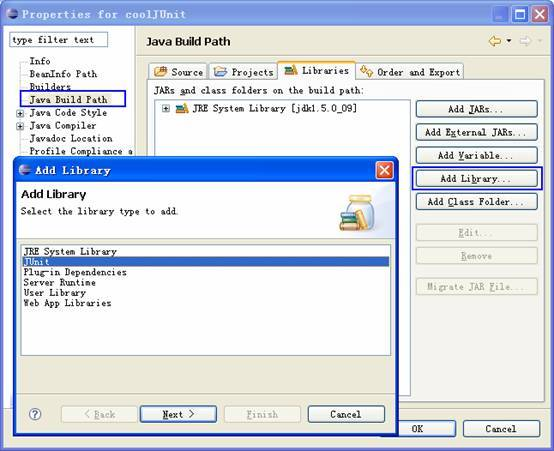
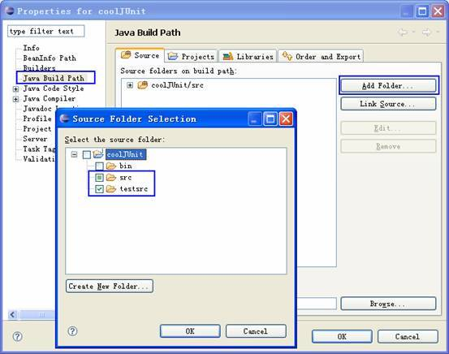
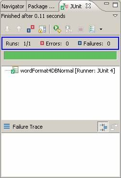
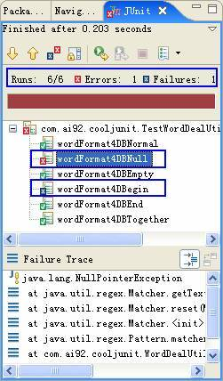
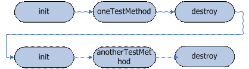
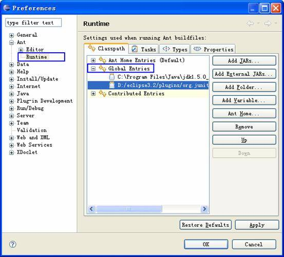
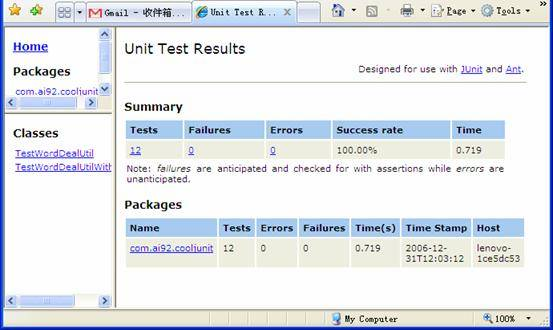

# 单元测试利器 JUnit 4
如何使用 Ant 执行自动化的单元测试

**标签:** DevOps,Java

[原文链接](https://developer.ibm.com/zh/articles/j-lo-junit4/)

苑永凯

发布: 2007-02-28

* * *

## 引言

毋庸置疑，程序员要对自己编写的代码负责，您不仅要保证它能通过编译，正常地运行，而且要满足需求和设计预期的效果。单元测试正是验证代码行为是否满足预期的有效手段之一。但不可否认，做测试是件很枯燥无趣的事情，而一遍又一遍的测试则更是让人生畏的工作。幸运的是，单元测试工具 JUnit 使这一切变得简单艺术起来。

JUnit 是 Java 社区中知名度最高的单元测试工具。它诞生于 1997 年，由 Erich Gamma 和 Kent Beck 共同开发完成。其中 Erich Gamma 是经典著作《设计模式：可复用面向对象软件的基础》一书的作者之一，并在 Eclipse 中有很大的贡献；Kent Beck 则是一位极限编程（XP）方面的专家和先驱。

麻雀虽小，五脏俱全。JUnit 设计的非常小巧，但是功能却非常强大。Martin Fowler 如此评价 JUnit：在软件开发领域，从来就没有如此少的代码起到了如此重要的作用。它大大简化了开发人员执行单元测试的难度，特别是 JUnit 4 使用 Java 5 中的注解（annotation）使测试变得更加简单。

## JUnit 4 初体验

在开始体验 JUnit 4 之前，我们需要以下软件的支持：

- Eclipse：最为流行的 IDE，它全面集成了 JUnit，并从版本 3.2 开始支持 JUnit 4。当然 JUnit 并不依赖于任何 IDE。您可以从 [http://www.eclipse.org/](http://www.eclipse.org/) 上下载最新的 Eclipse 版本。
- Ant：基于 Java 的开源构建工具，您可以在 [http://ant.apache.org/](http://ant.apache.org/) 上得到最新的版本和丰富的文档。Eclipse 中已经集成了 Ant，但是在撰写本文时，Eclipse 使用的 Ant 版本较低（必需 1.7 或者以上版本），不能很好的支持 JUnit 4。
- JUnit：它的官方网站是 [http://www.junit.org/](http://www.junit.org/) 。您可以从上面获取关于 JUnit 的最新消息。如果您和本文一样在 Eclipse 中使用 JUnit，就不必再下载了。

首先为我们的体验新建一个 Java 工程 —— coolJUnit。现在需要做的是，打开项目 coolJUnit 的属性页 -> 选择”Java Build Path”子选项 -> 点选”Add Library…”按钮 -> 在弹出的”Add Library”对话框中选择 JUnit（ [图 1\. 为项目添加 JUnit 库](#图-1-为项目添加-junit-库) ），并在下一页中选择版本 4.1 后点击”Finish”按钮。这样便把 JUnit 引入到当前项目库中了。

##### 图 1\. 为项目添加 JUnit 库



##### 请注意 JDK 的版本

JUnit 4.1 是基于 Java 5 的升级版本，它使用了 Tiger 中的很多新特性来简化原有的使用方式。正因为如此，它并不能直接运行在 JDK1.4.x 版本上。如果您需要在 JDK1.4.x 版本使用 JUnit 的话，请使用 3.8.1 版本。

可以开始编写单元测试了吗？等等……，您打算把单元测试代码放在什么地方呢？把它和被测试代码混在一起，这显然会照成混乱，因为单元测试代码是不会出现在最终产品中的。建议您分别为单元测试代码与被测试代码创建单独的目录，并保证测试代码和被测试代码使用相同的包名。这样既保证了代码的分离，同时还保证了查找的方便。遵照这条原则，我们在项目 coolJUnit 根目录下添加一个新目录 testsrc，并把它加入到项目源代码目录中（加入方式见 [图 2\. 修改项目源代码目录](#图-2-修改项目源代码目录) ）。

##### 图 2\. 修改项目源代码目录



现在我们得到了一条 JUnit 的最佳实践：单元测试代码和被测试代码使用一样的包，不同的目录。

一切准备就绪，一起开始体验如何使用 JUnit 进行单元测试吧。下面的例子来自笔者的开发实践：工具类 WordDealUtil 中的静态方法 wordFormat4DB 是专用于处理 Java 对象名称向数据库表名转换的方法（您可以在代码注释中可以得到更多详细的内容）。下面是第一次编码完成后大致情形：

```
package com.ai92.cooljunit;

import java.util.regex.Matcher;
import java.util.regex.Pattern;

/**
* 对名称、地址等字符串格式的内容进行格式检查
* 或者格式化的工具类
*
* @author Ai92
*/
public class WordDealUtil {

     /**
     * 将 Java 对象名称（每个单词的头字母大写）按照
     * 数据库命名的习惯进行格式化
     * 格式化后的数据为小写字母，并且使用下划线分割命名单词
     *
     * 例如：employeeInfo 经过格式化之后变为 employee_info
     *
     * @param name      Java 对象名称
     */
     public static String wordFormat4DB(String name){
         Pattern p = Pattern.compile("[A-Z]");
         Matcher m = p.matcher(name);
         StringBuffer sb = new StringBuffer();

         while(m.find()){
             m.appendReplacement(sb, "_"+m.group());
         }
         return m.appendTail(sb).toString().toLowerCase();
     }
}

```

Show moreShow more icon

它是否能按照预期的效果执行呢？尝试为它编写 JUnit 单元测试代码如下：

```
package com.ai92.cooljunit;

import static org.junit.Assert.assertEquals;
import org.junit.Test;

public class TestWordDealUtil {
     // 测试 wordFormat4DB 正常运行的情况
     @Test public void wordFormat4DBNormal(){
         String target = "employeeInfo";
         String result = WordDealUtil.wordFormat4DB(target);

         assertEquals("employee_info", result);
     }
}

```

Show moreShow more icon

很普通的一个类嘛！测试类 TestWordDealUtil 之所以使用”Test”开头，完全是为了更好的区分测试类与被测试类。测试方法 wordFormat4DBNormal 调用执行被测试方法 WordDealUtil.wordFormat4DB，以判断运行结果是否达到设计预期的效果。需要注意的是，测试方法 wordFormat4DBNormal 需要按照一定的规范书写：

1. 测试方法必须使用注解 org.junit.Test 修饰。
2. 测试方法必须使用 public void 修饰，而且不能带有任何参数。

测试方法中要处理的字符串为”employeeInfo”，按照设计目的，处理后的结果应该为”employee\_info”。assertEquals 是由 JUnit 提供的一系列判断测试结果是否正确的静态断言方法（位于类 org.junit.Assert 中）之一，我们使用它将执行结果 result 和预期值”employee\_info”进行比较，来判断测试是否成功。

看看运行结果如何。在测试类上点击右键，在弹出菜单中选择 Run As JUnit Test。运行结果如 [图 3\. JUnit 运行成功界面](#图-3-junit-运行成功界面) 所示：

##### 图 3\. JUnit 运行成功界面



绿色的进度条提示我们，测试运行通过了。但现在就宣布代码通过了单元测试还为时过早。记住：您的单元测试代码不是用来证明您是对的，而是为了证明您没有错。因此单元测试的范围要全面，比如对边界值、正常值、错误值得测试；对代码可能出现的问题要全面预测，而这也正是需求分析、详细设计环节中要考虑的。显然，我们的测试才刚刚开始，继续补充一些对特殊情况的测试：

```
public class TestWordDealUtil {
......
     // 测试 null 时的处理情况
     @Test public void wordFormat4DBNull(){
         String target = null;
         String result = WordDealUtil.wordFormat4DB(target);

         assertNull(result);
     }

     // 测试空字符串的处理情况
     @Test public void wordFormat4DBEmpty(){
         String target = "";
         String result = WordDealUtil.wordFormat4DB(target);

         assertEquals("", result);
     }

     // 测试当首字母大写时的情况
     @Test public void wordFormat4DBegin(){
         String target = "EmployeeInfo";
         String result = WordDealUtil.wordFormat4DB(target);

         assertEquals("employee_info", result);
     }

     // 测试当尾字母为大写时的情况
     @Test public void wordFormat4DBEnd(){
         String target = "employeeInfoA";
         String result = WordDealUtil.wordFormat4DB(target);

         assertEquals("employee_info_a", result);
     }

     // 测试多个相连字母大写时的情况
     @Test public void wordFormat4DBTogether(){
         String target = "employeeAInfo";
         String result = WordDealUtil.wordFormat4DB(target);

         assertEquals("employee_a_info", result);
     }
}

```

Show moreShow more icon

再次运行测试。很遗憾，JUnit 运行界面提示我们有两个测试情况未通过测试（ [图 4\. JUnit 运行失败界面](#图-4-junit-运行失败界面) ）——当首字母大写时得到的处理结果与预期的有偏差，造成测试失败（failure）；而当测试对 null 的处理结果时，则直接抛出了异常——测试错误（error）。显然，被测试代码中并没有对首字母大写和 null 这两种特殊情况进行处理，修改如下：

```
// 修改后的方法 wordFormat4DB
/**
     * 将 Java 对象名称（每个单词的头字母大写）按照
     * 数据库命名的习惯进行格式化
     * 格式化后的数据为小写字母，并且使用下划线分割命名单词
     * 如果参数 name 为 null，则返回 null
     *
     * 例如：employeeInfo 经过格式化之后变为 employee_info
     *
     * @param name Java 对象名称
     */
     public static String wordFormat4DB(String name){

         if(name == null){
             return null;
         }

         Pattern p = Pattern.compile("[A-Z]");
         Matcher m = p.matcher(name);
         StringBuffer sb = new StringBuffer();

         while(m.find()){
             if(m.start() != 0)
                 m.appendReplacement(sb, ("_"+m.group()).toLowerCase());
         }
         return m.appendTail(sb).toString().toLowerCase();
     }

```

Show moreShow more icon

##### 图 4\. JUnit 运行失败界面



JUnit 将测试失败的情况分为两种：failure 和 error。Failure 一般由单元测试使用的断言方法判断失败引起，它表示在测试点发现了问题；而 error 则是由代码异常引起，这是测试目的之外的发现，它可能产生于测试代码本身的错误（测试代码也是代码，同样无法保证完全没有缺陷），也可能是被测试代码中的一个隐藏的 bug。

##### 请牢记！

请牢记这一条 JUnit 最佳实践：测试任何可能的错误。单元测试不是用来证明您是对的，而是为了证明您没有错。

啊哈，再次运行测试，绿条又重现眼前。通过对 WordDealUtil.wordFormat4DB 比较全面的单元测试，现在的代码已经比较稳定，可以作为 API 的一部分提供给其它模块使用了。

不知不觉中我们已经使用 JUnit 漂亮的完成了一次单元测试。可以体会到 JUnit 是多么轻量级，多么简单，根本不需要花心思去研究，这就可以把更多的注意力放在更有意义的事情上——编写完整全面的单元测试。

## JUnit 深入

当然，JUnit 提供的功能决不仅仅如此简单，在接下来的内容中，我们会看到 JUnit 中很多有用的特性，掌握它们对您灵活的编写单元测试代码非常有帮助。

### Fixture

何谓 Fixture ？它是指在执行一个或者多个测试方法时需要的一系列公共资源或者数据，例如测试环境，测试数据等等。在编写单元测试的过程中，您会发现在大部分的测试方法在进行真正的测试之前都需要做大量的铺垫——为设计准备 Fixture 而忙碌。这些铺垫过程占据的代码往往比真正测试的代码多得多，而且这个比率随着测试的复杂程度的增加而递增。当多个测试方法都需要做同样的铺垫时，重复代码的”坏味道”便在测试代码中弥漫开来。这股”坏味道”会弄脏您的代码，还会因为疏忽造成错误，应该使用一些手段来根除它。

JUnit 专门提供了设置公共 Fixture 的方法，同一测试类中的所有测试方法都可以共用它来初始化 Fixture 和注销 Fixture。和编写 JUnit 测试方法一样，公共 Fixture 的设置也很简单，您只需要：

1. 使用注解 org,junit.Before 修饰用于初始化 Fixture 的方法。
2. 使用注解 org.junit.After 修饰用于注销 Fixture 的方法。
3. 保证这两种方法都使用 public void 修饰，而且不能带有任何参数。

遵循上面的三条原则，编写出的代码大体是这个样子：

```
// 初始化 Fixture 方法
@Before public void init(){...... }

// 注销 Fixture 方法
@After public void destroy(){...... }

```

Show moreShow more icon

这样，在每一个测试方法执行之前，JUnit 会保证 init 方法已经提前初始化测试环境，而当此测试方法执行完毕之后，JUnit 又会调用 destroy 方法注销测试环境。注意是每一个测试方法的执行都会触发对公共 Fixture 的设置，也就是说使用注解 Before 或者 After 修饰的公共 Fixture 设置方法是方法级别的（ [图 5\. 方法级别 Fixture 执行示意图](#图-5-方法级别-fixture-执行示意图) ）。这样便可以保证各个独立的测试之间互不干扰，以免其它测试代码修改测试环境或者测试数据影响到其它测试代码的准确性。

##### 图 5\. 方法级别 Fixture 执行示意图



可是，这种 Fixture 设置方式还是引来了批评，因为它效率低下，特别是在设置 Fixture 非常耗时的情况下（例如设置数据库链接）。而且对于不会发生变化的测试环境或者测试数据来说，是不会影响到测试方法的执行结果的，也就没有必要针对每一个测试方法重新设置一次 Fixture。因此在 JUnit 4 中引入了类级别的 Fixture 设置方法，编写规范如下：

1. 使用注解 org,junit.BeforeClass 修饰用于初始化 Fixture 的方法。
2. 使用注解 org.junit.AfterClass 修饰用于注销 Fixture 的方法。
3. 保证这两种方法都使用 public static void 修饰，而且不能带有任何参数。

类级别的 Fixture 仅会在测试类中所有测试方法执行之前执行初始化，并在全部测试方法测试完毕之后执行注销方法（ [图 6\. 类级别 Fixture 执行示意图](#图-6-类级别-fixture-执行示意图) ）。代码范本如下：

```
// 类级别 Fixture 初始化方法
@BeforeClass public static void dbInit(){...... }

// 类级别 Fixture 注销方法
     @AfterClass public static void dbClose(){...... }

```

Show moreShow more icon

##### 图 6\. 类级别 Fixture 执行示意图


### 异常以及时间测试

注解 org.junit.Test 中有两个非常有用的参数：expected 和 timeout。参数 expected 代表测试方法期望抛出指定的异常，如果运行测试并没有抛出这个异常，则 JUnit 会认为这个测试没有通过。这为验证被测试方法在错误的情况下是否会抛出预定的异常提供了便利。举例来说，方法 supportDBChecker 用于检查用户使用的数据库版本是否在系统的支持的范围之内，如果用户使用了不被支持的数据库版本，则会抛出运行时异常 UnsupportedDBVersionException。测试方法 supportDBChecker 在数据库版本不支持时是否会抛出指定异常的单元测试方法大体如下：

```
@Test(expected=UnsupportedDBVersionException.class)
     public void unsupportedDBCheck(){
       ......
}

```

Show moreShow more icon

注解 org.junit.Test 的另一个参数 timeout，指定被测试方法被允许运行的最长时间应该是多少，如果测试方法运行时间超过了指定的毫秒数，则 JUnit 认为测试失败。这个参数对于性能测试有一定的帮助。例如，如果解析一份自定义的 XML 文档花费了多于 1 秒的时间，就需要重新考虑 XML 结构的设计，那单元测试方法可以这样来写：

```
@Test(timeout=1000)
     public void selfXMLReader(){
       ......
}

```

Show moreShow more icon

### 忽略测试方法

JUnit 提供注解 org.junit.Ignore 用于暂时忽略某个测试方法，因为有时候由于测试环境受限，并不能保证每一个测试方法都能正确运行。例如下面的代码便表示由于没有了数据库链接，提示 JUnit 忽略测试方法 unsupportedDBCheck：

```
@ Ignore("db is down”)
@Test(expected=UnsupportedDBVersionException.class)
     public void unsupportedDBCheck(){
       ......
}

```

Show moreShow more icon

但是一定要小心。注解 org.junit.Ignore 只能用于暂时的忽略测试，如果需要永远忽略这些测试，一定要确认被测试代码不再需要这些测试方法，以免忽略必要的测试点。

### 测试运行器

又一个新概念出现了——测试运行器，JUnit 中所有的测试方法都是由它负责执行的。JUnit 为单元测试提供了默认的测试运行器，但 JUnit 并没有限制您必须使用默认的运行器。相反，您不仅可以定制自己的运行器（所有的运行器都继承自 org.junit.runner.Runner），而且还可以为每一个测试类指定使用某个具体的运行器。指定方法也很简单，使用注解 org.junit.runner.RunWith 在测试类上显式的声明要使用的运行器即可：

```
@RunWith(CustomTestRunner.class)
public class TestWordDealUtil {
......
}

```

Show moreShow more icon

显而易见，如果测试类没有显式的声明使用哪一个测试运行器，JUnit 会启动默认的测试运行器执行测试类（比如上面提及的单元测试代码）。一般情况下，默认测试运行器可以应对绝大多数的单元测试要求；当使用 JUnit 提供的一些高级特性（例如即将介绍的两个特性）或者针对特殊需求定制 JUnit 测试方式时，显式的声明测试运行器就必不可少了。

### 测试套件

在实际项目中，随着项目进度的开展，单元测试类会越来越多，可是直到现在我们还只会一个一个的单独运行测试类，这在实际项目实践中肯定是不可行的。为了解决这个问题，JUnit 提供了一种批量运行测试类的方法，叫做测试套件。这样，每次需要验证系统功能正确性时，只执行一个或几个测试套件便可以了。测试套件的写法非常简单，您只需要遵循以下规则：

1. 创建一个空类作为测试套件的入口。
2. 使用注解 org.junit.runner.RunWith 和 org.junit.runners.Suite.SuiteClasses 修饰这个空类。
3. 将 org.junit.runners.Suite 作为参数传入注解 RunWith，以提示 JUnit 为此类使用套件运行器执行。
4. 将需要放入此测试套件的测试类组成数组作为注解 SuiteClasses 的参数。
5. 保证这个空类使用 public 修饰，而且存在公开的不带有任何参数的构造函数。

```
package com.ai92.cooljunit;

import org.junit.runner.RunWith;
import org.junit.runners.Suite;
......

/**
* 批量测试 工具包 中测试类
* @author Ai92
*/
@RunWith(Suite.class)
@Suite.SuiteClasses({TestWordDealUtil.class})
public class RunAllUtilTestsSuite {
}

```

Show moreShow more icon

上例代码中，我们将前文提到的测试类 TestWordDealUtil 放入了测试套件 RunAllUtilTestsSuite 中，在 Eclipse 中运行测试套件，可以看到测试类 TestWordDealUtil 被调用执行了。测试套件中不仅可以包含基本的测试类，而且可以包含其它的测试套件，这样可以很方便的分层管理不同模块的单元测试代码。但是，您一定要保证测试套件之间没有循环包含关系，否则无尽的循环就会出现在您的面前……。

### 参数化测试

回顾一下我们在小节 “ [JUnit 4 初体验](#junit-4-初体验) ”中举的实例。为了保证单元测试的严谨性，我们模拟了不同类型的字符串来测试方法的处理能力，为此我们编写大量的单元测试方法。可是这些测试方法都是大同小异：代码结构都是相同的，不同的仅仅是测试数据和期望值。有没有更好的方法将测试方法中相同的代码结构提取出来，提高代码的重用度，减少复制粘贴代码的烦恼？在以前的 JUnit 版本上，并没有好的解决方法，而现在您可以使用 JUnit 提供的参数化测试方式应对这个问题。

参数化测试的编写稍微有点麻烦（当然这是相对于 JUnit 中其它特性而言）：

1. 为准备使用参数化测试的测试类指定特殊的运行器 org.junit.runners.Parameterized。
2. 为测试类声明几个变量，分别用于存放期望值和测试所用数据。
3. 为测试类声明一个使用注解 org.junit.runners.Parameterized.Parameters 修饰的，返回值为 java.util.Collection 的公共静态方法，并在此方法中初始化所有需要测试的参数对。
4. 为测试类声明一个带有参数的公共构造函数，并在其中为第二个环节中声明的几个变量赋值。
5. 编写测试方法，使用定义的变量作为参数进行测试。

我们按照这个标准，重新改造一番我们的单元测试代码：

```
package com.ai92.cooljunit;

import static org.junit.Assert.assertEquals;
import java.util.Arrays;
import java.util.Collection;

import org.junit.Test;
import org.junit.runner.RunWith;
import org.junit.runners.Parameterized;
import org.junit.runners.Parameterized.Parameters;

@RunWith(Parameterized.class)
public class TestWordDealUtilWithParam {

        private String expected;

        private String target;

        @Parameters
        public static Collection words(){
            return Arrays.asList(new Object[][]{
                {"employee_info", "employeeInfo"},      // 测试一般的处理情况
                {null, null},                           // 测试 null 时的处理情况
                {"", ""},                               // 测试空字符串时的处理情况
                {"employee_info", "EmployeeInfo"},      // 测试当首字母大写时的情况
                {"employee_info_a", "employeeInfoA"},   // 测试当尾字母为大写时的情况
                {"employee_a_info", "employeeAInfo"}    // 测试多个相连字母大写时的情况
            });
        }

         /**
         * 参数化测试必须的构造函数
         * @param expected     期望的测试结果，对应参数集中的第一个参数
         * @param target     测试数据，对应参数集中的第二个参数
         */
        public TestWordDealUtilWithParam(String expected , String target){
            this.expected = expected;
            this.target = target;
        }

         /**
         * 测试将 Java 对象名称到数据库名称的转换
         */
        @Test public void wordFormat4DB(){
            assertEquals(expected, WordDealUtil.wordFormat4DB(target));
        }
}

```

Show moreShow more icon

很明显，代码瘦身了。在静态方法 words 中，我们使用二维数组来构建测试所需要的参数列表，其中每个数组中的元素的放置顺序并没有什么要求，只要和构造函数中的顺序保持一致就可以了。现在如果再增加一种测试情况，只需要在静态方法 words 中添加相应的数组即可，不再需要复制粘贴出一个新的方法出来了。

## JUnit 和 Ant

随着项目的进展，项目的规模在不断的膨胀，为了保证项目的质量，有计划的执行全面的单元测试是非常有必要的。但单靠 JUnit 提供的测试套件很难胜任这项工作，因为项目中单元测试类的个数在不停的增加，测试套件却无法动态的识别新加入的单元测试类，需要手动修改测试套件，这是一个很容易遗忘得步骤，稍有疏忽就会影响全面单元测试的覆盖率。

当然解决的方法有多种多样，其中将 JUnit 与构建利器 Ant 结合使用可以很简单的解决这个问题。Ant —— 备受赞誉的 Java 构建工具。它凭借出色的易用性、平台无关性以及对项目自动测试和自动部署的支持，成为众多项目构建过程中不可或缺的独立工具，并已经成为事实上的标准。Ant 内置了对 JUnit 的支持，它提供了两个 Task：junit 和 junitreport，分别用于执行 JUnit 单元测试和生成测试结果报告。使用这两个 Task 编写构建脚本，可以很简单的完成每次全面单元测试的任务。

不过，在使用 Ant 运行 JUnit 之前，您需要稍作一些配置。打开 Eclipse 首选项界面，选择 Ant -> Runtime 首选项（见 [图 7\. Ant Runtime 首选项](#图-7-ant-runtime-首选项) ），将 JUnit 4.1 的 JAR 文件添加到 Classpath Tab 页中的 Global Entries 设置项里。记得检查一下 Ant Home Entries 设置项中的 Ant 版本是否在 1.7.0 之上，如果不是请替换为最新版本的 Ant JAR 文件。

##### 图 7\. Ant Runtime 首选项



剩下的工作就是要编写 Ant 构建脚本 build.xml。虽然这个过程稍嫌繁琐，但这是一件一劳永逸的事情。现在我们就把前面编写的测试用例都放置到 Ant 构建脚本中执行，为项目 coolJUnit 的构建脚本添加一下内容：

```
<?xml version="1.0"?>
<!-- =============================================
     auto unittest task
     ai92
     ========================================== -->
<project name="auto unittest task" default="junit and report" basedir=".">

         <property name="output folder" value="bin"/>

         <property name="src folder" value="src"/>

         <property name="test folder" value="testsrc"/>

         <property name="report folder" value="report" />

         <!-- - - - - - - - - - - - - - - - - -
          target: test report folder init
         - - - - - - - - - - - - - - - - - -->
         <target name="test init">
             <mkdir dir="${report folder}"/>
         </target>

         <!-- - - - - - - - - - - - - - - - - -
          target: compile
         - - - - - - - - - - - - - - - - - -->
         <target name="compile">
             <javac srcdir="${src folder}" destdir="${output folder}" />
             <echo>compilation complete!</echo>
         </target>

         <!-- - - - - - - - - - - - - - - - - -
          target: compile test cases
         - - - - - - - - - - - - - - - - - -->
         <target name="test compile" depends="test init">
             <javac srcdir="${test folder}" destdir="${output folder}" />
             <echo>test compilation complete!</echo>
         </target>

         <target name="all compile" depends="compile, test compile">
         </target>

         <!-- ========================================
          target: auto test all test case and output report file
           ===================================== -->
         <target name="junit and report" depends="all compile">
             <junit printsummary="on" fork="true" showoutput="true">
                 <classpath>
                     <fileset dir="lib" includes="**/*.jar"/>
                     <pathelement path="${output folder}"/>
                 </classpath>
                 <formatter type="xml" />
                 <batchtest todir="${report folder}">
                     <fileset dir="${output folder}">
                         <include name="**/Test*.*" />
                     </fileset>
                 </batchtest>
             </junit>
             <junitreport todir="${report folder}">
                 <fileset dir="${report folder}">
                     <include name="TEST-*.xml" />
                 </fileset>
                 <report format="frames" todir="${report folder}" />
             </junitreport>
         </target>
</project>

```

Show moreShow more icon

Target junit report 是 Ant 构建脚本中的核心内容，其它 target 都是为它的执行提供前期服务。Task junit 会寻找输出目录下所有命名以”Test”开头的 class 文件，并执行它们。紧接着 Task junitreport 会将执行结果生成 HTML 格式的测试报告（ [图 8\. junitreport 生成的测试报告](#图-8-junitreport-生成的测试报告) ）放置在”report folder”下。

为整个项目的单元测试类确定一种命名风格。不仅是出于区分类别的考虑，这为 Ant 批量执行单元测试也非常有帮助，比如前面例子中的测试类都已”Test”打头，而测试套件则以”Suite”结尾等等。

##### 图 8\. junitreport 生成的测试报告



现在执行一次全面的单元测试变得非常简单了，只需要运行一下 Ant 构建脚本，就可以走完所有流程，并能得到一份详尽的测试报告。您可以在 [Ant 在线手册](http://ant.apache.org/manual/index.html) 中获得上面提及的每一个 Ant 内置 task 的使用细节。

## 结束语

随着越来越多的开发人员开始认同并接受极限编程（XP）的思想，单元测试的作用在软件工程中变得越来越重要。本文旨在将最新的单元测试工具 JUnit 4 介绍给您，以及如何结合 IDE Eclipse 和构建工具 Ant 创建自动化单元测试方案。并且还期望您能够通过本文”感染”一些好的单元测试意识，因为 JUnit 本身仅仅是一份工具而已，它的真正优势来自于它的思想和技术。

## 获取示例代码

[coolJUnit.zip](http://public.dhe.ibm.com/software/dw/java/coolJUnit.zip): 本文示例代码