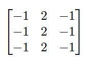
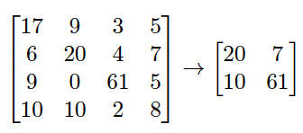
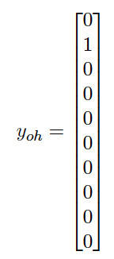

# 卷积神经网络
使用 Python 实现一个对手写数字进行分类的简单网络

**标签:** 人工智能

[原文链接](https://developer.ibm.com/zh/articles/cc-convolutional-neural-network-vision-recognition/)

James Cowley

发布: 2018-05-29

* * *

在日常生活中的某一刻，您可能见过目标识别算法的某种实际应用，它的工作原理是什么？这些计算机视觉解决方案的核心是卷积神经网络 (CNN)，这些网络是特别善于根据不太复杂的特征构建复杂特征的神经网络。

本文将解释这些卷积网络的工作原理。还将展示如何使用 Python 实现一个对手写数字进行分类的简单网络。让我们进入正题！

## 初识神经网络

本文不会详细介绍神经网络的一般工作原理，但您需要有一定的背景知识才能处理卷积网络。神经网络有一种分层架构。每层由一些节点组成，每个节点对一个输入有效执行某种数学运算，通过计算获得一个输出。提供给任何给定节点的输入都是前一层的输出（以及通常等于 1 或 0 的偏置项）的加权总和。算法会在训练期间会学习这些权重。为了学习这些参数，可以将运行一次训练的输出与真实值进行比较，并通过在网络中反向传播错误来更新权重。

## 卷积

卷积是一种数学运算，它采用某种方式将一个函数“应用”到另一个函数。结果可以理解为两个函数的“混合体”。卷积由一个星号 `(*)` 表示，这可能与许多编程语言中通常用于乘法的 \\* 运算符混淆。

不过，这对检测图像中的目标有何帮助？事实证明，卷积非常擅长检测图像中的简单结构，然后结合这些简单特征来构造更复杂的特征。在卷积网络中，会在一系列的层上发生此过程，每层对前一层的输出执行一次卷积。

那么，您会在计算机视觉中使用哪种卷积呢？要理解这一点，首先必须了解图像到底是什么。图像是一种二阶或三阶字节数组，二阶数组包含宽度和高度两个维度，三阶数组有 3 个维度，包括宽度、高度和多个通道。所以灰阶图是二阶的，而 RGB 图是三阶的（包含 3 个通道）。字节的值被简单解释为整数值，描述了必须在相应像素上使用的特定通道数量。所以基本上讲，在处理计算机视觉时，可以将一个图像想象为一个 2D 数字数组（对于 RGB 或 RGBA 图像，可以将它们想象为 3 个或 4 个 2D 数字数组的相互重叠）。

因此，我的卷积获取此数组（我暂时假设该图是灰阶的），并将它与第二个数组（一个过滤器）进行卷积运算。卷积过程如下。首先，将过滤器叠加在图像数组的左上部。接下来，对过滤器及其目前所在的图像子部分执行对应元素乘积。也就是说，将过滤器的左上部元素与图像的左上部元素相乘，依此类推。然后，将这些结果相加来生成一个值。接着，将过滤器在图像上移动一段距离（称为步幅），并重复该过程。此过程的输出是一个具有与图像数组不同维数的新数组（结果通常具有更小的宽度和高度，但包含更多的通道）。为了演示卷积运算的工作原理，让我们来看一个示例。这是一个 3 x 3 过滤器：



我将把这个过滤器应用到下图。


向此图应用了一轮过滤器后，我获得了以下结果。


希望您可以看到，过滤器似乎将各个值垂直排列。这意味着它辨别出了图像中的垂直特征，这一点可以在结果中看到。这是一个在运行 CNN 时学到的过滤器值。

应该注意的是，步幅和过滤器大小是超参数，这意味着模型不会学习它们。所以您必须应用科学思维来确定这些数量中的哪些值最适合您的应用程序。

对于卷积，您需要理解的最后一个概念是填充。如果您的图像无法在整数次内与过滤器拟合（将步幅考虑在内），那么您必须填充图像。可通过两种方式实现此操作：VALID 填充和 SAME 填充。基本上讲，VALID 填充丢弃了图像边缘的所有剩余值。也就是说，如果过滤器为 2 x 2，步幅为 2，图像的宽度为 3，那么 VALID 填充会忽略来自图像的第三列值。SAME 填充向图像边缘添加值（通常为 0）来增加它的维数，直到过滤器能够拟合整数次。这种填充通常以对称方式进行的（也就是说，会尝试在图像的每一边添加相同数量的列/行）。

同样值得注意的是，图像卷积的用途并不仅限于计算机视觉。许多图像过滤技术都可以使用卷积来实现，比如模糊化和锐化。

下面的基本 Python 代码展示了卷积运算的工作原理（您可以让此代码变得更简洁，比如通过使用 numpy）：

```
def basic_conv(image, out, in_width, in_height, out_width, out_height, filter,
filter_dim, stride):
    result_element = 0

    for res_y in range(out_height):
        for res_x in range(out_width):
            for filter_y in range(filter_dim):
                for filter_x in range(filter_dim):
                    image_y = res_y + filter_y
                    image_x = res_x + filter_x
                    result_element += (filter[filter_y][filter_x] *
image[image_y][image_x])

           out[res_y][res_x] = result_element
           result_element = 0
           res_x += (stride - 1)

        res_y += (stride - 1)

    return out

```

Show moreShow more icon

请注意，如果希望将结果写到图像文件中（像我上面那样对它进行可视化），则必须限制输出值，使它们不超过 255。

## 池化层和全连接层

实际的卷积网络很少仅通过卷积层来构建。它们通常还有其他类型的层。最简单的是全连接层。这是一种普通的卷积网络层，其中前一层的所有输出被连接到下一层上的所有节点。通常，这些层位于网络末端。

您会在卷积网络中看到的另一种重要的层是池化层。池化层具有多种形式，但最常用的是最大池化，其中输入矩阵被拆分为相同大小的分段，使用每个分段中的最大值来填充输出矩阵的相应元素。



在上面的代码清单中，输入被拆分为 2 x 2 个象限，并应用了最大池化。因此，我可以将这个特定的操作描述为拥有一个 2 维过滤器且步幅为 2。此过程的作用是辨别出具有某个特征的广泛区域。想象这个网络正在寻找目标对象。在这种情况下，您可以将这次池化的结果解释为，右下部很可能有一个目标，左上部可能有一个目标，右上部或左下部可能没有该目标。

```
def max_pool(input, out, in_width, in_height, out_width, out_height, kernel_dim,
stride):
    max = 0

    for res_y in range(out_height):
        for res_x in range(out_width):
            for kernel_y in range(kernel_dim):
                for kernel_x in range(kernel_dim):
                    in_y = (res_y * stride) + kernel_y
                    in_x = (res_x * stride) + kernel_x

                    if input[in_y][in_x] > max:
                       max = input[in_y][in_x]

           out[res_y][res_x] = max
           max = 0

return out

```

Show moreShow more icon

## 示例背景

现在，让我们通过创建一个识别图像中的手写数字的网络，解决一个简单的计算机视觉问题。这是最常用于展示神经网络强大功能的基准示例之一。该示例是用 Python 编写的，并使用了 TensorFlow 库，所以您不需要过多地关注具体的实现细节，可以更多地关注整体架构。TensorFlow 有另一个优势。它内置了 MNIST 数据集，但应该注意的是，其他机器学习框架（比如 SciKit-Learn）也做到了这一点。

对于训练和测试，我使用这个 [MNIST 数据集](http://yann.lecun.com/exdb/mnist/)。我使用了一个基于 [LeNet-5](http://yann.lecun.com/exdb/publis/pdf/lecun-98.pdf) 的相对简单的卷积网络架构。这个架构在 MNIST 数据集上实现了 0.9% 的错误率，但是我不会实现这一准确率水平，因为我将放弃 LeCun 和其他人执行的许多操作来提高网络性能，而且我还会简化架构的某些方面。

## 架构

我将使用的架构如下所示：

1. 一个卷积层，将 32x32x1 MNIST 图像缩减为一个 28x28x6 输出
2. 一个最大池化层，包含各个特征的宽度和高度
3. 一个卷积层，将维数减少为 10x10x16
4. 一个最大池化层，再一次将宽度和高度减半
5. 一个全连接层，将特征数量从 400 减少到 120
6. 第二个全连接层
7. 最后的全连接层，输出一个大小为 10 的矢量

每个中间层都使用了一个 ReLU 非线性特征，每个卷积层都使用一个步幅为 1 且采用了 VALID 填充的 5×5 过滤器。与此同时，最大池化过滤器的维数为 2。

## 帮助器方法

该代码有多个帮助器方法，抽象化了架构中反复出现的一些细节，比如创建过滤器（每个过滤器为 5×5，但有不同的深度）和卷积层。请注意，我在权重初始化中使用了一种被截断的高斯分布，因为最初的权重无关紧要，只要它们不完全相同即可。这样做是为了破坏对称性。以下代码给出了一个帮助器方法的示例。

```
def make_conv_layer(self, input, in_channels, out_channels):
        layer_weights = self.init_conv_weights(in_channels, out_channels)
        layer_bias = self.make_bias_term(out_channels)
        layer_activations = tf.nn.conv2d(input, layer_weights, strides =
self.conv_strides, padding = self.conv_padding) + layer_bias

        return self.relu(layer_activations)

```

Show moreShow more icon

## 构造网络

抽象化了创建层的具体细节后，网络的构造相对比较简单。

```
def run_network(self, x):
        # Layer 1: convolutional, ReLU nonlinearity, 32x32x1 --> 28x28x6
        c1 = self.make_conv_layer(x, 1, 6)

        # Layer 2: Max Pooling.28x28x6 --> 14x14x6
        p2 = self.make_pool_layer(c1)

        # Layer 3. convolutional, ReLU nonlinearity, 14x14x6 --> 10x10x16
        c3 = self.make_conv_layer(p2, 6, 16)

        # Layer 4.Max Pooling.10x10x16 --> 5x5x16
        p4 = self.make_pool_layer(c3)

        # Flattening the features to be fed into a fully connected layer
        fc5 = self.flatten_input(p4)

        # Layer 5.Fully connected.400 --> 120
        fc5 = self.make_fc_layer(fc5, 400, 120)

        # Layer 6.Fully connected.120 --> 84 fc6 = self.make_fc_layer(fc5, 120, 84) # Layer 7.Fully connected.84 --> 10.Output layer, so no ReLU.
        fc7 = self.make_fc_layer(fc6, 84, 10, True)

        return fc7

```

Show moreShow more icon

## 训练

首先，我将 MNIST 数据集拆分为一个训练集、一个交叉验证集和一个测试集。

```
x_train, y_train, x_valid, y_valid, x_test, y_test = split()

x_train = pad(x_train)
x_valid = pad(x_valid)
x_test = pad(x_test)

x_train_tensor = tf.placeholder(tf.float32, (None, 32, 32, 1))
y_train_tensor = tf.placeholder(tf.int32, (None))
y_train_one_hot = tf.one_hot(y_train_tensor, 10)

```

Show moreShow more icon

训练标签被改良为一个独热矢量。在独热矢量中，每个元素表示一个类，如果示例属于该类，则该元素等于 1，否则等于 0。所以对于一个描绘数字 1 的图像，独热表示为：



我设置了一些操作来定义我将如何训练模型，例如定义我希望在训练期间最小化哪个数量。

```
net = lenet.LeNet5()
logits = net.run_network(x_train_tensor)

learn_rate = 0.001
cross_ent = tf.nn.softmax_cross_entropy_with_logits(logits = logits, labels =
y_train_one_hot)
loss = tf.reduce_mean(cross_ent) # We want to minimise the mean cross entropy
optimisation = tf.train.AdamOptimizer(learning_rate = learn_rate)
train_op = optimisation.minimize(loss)

correct = tf.equal(tf.argmax(logits, 1), tf.argmax(y_train_one_hot, 1))
accuracy = tf.reduce_mean(tf.cast(correct, tf.float32))

```

Show moreShow more icon

我使用交叉熵来度量损耗，并使用 AdamOptimiser 来执行优化。

训练集被拆分为大小为 128 的批次，我对训练运行一定的轮数（在本例中为 10）。每轮运行后，都参照交叉验证集来检查结果权重集。

```
with tf.Session() as sess:
    sess.run(tf.global_variables_initializer())
    example_count = len(x_train)

    for i in range(num_epochs):
        x_train, y_train = shuffle(x_train, y_train)

        for j in range(0, example_count, batch_size):
            batch_end = j + batch_size
            batch_x, batch_y = x_train[j : batch_end], y_train[j : batch_end]
            sess.run(train_op, feed_dict = {x_train_tensor: batch_x,
y_train_tensor: batch_y})

        accuracy_valid = eval(x_valid, y_valid)
        print("Accuracy: {}".format(accuracy_valid))
        print()

    save.save(sess, "SavedModel/Saved")

```

Show moreShow more icon

然后保存结果模型，供以后在测试集上使用。

## 性能

针对测试集而运行时，该模型获得了 98.5% 的准确率（1.5% 的错误率）。由于数据准备等方面的差异，此性能稍微低于 LeCun 的实现。但是，对于像我这样的相对简单的实现而言，这已是非常高的性能。

## 结束语

在本文中，您学习了卷积神经网络的基础知识，包括卷积过程本身、最大池化和全连接层。然后，您了解了一种相对简单的 CNN 架构实现。希望这会在您工作中使用 CNN 时帮助您理解它们，或者帮助您踏上这个令人神往的机器学习分支的学习之旅。

本文翻译自： [Convolutional neural networks](https://developer.ibm.com/articles/cc-convolutional-neural-network-vision-recognition/)（2018-05-02）