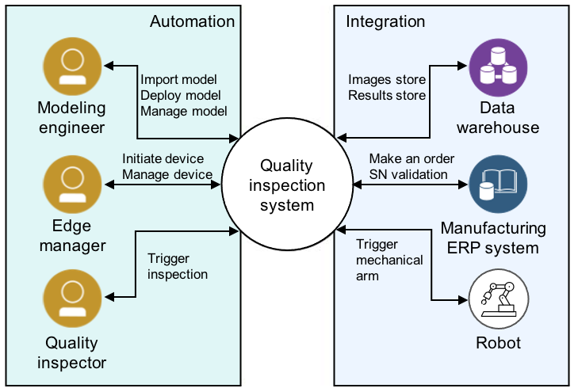
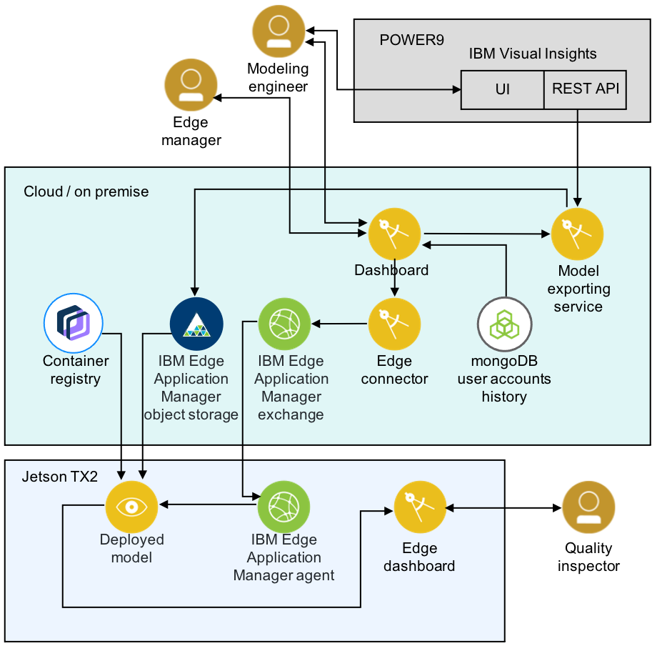

# 启用分布式 AI 以通过边缘计算在制造业中进行质量检验
将经过训练的模型部署到边缘，以延长模型运行时间并简化推理过程

**标签:** IBM Edge Application Manager,IBM Maximo,IBM Maximo Visual Inspection,IBM Power Systems,Open Horizon,人工智能,深度学习,系统,边缘计算

[原文链接](https://developer.ibm.com/zh/articles/enabling-distributed-ai-with-edge-computing/)

Christine Ouyang, Feng Xue, Igor Khapov

发布: 2020-12-15

* * *

**_为解决产品名称更改问题，我们已经更新了这篇文章，并且包含了更新后的链接。_**

实施 AI 技术辅助的质量检验系统可以显著加快检验周期和提高检验准确性。然而，管理和支持成千上万的摄像头、机械臂和机器人可能是一项挑战。制造业中的 AI 技术辅助质量检验系统需要使用边缘计算解决方案。

[边缘计算](https://www.ibm.com/cn-zh/cloud/what-is-edge-computing) 解决方案使 AI 和分析工作负载能够更接近创建数据和执行操作的位置。在实际的制造生产环境中实施和部署 AI 技术辅助的质量检验系统时，边缘计算解决方案可以有效且安全地将经过训练的模型部署到边缘设备、管理模型和这些边缘设备的生命周期，并在不再需要边缘数据之后将其归档。

在本文中，我们将介绍技术堆栈（本质上是 Maximo Visual Inspection 和 IBM Edge Application Manager），企业可以使用该技术堆栈将经过训练的模型部署到边缘，让他们的团队能够有效延长模型运行时间，简化制造业中的质量检验验证过程。一种边缘计算方法经过很少的更改就能应用于不同的用例。

这是我们正在制造业中实施的真正解决方案，旨在利用 AI 提高质量检验水平。通过开发连接两种领先的 AI 和边缘产品的服务，我们能够提出一个重要而实用的解决方案，可以将其运用到生产领域，同时在 IBM Cloud 中运行所有服务。我们也在使用自己销售的产品！

## 质量检验系统的高级架构

2018 年，IBM Systems 供应链成功地在本地采用了 IBM Maximo Visual Inspection，用于在大型机、IBM Power Systems™ 和 IBM 存储系统的 IBM 系统硬件制造中进行质量检验。由 Maximo Visual Inspection（以前称为 IBM PowerAI Vision）训练的模型已用于生产级质量检验，从而提高了效率和质量保证。因此，Maximo Visual Inspection 在我们的质量检验系统中起着核心作用。

图 1 中的关系图显示了最终质量检验系统的预期功能。

##### 图 1\. 质量检验系统的环境关系图

在质量检验系统中：

- 在自动化检验过程中，我们拥有不同的角色：

    - 建模工程师导入、部署和管理模型
    - 边缘管理者启动设备，并管理用于推理的设备
    - 质量检验员在执行实际视觉检查的地方触发质量检验
- 质量检验系统与特定制造流程集成：

    - 图像和结果存储在数据仓库中
    - 制造业 ERP 系统生成订单并验证序列号
    - 触发机械臂以完成质量检验

## 边缘计算解决方案的技术堆栈

我们的边缘计算解决方案的架构是基于 [IBM Cloud Architecture for Edge Computing](https://www.ibm.com/cloud/architecture/architectures/edge-computing/reference-architecture)。企业可以将我们的边缘计算解决方案部署到云端或本地。所有组件都可以扩展，以支持具有不同类型模型的多个边缘节点。在该解决方案中，我们使用了 [Faster R-CNN](https://www.ibm.com/support/knowledgecenter/SSRU69_1.3.0/base/vision_model_types_functions.html) 模型来显示对象检测功能。

要开发用于高度复杂的计算硬件制造环境的质量检验系统，制造车间的实际边缘部署就需要包含以下特性：

- **高可用性**：由于质量检验是将产品交付给客户前的最后一关，因此系统可用性将直接影响发货进度，进而影响收入。系统必须保证 7×24 小时可用和最短的维护间隔。
- **用户认证和授权**：制造业质量管理系统有一个重要特征，即只有经过授权和培训的操作人员才能执行质量检验。因此，需要进行用户认证和授权（针对不同的用户角色）。此外，用户认证具有链接到企业用户目录的优势。
- **可扩展性和性能**：由于制造运营可能跨越多个地区，因此需要将该系统广泛部署到许多地点的制造工厂。质量检验系统应具有易于扩展的能力，即通过在本地或云端添加 IBM Maximo Visual Inspection 实例，也可以通过添加边缘设备来实现扩展。性能（例如速度、异常处理等）是为全球用户提供支持必须考虑的因素。
- **模型管理和设备管理**：部署后，AI 模型和设备的生命周期管理对于运营至关重要。用户需要一种简单有效的方法来管理生产中使用的 AI 模型版本。边缘设备的监控与恢复对于最大程度降低生产计划的中断也很重要。

图 2 显示了我们用于构建模型管理系统的架构。

##### 图 2\. IBM Edge Computing 解决方案架构

该架构包含以下三个主要部分：

- 用于模型训练的 Maximo Visual Inspection
- 用于集中控制和管理的云或本地应用程序堆栈，包括 IBM Edge Application Manager
- 一个 [NVIDIA Jetson TX2](https://developer.nvidia.com/embedded/jetson-tx2)，作为用于质量检验的边缘节点设备

可实现最佳自动化质量检验的模型训练主要流程是：

1. 建模工程师使用 Maximo Visual Inspection 训练对象检测模型。
2. 建模工程师在主仪表板中启动模型导出功能（在认证过程之后）。
3. 仪表板通过指定为模型缓存的存储来调用模型导出服务。
4. 模型导出服务与 Maximo Visual Inspection 的 REST API 通信以下载该模型。
5. 模型导出服务将模型从 Open Horizon Model Management Service (MMS) 存储到边缘 IBM Edge Application Manager 对象存储。
6. 建模工程师使用主仪表板启动对指定边缘节点的模型部署。
7. 主仪表板与边缘连接器通信，该边缘连接器负责与 Open Horizon 交换机 REST API 协同工作。
8. 边缘连接器使用 IBM Edge Application Manager 交换机 REST API 启动模式部署。
9. IBM Edge Application Manager 代理从 IBM Edge Application Manager 交换机接收配置，以便部署具有特定模型的新容器
10. IBM Edge Application Manager 代理使用我们开发的 IBM Edge Computing 服务启动 Docker 容器。
11. IBM Edge Application Manager 服务从 IBM Edge Application Manager 对象存储中下载模型内容
12. Docker 下载所需的 Docker 镜像，它代表模型的运行时。
13. Docker 使用 REST API 启动模型。
14. 质量检验员使用边缘仪表板分析产品照片。
15. 在边缘仪表板中，用户使用已部署模型的 REST API 启动质量检验，并显示结果，从而实现检验过程自动化。

## 为何选择 Maximo Visual Inspection？

Maximo Visual Inspection 可用于模型训练是因为其显著的速度优势。在本地安装时，可以实现以下优势：

- 每个产品的手动目测检查时间从 10 分钟缩短到 1 分钟
- 减少现场问题并提高客户满意度
- 大规模模型生命周期管理
- 大规模边缘设备生命周期管理（包括设备设置、监控和恢复）
- 边缘数据存档
- GPU 使用率和模型训练与推理的分离，以便提高资源利用率
- 将质量检验员、建模工程师和边缘管理者角色的职责分离

Maximo Visual Inspection 集成了 [REST API](https://www.ibm.com/support/knowledgecenter/en/SSRU69_1.1.3/base/vision_api.html)，目的是实现训练、再训练和模型导出的自动化。它提供一套用于标记、训练和部署深度学习视觉模型的直观工具集，使企业用户在无需具备编码和深度学习专业知识的前提下，能够轻松使用具有深度学习能力的计算机视觉。Maximo Visual Inspection 包含最流行的深度学习框架及其依赖项。它专为轻松快速部署而设计，从而提高生产效率。通过将 Maximo Visual Inspection 软件与 IBM Power Systems 结合使用，企业可以快速部署具有完全优化且受支持的平台，提高性能。您可以在 [IBM Knowledge Center](https://www.ibm.com/support/knowledgecenter/en/SSRU69_1.1.0/base/vision_overview.htm) 内的文档中阅读有关 Maximo Visual Inspection 的更多信息。

## 为何选择 IBM Edge Application Manager

我们开发的 IBM Edge Computing 服务可用于管理分布式节点，也可以用于交付、更新和移除质量检验模型。IBM Edge Application Manager 为用户提供了一个用于管理节点的新架构。它专门用于最大程度地降低部署全局或本地边缘节点群时固有的风险。用户还可以使用 IBM Edge Application Manager 完全自主地管理边缘节点上的服务软件生命周期。更具体地说，IBM Edge Application Manager 通过同步服务支持模型管理。它改进了模型和元数据包的存储、交付和安全性。您可以在 [IBM Knowledge Center](https://www.ibm.com/support/knowledgecenter/SSFKVV_4.1/kc_welcome_containers.html) 内的文档中阅读有关 IBM Edge Application Manager 的更多信息。

## 结束语

在本文中，我们介绍了在制造业环境中实施 AI 技术辅助的质量检验系统的背景和业务挑战。我们还讲解了利用 IBM Edge Computing 平台实施的边缘计算解决方案的整体架构，同时，我们分享了如何使用 Open Horizon Model Management Service 启用从 Maximo Visual Inspection 中提取模型并将模型部署到边缘的功能。

在今后的文章中，我们将阐述如何配置 NVIDIA Jetson TX2 以及如何使用 Edge Fabric CLI 和 REST API。我们可能还会分享模型生命周期管理、边缘设备管理、边缘数据实现和安全性方面的工作。

### 致谢

感谢 Ekaterina Krivtsova、Dmitry Gorbachev、Charisse Lu 和 Thomas Cook 对本文提出意见和进行评审。

本文翻译自： [Enabling distributed AI for quality inspection in manufacturing with edge computing](https://developer.ibm.com/articles/enabling-distributed-ai-with-edge-computing/)（2020-11-17）