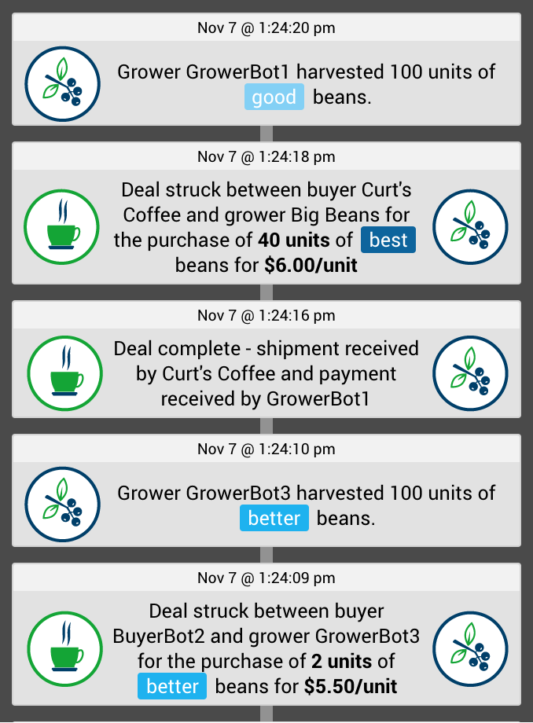
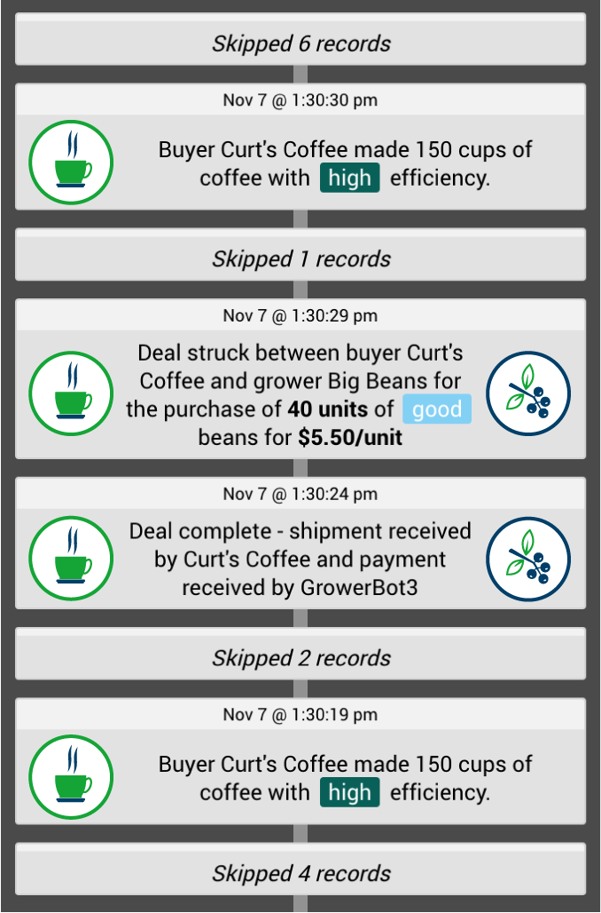
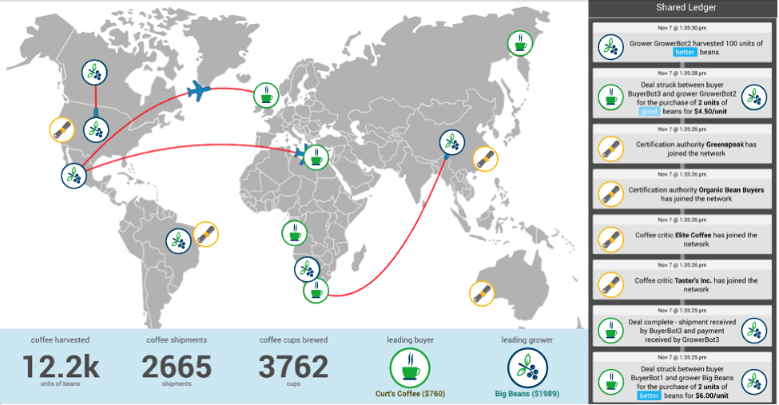

# 咖啡与区块链：摒弃夸大宣传
关于区块链技术如何为全球咖啡贸易提供服务的完美介绍

**标签:** 区块链

[原文链接](https://developer.ibm.com/zh/articles/cl-coffee-with-blockchain-introduction-to-how-blockchain-works/)

Ann Ewan, Curtis Miles

发布: 2018-04-03

* * *

区块链是一种在网络参与者之间交换货物、服务和信息的安全途径。通过使用一个实际示例（全球咖啡贸易），我们将解释区块链的核心概念：自动执行参与者商定的业务逻辑的 _智能合约_，以及有助于保证货物或服务的质量和沿袭的 _共享分布式账本_。我们还将说明区块链如何支持协作并鼓励采用全新业务模式。

表明区块链将改变世界的文章非常之多，每个人一定都读过这样的文章，但这些文章很少会准确解释这一切将会如何发生。本文填补了这方面的一些不足，帮助您了解区块链的基本原理。

在世界各地，企业及组织彼此之间的联系日益密切。他们需要值得信赖的伙伴关系才能取得成功，但每个组织都有自己的利益相关方、目的和业务目标。区块链为交换货物、服务和信息提供了一种安全途径。它将所涉组织之间的必要信任外部化，并捕获组织用于开展业务的可执行规则（在区块链上称为 _智能合约_）。通过这种方法，没有哪一个组织有权单方面更改这些规则。

获取最佳免费工具、培训和社区资源的每月集萃，帮助您开始使用区块链。

**[最新一期](http://ibm.biz/blockchain-newsletter)** \| **[订阅](http://ibm.biz/blockchain-newsletter-signup)**

这些外部化的可信交易支持新的全球网络，并且推动采用新的业务模式。在任何行业中，产生摩擦或机遇的关键点都是试点区块链技术的理想场所。区块链技术无需信任机制，即可将先前很难甚至无法协作的新组织聚集在一起。

让我们来看看全球咖啡贸易如何在以下关键领域体现区块链的价值：

- **通过智能合约实现自动化和信任**

    区块链可通过自动执行参与者商定的业务逻辑来减少摩擦并提高效率。

- **可证明性**

    区块链可以通过不可改变的共享分类账保证货物或服务的质量和沿袭。

- **隐私性**

    参与者可以查看与他们在网络中的角色相对应的事务。

- **全新业务模式**

    不同类型的新参与者可以加入网络，并创造价值和新的可能性。

现在就去拿一杯咖啡吧，因为在本教程结束时，您将有机会参与 Curtis 用来解释这些概念的 [轮到您了！参与互动演示](#轮到您了！参与互动演示)！

## 业务网络

购买和销售咖啡豆的功能性业务网络可能如以下地图所示：

地图上的咖啡植物图标表示咖啡豆种植者，他们付钱请工人来收获咖啡豆，并通过销售咖啡豆来赚钱。咖啡杯图标表示咖啡豆的买家，他们购买咖啡豆，并通过将咖啡豆加工成一杯杯的咖啡供客户享用来赚钱。每架飞机都表示已经订购并正在运送的一批咖啡。

假设您是咖啡豆的买家 Curt’s Coffee。您从微薄的盈利起步，起初少量库存了质量佳、更佳及最佳这三种等级的咖啡豆。作为买家，您通过将咖啡豆加工成一杯杯的咖啡并售卖给客户来赚钱。您的效率及所用咖啡豆的质量决定了您赚取多少利润。

在调制咖啡并赚钱之后，您发现自己已经用完了所有最佳质量的咖啡豆。必须补货才能调制出更多“最佳”咖啡；毕竟，相比其他类型的咖啡豆，从“最佳”咖啡豆加工出来的每一杯咖啡带来的利润更多。但首先，您必须找到一家咖啡豆供应商。

在没有区块链的世界中，您需要采用一种机制来寻找一位咖啡豆种植者，他愿意以有利于您的条款向您销售所需质量的咖啡豆。找到种植者之后，您必须协商咖啡豆的价格、数量和质量。供应商可能会承诺为您提供最佳质量的咖啡豆，但您无法获得任何保证。您可能会因为不太了解他们而无法信任他们。

## 通过智能合约实现自动化和信任

这就是区块链的用途所在。区块链可以通过自动执行参与者商定的业务逻辑，减少买卖双方之间的摩擦并提高效率。

有了区块链，您和供应商就能够使用智能合约，拟定达成一致的条款和条件，以此约束咖啡豆交易。智能合约是一种计算机协议，旨在促进、验证或执行合同的谈判或履行。每个区块链用户都具有不同的用户体验，通常采用网络或移动应用形式，旨在促进他们履行各自在网络中的角色。

在该咖啡示例中，通过使用移动应用，您请求使用智能合约来购买咖啡豆。您可以设置智能合约的条款，选择想要购买的咖啡豆的质量（最佳）、购买数量（40 个单位），以及愿意接受的价格范围（任何地区每单位最高 7 美元）。当您提交智能合约时，它就会在网络中注册，并且区块链逻辑会尝试将您与接受您的条款和条件的种植者相匹配。

合同增加了参与者之间的信任水平，因为它是组织参与业务网络中咖啡豆买卖的唯一机制，没有任何组织能够单方面改变智能合约中编码的业务规则并确定如何完成交易。当组织加入业务网络时，他们会看到智能合约是如何编写的，因此起初就可以决定是否要参与。

假设一家名为 Big Beans 的公司接受了您的报价。他们根据您的需要向您运送 40 个单位，每单位 6 美元，这低于您的最高价格，当然也必须高于他们的最低价格。已完成的交易会记录在您的购买历史记录中。

您立即与下一个种植者开始交易。当您为另一批咖啡豆付款时，咖啡豆的数量增加，您的利润就会下降。您需要调制更多咖啡来保持盈利。

如果您想随时撤销智能合约，因为已经有了足够的最佳质量的咖啡豆，那么就可以执行此操作。否则，该特定网络中的智能合约将会一直为您寻找匹配项。

## 可证明性

咖啡业务网络是一个全球网络，因此在全球范围内进行交易。买家和卖家之间正在建立联系。在此业务网络内执行的每个事务都会记录在共享分类账上，准确副本由整个网络中的参与者来维护，并通过区块链平台自动保持同步。

下图描绘了网络共享分类账可能捕获的一些记录。您可以看到有关正在捕获事务的大量详细信息。

由于分类账是不可改变的，因此参与者可以追溯一批咖啡豆的具体来源，并保证咖啡豆的质量。例如，在您的事务中，共享分类账会记录“买方 Curt’s Coffee 向种植者 Big Beans 以$ 6.00 /单位的价格购买40单位的最佳豆”。稍后，它会记录“交易完成 – Curt’s Coffee 收到货物并由 Big Beans 收到付款”。

务必要知道的是，上一张分类账视图代表了全球咖啡监管机构（如果存在这样的组织）将具有的可见性水平。在业务网络中履行监管职责的组织机构通常需要查看业务网络中的所有不同参与者和事务，确保每个人都遵守规则。

如果没有区块链，该监管机构将会收集所有参与者的全部活动报告，可能会在每个月末开始收集，然后进行取证分析，从该月发生的一堆混乱事务中理清头绪，并希望查明是否有人为了让自己看起来更好（或变得更富有）而试图隐匿某种事实。

相比之下，采用区块链后，根据区块链的属性，对于分布式账本中捕获的每个业务事务（个别副本托管在整个业务网络中），此网络中的任何个人都不能更改网络上的记录。围绕分类账上的每一条记录，各方都达成了共识。业务网络中的每个人都知道他们可以信任分类账中的数据，监管机构也可以依赖这一最新信息提供业务网络状态的可视性。

## 隐私性

查看分类账上的事务中包含的信息时会发现，此处捕获的数据显然十分敏感，包括购买多少咖啡豆、购买和销售价格及数量等等。对于所做的交易以及愿意支付的价格，您可能并不希望竞争对手知道此类信息。尽管全球咖啡监管机构（如果有的话）需要能够透过网络了解这些详细信息，但您需要考虑隐私，确保竞争对手无权访问该敏感信息。

具体而言，网络上的每个买方和卖方只能看到他们作为利益相关方所牵涉的事务，并且会防止每个买方和卖方未经授权即访问他人的敏感信息。下图显示了您作为 Curt’s Coffee 可能会看到的共享分类账的有限视图。

当您加入该业务网络时，可能会经历一个接纳过程。此流程因每个业务网络而异，您可能必须接受一些业务条款和条件方才可加入网络。一旦接受您进入此网络，就会为您提供一系列证书和密钥，授予您在网络中的身份，并使您能够解密和查看共享分类账中的某些领域和某些部分的信息。最重要的是，您只能看到与自己有关的记录。例如，每次调制咖啡时，它都会在此显示。您可以查看与之交易的某个种植者的历史记录并追溯记录，了解运送给您的咖啡豆的质量及其收获时间。

业务网络中的许多参与者都在本地数据库中具有共享分类账的副本，并且分类账的分布式部分会使它们全部保持同步。您的数据库可能只包含分类账中与您有关的记录，也可能包含所有内容，具体取决于您的设置方式。您可能希望与某个人建立私人分类账，只有你们两个人可以看到这些事务。您也可能希望在数据库中拥有整个共享分类账，不允许您查看的部分则使用密码进行保护。参与者可以根据他们在网络中的角色查看与之相关的事务。

不想自行托管分类账副本的组织可以通过分类账托管组织公开的 API 来访问业务网络。分类账托管组织可能会对此服务收费，这即是区块链提供的额外收入和业务模式机会。

## 全新业务模式

关于区块链，值得注意的一点是，您可以做一些以前根本无法做到的新事情。区块链可催生全新业务模式。

例如，您可以将新类型的参与者引入业务网络。在咖啡示例中，让我们引入“证书组织”，这些组织会分析种植者或买家的做法，如果他们符合组织的标准，就会为其加盖批准印章。在地图上，这些组织由看似卷起来的文档图标来表示。

检查共享分类账后，您将看到这些新参与者加入网络的情况已被记录下来。例如，“认证机构 Organic Bean Buyers 已加入该网络”和“咖啡评论家 Taster’s Inc. 已加入该网络”。网络上的其他人都可以使用和查看该信息。

就种植者而言，认证机构可能是一个环保组织或公平贸易实践组织，它可以介入进来，评估种植者是否遵守最新的环境标准，或者确定种植者是否在销售公平贸易咖啡。种植者可以申请认证，如果申请成功，就可以通过证明他们已获环保认证或者已获得销售公平贸易咖啡的认证来吸引更多的买家。没有人必须听信其言，因为他们可以看到一个受尊重的认证机构在分类账上以防篡改且不可变的方式加盖了批准印章，种植者无法更改这一信息。

就买家而言，买家将咖啡豆加工成一杯杯的咖啡供客户享用，此时的认证可能看起来更像是有一位美食鉴赏家来保证您能够享用上乘的咖啡。赢得好评可能会增加咖啡的售价，如果您能证明公众信任的咖啡鉴赏家给予您好评，效果尤为明显。您可以使用区块链来展示这一证明，因为您无法篡改分类账来人为地虚假制造好评。

每一次的认证尝试都可以记录在分类账上，这样其他人就可以看到您在获得认证之前尝试了多少次。一旦获得认证，分类账就会根据该认证机构的认证情况，记录您现在供应上乘咖啡的证明，这样您就可以信心满满地向客户销售咖啡，并表明自己销售的是高品质的咖啡。下一次调制咖啡时，您就会获得更多利润，因为您获得了认证，并且每杯咖啡的价钱也上涨了。

## 结论

区块链主要是通过提升组织之间的整体信任度，帮助业务网络减少摩擦。网络参与者可以相信他们已经商定且不能单方面更改的智能合约必将有效执行。完成事务时所采用的业务规则和业务逻辑不仅具有可视性，还具有透明性。区块链可以为监管机构和需要它的其他参与者提供透明性，同时仍然为各种不同类型的参与者提供相关分类账的隐私性和特定视图。

既然您已经了解了基于区块链的业务网络的价值，可能就会发现商机。也许您已经加入了具有参与者和事务且需要建立信任的业务网络。也许现有的区块链网络正在形成，您可能会加入这一网络，但更有可能的是，您或许有机会将其他几个组织聚集在一起，成为全新业务网络的创始人。

成为网络创始人能够获益匪浅，因为您可以决定谁可以加入，以及他们需要满足哪些条件才能加入您的业务网络。但是，您也有责任建立一个人们希望加入的业务网络，为他们提供激励措施，确保他们加入后能获得收益。样本咖啡业务网络可以由一群主要的买家和种植者来建立，也可以由一系列相关政府机构来建立，这些机构寻求改善咖啡行业的运营方式，希望造福于所有相关方。可能性简直无穷无尽！

## 轮到您了！参与互动演示

既然您已经充分掌握了区块链的基本原理，就请观看 [Curtis 的互动演示](http://v.youku.com/v_show/id_XMzUxMzkyMjIwMA==.html)，您可以参与模拟的国际咖啡生产和采购业务网络！

本文翻译自： [Coffee with Blockchain: Filtering out the hype](https://developer.ibm.com/articles/cl-coffee-with-blockchain-introduction-to-how-blockchain-works/)（2018-01-16）