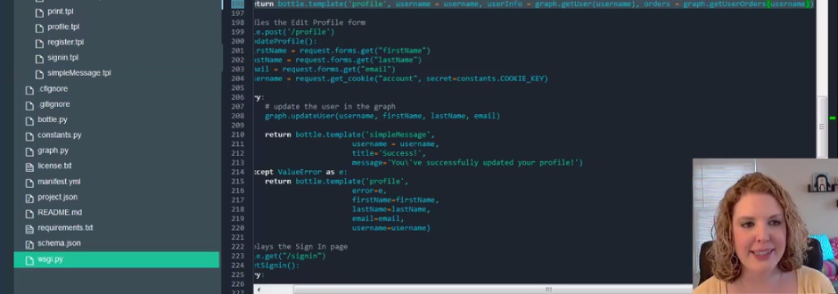
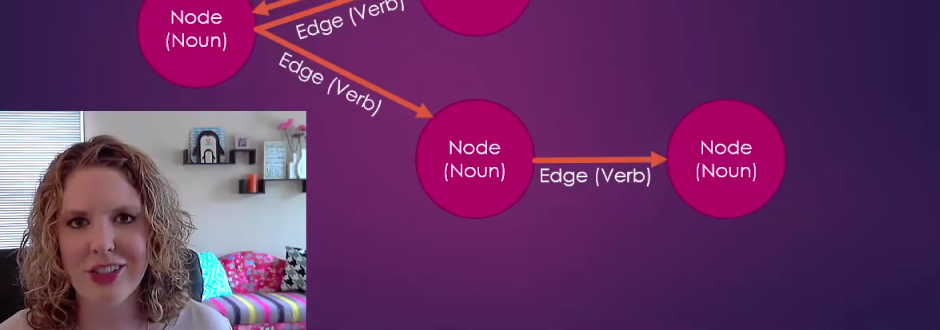

# 图形数据库与 CRUD 操作
有关图形数据库常见问题

**标签:** 云计算,数据库

[原文链接](https://developer.ibm.com/zh/articles/cl-graph-database-1/)

Lauren Schaefer

发布: 2017-03-15

* * *

**图形数据库入门介绍：CRUD 操作**



[点击查看视频演示](https://v.youku.com/v_show/id_XMjY0MDE1NDE2MA==.html)

如果您不熟悉图形数据库，使用它可能有点困难。任何学习过图论课程的人可能都会证实这个科目非常复杂。但不要因为您的图论经历（或缺乏相关经历）而对图形数据库避而远之。事实上，在使用完全托管的图形数据库 即服务时，您会获得图形数据库给您带来的所有好处，而不会牵涉到任何复杂性。

那么我提到的好处有哪些呢？图形数据库允许您对数据及数据之间的关系进行建模，就像它们存在于现实中一样；您不需要将数据抽象到表中，并使用键和联接 (join) 的组合来表示各种关系。此外，图形数据库允许您轻松地遍历图形（按照数据之间的联系），而无需执行昂贵的联接来将数据集中起来。

[Apache TinkerPop](https://tinkerpop.apache.org/) 是一个流行的开源图形计算框架。TinkerPop 的用户利用图形遍历语言 [Gremlin](http://tinkerpop.apache.org/gremlin.html) 来与他们的图形进行交互。使用 TinkerPop 创建图形需要执行大量设置，所以我们将使用 IBM Graph（可将它视为 TinkerPop 即服务）轻松快速地创建我们的图形。 [IBM Graph](https://www.ibm.com/us-en/marketplace/graph) 是一个易于使用、完全托管的图形数据库即服务，它支持企业应用程序，且构建于 TinkerPop 之上。

在本教程中，您将找到有关图形数据库常见问题的答案，比如它们是什么，以及为什么应该关注它们。然后，将通过分析 Lauren’s Lovely Landscapes 应用程序的代码，学习如何使用图形遍历语言 Gremlin 来执行 CRUD（创建、读取、更新和删除）操作。随后，将会实现一个允许最终用户查看其订单的新功能。请随时关注第 2 部分，届时您将探索图形数据库的一个最流行的用例：推荐引擎。

## 图形数据库基础

如果您不熟悉图形数据库，可能对它有许多疑问：

- 图形数据库是什么？
- 如何在图形数据库中为数据建模？
- 图形数据库有哪些常见用例？

视频 “图形数据库的基础疑问解答” 回答了这些及其他问题。所以请坐下来，轻松愉快地观看该视频。

**图形数据库的基础疑问解答**



[点击查看视频演示](https://v.youku.com/v_show/id_XMjY0MDE1NTY3Ng==.html)

### 应用程序简介

在本教程中，将使用一个名为 Lauren’s Lovely Landscapes 的示例在线商店，它允许您浏览并购买印刷品。  页面包含有关如何构建该应用程序的信息，以及可供您用来插入和删除示例数据的链接。

**注意** ：本教程使用了 Lauren’s Lovely Landscapes 的第 2 版。如果您拥有来自其他教程的旧版本，请获取新的版本。


[浏览代码](https://cloud.ibm.com/devops/try-toolchains?cm_sp=ibmdev-_-developer-articles-_-cloudreg)

## 您需要做的准备工作

开始之前，您需要在 IBM Cloud 上进行注册。还需要以下浏览器之一的最新版本：

- Chrome
- Firefox
- Internet Explorer
- Safari

### 部署应用程序

要完成本教程，您需要拥有自己的代码副本来进行编辑和部署。完成此任务的最简单方法是将应用程序部署到 IBM Cloud，无需在您的机器上安装任何东西。有关更多信息，请观看视频 [将 IBM Graph 应用程序部署到 IBM Cloud](http://v.youku.com/v_show/id_XMjY0MDE1ODEyOA==.html?f=49218204&o=1&spm=a2h1n.8251843.playList.5!3~5~A) 。

要部署该应用程序：

1. 部署到 IBM Cloud。
2. 如果尚未在 IBM Cloud 上进行身份验证，系统可能会提示您这么做。
3. 在启用 **Deploy** 按钮时单击它。
4. 等待部署完成。这可能会花几分钟的时间。在此期间，IBM Cloud 将创建一个可供您跟踪和计划的新项目，将代码副本存储在新项目中，创建一个交付管道供您配置自动部署，在 IBM Cloud 上创建一个 IBM Graph 实例，并将应用程序部署到 IBM Cloud，以便您可以看到它在持续运行。
5. 单击 **VIEW YOUR APP** 查看部署的应用程序版本。
6. 主页显示，目前没有可供销售的印刷品。单击  ，然后单击 **Insert the sample data** 。插入数据可能会花一两分钟的时间。
7. 当应用程序指示示例数据已创建时，单击顶部导航栏中的 **Lauren’s Lovely Landscapes** 。
8. 可以注意到主页上列出了印刷品。您的应用程序已成功部署！

花几分钟浏览该应用程序。注册为新用户并订购一种印刷品。导航到  页面，查看模式图以及图形中存储的数据。

## 浏览代码和现有 CRUD 操作

在本节中，将分析 Lauren’s Lovely Landscapes 背后的代码，查看该应用程序如何执行 CRUD（创建、读取、更新和删除）操作。正如在下面将会看到的，该应用程序使用图形遍历语言 [Gremlin](http://tinkerpop.apache.org/gremlin.html) 通过 POST 操作向 Gremlin API 发出查询，告诉 Graph 要创建、读取、更新和删除的对象。

**奖励** ：要查看该应用程序如何使用 Graph API 来创建模式和索引，请观看 [创建和遍历 IBM Graph 数据库](http://v.youku.com/v_show/id_XMjY0MDE2MDE2NA==.html?f=49218204&o=1&spm=a2h1n.8251843.playList.5!4~5~A) 。

#### 打开代码

将应用程序部署到 IBM Cloud 后，会自动将 Lauren’s Lovely Landscapes 代码的副本放入一个项目中。在本节中，将在 IBM Cloud Web IDE 中打开该代码，然后就可以在以下各节中浏览该代码：

1. 导航到 [IBM Cloud](https://cloud.ibm.com/?cm_sp=ibmdev-_-developer-articles-_-cloudreg)。
2. 登录（如果还未经过身份验证）。
3. 在应用程序仪表板上，找到包含 Lauren’s Lovely Landscapes 应用程序的行并单击它。

    提示：确保单击了该应用程序的名称，而不是路径。

4. 应用程序页面将在 IBM Cloud 中打开。
5. 向下滚动，直到看到 **持续交付** 选项卡。
6. 单击 **编辑代码** 按钮。这会将打开 Web IDE，其中包含您的项目的代码。

#### 会话 API

要向 Graph API 发送请求，需要进行身份验证。一个选择是在每个请求中发送您的凭证。更好、更快的选择是使用会话 API 生成唯一的会话令牌，供您在以后的请求中用作身份验证形式。

Lauren’s Lovely Landscapes 使用了后一种生成唯一会话令牌的方式。让我们来研究一下：

1. 在 Web IDE 的文件导航窗格中，单击 **constants.py** 打开它。
2. 请注意，第 23 到 31 行之间的代码访问了 VCAP _SERVICES 中存储的凭证，以便从 [IBM Cloud]( [https://cloud.ibm.com/?cm\_sp=ibmdev-](https://cloud.ibm.com/?cm_sp=ibmdev-)_-developer-articles-\_-cloudreg) 中获取 apiURL、用户名和密码。这些凭证以后可用于执行身份验证和获取您的会话令牌。

    **提示** ：如果选择将应用程序部署到本地而不是 [IBM Cloud](https://cloud.ibm.com/?cm_sp=ibmdev-_-developer-articles-_-cloudreg)，可执行第 11 行的代码中的指令来手动设置 API\_URL、USERNAME 和 PASSWORD。

3. 在 Web IDE 的文件导航窗格中，单击 **graph.py** 打开它。
4. 在 **graph.py** 中，找到第 400 行上的 **updateToken()** 函数。此函数向会话 API 发出一个请求，要求发送在 **constants.py** 中获得的用户名和密码。来自会话 API 的响应包括以后发送到 Graph API 的请求中执行身份验证所需的唯一令牌。该函数将该令牌添加到数据头中。请注意，这是唯一一个使用 `constants.USERNAME` 和 `constants.PASSWORD` 的函数。其他所有调用都使用唯一会话令牌。
5. 仍在 **graphy.py** 中，找到第 11 行上的 **post()** 函数和第 19 行上的 **get()** 函数。这些函数将处理对 Graph API 的 GET 和 POST 请求。请注意，如果这些函数收到 401 错误响应（由于令牌过期）或 403 错误响应（由于凭证失效），它们会自动发出更新令牌的请求。
6. 仍在 **graphy.py** 中，找到第 27 行上的 **getAllPrints()** 函数。此函数将获取存储在图形中的所有印刷品。请注意，此函数（与此文件中向 Graph API 发出 GET 请求的所有其他函数一样）调用了我们刚刚探讨过的 **post()** 函数。 **getAllPrints()** 函数不关心身份验证或标头；它只关心 API 调用和响应。

有关会话 API 的更多信息，请参阅 [IBM Graph 文档](https://ibm-graph-docs.ng.bluemix.net/api.html) 。

#### 创建

您现在已了解了 API 调用如何使用唯一会话令牌执行身份验证。是时候做点有趣的事情了：CRUD 操作从创建开始。以下说明可以帮助您了解在用户注册时，该应用程序如何在图形中创建一个新顶点。有关更多信息，请观看视频 [在 IBM Graph 中创建数据元素](http://v.youku.com/v_show/id_XMjY0MDE2MTM2MA==.html?f=49218204&o=1&spm=a2h1n.8251843.playList.5!5~5~A) 。

1. 观察下面的模式图。要处理用户注册，可以创建一个包含以下属性的新用户 **顶点** ： **firstName** 、 **lastName** 、 **username** 和 **email** 。

    [模式图](https://s3.us.cloud-object-storage.appdomain.cloud/developer/default/articles/cl-graph-database-1/images/image002.png)

2. 接下来，在新浏览器选项卡或窗口中为您的图形实例打开 Graph Query Editor：

    1. 导航到 [IBM Cloud](https://cloud.ibm.com/?cm_sp=ibmdev-_-developer-articles-_-cloudreg)。
    2. 在仪表板上，向下滚动到 All Services 部分并单击 **LaurensLovelyLandscapesSample-Graph** 。
    3. 在 Manage 选项卡上（默认已打开），单击 **Open** 。这将为您的图形实例打开 Graph Query Editor。
3. 默认情况下，已选择 **g** 图形。通过单击顶部导航菜单中的 **g** 旁边的向下箭头，然后单击 **landscapes\_graph** ，切换到存储您的数据的 **landscapes\_graph** 。

    [IBM Cloud 接口 landscapes\_graph](https://s3.us.cloud-object-storage.appdomain.cloud/developer/default/articles/cl-graph-database-1/images/image003.png)

4. 要创建一个新用户，可编写一个 Gremlin 查询，其中包含模式图中所示的每个属性的示例数据： **label** 、 **firstName** 、 **lastName** 、 **username** 和 **email** 。包含属性 **type** 及关联值 **user** ，就可以搜索类型为 **user** 的顶点。在 Query Execution Box 中，键入下面的 Gremlin 查询：

    `def gt = graph.traversal(); gt.addV(label, 'user', 'firstName', 'Lauren', 'lastName', 'Schaefer', 'username', 'lauren', 'email', 'lauren@example.com', 'type', 'user');`

5. 单击 Submit Query 按钮。
6. 查询结果会显示在一个新窗口中。浏览 JSON 结果。请注意，我们在查询中已使用指定的属性创建了一个新顶点。
7. 另请注意，您还有一个有效的查询，它创建了一个新的 **user** 顶点，浏览一下代码。在另一个浏览器选项卡或窗口中打开的 Web IDE 的文件导航窗格中，单击 **graph.py** 打开它。
8. 在 **graph.py** 中，找到第 258 行上的 **createUser()** 函数。
9. 该函数首先调用 **doesUserExist()** 函数，以检查具有给定用户名的用户是否已存在。如果它们请求的用户名已被使用，该函数返回一个显示给用户的错误。
10. 如果该用户名可用，那么该函数继续运行，创建一个包含 Gremlin 查询的新字典。该查询基于我们在上面第 4 步中编写的查询；唯一的区别是没有对属性 **firstName** 、 **lastName** 、 **username** 和 **email** 使用示例数据，该代码使用了基于传入函数中的参数的动态输入。
11. 创建包含该查询的字典后，该函数就可以调用 Graph API 了。在第 278 行上，该函数向 `/gremlin` 发出一个新 POST 请求，并在请求中发送包含该 Gremlin 查询的字典。
12. 在第 280 行上，该函数将检查请求是否已被成功处理（响应代码为 200）并创建了用户顶点。如果请求未被成功处理，该函数会抛出一个错误。

有关 Gremlin API 的更多信息，请参阅 [IBM Graph 文档](https://ibm-graph-docs.ng.bluemix.net/api.html#gremlin-apis) 。

#### 读取

在本节中，将了解读取操作。以下说明将帮助您了解在显示用户的档案信息时，应用程序如何读取用户顶点。有关更多信息，请观看视频 [在 IBM Graph 中读取数据元素](http://v.youku.com/v_show/id_XMjY0MDE2MjYwNA==.html?f=49218204&o=1&spm=a2h1n.8251843.playList.5!6~5~A) 。

1. 让我们先来看看模式图。要显示用户的档案信息，需要读取用户顶点及其属性。

    [模式图](https://s3.us.cloud-object-storage.appdomain.cloud/developer/default/articles/cl-graph-database-1/images/image002.png)

2. 打开包含 Graph Query Editor 的浏览器选项卡或窗口（操作说明请参见 “创建” 部分的第 2 步。）确保已选择 landscapes\_graph（参见 “创建” 部分的第 3 步，了解有关的操作说明。）
3. 编写一个 Gremlin 查询来读取具有标签 **user** 和用户名 “jason” 的用户顶点。为此，请在 Query Execution Box 中键入下面 Gremlin 查询：

    `def gt = graph.traversal(); gt.V().hasLabel("user").has("username", "jason");`

4. 单击 Submit Query 按钮。
5. 查询结果会显示在下面的新窗口中。浏览 JSON 结果。请注意，结果是以一个长度为 1 的集合形式返回。这是因为只有一个用户名为 “jason” 的顶点。
6. 另请注意，您还拥有一个有效的查询，它读取了一个新用户顶点，请浏览一下代码。在另一个浏览器选项卡或窗口中打开的 Web IDE 的文件导航窗格中，打开 **graph.py** 。
7. 在 **graph.py** 中，找到第 204 行上的 **getUser()** 函数。
8. 该函数首先将创建一个包含 Gremlin 查询的新字典。该查询基于我们在上面第 3 步中编写的查询；唯一的区别是没有查询用户名 “jason”，该代码使用基于传入函数中的用户名的动态输入。
9. 创建包含该查询的字典后，该函数就可以调用 Graph API 了。在第 208 行上，该函数向 `/gremlin` 发出一个新 POST 请求，并在请求中发送包含该 Gremlin 查询的字典。
10. 在第 209 行上，该函数将检查请求是否被成功处理（响应代码为 200）。然后，该函数开始处理结果。查询编辑器中显示的 JSON 结果可通过访问 `json.loads(response.content)['result']['data']` 找到。结果是一组顶点，所以该函数确认结果的长度大于 0。因为在查询特定用户名时应仅返回 1 个顶点，所以该函数将 `user` 设置为 `results[0]` 。如果所有操作都成功完成，则会返回该用户顶点及其属性。否则，该函数会抛出一个错误。

#### 更新

接下来，将了解更新操作。以下说明可以帮助您了解在用户更改他的档案信息时，该应用程序如何更新用户顶点。有关更多信息，请观看 [在 IBM Graph 中更新数据元素](http://v.youku.com/v_show/id_XMjY0MDE2Mzg2OA==.html?f=49218204&o=1&spm=a2h1n.8251843.playList.5!7~5~A) 视频。

1. 模式图如下所示。要编辑用户的档案信息，可以更新用户顶点中存储的属性。

    [模式图](https://s3.us.cloud-object-storage.appdomain.cloud/developer/default/articles/cl-graph-database-1/images/image002.png)

2. 打开包含 Graph Query Editor 的浏览器选项卡或窗口（操作说明请参见 “创建” 部分的第 2 步。）确保已选择 landscapes\_graph（操作说明请参见 “创建” 部分的第 3 步。）
3. 我们编写一个 Gremlin 查询来更新用户顶点。我们将查询具有标签 **user** 和用户名 “jason” 的顶点，并使用新属性值更新该顶点。在 Query Execution Box 中，输入下面这个 Gremlin 查询：

    `def gt = graph.traversal(); gt.V().hasLabel("user").has("username", "jason").property('firstName', 'Jasonupdate').property('lastName', 'Schaeferupdate').property('email', 'jasonupdate@example.com');`

4. 单击 Submit Query 按钮。
5. 查询结果会显示在下面的新窗口中。浏览 JSON 结果。请注意，”Jason” 查询现在拥有我们在查询中使用的属性值。
6. 另请注意，您还拥有一个有效的查询，它更新了一个新用户顶点，请浏览一下代码。在另一个浏览器选项卡或窗口中打开的 Web IDE 的文件导航窗格中，打开 **graph.py** 。
7. 在 **graph.py** 中，找到第 219 行上的 **updateUser()** 函数。
8. 该函数首先将创建一个包含 Gremlin 查询的新字典。该查询基于我们在上面的第 3 步中编写的查询，但也有一些区别：没有查询用户名 “jason” 并使用示例数据更新属性，该代码使用基于传入函数中的参数的动态输入。
9. 创建包含该查询的字典后，该函数就可以调用 Graph API 了。在第 228 行上，该函数向 `/gremlin` 发出一个新 POST 请求，并在请求中发送包含该 Gremlin 查询的字典。
10. 在第 229 行上，该函数将检查请求是否已被成功处理（响应代码为 200）并更新了用户顶点。如果请求未被成功处理，该函数会抛出一个错误。

#### 删除

最后，让我们来了解一下删除操作。以下说明可以帮助您了解该应用程序如何删除图形中的所有边和顶点。有关更多信息，请观看视频 [在 IBM Graph 中删除数据元素](http://v.youku.com/v_show/id_XMjY0MDE2NDY2OA==.html?f=49218204&o=1&spm=a2h1n.8251843.playList.5!8~5~A) 。

1. 让我们先来看看模式图。要删除图形中的所有顶点和边，需要删除所有 **buys** 边，以及 **user** 和 **print** 顶点。

    [模式图](https://s3.us.cloud-object-storage.appdomain.cloud/developer/default/articles/cl-graph-database-1/images/image002.png)

2. 打开包含 Graph Query Editor 的浏览器选项卡或窗口（操作说明请参见 “创建” 部分的第 2 步。）确保已选择 landscapes\_graph（操作说明请参见 “创建” 部分的第 3 步。）
3. 编写一个 Gremlin 查询来删除所有边和顶点。查询所有 **buys** 类型的边并丢弃它们。然后查询所有 **print** 或 **user** 类型的顶点并丢弃它们。在 Query Execution Box 中，输入下面这个 Gremlin 查询：

    `def g = graph.traversal(); g.E().has('type', 'buys').drop(); g.V().has('type', within('print','user')).drop();`

4. 单击 Submit Query 按钮。
5. 查询结果会显示在下面的新窗口中。请注意，这里显示了一个空列表，因为查询丢弃了我们的所有顶点和边。

    **提示：** 如果您想与您的示例应用程序副本交互，可以返回到  页面并插入示例代码。

6. 另请注意，您还有一个有效的查询，它删除了所有边和顶点，请浏览一下代码。在另一个浏览器选项卡或窗口中打开的 Web IDE 的文件导航窗格中，单击 **graph.py** 打开它。
7. 在 **graph.py** 中，找到第 441 行上的 **dropGraph()** 函数。
8. 该函数首先将创建一个包含 Gremlin 查询的新字典。该查询基于我们在上面第 3 步中编写的查询。
9. 创建包含该查询的字典后，该函数就可以调用 Graph API 了。在第 447 行上，该函数向 `/gremlin` 发出一个新 POST 请求，并在请求中发送包含该 Gremlin 查询的字典。
10. 在第 448 行上，该函数将检查请求是否已被成功处理（响应代码为 200），并删除了边和顶点。如果请求未被成功处理，该函数会抛出一个错误。

## 实现读取操作

现在您已掌握了使用 Gremlin 执行 CRUD 操作的基础知识，是时候开始编写代码了。在本节中，将更新用户档案页，以显示用户订单：

1. 首先来看看模式图。要查看用户的订单，需要从经过身份验证的用户的 **user** 顶点开始，然后遍历该图形以读取 **buys** 边（ **datetime** 、 **address1** 、 **address2** 、 **city** 、 **state** 、 **zip** 和 **payment method** ）和关联的 **print** 顶点（ **name** 和 **imgPath** ）中存储的属性值。

    [模式图](https://s3.us.cloud-object-storage.appdomain.cloud/developer/default/articles/cl-graph-database-1/images/image002.png)

2. 打开包含 Graph Query Editor 的浏览器选项卡或窗口（操作说明请参见 “创建” 部分的第 2 步。）确保已选择 landscapes\_graph（操作说明请参见 “创建” 部分的第 3 步。）
3. 您需要编写一个 Gremlin 查询来读取给定用户的订单的所有信息。为此，首先要查询具有标签 **user** 和用户名 “jason” 的顶点。将此顶点命名为 “buyer”。然后遍历 buys 边，以便找到用户购买的所有 print 顶点。接下来，搜索所有连接到该 buyer 顶点的 **in** 边（如果无法确定该顶点是否是 buyer 顶点，该查询会返回所有连接的边，无论谁购买了该印刷品）。最后，使用 `path` 步骤，这样您就可以查看包含 **user** 顶点、 **buys** 边和 **print** 顶点的遍历历史（如果不使用 `path` 步骤，结果将仅包含最后的 **user** 顶点）。在 Query Execution Box 中，键入下面这个 Gremlin 查询：

    `def gt = graph.traversal(); gt.V().hasLabel("user").has("username", "jason").as('buyer') .out("buys") .inE("buys").outV().as('buyer2').where('buyer',eq('buyer2')) .path();`

4. 单击 Submit Query 按钮。
5. 查询结果会显示在一个新窗口中。从右侧的图中，可以看到该用户购买了 3 种印刷品。JSON 结果显示在左侧。每个 JSON 对象包含一个订单的信息。 `objects` 属性包含我们关心的信息集合：遍历过程中找到的 **user** 顶点、 **print** 顶点、 **buys** 边和一个重复的 **user** 顶点，因为它在开头和结尾都会搜索 **user** 顶点。

    **提示：** 如果没有返回结果，请确认您在  页面上插入了示例数据。

6. 现在已确认该查询有效，让我们来编写一些代码。在另一个浏览器选项卡或窗口中打开的 Web IDE 的文件导航窗格中，打开 **graph.py** 。
7. 在第 217 行上的 `getUser()` 函数下，粘贴以下代码：

```
def getUserOrders(username):
    gremlin = {
        "gremlin": "def gt = graph.traversal();" +
            "gt.V().hasLabel(\"user\").has(\"username\", \"" + username + "\").as(\"buyer\")" +
            ".out(\"buys\")" +
            ".inE(\"buys\")" +
            ".outV().as(\"buyer2\").where(\"buyer\",eq(\"buyer2\"))" +
            ".path()"
        }
    response = post(constants.API_URL + '/' + constants.GRAPH_ID + '/gremlin', json.dumps(gremlin))
    if (response.status_code == 200):
        results = json.loads(response.content)['result']['data']
        orders = []
        if len(results) > 0:
            print 'Found orders for username %s: %s.' % (username, results)

            for result in results:
                order = {}
                for object in result['objects']:
                    if object['label']=='user':
                        continue
                    if object['label']=='buys':
                        order['date'] = object['properties']['date']
                        order['firstName'] = object['properties']['firstName']
                        order['lastName'] = object['properties']['lastName']
                        order['address1'] = object['properties']['address1']
                        order['address2'] = object['properties']['address2']
                        order['city'] = object['properties']['city']
                        order['state'] = object['properties']['state']
                        order['zip'] = object['properties']['zip']
                        order['paymentMethod'] = object['properties']['paymentMethod']
                        continue
                    if object['label']=='print':
                        order['printName'] = object['properties']['name'][0]['value']
                        order['imgPath'] = object['properties']['imgPath'][0]['value']
                        continue

                orders.append(order)

        return orders

    raise ValueError('Unable to find orders for user with username %s' % username)

```

Show moreShow more icon

**注意：** 在 Python 中编程时，空格非常重要。确保使用了空格来适当缩进代码。

让我们分析一下此函数的作用。首先，该代码创建了一个包含该 Gremlin 查询的字典。此查询类似于我们在上面第 3 步中使用的查询；但没有查询用户名 “jason”，该代码使用了基于传入函数中的参数的动态输入。其次，该代码将查询包含在发往 Gremlin API 的 POST 请求中。第三，该代码将处理结果。如果响应为 200，则表明该查询已成功执行。我们刚才在查询编辑器中看到的 JSON 结果可通过访问 `json.loads(response.content)['result']['data']` 找到，所以该代码将它们存储在结果中。该代码创建了一个名为 **orders** 的新列表，其中存储了将向最终用户显示的有关其订单的所有信息。然后，该代码开始循环处理每个 **result** 中的每个 **object** 。该代码检查每个对象的标签（ **user** 、 **buys** 或 **print** ），然后将合适的属性存储在 **orders** 中。最后，如果所有操作均已顺利完成，该代码将返回 **orders** 。如果出现错误，该代码会抛出一个 **ValueError** 。

1. 执行完后端代码后，需要将此订单信息传输到前端。在 Web IDE 中的左侧导航窗格中，单击 **wsgi.py** 打开它。
2. 找到第 189 行上的 **getProfile()** 函数。只要用户访问个人资料页面，就会调用此函数。该函数的最后一行返回了个人资料页面的模板。更新发送给 `bottle.template()` 的参数，以便包含这些订单：

    `return bottle.template('profile', username = username, userInfo = graph.getUser(username), orders = graph.getUserOrders(username))`

    **提示** ：确保 `return` 之前的空格保持相同。

3. 档案模板能访问订单后，您需要更新它来显示订单。在 Web IDE 中的左侧导航窗格中，展开 **views** 目录并单击 **profile.tpl** 打开它。
4. 在表单的结束标记之后，但在包含第 54 行的页脚的行之前，粘贴以下代码：

```
<h2><em>Your Orders</em></h2>
% if len(orders) <= 0:
You have not placed any orders.
% else:
% for order in orders:
    <hr>
    <div class="container">
        <div class="row">
            <div class="span6">
                <h3>Order date:</h3>
                {{order['date']}}

                <h3>Shipping address:</h3>
                {{order['firstName']}} {{order['lastName']}}<br>
                {{order['address1']}}<br>
                % if len(order['address2']) > 0:
                    {{order['address2']}}<br>
                % end
                {{order['city']}}, {{order['state']}} {{order['zip']}}

                <h3>Payment method:</h3>
                {{order['paymentMethod']}}
            </div>

            <div class="span4">
                <h3>Print:</h3>
                {{order['printName']}}
                
            </div>

        </div>
    </div>

% end
% end

```

Show moreShow more icon

让我们分析一下此代码的作用。该代码首先创建了一个名为 Your Orders 的二级标题。然后检查用户是否有任何订单。如果用户没有任何订单，该代码会向用户显示合适的消息。如果用户拥有订单，该代码会循环处理这些订单。对于每个订单，该代码都会创建一个新容器和拆分为两个 div 的行。左侧的 div 显示了订单信息，右侧的 div 显示了印刷品的信息。

1. 您已实现我们的代码！在庆祝之前，让我们来测试一下。在 Web IDE 顶部的工具栏中，单击 Deploy the App from the Workspace 按钮 (

    [部署按钮](https://s3.us.cloud-object-storage.appdomain.cloud/developer/default/articles/cl-graph-database-1/images/play.png))。部署可能会花一两分钟的时间。在完成应用程序部署后，工具栏中的应用程序名称旁边会出现表示状态的绿点。

    [表示运行正常的绿点](https://s3.us.cloud-object-storage.appdomain.cloud/developer/default/articles/cl-graph-database-1/images/image004.png)

2. 当完成应用程序部署时，单击 Web IDE 顶部工具栏中的 Open the Deployed App 按钮 (

    [打开已部署应用程序的图标](https://s3.us.cloud-object-storage.appdomain.cloud/developer/default/articles/cl-graph-database-1/images/send.png))。您部署的 Lauren’s Lovely Landscapes 版本将会打开。

3. 在部署的应用程序中，使用用户名 “jason” 登录（如果还未进行身份验证）。
4. 单击 **Edit Profile** 。
5. 观察您刚刚实现的新的 **Your Orders** 部分。现在是时候进行庆祝了！

## 结束语

不要操之过急，让我们回想一下在本教程中学到和完成的所有操作。您首先了解了图形数据库和它们的常见用例。然后您将自己的 Lauren’s Lovely Landscapes 应用程序副本部署到 IBM Cloud，并了解了如何使用 Graph 的会话 API 生成用于身份验证的唯一会话令牌。接下来，您了解了如何使用 Gremlin 和 Graph API 执行每个 CRUD 操作。最后，您实现了一个新功能，以便允许用户利用读取操作查看其订单。您甚至查看了该新功能在 IBM Cloud 上的实际运行。

了解基础知识后，就可以做一些令人兴奋的事情了：推荐引擎。请继续阅读 (还未发布) [第 2 部分](http://www.ibm.com/developerworks/cn/opensource/cl-graph-database-2/index.html) ，您将在其中了解现有的推荐引擎，以及如何构建您自己的推荐引擎。