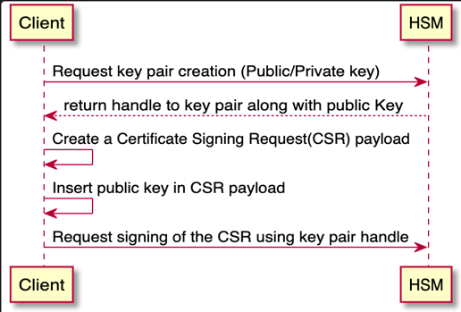
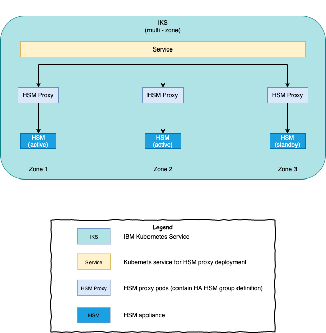

# 在 IBM Blockchain Platform 网络中使用 IBM Cloud HSM
避免网络中断和数据丢失

**标签:** 区块链,金融

[原文链接](https://developer.ibm.com/zh/articles/leverage-ibm-cloud-hsm-in-your-ibp-network/)

Ricardo Olivieri, Luc Desrosiers

发布: 2020-06-30

* * *

## 简介

在本文中，我们简要介绍了硬件安全模块 (HSM)，说明了为何要在 IBM Blockchain Platform 网络中使用这些模块，并描述了用于针对 HSM 设备提供高可用性解决方案的高级活动。此外，我们还共享了 HSM 设备的替代方案，以用于保护 IBM Blockchain Platform 网络中的数字密钥。

虽然本文没有提供有关如何在 IBM Blockchain Platform 网络中配置 HSM 设备以实现高可用性的分步说明，但却提供了包含该级别详细信息的文档的直接链接和指针。

## HSM 概述

HSM 是用于管理和安全存储重要数字密钥的物理设备。除了保护这些密钥外，HSM 还使用这些数字密钥来执行加密功能（例如，签署交易）。

顾名思义，构建 HSM 时首先要考虑的是安全性。许多 HSM 设备的一个共同特征是可防止篡改：如果有人尝试篡改，那么 HSM 设备可能无法使用，或者可能会自动删除其中的数字密钥。在许多业务情况中，如果这些密钥被泄露，可能会对拥有它们的企业的业务产生巨大负面影响。私钥泄漏可能会授予对世界状态和账本中托管的特权信息的访问权限。甚至可以让人在网络上发布交易。

由于 HSM 在保护应用程序安全方面起着至关重要的作用，并且通常是对业务运营至关重要的系统的一部分，因此许多 HSM 制造商都提供了用于将 HSM 设备集群化以实现高可用性和高性能的功能（如本文所示）。 HSM 设备通常连接到网络服务器，并且在支付、金融和银行应用程序中很常见。

### HSM 的工作方式

HSM 就像私钥数据库一样吗？不是。HSM 实际上是用于在 HSM 中生成加密材料并使这些材料永远不脱离设备。如上一节所述，HSM 提供的加密功能允许授权系统调用要使用存储在该设备中的私钥的功能（如签名和加密）。由于您会将要签名和加密的数据发送到 HSM 设备，因此无需检索密钥。

例如，下图描述了用于向 HSM 请求密钥对（即公钥和私钥）的过程。注意，已将证书签名请求 (CSR) 发送到 HSM 进行签名。可使用私钥 ID（在图中称为“句柄”）来访问私钥。

虽然 CSR 是公钥基础架构 (PKI) 领域中的一个重要概念，但 HSM 会将 CSR 视为另一个要签名的数据结构。HSM 并未定义证书和其他关联结构的概念。

## 在 IBM Blockchain Platform 网络中使用 HSM

根据法规的非功能性要求，可能要求企业将密钥存储在 HSM 设备中。

使用区块链技术的主要目标之一是提供无可辩驳的证据，证明业务网络成员之间发生了一组交易。在企业区块链业务网络中，对交易背书进行签名，不同节点（例如，对等方节点、边界方节点等）的身份由可信认证中心签名，通道更新必须由所需的批准者签名，而其他任务中要添加到账本的区块由订购者节点签名。对于所有这些数字签名，都使用数字密钥。因此，使用 HSM 设备，可以保护此类密钥并执行任何签名操作。如果使用 HSM 设备存储此类密钥，那么将难以对 Hyperledger Fabric 节点用于签署交易和背书的密钥进行未经授权的访问。

值得注意的是，HSM 设备并不便宜。使用 HSM 设备的企业确实需要承担高昂的费用。最后，在决定是否使用 HSM 设备时，贵企业应权衡所有可用选项的优势和风险。

### IBM Cloud HSM 产品

使用 [IBM Cloud HSM](https://cloud.ibm.com/docs/hardware-security-modules?topic=hardware-security-modules-getting-started) 产品，您可以配置以下两种类型的 HSM 设备：

- HSM 7.0，FIPS 140-2 3 级
- HSM 6.0，FIPS 140-2 2 级

这两种 HSM 设备的制造商都是 [Gemalto](https://www.gemalto.com/)，并且它们的型号均为 SafeNet Luna SA。在这两个选项中，我们建议使用 HSM V7.0，因为它是制造商提供的设备的最新版本，并且符合更高级别的 FIPS 140-2 合规性。

注意，IBM Cloud HSM 是基础架构即服务 (IaaS) 产品。这意味着，需要熟悉 HSM 设备的操作和管理才能充分利用此云产品。

有关 SafeNet Luna SA HSM 设备的配置和管理的详细文档，请参阅 [SafeNet PCI-E HSM 6.2](https://thalesdocs.com/gphsm/luna/6.2/docs/pci/Content/Home_pci.htm) 和 [SafeNet Luna PCIe HSM 7.4](https://thalesdocs.com/gphsm/luna/7.4/docs/pci/Content/Home_pci.htm) 的产品文档。

### HSM HA 组概述以及为何需要 HSM HA 组

将 IBM Blockchain Platform 网络中的 Hyperledger Fabric 节点配置为使用 HSM 设备会导致以下结果：

- Hyperledger Fabric 节点的身份私钥存储在 HSM 设备中。
- 在 HSM 设备中执行使用该私钥的加密操作（例如签署交易）。

因此，请务必要考虑当 HSM 设备停止工作（即，发生故障）或 HSM 设备所在的数据中心无法运行时会发生什么。在这两种情况下，都将发生中断，这对于您的业务来说可能是无法接受的。那么，有什么选项可用于防止此类中断呢？

要解决高可用性 (HA) 和灾难恢复 (DR) 问题，对 HSM 设备具有完全管理权限的企业应创建一个 HA HSM 组。要执行此操作，您需要多个 HSM 设备。推荐的 HA HSM 组配置是包含三 (3) 个 HSM 设备，其中两个设备处于活动状态，另一个设备处于待机模式。在此配置中，会在两个活动设备之间对加密请求进行负载均衡，而第三个设备位于一旁，仅在两个活动设备之一无法运行时才变为活动状态。HA HSM 配置可确保在属于同一 HA 组的 HSM 设备之间复制所有加密对象（例如，密钥），甚至将其复制到处于待机模式的 HSM 设备。因此，利用 HA HSM 组，您可以对 HSM 设备中的加密内容自动生成最新备份（这是解决 DR 问题的必要条件）。

您可以将 HA HSM 组视为由所管理的物理 HSM 设备组成的虚拟逻辑组（注意，通过 IBM Cloud HSM 产品配置 HSM 设备会向您授予该设备的完全管理权限）。

例如，假设您已将 IBM Blockchain Platform 网络部署到 IBM Cloud 上的三区域 IBM Kubernetes Service (IKS) 集群中。然后，您可以在 IKS 集群的每个区域（或数据中心）内配置一个 HSM 设备，总共可配置三个 HSM 设备。最后，您可以创建由这三个 HSM 设备组成的 HA HSM 组，其中两个 HSM 设备处于活动状态，另一个 HSM 设备处于待机模式。

有关如何为 SafeNet Luna SA V7 HSM 设备设置 HA HSM 组的详细说明，请参阅 [高可用性组](https://thalesdocs.com/gphsm/luna/7.4/docs/pci/Content/administration/ha/ha.htm) 和 [设置 HA 组](https://thalesdocs.com/gphsm/luna/7.4/docs/pci/Content/administration/ha/setup.htm)。

## 将 IBM Blockchain Platform 集成到 HSM 中

### PKCS\#11 库

[PKCS#11](https://access.redhat.com/documentation/en-us/red_hat_enterprise_linux/8/html/security_hardening/configuring-applications-to-use-cryptographic-hardware-through-pkcs-11_security-hardening) 应用程序编程接口是 PKI 设备领域的一项标准，支持使用中的应用程序与 HSM 设备（如 SafeNet Luna 设备）进行通信。所有重要的 HSM 供应商都提供了 PKCS#11 库。

### PKCS\#11 代理

HSM 客户机不一定与 HSM 服务器位于同一进程名称空间或网络位置中。在此类情况下，最好是使用 PKCS#11 代理，它可以充当客户机应用程序与 HSM 制造商提供的库之间的桥梁。

在 IBM Blockchain Platform 的上下文中，它依赖于 [PKCS#11 代理服务](https://access.redhat.com/documentation/en-us/red_hat_enterprise_linux/8/html/security_hardening/configuring-applications-to-use-cryptographic-hardware-through-pkcs-11_security-hardening)，该服务嵌入了 HSM 设备库（在我们的例子中为 SafeNet Luna 设备）。代理将充当 Fabric 节点与 HSM 制造商提供的库之间的桥梁。我们希望将此软件组件称为 HSM 代理。

重申一下，HSM 代理组件 1) 使用动态链接在运行时加载由 HSM 制造商提供的库，并且 2) 提供一个用于通信的 TCP 端点，该端点允许与 Hyperledger Fabric 节点分离开（即，HSM 代理组件不需要成为用于托管 Hyperledger Fabric 节点的容器镜像的一部分）。您可以将 HSM 代理视为 IBM Blockchain Platform 网络中的 Fabric 节点与 HSM 设备之间的直通组件。

HSM 代理的一种常见形式是 Kubernetes pod（有关如何创建此 HSM 代理 pod 组件的说明，请参阅 [IBM Cloud 硬件安全模块 (HSM)](https://cloud.ibm.com/docs/blockchain?topic=blockchain-ibp-hsm-gemalto)）。就像您需要多个 HSM 设备在基础架构级别实现 HA 一样，也需要在 Kubernetes 集群中运行的 HSM 代理 pod 的多个实例来实现 HA。例如，如果您只有一个 HSM 代理 pod，并且运行该 pod 的区域发生中断，那么即使有 HA HASM 组，也会出现停机。

为了最大程度地减少未运行任何 HSM 代理 pod 的情况，可以创建 HSM 代理 pod 的副本（即，使 IKS 集群的每个区域都有一个 pod）。这样可确保当其中一个 pod 发生故障（或者当其中一个 HSM 代理 pod 所在的整个区域/数据中心发生故障）时，IBM Blockchain Platform 网络仍然可以正常运行。注意，默认情况下，所有 HSM 代理 pod/副本都会自动分布在 IKS 集群的不同区域中。

对于 SafeNet Luna 设备，创建 HSM 代理 pod 的副本需要先执行以下两项任务：

- 配置 HSM 设备（初始化 HSM 设备、创建分区和定义密码等）
- 定义 HA HSM 组

预先完成这两项任务意味着要在部署 HSM 代理 pod 之前执行这些任务。例如，您可以启动虚拟机或 Kubernetes pod，其唯一目的是初始化 HSM 设备并定义 HA HSM 组。完成这些任务后，您将具有：

- HSM 客户机配置文件 ( [Chrystoki.conf](https://thalesdocs.com/gphsm/luna/7.5/docs/pci/Content/administration/config/config-file_summary.htm))，其中包含根据 HA HSM 组定义建立与 HSM 设备的连接所需的元数据。
- 获得对 HSM 设备的访问权所需的必要 PKI 证书和私钥（请参阅 [配置指南](https://thalesdocs.com/gphsm/luna/7.4/docs/pci/Content/config_pci/preface.htm)）

最后，您可以通过 Kubernetes [ConfigMaps](https://kubernetes.io/docs/tasks/configure-pod-container/configure-pod-configmap/) 和 [Secrets](https://kubernetes.io/docs/concepts/configuration/secret/) 来让 HSM 代理 pod 使用 HSM 配置文件和 PKI 文件。下图描述了 HSM 设备和 HSM 代理 pod 的配置（如此处所述）：

## 通过 IBM Blockchain Platform 网络使用 HA HSM 组

要通过 IBM Blockchain Platform Console 使用 HA HSM 组，只需在配置 Hyperledger Fabric 节点（例如 Hyperledger Fabric 认证中心节点）时提供以下参数：

- HSM 代理端点：用于通过网络访问 HSM 代理的 TCP 端点
- HSM 标签：HA HSM 组的名称（HA HSM 组是虚拟分区）
- HSM PIN：构成 HA HSM 组的分区的密码

从这些参数可以看出，IBM Blockchain Platform 无法确定您提供给它的参数是对应于 HA HSM 组还是单个 HSM 物理分区。

## HSM 的替代方案

默认情况下，IBM Blockchain Platform 会将与 Hyperledger Fabric 节点（认证中心节点、对等方节点和订购方节点）的身份相关联的私钥存储在 Kubernetes Secret 中。Kubernetes Secret 是用于存储敏感数据的对象。通过将敏感数据存储在 Secret 中，可以控制对此类数据的访问和使用。通过使用 Kubernetes Secret，可以将敏感数据保留在 Kubernetes pod 和容器之外，从而使开发者不必将应用程序代码与受限信息捆绑在一起。然后，系统管理员和基础架构管理员可以在部署和/或运行时期间向应用程序提供关键数据和敏感数据（例如，密码、私钥等）。

由于 Kubernetes Secret 中的数据是以 Base64 编码格式存储，因此您可能需要针对 Kubernetes Secret 数据采取其他安全措施。例如，您可以通过加密静态的 Kubernetes Secret 数据来增加另一层安全性。在 IBM Cloud 上，您可以通过执行以下操作来实现此目的：

- 配置一个 [Key Protect](https://www.ibm.com/cloud/key-protect) 服务实例
- 将用于加密的对称密钥导入到 Key Protect 中（也可以使用 Key Protect 生成新的对称密钥）
- 配置 IBM Kubernetes Service 集群实例（将在其中部署 IBM Blockchain Platform）以将 Key Protect 用作密钥管理服务 (KMS) 提供者

在执行这些步骤时，将使用存储在 Key Protect 中的对称密钥来加密您的 Kubernetes Secret。Key Protect 使用 FIPS 140-2 2 级认证的基于云的 HSM 设备来存储对称密钥。但需注意，这种方法绝不等同于使用自己的 HSM 设备来存储与 Hyperledger Fabric 节点关联的密钥。相反，Key Protect 是使用共享的 HSM 设备（由它们单独管理）来存储用于对静态 Kubernetes Secret 数据进行加密的对称密钥。请记住这一微妙而相关的差异。

虽然仅使用 Kubernetes Secret 或将 Key Protect 作为 KMS 提供者添加到 IKS 集群都是存储私钥的有效选项，但它们并不等同于使用 HSM 设备。如上所述，HSM 设备为保护私钥提供了更高的安全性。例如，在检测到篡改时，HSM 设备可能会停止服务。另外，HSM 设备中生成的加密材料也不会离开设备，因此是在设备内部执行加密操作。

综上所述，您可以使用 Key Protect 来加密存储在 Kubernetes Secret 中的敏感数据，而不仅仅是将这些数据编码为 Base64 格式。有关将 Key Protect 用作 IKS 集群的密钥管理服务的更多详细信息，请参阅 [IBM Key Protect 现在可用于 IBM Cloud Kubernetes Service](https://www.ibm.com/cloud/blog/ibm-key-protect-is-now-available-for-ibm-cloud-kubernetes-service)。

## 结束语

IBM Blockchain Platform 网络中的中断和数据丢失情况都可能会对业务产生负面影响，例如，经济损失和/或丧失客户及区块链网络联盟其他成员的信任。拥有完善的 HA 架构有助于降低区块链网络中断和停机的可能性，并帮助企业满足有关可靠性和冗余性的非功能性要求。

确保 HSM 组件（例如，HSM 设备和 HSM 代理 pod）的部署遵循了最佳实践以实现高可用性，并且从数据丢失中恢复应该是 IBM Blockchain Platform 网络总体架构和设计工作的一部分。

值得一提的是，除了可以在 HSM 设备中存储 Fabric 节点（即，对等方节点、订购者节点和认证中心节点）的密钥外，还可以考虑在 HSM 中存储以下项的密钥：

- Fabric 客户机应用程序
- 企业的管理身份

采用用于保护这些次要密钥的安全措施可以提供更高的安全性。这样做可显著降低损害那些能访问区块链网络的相邻软件组件的可能性。当然，要使此方法有效，您应该确保在注册时适当设置了身份的“最大注册次数”属性（“最大注册次数”值限制了可使用同一密码生成私钥和相应证书的次数）。有关“最大注册次数”属性的更多详细信息，请参阅 [Fabric Ca](https://hyperledger-fabric-ca.readthedocs.io/en/release-1.4/users-guide.html#starting-the-server) 文档。

如果使用 HSM 设备对于企业来说不可行，但您仍想为密钥提供另一层安全性，那么可以将 IBM Kubernetes Service 集群实例配置为使用 Key Protect 作为 KMS。此操作可确保对 Fabric 节点的数字密钥进行静态加密。

## 后续步骤

要了解有关 PKCS #11 的更多信息，请访问 Red Hat 中的 [这个很棒的资源](https://access.redhat.com/documentation/en-us/red_hat_enterprise_linux/8/html/security_hardening/configuring-applications-to-use-cryptographic-hardware-through-pkcs-11_security-hardening)。如果已准备好为 IBM Blockchain Platform 网络配置 IBM Cloud HSM 设备，请访问 IBM Cloud 目录上的 [Cloud HSM 页面](https://cloud.ibm.com/catalog/infrastructure/hardware-security-module?cm_sp=ibmdev-_-developer-articles-_-cloudreg)。最后，请不要忘记访问 IBM Blockchain Platform [文档](https://cloud.ibm.com/docs/blockchain-sw-213?topic=blockchain-sw-213-get-started-console-ocp) 下的 [IBM Cloud 硬件安全模块 (HSM)](https://cloud.ibm.com/docs/blockchain-sw-213?topic=blockchain-sw-213-ibp-hsm-gemalto) 页面。

本文翻译自： [Leverage IBM Cloud HSM in your IBM Blockchain Platform network](https://developer.ibm.com/technologies/blockchain/articles/leverage-ibm-cloud-hsm-in-your-ibp-network)（2020-06-05）