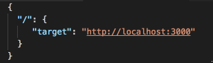
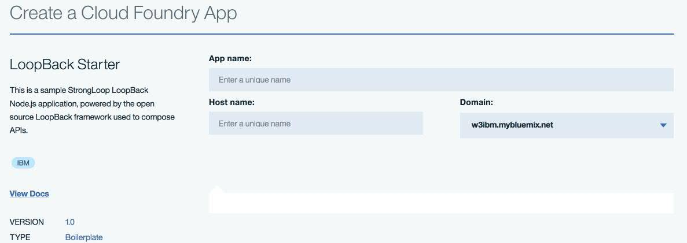
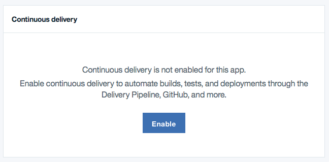
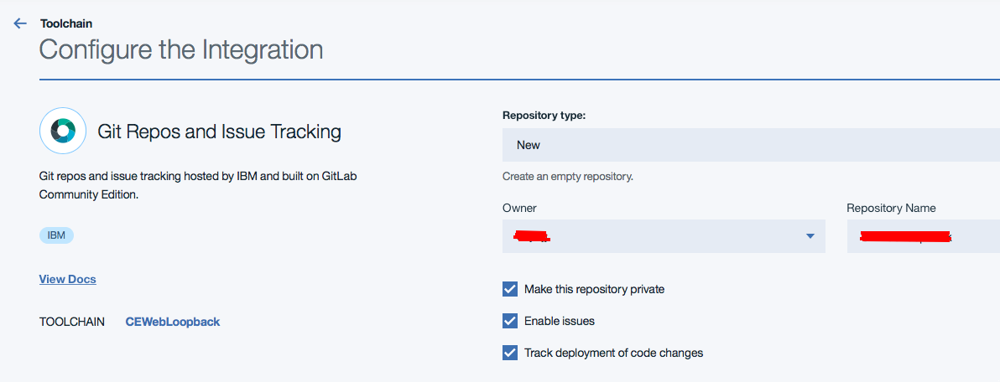
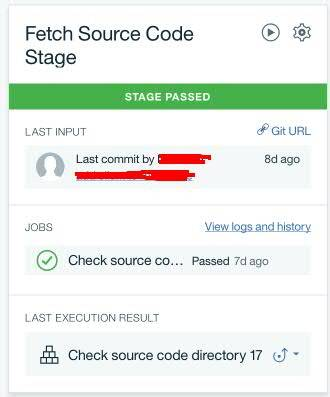
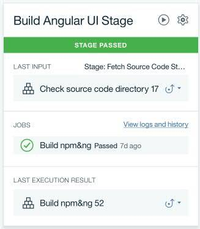
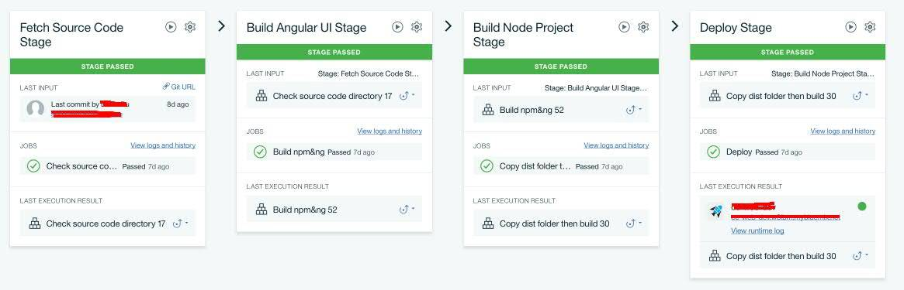

# 在 IBM Cloud 上利用 Loopback 模板搭建 Angular 应用并实现自动部署
快速实现一个 Angular + Loopback Nodejs 作为技术栈的 web 工程项目

**标签:** Loopback,Node.js,Web 开发,云计算

[原文链接](https://developer.ibm.com/zh/articles/wa-lo-use-loopback-build-angular-and-deploy/)

杜婧

发布: 2018-01-03

* * *

## Loopback 框架简介

Loopback 是一款由 IBM 和 StrongLoop 团队共同打造的一款可扩展性强的开源 Node.js 框架。Loopback 框架集成了 Express.js 和 OpenAPI Spec(Swagger Spec)。

Express.js 框架几乎已经成为了 Node.js web 应用的范本，但当用 Express.js 开发后端 API 时，它的高可定制化特征却并不是优势，因为开发者需要手工写出每一个 API 端点。但 Loopback 框架帮开发者简化了 API 繁琐的开发。所有和数据相关的 API 都可以通过配置文件实现，特别是针对数据模型的 CRUD 操作，可以快速地由几行配置行命令实现。同时，Loopback 还提供了内置的数据模型，简化了数据模型的创建。

OpenAPI specification 是一种 API 的描述方式。这种 API 文字说明清晰地描述了每一支 API 的定义、用法和用途。在 Loopback 中，当一个数据模型被创建时，相应地，对应的 OpenAPI 说明也会被创建；反之亦然。

## Angular 框架简介

在 Angular 2 之后，Angular 的主要开发语言换成了 Typescript，而不是 Javascript。但是主流的浏览器都不支持直接执行 Typescript 语言，而是需要 tsc 编译器的帮助，把 Typescript 转成浏览器可编译的 Javascript 语言。针对不同的编译时机，Angular 提供了 AoT(Ahead-of-Time) 和 JiT(Just-in-Time) 两种编译方式。使用 AoT 的编译方式时，编译器仅仅使用一组库，在构建期间运行一次，浏览器加载的是已经预编译好的代码；而用 JiT 的编译方式时，编译器在每个用户的每次运行期间都要在浏览器中执行编译过程，用不同的库运行一次。同时，AoT 编译通常会和 Rollup 一起使用，实现摇树操作（Tree Shaking），从而减少打包体积，减少浏览器加载时间。

由于 Angular 对编译和打包都有特殊要求，在进行 Angular 工程部署时，我们需要特别小心。

## Loopback 与 Angular 2 的整合与本地开发环境搭建

### 构建方式 1：本地开发环境搭建（在本地同时启动 Angular 工程与 Loopback 工程）

通常我们在开发过程中，会选择在本地搭建开发环境并运行，以方便纠错和部署。Angular 工程中，新构建的项目都会自带 angular-cli.json

在本地，我们通过 p-s 和 nodemon 包构建工程：

p-s 是一个针对 npm 的脚本构建包，它帮我们规避了冗长的 package.json 文件和 json 文件的功能不足的缺点。

nodemon 包可以帮助开发者在开发过程中监控工程中的文件变化并刷新 node 工程。

Loopback 工程中 package-scripts.js 对本地运行的配置:

```
local: 'nodemon . --watch common --watch server --ext js,json'

```

Show moreShow more icon

Angular 工程中 package-scripts.js 对本地运行的配置：

```
local: 'ng serve --port 4200 --host 0.0.0.0 --proxy-config proxy.conf.json'

```

Show moreShow more icon

用一个代理配置文件将所有的后端请求都转到特定的服务器地址，而不是 angular cli 内置的 webpack 开发服务器地址。

```
proxy.conf.json:

```

Show moreShow more icon

##### 图 1\. proxy.conf.json 文件内容



### 构建方式 2：将 Angular 工程打包进 Loopback 工程

在进行编译之前，可以使用 loopback-sdk-builder 生成数据模型，以保证 Angular 工程和 Loopback 工程使用同一套数据模型。

```
npm install –-save-dev @mean-expert/loopback-sdk-builder

```

Show moreShow more icon

执行上述命令行之后，分别修改前后端工程的 package-scripts.json 文件，添加反向构建的脚本

```
build: {
sdk: './node_modules/.bin/lb-sdk . local dev ../angular-project/src/app/shared/sdk',
}

```

Show moreShow more icon

如果是在本地进行部署，可以直接访问 [http://localhost:4200](http://localhost:4200/) 查看部署后的工程。

#### JiT(Just-in-time)编译

```
ng build

```

Show moreShow more icon

默认是 JiT 的编译方式进行打包，执行这行 Angular CLI 命令后会自动生成 dist 文件夹，文件目录如图所示:

```
├── app

| └── data

| ├── mock-data-2.1.json

| ├── mock-data-2.2.json

| ├── mock-data-2.3.json

| └── mock-data-2.4.json

├── favicon.ico

├── glyphicons-halflings-regular.eot

├── glyphicons-halflings-regular.svg

├── glyphicons-halflings-regular.ttf

├── glyphicons-halflings-regular.woff

├── icomoon.eot

├── icomoon.svg

├── index.html

├── inline.bundle.js

├── inline.bundle.map

├── main.bundle.js

├── main.bundle.map

├── polyfills.bundle.js

├── polyfills.bundle.map

├── styles.bundle.js

├── styles.bundle.map

├── vendor.bundle.js

└── vendor.bundle.map

```

Show moreShow more icon

#### AoT(Ahead-of-time) 编译

AoT 编译能加快应用的启动时间，因为在客户端不需要再导入 angular 编译器，安装的脚本库就会相应变小。同时，由于编译过程是在服务器端构建时完成的，在编译过程中就会提前发现错误，避免了浏览器运行时编译让用户发现异常。通常，在生产环境中都会采用 AoT 的编译方式，因为源代码会一起混合编译，防止代码泄露。

利用 Angular CLI 提供的 AoT 编译 + Webpack 摇树方式打包:

```
ng build --prod

```

Show moreShow more icon

因为 Angular CLI 是基于 webpack 开发的，所以提供了 Webpack 自带的摇树操作。当设置目标版本为生产环境版本时，会自动设置成 AoT 编译方式并加入 Webpack 摇树去掉多余文件。

AoT 编译 + Rollup 摇树 方式打包（官方推荐方式）

为了方便使用，可以将如下代码:

```
"aot": "node_modules/.bin/ngc -p ./src/tsconfig-aot.json"

```

Show moreShow more icon

加入 package.json 文件中，那么 AoT 编译命令可缩减为

```
npm run aot

```

Show moreShow more icon

在 /src 目录下加入 tsconfig-aot.json 文件，做 AoT 编译的相关设定：

```
{
           "compilerOptions": {
           "baseUrl": "",
           "declaration": false,
           "emitDecoratorMetadata": true,
           "experimentalDecorators": true,
            "lib": ["es2015","dom"],
            "mapRoot": "./",
            "module": "es2015",
            "moduleResolution": "node",
            "sourceMap": true,
           "target": "es5",
            "outDir": "../dist",
            "typeRoots": [
            "./node_modules/@types",
            "./node_modules"
            ]
            },
            "files": [
            "./app/app.module.ts",
            "./main-aot.ts"
            ],
            "exclude": [
            "node_modules"
            ],
            "angularCompilerOptions": {
            "genDir": "aot",
            "skipMetadataEmit" : true
            }
            }

```

Show moreShow more icon

Rollup 是新一代 JavaScript 模块打包工具。开发者可以在你的应用或库中使用 ES2015 模块，然后高效地将小段代码块打包成一个单一文件用于浏览器和 Node.js 使用。通常应用会引用一些第三方库，但并不是库里面的所有文件都会被调用，这时就会产生垃圾代码（dead code），这些代码可以通过摇树操作（Tree shaking）清除，而 Rollup 就提供了这种便捷的操作。同时，因为 Rollup 基于 ES2015 模块，比 Webpack 和 Browserify 使用的 CommonJS 模块机制更高效，所以 Rollup 成为了 Angular 官方推荐的打包方式。

在 angular 工程中，添加 rollup-config.js 或 rollup-config.json 配置 rollup 打包方式与流程：

```
import rollup from 'rollup'
import nodeResolve from 'rollup-plugin-node-resolve'
import commonjs from 'rollup-plugin-commonjs'
import uglify from 'rollup-plugin-uglify'
export default {
entry: 'dist/main-aot.js',
dest: 'dist/build.js', // output a single application bundle
sourceMap: false,
format: 'iife',
onwarn: function(warning) {
// Skip certain warnings
// should intercept ... but doesn't in some rollup versions
if ( warning.code === 'THIS_IS_UNDEFINED' ) { return; }
// console.warn everything else
console.warn(warning.message);
},
plugins: [
nodeResolve({jsnext: true, module: true}),
commonjs({
include: 'node_modules/rxjs/**',
}),
uglify()
]
}

```

Show moreShow more icon

`rollup-plugin-node-resolve`: 用 node resolution 算法来定位第三方依赖的引用模块

`rollup-plugin-commonjs`: 将符合 commonjs 规范的模块转换成 es6 语法，这样可以构建到 rollup 生成的文件包中

`rollup-plugin-uglify`: 减小和压缩 bundle 文件

如果只是在 IBM Cloud 上单纯部署由 Angular 实现的静态页面，可选用 [Cloud Foundry Static file Buildpack](https://github.com/cloudfoundry/staticfile-buildpack).

## 利用 DevOps toolchain 部署整合后的工程

### 准备 manifest.yml 文件

在 IBM Cloud 上部署该工程，首先需要准备 manifest.yml 文件:

```
applications:
- path: .
memory: 512M
instances: 1
domain: w3ibm.mybluemix.net
name: xxx //name of your application
host: xxx // pay attention to hostname when there are several hosts
    available to your account
disk_quota: 512M

```

Show moreShow more icon

这个文件主要用来对应用进行描述。需要注意的是，当用户的账户下可访问多个 IBM Cloud 域名时，需要写清 domain 与 host 参数，使该参数与新建应用时填写的 Host name 和 Domain 保持一致，防止部署错误。因为 IBM Cloud 已经帮用户准备了许多常用的构建包，所以可以直接选择新建 Cloud Foundry 应用下的 nodejs Loopback 构建包，如下图2所示：

##### 图 2\. 创建CF应用示意图



在应用的 Dashboard 上，打开持续构建工具，如下图所示：

##### 图 3\. 持续构建仪表板



开启持续构建工具后，四个工具会默认添加到项目中：Issues, Git, Delivery Pipeline和Eclipse Orion Web IDE。

开启持续构建工具后，可以配置源代码所在路径。通常，我们会新建一个 git 项目，该项目所在路径为： [https://git.ng.bluemix.net/account\_name/project\_name](https://git.ng.bluemix.net/account_name/project_name) §。

##### 图 4\. 关联工程的 git 仓库到持续构建工具链



Delivery pipeline 由多个可配置的阶段（stage）组成，示例工程中配置了如下四个阶段：

### Stage1：从对应的Git工程中取代码

在第一阶段，需要把 delivery pipeline 和 git 工程相关联，这样可以清晰看到工程的最后一次提交和工程目录。这可以利用自动生成的 Build Stage 来实现 。通常我们会在 shell 脚本中加入如下代码，用来在输出控制台上追溯工程目录和文件结构：

```
#!/bin/bash
            # your script here
            echo 'directory:'
           echo `pwd`
            echo `ls -la`

```

Show moreShow more icon

##### 图 5\. Stage 1 示意图



### Stage 2：构建 Angular UI

在自动生成的 Deploy Stage 里面，我们可以加入多个 job，也可以通过新建多个 Deploy Stage 实现。也就是说，从这个步骤开始的几个步骤可以作为多个 job 放在一个 Deploy Stage 中，也可以分别建立多个只有一个 job 的 stage 实现。但需要注意的是一个 stage 如果不能正确地执行完，在下一次执行时会把下属的所有 job 从头执行一遍（所以建立多个只有一个 job 的 stage 是比较好的选择）。

构建 Angular UI 时，需要先在全局安装 Angular cli 以便执行构建命令（也可以选择在本地，也就是该 angular 工程下安装，区别在于后面的 ng build 命令需要改成 ./node\_modules/.bin/ng build）。

```
#!/bin/bash
# The default Node.js version is 0.10.40
# To use Node.js 0.10.48, uncomment the following line:
#export PATH=/opt/IBM/node-v0.10.48/bin:$PATH
# To use Node.js 0.12.7, uncomment the following line:
#export PATH=/opt/IBM/node-v0.12/bin:$PATH
# To use Node.js 4.4.5, uncomment the following line:
#export PATH=/opt/IBM/node-v4.4.5/bin:$PATH
# To use Node.js 6.7.0, uncomment the following line:
export PATH=/opt/IBM/node-v6.7.0/bin:$PATH
cd ui-part
npm install -g @angular/cli
npm install && ng build

```

Show moreShow more icon

##### 图 6\. Stage2 示意图



### 构建 Loopback 工程

为了方便区分不同的环境和编译方式，可以通过不同的文件夹加以区分，并将 Angular 工程和 Loopback 工程分别拷贝进同一个文件夹。由于是部署在 IBM Cloud 上的 Angular 工程，建议使用 AoT 方式进行编译，尽量减小浏览器对应用的影响。在 Angular 工程中，编译后的静态文件会生成到 ./dist 文件夹中。为了把 Angular 工程和 Loopback 工程整合在一起，将 Angular 工程构建后生成的 dist 文件夹及其中所有文件拷贝到目标文件夹（./bluemix-dev）下面的 client 目录，并将 Loopback 工程整个拷贝进目标文件夹。以便 Loopback 工程可以找到对应的前端静态页面。最后，通过 npm install 命令，将 Loopback 工程所依赖的包安装在云环境中。

```
#!/bin/bash
# your script here
echo 'current directory: '
echo `pwd`
echo `ls -la`
echo 'copy files: '
if [ ! -d ./bluemix-dev/client ]; then
`mkdir ./bluemix-dev/client`
fi
echo `cp -rf ./angular-project/dist/* ./bluemix-dev/client && rsync
    -arv --exclude=package.json ./loopback-project/* ./bluemix-dev`
echo 'list client files:'
echo `ls -la ./bluemix-dev/client`
echo `cd loopback-project && npm install`

```

Show moreShow more icon

##### 图 7\. Stage 3 示意图


### 部署 CF 应用

将应用按照 manifest.yml 中的配置部署在 IBM Cloud 上

```
#!/bin/bash
echo `ls -la`
cf push "${CF_APP}"

```

Show moreShow more icon

##### 图 8\. Stage 概览示意图

