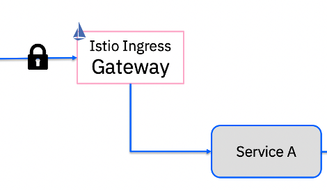

# 在 Istio 服务网格中调试边缘微服务的 4 个步骤
通过调试确定为何无法从 Istio 网格外部运行的 CURL 客户端访问 Istio 入口网关上公开的服务

**标签:** Istio,容器,微服务

[原文链接](https://developer.ibm.com/zh/articles/4-steps-to-debug-your-edge-microservices-in-istio-service-mesh/)

Lin Sun

发布: 2020-11-11

* * *

Istio 的最常见应用场景之一是将 Istio 用作 [入口网关](https://istio.io/latest/docs/tasks/traffic-management/ingress/ingress-control/) 并在入口网关上公开其微服务，以供外部客户端访问。这通常有两种场景。第一种场景是在不使用 Sidecar 的情况下运行服务 A，第二种场景是在使用 Sidecar 的情况下运行服务 A 以在入口网关与服务 A 之间建立 mTLS 通信。

场景 1：不使用 Sidecar 的服务 A


场景 2：使用 Sidecar 的服务 A


最近，我帮助一名 Istio 用户进行调试，确定为何无法从 Istio 网格外部运行的 CURL 客户端访问 Istio 入口网关上公开的服务。我想分享我们在这个过程中采取的一些关键步骤，从而帮助其他人解决类似的问题。

## 1\. 使用 istioctl Analyzer 命令

在与您要调试的服务相关的每个 Istio 资源上运行 [istioctl Analyzer](https://istio.io/latest/docs/ops/diagnostic-tools/istioctl-analyze/) 命令。该 Analyzer 命令现在是我最喜欢使用的 `istioctl` 命令之一。

通过 Analyzer，可以检查具有特定名称空间或整个 Kubernetes 集群的单个 YAML 文件。理想情况下，在部署 Istio 资源之前，可以在具有要将 Istio 资源部署到的名称空间的 Istio YAML 文件（例如，网关或虚拟服务资源）上运行该 Analyzer 命令。这可帮助您提前发现问题。

```
$ istioctl analyze helloworld-gw-nlb.yaml -n istio-system
✔ No validation issues found when analyzing namespace: istio-system.

```

Show moreShow more icon

如果已经应用了 Istio 资源，则可以在整个集群上运行 Analyzer，因为可能存在与您的路由相冲突的错误路由。使用 `istioctl analysis --all-namespaces` 来分析整个集群。

## 2\. 验证是否正确加载了密钥

如果要通过单向 TLS 或双向 TLS 安全地访问服务，则需要确保已将密钥加载到入口网关，以便入口网关可以利用该密钥来保护入站流量。

`istioctl proxy-config secret` 命令可帮助您检查已将哪些密钥加载到入口网关，您还可以使用此命令来验证您的密钥是否已加载且在相应的期限内有效。例如，以下命令显示了已将名为 `mycluster-wdc06-b-406454-85f044fc29ce613c264409c04a76c95d-0001` 的密钥加载到默认 Istio 安装随附的 istio-system 名称空间内的入口网关中。

```
$ istioctl proxy-config secret istio-ingressgateway-768c6bf77b-2k7hm.istio-system
RESOURCE NAME                                                      TYPE           STATUS     VALID CERT     SERIAL NUMBER                                  NOT AFTER                NOT BEFORE
mycluster-wdc06-b-406454-85f044fc29ce613c264409c04a76c95d-0001     Cert Chain     ACTIVE     true           415111668488852830681974512193801089848052     2020-12-05T09:43:42Z     2020-09-06T09:43:42Z

```

Show moreShow more icon

## 3\. 检查 Istio 网络资源

现在可以检查边缘服务的网关资源和虚拟服务资源了，以确保正确引用了这些资源！在您的网关资源中，验证：

- a. 网关资源的 `namespace` 是否正确。这通常与网关部署在同一个名称空间中。
- b. 网关资源中的 `credentialName` 与步骤 2 的网关中加载的密钥名称是否匹配。从 Istio 1.7 开始，密钥必须与网关部署在同一个名称空间中。
- c. `host` 字段是否正确。如果虚拟服务位于其他名称空间中，则建议您在主机值前面添加名称空间（例如 `hello /`）作为前缀。
- d. 如果使用的是自定义网关，则需要检查 `selector` 是否正确。此选择器必须与自定义网关部署的选择器匹配。

```
helloworld-gw-nlb.yaml:
apiVersion: networking.istio.io/v1alpha3
kind: Gateway
metadata:
name: helloworld-gateway
namespace: istio-system # step a
spec:
selector:
    istio: ingressgateway # step d
servers:
  - port:
      number: 443
      name: https
      protocol: HTTPS
    tls:
      mode: SIMPLE
      credentialName: mycluster-wdc06-b-406454-85f044fc29ce613c264409c04a76c95d-0001 # step b
    hosts:
    - "hello/hello.mycluster-wdc06-b-406454-85f044fc29ce613c264409c04a76c95d-0001.us-east.containers.appdomain.cloud".#step c

```

Show moreShow more icon

在您的虚拟服务资源中，验证：

- a. 是否正确引用了 `gateway` 字段的值，如果虚拟资源与网关资源位于不同的名称空间中，则该值应添加网关资源的名称空间作为前缀。
- b. `hosts` 值与网关资源中指定的值是否匹配。
- c. 检查是否已使用正确的 `destination` 配置了 `route`。如果使用了多个名称空间，则需要使用标准的 `host` 名称。

```
helloworld-vs.yaml:
apiVersion: networking.istio.io/v1alpha3
kind: VirtualService
metadata:
name: helloworld
namespace: hello # step a
spec:
hosts:
  - "hello.mycluster-wdc06-b-406454-85f044fc29ce613c264409c04a76c95d-0001.us-east.containers.appdomain.cloud" # step b
gateways:
  - istio-system/helloworld-gateway # step a
http:
  - match:
    - uri:
        exact: /hello
    route:
    - destination:
        host: helloworld.hello.svc.cluster.local # step c
        port:
          number: 5000

```

Show moreShow more icon

## 4\. 检查入口网关日志

检查入口网关日志，验证入口网关是否已收到请求，并检查任何特定的错误代码（如果存在）。参阅标题为 [Enjoy 拒绝了请求](https://istio.io/latest/docs/ops/common-problems/network-issues/#requests-are-rejected-by-envoy) 的说明，了解如何查看入口网关日志和常见错误代码。

有时，您可能需要使用 `istioctl proxy-config log {ingress-pod}.istio-system --level debug` 为入口网关启用调试日志。您也可以使用 `istioctl dashboard envoy {ingress-pod}.istio-system` 来检查网关的 Envoy 配置。参阅 [调试 Envoy 和 Istiod](https://istio.io/latest/docs/ops/diagnostic-tools/proxy-cmd/) 文档，了解有关如何调试 envoy 配置的更多信息。

## 结束语

我希望您可以使用上述方法，像我一样轻松地诊断 Istio 入口网关的边缘服务问题。

如果仍然存在问题，可以打开 [Istio GitHub 问题](https://github.com/istio/istio/issues) 和 [收集所有必需信息](https://github.com/istio/istio/wiki/Troubleshooting-Istio#sidecargateway-problems)。无论是 [IBM Cloud 上的 Istio](https://www.ibm.com/cn-zh/cloud/istio) 还是其他地方，都可以使用 Istio 来推动微服务的发展。

本文翻译自： [4 steps to debug your edge microservices in an Istio service mesh](https://developer.ibm.com/articles/4-steps-to-debug-your-edge-microservices-in-istio-service-mesh/)（2020-10-09）