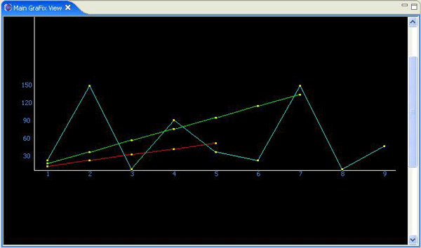

# 在 Java 中使用 Draw2D 和 SWT 绘图
编写自己的平台无关代码来创建 X-Y 坐标图、条形图和其他更多图形

**标签:** Java

[原文链接](https://developer.ibm.com/zh/articles/os-draw2dswt/)

Indiver Dwivedi Indiver Dwivedi

发布: 2005-06-30

* * *

## Draw2D 简介

Draw2D 是一个驻留在 SWT Composite 之上的轻量级窗口小部件系统。一个 Draw2D _实例_ 由一个 SWT Composite、一个轻量级系统及其内容的图形组成。 _图形_ 是 Draw2D 的构建块。关于 Draw2D API 的所有细节，可以从 Draw2D Developer’s Guide 的 Eclipse 帮助文件中找到。因为本文不打算成为一篇讲述 Draw2D 的教程，所以，为了简便起见，只要您了解 Draw2D API 可以帮助您在 SWT Canvas 上进行绘图就足够了。您可以直接使用一些标准的图形，比如 Ellipse、Polyline、RectangleFigure 和 Triangle，或者，您可以扩展它们来创建自己的图形。此外，一些容器图形，如 Panel，可以充当所有子图形的总容器。

Draw2D 有两个重要的包：org.eclipse.draw2d.geometry 和 org.eclipse.draw2d.graph，本文中使用了这两个包。org.eclipse.draw2d.geometry 包有一些有用的类，比如 `Rectangle`、 `Point` 和 `PointList` ，这些类都是自我解释的。另一个包 org.eclipse.draw2d.graph 开发人员使用的可能不是太多。这个包提供了一些重要的类，比如 `DirectedGraph`、 `Node`、 `Edge`、 `NodeList` 和 `EdgeList`，这些类有助于创建图表。

在本文中，我将解释如何使用 Draw2D 编写代码，帮助您以图形的方式形象化您的数据。我将从一项技术的描述开始，该技术将位于某一范围内的数据值（比如，从 0 到 2048）按比例缩放成另一范围内的等效数据值（例如，从 0 到 100）。然后，我将举例说明如何绘制出任意个级数的 X-Y 坐标图，每个级数都包含一组数据元素。在学习了本文中的概念之后，就可以很容易地绘制其他类型的图表，比如饼图和条形图。

## 具体的绘图过程

### 步骤 1\. 您想绘制什么样的图形？

显然，您想以图形方式描绘来自数据源的数据。所以，您需要那些您想以图形形式形象化的数据。为了简便起见，我使用了一个名为 `dataGenerator` 的简单函数生成的数据，而不是从 XML 文件或其他一些数据源读取数据，该函数使用了一个 `for(;;)` 循环，并以数组列表的形式返回生成的值。

##### 清单 1\. 生成一些数据

```
private ArrayList dataGenerator() {
        double series1[] = new double[5];
            for(int i=0; i<series1.length; i++)
                series1[i] = (i*10) + 10; // a linear
                series containing    10,20,30,40,50

            double series2[] = new double[9];
            series2[0] = 20; series2[1] = 150; series2[2] = 5;
            series2[3] = 90; series2[4] = 35;  series2[5] = 20;
                            series2[6] = 150; series2[7] = 5; series2[8] = 45;

            double series3[] = new double[7];
            for(int i=0; i<series3.length; i++)
                series3[i] = (i*20) + 15;

            seriesData.add(series1);
            seriesData.add(series2);
            seriesData.add(series3);
                    return seriesData;
    }

```

Show moreShow more icon

### 步骤 2\. 缩放技术 —— 从给定的数据生成 X 坐标和 Y 坐标

##### 一些新的术语

FigureCanvas Draw2D 中的 `FigureCanvas` 是 SWT Canvas 的一个扩展。`FigureCanvas` 可以包含 Draw2D 图形。Panel Panel 是 Draw2D 中的一个通用容器图形，它可以包含子图形。您可以向一个 Panel 图形中添加许多图形，然后将这个 Panel 图形提供给 `FigureCanvas`。DirectedGraph`DirectedGraph` 是一个 2-D 图形，拥有有限数量的 `Node`，每个 `Node` 都位于一些 `Point` 中，相邻的 `Node` 是通过 `Edges` 彼此连接在一起的。

当您想绘制一架 2-D 飞机上的点时，必须找出每个点的 X 坐标和 Y 坐标。绘图的奇妙之处在于能够将某一个给定数据值从一个范围按比例缩放到另一个范围中，也就是说，如果给定一组值，如 {10,20,30}，那么您应该能够确定 2-D 飞机上具体哪些点（X 坐标和 Y 坐标）表示的是 10、20 和 30 这些数据值。

绘制总是在按照某一个限定缩放比例进行的。换句话说，在同一限定区域内，可以绘制任意数量的点。因为该区域是固定的，所以您总是可以找到 X 坐标轴的跨度（长度）和 Y 坐标轴的跨度（高度）。X 坐标轴和 Y 坐标轴的跨度只是等式的一部分。另一部分是找出数据值的范围，并根据每个数据值在新范围内的等效值来计算这些值的坐标。

#### 计算 X 坐标和 Y 坐标

**X 坐标** ：X 坐标是某一个点距离原点的水平距离。计算元素的数量，然后将 X 坐标轴的跨度分成 _n_ 个区段，其中， _n_ 是给定集合中的元素的数量，通过这种方式，可以计算某一集合中的所有点的横向坐标。用这种分割方法可以获得每个区段的长度。集合中的第一个点位于等于区段长度的第一段距离内。后续的每个点则位于区段长度加上原点到前一个点的距离的那一段距离内。

例如，给出一个集合 {10,20,30,40}，您立刻就可以知道要绘制 4 个点，因为集合中包含 4 个元素。所以，应该将 X 坐标轴的跨度分成 4 个相等的区段，每个区段的长度 = 跨度/4。因此，如果 X 坐标轴的跨度是 800，那么区段的长度将是 800/4，即 200。第一个元素（10）的 X 坐标将是 200，第二个元素（20）的 X 坐标将是 400，依此类推。

##### 清单 2\. 计算 X 坐标

```
private int[] getXCoordinates(ArrayList seriesData){
    int xSpan = (int)GraFixConstants.xSpan;
           int longestSeries = Utilities.getLongestSeries(seriesData);
           int numSegments =
           ((double[])seriesData.get(longestSeries)).length;
           int sectionWidth =
           (int)xSpan / numSegments; //want to divide span of xAxis

           int xPositions[] =
           new int[numSegments]; // will contain X-coordinate of all dots.
    for(int i=0; i<numSegments; i++){
        xPositions[i]=
        (i+1)*sectionWidth;//dots spaced at distance of sectionWidth
    }
    return xPositions;
}

```

Show moreShow more icon

**Y 坐标** ：Y 坐标是某一个点距离原点的纵向距离。计算 Y 坐标要将某一个值按比例从一个范围缩放到另一个范围。例如，给出相同的集合 {10,20,30,40}，您可以看出，数据的范围是 0 到 40，新的范围就是 Y 坐标轴的跨度（高度）。假设 Y 坐标轴的高度为 400，那么第一个元素（10）的高度将是100，第二个元素的高度将是 200，依此类推。

通过以下例子，您可以更好地理解如何按比例将一个值从一个范围缩放到另一个范围：假定一个范围的跨度是从 0 到 2048，而您打算将该范围内的任意值（比如说 1024）缩放到另一个从 0 到 100 的范围内，那么您立刻就可以知道，等刻度值是 50。该缩放所遵循的三值线算法是：

```
line 1---> 2048 / 1024 equals 2.
line 2---> 100 - 0 equals 100.
line 3---> 100 / 2 equals 50, which is the desired scaled value.

```

Show moreShow more icon

### 步骤 3\. 您想在哪儿进行绘图？

您还需要进行绘图的地方。可以通过扩展 Eclipse ViewPart 和使用 SWT Composite 来创建您自己的视图。此外，也可以使用从 `main()` 函数中调用的 SWT shell。

在扩展 Eclipse ViewPart 时，至少必须实现两个函数： `createPartControl(Composite parent)` 和 `setFocus()` 。函数 `createPartControl(Composite parent)` 是在屏幕上绘制视图时自动调用的。您的兴趣只在所接收的 SWT Composite 上。因此，将它传递给某个类，然后通过对这个类进行编码来绘制图形。

##### 清单 3\. 使用 Eclipse ViewPart 绘图

```
public class MainGraFixView extends ViewPart{
    public void createPartControl(Composite parent) {

        //create or get data in an arraylist
        ArrayList seriesData = dataGenerator();
        //instantiate a plotter, and provide data to it.
        DirectedGraphXYPlotter dgXYGraph = new DirectedGraphXYPlotter(parent);
        dgXYGraph.setData(seriesData);
        dgXYGraph.plot(); //ask it to plot
    }
    public void setFocus() {
    }
}

```

Show moreShow more icon

### 步骤 4\. 您需要绘制哪种图形？

一旦拥有了数据以及想用来绘制图形的区域，就必须确定您需要哪种类型的可视化。在本文中，我演示了如何编写代码来创建 X-Y 坐标图和线形图。一旦知道了绘制 X-Y 坐标图的技术，就应该能够绘制出其他图形，比如条形图和饼图。要想更多地了解 X-Y 坐标图，请参阅我为本文编写的 `DirectedGraphXYPlotter` 类（参见所附源代码中的 \\src\\GraFix\\Plotters\\DirectedGraphXYPlotter.java）。

### 步骤 5\. 创建自己的 X-Y 坐标图

X-Y 坐标图应该能够绘制出 2-D 飞机上的任意数量的级数线。每个级数线都应该以图形形式显示出引用 X 和 Y 引用线的那些级数中的每个点的位置。每个点都应该通过一条线连接到级数中的下一个点上。通过使用表示一个点和一条线的 Draw2D 图形，您应该能够创建这样一个坐标图。例如，为了表示一个点，我通过扩展 Ellipse 图形创建了一个 Dot 图形，并使用 PolylineConnection 图形来表示连接线。

`DirectedGraphXYPlotter` 类只有两个公共函数： `setData(ArrayList seriesData)` 和 `plot()` 。函数 `setData(ArrayList seriesData)` 接受您想要以图形形式形象化的数据（参见步骤 1），而 `plot()` 函数则开始绘图。

一旦调用了 `plot()` 函数，就必须依次采用以下步骤：

1. 采用一个 SWT Composite，并将 `FigureCanvas` 放在它之上。然后，将一个类似 Panel 的通用容器图放在画布上。
2. 计算将要绘制的级数的数量，然后填充创建 `DirectedGraphs` 所需数量的 `NodeLists` 和 `EdgeLists` 。
3. 在 Panel 图上绘制 X 坐标轴和 Y 坐标轴。（参见所附源代码中 \\src\\GraFix\\Figure 目录下的 XRulerBar.java 和 YRulerBar.java。）
4. 创建和级数一样多的 `DirectedGraphs` ，以便进行绘图。
5. 在 Panel 图上绘制点和连接线，同时采用步骤 d 中创建的 `DirectedGraphs` 中的图形数据。
6. 最后，通过提供 Panel 图来设置画布的内容，其中包括到目前为止您已经准备好的所有的点和连接线。

在以下代码中：

- 第 6-11 行代码对应于上述的步骤 a。
- 第 14 行，即函数 `populateNodesAndEdges()` ，对应于上述的步骤 b。
- 第 16 行，即函数 `drawAxis()` ，对应于上述的步骤 c。
- 第 17 行、第 18 行和第 19 行对应于上述的步骤 d 和步骤 e。
- 第 20 行对应于上述的步骤 f。

##### 清单 4\. `plot()` 函数

```
1.    public void plot(){
2.        //if no place to plot, or no data to plot, return.
3.        if(null==_parent || null==_seriesData)
4.            return;
5.
6.        Composite composite = new Composite(_parent, SWT.BORDER);
7.        composite.setLayout(new FillLayout());
8.        FigureCanvas canvas = new FigureCanvas(composite);
9.
10.        Panel contents = new Panel();//A Panel is a general purpose container figure
11.        contents.setLayoutManager(new XYLayout());
12.        initializeSpan(contents.getClientArea());
13.
14.        populateNodesAndEdges();
15.
16.        drawAxis(contents);
17.        for(int i=0; i<_numSeries; i++){
18.            drawDotsAndConnections(contents,getDirectedGraph(i)); //
draw points & connecting wires
19.        }
20.        canvas.setContents(contents);
21.    }

```

Show moreShow more icon

`plot()` 调用了两个重要内部函数来帮助绘制图形中的点： `populateNodesAndEdges()` 和 `drawDotsAndConnections()` 。在您发现这两个函数到底完成什么功能之前，让我们来看一下 `DirectedGraph` 。

**DirectedGraph 是什么？** 为了使用 Draw2D 进行绘图，事实上您必须先创建一个图形，定义将要绘制的点和线。一旦创建好这个图形，就可以使用它实际在画布上进行绘图。您可以将 `DirectedGraph` 形象化为拥有有限数量的 `Node` 的一个 2-D 图形，在该图形中，每个 `Node` 都位于一些 `Point` 上，相邻的 `Node` 是通过 `Edges` 连接在一起的。

您可以通过以下代码行来了解创建 `DirectedGraph` 的关键所在。首先，创建一个 `Node` 列表和一个 `Edges` 列表。然后，创建一个新的 `DirectedGraph` ，并通过刚才创建的 `NodeList` 和 `EdgeList` 设置其成员（ `Nodes` 和 `Edges` ）。现在，使用 `GraphVisitor` 来访问这个 `DirectedGraph` 。为了简便起见，包 org.eclipse.draw2d.internal.graph 中有许多 `GraphVisitor` 实现，这些 `GraphVisitor` 有一些用来访问图形的特定算法。

因此，创建 `DirectedGraph` 的示例代码类似于下面这样：

##### 清单 5\. 示例 DirectedGraph

```
//This is a sample, you will need to add actual Node(s) to this NodeList.
NodeList nodes = new NodeList(); //create a list of nodes.
//This is a sample, you will need to add actual Edge(s) to this EdgeList.
EdgeList edges = new EdgeList(); //create a list of edges.
DirectedGraph graph = new DirectedGraph();
graph.nodes = nodes;
graph.edges = edges;
new BreakCycles().visit(graph);//ask BreakCycles to visit the graph.
//now our "graph" is ready to be used.

```

Show moreShow more icon

现在，已经知道 `DirectedGraph` 包含许多 `Node` ，其中，每个 `Node` 都可能包含一些数据，并且还存储了这些数据的 X 坐标和 Y 坐标，以及一个 `Edges` 的列表，每个 `Edge` 都知道在自己的两端分别有一个 `Node` ，您可以通过以下技术，使用这些信息来绘图，其中涉及两个部分：

- **部分 A —— 通过以下步骤填充 Node 和 Edge：**

    - 创建一个 `NodeList` ，在该列表中，集合中的每个元素都有一个 `Node` ，集合 {10,20,30,40} 需要 4 个 `Node` 。
    - 找出每个元素的 X 坐标和 Y 坐标，将它们存储在 node.x 和 node.y 成员变量中。
    - 创建一个 `EdgeList` ，在该列表中，有 _n_ -1 个 `Edge` ，其中， _n_ 是集合中的元素的数量。例如，集合 {10,20,30,40} 需要三个 `Edge` 。
    - 将 `Node` 与每个 `Edge` 的左右端相关联，并相应地设置 edge.start 和 edge.end 成员变量。
- **部分 B —— 通过以下步骤绘制表示 Node 和 Edge 的图形：**

    - 绘制一个 Dot 图来表示每个 `Node` 。
    - 绘制一个 PolylineConnection 图形来表示每个 `Edge` 。
    - 界定每个 PolylineConnection 图形，以固定 Dot 图的左右端。

现在，回到内部函数的工作上来：

- 函数 `populateNodesAndEdges()` 实现了该技术的部分 A，而函数 `drawDotsAndConnections()` 则实现了该技术的部分 B。
- 函数 `populateNodesAndEdges()` 计算将绘制多少级数。它为每个级数创建了一个 `NodeList` 和一个 `EdgeList` 。
- 每个 `NodeList` 都包含一个用于特殊级数的 `Node` 的列表。每个 `Node` 都保存着关于应该在什么地方绘制 X 坐标和 Y 坐标的信息。函数 `getXCoordinates()` 和 `getYCoordinates()` 分别用于检索 X 坐标值和 Y 坐标值。使用步骤 2 中的相同算法，这些函数也可以内部地将数据值按比例从一个范围缩放到另一个范围。
- 每个 `EdgeList` 都包含一个用于特殊级数的 `Edges` 的列表。每个 `Edge` 的左右端上都分别有一个 `Node` 。

##### 清单 6\. `populateNodesAndEdges()` 函数

```
private void populateNodesAndEdges(){

    _seriesScaledValues = new ArrayList(getScaledValues(_seriesData));
        _nodeLists = new ArrayList();
        _edgeLists = new ArrayList();

        for(int i=0; i<_numSeries; i++){
            _nodeLists.add(new NodeList());// one NodeList per series.
            _edgeLists.add(new EdgeList());// one EdgeList per series.
        }
        //populate all NodeLists with the Nodes.
        for(int i=0; i<_numSeries; i++){//for each series
            double data[] = (double[])_seriesData.get(i);//get the series
            int xCoOrds[] = getXCoordinates(_seriesData);
            int yCoOrds[] = getYCoordinates(i, data);
            //each NodeList has as many Nodes as points in a series
            for(int j=0; j<data.length; j++){
                Double doubleValue = new Double(data[j]);
                Node node = new Node(doubleValue);
                node.x = xCoOrds[j];
                node.y = yCoOrds[j];
                ((NodeList)_nodeLists.get(i)).add(node);
            }
        }
        //populate all EdgeLists with the Edges.
        for(int i=0; i<_numSeries; i++){
            NodeList nodes = (NodeList)_nodeLists.get(i);
            for(int j=0; j<nodes.size()-1; j++){
                Node leftNode = nodes.getNode(j);
                Node rightNode = nodes.getNode(j+1);
                Edge edge = new Edge(leftNode,rightNode);
                edge.start = new Point(leftNode.x, leftNode.y);
                edge.end = new Point(rightNode.x, rightNode.y);
                ((EdgeList)_edgeLists.get(i)).add(edge);
            }
        }
        int breakpoint = 0;
    }

```

Show moreShow more icon

一旦函数 `populateNodesAndEdges()` 完成了它的使命，为所有将要绘制的级数创建了 `NodeLists` 和 `EdgeLists` ，另一个函数 `drawDotsAndConnections()` 就开始为每个 `Node` 绘制一个 Dot 图形，并为每个 `Edge` 绘制一个 PolylineConnection 图形。

##### 清单 7\. `drawDotsAndConnections()` 、 `drawNode()` 和 `drawEdge()` 函数

```
private void drawDotsAndConnections(IFigure contents, DirectedGraph graph){
        for (int i = 0; i < graph.nodes.size(); i++) {
            Node node = graph.nodes.getNode(i);
            drawNode(contents, node);
        }
        for (int i = 0; i < graph.edges.size(); i++) {
            Edge edge = graph.edges.getEdge(i);
            drawEdge(contents, edge);
        }
    }

    private void drawNode(IFigure contents, Node node){
         Dot dotFigure = new Dot();
         node.data = dotFigure;
         int xPos = node.x;
         int yPos = node.y;
         contents.add(dotFigure);
         contents.setConstraint(dotFigure, new Rectangle(xPos,yPos,-1,-1));
    }

    private void drawEdge(IFigure contents, Edge edge){
        PolylineConnection wireFigure = new PolylineConnection();
        //edge.source is the Node to the left of this edge
        EllipseAnchor sourceAnchor = new EllipseAnchor((Dot)edge.source.data);
        //edge.target is the Node to the right of this edge
        EllipseAnchor targetAnchor = new EllipseAnchor((Dot)edge.target.data);
        wireFigure.setSourceAnchor(sourceAnchor);
        wireFigure.setTargetAnchor(targetAnchor);
        contents.add(wireFigure);
    }

```

Show moreShow more icon

##### 绘图结果



## 结束语

如果您想以图形形式描绘将展示的数据，那么 Draw2D 是一个好工具。可以使用 Draw2D 编写自己的用来绘制图形的 Java 代码，这有助于您将精力集中于缩放代码和绘制代码上，把其他与绘制相关的工作留给 Draw2D 和 SWT。您还可以通过使用所选择的 Draw2D 图形来控制您的图形的外观。Draw2D 简化了绘图的基本步骤，并且可以最大限度地减少您对第三方工具箱的依赖。

## 下载插件

[GraFix.zip](http://download.boulder.ibm.com/ibmdl/pub/software/dw/library/os-draw2dswt/GraFix.zip)