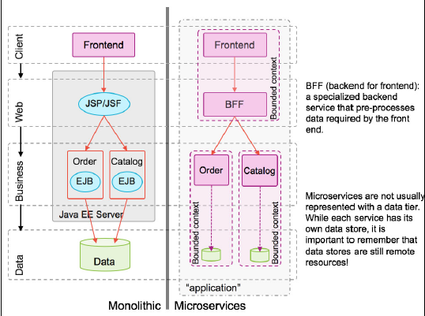
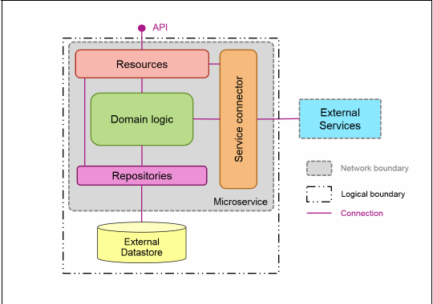
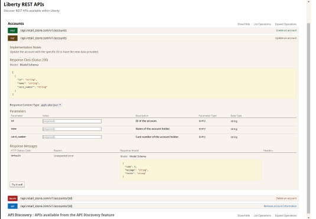

# 在 Java 中创建微服务
识别和创建组成应用程序的微服务

**标签:** Java,云计算,反应式系统,微服务

[原文链接](https://developer.ibm.com/zh/articles/j-cn-java-and-microservice-2/)

IBM Developer

发布: 2017-02-22

* * *

创建由微服务组成的应用程序的前景给所有语言都带来了一些疑问：

- 微服务应该有多大？
- 对于传统的集中化治理，做一件事的专注服务的概念有何意义？
- 微服务会如何处理传统的数据建模方式？

本章将重点介绍如何识别和创建组成应用程序的微服务，特别是如何将识别的候选服务转换为 RESTful API，然后在 Java 中实现它。

## 示例应用程序

我们使用两个示例应用程序来帮助解释相关概念和提出观点：

### 在线零售店

在线零售店是一个在讨论应用程序架构时常用的示例。本书将考虑一组微服务，它们共同构建了一个应用程序，用户可在其中浏览产品并下单。

该架构包含以下服务：

- Catalog 服务：包含可在店内出售的产品的信息。
- Account 服务：管理商店的每个帐户的数据。
- Payment 服务：处理支付。
- Order 服务：管理当前订单列表，执行订单生命周期中需要的任务。

### Game On!

Game On! 是一个可扩展的、基于文本的冒险游戏，是使用微服务构建的。不同于在线商店，Game On! 是一个真实的应用程序，可在 GitHub7 上获得它的代码，而且有一个 GitBook8 详细介绍了创建该游戏所使用的架构和工具。这个特意选择的非标准示例用于与传统企业应用程序形成对比。

该游戏基本上讲是一个由互联房间组成的无限二维网络。

房间由第三方提供（例如大会或研讨会中的开发人员）。一组核心服务提供了一致的用户体验。用户登录并使用简单的文本命令来与房间交互，并在房间之间穿梭。同步和异步通信模式都可以应用。玩家、核心服务和第三方服务之间的交互也受到保护。

## Java 平台和编程模型

新 Java 应用程序应至少应使用 Java 8，而且应采用新语言功能，比如 lambdas、并行操作和流。使用注释可以通过消除样板文件简化代码库，但可能产生一种主观观点”真是太神奇了”。尝试在代码清洁度与可维护性之间建立平衡。

要创建具有完美功能的微服务，只有使用低级 Java 库。但是，通常建议有一个关注点来为常见的横切关注点 (cross-cutting concerns) 提供合理的基础支持。它使服务的代码库能专注满足功能需求。

#### Spring Boot

Spring Boot 提供的微服务创建机制基于对应使用哪些技术的主观看法。Spring Boot 应用程序是 Spring 应用程序，它们使用了该生态系统所独有的编程模型。

Spring Boot 应用程序可打包为以应用服务器托管的应用程序形式运行，或者打包为包含依赖关系和某种嵌入式服务器（通常是 Tomcat）的可运行 .jar 文件。Spring Boot 强调约定优于配置，结合使用注释和类路径发现来实现额外的功能。

Spring Cloud 是第三方云技术与 Spring 编程模型之间的一组集成。其中一些是 Spring 编程模型与第三方技术之间的集成。在某些少见的情况下，Spring Cloud 在 Spring 编程模型以外的地方很有用，比如 [Spring Cloud Connectors Core](http://cloud.spring.io/spring-cloud-connectors/spring-cloud-connectors.html) 。

#### Dropwizard

Dropwizard 是另一种在 Java 中创建微服务的技术。它也是一种主观方法，其预先选择的技术组合通过附加功能增强了一个嵌入式的 Jetty servlet 容器。Dropwizard 支持的技术集合相对较小，但第三方或社区提供了插件来填补空白。它们的一些功能非常不错，特别是它们对应用程序指标的支持。

#### Java Platform, Enterprise Edition

Java Platform, Enterprise Edition (Java EE) 是一种构建企业应用程序的开放、社区驱动的标准。

Java EE 技术适合创建微服务，尤其是 Java API for RESTful Web Services (JAX-RS) 和 Java EE 上下文与依赖注入 (CDI)。两种规范都使用了注释，用于支持依赖注入、轻量型协议和异步交互模式。Java EE7 中的并发性实用程序进一步提供了一种简单机制，以容器友好的方式使用反应式库，比如 [RxJava](https://github.com/ReactiveX/RxJava) 。

现代 Java EE 应用服务器（WebSphere Liberty、Wildfly、TomEE、Payara）轻松满足了无痛处理应用服务器的要求。所有这些服务器都可在自动化构建过程中生成不可变的、自成一体的、轻量型的工件，而不需要额外的部署步骤。此外，WebSphere Liberty 等可组合的服务器允许显式声明规范级依赖关系，能够升级运行时而不向应用程序引入兼容性问题。

应用程序可使用更少的 Java EE 技术，并与 WebSphere Liberty 等应用服务器打包在一起，这些应用服务器能调整运行时来满足应用程序的需求。此过程可得到干净的应用程序，这些应用程序能在环境之间移动，而无需更改代码、模拟服务或自定义测试工具。

本文中的示例主要使用了 Java EE 技术，比如 JAX-RS、CDI 和 Java Persistence API (JPA)。这些规范很容易使用，而且受到广泛支持，无需依靠特定于供应商的方法。

## 带版本的依赖项

Apache Maven 或 Gradle 等构建工件提供了定义和管理依赖关系版本的轻松机制。显式声明版本，可确保工件在生产环境中与在测试环境中一样运行。

一些工具让创建使用 Maven 和 Gradle 的 Java 应用程序变得更容易。这些工具接受一些技术作为输入并输出项目结构，项目结构中包含构建和发布或部署最终工件所需的 Maven 或 Gradle 构建工件：

- [IBM 开发者工具](https://www.ibm.com/cloud/cli)
- [Spring Initializr](http://start.spring.io/)
- [Wildfly Swarm Project Generator](https://wildfly-swarm.gitbooks.io/wildfly-swarm-users-guide/content/index.html)

## 识别服务

第 1 部分”概述”中已提到，微服务的描述中使用到了”小”这个词。服务的大小应反应在它的工作范围上，而不是它的代码库大小。微服务应拥有较小且专注的工作范围：它应该只做一件事，并将这件事做好。Eric Evans 撰写的图书《领域驱动设计》中描述了许多概念，在决定如何将应用程序构建为不同部分的组合时，这些概念很有帮助。接下来的几节将引用在线零售店和 Game On!，解释为什么这些概念对长期开发和维护微服务架构很有用。

### 应用领域驱动设计原理

在领域驱动设计中，领域是一个特定的支持或活动区域。模型是随着对领域的理解的变化，对不断出现的领域的重要方面的一种抽象。此模型随后被用于构建跨团队通信解决方案。

在整体式系统中，整个应用程序仅有一个统一的领域模型。如果应用程序一直很简单，此概念会很有用。当应用程序的不同部分以不同方式使用相同元素时，使用单个统一模型会变得不合理。

例如，线零售店示例中的 Catalog 服务专注于待售商品，包括描述、部件号、产品信息、图片等。相反，Order 服务专注于发票，使用最少的信息表示商品，或许仅包含部件号、摘要和计算的价格。

有界上下文允许将一个领域细分成独立的子系统。然后，每个有界上下文可以拥有自己的领域概念模型。继续查看上面的示例，Catalog 和 Order 服务分别拥有最适合其服务需求的独立商品表示。此系统通常很有效，但是，如果两个服务拥有同一个概念的不同表示，那么它们如何与其他服务共享信息呢？

上下文映射（包括开发和使用通用语言）可帮助确保正开发各个服务的不同团队理解应如何构成整个应用。如果为微服务应用程序建模领域，在确定组成系统的各部分时，一定不要考虑到类或接口层面。对于第一个类，在整体上保持粗粒度级别即可。允许开发各个服务的各个团队在自己的有界上下文内工作，以扩充细节。

#### Game On! 中的通用语言

为了提供语言的重要性的具体示例，我们会绕一个小弯，先讲述一下 Game On! 是如何开发的。该游戏的构建目的是，让开发人员更容易直接试验微服务概念，将快速入门示例的即时满足与考虑微服务架构的更复杂方面的不同方式相结合。Game On! 是一种基于文字的冒险游戏，开发人员可在其中添加各个服务（房间）来扩展游戏。

该游戏最初被比喻为一家酒店，其中包含 3 种基本元素：

- Player 服务处理所有与游戏玩家相关的工作
- 初始 Room 服务是开发人员将构建的房间的占位符
- 还有一个名为 Concierge 的额外服务，创建它的最初目的是帮助玩家从一个房间过渡到另一个房间

在允许系统的这 3 部分不断演变后，我们发现开发该游戏的不同人对 Concierge 的应有用途有不同的理解。Concierge 无法找到类比，因为它太模糊了。Concierge 被一个新的 Map 服务取代。Map 是一个房间位于游戏中何处的终极真相之源，单从名称就能清楚了解它的用途。

### 将领域元素转换为服务

领域模型包含一些明确定义的类型：

- **实体** 是一个对象，它有固定的身份，具有明确定义的”连续性线索”或生命周期。通常列举的示例是一个 Person（一个实体）。大多数系统都需要唯一地跟踪一个 Person，无论姓名、地址或其他属性是否更改。
- **值对象** 没有明确定义的身份，而仅由它们的属性定义。它们通常不可变，所以两个相等的值对象始终保持相等。地址可以是与 Person 关联的值对象。
- **集合** 是一个相关对象集群，这些对象被看作一个整体。它拥有一个特定实体作为它的根，并定义了明确的封装边界。它不只是一个列表。
- **服务** 用于表示不是实体或值对象的自然部分的操作或活动。

#### Game On! 中的领域元素

该游戏是围绕”玩家”这一明显实体构建的。玩家有一个固定 ID，寿命与玩家的账户一样长。玩家实体有一组简单的值对象，包括玩家的用户名、喜欢的颜色和位置。

游戏的另一个重要元素是房间，房间不会如此明显地映射到实体。一方面，可以不断通过不同方式更改房间属性。这些可更改的属性通过一个值对象表示，该值对象包含一些属性，比如房间的名称、它的入口描述和它的公开末端。此外，房间在地图中的位置可能不断改变。如果您将每个可能的房间位置视为一个站点，您最终会认为地图是唯一站点实体的集合，其中每个站点与可变化的房间属性相关联。

#### 将领域元素映射到服务

要将领域元素转换为服务，可按照以下一般准则来完成此操作：

1. 使用值对象的表示作为参数和返回值，将集合和实体转换为独立的微服务。
2. 将领域服务（未附加到集合或实体的服务）与独立的微服务相匹配。
3. 每个微服务应处理一个完整的业务功能。

本节将探讨此流程，将这些准则应用到上面列出的 Game On! 的领域元素，如图 1 所示。

##### 图 1\. Player 和 Map 服务


Player 服务提供资源 API 来处理玩家实体。除了标准的创建、读取、更新和删除操作之外，Player API 还提供了额外的操作来生成用户名和喜欢的颜色，以及更新玩家的位置。

Map 服务提供资源 API 来处理站点实体，允许开发人员管理游戏中的房间服务注册。Map 提供了适用于有界上下文内各个站点的创建、检索、更新和删除操作。Map 服务中的数据表示不同于在该服务外共享的数据表示，因为一些值是基于站点在地图中的位置来计算的。

游戏中还有一些服务没有讨论：

1. Mediator：Mediator 服务是从 Player 服务的第一个实现分裂出来的。

它的唯一责任是在以下 WebSocket 连接之间进行调解：

- 客户端设备与 Mediator 之间的一个长时间运行的连接。
- Mediator 与目标独立房间服务之间的另一个连接。

从领域建模的角度讲，Mediator 是一个领域服务。

1. Rooms：各个房间服务呢？开发人员建立他们自己的房间实例。对于建模用途，可将房间（甚至您自己的房间）视为外部作用物。

### 应用程序和服务结构

整体式 Java EE 应用程序通常是分层（客户端、Web、业务和数据）构建和部署的，拥有长期运行的应用服务器，以便为应用程序的不同部分托管 Web 存档（WAR 文件）、企业存档（EAR 文件）或同时托管二者，如图 2 的左侧所示。命名和打包约定变得很重要，因为用于应用程序的不同部分的 JSP、JSF、servlet 和 EJB 会部署到同一个应用服务器。通用的数据存储提供了一致的数据表示，但也在如何表示和存储数据上施加了一些限制。

##### 图 2\. 整体式应用程序或微服务应用程序中包含的 Order 和 Catalog 服务



微服务架构可能仍拥有这些应用程序分层，但每层的元素可能由在独立进程中运行的独立服务提供，如图 2 的右侧所示。请注意以下细节：

- 通常使用前端的后端模式来支持 17 种具体前端的专门行为。
- 比如针对特定设备而优化，或者在 Web 应用程序中提供额外的功能。
- 尽管每个服务都拥有并维护自己的数据存储，但请记住数据存储本身是一个独立服务。

不是所有微服务应用程序都将拥有所有这些元素。例如，使用 JSP 或 JSF 的 Web 应用程序，或者在后端运行的解释脚本（比如 PHP）。它们可被视为”前端的后端”，尤其是在它们与在浏览器中运行的 JavaScript 有密切关系时。但是，（在编写本书时）Game On! 没有使用前端的后端模式。JavaScript 单页 Web 应用程序是一组来自某个独立服务的静态资源。该应用程序随后在浏览器中运行，并直接调用后端 API。

#### 内部结构

在服务内组织您的代码，以便提供明确的关注点分离，以方便测试。对外部服务的调用应与领域逻辑分开，后者也应与特定于编组数据的逻辑/支持性数据服务分开。

图 3 展示了微服务架构的一个简化版本。此架构将领域逻辑与任何与外部服务交互或理解外部服务的代码分开。该架构类似于端口和适配器 (Hexagonal) 架构，也类似于 Toby Clemson 在”微服务架构中的测试战略”中提供的方法。

##### 图 3\. 微服务的内部结构



示例内部结构考虑了以下元素：

- 资源将 JAX-RS 资源向外部客户端公开。这一层处理对请求的基本验证，然后将信息传递给领域逻辑层。
- 作为一个一般性概念，领域逻辑具有许多形式。在”边界-实体-控制模式”中，领域逻辑表示实体本身，具有参数验证、状态更改逻辑等。
- 存储库是可选的，但可在核心应用程序领域逻辑与数据存储（如果存在）之间建立有用的抽象。此配置使得在更改或替换支持性数据存储时，无需大量更改领域逻辑。
- 服务连接器类似于存储库抽象，它们封装了与其他服务的通信。这一层被用作一个方面或”反腐败”层，以保护领域逻辑免受对外部资源 API 的更改的影响，或者在 API 连接格式与内部领域模型构造之间转换。

此架构要求您在创建类时遵循一些规则。例如，您用于实现服务的每个类应执行以下任务之一：

- 执行领域逻辑
- 公开资源
- 向外调用其他服务
- 向外调用数据存储

这些是代码结构的一般性建议，不必严格遵守。重要目的是减少执行更改的风险。举例而言，如果您想更改数据存储，只需更新存储库层。您不需要搜索每个类来查找调用数据存储的方法。如果外部服务的 API 发生更改，这些更改也能以类似方式限制在服务连接器内。这种分离进一步简化了测试。

### 使用共享库还是新服务？

敏捷和面向对象方法中的一个共同原则是”不要复制自己”(DRY)。多次复制相同的代码，通常表明应该将该代码转换为可重用的”东西”。在传统的面向对象方法中，这个东西是一个对象，也有可能是一个实用程序类。但是，具体来讲，在无处不在的实用程序类中，严格应用 DRY 原则会导致无法获得干净地解耦的模块。

微服务开发让这种朝无头绪代码的退步变得更困难。硬性的流程边界使过度共享实现变得更加困难，但不幸的是，仍有可能实现。那么如何处理公共代码？

- 接受可能存在一定冗余性的代码
- 将公共代码包装在一个共享的、带版本的库中
- 创建一个独立服务

根据代码的性质，可能最好继续接受冗余代码。考虑到能够且应该独立演变每个服务，所以微服务的各种需求可能改变最初的公共代码的外观。为数据传输对象创建共享库非常具有诱惑，这些库属于瘦类，可充当更改连接传输格式（通常是 JSON）的工具。此技术可消除大量样板代码，但它可能会泄漏实现细节和引入耦合。

通常推荐创建客户端库来减少重复，让 API 的使用变得更容易。此技术一直是数据存储的标准，包括提供了基于 REST 的 API 的新 NoSQL 数据存储。客户端库可能对其他服务也很有用，尤其是使用二进制协议的服务。但是，客户端库会在服务使用者与提供者之间引入耦合。没有有效维护库的平台或语言，可能很难使用该服务。

共享库也可用于确保一致地处理潜在的复杂算法。举例而言，对于 Game On!，可使用一个共享库来封装请求签名和签名验证。此配置使您能简化系统内的服务，确保采用一致的方式计算各个值。但是，我们没有为所有语言提供一个共享库，所以一些服务仍需要努力以一致方式进行计算。

共享库何时应是真正的独立服务？独立服务不依赖于使用的语言，可单独扩展，而且允许更新立即生效，而不需要与使用者协调更新。独立服务还增加了额外的处理负担，会遇到服务间通信的所有问题。如何进行权衡是一种主观判断，但如果一个库开始需要支持性服务，这通常表明它是一个独立的服务。

## 创建 REST API

良好的微服务 API 是什么样的？设计 API 并创建文档，对确保它有用且实用很重要。遵守约定并使用良好的版本策略，可让 API 更容易理解和不断演变。

### 自上而下还是自下而上？

在从头创建服务时，既可以首先定义所需的 API，然后编写代码来实现它们，也可以首先编写服务的代码，然后通过实施获得 API。

基本来讲，第一个选项始终更好。微服务不会孤立运行。要么是它调用某个东西，要么是某个东西调用它。微服务架构中的服务之间的交互应明确定义和记录。对于领域驱动设计，API 是有界上下文之间的已知交叉点。

Alan Perlis 曾说过，”除了第一次，每个功能都应自上而下构建。”当执行概念证明时，您可能不清楚 API 提供哪些功能。在早期，可编写一些代码，帮助完善关于您尝试构建什么服务的想法。但是，在更好地了解服务需要执行的操作后，您应该回过头来完善领域模型，并定义与之匹配的外部 API。

### 创建 API 的文档

使用工具创建 API 的文档，更容易确保发布的文档的准确性和正确性，然后可在与 API 使用者的讨论中使用这些文档。此文档也可用于使用者驱动的契约测试。

Open API Initiative (OAI) 是一个专注于标准化 RESTful API 描述的联盟。OpenAPI 规范基于 Swagger，后者定义了用于创建 RESTful API 的 Swagger 表示的元数据结构和格式。通常在单个可移植文档中表达该定义（约定的文件为 swagger.json，但也可使用 swagger.yaml 来支持 YAML）。Swagger 定义可使用可视编辑器创建，也可基于应用程序中的扫描注释来生成这个定义。它可进一步用于生成客户端或服务器存根。

WebSphere Application Server Liberty 中的 apiDiscovery 功能将对 Swagger 定义的支持集成到运行时中。它在 JAX-RS 应用程序中自动检测和扫描注释，并使用注释动态生成 Swagger 定义。如果存在 Swagger 注释，则包含来自这些注释的信息来创建可与代码一起维护的信息文档。可以使用系统提供的端点来公开生成的这个文档，如图 4 所示。

##### 图 4\. apiDisovery-1.0 功能提供的创建 API 文档的用户界面



Swagger API 定义（尤其是 Web 界面中呈现的定义）对可视化 API 的外部使用者视图很有用。从这个外部视图开发或设计 API，有助于确保一致性。这个外部视图符合使用者驱动契约12，后者是一种提倡在设计 API 时专注于使用者期望的模式。

### 使用正确的 HTTP 动词

REST API 应为创建、检索、更新和删除操作使用标准 HTTP 动词，而且应特别注意操作是否幂等（可以安全地重复多次）。

POST 操作可用于创建 (C) 资源。POST 操作的明显特征是它不是幂等的。举例而言，如果使用 POST 请求创建资源，而且启动该请求多次，那么每次调用后都会创建一个新的唯一资源。

GET 操作必须是幂等的且不会产生意外结果。它们不应产生副作用，而且仅应用于检索 (R) 信息。具体来讲，带有查询参数的 GET 请求不应用于更改或更新信息（而应使用 POST、PUT 或 PATCH）。

PUT 操作可用于更新 (U) 资源。PUT 操作通常包含要更新的资源的完整副本，使该操作具有幂等性。

PATCH 操作允许对资源执行部分更新 (U)。它们不一定是幂等的，具体取决于如何指定增量并应用到资源上。例如，如果一个 PATCH 操作表明一个值应从 A 改为 B，那么它就是幂等的。如果它已启动多次而且值已是 B，则没有任何效果。对 PATCH 操作的支持仍不一致。例如，Java EE7 中的 JAX-RS 中没有 @PATCH 注释。

毫无意外，DELETE 操作用于删除 (D) 资源。删除操作是幂等的，因为资源只能删除一次。但是，返回代码不同，因为第一次操作将成功 (200)，而后续调用不会找到资源 (204)。

### 创建机器友好的描述性结果

富于表情的 REST API 应仔细考虑从启动的操作返回什么信息。考虑到 API 是由软件而不是用户启动的，所以应采用最有效和最高效的方式将信息传达给调用方。

举例而言，过去的常见做法是将状态代码 200 (OK) 与解释错误消息的 HTML 一起返回。尽管此技术可能适合查看网页的用户（HTTP 状态代码已对他们隐藏），但机器很难确定其请求是否成功。

HTTP 状态代码应相关且有用。在一切正常时使用 200 (OK)。当没有响应数据时，使用 204 (NO CONTENT)。除了该技术之外，对于导致创建一个资源的 POST 请求，还应使用 201 (CREATED)，无论是否有响应内容。当同时执行的更改发生冲突时，使用 409 (CONFLICT)；当参数格式错误时，返回 400 (BAD REQUEST)。HTTP 状态代码集合很可靠，应使用它来尽可能明确地表达请求的结果。有关更多信息，请访问 [网站](https://www.w3.org/Protocols/rfc2616/rfc2616-sec10.html)

您还应该考虑要在响应中返回哪些数据，以保持高效通信。例如，当使用 POST 请求创建资源时，响应应在一个 Location 标头中包含新创建资源的位置。不需要在响应中返回该资源的其他信息。但实际上，创建的资源通常包含在响应中，因为这消除了调用方发出额外的 GET 请求来抓取所创建资源的需求。同样的原则也适用于 PUT 和 PATCH 请求。

### 资源 URI 和版本控制

人们对 RESTful 资源 URI 的某些方面有着不同的看法。一般而言，资源应该是名词而不是动词，端点应该是复数。此技术可得到创建、检索、更新和删除操作的清晰结构：

POST /accounts创建一个新项目GET /accounts检索一个项目列表GET /accounts/16检索一个具体项目PUT /accounts/16更新一个具体项目PATCH /accounts/16更新一个具体项目DELETE /accounts/16删除一个具体项目

一般共识是，保持 URI 中的内容尽量简单。如果创建一个应用程序来跟踪一种特定的啮齿动物，URI 将为 /mouses/ 而不是 /mice/，即使后者更让您害怕。

关系是通过嵌套 URI 来实现建模的，例如，用于管理与一个帐户关联的凭证的 /accounts/16/credentials。

如果与资源关联的操作应产生什么结果并未达成一致，该操作就不应包含在这种普通结构中。管理这些操作并没有唯一的正确方式。请选择最适合 API 使用者的方式。

例如，在 Game On! 中，Player 服务提供帮助生成用户名和最喜欢的颜色的操作。它也可以批量检索游戏中每个玩家的位置。选择的结构反映了涵盖所有玩家的操作，同时仍然允许您处理特定玩家。此技术有其局限性，但阐明了要点：

GET /players/accounts 检索所有玩家的列表

POST /players/accounts 创建一个新玩家

GET /players/accounts/{id} 检索一个具体玩家

GET /players/accounts/{id}/location 检索一个具体玩家的位置

PUT /players/accounts/{id}/location 更新一个具体玩家的位置

GET /players/color 返回 10 种生成的颜色

GET /players/name 返回 10 个生成的名称

GET /players/locations 检索所有玩家的位置

#### 版本控制

微服务的一个主要优势是，允许服务独立地演变。考虑到微服务会调用其他服务，这种独立性需要引起高度注意。您不能在 API 中制造破坏性更改。

接纳更改的最简单方法是绝不破坏 API。如果遵循稳健性原则，而且两端都保守地发送数据，慷慨地接收数据，那么可能很长一段时间都不需要执行破坏性更改。当最终发生破坏性更改时，您可选择构建一个完全不同的服务并不断退役原始服务，原因可能是领域模型已进化，而且一种更好的抽象更有意义。

如果需要对现有服务执行破坏性的 API 更改，请决定如何管理这些更改：

- 该服务是否会处理 API 的所有版本？
- 您是否会维护服务的独立版本，以支持 API 的每个版本？
- 您的服务是否仅支持 API 的最新版本，依靠其他适应层来与旧 API 来回转换？

在确定了困难部分后，如何在 API 中反映该版本是更容易解决的问题。通常可通过 3 种方式处理 REST 资源的版本控制：

- 将版本放入 URI 中
- 使用自定义请求标头
- 将版本放在 HTTP Accept 标头中，并依靠内容协商

#### 将版本放入 URI 中

将版本添加到 URI 中，这是指定版本的最简单方法。此方法有以下优点：

- 很容易理解。
- 很容易在您的应用程序中构建服务时实现。
- 与 API 浏览器工具（比如 Swagger）和命令行工具（比如 curl）兼容。

如果将版本放在 URI 中，版本应该会应用于整个应用程序，所以使用 /api/v1/accounts 而不是 /api/accounts/v1。超媒体即应用状态引擎 (Hypermedia as the Engine of Application State, HATEOAS) 是一种向 API 使用者提供 URI 的方式，可以让使用者无需自行负责构造 URI。举例而言，出于这个原因，GitHub 在其响应中提供了超媒体 URL。13如果不同的后端服务可能在其 URI 中拥有独立的、不同的版本，则很难（甚至无法）实现 HATEOAS。

如果决定将版本放在 URI 中，那么您可以通过不同方式管理它，具体方式从某种程度上讲取决于在系统中路由请求的方式。但是，暂时假设您的网关代理将外部 /api/v1/accounts URI 转换为 /accounts/v1，后者映射到您的服务提供的 JAX-RS 端点。在这种情况下，/accounts 是一个自然的上下文根。完成转换后，您可以将版本包含在 @ApplicationPath 注释中，如示例 1 所示，这在应用程序仅支持一个 API 版本时非常有用。

示例 1 使用 @ApplicationPath 注释向 URI 添加版本

```
package retail_store.accounts.api;
      @ApplicationPath("/v1")
      public class ApplicationClass extends Application {}

```

Show moreShow more icon

如果服务要支持应用程序的多个版本，也可以将版本推送到 @Path 注释，如示例 2 所示。

示例 2 @ApplicationPath 定义了一个 REST 端点而不更改 URI

```
package retail_store.accounts.api.v1;
      @ApplicationPath("/")
      public class ApplicationClass extends Application {}

```

Show moreShow more icon

示例 3 给出了添加到注释中的版本。

示例 3 使用 @Path 注释将版本添加到 API 中

```
package retail_store.accounts.api.v1;
      @Path("v1/accounts")
      public class AccountsAPI {
      @GET
      @Path("{id}")
      @Produces(MediaType.APPLICATION_JSON)
      public Response getAccounts(@PathParam("id") String id) {
      getId(id);
     ......
      }
      }

```

Show moreShow more icon

对将版本包含在 URL 中的一种反对观点是，HTML 标准严格规定 URL 应表示实体，如果表示的实体未更改，那么 URL 也不应更改。

另一种担忧是，将版本放在 URI 中需要使用者更新其 URI 引用。通过允许发出不带版本的请求，然后将请求映射到最新版本，可在一定程度上解决此担忧。但是，在最新版本发生改变时，此方法容易产生意外行为。

#### 添加自定义请求标头

可以添加自定义请求标头来表明 API 版本。在将流量路由到特定后端实例时，路由器和其他基础架构可能会考虑使用自定义标头。但是，此机制不容易使用，原因与 Accept 标头不容易使用相同。此外，它是一个仅适用于您的应用程序的自定义标头，这意味着使用者需要学习如何使用它。

#### 修改 Accept 标头以包含版本

Accept 标头是一个定义版本的明显位置，但它是最难测试的地方之一。URI 很容易指定和替换，但指定 HTTP 标头需要更详细的 API 和命令行调用。

许多文章介绍了所有 3 种方法的优缺点。Troy Hunt 的这篇博客文章是一个不错的起点： [Your API versioning is wrong, which is why I decided to do it 3 different wrong ways](https://www.troyhunt.com/your-api-versioning-is-wrong-which-is/)

以下是本章得出的最重要结论：

- 从使用者角度设计 API。
- 拥有处理 API 更改的战略。
- 在应用程序中的所有服务中使用一致的版本控制技术。

## 结束语

本文重点介绍了如何在 Java 中创建微服务并使用它。下一部分将更深入的探讨微服务的演化架构。好了，学习愉快，下次再见！