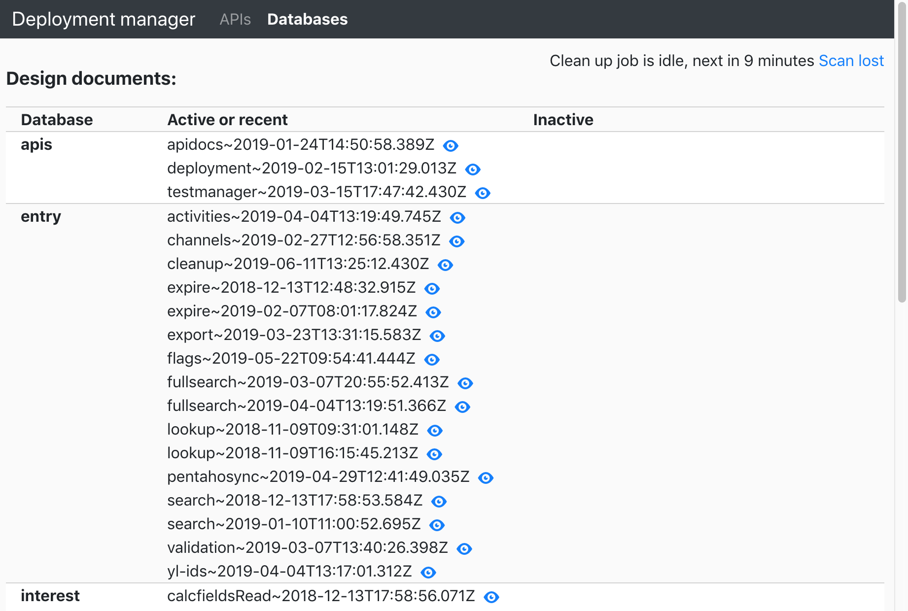

# 在 Kubernetes 中自动部署 pod 依赖项
将新数据库设计文档或 API 更新的部署与相关应用程序代码同步

**标签:** DevOps,Docker,Istio,Kubernetes,云计算,容器,微服务

[原文链接](https://developer.ibm.com/zh/articles/automating-deployment-pod-dependencies-in-kubernetes/)

Ondrej Lehota

发布: 2019-08-20

* * *

您是否经常需要将新设计文档或 API 更新的部署与相关应用程序代码进行同步？本文受到想要自动部署 Kubernetes pod 依赖项的 DevOps 团队的启发。

## 前提条件

为充分利用本文，您应具备 Kubernetes、容器、持续部署与集成以及 Cloudant 设计文档方面的一般常识。

## 预估时间

阅读本文大约需要 15 分钟。

## 在实现 DevOps 的 Ops 部分自动化方面，我们能走多远?

作为开发者，我希望掌控一切。我想要直接在自己的应用程序代码中定义对外部依赖项的更改。我想要部署对自己的 NodeJS 或 Java 应用程序的更新，并看它与旧版本一起推出。我想要避免宕机，避免在 Web 服务原先所需数据库视图与当前所需视图之间出现冲突。

总而言之，云自动化的趋势使 DevOps 团队得以掌控端到端部署的所有权。

**免费试用 IBM Cloud**

利用 [IBM Cloud Lite](https://cocl.us/IBM_CLOUD_GCG)
快速轻松地构建您的下一个应用程序。您的免费帐户从不过期，而且您会获得 256 MB 的 Cloud Foundry 运行时内存和包含
Kubernetes 集群的 2 GB 存储空间。 [了解所有细节](https://www.ibm.com/cloud/blog/announcements/introducing-ibm-cloud-lite-account-2) 并确定如何开始。

幸运的是，Kubernetes 正在采用非常直截了当的流程来执行滚动更新。通过结合使用持续部署和持续集成工具（如 [Travis CI](https://travis-ci.org/) 或面向 IBM Cloud 的 [Toolchain](https://cloud.ibm.com/devops/create?cm_sp=ibmdev-_-developer-articles-_-cloudreg) 开发者工具），此流程的设置变得越来越简单。一天内多次部署现已成为常态。但是，将定制数据库或 API 更新与应用程序代码同步有时并不那么容易。您经常需要对部署进行编排。

本文描述了使用 Kubernetes [初始化容器](https://kubernetes.io/docs/concepts/workloads/pods/init-containers/) 对 pod 依赖项进行同步的方法之一。

### 自动化范围

像微服务这样的应用程序通常需要一组有限的依赖项，例如，自身的存储和 API 定义。存储或 API 相关升级通常会演变成一项例行工作，因此迫切需要实现自动化。Cloudant 设计文档更新就是一个典型例证。持续部署高可用性应用程序的关键就在于，确保在升级服务的同时提供更新的视图。

在具有以下类型的依赖项时，适合使用自动部署流程：

- 数据库（Cloudant、对象存储）
- 数据库设计文档（索引、视图）
- 种子文档
- API (Swagger)
- API 变更日志
- 自动集成测试

所有这些依赖项的配置均可存储在应用程序代码存储库中，并打包到 Docker 镜像中。

注：所谓配置，我指的是代码，而非凭证。凭证必须作为环境变量注入，或者通过配置服务来提供。

参见以下 `config` 目录示例结构：

```
config
│ cloudant
│ │ {databaseSuffixOrFullName}
│ │ │ designs
│ │ │ │ {designName}.json
│ │ │ seeds
│ │ │ │ {seedName}.json
│ │ parameters.json (optional)
│ apis
│ │ {apiName}
│ │ │ {version}.yaml
│ │ │ {version}.md
│ │ │ {version}.test.json
│ │ │ {version}.test.js

```

Show moreShow more icon

我们是否真的需要通过应用程序代码存储所有这些信息？不用，但完全掌控所有部分能够让开发者充分摆脱拘束。完全自包含的服务让您能够安心无虞，没有任何依赖项会在不同服务版本之间造成冲突。

### 初始化容器：Kubernetes 对应用程序依赖项的应答

在 Kubernetes 中，建议通过 [初始化容器](https://kubernetes.io/docs/concepts/workloads/pods/init-containers/) 来安装应用程序依赖项。初始化容器是在 pod 部署中定义的，这些容器可阻止应用程序启动，直至它们成功运行为止。

在如下基本示例中，初始化容器创建了一个全新的 Cloudant 数据库：

```lang-yaml
apiVersion: v1
kind: Pod
metadata:
name: app
spec:
containers:
  - name: app
    image: registry.ng.bluemix.net/services/app:v1.0.1
    ports:
    - containerPort: 8080
initContainers:
  - name: deploy
    image: appropriate/curl
    command: [ "sh" ]
    args: [ "-c", "curl -X PUT $URL/dbname" ]
    env:
    - name: URL
      valueFrom:
        configMapKeyRef:
          name: config
          key: cloudantApiKeyUrl

```

Show moreShow more icon

但真正的依赖逻辑远比此更复杂，并且需要一个新的应用程序。我们将它称为 _“Deployment Manager”_。`initContainer` 脚本可以调用作为服务运行的 Deployment Manager，但自包含程度更高的方法就是在注册表中创建 Deployment Manager 作为另一个 Docker，并将其镜像集成到部署脚本或 Helm Chart 中。

部署文件将类似于：

```lang-yaml
apiVersion: v1
kind: Pod
metadata:
name: app
spec:
containers:
  - name: app
    image: registry.ng.bluemix.net/services/app:v1.0.1
    ports:
    - containerPort: 8080
initContainers:
  - name: deploy
    image: registry.ng.bluemix.net/utilities/deployment_manager:v0.0.1
    command: [ "sh" ]
    args: [ "-c", "cd /usr/src/app/;npm run start-as-init-container" ]
    env:
    - name: config
      valueFrom:
        configMapKeyRef:
          name: config
          key: config

```

Show moreShow more icon

### 如何在应用程序代码中保留所有依赖项输入

在上述示例中，Deployment Manager 需要通过环境变量获取所有输入。而此操作的目的是从应用程序代码中获取输入，也就是从应用程序容器中提取除凭证以外的所有输入。

Deployment Manager 初始化容器无法看到 pod 中的应用程序容器，并且也无法与之直接通信。要使此方法生效，主要技巧就是提前加载应用程序容器。然后，再将必要的输入提取到共享卷中，以供 Deployment Manager 以后使用。

以下示例显示了如何使用另一个初始化容器实现此目的：

```lang-yaml
apiVersion: v1
kind: Pod
metadata:
name: app
spec:
volumes:
    - name: deployment-volume
      emptyDir: {}
containers:
  - name: app
    image: registry.ng.bluemix.net/services/app:v1.0.1
    ports:
    - containerPort: 8080
    volumeMounts:
      - name: deployment-volume
        mountPath: "/init"
initContainers:
  - name: copy
    image: registry.ng.bluemix.net/services/app:v1.0.1
    command: [ "sh" ]
    args: [ "-c", "set -e;cp -v -r /usr/src/app/config/* /init/" ]
    volumeMounts:
      - name: deployment-volume
        mountPath: "/init"
  - name: deploy
    image: registry.ng.bluemix.net/utilities/deployment_manager:v0.0.1
    command: [ "sh" ]
    args: [ "-c", "cd /usr/src/app/;npm run start-as-init-container" ]
    env:
    - name: config
      valueFrom:
        configMapKeyRef:
          name: config
          key: config
    volumeMounts:
      - name: deployment-volume
        mountPath: "/init"

```

Show moreShow more icon

### 它为何行之有效

容器按顺序启动：

1. 名为 `copy` 的第一个初始化容器会加载应用程序镜像，但使用自定义复制命令来覆盖应用程序的常规启动方式。只要应用程序 Docker 镜像支持 `sh` 脚本，复制命令就可以将所有配置文件提取到 `/init` 路径下全新的 `deployment-volume` 共享卷中，然后退出。此时任何故障都会生成错误，并阻止执行后续步骤。

2. 下一个初始化容器就是您的 Deployment Manager 应用程序。它同样使用该共享卷，并从第一个容器留下的应用程序中查找所有必需的依赖项输入。`deploy` 容器会根据需要安装依赖项，时间不受限制。等到流程成功退出后，才会部署 pod。

3. 最后，主应用程序容器同样也会加载该共享卷。此步骤是必需的，因为 Deployment Manager 会生成一个 `init.json` 文件作为初始化的输出。初始化文件包含有关应用程序应使用的特定资源（例如，哪个 Cloudant 设计文件）版本的详细信息。


要使此流程可在多语言环境中复用，请使用 `config` 目录的标准化命名约定和结构。JSON 是输入和输出的理想格式之一，但您也可以使用其他格式。

以下示例显示了 `init.json` 输出：

```lang-json
{
"init": {
    "cloudant": {
      "channels": {
        "designs": {
          "search": "search~2019-06-04T13:19:49.745Z"
        },
        "seeds": {
          "taxonomy": "taxonomy"
        }
      }
    },
    "apis": {
      "search": {
        "v3": {
          "api": "API~channels~v3~2019-06-01T23:15:18.609Z"
        }
      }
    }
}
}

```

Show moreShow more icon

### 推出新应用程序

假定环境内当前正在运行的新版本 (V1.0.2) 应用程序中需要经过更新的 Cloudant 设计文档。

您不希望滚动更新多个 pod 期间发生任何宕机。因此，必须确保两个应用程序版本可同时运行。

这种情况意味着您无法只移除旧数据库和视图，而是首先需要创建新数据库和视图，并一直等到将更改应用于副本中的所有应用程序 pod 为止。然后，只有在成功部署后，才必须确保移除不使用的旧依赖项。

实际上，您需要为每个版本选择不同名称，例如，使用设计文档名称后添加的时间戳记后缀。

示例：V1.0.2 中的不同版本的 Cloudant 设计文档将替换 V1.0.1 所需的名为 `search` 的 Cloudant 设计文档。在数据库中安装名为 `search~2019-06-04T13:19:49.745Z` 的初始化文档。在安装 V1.0.2 时，Deployment Manager 应用程序会使用深层 `diff` 比较视图。如果发现与应用程序代码中的视图不匹配，那么它会安装名为 `search~2019-06-05T08:12:33.123Z` 的第二个版本。

推出期间，旧 pod 仍使用第一个设计文档，新 pod 则开始使用新的设计文档。pod 之间不存在冲突，无需宕机即可完成过渡。此外，如果应用程序需要回滚，那么适用同样的流程。每时每刻，每个 pod 都会使用其包含的视图代码，即它经过测试的视图代码。

### 清理

目前为止，一切都还不错。您已顺利分离了依赖项。但那些不再需要的依赖项该如何处理呢？

由于目标是实现完全自动化的系统，因此您需要知道所有 pod 当前正在使用的所有依赖项。考虑通过如下方法来跟踪正在使用的依赖项：

- 维护 Deployment Manager 所使用的依赖项日志。
- 根据请求公开应用程序所使用的依赖项。
- 对每一项资源设置到期时间，并要求定期更新。

您可以使用上述任意方法，只要它们便于从故障中恢复。但在大部分情况下，清理流程必须能够读取所有活动 pod 的列表，以确定是否仍需要已部署的依赖项。

根据需要，DevOps 团队可能会利用管理用户界面来监督清理流程，就像以下示例所示：



### 备用解决方案

您还可以使用持续部署和集成脚本从应用程序代码中提取出依赖项配置。随后，定制的管理器即可确保启动应用程序前依赖项已可用。

但是，使用初始化容器通常更高效。完全部署可能只需短短几秒钟即可完成，因为所有工作都在 Kubernetes 集群中直接进行，所有镜像都触手可及。此外，初始化容器还有一个明确无疑的优势，即任何 pod 都会在完整验证其所有依赖项之后才会启动。

## 结束语

在应用程序镜像中包含 pod 依赖项，可以显著简化应用程序的生命周期管理。在适用的依赖项可用并且升级和降级均可无缝进行后，应用程序才会启动。此建议方法可帮助 DevOps 团队将工作重心放在开发和实现业务价值上，而不是运营上。

参见 [Kubernetes 初始化容器](https://kubernetes.io/docs/concepts/workloads/pods/init-containers/)，了解更多信息。

## 致谢

感谢 Vojtech Bartos 提出 _复制_ 容器的构想。

本文翻译自： [Automate the deployment of pod dependencies in Kubernetes](https://developer.ibm.com/articles/automating-deployment-pod-dependencies-in-kubernetes/)（2019-07-02）