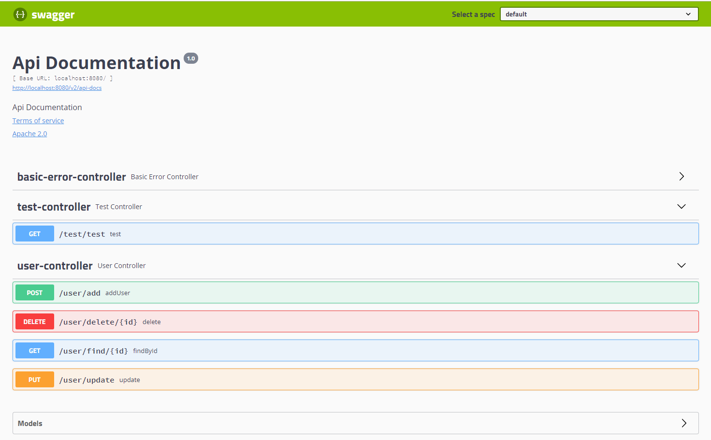
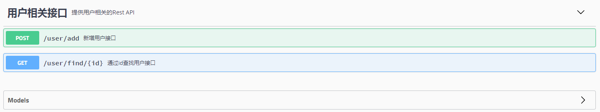
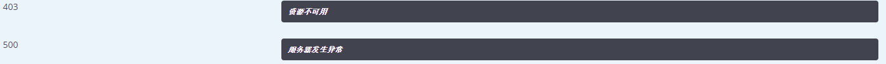
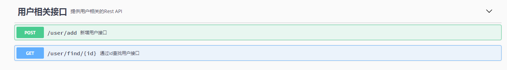
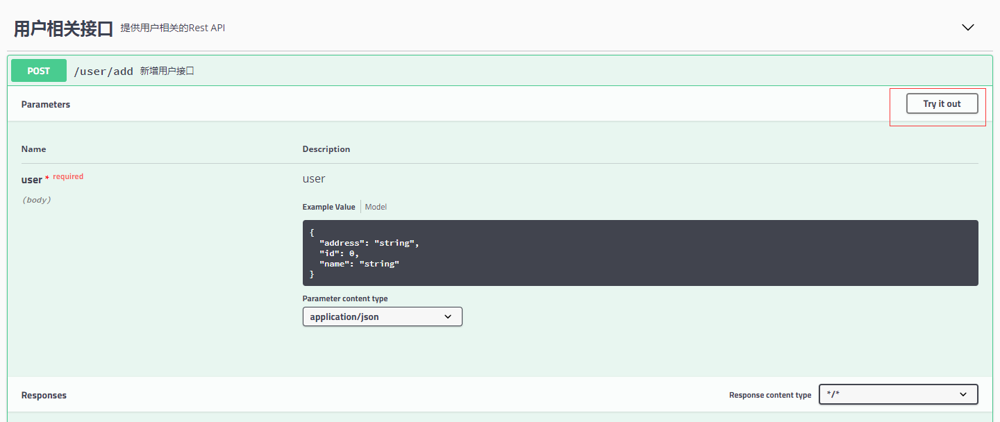
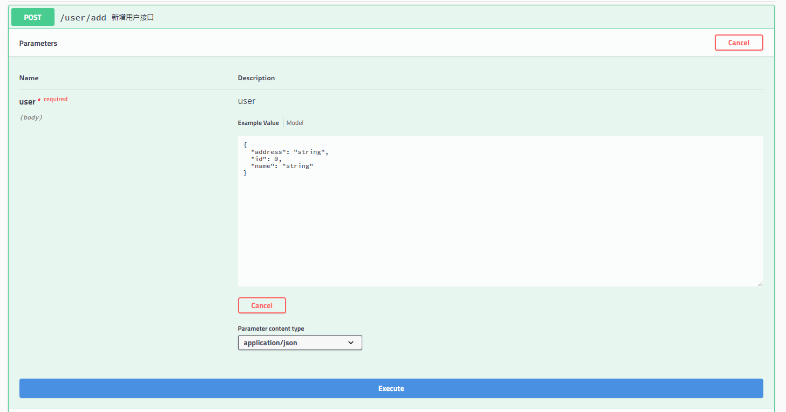

# 在 Spring Boot 项目中使用 Swagger 文档
使用 Swagger 自动生成文档、使用 Swagger 文档以及 Swagger 相关的一些高级配置和注解

**标签:** API 管理,DevOps,Java,Spring

[原文链接](https://developer.ibm.com/zh/articles/j-using-swagger-in-a-spring-boot-project/)

甘 朝阳

发布: 2019-03-18

* * *

Spring Boot 框架是目前非常流行的微服务框架，我们很多情况下使用它来提供 Rest API。而对于 Rest API 来说很重要的一部分内容就是文档，Swagger 为我们提供了一套通过代码和注解自动生成文档的方法，这一点对于保证 API 文档的及时性将有很大的帮助。本文将使用 Swagger 2 规范的 Springfox 实现来了展示如何在 Spring Boot 项目中使用 Swagger，主要包含了如何使用 Swagger 自动生成文档、使用 Swagger 文档以及 Swagger 相关的一些高级配置和注解。

## Swagger 简介

Swagger 是一套基于 OpenAPI 规范构建的开源工具，可以帮助我们设计、构建、记录以及使用 Rest API。Swagger 主要包含了以下三个部分：

1. Swagger Editor：基于浏览器的编辑器，我们可以使用它编写我们 OpenAPI 规范。
2. Swagger UI：它会将我们编写的 OpenAPI 规范呈现为交互式的 API 文档，后文我将使用浏览器来查看并且操作我们的 Rest API。
3. Swagger Codegen：它可以通过为 OpenAPI（以前称为 Swagger）规范定义的任何 API 生成服务器存根和客户端 SDK 来简化构建过程。

### 为什么要使用 Swagger

当下很多公司都采取前后端分离的开发模式，前端和后端的工作由不同的工程师完成。在这种开发模式下，维持一份及时更新且完整的 Rest API 文档将会极大的提高我们的工作效率。传统意义上的文档都是后端开发人员手动编写的，相信大家也都知道这种方式很难保证文档的及时性，这种文档久而久之也就会失去其参考意义，反而还会加大我们的沟通成本。而 Swagger 给我们提供了一个全新的维护 API 文档的方式，下面我们就来了解一下它的优点：

1. 代码变，文档变。只需要少量的注解，Swagger 就可以根据代码自动生成 API 文档，很好的保证了文档的时效性。
2. 跨语言性，支持 40 多种语言。
3. Swagger UI 呈现出来的是一份可交互式的 API 文档，我们可以直接在文档页面尝试 API 的调用，省去了准备复杂的调用参数的过程。
4. 还可以将文档规范导入相关的工具（例如 SoapUI）, 这些工具将会为我们自动地创建自动化测试。

以上这些优点足以说明我们为什么要使用 Swagger 了，您是否已经对 Swagger 产生了浓厚的兴趣了呢？下面我们就将一步一步地在 Spring Boot 项目中集成和使用 Swagger，让我们从准备一个 Spring Boot 的 Web 项目开始吧。

## 准备 Spring Boot Web 项目

在这一步我们将准备一个基础的 Spring Boot 的 Web 项目，并且提供后面所需要的所有 API。

### 创建一个空的 Spring Boot 项目

您可以通过 [Spring Initializr 页面](https://start.spring.io/) 生成一个空的 Spring Boot 项目，当然也可以下载 [springboot-pom.xml](https://github.com/ganchaoyang/spring-tutorial/blob/master/resources/springboot-pom.xml) 文件，然后使用 Maven 构建一个 Spring Boot 项目。项目创建完成后，为了方便后面代码的编写您可以将其导入到您喜欢的 IDE 中，我这里选择了 Intelli IDEA 打开。

### 添加依赖

由于创建的是一个 Web 项目，所以我们需要依赖 Spring Boot 的 Web 组件，只需要在 pom.xml 增加如下内容即可：

**清单 1\. 添加 Web 依赖**

```
<dependency>
    <groupId>org.springframework.boot</groupId>
    <artifactId>spring-boot-starter-web</artifactId>
</dependency>

```

Show moreShow more icon

### 编写接口

1. 首先我们创建三个包：`cn.itweknow.sbswagger.controller`、`cn.itweknow.sbswagger.testcontroller` 以及 `cn.itweknow.sbswagger.model`。
2. 在 controller 包下新建 `UserController.java` 类，在 `testcontroller` 包下新建 `TestController.java` 类，在 model 包下新建 `User.java` 类。
3. `UserController` 提供用户的增、删、改、查四个接口，`TestContrller` 提供一个测试接口，这里粘上 `UserController.java` 的代码，其余代码可以查看 [源码](https://github.com/ganchaoyang/spring-tutorial/tree/master/sb-swagger) 。

**清单 2\. UserController.java 代码**

```
@RestController
@RequestMapping("/user")
public class UserController {
    @PostMapping("/add")
    public boolean addUser(@RequestBody User user) {
        return false;
    }
    @GetMapping("/find/{id}")
    public User findById(@PathVariable("id") int id) {
        return new User();
    }
    @PutMapping("/update")
    public boolean update(@RequestBody User user) {
        return true;
    }
    @DeleteMapping("/delete/{id}")
    public boolean delete(@PathVariable("id") int id) {
        return true;
    }
}

```

Show moreShow more icon

## 集成 Swagger2

经过上面的步骤，我们已经拥有了五个接口，分别是:

1. /user/add：新增用户。
2. /user/find/{id}：根据 id 查询用户。
3. /user/update：更新用户。
4. /user/delete/{id}：根据 id 删除用户。
5. /test/test：测试接口。

下面我们将通过集成 Swagger2，然后为这 5 个 Rest API 自动生成接口文档。

### 添加依赖

首先要做的自然是添加 Swagger2 所需要的依赖包：

**清单 3\. 添加 Swagger 依赖**

```
<dependency>
    <groupId>io.springfox</groupId>
    <artifactId>springfox-swagger2</artifactId>
    <version>2.9.2</version>
</dependency>

```

Show moreShow more icon

### Java 配置

Springfox 提供了一个 Docket 对象，让我们可以灵活的配置 Swagger 的各项属性。下面我们新建一个 cn.itweknow.sbswagger.conf.SwaggerConfig.java 类，并增加如下内容:

**清单 4\. Swagger Java 配置**

```
@Configuration
@EnableSwagger2
public class SwaggerConfig {
    @Bean
    public Docket api() {
        return new Docket(DocumentationType.SWAGGER_2)
                .select()
                .apis(RequestHandlerSelectors.any())
                .paths(PathSelectors.any())
                .build();
    }
}

```

Show moreShow more icon

注意: `@Configuration` 是告诉 Spring Boot 需要加载这个配置类， `@EnableSwagger2` 是启用 Swagger2，如果没加的话自然而然也就看不到后面的验证效果了。

### 验证

至此，我们已经成功的在 Spring Boot 项目中集成了 Swagger2，启动项目后，我们可以通过在浏览器中访问 `http://localhost:8080/v2/api-docs` 来验证，您会发现返回的结果是一段 JSON 串，可读性非常差。幸运的是 Swagger2 为我们提供了可视化的交互界面 SwaggerUI，下面我们就一起来试试吧。

## 集成 Swagger UI

### 添加依赖

和之前一样，集成的第一步就是添加相关依赖，在 pom.xml 中添加如下内容即可：

**清单 5\. 添加 Swagger UI 依赖**

```
<dependency>
    <groupId>io.springfox</groupId>
    <artifactId>springfox-swagger-ui</artifactId>
    <version>2.9.2</version>
</dependency>

```

Show moreShow more icon

### 访问验证

其实就只需要添加一下依赖就可以了，我们重新启动一下项目，然后在浏览器中访问 `http://localhost:8080/swagger-ui.html` 就可以看到如下的效果了:

**图 1\. Swagger UI**



可以看到虽然可读性好了一些，但对接口的表述还不是那么的清楚，接下来我们就通过一些高级配置，让这份文档变的更加的易读。

## 高级配置

### 文档相关描述配置

1. 通过在控制器类上增加 `@Api` 注解，可以给控制器增加描述和标签信息。

    **清单 6\. 给 Controller 添加描述信息**


    ```
    @Api(tags = "用户相关接口", description = "提供用户相关的 Rest API")
    public class UserController

    ```


    Show moreShow more icon

2. 通过在接口方法上增加 `@ApiOperation` 注解来展开对接口的描述，当然这个注解还可以指定很多内容，我们在下面的相关注解说明章节中详细解释。

    **清单 7\. 给接口添加描述信息**


    ```
    @ApiOperation("新增用户接口")
    @PostMapping("/add")
    public boolean addUser(@RequestBody User user) {
        return false;
    }

    ```


    Show moreShow more icon

3. 实体描述，我们可以通过 `@ApiModel` 和 `@ApiModelProperty` 注解来对我们 API 中所涉及到的对象做描述。

    **清单 8\. 给实体类添加描述信息**


    ```
    @ApiModel("用户实体")
    public class User {
        @ApiModelProperty("用户 id")
    private int id;
    }

    ```


    Show moreShow more icon

4. 文档信息配置，Swagger 还支持设置一些文档的版本号、联系人邮箱、网站、版权、开源协议等等信息，但与上面几条不同的是这些信息不是通过注解配置，而是通过创建一个 ApiInfo 对象，并且使用 `Docket.appInfo()` 方法来设置，我们在 SwaggerConfig.java 类中新增如下内容即可。

    **清单 9\. 配置文档信息**


    ```
    @Bean
    public Docket api() {
    return new Docket(DocumentationType.SWAGGER_2)
    .select()
                .apis(RequestHandlerSelectors.any())
                .paths(PathSelectors.any())
                .build()
                .apiInfo(apiInfo());
    }
    private ApiInfo apiInfo() {
    return new ApiInfo(
                "Spring Boot 项目集成 Swagger 实例文档",
                "我的博客网站：https://itweknow.cn，欢迎大家访问。",
                "API V1.0",
                "Terms of service",
                new Contact("名字想好没", "https://itweknow.cn", "gancy.programmer@gmail.com"),
                    "Apache", "http://www.apache.org/", Collections.emptyList());
    }

    ```


    Show moreShow more icon


经过上面的步骤，我们的文档将会变成下图的样子，现在看起来就清楚很多了。

**图 2\. 补全信息后的 Swagger 文档界面**


### 接口过滤

有些时候我们并不是希望所有的 Rest API 都呈现在文档上，这种情况下 Swagger2 提供给我们了两种方式配置，一种是基于 `@ApiIgnore` 注解，另一种是在 Docket 上增加筛选。

1. `@ApiIgnore` 注解。

    如果想在文档中屏蔽掉删除用户的接口（user/delete），那么只需要在删除用户的方法上加上 `@ApiIgnore` 即可。

    **清单 10\. @ApiIgnore 使用实例**


    ```
    @ApiIgnore
    public boolean delete(@PathVariable("id") int id)

    ```


    Show moreShow more icon

2. 在 Docket 上增加筛选。Docket 类提供了 `apis()` 和 `paths()` 两个方法来帮助我们在不同级别上过滤接口：

    - `apis()` ：这种方式我们可以通过指定包名的方式，让 Swagger 只去某些包下面扫描。
    - `paths()` ：这种方式可以通过筛选 API 的 url 来进行过滤。

在集成 Swagger2 的章节中我们这两个方法指定的都是扫描所有，没有指定任何过滤条件。如果我们在我们修改之前定义的 Docket 对象的 `apis()` 方法和 `paths()` 方法为下面的内容，那么接口文档将只会展示 `/user/add` 和 `/user/find/{id}` 两个接口。

**清单 11\. 使用 Docket 配置接口筛选**

```
.apis(RequestHandlerSelectors.basePackage("cn.itweknow.sbswagger.controller"))
.paths(Predicates.or(PathSelectors.ant("/user/add"),
        PathSelectors.ant("/user/find/*")))

```

Show moreShow more icon

**图 3\. 经过筛选过后的 Swagger 文档界面**



### 自定义响应消息

Swagger 允许我们通过 Docket 的 `globalResponseMessage()` 方法全局覆盖 HTTP 方法的响应消息，但是首先我们得通过 Docket 的 `useDefaultResponseMessages` 方法告诉 Swagger 不使用默认的 HTTP 响应消息，假设我们现在需要覆盖所有 GET 方法的 500 和 403 错误的响应消息，我们只需要在 SwaggerConfig.java 类中的 Docket Bean 下添加如下内容：

**清单 12\. 自定义响应消息**

```
.useDefaultResponseMessages(false)
.globalResponseMessage(RequestMethod.GET, newArrayList(
new ResponseMessageBuilder()
              .code(500)
              .message("服务器发生异常")
              .responseModel(new ModelRef("Error"))
              .build(),
       new ResponseMessageBuilder()
              .code(403)
              .message("资源不可用")
              .build()
));

```

Show moreShow more icon

添加如上面的代码后，如下图所示，您会发现在 SwaggerUI 页面展示的所有 GET 类型请求的 403 以及 500 错误的响应消息都变成了我们自定义的内容。

**图 4\. 自定义响应消息**



## Swagger UI 的使用

### 接口查看

SwaggerUI 会以列表的方式展示所有扫描到的接口，初始状态是收缩的，我们只需要点击展开就好，而且会在左边标识接口的请求方式（GET、POST、PUT、DELETE 等等）。

**图 5\. Swagger 接口列表界面**



### 接口调用

如下图所示，点击接口展开后页面右上角的 **Try it out** 按钮后，页面会变成如图所示：

**图 6\. 接口详情界面**



SwaggerUI 会给我们自动填充请求参数的数据结构，我们需要做的只是点击 **Execute** 即可发起调用

**图 7\. 接口调用界面**



### Model

如下图所示，SwaggerUI 会通过我们在实体上使用的 `@ApiModel` 注解以及 `@ApiModelProperty` 注解来自动补充实体以及其属性的描述和备注。

**图 8\. 实体界面**


## 相关注解说明

在本章节中我将给出一些 Swagger 中常用的注解以及其常用的属性，并对其一一解释，方便您查看。

### Controller 相关注解

`@Api`: 可设置对控制器的描述。

**表 1\. @Api 主要属性**

**注解属性****类型****描述**tagsString[]控制器标签。descriptionString控制器描述（该字段被申明为过期）。

### 接口相关注解

`@ApiOperation`: 可设置对接口的描述。

**表 2\. @ApiOperation 主要属性**

**注解属性****类型****描述**valueString接口说明。notesString接口发布说明。tagsStirng[]标签。responseClass<?>接口返回类型。httpMethodString接口请求方式。

`@ApiIgnore`: Swagger 文档不会显示拥有该注解的接口。
`@ApiImplicitParams`: 用于描述接口的非对象参数集。
`@ApiImplicitParam`: 用于描述接口的非对象参数，一般与 `@ApiImplicitParams` 组合使用。

**表 3\. @ApiImplicitParam 主要属性**

**注解属性****描述**paramType查询参数类型，实际上就是参数放在那里。取值：path：以地址的形式提交数据，根据 id 查询用户的接口就是这种形式传参；query：Query string 的方式传参；header：以流的形式提交；form：以 Form 表单的形式提交。dataType参数的数据类型。取值：Long 和 Stringname参数名字。value参数意义的描述。required是否必填。取值：true：必填参数；false：非必填参数。

### Model 相关注解

`@ApiModel`: 可设置接口相关实体的描述。
`@ApiModelProperty`: 可设置实体属性的相关描述。

**表 4\. @ApiModelProperty 主要属性**

**注解属性****类型****描述**valueString字段说明。nameString重写字段名称。dataTypeStirng重写字段类型。requiredboolean是否必填。exampleStirng举例说明。hiddenboolean是否在文档中隐藏该字段。allowEmptyValueboolean是否允许为空。allowableValuesString该字段允许的值，当我们 API 的某个参数为枚举类型时，使用这个属性就可以清楚地告诉 API 使用者该参数所能允许传入的值。

## 结束语

在本教程中，我们学会了如何使用 Swagger 2 来生成 Spring Boot REST API 的文档。我们还研究了如何过滤 API、自定义 HTTP 响应消息以及如何使用 SwaggerUI 直接调用我们的 API。您可以在 Github 上找到本教程的 [完整实现](https://github.com/ganchaoyang/spring-tutorial/tree/master/sb-swagger) ，这是一个基于 IntelliJ IDEA 的项目，因此它应该很容易导入和运行，当然如果您想对本教程做补充，欢迎发邮件给我 (gancy.programmer@gmail.com) 或者直接在 GitHub 上提交 Pull Request。