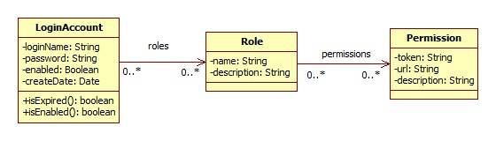

# 在 Web 项目中应用 Apache Shiro
如何实现验证码认证以及如何实现单点登录

**标签:** Java

[原文链接](https://developer.ibm.com/zh/articles/j-lo-shiro/)

杨晓晋

发布: 2013-01-31

* * *

## 用户权限模型

在揭开 Shiro 面纱之前，我们需要认知用户权限模型。本文所提到用户权限模型，指的是用来表达用户信息及用户权限信息的数据模型。即能证明”你是谁？”、”你能访问多少受保护资源？”。为实现一个较为灵活的用户权限数据模型，通常把用户信息单独用一个实体表示，用户权限信息用两个实体表示。

1. 用户信息用 LoginAccount 表示，最简单的用户信息可能只包含用户名 loginName 及密码 password 两个属性。实际应用中可能会包含用户是否被禁用，用户信息是否过期等信息。
2. 用户权限信息用 Role 与 Permission 表示，Role 与 Permission 之间构成多对多关系。Permission 可以理解为对一个资源的操作，Role 可以简单理解为 Permission 的集合。
3. 用户信息与 Role 之间构成多对多关系。表示同一个用户可以拥有多个 Role，一个 Role 可以被多个用户所拥有。

##### 图 1\. 用户权限模型



## 认证与授权

### Shiro 认证与授权处理过程

- 被 Shiro 保护的资源，才会经过认证与授权过程。使用 Shiro 对 URL 进行保护可以参见”与 Spring 集成”章节。
- 用户访问受 Shiro 保护的 URL；例如 `http://host/security/action.do`。
- Shiro 首先检查用户是否已经通过认证，如果未通过认证检查，则跳转到登录页面，否则进行授权检查。认证过程需要通过 Realm 来获取用户及密码信息，通常情况我们实现 JDBC Realm，此时用户认证所需要的信息从数据库获取。如果使用了缓存，除第一次外用户信息从缓存获取。
- 认证通过后接受 Shiro 授权检查，授权检查同样需要通过 Realm 获取用户权限信息。Shiro 需要的用户权限信息包括 Role 或 Permission，可以是其中任何一种或同时两者，具体取决于受保护资源的配置。如果用户权限信息未包含 Shiro 需要的 Role 或 Permission，授权不通过。只有授权通过，才可以访问受保护 URL 对应的资源，否则跳转到”未经授权页面”。

### Shiro Realm

在 Shiro 认证与授权处理过程中，提及到 Realm。Realm 可以理解为读取用户信息、角色及权限的 DAO。由于大多 Web 应用程序使用了关系数据库，因此实现 JDBC Realm 是常用的做法，后面会提到 CAS Realm，另一个 Realm 的实现。

##### 清单 1\. 实现自己的 JDBC Realm

```
public class MyShiroRealm extends AuthorizingRealm{

// 用于获取用户信息及用户权限信息的业务接口
private BusinessManager businessManager;

// 获取授权信息
protected AuthorizationInfo doGetAuthorizationInfo(
      PrincipalCollection principals) {
      String username = (String) principals.fromRealm(
         getName()).iterator().next();

      if( username != null ){
      // 查询用户授权信息
         Collection<String> pers=businessManager.queryPermissions(username);
         if( pers != null && !pers.isEmpty() ){
            SimpleAuthorizationInfo info = new SimpleAuthorizationInfo();
            for( String each:pers )
               info.addStringPermissions( each );

            return info;
         }
      }

      return null;
}

// 获取认证信息
protected AuthenticationInfo doGetAuthenticationInfo(
      AuthenticationToken authcToken ) throws AuthenticationException {
      UsernamePasswordToken token = (UsernamePasswordToken) authcToken;
      // 通过表单接收的用户名
      String username = token.getUsername();

      if( username != null && !"".equals(username) ){
         LoginAccount account = businessManager.get( username );

         if( account != null ){
            return new SimpleAuthenticationInfo(
               account.getLoginName(),account.getPassword(),getName() );
         }
      }

      return null;
}
}

```

Show moreShow more icon

代码说明：

1. businessManager 表示从数据库获取用户信息及用户权限信息的业务类，实际情况中可能因用户权限模型设计不同或持久化框架选择不同，这里没给出示例代码。
2. doGetAuthenticationInfo 方法，取用户信息。对照用户权限模型来说，就是取 LoginAccount 实体。最终我们需要为 Shiro 提供 AuthenticationInfo 对象。
3. doGetAuthorizationInfo 方法，获取用户权限信息。代码给出了获取用户 Permission 的示例，获取用户 Role 的代码类似。为 Shiro 提供的用户权限信息以 AuthorizationInfo 对象形式返回。

## 为何对 Shiro 情有独钟

或许有人要问，我一直在使用 Spring，应用程序的安全组件早已选择了 Spring Security，为什么还需要 Shiro ？当然，不可否认 Spring Security 也是一款优秀的安全控制组件。本文的初衷不是让您必须选择 Shiro 以及必须放弃 Spring Security，秉承客观的态度，下面对两者略微比较：

1. 简单性，Shiro 在使用上较 Spring Security 更简单，更容易理解。
2. 灵活性，Shiro 可运行在 Web、EJB、IoC、Google App Engine 等任何应用环境，却不依赖这些环境。而 Spring Security 只能与 Spring 一起集成使用。
3. 可插拔，Shiro 干净的 API 和设计模式使它可以方便地与许多的其它框架和应用进行集成。Shiro 可以与诸如 Spring、Grails、Wicket、Tapestry、Mule、Apache Camel、Vaadin 这类第三方框架无缝集成。Spring Security 在这方面就显得有些捉衿见肘。

## 与 Spring 集成

在 Java Web Application 开发中，Spring 得到了广泛使用；与 EJB 相比较，可以说 Spring 是主流。Shiro 自身提供了与 Spring 的良好支持，在应用程序中集成 Spring 十分容易。

有了前面提到的用户权限数据模型，并且实现了自己的 Realm，我们就可以开始集成 Shiro 为应用程序服务了。

### Shiro 的安装

Shiro 的安装非常简单，在 Shiro 官网下载 shiro-all-1.2.0.jar、shiro-cas-1.2.0.jar（单点登录需要），及 SLF4J 官网下载 Shiro 依赖的日志组件 slf4j-api-1.6.1.jar。Spring 相关的 JAR 包这里不作列举。这些 JAR 包需要放置到 Web 工程 /WEB-INF/lib/ 目录。至此，剩下的就是配置了。

### 配置过滤器

首先，配置过滤器让请求资源经过 Shiro 的过滤处理，这与其它过滤器的使用类似。

##### 清单 2\. web.xml 配置

```
<filter>
<filter-name>shiroFilter</filter-name>
<filter-class>
      org.springframework.web.filter.DelegatingFilterProxy
</filter-class>
</filter>
<filter-mapping>
<filter-name>shiroFilter</filter-name>
<url-pattern>/*</url-pattern>
</filter-mapping>

```

Show moreShow more icon

### Spring 配置

接下来仅仅配置一系列由 Spring 容器管理的 Bean，集成大功告成。各个 Bean 的功能见代码说明。

##### 清单 3\. Spring 配置

```
<bean id="shiroFilter" class="org.apache.shiro.spring.web.ShiroFilterFactoryBean">
<property name="securityManager" ref="securityManager"/>
<property name="loginUrl" value="/login.do"/>
<property name="successUrl" value="/welcome.do"/>
<property name="unauthorizedUrl" value="/403.do"/>
<property name="filters">
      <util:map>
         <entry key="authc" value-ref="formAuthenticationFilter"/>
      </util:map>
</property>
<property name="filterChainDefinitions">
      <value>
         /=anon
         /login.do*=authc
         /logout.do*=anon

         # 权限配置示例
         /security/account/view.do=authc,perms[SECURITY_ACCOUNT_VIEW]

         /** = authc
      </value>
</property>
</bean>

<bean id="securityManager"
class="org.apache.shiro.web.mgt.DefaultWebSecurityManager">
<property name="realm" ref="myShiroRealm"/>
</bean>

<bean id="myShiroRealm" class="xxx.packagename.MyShiroRealm">
<!-- businessManager 用来实现用户名密码的查询 -->
<property name="businessManager" ref="businessManager"/>
<property name="cacheManager" ref="shiroCacheManager"/>
</bean>

<bean id="lifecycleBeanPostProcessor"
    class="org.apache.shiro.spring.LifecycleBeanPostProcessor"/>

<bean id="shiroCacheManager"
class="org.apache.shiro.cache.ehcache.EhCacheManager">
<property name="cacheManager" ref="cacheManager"/>
</bean>

<bean id="formAuthenticationFilter"
class="org.apache.shiro.web.filter.authc.FormAuthenticationFilter"/>

```

Show moreShow more icon

代码说明：

1. shiroFilter 中 loginUrl 为登录页面地址，successUrl 为登录成功页面地址（如果首先访问受保护 URL 登录成功，则跳转到实际访问页面），unauthorizedUrl 认证未通过访问的页面（前面提到的”未经授权页面”）。
2. shiroFilter 中 filters 属性，formAuthenticationFilter 配置为基于表单认证的过滤器。
3. shiroFilter 中 filterChainDefinitions 属性，anon 表示匿名访问（不需要认证与授权），authc 表示需要认证，perms[SECURITY\_ACCOUNT\_VIEW] 表示用户需要提供值为”SECURITY\_ACCOUNT\_VIEW”Permission 信息。由此可见，连接地址配置为 authc 或 perms[XXX] 表示为受保护资源。
4. securityManager 中 realm 属性，配置为我们自己实现的 Realm。关于 Realm，参见前面”Shiro Realm”章节。
5. myShiroRealm 为我们自己需要实现的 Realm 类，为了减小数据库压力，添加了缓存机制。
6. shiroCacheManager 是 Shiro 对缓存框架 EhCache 的配置。

## 实现验证码认证

验证码是有效防止暴力破解的一种手段，常用做法是在服务端产生一串随机字符串与当前用户会话关联（我们通常说的放入 Session），然后向终端用户展现一张经过”扰乱”的图片，只有当用户输入的内容与服务端产生的内容相同时才允许进行下一步操作。

### 产生验证码

作为演示，我们选择开源的验证码组件 kaptcha。这样，我们只需要简单配置一个 Servlet，页面通过 IMG 标签就可以展现图形验证码。

##### 清单 4\. web.xml 配置

```
<!-- captcha servlet-->
<servlet>
<servlet-name>kaptcha</servlet-name>
<servlet-class>
      com.google.code.kaptcha.servlet.KaptchaServlet
</servlet-class>
</servlet>
<servlet-mapping>
<servlet-name>kaptcha</servlet-name>
<url-pattern>/images/kaptcha.jpg</url-pattern>
</servlet-mapping>

```

Show moreShow more icon

### 扩展 UsernamePasswordToken

Shiro 表单认证，页面提交的用户名密码等信息，用 UsernamePasswordToken 类来接收，很容易想到，要接收页面验证码的输入，我们需要扩展此类：

##### 清单 5\. CaptchaUsernamePasswordToken

```
public class CaptchaUsernamePasswordToken extends UsernamePasswordToken{

private String captcha;

// 省略 getter 和 setter 方法

public CaptchaUsernamePasswordToken(String username, char[] password,
boolean rememberMe, String host,String captcha) {
super(username, password, rememberMe, host);
this.captcha = captcha;
}
}

```

Show moreShow more icon

### 扩展 FormAuthenticationFilter

接下来我们扩展 FormAuthenticationFilter 类，首先覆盖 createToken 方法，以便获取 CaptchaUsernamePasswordToken 实例；然后增加验证码校验方法 doCaptchaValidate；最后覆盖 Shiro 的认证方法 executeLogin，在原表单认证逻辑处理之前进行验证码校验。

##### 清单 6\. CaptchaUsernamePasswordToken

```
public class CaptchaFormAuthenticationFilter extends FormAuthenticationFilter{

public static final String DEFAULT_CAPTCHA_PARAM = "captcha";

private String captchaParam = DEFAULT_CAPTCHA_PARAM;

public String getCaptchaParam() {
      return captchaParam;
}

public void setCaptchaParam(String captchaParam) {
      this.captchaParam = captchaParam;
}

protected String getCaptcha(ServletRequest request) {
      return WebUtils.getCleanParam(request, getCaptchaParam());
}

// 创建 Token
protected CaptchaUsernamePasswordToken createToken(
      ServletRequest request, ServletResponse response) {

      String username = getUsername(request);
      String password = getPassword(request);
      String captcha = getCaptcha(request);
      boolean rememberMe = isRememberMe(request);
      String host = getHost(request);

      return new CaptchaUsernamePasswordToken(
         username, password, rememberMe, host,captcha);
}

// 验证码校验
protected void doCaptchaValidate( HttpServletRequest request
      ,CaptchaUsernamePasswordToken token ){

      String captcha = (String)request.getSession().getAttribute(
         com.google.code.kaptcha.Constants.KAPTCHA_SESSION_KEY);

      if( captcha!=null &&
         !captcha.equalsIgnoreCase(token.getCaptcha()) ){
         throw new IncorrectCaptchaException ("验证码错误！");
      }
}

// 认证
protected boolean executeLogin(ServletRequest request,
      ServletResponse response) throws Exception {
      CaptchaUsernamePasswordToken token = createToken(request, response);

      try {
         doCaptchaValidate( (HttpServletRequest)request,token );

         Subject subject = getSubject(request, response);
         subject.login(token);

         return onLoginSuccess(token, subject, request, response);
      } catch (AuthenticationException e) {
         return onLoginFailure(token, e, request, response);
      }
}

}

```

Show moreShow more icon

代码说明：

1. 添加 captchaParam 变量，为的是页面表单提交验证码的参数名可以进行灵活配置。
2. doCaptchaValidate 方法中，验证码校验使用了框架 KAPTCHA 所提供的 API。

### 添加 IncorrectCaptchaException

前面验证码校验不通过，我们抛出一个异常 IncorrectCaptchaException，此类继承 AuthenticationException，之所以需要扩展一个新的异常类，为的是在页面能更精准显示错误提示信息。

##### 清单 7\. IncorrectCaptchaException

```
public class IncorrectCaptchaException extends AuthenticationException{

public IncorrectCaptchaException() {
      super();
}

public IncorrectCaptchaException(String message, Throwable cause) {
      super(message, cause);
}

public IncorrectCaptchaException(String message) {
      super(message);
}

public IncorrectCaptchaException(Throwable cause) {
      super(cause);
}
}

```

Show moreShow more icon

### 页面展现验证码错误提示信息

##### 清单 8\. 页面认证错误信息展示

```
Object obj=request.getAttribute(
org.apache.shiro.web.filter.authc.FormAuthenticationFilter
      .DEFAULT_ERROR_KEY_ATTRIBUTE_NAME);
AuthenticationException authExp = (AuthenticationException)obj;
if( authExp != null ){
String expMsg="";

if(authExp instanceof UnknownAccountException ||
      authExp instanceof IncorrectCredentialsException){
      expMsg="错误的用户账号或密码！";
}else if( authExp instanceof IncorrectCaptchaException){
      expMsg="验证码错误！";
}else{
      expMsg="登录异常 :"+authExp.getMessage() ;
}

out.print("<div class=\"error\">"+expMsg+"</div>");
}

```

Show moreShow more icon

## 实现单点登录

前面章节，我们认识了 Shiro 的认证与授权，并结合 Spring 作了集成实现。现实中，有这样一个场景，我们拥有很多业务系统，按照前面的思路，如果访问每个业务系统，都要进行认证，这样是否有点难让人授受。有没有一种机制，让我们只认证一次，就可以任意访问目标系统呢？

上面的场景，就是我们常提到的单点登录 SSO。Shiro 从 1.2 版本开始对 CAS 进行支持，CAS 就是单点登录的一种实现。

### Shiro CAS 认证流程

- 用户首次访问受保护的资源；例如 `http://casclient/security/view.do`
- 由于未通过认证，Shiro 首先把请求地址（`http://casclient/security/view.do`）缓存起来。
- 然后跳转到 CAS 服务器进行登录认证，在 CAS 服务端认证完成后需要返回到请求的 CAS 客户端，因此在请求时，必须在参数中添加返回地址 ( 在 Shiro 中名为 CAS Service)。 例如 `http://casserver/login?service=http://casclient/shiro-cas`
- 由 CAS 服务器认证通过后，CAS 服务器为返回地址添加 ticket。例如 `http://casclient/shiro-cas?ticket=ST-4-BWMEnXfpxfVD2jrkVaLl-cas`
- 接下来，Shiro 会校验 ticket 是否有效。由于 CAS 客户端不提供直接认证，所以 Shiro 会向 CAS 服务端发起 ticket 校验检查，只有服务端返回成功时，Shiro 才认为认证通过。
- 认证通过，进入授权检查。Shiro 授权检查与前面提到的相同。
- 最后授权检查通过，用户正常访问到 `http://casclient/security/view.do`。

### CAS Realm

Shiro 提供了一个名为 CasRealm 的类，与前面提到的 JDBC Realm 相似，该类同样包括认证和授权两部分功能。认证就是校验从 CAS 服务端返回的 ticket 是否有效；授权还是获取用户权限信息。

实现单点登录功能，需要扩展 CasRealm 类。

##### 清单 9\. Shiro CAS Realm

```
public class MyCasRealm extends CasRealm{

// 获取授权信息
protected AuthorizationInfo doGetAuthorizationInfo(
      PrincipalCollection principals) {
      //... 与前面 MyShiroRealm 相同
}

    public String getCasServerUrlPrefix() {
      return "http://casserver/login";
}

public String getCasService() {
      return "http://casclient/shiro-cas";
}
16
}

```

Show moreShow more icon

代码说明：

1. doGetAuthorizationInfo 获取授权信息与前面章节”实现自己的 JDBC Realm”相同。
2. 认证功能由 Shiro 自身提供的 CasRealm 实现。
3. getCasServerUrlPrefix 方法返回 CAS 服务器地址，实际使用一般通过参数进行配置。
4. getCasService 方法返回 CAS 客户端处理地址，实际使用一般通过参数进行配置。
5. 认证过程需 keystore，否则会出现异常。可以通过设置系统属性的方式来指定，例如 System.setProperty(“javax.net.ssl.trustStore”,”keystore-file”);

### CAS Spring 配置

**实现单点登录的 Spring 配置与前面类似，不同之处参见代码说明。**

##### 清单 10\. Shiro CAS Spring 配置

```
<bean id="shiroFilter"
class="org.apache.shiro.spring.web.ShiroFilterFactoryBean">
<property name="securityManager" ref="securityManager"/>
<property name="loginUrl"
      value="http://casserver/login?service=http://casclient/shiro-cas"/>
<property name="successUrl" value="/welcome.do"/>
<property name="unauthorizedUrl" value="/403.do"/>
<property name="filters">
      <util:map>
         <entry key="authc" value-ref="formAuthenticationFilter"/>
         <entry key="cas" value-ref="casFilter"/>
      </util:map>
</property>
<property name="filterChainDefinitions">
      <value>
         /shiro-cas*=cas
         /logout.do*=anon
         /casticketerror.do*=anon

         # 权限配置示例
         /security/account/view.do=authc,perms[SECURITY_ACCOUNT_VIEW]

         /** = authc
      </value>
</property>
</bean>

<bean id="securityManager"
class="org.apache.shiro.web.mgt.DefaultWebSecurityManager">
<property name="realm" ref="myShiroRealm"/>
</bean>

<bean id="lifecycleBeanPostProcessor"
class="org.apache.shiro.spring.LifecycleBeanPostProcessor"/>

<!-- CAS Realm -->
<bean id="myShiroRealm" class="xxx.packagename.MyCasRealm">
<property name="cacheManager" ref="shiroCacheManager"/>
</bean>

<bean id="shiroCacheManager"
class="org.apache.shiro.cache.ehcache.EhCacheManager">
<property name="cacheManager" ref="cacheManager"/>
</bean>

<bean id="formAuthenticationFilter"
class="org.apache.shiro.web.filter.authc.FormAuthenticationFilter"/>

<!-- CAS Filter -->
<bean id="casFilter" class="org.apache.shiro.cas.CasFilter">
<property name="failureUrl" value="casticketerror.do"/>
</bean>

```

Show moreShow more icon

代码说明：

1. shiroFilter 中 loginUrl 属性，为登录 CAS 服务端地址，参数 service 为服务端的返回地址。
2. myShiroRealm 为上一节提到的 CAS Realm。
3. casFilter 中 failureUrl 属性，为 Ticket 校验不通过时展示的错误页面。

## 结束语

至此，我们对 Shiro 有了较为深入的认识。Shiro 灵活，功能强大，几乎能满足我们实际应用中的各种情况，还等什么呢？让我开始使用 Shiro 为应用程序护航吧！