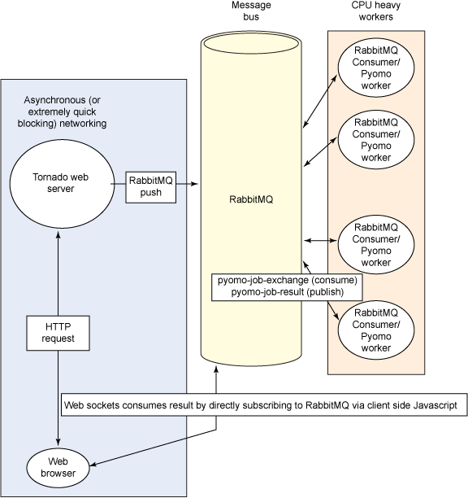

# 在云中构建一个可扩展的基础架构
结合使用 Pyomo、RabbitMQ 和 Tornado

**标签:** 云计算

[原文链接](https://developer.ibm.com/zh/articles/cl-optimizepythoncloud2/)

Noah Gift

发布: 2013-07-04

* * *

## 简介

这个由三部分组成的系列文章的第 1 部分介绍了在 Python 中使用 Pyomo 库进行线性优化的基础知识。现在我们将介绍如何扩展它。Python 缺乏真实的操作系统线程，该如何扩展它？本文将向您介绍如何组合使用这些技术来创建一个实际的可扩展基础架构，该架构可用于构建一个 Pyomo Web 解决方案。我们组合使用了一个单线程事件循环、一个 AMQP 服务器和工作线程流程来创建一个模式，利用该模式扩展一个线性优化系统。该基础架构也适用于 Python 或 Ruby 中的许多通用计算问题。

## 扩展

使用 Python 这类脚本语言创建可扩展、可并行运行的代码所面临的挑战不同于 C, C++ or Java 编程语言。两个重要因素是执行速度和线程建模。复杂一点来说，Amdahl 定律（参阅 参考资料 ）显示，程序的加速与计算机上的可用处理器数量并不是严格成正比的。代码并行部分的比例性最终受限于程序连续部分所需的时间。

考虑该问题的一个直观方法是将该问题想象成为一个事件循环，事件循环的每个 _滴答 (tick)_ 需要占用 1 秒的 CPU 时间。在事件循环内部，如果您试着调试就会发现 75% 的时间花在了 `time.sleep` (.75) 命令上，余下的时间都花在做这项工作上。因为这个一秒事件循环的 75% 的时间花费在休眠上，让部分运行循环可以并行运行是不可能的。在这一秒时间中，惟一可以运行得更快的是这 25% 没有休眠的部分。在这 .25 秒的事件循环中，无论处理器运行得多快或有多少台处理器被抛出，总是需要 .75 秒以上的时间来优化“可并行”代码。

即使采用了 Amdahl 定律，原则上，添加更多的线程不会让 Python 代码的并行部分瘫痪。尽管这类策略在 C# 和 Java 这类语言中非常适用，但在 Python 中却略微有些复杂。在 Python 中，如果一部分代码可以并行化，但这部分代码承担了 CPU 的工作，那么因为 Global Interpreter Lock (GIL) 的缘故，线程不会提供任何优化方面的帮助。

最后一个比较复杂的地方是，如果编写了一个 Web 应用程序，该程序使用 Tornado 这类事件驱动基础架构执行线性优化，那么必须将一些特殊想法融入到设计中。如果事件循环遭到阻塞而无法执行 CPU 工作或者阻塞网络操作，那么该设计可以安全地调用 _迭代服务器_。W. Richard Stevens 在 _Unix Network Programming_ 一书中介绍了两种服务器：

- 迭代服务器：无法处理挂起客户端，直至当前客户端服务彻底结束。
- 并发服务器：通常为每个请求生成一个子进程。

如果没有经过慎重考虑，事件循环服务器（Ruby 的 Event Machine 和 Python 的 Tornado）很快就会变成一个迭代服务器。在现实世界中，迭代服务器就是一个玩具，必须不惜一切代价加以避免。

## 事件循环编程

对于一个事件循环，执行一个线性优化算法的 CPU 密集型工作将锁定客户后面发出的所有请求，直至第一个请求的工作进程完成。在许多情况下，这不是最佳做法，因为可以使用服务器上的其他内核完成其他 CPU 密集型工作。很容易出现的一种境况是：在一个服务器的 24 个内核中，其中有 23 个无所事事，而 CPU 密集型请求却开始形成一个指数队列。同样地，事件循环中如果出现堵塞网络的操作，那么可能是出现了更糟的情况——24 个内核都处于闲置状态，而请求却开始排队等候。

使用一个事件循环基础架构的技巧是确保两件事：

- 所有网络操作必须以非阻塞方式完成，要么在单独的线程或进程中，要么使用 I/O 多路技术（比如选择和轮讯），要么使用 POSIX aio\_ 函数的异步 I/O。
- 在事件循环中，应最大程度地减少 CPU 或网络操作，因为这会阻塞事件循环。

简言之，如果使用它作为一个 Web 站点，就不要出现阻塞事件循环的情况。应该采取其他措施来让 CPU 完成其他的工作。在 Python 中，一个策略是同步地接收消息，然后将任务负载转移到订阅 Advanced Message Queueing Protocol (AMQP) 消息总线（比如，RabbitMQ）的一系列工作线程中。这就是本文将要介绍的策略。异步事件循环服务器的最佳平衡点是处理许多并发、长时间运行的套接字连接。一个真实实例是从一个网络连接（比如收集股票数据的套接字）将数据发送到另一个连接（比如 WebSockets 连接）。

## 创建一个 Tornado web 应用程序来分发 Pyomo 应用程序

该示例使用了几种不同技术：

- Tornado（参阅 参考资料 ）是一个开源、可扩展、无阻塞 Web 服务器。它可以充当异步消息传递系统。
- Pyomo（参阅 参考资料 ）服务在每个请求上运行的线性优化任务。
- RabbitMQ 可以充当层之间的消息总线。

要搭建环境和运行该实例，需要在 OS X 上安装以下组件。

1. 使用 [HomeBrew](http://www.rabbitmq.com/install-homebrew.html) 安装 RabbitMQ。
2. Pyomo。
3. [Pika](http://pypi.python.org/pypi/pika)，一个 RabbitMQ Python 客户端。
4. [Tornado](http://pypi.python.org/pypi/tornado)，一个异步 Web 服务器。使用 easy\_install 安装。

## 代码说明

让我们开始检查基础架构中 Tornado 的部分，通过使用 ApacheBench 向一个基本的、阻塞的 RabbitMQ 服务快速发送消息来进行测试。

##### 清单 1\. 对一个基础消息服务进行基准测试。

```
ab -n 2000 -c 100 http://127.0.0.1:8888/benchmark
This is ApacheBench, Version 2.3 <$Revision: 1178079 $>
Copyright 1996 Adam Twiss, Zeus Technology Ltd, http://www.zeustech.net/
Licensed to The Apache Software Foundation, http://www.apache.org/

Benchmarking 127.0.0.1 (be patient)
Completed 200 requests
Completed 400 requests
Completed 600 requests
Completed 800 requests
Completed 1000 requests
Completed 1200 requests
Completed 1400 requests
Completed 1600 requests
Completed 1800 requests
Completed 2000 requests
Finished 2000 requests

Server Software:        TornadoServer/2.3
Server Hostname:        127.0.0.1
Server Port:            8888

Document Path:          /benchmark
Document Length:        24 bytes

Concurrency Level:      100
Time taken for tests:   6.231 seconds
Complete requests:      2000
Failed requests:        0
Write errors:           0
Total transferred:      360000 bytes
HTML transferred:       48000 bytes
Requests per second:    320.96 [#/sec] (mean)
Time per request:       311.570 [ms] (mean)
Time per request:       3.116 [ms] (mean, across all concurrent requests)
Transfer rate:          56.42 [Kbytes/sec] received

Connection Times (ms)
              min  mean[+/-sd] median   max
Connect:        0    0   0.5      0       4
Processing:    11  304  42.9    308     605
Waiting:       11  304  42.9    308     605
Total:         15  304  42.7    309     608

Percentage of the requests served within a certain time (ms)
50%    309
66%    311
75%    312
80%    313
90%    315
95%    324
98%    336
99%    338
100%    608 (longest request)

```

Show moreShow more icon

这里有一个特殊的 Web 请求处理程序，称为 `/benchmark`。在该处理程序的内部 ，发送给 RabbitMQ 的简单消息是通过 `pika.BlockingConnection` 方法发出的。查看每秒从 ApacheBench 输出的请求就会发现，平均每秒大约发出 320 个请求。这不是很可怕，同时数量也不算多。Tornado 官方基准测试每秒钟大约发出 3353 个请求。如果实际应用程序中有一个真正的瓶颈，那么很容易前进到下一步，将阻塞的 RabbitMQ 消息发送转换成一个完全的异步方法。pika 库有一个称为 `SelectConnection` 的异步适配器，可以将基准转换成接近每秒 3353 个请求。

RabbitMQ 本身每秒可接受数以万计的消息。发布的基准测试显示每秒可并行生成和消耗 64315 条消息。这可能需要采用某个数量级以上的 Tornado 工作线程来重载一个 RabbitMQ 实例，甚至在异步模式下也可以完成此操作。假设要进行一个基本的 RabbitMQ 安装，而且声明了一个交换（exchange ），即 pyomo-job-exchange 交换。Tornado Web 服务器使用 routing\_key pyomo-job-exchange 进行发布。除此之外，还有许多工作线程进程将使用 pyomo-job-exchange。

在这个 pika 工作线程层中，有许多工作线程订阅了 pyomo-job-exchange 消息。每个工作线程都是“哑的 (dumb)”，这意味着它们会机械地接受参数数据，通过 Pyomo 使用这些数据来执行线性优化。如果您喜欢的话，可以将 pika 工作线程的最终结果直接通过 STOMP 插件（参阅参考资料，获取介绍具体操作的文章链接）发送给订阅 RabbitMQ 的 WebSockets。要实现的惟一附加部分是告诉 pika 工作线程进程如何将最终结果返回给订阅了 WebSocket 工作线程的 RabbitMQ 队列。

##### Tornado-Pyomo-RabbitMQ 基础架构



清单 2 展示了 Tornado Web 服务器代码，要启动该服务器，请执行命令 `python server.py`。

##### 清单 2\. Tornado 服务器

```
import tornado.ioloop
import tornado.web
import tornado.websocket
import pika
import time

def publish_to_rabbitmq(msg):
    "blocking message sent to RabbitMQ"

    credentials = pika.PlainCredentials("guest", "guest")
    conn_params = pika.ConnectionParameters("localhost",
                                            credentials = credentials)
    conn_broker = pika.BlockingConnection(conn_params)
    channel = conn_broker.channel()
    channel.exchange_declare(exchange="pyomo-job-exchange",
                             type="direct",
                             passive=False,
                             durable=False,
                             auto_delete=False)

    msg_props = pika.BasicProperties()
    msg_props.content_type = "text/plain"
    channel.basic_publish(body=msg,
                          exchange="pyomo-job-exchange",
                          properties=msg_props,
                          routing_key="pyomo-job-dispatch")

def consume_from_rabbitmq():
    pass

class MainHandler(tornado.web.RequestHandler):
    def get(self):
        msg = "%s" % time.asctime()
        publish_to_rabbitmq(msg)
        self.write(msg)

class PyomoTask(tornado.web.RequestHandler):
    def get(self):
        self.write('<html><body><form action="/pyomo" method="post">'
                   '<input type="text" name="ProfitRateWindows">'
                   '<input type="submit" value="ProfitRateWindows">'
                   '</form></body></html>')

    def post(self):
        self.set_header("Content-Type", "text/plain")
        result = self.get_argument("ProfitRateWindows")
        publish_to_rabbitmq(result)
        self.write("Submitted to RabbitMQ/Pyomo Worker: " + result)

class PyomoWebSocketResult(tornado.websocket.WebSocketHandler):

    def open(self):
        """Called when a websocket opens"""
    pass

application = tornado.web.Application([
    (r"/benchmark", MainHandler),
    (r"/pyomo", PyomoTask),
    (r"/websocket", PyomoWebSocketResult),

])

if __name__ == "__main__":
    application.listen(8888)
    tornado.ioloop.IOLoop.instance().start()

```

Show moreShow more icon

Tornado Web 服务器有三个主要处理程序：/benchmark、/pyomo 和 /websockets（我把它留给您来实现）。/pyomo 处理程序是一种朴实的实现形式，它接收一个值，然后将其发送给 RabbitMQ，该值是从上面的示例中提取出来的：

```
result = self.get_argument("ProfitRateWindows")
publish_to_rabbitmq(result)

```

Show moreShow more icon

现在我们来看看 Pyomo 工作线程代码，如 [工作线程输出](#工作线程输出) 所示。要执行该工作线程，请运行以下命令：

```
source coopr/bin/activate
python worker.py

```

Show moreShow more icon

访问 [http://localhost:8888/pyomo](http://localhost:8888/pyomo) 并为 Profit Rate Windows 提交一个数值。

##### Pyomo 工作线程

```
import pika
from coopr.pyomo import (ConcreteModel, Objective, Var, NonNegativeReals,
                              maximize, Constraint)
from coopr.opt import SolverFactory
import time

def do_pyomo_work(profit_rate_windows):

    Products = ['Doors', 'Windows']
    ProfitRate = {'Doors':300, 'Windows':profit_rate_windows}
    Plants = ['Door Fab', 'Window Fab', 'Assembly']
    HoursAvailable = {'Door Fab':4, 'Window Fab':12, 'Assembly':18}
    HoursPerUnit = {('Doors','Door Fab'):1, ('Windows', 'Window Fab'):2,
                    ('Doors','Assembly'):3, ('Windows', 'Assembly'):2,
                    ('Windows', 'Door Fab'):0, ('Doors', 'Window Fab'):0}

    #Concrete Model
    model = ConcreteModel()
    #Decision Variables
    model.WeeklyProd = Var(Products, within=NonNegativeReals)

    #Objective
    model.obj = Objective(expr=
                sum(ProfitRate[i] * model.WeeklyProd[i] for i in Products),
                sense = maximize)

    def CapacityRule(model, p):
        """User Defined Capacity Rule

        Accepts a pyomo Concrete Model as the first positional argument,
        and a list of Plants as a second positional argument
        """

        return sum(HoursPerUnit[i,p] * model.WeeklyProd[i] for i in Products)
                                  <= HoursAvailable[p]

    model.Capacity = Constraint(Plants, rule = CapacityRule)
    opt = SolverFactory("glpk")
    instance = model.create()
    results = opt.solve(instance)
    #results.write()
    return results.Solution()

def create_channel():
    credentials = pika.PlainCredentials("guest", "guest")
    conn_params = pika.ConnectionParameters("localhost",
                                        credentials = credentials)
    conn_broker = pika.BlockingConnection(conn_params)
    channel = conn_broker.channel()
    channel.exchange_declare(exchange="pyomo-job-exchange",
                         type="direct",
                         passive=False,
                         durable=False,
                         auto_delete=False)
    channel.queue_declare(queue="pyomo-queue")
    channel.queue_bind(queue="pyomo-queue",
                   exchange="pyomo-job-exchange",
                   routing_key="pyomo-job-dispatch")
    return channel

def consume_run_loop():
    channel = create_channel()
    def msg_consumer(channel, method, header, body):
        channel.basic_ack(delivery_tag=method.delivery_tag)
        print body
        now = time.time()
        res = do_pyomo_work(int(body))
        print res
        print "Pyomo Job Completed in: %s seconds" % round(time.time() - now, 2)
        return
    channel.basic_consume( msg_consumer,
                           queue="pyomo-queue",
                           consumer_tag="pyomo-consumer")
    channel.start_consuming()

consume_run_loop()

```

Show moreShow more icon

该工作线程由两个操作组成。首先是修改现有 Wyndor 示例，让 Web 表格逐渐代替 `ProfitRate = {'Doors':300, 'Windows':profit_rate_windows}` 值。在实际应用程序中，此操作是完全主观且不切实际的，但它让本文的演示变得更容易。在实际应用程序中，线性优化的许多内容很有可能是动态分配的。

接下来，工作线程实际上一直处于“阻塞”状态，等待来自 RabbitMQ 的请求。然后获取各个结果并将其发送给回调函数 `msg_consumer`，该回调函数会运行线性优化，并将结果以及运行代码所用的时间打印到 stfout。注意，可能会出现 “N” 个工作线程进程，第一个工作线程捕获第一个作业。这需要考虑使用一个相对较为容易的扩展模型，因为每个工作线程“哑”的程度不同。此外，没有共享的状态可供参考，只有一个消息需要处理。

在观察两种不同的 Web 表单提交方法的过程中（该表单反过来由 Pyomo 工作线程处理），可以看到每个表单都会接收请求，CPU 大约耗费了一秒的 2/100。

##### 工作线程输出

```
python worker.py
100

Gap: 0.0
Status: feasible
Objective:
obj:
    Id: 0
    Value: 1500.0
Variable:
WeeklyProd(Doors):
    Id: 0
    Value: 4
WeeklyProd(Windows):
    Id: 1
    Value: 3
Constraint:
c_u_Capacity(Assembly)_:
    Id: 0
    Value: 18.0
c_u_Capacity(Door_Fab)_:
    Id: 1
    Value: 4.0
c_u_Capacity(Window_Fab)_:
    Id: 2
    Value: 6.0

Pyomo Job Completed in: 0.02 seconds
500

Gap: 0.0
Status: feasible
Objective:
obj:
    Id: 0
    Value: 3600.0
Variable:
WeeklyProd(Doors):
    Id: 0
    Value: 2
WeeklyProd(Windows):
    Id: 1
    Value: 6
Constraint:
c_u_Capacity(Assembly)_:
    Id: 0
    Value: 18.0
c_u_Capacity(Door_Fab)_:
    Id: 1
    Value: 2.0
c_u_Capacity(Window_Fab)_:
    Id: 2
    Value: 12.0

Pyomo Job Completed in: 0.02 seconds

```

Show moreShow more icon

## 结束语

该基础架构还有一个额外优势：RabbitMQ 是语言无关的，因此您可以用另一种语言中的新组件替换任何组件。此外，RabbitMQ 是用 Erlang 语言构建的，可能会产生数以百万计的轻量级进程，每个进程耗时几微秒（百万分之一秒）；因此，RabbitMQ 可以用作非常可靠的 _消息总线_，有效地进行水平扩展。合理扩展 Ruby 和 Python 的一个方法是将它们与 RabbitMQ 这类技术相结合，从而可以在承受巨大负载的情况下进行水平扩展，然后您可以使用 Python 和 Ruby 实现其最佳实践：快速迭代和原型化。

最后需要注意的是：使用网络程序设计语言编写小程序和基准测试程序非常重要。观察 API 并牢记代码示例。但是，在进行网络编程时，通常无法做到这一点。在进行网络编程时，真正理解工作原理的惟一方法就是亲自编写一个小程序，对其进行基准测试，然后在这个小程序上构建一些内容并进行基准测试，依次类推。如果跳过了这些步骤，您可能会发现您构建的内容是无法扩展的，而您的直觉告诉您它们应该是可以扩展的。

请留意本系列的最后一篇文章，我将在其中介绍使用 IPython 和 Pandas 进行投资分析和统计分析的操作示例。

## Download

[code-py-files.zip](http://public.dhe.ibm.com/software/dw/cloud/library/cl-optimizepythoncloud2/code-py-files.zip): server.py 和 worker.py

本文翻译自： [Linear optimization in Python, Part 2: Build a scalable architecture in the cloud](https://developer.ibm.com/articles/cl-optimizepythoncloud2/)（2013-02-21）