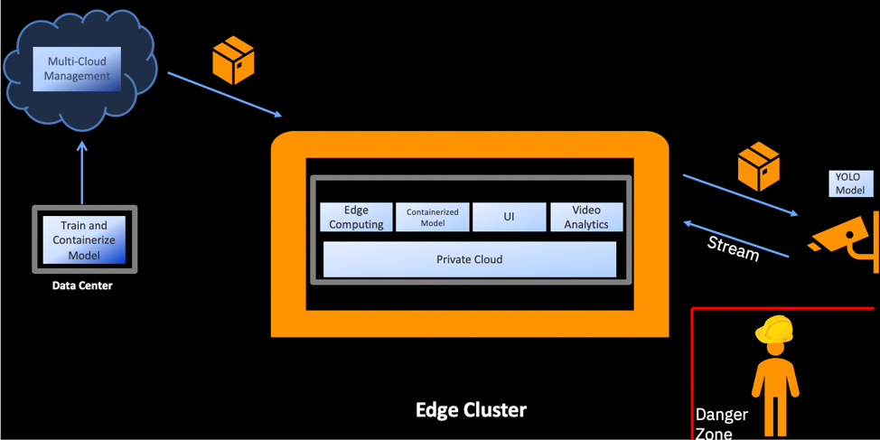
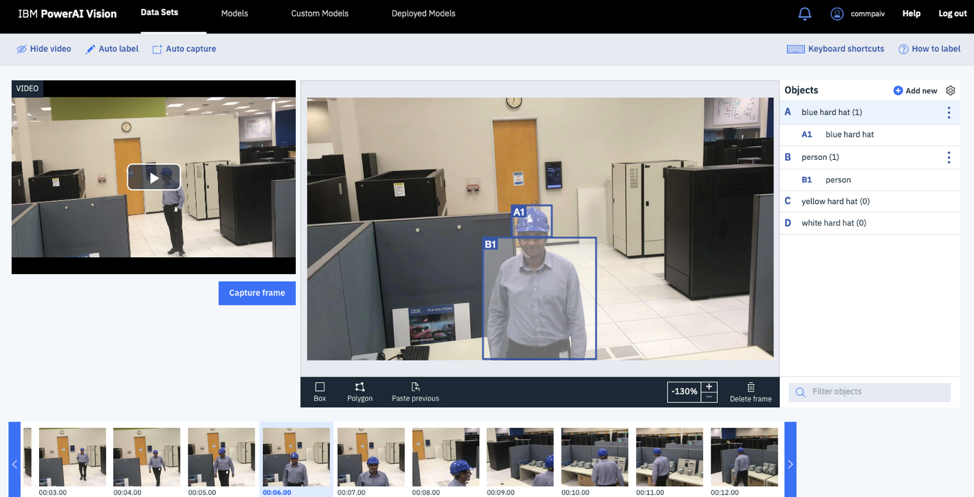
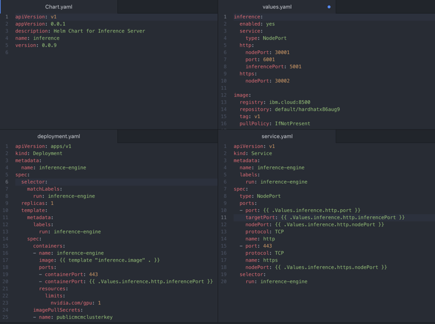
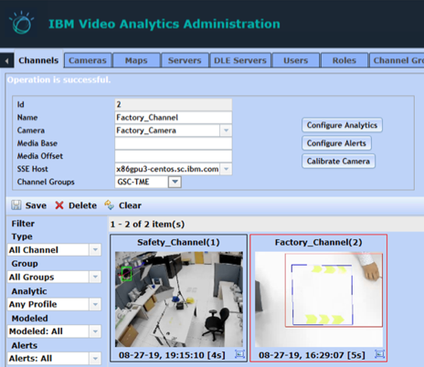
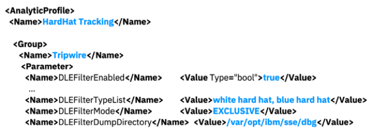
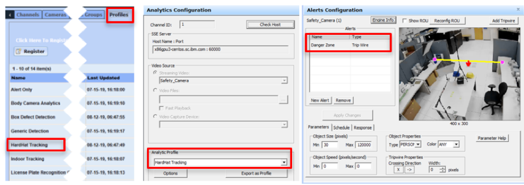
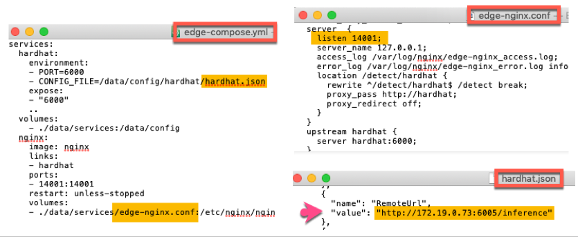

# 在应用层和设备层构建边缘
将关键应用程序组件部署到边缘

**标签:** IBM Cloud Pak for Multicloud Management,IBM Edge Application Manager,IBM Maximo Visual Inspection,Open Horizon,边缘计算

[原文链接](https://developer.ibm.com/zh/articles/edge-computing-application-and-device-layer/)

Eric Gose, Julio Wong, Mathews Thomas, Sai Srinivas Gorti, Sharath Prasad, Tass Supakkul, Utpal Mangla

发布: 2020-06-24

* * *

##### 实施边缘计算架构

本文是本系列的第 3 部分。

- [边缘计算架构和用例](/zh/articles/edge-computing-architecture-and-use-cases)
- 在应用层和设备层构建边缘（本文）
- [为边缘应用程序构建和部署 5G 网络服务](/zh/articles/edge-computing-network-layer)

[边缘计算系列中的第一篇文章](/zh/articles/edge-computing-architecture-and-use-cases) 介绍了一种高级边缘计算架构，其中指出了边缘的各个关键层，包括设备层、应用层、网络层和云边缘层。在本文中，我们将深入研究应用层和设备层，并介绍用于实现这些层的工具。（本系列中的第三篇文章将介绍网络层。）

如第一篇文章中所述，云边缘是各个边缘层工作负载的来源，它提供跨不同边缘层的管理层，并托管相应的应用程序来完成因节点限制而无法在其他边缘节点上完成的处理。

设备层由在边缘运行的小型设备组成。 应用层是在局部边缘运行，与设备层相比，它具有更强的计算能力。我们来深入研究这两个层的细节以及它们各自包含的组件。

## 边缘计算用例：工厂车间的工作场所安全

在本文中，我们将介绍如何实现涉及边缘计算架构的应用层和设备层的工作场所安全用例。

在特定的工厂中，当员工进入指定区域时，必须佩戴适当的个人防护设备 (PPE)（如安全帽）。需要使用一个解决方案来监视指定的区域，仅在检测到员工未戴安全帽进入该区域时才发出警报。否则，将不发出警报。为了减少网络上的负载，只有在检测到有人时，视频才会开始流式传输。

要实现该架构，需要执行以下操作：

1. 需要训练模型来识别戴安全帽的人。可使用 Maximo Visual Inspection 来完成此操作。

2. 需要实现模型容器化并将模型部署到边缘。可使用 IBM Cloud Pak for Multicloud Management 来完成此操作。

3. 需要将这些模型与视频分析系统集成。视频分析系统必须能够管理视频流，确定个人是否处于危险区，然后调用安全帽模型来确定个人是否戴有安全帽并相应地触发警报。可使用 IBM Visual Analytics 来完成此操作。

4. 需要将模型部署到摄像头以用于识别人员，这将触发摄像头开始流式传输。可使用 IBM Edge Application Manager 来完成此操作。


下面的架构图显示了这 4 个组件：



## 实现应用层

应用层使您能够在边缘运行应用程序。可运行的应用程序的复杂性取决于边缘服务器的覆盖范围。边缘服务器可以是 X 服务器或 IBM Power System 服务器，通常在特定环境（例如，零售商店、信号塔或企业核心网或数据中心之外的其他位置）中本地运行。这些服务器的规模取决于要运行的工作负载。

来自设备层的信息将发送到应用层以进行进一步处理。然后，可以将其中一些信息发送到云或其他位置。

可能会在可运行公共软件服务和中间件的基于容器的基础架构上构建应用层。例如，可以在 Red Hat OpenShift 上构建应用层，并在运行已部署容器的 Red Hat OpenShift 上安装一个或多个 IBM Cloud Paks。

现在，我们将研究如何使用 Maximo Visual Inspection、Multi Cloud Manager、IBM Video Analytics 和 IBM Edge Application Manager 等产品来创建完整的端到端解决方案。

### 使用 Maximo Visual Inspection 创建模型

Maximo Visual Inspection 是一个视频和图像分析平台，它使主题专家可以轻松地训练和部署图像分类和对象检测模型。下面将介绍如何使用 Maximo Visual Inspection 构建一个安全帽检测模型。

1. 创建一组关于戴安全帽的个人的视频。确保涵盖了在不同照明条件下的各种场景。
2. 登录到 Maximo Visual Inspection，然后单击左上角的 **Data Sets** 来创建一个数据集。
3. 单击 **Create a new data set**，并为该数据集提供类似于 `hardhat dataset` 的名称。
4. 导入在步骤 1 中创建的图像或视频。
5. 要创建对象检测模型，请单击左侧菜单中的 **Objects**，然后单击 **Add Objects** 来创建对象。创建一个名为 `hardhat` 的对象。如果要识别不同颜色的帽子，那么可以针对每种颜色创建一个对象，例如 `Yellow Hardhat` 和 `Blue Hardhat`。
6. 单击 **Label Objects** 按钮。对于该数据集中的视频，您可以使用 **Auto Capture** 按钮来按所需时间间隔捕获帧。对于每一帧，单击 **Box**，然后选择您刚创建的 **hardhat** 对象，并在该安全帽周围绘制一个框。针对所有帧重复此步骤。

    

7. 一般来说，数据集越大，模型的准确性就越高。如果您没有大量的数据，那么可以使用 **Augment Data** 按钮以使用过滤器（如翻转、模糊、旋转等）创建额外的图像。

8. 完成图像标记后，单击 **Train Model**，然后选择训练类型 **Object detection**。您可以从用于优化模型训练的众多选项中进行选择，并单击 **Train** 按钮。训练时间取决于数据集大小、模型类型以及所选的其他选项。
9. 训练模型后，单击 **Deploy** 按钮。您可以命名已部署的模型并选择导出此模型。然后，将导出的模型作为 zip 文件下载。
10. 部署的安全帽模型现在出现在 **Deployed Models** 选项卡中，在该选项卡中，可以使用显示的 API 端点或者通过单击 **Open** 按钮并上载视频来测试该模型，查看是否会检测到安全帽。

### 使用 Maximo Visual Inspection Inference 服务器实现模型容器化

使用 Maximo Visual Inspection Inference 服务器，您可以快速轻松地部署多个经过训练的模型。我们将使用推理服务器来创建安全帽模型的 Docker 镜像。这样，您就可以将安全帽模型提供给其他人（如客户或协作者）使用，并能够在其他系统上运行该模型。

1. 要在计算机上安装推理服务器，请下载最新的 Maximo Visual Inspection Inference 软件。导航到 IVI inference 文件夹以安装推理服务器。有关详细说明，请参阅 [安装文档](https://www.ibm.com/support/knowledgecenter/en/SSRU69_1.2.0/base/vision_inference_install.html)。


    ```
    cd visual-insight-infer-x86-1.2.0.0-ppa/

    sudo yum install ./visual-insights-inference-1.2.0.0-455.5998b55.x86_64.rpm

    /opt/ibm/vision-inference/bin/load_images.sh -f visual-insights-inference-x86_64-containers-1.2.0.0.tar

    ```


    Show moreShow more icon

2. 使用 `deploy_zip_model.sh` 脚本在此系统上部署从 Maximo Visual Inspection 导出的模型。


    ```
    /opt/ibm/vision-inference/bin/deploy_zip_model.sh --model model_name --port port_number --gpu GPU_number location_of_exported_IVI_model

    ```


    Show moreShow more icon

     例如：


    ```
    /opt/ibm/vision-inference/bin/deploy_zip_model.sh--model Hardhatmodel --port 6002 --gpu 0 /root/Hardhatmodel.zip

    ```


    Show moreShow more icon

     此命令会创建一个 Docker 容器。

3. 使用 Docker 容器创建一个 Docker 镜像。要执行此操作，请先获取容器 ID，然后提交 Docker 镜像：


    ```
    docker ps | grep model_name

    ```


    Show moreShow more icon

     从输出中复制容器 ID，并在以下命令中指定容器 ID：


    ```
    docker commit <container-id> docker_image_name:tag

    ```


    Show moreShow more icon

     例如，对于 `hardhatmodel`，docker commit 命令可能如下所示：


    ```
    docker commit <container-id> hardhatmodel:v1

    ```


    Show moreShow more icon

4. 保存在上述步骤中创建的 Docker 镜像，并使用以下命令将其压缩以创建一个 `.tgz` 文件：


    ```
    docker save docker_image_name:tag | gzip > file_name.tgz

    ```


    Show moreShow more icon

     例如：


    ```
    docker save hardhatmodel:v1 | gzip > Hardhatmodel.tgz

    ```


    Show moreShow more icon

5. 您现在可以将这个 .tgz 文件移动到任何其他系统，并运行 `docker load` 命令来将 Docker 镜像加载到该系统。


    ```
    docker load < hardhatmodel.tgz

    ```


    Show moreShow more icon


### 使用 IBM Cloud Pak for Multicloud Management 将模型部署到边缘服务器

IBM Cloud Pak for Multicloud Management 是在 Red Hat OpenShift 上运行，它提供了从本地到边缘的统一可视化、治理和自动化。使用 IBM Cloud Pak for Multicloud Management，运营商可以全方位了解集群在环境中的运行情况。利用 IBM Cloud Garage 上的 [本教程](https://www.ibm.com/cloud/garage/dte/tutorial/multi-cluster-application-management)，您可以了解如何使用 IBM Cloud Pak for Multicloud Management 来部署和管理跨集群的应用程序。

为实现此用例，需要将在上一节中创建的安全帽模型部署到边缘服务器。在我们的例子中，已将该模型部署到 IBM Cloud Private。先前创建的安全帽模型（在 `.tgz` 文件中）已加载到 IBM Cloud Pak for Multicloud Management 中，因此可以使用 Helm Chart 将其部署到多个集群中。

在下面的步骤中，我们将完成使用 Helm Chart 将这些 Docker 镜像部署到 IBM Cloud Private 的过程。

#### 使用 IBM Cloud Pak for Multicloud Management 来部署模型

1. 登录到 IBM Cloud Pak for Multicloud Management，并通过 ssh 连接到系统。


    ```
    ssh <user>@<mcm-ip-address>

    ```


    Show moreShow more icon

2. 将 Docker 镜像添加到 IBM Cloud Pak for Multicloud Management Private 存储库中：


    ```
    docker login <mcm-docker-repo>
    docker load < hardhat.tgz
    docker tag :<tag> <mcm-docker-repo>/default/:<tag>
    docker push ibm.cloud:8500/default/:<tag>

    ```


    Show moreShow more icon

     注：`hardhat.tgz` 是您在上一节中创建的 `.tgz`。确保该文件已传输到 IBM Cloud Pak for Multicloud Management。

3. 在目标集群（在我们的例子中是 IBM Cloud Private）上添加镜像策略。登录到目标集群的 IBM Cloud Private，导航到 **Manage > Resource Security > Image Policies > Add Image Policy**。然后为其命名，并添加 `cluster` 作为作用域，最后添加 IBM Cloud Pak for Multicloud Management Private 存储库 `<mcm-docker-repo>` 作为注册表

4. 在目标集群的文件系统中添加私有存储库和 `ca.crt` 文件。

     通过 SSH 连接到目标集群：


    ```
    ssh <user>@<icp-ip-address>

    ```


    Show moreShow more icon

     在目标集群上，在 `certs.d` 文件夹中为私有存储库创建一个目录：


    ```
    mkdir /etc/docker/certs.d/<mcm-docker-repo>

    ```


    Show moreShow more icon

     将 `ca.crt` 从 Hub 集群复制到目标集群。在本地计算机上运行以下命令：


    ```
    scp <mcm-user>@<mcm-ip-address>:/etc/docker/certs.d/<mcm-docker-repo>/ca.crt <icp-user>@<icp-ip-address>:/etc/docker/certs.d/<mcm-docker-repo>/

    ```


    Show moreShow more icon

5. 在目标集群和 Hub 集群中运行以下命令以创建提取密钥，随后在 Helm Chart 的 `deployment.yaml` 文件中会使用此密钥。


    ```
    kubectl create secret docker-registry <secret-name>--docker-server=<mcm-docker-repo> --docker-username=<username> --docker-password=<password>

    ```


    Show moreShow more icon

6. 将 IBM Cloud Pak for Multicloud Management 的 IP 地址添加到 IBM Cloud Private 的 hosts 文件中：


    ```
    vi /etc/hosts

    ```


    Show moreShow more icon

     添加 IP 地址和主机名，如下行：`<mcm-ip-address> <mcm-hostname>`


#### 创建和发布 Helm Chart

1. 使用以下命令来创建一个 Helm Chart 存储库。请对其名称使用全小写字母。此命令会自动生成示例 yaml 文件，其中包括 `chart.yaml`、`values.yaml`、`service.yaml` 和 `deployment.yaml`。


    ```
    helm create my-app

    ```


    Show moreShow more icon

2. 编辑 `chart.yaml` 文件以指定自定义名称和版本（如以下截屏中所示）。

3. 编辑 `values.yaml` 文件以更新 Docker 镜像和节点端口信息（如以下截屏中所示）。

4. 编辑 templates 文件夹中的 `deployment.yaml` 文件，以在该 yaml 文件的 resources 节中添加任何其他参数（如 GPU）。


下面的截屏显示了为安全帽场景创建的所有四个 `.yaml` 文件。



现在，您需要打包并发布 Helm Chart。

1. 使用 helm template 命令来显示针对 Helm Chart 设置的属性值：


    ```
    helm template my-app

    ```


    Show moreShow more icon

     将 my-app 更改为您选择的 Helm Chart 存储库名称。

2. 将 Helm Chart 打包到一个 `.tgz` 文件中。


    ```
    helm package my-app

    ```


    Show moreShow more icon

3. 创建一个公共 GitHub 存储库并将其克隆到本地文件夹中。


    ```
    git clone <GitHub URL>

    ```


    Show moreShow more icon

4. 创建一个空白的 `index.yaml` 文件并将其推送到存储库：


    ```
    touch index.yaml
    git add index.yaml
    git commit -a -m “add index.yaml”
    git push

    ```


    Show moreShow more icon

5. 将 Helm Chart 添加到 GitHub 存储库并编辑 `index.yaml` 文件。


    ```
    helm repo index helm-example/ --URL “GitHub URL”

    ```


    Show moreShow more icon

     您的 GitHub 存储库现在具有 Helm 包（`.tgz` 文件）和 `index.yaml` 文件。

6. 将 Helm 存储库添加到 IBM Cloud Pak for Multicloud Management 中。在 IBM Cloud Pak for Multicloud Management 的浏览器中，导航到 **Manage > Helm Repositories > Add Repository >**。

7. 从 IBM Cloud Pak for Multicloud Management 中，将 Helm Chart 发布到 IBM Cloud Private。导航到 Catalog，搜索并单击 Chart 名称。然后，单击 **Configure**，并选择链接到 IBM Cloud Pak for Multicloud Management 的 IBM Cloud Private。最后，导航到 **Workloads > helm release** 部分以找到您的发布。


现在，我们已经训练了一个模型并将其部署到边缘服务器中，您现在可以使用该模型来识别安全帽了。

### 使用经过训练的模型来通过 IBM Video Analytics 识别安全帽

无论视频数据位于应用层还是设备层，这些数据都可以在边缘进行处理。 在边缘处理视频数据可以帮助减少延迟，降低带宽消耗，并使用户能够更快作出明智的决策。

可使用 IBM Video Analytics 来管理来自摄像头的视频流。它还用于定义要检测的对象以及要指定为危险区的区域。 一旦检测到有人进入危险区，就会立即调用 Maximo Visual Inspection 安全帽模型，以确定此人是否佩戴了安全帽。如果有人没有戴安全帽，IBM Video Analytics 就会触发警报。

您需要安装并配置 [IBM Video Analytics 的关键组件](https://www.ibm.com/support/knowledgecenter/SSKRA3_1.0.5/va/SolutionOverview/ov_architecture.html)：

- Metadata Ingestion, Lookup, and Signaling
- Semantic Streams Engine
- Deep Learning Engine

这些组件可设置为在单个服务器上的应用层运行。

1. 配置一个通道。设置摄像头视图，您可以在此视图中定义危险区并在有人进入危险区时检测到相应的人员。

    

2. 配置一个分析配置文件。设置一个新的 `AnalyticProfile` 或更新现有的 `AnalyticProfile`，以跟踪某个人是否佩戴了安全帽。下面的示例演示了 HardHat Tracking 配置文件，该配置文件将处理来自 Maximo Visual Inspection 的分析结果，将结果图像转储到指定的目录中，并在没有找到白色或蓝色的安全帽时触发 `tripwire` 警报。

    

3. 配置警报。设置至少一种类型的警报（例如 `tripwire` 或 `region` 警报）以定义危险区。下图显示了要注册和分配的 HardHat Tracking 分析配置文件的样本截图，并展示了如何配置 tripwire 警报来定义感兴趣的区域。

    

4. 将 IBM Video Analytics 中的 Deep Learning Engine 配置为调用 Maximo Visual Inspection 中已部署的模型。如果要在不含 GPU 的系统上运行此引擎，并且已在具有 GPU 的单独系统上安装了 Maximo Visual Inspection，那么这样做非常有用。IBM Video Analytics 中的 Deep Learning Engine 可以运行本地模型和远程 Maximo Visual Inspection 模型。要在 IBM Visual Analytics 中使用任何模型，必须在 Deep Learning Engine 配置文件中配置该模型，这些文件包含用于每个模型的 Docker Compose YAML、nginx 和 JSON，如下图所示。有关更多信息，请参阅有关 [在 Deep Learning Engine 中管理模型](https://www.ibm.com/support/knowledgecenter/SSKRA3_1.0.5/va/InstallingSolution/dle_models_managing.html) 的 IBM Video Analytics 文档。

    

5. 在配置完这些组件之后，请重新启动 IBM Video Analytics。然后，使用命令行界面来验证 Deep Learning Engine 能否成功调用 Maximo Visual Inspection。例如，用您的设置替换图像文件名和 URL 以运行以下命令。

     验证对服务器上运行的 Maximo Visual Inspection 的直接调用（例如：svrX，端口 6005）：


    ```
    curl -F "imagefile=@testhardhat.jpg" http://<svrX>:6005/inference

    ```


    Show moreShow more icon

     验证 Deep Learning Engine 对 Maximo Visual Inspection 的调用：


    ```
    curl -F "image=@testhardhat.jpg" http://localhost:14001/detect/hardhat

    ```


    Show moreShow more icon


## 实现设备层

边缘设备层包含一些具备计算和存储能力且可以运行容器的设备。这些设备可以运行相对简单的应用程序来收集信息，运行分析，应用 AI 规则，甚至在本地存储一些数据以支持在边缘执行操作。这些设备可以处理分析和实时推理，而无需边缘服务器或企业区域的参与。

这些设备可以很小。示例包括智能恒温器、智能门铃、家用摄像头或车载摄像头以及增强现实或虚拟现实眼镜。这些设备也可以很大，例如工业机器人、汽车、智能楼宇和石油平台。边缘计算将分析设备源中的数据。

用于设备层的主要产品是 IBM Edge Application Manager。IBM Edge Application Manager 提供了一个用于管理边缘节点的新架构。借助 IBM Edge Application Manager，您可以在边缘快速、自主、安全地大规模部署和管理企业应用程序工作负载。

在设备层，任何工具或组件都必须能够管理跨集群和设备边缘的工作负载。虽然许多边缘设备能够运行复杂的工作负载（例如机器学习、视频分析和 IoT 服务），但如果设备层的工作负载过大，则应该将该工作负载放到应用层上。在设备层，使用开源组件很关键，因为我们的边缘解决方案的可移植性是跨越私有云、公共云和边缘云的关键。

在我们的用例中，我们将 Jetson TX2 用作智能摄像头。要实现此用例，需要向 IBM Edge Application Manager 注册此边缘设备。

在本节中，我们将完成在设备上安装 Open Horizon 代理并向 IBM Edge Application Manager Exchange 注册设备所涉及的步骤，以便可以在设备上部署模型。向 IBM Edge Application Manager 注册 TX2 设备后，可以立即部署对象检测 YOLO 模型，该模型可帮助识别进入危险区的人员并开始向服务器发送信息。

### 配置边缘设备

1. 登录到该设备，并运行以下命令来切换到具有 root 用户特权的用户：


    ```
    sudo -s

    ```


    Show moreShow more icon

2. 确认您的 Docker 版本为 `18.06.01-ce` 或更高版本。可以将某些 Linux 分发版设置为运行较旧的 Docker 版本。运行 `docker –version` 命令来检查已安装的 Docker 版本。如有必要，请运行以下命令来将其更新为最新版本的 Docker：


    ```
    curl -fsSL get.docker.com | sh

    ```


    Show moreShow more icon

    再次运行 docker version 命令：


    ```
    docker --version

    ```


    Show moreShow more icon

    您会看到如下输出:

    `Docker version 18.06.1-ce, build e68fc7a`

3. 在设备上安装 Open Horizon 代理。将以下三个与您的操作系统和架构相关的 Horizon Debian 包从安装了 IBM Edge Application Manager 的服务器复制到您的设备：`horizon`、`horizon-cli` 和 `bluehorizon`。这些包位于 `ibm-edge-computing-x86_64-<VERSION>.tar.gz` 发布文件中。在服务器上安装 IBM Edge Application Manager 之后，这些必需包位于以下目录中：`/ibm-edge-computing-x86_64-<VERSION>/horizon-edge-packages/linux/<OS>/<ARCH>/`。运行以下某个命令（显示我们的 TX2 设备）来安装所复制的 Horizon Debian 包：


    ```
    dpkg -i *horizon*.deb
    apt install ./*horizon*.deb

    ```


    Show moreShow more icon


### 向 IBM Edge Application Manager 注册设备

1. 停止代理。


    ```
    systemctl stop horizon.service

    ```


    Show moreShow more icon

2. 通过使用以下内容（替换上面使用的 $ICP\_URL 的值）创建或编辑 `/etc/default/horizon`，将边缘设备 Horizon 代理指向 IBM Edge Application Manager：


    ```
    vi /etc/default/horizon

    ```


    Show moreShow more icon

3. 编辑以下值及其相应值：


    ```
    HZN_EXCHANGE_URL=$ICP_URL/ec-exchange/v1
    HZN_FSS_CSSURL=$ICP_URL/ec-css/

    ```


    Show moreShow more icon

4. 安装 `icp.crt`


    ```
    sudo cp icp.crt /usr/local/share/ca-certificates && sudo update-ca-certificates

    ```


    Show moreShow more icon

5. 运行以下命令来重新启动该代理：


    ```
    systemctl restart horizon.service

    ```


    Show moreShow more icon

6. 发出以下命令来验证代理是否正在运行并正确配置：


    ```
    hzn version
    hzn exchange version
    hzn node list

    ```


    Show moreShow more icon

7. 要创建一个 api 密钥：


    ```
    cloudctl login <ICP_URL>
    cloudctl iam api-key-create iamapikey

    ```


    Show moreShow more icon

8. 设置这些环境变量。复制运行上述命令后生成的 API 密钥：


    ```
    export ICP_URL=<ICP_URL>'
    export HZN_ORG_ID=IBM
    export HZN_EXCHANGE_USER_AUTH='<apikey-name>:<apikey-value>'

    ```


    Show moreShow more icon

9. 使用 IBM Edge Application Manager 确认节点。验证是否正确设置了环境变量。


    ```
    hzn exchange user list

    ```


    Show moreShow more icon

10. 使用以下任一命令来查看样本边缘服务部署模式的列表：


    ```
    hzn exchange pattern list

    ```


    Show moreShow more icon

    或：


    ```
    hzn exchange pattern list HZN_ORG_ID

    ```


    Show moreShow more icon

11. 此时，您的边缘设备已链接到 IBM Edge Application Manager。运行以下命令来向 IBM Edge Application Manager 注册设备，以便注册服务、模式和策略。在 `HZN_EXCHANGE_NODE_AUTH` 中为每个设备创建唯一的节点 ID 和令牌。


    ```
    export HZN_EXCHANGE_NODE_AUTH="gsctx2nov27:gsctx2tokennov27"
    hzn exchange node create -n $HZN_EXCHANGE_NODE_AUTH
    hzn exchange node confirm

    ```


    Show moreShow more icon


### 注册模式并将模型部署到边缘设备

现在，已向 IBM Edge Application Manager 注册边缘设备，我们可以通过交换服务器来注册边缘模式。边缘模式是一种描述符文件，用于描述要下载哪些 Docker 镜像以及如何在设备上运行这些镜像。在设备上注册模式会下载在边缘设备上运行相应模型所需的相关服务和 Docker 镜像。这些模式和服务是特定于架构的。

1. 使用以下命令来获取交换服务器上所有边缘模式的列表：


    ```
    hzn exchange pattern list

    ```


    Show moreShow more icon

2. 从 IBM Edge Application Manager 中可用的上述模式列表中注册模式或服务：


    ```
    hzn register -p pattern-SERVICE_NAME-$(hzn architecture)

    ```


    Show moreShow more icon

     例如：


    ```
    hzn register -p IBM/pattern-ibm.yolo

    ```


    Show moreShow more icon

3. 查找协议列表以查看已注册服务的状态。此协议状态显示设备与交换服务器之间的交接。通常会在不到一分钟的时间内收到并接受所创建的协议。接受协议后，对应的容器即可开始运行。Horizon 代理必须先在每个 Docker 容器镜像上完成 Docker 提取操作。该代理还必须通过 Horizon 交换来验证密码签名。在下载并验证协议的容器镜像后，将为这些镜像创建适当的 Docker 网络。然后，容器便可以运行。运行容器时，您可以通过运行 docker `ps` 命令来查看容器镜像状态。


    ```
    hzn agreement list

    ```


    Show moreShow more icon

4. （可选）您可以注销当前的运行模式，以便可以部署其他模式。注销模式意味着停止边缘设备上正在运行的容器，然后重新启动 Horizon 服务以使设备可以接受新模式。要注销模式：


    ```
    hzn unregister -f

    ```


    Show moreShow more icon


现在，我们已经在设备上部署了对象检测 (YOLO) 模型，设备现在可以开始部署任何其他模型了。在 TX2 上部署 YOLO 模型后，只要摄像头检测到有人，就可以开始将视频流式传输到服务器。

## 结束语及后续步骤

我们介绍了边缘的两个关键组件：应用层和设备层。边缘连接是成功实施边缘所需的关键组件。 很多时候，需要在连接不可用或不足以满足边缘节点的低延迟需求的情况下实施边缘。在这种情况下，必须在边缘部署关键网络组件。

[此边缘计算系列中的下一篇文章](/zh/articles/edge-computing-network-layer) 将深入研究网络边缘以及用于实现该边缘的工具。本文通过一个需要三个层（应用层、设备层和网络层）的用例，讨论了如何将各个层组合在一起。

本文翻译自： [Building out the edge in the application layer and device layer](https://developer.ibm.com/articles/edge-computing-application-and-device-layer/)（2020-05-27）