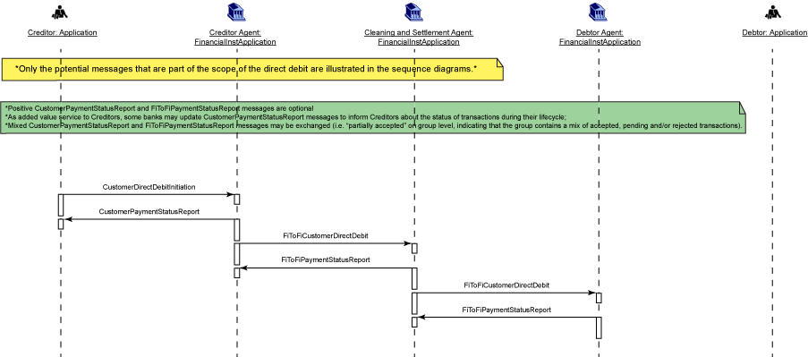
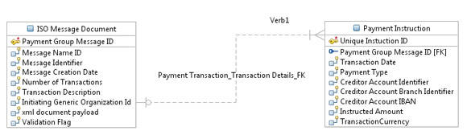
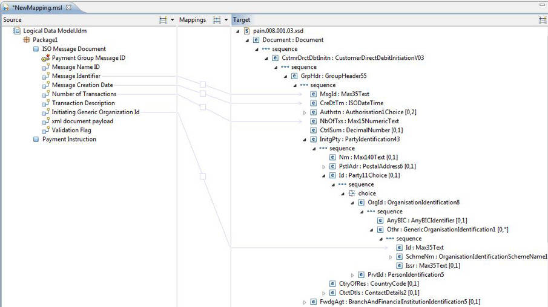
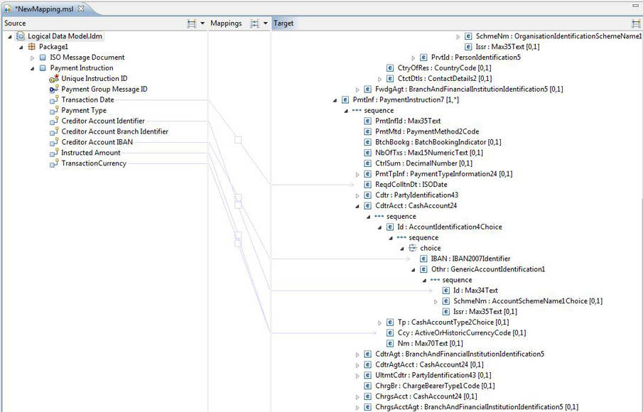
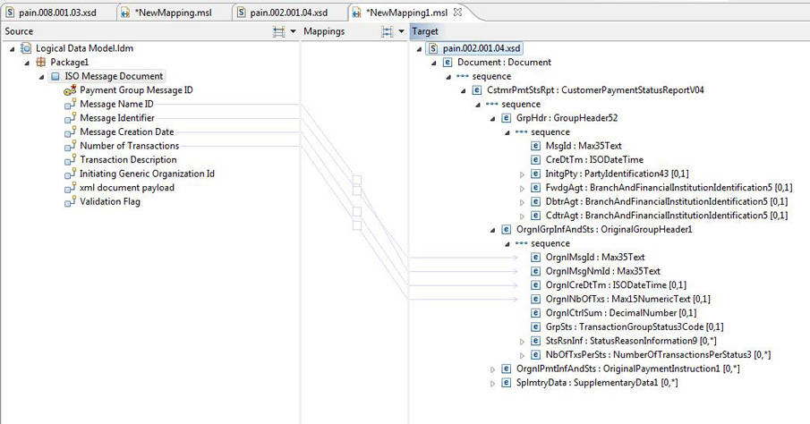

# 在支付处理解决方案中实现 ISO 20022 支付发起消息
即使现有的模型和格式不容易符合，也要学习如何实现这些标准

**标签:** 数据存储

[原文链接](https://developer.ibm.com/zh/articles/dm-1307isopayment/)

Edel Meehan, Oleg Tyschenko

发布: 2014-01-24

* * *

## 简介

国际标准的使用使得各行各业的运作变得更加有效和高效，它们为产品和服务提供了规范，以确保产品和服务安全、可靠、具有良好的质量。ISO 20022 是国际标准化组织 (ISO) 提议用于开发所有金融消息的平台。但是，提议对入站和出站消息使用 ISO 20022 标准面临的一个挑战是，现有数据模型或已存在的消息格式很难遵守 ISO 消息所应用的标准和结构。

本文概述了 ISO 20022 消息格式，演示了如何使用数据映射技术和工具在解决方案中实现它们。本文中的信息适用于业务分析师、解决方案架构师，以及从事支付处理行业的主题专家。

## ISO 20022 概述

ISO 20022 被视为一个通用的金融行业消息框架，它是 ISO 提议用于开发所有金融消息的平台。ISO 20022 标准包含多个部分，由负责银行、证券和其他金融服务领域的标准化的 ISO 技术委员会 (ISO/TC 68) 开发和维护。ISO 20022 没有描述消息本身；它描述了一个使用以下工具开发标准化消息的通用平台：

- 一种建模方法（基于 UML），用于采用某种与语法无关的方式跨金融业务领域捕获业务交易和关联的消息流。
- 一个业务术语中央字典，常用在金融机构之间的通信中。
- 一组 XML 设计规则，用于将使用 UML 描述的消息转换为 XML 模式。应注意到，XML 不是规定的消息语法，但它常常是首选语法，也是本文中使用的语法。

ISO 20022 实现了跨目前使用大量不同标准和信息格式的领域和地区的端到端处理。金融机构会与其他金融机构和客户交换大量信息。这种交换仅在消息的发送方和接收方对如何解释信息达成共识时才有效。为不同的消息标准建立映射的能力是整个行业的互操作性的一个重要方面。它允许具有不同自动化水平和上市时间需求或容量的各个对等方无缝地执行业务流程。

上面描述的模型使得金融服务行业能够在一个集中的数据字典中掌握其业务的基本知识，衍生出他们使用的金融消息。建模方法将业务规则与交换的物理消息的格式相分离。该模型在不断演变，以满足不断变化的业务需求；而消息格式也在不断演变，以利用最新的技术创新。这使行业能够利用当前的技术，以 ISO 20022 标准的内在灵活性迅速适应未来的变化。

作为标准，ISO 20022 支持融合和共存。使用单一标准从长远来看是最可取的方法，但在此期间，一些标准会继续共存。支付领域采用 ISO 20022 的一种重要催化剂是单一欧元支付区 (Single Euro Payments Area, SEPA)，该地区目前正将国内零售信用转账和直接借记替换为使用 ISO 20022 消息的标准的欧洲支付。从 2014 年 2 月 1 日开始，欧洲委员会规定使用 SEPA 取代所有本地支付系统。这么做的后果是，在这个日期之后，欧元区的绝大多数常规支付和收款必须作为 SEPA 支付来处理。对于银行，会强制在银行间 SEPA 通信中使用 ISO 20022。（应该注意的是，ISO 20022 对其他希望使用银行服务的相关方不是强制性的。）此结果的一个重要推动因素是，许多当前的格式无法支持 SEPA 的一些需求，比如使用一个强制性 IBAN 值的规定。

采用 ISO 20022 对 SEPA 有许多富有吸引力的优势：

1. 它支持改进的直通处理 (STP)，这意味着能够自动处理订单，无需人为干预。
2. 因为整个交易链都使用统一的支付格式，所以处理时间会更短，发生错误的可能性更低。
3. ISO 20022 也是一种特别透明的格式，而且是人类可读的，更容易对错误或不一致性进行跟踪和解决。
4. 几乎所有大型银行都接受该标准。因此，支付格式数量可显著减少，这将减少这些格式的维护成本。
5. 它改进了金融机构之间交换的数据的质量，在数据字典中引入了结构和一致性。

SEPA 数据格式适用于两种 SEPA 支付类型：SEPA 信用转账 (SCT) 和 SEPA 直接借记 (SDD)。这些模式的标准简化了支付发起、处理和其他符合欧洲支付委员会所创建的规则手册的功能，比如对账或退款。

SEPA 支付模式的实现使用了许多 ISO 消息类型，以下各节将更全面地介绍这些类型。

## ISO 支付消息

在 ISO 上下文中，该标准描述了赖以表达信息的协议，而语法是用于表达信息的格式或 _语言_ 。消息定义提供了对可在各方之间交换的信息和数据格式（字段长度、代码和字符集）的明确分类，在逻辑上，这些格式可被视为对消息中交换的数据、其结构和其含义的描述。这些逻辑定义可映射到 ISO 20022 中定义的业务定义。尽管 ISO 没有规定消息的语法，但 XML 是消息规范中使用最广泛的语法，而且 XML 消息模式源自 ISO UML 消息模型。

ISO 20022 消息可用于完整的端到端支付链：客户到银行（支付）、银行到银行（支付清算与结算），以及报告（现金管理）。这些金融消息定义分为多个业务区域（这些是行业中公认的功能领域），由业务区域代码（4 个字符）来标识。这些代码是：

- acmt – 帐户管理
- admi – 行政管理
- caaa – 承兑人到受让人卡交易
- camt – 现金管理
- catm – 终端管理
- pacs – 支付清算与结算
- pain – 支付发起
- reda – 参考数据
- seev – 证券事件
- semt – 证券管理
- sese – 证券结算
- setr – 证券交易
- trea – 金库
- tsmt – 交易服务管理
- tsin – 交易服务启动

表示一次特定的业务交易的消息流由来自上面定义的业务区域的消息组成。例如，客户发起的直接借记发起消息 (pain.008.001.03) 将导致出现客户支付状态报告消息 (pain.002.001.04)。所有业务区域的消息流的详细信息可在 ISO 20022 网站的 “ISO 支付消息” 部分（参见 参考资料 ）中找到。

下一节将介绍 ISO 20022 客户直接借记发起消息的使用场景。

### 直接借记消息示例

直接借记或直接提款是一种金融交易，其中一个人（债权人）从另一个人（债务人）的银行帐户提取资金。从形式上讲，直接提取资金的人（收款人）告诉他或她的银行从另一个人（付款人）指定的他的银行帐户收取（也就是借入）一笔资金，将这些资金支付给收款人指定的银行帐户。直接借记会导致债权人与债务人通过基础设施或通汇银行进行现金转账。它们可作为单个指令进行交换，但在传统上，可以按照一些通用特征将它们分组到一起，并通常在批处理模式下进行交换，以提高效率。

使用 ISO 标准，发起方将支付发起 (pain.008.001.03) 消息发送给转账代理或债权人代理。它被用于从一个债权人的各个债务人的帐户请求单次收取或批量收取资金。

图 1（查看 [大图](idefile1.html) ）显示了 ISO 提供的一个序列图，用于描述发起一次直接借记的积极场景。在该场景中：

1. **CustomerDirectDebitInitiation** 消息由发起方（债权人）发送到转账代理或债权人代理。它被用于从一个债权人的各个债务人的帐户请求单次收取或批量收取现金。
2. **FItoFICustomerDirectDebit** 消息由一家金融机构直接或通过一个清算系统发送给另一家金融机构。它被用于清算非金融就客户发起的直接借记指令。
3. 积极的 **CustomerPaymentStatusReport** 消息（单个或分组）和 **FIToFIPaymentStatusReport** 消息（单个或分组）由指令的接收方发送，通知接收方该指令已接收并可供处理。

##### 直接借记消息示例



清单 1 显示了 Smith 保险公司向它的帐户服务方 AAAAUS29 发送的客户直接借记发起消息。AAAAUS29 依照协议 VERPA-1 向 Smith 提供了一项特殊服务。直接借记发起消息包含单个收款指令。该指令用于从帐户 789101 收取 985 英镑，该帐户归债务人 Lee 所有，并由代理 CCCCUS27 提供服务。这是一种一次性直接借记，它在 2013 年 6 月 8 号使用引用消息 SMITH2435/2012 通知 Lee。这笔支付用于一笔汽车保险费。请求的收款日期是 2012 年 7 月 13 日，与处理该指令相关的手续费将在 Smith 保险公司与债务人之间分摊。

##### 客户直接借记发起消息

```
<?xml version="1.0" encoding="UTF-8"?>
<?valid true?>
<?description Sample Message?>
<Document xmlns:xsi="http://www.w3.org/2001/XMLSchema-instance"
xmlns="urn:iso:std:iso:20022:tech:xsd:pain.008.001.03">
<CstmrDrctDbtInitn>
    <GrpHdr>
      <MsgId>CAVAY1234</MsgId>
      <CreDtTm>2013-06-02T14:25:00</CreDtTm>
      <NbOfTxs>1</NbOfTxs>
      <CtrlSum>985</CtrlSum>
      <InitgPty>
        <Nm>Smith</Nm>
        <PstlAdr>
          <StrtNm>Virginia Lane</StrtNm>
          <BldgNb>3</BldgNb>
          <PstCd>W12 8QT</PstCd>
          <TwnNm>London</TwnNm>
          <Ctry>GB</Ctry>
        </PstlAdr>
        <CtctDtls>
          <Nm>J. Thompson</Nm>
          <EmailAdr>Thompson@Smith.com</EmailAdr>
        </CtctDtls>
      </InitgPty>
    </GrpHdr>
    <PmtInf>
      <PmtInfId>CAVAY/88683</PmtInfId>
      <PmtMtd>DD</PmtMtd>
      <BtchBookg>false</BtchBookg>
      <ReqdColltnDt>2013-07-13</ReqdColltnDt>
      <Cdtr>
        <Nm>Smith</Nm>
        <PstlAdr>
          <StrtNm>Virginia Lane</StrtNm>
          <BldgNb>3</BldgNb>
          <PstCd>W12 8QT</PstCd>
          <TwnNm>London</TwnNm>
          <Ctry>GB</Ctry>
        </PstlAdr>
      </Cdtr>
      <CdtrAcct>
        <Id>
          <Othr>
            <Id>789123</Id>
          </Othr>
        </Id>
      </CdtrAcct>
      <CdtrAgt>
        <FinInstnId>
          <BICFI>AAAAUS29</BICFI>
        </FinInstnId>
      </CdtrAgt>
      <DrctDbtTxInf>
        <PmtId>
          <EndToEndId>AY090327/456</EndToEndId>
        </PmtId>
        <PmtTpInf>
          <InstrPrty>NORM</InstrPrty>
          <SvcLvl>
            <Prtry>VERPA-1</Prtry>
          </SvcLvl>
          <SeqTp>OOFF</SeqTp>
        </PmtTpInf>
        <InstdAmt Ccy="GBP">985</InstdAmt>
        <ChrgBr>SHAR</ChrgBr>
        <DrctDbtTx>
          <PreNtfctnId>Smith2435/2013</PreNtfctnId>
          <PreNtfctnDt>2013-06-08</PreNtfctnDt>
        </DrctDbtTx>
        <DbtrAgt>
          <FinInstnId>
            <BICFI>CCCCUS27</BICFI>
          </FinInstnId>
        </DbtrAgt>
        <Dbtr>
          <Nm>Lee</Nm>
          <PstlAdr>
            <StrtNm>Cross Road</StrtNm>
            <BldgNb>45</BldgNb>
            <PstCd>E56 7HY</PstCd>
            <TwnNm>London</TwnNm>
            <Ctry>GB</Ctry>
          </PstlAdr>
        </Dbtr>
        <DbtrAcct>
          <Id>
            <Othr>
              <Id>789101</Id>
            </Othr>
          </Id>
        </DbtrAcct>
        <RmtInf>
          <Ustrd>CAR INSURANCE PREMIUM</Ustrd>
        </RmtInf>
      </DrctDbtTxInf>
    </PmtInf>
</CstmrDrctDbtInitn>
</Document>

```

Show moreShow more icon

在响应中，发送了一条积极的客户支付状态报告消息 (pain.002.001.04)，以确认消息已（基于客户概要信息）通过验证并被接受。

##### 客户支付状态报告消息

```
<?xml version="1.0" encoding="UTF-8"?>
<?valid true?>
<?description Sample CustomerPaymentStatusReport to acknowledge that the message passed
validation and was accepted based on the customer profile.?>
<Document xmlns:xsi="http://www.w3.org/2001/XMLSchema-instance"
xmlns="urn:iso:std:iso:20022:tech:xsd:pain.002.001.04">
    <CstmrPmtStsRpt>
        <GrpHdr>
            <MsgId>BBBB/120928-PSR/001</MsgId>
            <CreDtTm>2013-09-28T14:09:00</CreDtTm>
            <InitgPty>
                <Nm>Smith</Nm>
                <PstlAdr>
                    <StrtNm>Virginia Lane</StrtNm>
                    <BldgNb>3</BldgNb>
                    <PstCd>W12 8QT</PstCd>
                    <TwnNm>London</TwnNm>
                    <Ctry>GB</Ctry>
                </PstlAdr>
            </InitgPty>
            <DbtrAgt>
                <FinInstnId>
                    <BICFI>AAAAUS29</BICFI>
                </FinInstnId>
            </DbtrAgt>
        </GrpHdr>
        <OrgnlGrpInfAndSts>
            <OrgnlMsgId>CAVAY1234</OrgnlMsgId>
            <OrgnlMsgNmId>pain.008.001.03</OrgnlMsgNmId>
            <OrgnlCreDtTm>2013-09-28T14:07:00</OrgnlCreDtTm>
            <OrgnlNbOfTxs>1</OrgnlNbOfTxs>
            <OrgnlCtrlSum>985</OrgnlCtrlSum>
            <GrpSts>ACCP</GrpSts>
        </OrgnlGrpInfAndSts>
    </CstmrPmtStsRpt>
</Document>

```

Show moreShow more icon

根据具体场景，也可能会拒绝发起请求，这一结果在响应消息中指定，其中包含更多细节和一个交易状态 ‘Reject’。

```
<TxSts>RJCT</TxSts>

```

Show moreShow more icon

所有积极和消极的场景（业务流）都已在 ISO 20022 支付模型中备案。

上述消息流和样例消息仅描述了接收和响应以 ISO 20022 格式发送的消息的过程。通常，需要将消息转换为一种内部系统格式并将它映射到某个数据模型。下一节将介绍如何执行此映射，以便能够处理支付发起请求。

## ISO 数据映射

尽管 ISO 消息可用于金融机构内外的消息发送者和接收者之间的消息交换，但有时可能需要将它从 ISO 映射到其他消息格式，或者进行内部数据存储。映射不同的消息标准的能力是整个行业的互操作性的一个重要方面。它支持具有不同自动化水平和上市时间需求或容量的各个对等方无缝地执行业务流程。

数据映射练习将源数据元素映射到目标。在本文中，我们将讨论 ISO 20022 支付发起消息与一个样例交易系统数据模型之间的数据映射流程。

您可以使用 InfoSphere® Data Architect 作为工具来帮助基于 ISO 20022 的数据映射，建模、关联数据并将它们集成到设计中。InfoSphere Data Architect 可创建逻辑、物理和领域模型，其中各个元素可在标准 UML 图中直观地表示。它在整个数据生命周期都利用了数据模型值。在本文中，InfoSphere Data Architect 被用作工具来演示整个数据映射练习中的数据仲裁和数据关系步骤。

数据映射工作流中的总体步骤包括：

- 定义两个来源（ISO 消息与交易系统数据模型）之间的数据仲裁
- 运行数据分析，以识别可能的关系和数据类型
- 跟进分析，以识别间接关系并调整数据属性，从而形成完整的数据流
- 定义数据源与目标之间的系统接口

### 数据仲裁

数据映射流程的第一步是数据仲裁阶段，在该阶段中，将客户的交易系统中的内部数据源映射到 ISO 消息。当数据映射是使用仲裁数据模型的间接映射时，该流程也被称为数据仲裁。

在该阶段中，您需要识别主要数据源。输入数据被称作 _数据源_ ，它们通常来自客户的主要交易系统。此时的目的是将数据映射到合适的 ISO XML 消息结构。

在本文中，假设相关的数据源已存在并且已被识别出来（包含元数据）。如果有一个现有的数据仓库，那么数据源将是已知的，项目可能不需要任何更多的信息。

另一方面，在某些场景中，数据模型可能需要修订。如果数据模型更改不可能实现，那么可以将数据包装层视为一个将数据源聚合到单个层中的选项。

图 2 中的示例显示了两个实体之间的数据仲裁，在该示例中，方便 ISO 消息与交易系统之间的数据映射的仲裁数据模型已经被识别和建模。InfoSphere Data Architect 中内置的图形设计器使得用户能够轻松地仲裁新数据源，或者修改现有的仲裁作业。在许多情况下，创建一个作业非常简单，只需将现有的阶段拖放到一个连接的系列中即可。

##### 数据仲裁



在此示例中，数据目标是 Payment Instruction 实体，其中定义了所有关键的数据属性。两个实体之间的一种关系演示了数据仲裁步骤中的一个流程。每个数据集表示为一个数据实体。ISO Message Document 实体包含 XML 消息头和 XML 文档有效负载。Payment Instruction 数据实体包含交易系统数据模型中定义的数据属性，这些属性用于该系统范围内的支付流程。

传入的 XML 消息可能在 XML 有效负载中包含多个交易。这显示为与 Payment Instruction 实体的 “0 或 1 对多” 关系。“0” 表示消息验证失败，会导致传入的 XML 消息中没有定义 Payment Instruction。

在上一个示例中，出于审计和验证之目的，所有 XML 文档有效负载都将存储在 ISO Message Document 数据实体中。来自数据源的主要 XML 字段（比如 Message Name Identifier、Message Creation Date 等）存储为实体的数据属性。这使得所有支付响应消息变得更简单（在这些消息中，需要将数据属性发送回支付指令发起人）。根据业务需求，需要确定哪些字段应该存储为单个属性。这方面的示例包括消息标识、交易数量和分组消息头。

完成 ISO 消息业务规则验证后，交易系统定义的字段被存储在 Payment Instruction 实体中。作为数据仲裁步骤的一部分，需要定义简化系统的支付流程所需的属性。作为此过程的一部分，需要考虑以下项：业务和功能需求、当地对支付交易的法律规定、数据保留和数据合规性规则、交易系统审计、交易响应代码或状态（一些数据应在响应中发送回数据源发起人），等等。

### 数据关系

此任务的目的是识别仲裁数据模型与 ISO 消息之间的关系。

一种关系级别表示数据源或仲裁数据模型的高级视图，为进行数据映射奠定了基础。您可以使用 InfoSphere Data Architect 创建高级视图。

**备注** ：结构变体是数据实体在类型或结构上的变化。不同的类型通常具有一些相同的属性，也有一些不同的属性。

在此阶段中，需要执行以下步骤：

- 识别数据类型，包括转换
- 识别结构中的变化
- 识别跨结构变体的共性
- 基于结构变化来识别元模型

如果来源和目标数据类型不匹配，则需要实现转换逻辑。这还应当包含基于 ISO 消息模式的验证规则。这方面的示例可能包括不同的字符串长度、预定义的字符串值，等等。

您也可以使用 InfoSphere Data Architect 在 ISO 20022 消息与交易系统数据模型之间建立一种数据关系。图 3（查看 [大图r](sidefile2.html) ）演示了 pain.008（直接借记指令）与 ISO Message Document and Payment Instruction 属性之间的关系。

**备注** ：从 InfoSphere Data Architect 的角度讲，数据模型是数据映射的外部数据实体的中央来源，没有反映数据流。在下面的示例中，数据模型被视为数据源。但是，从数据流角度讲，数据源是 ISO pain.008 消息。

##### pain.008 消息的数据映射 (ISO Message Document)



##### pain.008 消息的数据映射 (Payment Instruction)



查看图 4 的 [大图](sidefile3.html) 。

图 5（查看 [大图](sidefile4.html) ）显示了如何以消息响应或支付处理结果的形式将原始消息中收到的一些数据字段传送回消息发起人 (pain.002)。

##### pain.002 消息的数据映射



数据映射表示 ISO 消息的字段与数据模型之间的一种关系。这包括属性的类型、长度和验证规则。

表 1 显示了 pain.008 消息和交易系统数据模型的数据映射。InfoSphere Data Architect 能够以 CSV 文件格式生成类似的输出。

表 1：

##### Table 1. Data mapping for pain.008 messagepain.008 消息的数据映射

ISO pathXML tagISO data typeData entityData attributeData typeDocument/@xmlnsMap the content of the namespace after xsd: to the Message Name (required for response) e.g. pain.008.001.03 ISO Message Document Message Name ID CHAR(35) CstmrDrctDbtInitn/GrpHdr/MsgId MsgId Max35Text ISO Message Document Message Identifier CHAR(35) CstmrDrctDbtInitn/GrpHdr/CreDtTm CreDtTm ISODateTime ISO Message Document Message Creation Date DATE CstmrDrctDbtInitn/GrpHdr/NbOfTxs NbOfTxs Max15NumericText ISO Message Document Number of Transactions NUMERIC(15,0) CstmrDrctDbtInitn/GrpHdr/InitgPty/Id/OrgId/Othr/Id Id Max35Text ISO Message Document Initiating Generic Organisation ID CHAR(35) CstmrDrctDbtInitn/PmtInf/PmtMtd PmtMtd PaymentMethod2Code See note 1 below.CstmrDrctDbtInitn/PmtInf/PmtTpInf/CtgyPurp/Cd Cd ExternalCategoryPurpose1Code Payment Instruction Payment Type Identifier VARCHAR(3)  CstmrDrctDbtInitn/PmtInf/ReqdColltnDt ReqdColltnDt ISODate Payment Instruction Requested Date DATE  CstmrDrctDbtInitn/PmtInf/CdtrAcct/Id/Othr/Id Id Max34Text ISO Message Document Creditor Account Identifier CHAR(35)  CstmrDrctDbtInitn/PmtInf/CdtrAcct/Id/IBAN IBAN IBAN2007Identifier Payment Instruction Creditor Account IBAN CHAR(34)  CstmrDrctDbtInitn/PmtInf/CdtrAgt/BrnchId/Id Id Max35Text Payment Instruction Creditor Account Branch Identifier CHAR(35)  CstmrDrctDbtInitn/PmtInf/DrctDbtTxInf/InstdAmt InstdAmt ActiveOrHistoricCurrencyAndAmount Payment Instruction Instructed Amount NUMERIC(23,5)  CstmrDrctDbtInitn/PmtInf/DrctDbtTxInf/InstdAmt/@Ccy InstdAmt ActiveOrHistoricCurrencyAndAmount Payment Instruction TransactionCurrency CHAR(3) CstmrDrctDbtInitn/PmtInf/ DrctDbtTxInf/ DbtrAgt DbtrAgt BranchAndFinancialInstitutionIdentification5 See note 2 below.CstmrDrctDbtInitn/PmtInf/DrctDbtTxInf/ Dbtr Dbtr PartyIdentification43 See note 2 below.CstmrDrctDbtInitn/PmtInf/DrctDbtTxInf/ DbtrAcct/Id/Othr/Id Id Max35Text See note 3 below.CstmrDrctDbtInitn/PmtInf/ DrctDbtTxInf/ InstrForCdtrAgt InstrForCdtrAgt Max140Text Payment Instruction Product ID CHAR(3)

表 2 显示了 pain.002 消息和交易系统数据模型的数据映射。

表 2：

##### Table 2. Data Mapping for pain.002 message

ISO pathXML tagISO data typeData entityData attributeData type CstmrPmtStsRpt/GrpHdr/MsgId  MsgId  Max35Text  ISO Message Document  Transaction Message ID  CHAR(35)  CstmrPmtStsRpt/GrpHdr/CreDtTm  CreDtTm  ISODateTime  ISO Message Document  Message Creation Date  DATE  CstmrPmtStsRpt/OrgnlGrpInfAndSts/OrgnlMsgId  OrgnlMsgId  Max35Text  ISO Message Document  Message Identifier  CHAR(35)  OrgnlGrpInfAndSts/OrgnlMsgNmId  OrgnlMsgNmId  Max35Text  ISO Message Document  Message Name ID  CHAR(35)  OrgnlGrpInfAndSts/OrgnlNbOfTxs  OrgnlNbOfTxs  Max15NumericText  ISO Message Document  Number of Transactions  NUMERIC(15,0)  OrgnlPmtInfAndSts/PmtInfSts  TxSts  TransactionIndividualStatus3Code See note below OrgnlPmtInfAndSts/TxInfAndSts/TxSts  TxSts  TransactionIndividualStatus3Code See note belowOrgnlPmtInfAndSts/TxInfAndSts/StsRsnInf/Rsn/Prtry  Prtry  Max35Text  Payment Instruction Lifecycle Status  Payment Instruction State Type Id  NUMERIC(15,0)

**备注** ：表 1 和表 2 演示了一些重要字段和属性，仅用于展示数据映射流程的目的。应针对最新版本的ISO 20022 消息来验证 XML 字段的完整列表，以及它们在消息有效负载中的存在性。

## 结束语

按照 ISO 20022 支付消息的指令，本文引导您了解了 ISO 支付发起消息（pain.008 和 pain.002）的数据映射练习。基于支付类型和业务需求，您可以将同一种方法用于其他类型的 ISO 消息。

任何数据保留或合规性需求都应在数据映射练习中考虑。这可能影响您的数据映射方法，因为根据数据类型和业务用途，可能不允许存储某些属性。举例而言，如果 XML 有效负载包含被数据合规性法规禁止的信息，那么 XML 字段中的数据无法存储在 XML 有效负载中。

完成 ISO 消息数据映射练习后，在交易系统能够接收和返回 ISO 定义的消息时，我们为数据流生成了一个流程和一些规则。消息被转换为交易系统数据模型，并基于系统业务规则而被存储。

本文翻译自： [Implement ISO 20022 payment initiation messages in a payment processing solution](https://developer.ibm.com/articles/dm-1307isopayment/)（2014-01-24）