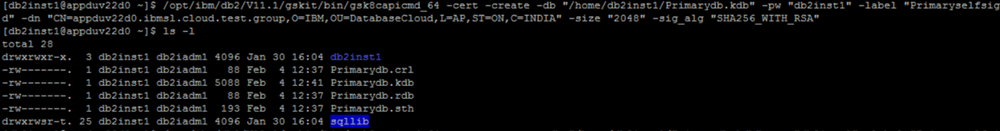
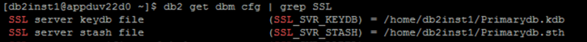
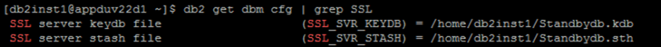
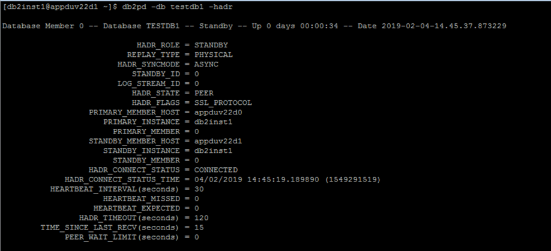
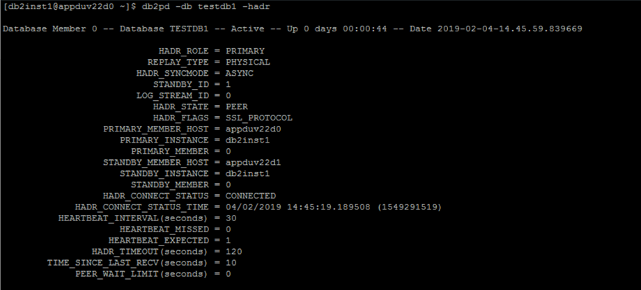

# 在现有 HADR 环境中配置新的 SSL 证书
重新创建并提取新的安全套接字层证书，提高数据安全性

**标签:** IBM Db2 Database,分析,数据库

[原文链接](https://developer.ibm.com/zh/articles/adding-new-ssl-certificate-into-existing-hadr-environment/)

Amol D Barsagade

发布: 2019-02-27

* * *

## 引言

Db2 数据库系统支持安全套接字层 (SSL)，在这种情况下，客户端可以使用 SSL 套接字与 Db2 服务器建立连接。CLP 和 .Net 数据提供者客户端应用程序以及使用 IBM Data Server Driver for JDBC and SQLJ（第 4 种类型的连接）的应用程序也支持 SSL。本文中的分步方法将向您展示如何将新的 SSL 证书添加到 HADR 环境中的 Db2 服务器。详细步骤还包括如何移除旧 SSL 证书，重新创建和提取新 SSL 证书，以及如何在添加新 SSL 证书后重置 HADR 环境。

**相关假设**

我们假设已安装了 Db2 v11 HADR 且具有一个数据库。详细信息如下：

```
Primary server : appduv22d0.ibmsl.cloud.test.group
Standby server : appduv22d1.ibmsl.cloud.test.group
Db2 instance primary server : db2inst1
Db2 instance standby server : db2inst1
Db2 database : testdb1
Existing SSL Certificate label on Primary : Primaryselfsigned
Existing SSL Certificate label on Standby : Standbyselfsigned

```

Show moreShow more icon

同时还假设我们现有一个 SSL 证书，在主服务器和备用服务器上的标签分别为 _Primaryselfsigned_ 和 _Standbyselfsigned_，并且包含条目 _Key Size 1024_ 和 _Signature Algorithm SHA1WithRSASignature_。

如果您需要添加另一个包含条目 _Key Size 2048_ 和 _Signature Algorithm SHA256WithRSASignature_ 的证书，那么我们首先要禁用 HADR，然后删除现有 SSL 证书，接着创建一个新证书，之后再重新启用 Db2 HADR。

**第 1 步：移除旧 SSL 证书和密钥数据库**

在主服务器和备用服务器上，继续重新创建新 SSL 证书之前，我们需要删除现有的 SSL 证书和密钥数据库。

- 在主服务器上，移除旧 SSL 证书。

您需要移除标签为 _Primaryselfsigned_ 的旧 SSL 证书。

```
$ /opt/ibm/db2/V11.1/gskit/bin/gsk8capicmd_64 -cert -delete -db “/home/db2inst1/Primarydb.kdb” -
pw “xxxxxx” -label “ Primaryselfsigned “

```

Show moreShow more icon

源数据库密码：xxxxxx

- 确认证书已删除。

要确认标签为 _Primaryselfsigned_ 的 SSL 证书已删除，可尝试显示该证书，并确保该证书未显示。

```
$ /opt/ibm/db2/V11.1/gskit/bin/gsk8capicmd_64 -cert -details -db “/home/db2inst1/Primarydb.kdb” -
pw “xxxxxx” -label “Primaryselfsigned “

```

Show moreShow more icon

CTGSK3029W 该数据库不包含标签为 _Primaryselfsigned_ 的证书。

- 移除旧密钥数据库。

移除旧密钥数据库 Primarydb.kdb，这还将移除相关文件。

```
$ /opt/ibm/db2/V11.1/gskit/bin/gsk8capicmd_64 -keydb -delete -db "/home/db2inst1/Primarydb.kdb" -
pw "xxxxxx"

```

Show moreShow more icon

注意：确认文件已经从密钥数据库位置（即“/home/db2inst1/”）移除，同时也移除旧证书的提取文件，即 primary.arm 和 standby.arm。

**第 2 步：创建新密钥数据库**

以下命令将创建一个名为 _Primarydb.kdb_ 的密钥数据库和一个名为 _Primarydb.sth_ 的存储文件

```
$ /opt/ibm/db2/V11.1/gskit/bin/gsk8capicmd_64 -keydb -create -db "/home/db2inst1/Primarydb.kdb" -
pw "xxxxxx" –stash

```

Show moreShow more icon

-stash 选项将在密钥数据库所在的路径上创建一个存储文件，文件扩展名为 .sth。在实例启动时，GSKit 使用该存储文件获取密钥数据库的密码。

- 确认在密钥数据库位置（即“/home/db2inst1”）中创建了以下文件。

```
$ ls -ltr | grep -i key
-rw-------.1 db2inst1 db2iadm1 88 Feb 4 12:37 Primarydb.crl
-rw-------.1 db2inst1 db2iadm1 88 Feb 4 12:37 Primarydb.kdb
-rw-------.1 db2inst1 db2iadm1 88 Feb 4 12:37 Primarydb.rdb
-rw-------.1 db2inst1 db2iadm1 193 Feb 4 12:37 Primarydb.sth

```

Show moreShow more icon

**第 3 步：将新 SSL 证书添加到密钥数据库**

在这里，我们将添加一个大小为 _2048_ 且签名算法为 _SHA256WithRSA_ 的新 SSL 证书，
如下所示：

```
$ /opt/ibm/db2/V11.1/gskit/bin/gsk8capicmd_64 -cert -create -db "/home/db2inst1/Primarydb.kdb" -
pw "xxxxxx" -label " Primaryselfsigned " -dn "CN= appduv22d0.ibmsl.cloud.test.group
,O=IBM,OU=DatabaseCloud ,L=AP,ST=ON,C=INDIA" -size "2048" -sig_alg "SHA256WithRSA"

```

Show moreShow more icon

注意：确保更新 _Primarydb.kdb_ 文件的大小和时间戳记。



**第 4 步：提取证书**

提取刚才创建的证书，以便将其分发给运行客户端的计算机，这些客户端将与您的 Db2 服务器建立 SSL 连接。

注意：移除旧的 Primary.arm（如果存在），并提取包含新文件 _Primary.arm_ 的证书，如下所示：

```
$ /opt/ibm/db2/V11.1/gskit/bin/gsk8capicmd_64 -cert -extract -db "/home/db2inst1/Primarydb.kdb" -
pw "xxxxxx" -label "Primaryselfsigned" -target “/home/db2inst1/Primary.arm” -format ascii -fips

```

Show moreShow more icon

注意：确保创建了用于提取证书“Primary.arm”的文件。

```
$ ls -ltr | grep -i my
-rw-rw-r--.1 db2inst1 db2iadm1 1354 Feb 4 12:43 Primary.arm

```

Show moreShow more icon

**第 5 步：显示证书**

在创建和提取新的 SSL 证书之后，您将需要显示该证书并验证参数，例如密钥大小和签名算法。

发出以下命令来显示证书：

```
$ /opt/ibm/db2/V11.1/gskit/bin/gsk8capicmd_64 -cert -details -db "/home/db2inst1/Primarydb.kdb" -pw "xxxxxx" -label "Primaryselfsigned"

```

Show moreShow more icon

注意：您将看到以下证书：

```
Label : Primaryselfsigned
Key Size : 2048
Version : X509 V3
Serial : 65d7db7c564bd66f
Issuer : CN=appduv22d0.ibmsl.cloud.test.group,OU=DatabaseCloud,O=IBM,L=AP,ST=ON,C=INDIA
Subject : CN=appduv22d0.ibmsl.cloud.test.group,OU=DatabaseCloud,O=IBM,L=AP,ST=ON,C=INDIA
Not Before : 3 February 2019 12:41:52 GMT
Not After : 4 February 2020 12:41:52 GMT
Public Key
30 82 01 22 30 0D 06 09 2A 86 48 86 F7 0D 01 01
01 05 00 03 82 01 0F 00 30 82 01 0A 02 82 01 01
00 CB AA 51 76 AB BC 2B 24 1A 2A 1E E7 9A B6 FE
4D 4B CE A6 2F AF 59 83 58 D2 6C 0A 76 8B 82 14
3D D1 BF 93 FD 40 7F AD A6 56 98 19 06 73 CA DD
B3 9F D9 B3 EE 1C 43 38 FA C4 1C 6D E8 B1 9D 94
A3 EB 7A 0A A2 E2 72 47 37 C0 6D 5F 2F 6F CF 6F
88 20 E8 20 BF E7 A1 74 9D D8 9A 22 9E E6 FC 67
70 51 1F DF FF F6 8F 03 3C 5A D3 47 0D F4 37 AB
78 E4 7A B3 CE A5 53 14 08 B9 09 57 A9 1A 66 A8
8C BC 70 6D 09 F7 63 F0 73 7B 32 2B 63 B6 79 BF
64 95 FA 2B DA C9 F2 77 38 76 2A 71 92 DE 1B A0
E1 91 50 0E E8 19 C9 68 06 FC 50 84 1B 31 5C E4
25 FE 60 58 17 85 7F C5 94 71 64 FF F7 F2 56 A2
8B 6E 2A 5D 20 D6 E1 32 EC 7D 18 44 2A D7 A7 8D
24 DC 94 C2 14 BD 21 78 3F 59 3D 13 F7 A8 53 37
28 F0 20 BA 64 D2 79 EA 65 E1 3E 9C 6A BB BC C4
EA 00 6C 58 D8 1D D6 E8 66 64 B3 A7 79 41 59 23
95 02 03 01 00 01
Public Key Type : RSA (1.2.840.113549.1.1.1)
Fingerprint : SHA1 :
FD CB 5D 61 47 2C 0D 21 3A AE 23 44 7D 74 66 20
40 9A 6F 3B
Fingerprint : MD5 :
78 D8 9A 99 BD 70 DB C9 D0 A8 D6 DC 54 7D BE DF
Fingerprint : SHA256 :
B1 F6 80 BF E6 E6 94 8C 84 90 50 D8 5C 14 3D 63
00 F2 A7 D1 DA 90 90 05 59 02 25 FD 2E C3 B4 88
Extensions
SubjectKeyIdentifier
keyIdentifier:
93 8D 2E 10 D3 F0 70 85 E5 AB 11 18 8D E6 FF BA
BB E6 03 03
AuthorityKeyIdentifier
keyIdentifier:
93 8D 2E 10 D3 F0 70 85 E5 AB 11 18 8D E6 FF BA
BB E6 03 03
authorityIdentifier:
authorityCertSerialNumber:
Signature Algorithm : SHA256WithRSASignature (1.2.840.113549.1.1.11)
Value
15 0A 41 9E 0D 2F D4 C5 20 F8 81 A2 3A EC A8 2B
3C 49 90 EC BA 52 D9 11 04 BF 99 EA 5B B3 EB 8A
52 A9 E7 50 2B 0B B3 79 CE 32 5F 82 1B 3B EB 7D
BF 58 20 69 BD 4A 27 21 DF 5C 4F 3D 15 99 35 6F
28 BA CE CE A8 4F B5 63 9C 3C B7 16 5C 5A 34 82
64 F5 E1 4B D6 57 E9 A9 E3 56 05 8C 8B 18 E4 B3
1E 75 3A 6F 78 6A 35 67 88 11 5D E4 08 04 04 5C
02 4F 37 03 BA DA 8D A3 85 AB 96 15 19 80 C3 5F
38 B0 93 40 72 40 93 31 2A E1 F2 FC 44 4E 5E 45
61 76 FB 9D 7A EA 92 6E 77 19 5C 9F EA 47 62 36
78 F8 99 80 F5 44 12 44 7A D4 5C 4E 87 43 B6 01
1F D4 9B 2A A7 6A DF 18 A1 C0 FC 90 5B A4 BD 78
3F F3 F7 D6 CE 20 05 50 72 C7 A9 4A 98 89 D3 A6
BB FA 5A 97 D4 72 48 41 11 3C 06 11 73 E6 78 31
25 C1 38 1D DF 9C 77 58 16 10 4A 7F 76 6C 6A 2A
38 42 1B EF 1E 4E 45 FC 7E 26 2D 58 A7 ED EF C5
Trust Status : Enabled

```

Show moreShow more icon

**第 6 步：在备用服务器上重复第 1 步到第 5 步**

在备用服务器上，以 Db2 实例所有者的身份登录，并按照以上演示的方法重复第 1 步到第 5 步，即删除旧的 SSL 和密钥数据库，创建一个新的密钥数据库，添加证书，提取并显示该证书。

- 移除旧 SSL 证书和密钥数据库。

```
$ /opt/ibm/db2/V11.1/gskit/bin/gsk8capicmd_64 -cert -delete -db “/home/db2inst1/Standbydb.kdb” -
pw “xxxxxx” -label “ Standbyselfsigned “

```

Show moreShow more icon

- 确认证书已删除

要确认标签为 _Standbyselfsigned_ 的 SSL 证书已删除，可尝试显示该证书，
并确保旧证书未显示。

```
$ /opt/ibm/db2/V11.1/gskit/bin/gsk8capicmd_64 -cert -details -db “/home/db2inst1/Standbydb.kdb” -
pw “xxxxxx” -label “Standbyselfsigned “

```

Show moreShow more icon

CTGSK3029W 数据库不包含标签为 _Standbyselfsigned_ 的证书。

- 移除旧密钥数据库

移除旧密钥数据库 _Standbydb.kdb_，这还将移除相关文件。

```
$ /opt/ibm/db2/V11.1/gskit/bin/gsk8capicmd_64 -keydb -delete -db "/home/db2inst1/Standbydb.kdb"
-pw "xxxxxx"

```

Show moreShow more icon

注意：确认文件已经从密钥数据库位置（即“/home/db2inst1/”）移除，同时也移除旧证书的提取文件，即 primary.arm 和 standby.arm。

- 创建新密钥数据库。

```
$ /opt/ibm/db2/V11.1/gskit/bin/gsk8capicmd_64 -keydb -create -db "/home/db2inst1/Standbydb.kdb"
-pw "xxxxxx" –stash

```

Show moreShow more icon

- 添加证书

```
$ /opt/ibm/db2/V11.1/gskit/bin/gsk8capicmd_64 -cert -create -db "/home/db2inst1/Standbydb.kdb" -
pw "xxxxxx" -label "Standbyselfsigned" -dn "CN= appduv22d0.ibmsl.cloud.test.group
,O=IBM,OU=DatabaseCloud ,L=AP,ST=ON,C=INDIA" -size “2048” -sig_alg “SHA256_WITH_RSA”

```

Show moreShow more icon

- 提取证书

```
$ /opt/ibm/db2/V11.1/gskit/bin/gsk8capicmd_64 -cert -extract -db "/home/db2inst1/Standbydb.kdb" -
pw "xxxxxx" -label "Standbyselfsigned "-target “/home/db2inst1/Standby.arm” -format ascii -fips

```

Show moreShow more icon

- 显示证书

```
$ /opt/ibm/db2/V11.1/gskit/bin/gsk8capicmd_64 -cert -details -db "/home/db2inst1/Standbydb.kdb" -pw
"xxxxxx" -label " Standbyselfsigned "

```

Show moreShow more icon

**第 7 步：添加主证书和备用证书**

现在，将主证书和备用证书添加到每个主实例和备用实例的密钥数据库中。

- 将证书文件从主实例复制到备用实例，反之亦然。

通过 FTP 将包含主实例证书的文件传输到备用实例。在上一步中，此文件已被提取到名为 primary.arm 的文件中。此外，还需要通过 FTP 将包含备用实例证书的文件（即 standby.arm）传输到主实例。将这些文件放入每个实例上创建密钥数据库的目录中。

- 在主实例上，执行以下命令：

```
$ scp /home/db2inst1/Primary.arm db2inst1@appduv22d1:/home/db2inst1

```

Show moreShow more icon

- 在备用实例上，执行以下命令：

```
$ scp /home/db2inst1/Standby.arm db2inst1@appduv22d0:/home/db2inst1

```

Show moreShow more icon

- 将主实例的证书添加到备用实例的密钥数据库中。

在备用实例上，执行以下命令：

```
$ /opt/ibm/db2/V11.1/gaskit/bin/gak8campicmd_64 -cert -add -db “/home/db2inst1/Standbydb.kdb” -
pw “xxxxxx” -label “Primaryselfsigned” -file “/home/db2inst1/Primary.arm” -format ascii -fips

```

Show moreShow more icon

注意：添加证书后，Standbydb.kdb 的大小将发生变化。

```
$ ls -ltr | grep -i key
-rw-------.1 db2inst1 db2iadm1 10088 Feb 4 14:07 Standbydb.kdb

```

Show moreShow more icon

- 将备用实例的证书添加到主实例的密钥数据库中。

在主实例上，执行以下命令：

```
$ /opt/ibm/db2/V11.1/gaskit/bin/gak8campicmd_64 -cert -add -db “/home/db2inst1/Primarydb.kdb” -
pw “xxxxxx” -label “Standbyselfsigned” -file “/home/db2inst1/Standby.arm” -format ascii -fips

```

Show moreShow more icon

注意：添加证书后，Primarydb.kdb 的大小将发生变化。

```
$ ls -ltr | grep -i key
-rw-------.1 db2inst1 db2iadm1 10088 Feb 4 14:09 Primarydb.kdb

```

Show moreShow more icon

注意：如果存在多个备用数据库，那么必须将 HADR 配置中每个实例的证书导入到每个实例的密钥数据库中，如上所示。

**第 8 步：将 Db2 实例设置为支持 SSL**

要将 Db2 服务器设置为支持 SSL，以 Db2 实例所有者身份登录并设置以下配置参数。

- 设置 ssl\_svr\_keydb 配置参数。

将此配置参数设置为密钥数据库文件的标准路径。必须在主数据库和所有备用数据库的 Db2 实例上完成此步骤。

在主数据库上：

```
$ db2 update dbm cfg using SSL_SVR_KEYDB '/home/db2inst1/Primarydb.kdb'

```

Show moreShow more icon

在备用数据库上：

```
$ db2 update dbm cfg using SSL_SVR_KEYDB '/home/db2inst1/Standbydb.kdb'

```

Show moreShow more icon

- 设置 ssl\_svr\_stash 配置参数

在主数据库上：

```
$ db2 update dbm cfg using SSL_SVR_STASH '/db2home/db2inst1/Primarydb.sth'

```

Show moreShow more icon

在备用数据库上：

```
$ db2 update dbm cfg using SSL_SVR_STASH '/db2home/db2inst1/Standbydb.sth'

```

Show moreShow more icon

- 确认参数已设置

在主数据库上：

```
$ db2 get dbm cfg | grep SSL

```

Show moreShow more icon



在备用数据库上：

```
$ db2 get dbm cfg | grep SSL

```

Show moreShow more icon



**第 9 步：重新启动 Db2 实例**
在主服务器和备用服务器上重新启动 Db2 实例。

```
$ db2 deactivate database testdb1
$ db2 terminate
$ db2stop
$ db2start

```

Show moreShow more icon

**第 10 步：为每个主数据库和备用数据库启用 SSL 通信**

在主数据库上：

```
$ db2 update db cfg for testdb1 using HADR_SSL_LABEL Primaryselfsigned
$ db2 get db cgf for testdb1 | grep HADR_SSL_LABEL

```

Show moreShow more icon

```
HADR SSL Label Certificate (HADR_SSL_LABEL) = Primaryselfsigned

```

Show moreShow more icon

在备用数据库上：

```
$ db2 update db cfg for testdb1 using HADR_SSL_LABEL Standbyselfsigned
$ db2 get db cgf for testdb1 | grep HADR_SSL_LABEL

```

Show moreShow more icon

```
HADR SSL Label Certificate (HADR_SSL_LABEL) = Standbyselfsigned

```

Show moreShow more icon

注意：如果为其中一个主数据库或备用数据库设置了 hadr\_ssl\_label，那么必须为配置中的所有主数据库和备用数据库都设置此参数。如果没有为所有数据库设置 hadr\_ssl\_label，那么主数据库与备用数据库之间的一些 HADR 连接将失败。

如果设置了 hadr\_ssl\_label，那么必须同时设置 ssl\_svr\_keydb 和 ssl\_svr\_stash。否则，HADR 就无法启动，或者主数据库与备用数据库之间的一些 HADR 连接将失败。

**第 11 步：重新启动并监控 HADR**
在备用数据库上：

```
$ db2 start hadr on database testdb1 as standby
$ db2pd -db testdb1 -hadr

```

Show moreShow more icon



在主数据库上：

```
$ db2 start hadr on database testdb1 as primary
$ db2pd -db testdb1 -hadr

```

Show moreShow more icon



## 结束语

您已在现有 Db2 HADR 环境中添加了一个新的 SSL 证书。现在，您已更加深入地了解了如何重新创建新的 SSL 证书和密钥数据库，以及如何提取和显示 SSL 数字证书。此外，您现在还能够将 Db2 服务器设置为支持 SSL，以及重置 HADR。

本文翻译自： [Configure a new SSL certificate into your existing HADR environment](https://developer.ibm.com/articles/adding-new-ssl-certificate-into-existing-hadr-environment/)（2019-02-27）