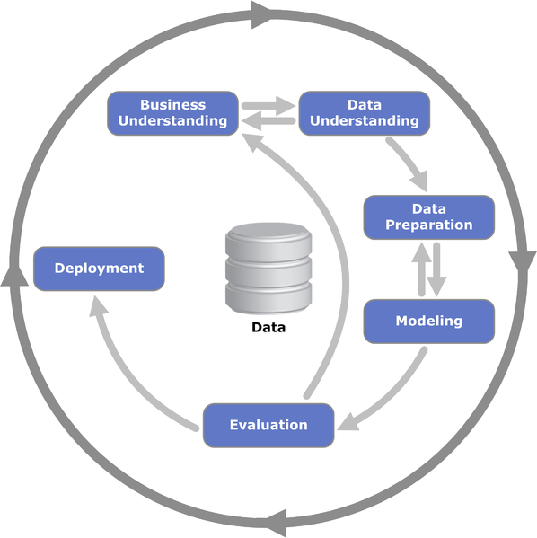
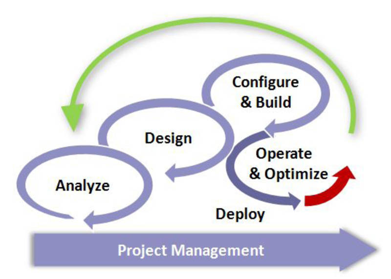
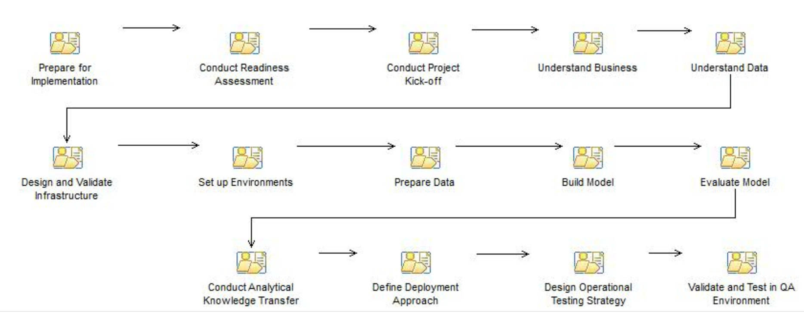
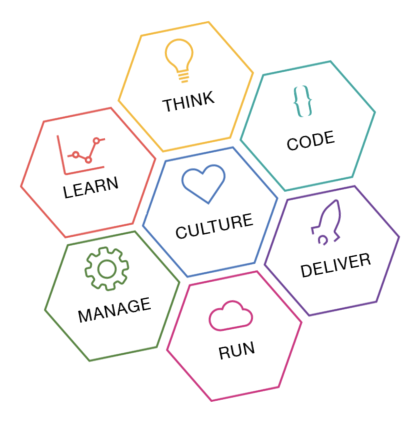
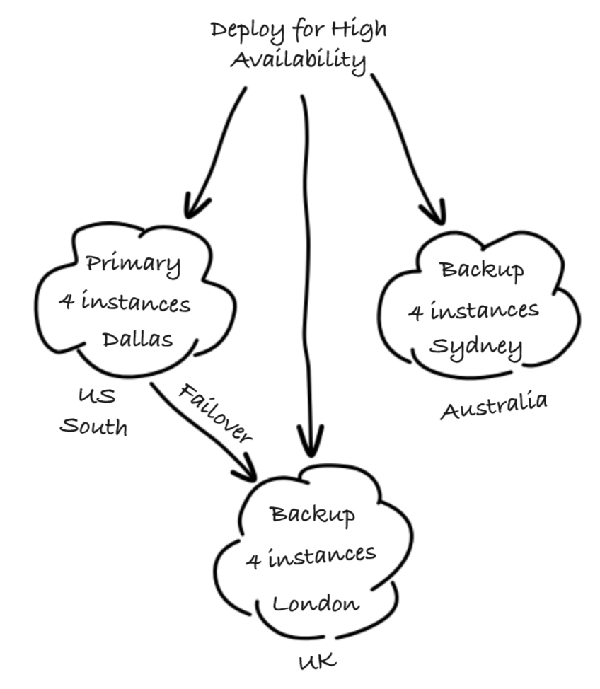
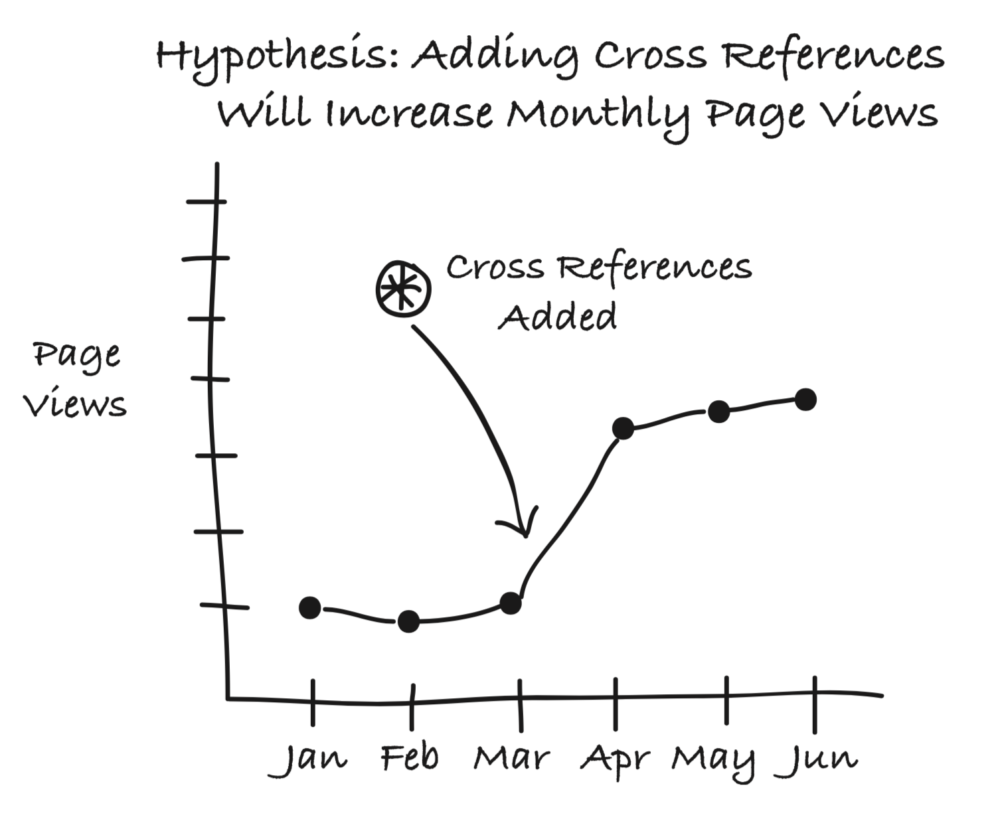
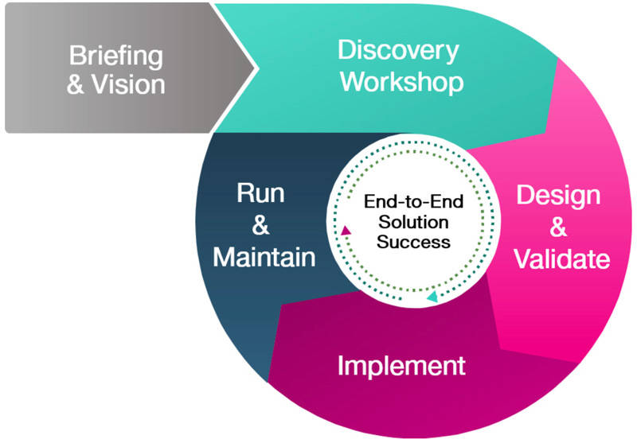

# 在荒芜的数据科学领域中建立架构思维
完全自由选择编程语言、工具和框架的能力有助于改善创造性思维和加快思维演变进程。

**标签:** 人工智能,数据科学,机器学习

[原文链接](https://developer.ibm.com/zh/articles/architectural-thinking-in-the-wild-west-of-data-science/)

[Romeo Kienzler](https://developer.ibm.com/zh/profiles/romeo.kienzler)

发布: 2018-12-05

* * *

_致谢：感谢 Kevin Turner 多次审查本文档并提供宝贵意见。_

数据科学家都倾向于使用一些临时性方法。以创新方式非法侵入各种编程语言脚本的行为，在遍布于服务器和客户端上的各种机器学习框架中随处可见。我并不是要抱怨数据科学家的工作方式。我发现自己经常只有在创造力迸发的状态下才会小有所成。

完全自由选择编程语言、工具和框架的能力有助于改善创造性思维和加快思维演变进程。但最终，数据科学家必须将其资产完全打造成型，然后才能交付，否则可能会存在许多缺陷。接下来，我来介绍一下这些缺陷：

## 技术盲点

从数据科学家的角度来看，他们通常认为实际技术与
功能性取向没有太大关联，因为所使用的模型和算法是以数学方式定义的。因此，算法的数学定义是揭示真相的唯一途径。但对于非功能性需求，这个观点有些站不住脚。例如，编程语言和技术方面的专家的可用情况和成本存在很大的差异。在维护方面，所选择的技术对于项目能否取得成功有很大影响。

数据科学家倾向于使用他们最擅长的编程语言和框架。首先，我来介绍一下 R 和 R-Studio 等开源技术，这些技术的程序包和库数量庞大且难以管理，而且其语法松散且难以维护。随后，我会介绍语法结构完善且经过精心组织的 Python 及相关框架（如 Pandas 和 Scikit-Learn）。另一类工具是“含少量代码或无代码”的完全可视化开源工具，如 Node-RED、KNIME、RapidMiner 和 Weka 以及诸如 SPSS Modeler 之类的商用产品。

“我最熟悉的技术”足以满足概念验证 (proof of concept, PoC)、黑客马拉松或启动式项目的需求。但对于行业和企业级规模的项目，必须提供有关技术使用的一些架构准则，无论此类技术有多浅显易懂都应如此。

## 缺乏再现性和可复用性

鉴于上述问题，我们显然无法容忍企业环境中数据科学资产不受控制的增长。在大型企业中，项目与人力资源可能出现大量流失，例如，仅为特定项目短期雇佣具备特定技能的外部咨询人员。通常，当有人退出项目时，其拥有的知识技能也会随之离去。因此，本质上，数据科学资产并不只是用各种编程语言编写且分布在各个位置和环境中的脚本的集合。由于许多数据科学资产都是在非协作环境下开发的，因此这些资产的可复用性往往是有限的。临时性的文档记录、代码质量差、技术混用且过于复杂以及普遍缺乏专业知识是导致此类问题的主要推动因素。解决这些问题后，资产就会变为可复用并且其价值显著增加。例如，如果未经协调，每位数据科学家都可能针对同一数据源重新创建 ETL（抽取 (Extract) – 变换 (Transform) – 装入 (Load)）、数据质量评估和特征工程管道，从而显著增加开销并降低质量。

## 缺乏协作

数据科学家都是伟大的思想家常识告诉他们，脑容量是不变的。因此，数据科学家倾向于以自己的方式和步调独立工作。当他们遇到棘手的难题时，像“stackexchange.com”这样的 Web 站点就可能成为他们获得帮助的最佳资源。也许是因为不知情或者只是缺少具有同等技能的伙伴，但技术最好的数据科学家往往不擅长协作。从局外人的角度来看，因为他们秉着“哪管死后洪水滔天”的心态，所以没有采用可复用的方式来共享和组织所创建的资产。文档记录欠佳，甚至没有文档记录，而且组件分散，这些都导致难以回溯和复制以前的工作。因此，需要提供一个公共资产存储库并制定最低的文档记录准则。

## 次优架构决策

数据科学家通常是具备线性代数技能和一定程度的业务理解能力的“黑客”。他们通常不是经过培训的软件工程师或架构设计师。如上所述，数据科学家倾向于使用他们最熟悉的编程语言和框架，并快速构建解决方案，而未必会考虑可扩展性、可维护性和人力资源可用性等非功能性需求 (Non-functional requirement, NFR)。因此，我要强调一点，在每个重大数据科学项目中都应设立解决方案架构设计师或首席数据科学家角色，从而确保适当满足 NFR。预定义的架构和流程框架非常适合为此类角色提供支持。但首先，我们来了解一下传统企业架构如何适用于数据科学项目。

## 怎样的架构和流程才适用于数据科学项目

在回答这个问题之前，我们首先来简单回顾一下传统企业架构，然后评估怎样的架构方法和流程模型才适用于此类架构。

_架构层次结构。来源：IBM 公司_

站在金字塔顶端的是企业架构设计师。企业架构设计师负责定义在整个企业内行之有效的标准和准则。示例包括：

- 只要拥有许可证，就可以使用开源软件
- REST 调用始终需要使用 HTTPS
- 使用非关系数据库需要获得来自企业架构委员会的特别核准

解决方案架构设计师在企业架构设计师定义的框架内开展工作。该角色负责定义适用于项目或用例的技术组件。示例包括：

- 必须在 Db2 关系数据库管理系统 (Relational database management system, RDBMS) 中存储历史数据
- 对于实时构造的高吞吐量数据，必须使用 Apache Spark Streaming
- 对于低延迟的实时视频流处理，必须使用 IBM Steams

然后，应用程序架构设计师负责在解决方案架构设计师的框架内定义应用程序。示例包括：

- 使用“模型 – 视图 – 控制器”(Model-View-Controller, MVC) 模式实施 UI
- 对于标准实体，将使用对象关系映射器
- 对于复杂查询，将使用准备好的 SQL 语句

最后，数据架构设计师负责定义数据相关组件，如：

- 在 ETL 期间，必须取消对数据的规范化以构成星型模型
- 在 ETL 期间，必须对所有分类字段和有序字段建立索引

那么在此过程中，富有创造力的全能数据科学家如何一展身手呢？首先，我们尝试定义在以上定义的角色中，数据科学家能部分承担其中哪些角色以及能够与其中哪些角色进行交互。

让我们再来从上到下审视一下这些角色。为了更直观地进行说明，我们以城市设计作比喻。企业架构设计师相当于设计整个城市的人。例如，他们负责定义污水处理系统和道路。解决方案架构设计师相当于每栋房屋的设计人，应用程序架构设计师相当于厨房的设计人，数据架构设计师负责监督电路安装和供水系统。

最后，数据科学家负责打造有史以来最先进的厨房！他们不会采用任何现有的厨房设计。他们会利用个别的现成组件，但也会根据需要创建原创部件。数据科学家与应用程序架构设计师的交互最为频繁。如果对厨房有特殊要求，那么数据架构设计师可能需要提供基础架构。记住这个比喻后，我们再来看一下，如果厨房由数据科学家独立打造，它会变成什么样？它将成为一个功能齐全的厨房，具有很多功能，但很可能欠缺适用性。例如，要启动烤箱，您需要登录到 Raspberry Pi 并运行一个 Shell 脚本。由于各个部件来自不同的供应商（包括某些定制硬件），因此厨房的设计可能并不美观。最后，它虽然提供了大量的功能，但其中有些功能并不必要，而且大部分功能都没有相应的文档记录。

再次从 IT 角度来看，此示例展示了原先问题的答案。在此过程中，富有创造力的全能数据科学家将如何一展身手呢？

数据科学家很少与企业架构设计师进行交互。他们可能会与解决方案架构设计师进行交互，但必然会与应用程序架构设计师和数据架构设计师紧密合作。他们不需要承担对方的角色，但必须能够从对方的角度来理解对方的想法。由于数据科学是一个新兴的创新领域，因此数据科学家必须与架构设计师从同样的角度（应用程序开发者或数据库管理员则不必如此）来思考问题，才能转变和影响企业架构。

我将使用一个示例来说明这其中的含义，以此作为本文的总结。考虑如下架构准则：采用 R-Studio Server 作为企业中的标准数据科学平台，所有数据科学项目都必须使用 R。此软件已经过企业架构设计师核准，内部部署的 R-Studio Server 自助服务门户网站是由解决方案架构设计师设计的。数据科学家使用可显著提升模型性能的 TensorFlow 后端来查找用 Python 编写的 Keras 代码片段。此代码为开源代码，由人工智能领域最智慧的大师之一负责维护。数据科学家只需一小时即可将此代码片段注入其笔记本上运行的数据处理管道（没错，他们就是在笔记本上建立原型的，因为他们真的不喜欢所提供的 R-Studio Server 安装）。那么，您认为这样做之后会发生什么呢？

在以往企业架构设计师全知全能的时代，数据科学家可能被迫将代码移植到 R 上（使用不太复杂的深度学习框架）。但这其中存在一种可能性。数据科学家应该能够在需要时使用此代码片段。但如果在没有任何指导的情况下这样做，那么可能导致数据科学领域成为一片荒芜之地。

因此，我来介绍一下现有流程模型和参考架构，看看是否以及如何将传统的架构领域与新兴的数据科学领域相结合。

## 数据科学领域的现有流程模型概述

### CRISP-DM

CRISP-DM 代表跨行业的标准数据挖掘流程 (Cross-industry Standard Process for Data Mining)，这是使用最广泛的开源流程模型（前提是已使用流程模型）。CRISP-DM 定义了构成数据科学项目的一系列阶段。最重要的是，这些阶段之间的转换为双向转换，整个流程为迭代式流程。这意味着，在到达最终阶段后，将会重新开始整个流程并对您的工作进行优化。下图演示了这一流程。

_CRISP-DM 流程模型。作者 Kenneth Jensen，参考文献：
[ftp://public.dhe.ibm.com/software/analytics/spss/documentation/modeler/18.0/en/ModelerCRISPDM.pdf](ftp://public.dhe.ibm.com/software/analytics/spss/documentation/modeler/18.0/en/ModelerCRISPDM.pdf) – Creative Commons Attribution-Share Alike 3.0 Unported license_

在我看来，此流程模型已经是一个很好的开端。但由于它只是一个流程模型，所以假定已经制定了有关所用技术的架构决策并且已经满足 NFA 需求。因此，CRISP-DM 模型适用于采用固定技术的环境（如传统企业数据仓储或商业智能项目）。

而在像数据科学这样快速发展的领域，它还不够灵活。

### ASUM-DM

由于 CRISP-DM 存在缺陷，因此 IBM 于 2015 年发布了“适用于数据挖掘/预测分析的分析解决方案统一方法”
(Analytics Solutions Unified
Method for Data Mining/Predictive Analytics, ASUM-DM) 流程模型。它以 CRISP-DM 为基础，但经过扩展后包含基础架构、操作、项目和部署方面的一些任务和活动，并为所有任务添加了模板和准则。

ASUM-DM 是更通用的“分析解决方案统一方法” (ASUM) 框架的一部分，此框架提供了特定于产品和特定于解决方案的实施路线图，并涵盖了所有 IBM Analytics 产品。

ASUM-DM 借鉴了来自 ASUM 的流程模型，如下图所示。

_分析解决方案统一方法 (ASUM) 流程模型。来源：IBM 公司_

_分析解决方案统一方法 (ASUM) 流程模型详细信息。来源：IBM
公司_

### IBM Cloud Garage Method

在 2001 年发布 [Manifesto for Agile Software Development](http://agilemanifesto.org/) 后，Waterfall 或 V-Model 之类的许多流程开始逐渐退出历史舞台。导致这种模式转变的主要原因是 20 世纪 90 年代发生的软件开发危机，在当时，软件开发尚达不到业务利益相关者对产品上市时间和灵活性的快速增长期望。

由于企业客户通常难以过渡到敏捷流程，所以 IBM 创建了 IBM Cloud Garage Method，这是一种敏捷软件架构方法，可根据企业转型需求进行定制。此方法同样可以分为多个不同阶段，如下图所示。

_IBM Cloud Garage Method。来源：IBM 公司_

要注意的关键是，这个六边形的中心是文化变迁。这意味着，如果没有文化变迁，此方法将注定失败。务必要牢记这一点。在数据科学领域，我们能占得先机的原因是数据科学家倾向于使用轻量级流程模型（前提是已使用流程模型）。

_在 IBM Cloud Garage Method 中，所有从业人员都坐在同一条船上。来源：IBM
公司_

下面总结了文化变迁所涉及的六个阶段。

#### 思考

设计思维是全新的需求工程。设计思维源于 20 世纪 60 年代，但 IBM 是将此方法应用于 IT 行业的主要贡献者之一。虽然通常会使用更复杂的术语来解释设计思维，但我认为设计思维只有一个目的：将人类的大脑转变到创新思维模式。因此，它使用书写和绘画来代替口述和打字。退后一步，您的眼界将更加开阔。

设计思维时刻牢记用户体验，并明确强调产品背后的业务。因此，它回答了下列关键问题：

- 谁：为谁构建产品？
- 尝试要解决什么问题？
- 要如何解决问题？

每个思考阶段的结果都是“最小可行产品”(MVP) 的定义。

#### 编码

平台云革命是快速建立原型的主要推动因素。可以在几小时（而不是几天或几周）内运行原型。这可将迭代周期缩短一个数量级。这样，每天都可以收集用户反馈。此阶段的最佳实践包括：

- 每日站立会议
- 结对编程和测试驱动开发
- 持续集成
- 自动测试
- 重构微服务

#### 交付

每日交付需要满足两个前提条件。首先，必须使用工具链完全自动执行构建和部署过程。其次，每次落实到源代码存储库时，都必须生成可供用户随时测试的完全生产就绪型产品。基于云的解决方案可以满足这个需求，从而让开发者专注于编程。

_持续集成和持续交付。来源：IBM 公司_

#### 运行

如果使用云运行时，那么项目的操作方面将由云服务处理。根据要求，这可能发生在公共云、私有云或混合云中以及基础架构级别、平台级别或服务级别。这样通常会导致运营团队被淘汰，而开发者可以集中精力为项目增加价值。此阶段的最佳实践包括：

- 准备实现高可用性
- 暗启动和功能开关
- 自动缩放

_洲际云部署的高可用性、自动缩放和容错。
来源：IBM 公司_

#### 管理

由于前提是您已拥有完全受管的云运行时，因此可以轻松添加洲际高可用性/故障转移、持续监控和动态缩放功能。此阶段的最佳实践包括：

- 自动监控
- 快速自动恢复
- 业务连续性

#### 学习

由于迭代周期非常短且可持续获得用户反馈，因此可以立即测试假设并生成明智的决策，从而促使将发现的成果添加到待办任务中以供进一步调整业务核心。此阶段的最佳实践包括：

- A/B 测试
- 假设驱动的开发
- 实时用户行为分析

_基于证据的假设测试示例。来源：IBM 公司_

#### IBM DataFirst Method

虽然通常与 IBM 客户有关，但 DataFirst Method 设计合约产品（IBM DataFirst Method 是 IBM Cloud Garage Method 的一个实例）中包含的合约专门以 IT 转型为目标，旨在使基础架构、流程和员工为 AI 做好准备。有关更多信息，访问 [ibm.biz/DataFirstMethod](ibm.biz/DataFirstMethod)。

_IBM DataFirst Method 流程模型。来源：IBM 公司_

#### IBM 数据与分析参考架构

每个项目都不尽相同，每个用例都需要不同的技术组件。但所有这些都可以
用抽象的术语来加以描述。以下列表列举并解释了这些术语。

1. 数据源：内部或外部数据源，包括关系数据库、网页、CSV 文件、JSON 文件、文本文件、视频和音频数据。
2. 企业数据：基于云的解决方案，有助于扩展企业数据模型。因此，可能需要持续不断地将企业数据子集传输到云端
3. 流式分析：目前最有效的方法是批处理。但有时候，可通过添加实时分析功能来提升数据产品的价值，因为世界上大部分数据在几秒钟内就会失去价值。比如，股票市场数据或车辆摄像头捕获行人横穿马路的事实。
4. 数据集成：清理和变换数据，并在可能的情况下添加下游功能。
5. 数据存储库：用于存储数据的持久存储库。
6. 发现和探索：了解您拥有的数据及其外观。
7. 切实可行的洞察：您可在此处完成自己的大部分工作。在这里，您可创建和评估自己的机器学习模型和深度学习模型。
8. 应用程序/数据产品：虽然模型行之有效，但只有在普通业务用户使用它们时，其价值才会提升。因此，您必须创建数据产品。数据产品不一定需要保留在云端。可推送至移动应用程序或企业应用程序。
9. 安全性、信息监管和系统管理：这是一个很容易被遗忘的重要步骤。为了满足许多合规性法规，务必要控制各类信息的访问者。企业用户是架构的一部分，因为他们的需求可能与公共用户不同。云用户的需求又可能与企业用户不同。

_IBM 数据与分析参考架构。来源：IBM 公司_

## 结束语

鉴于您现在已经对云端数据科学领域中当前最有效的方法和流程模型有了整体认识，现在是时候来集中了解对于数据科学家最实用的方法了，此方法可帮助数据科学家改进其工作方法，最大程度降低架构开销并自下而上对企业架构产生积极影响。我将此方法称为 IBM Cloud Garage 轻量级数据科学方法。我将在下一篇文章中介绍此方法。保持关注！