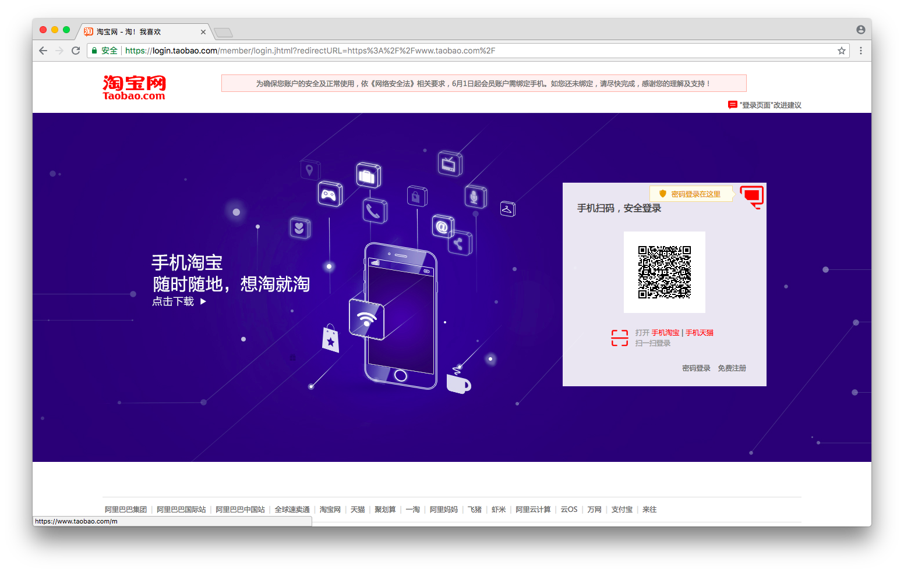
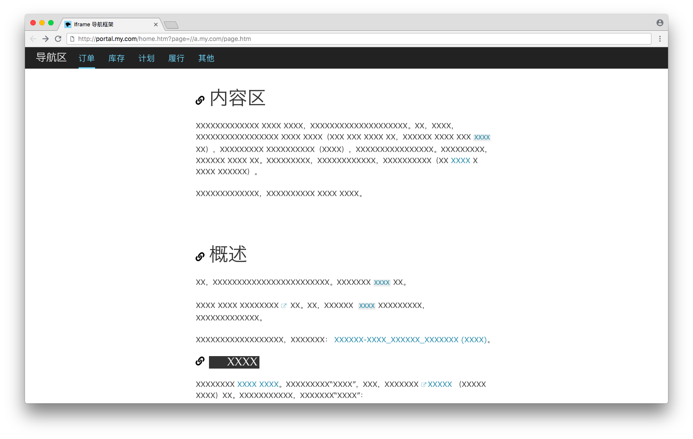
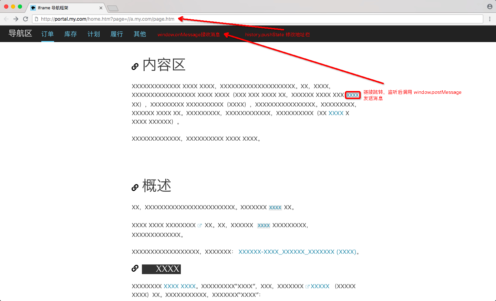
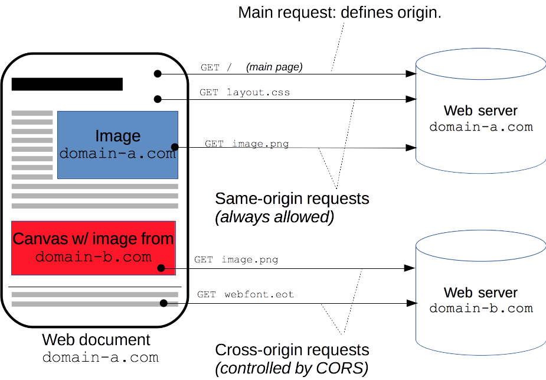
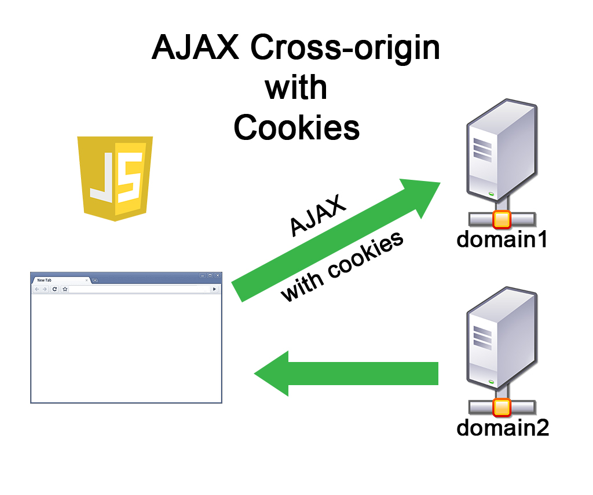

# 在跨域场景下实现单点登录和网站内容融合
渐进地整合关联网站

**标签:** Web 开发

[原文链接](https://developer.ibm.com/zh/articles/wa-cross-domains-sso-and-sites-integration/)

周 中豪

发布: 2018-10-10

* * *

## 前言

在企业业务发生变化时，采用技术手段整合多个网站从来就不是一件轻松的事情。这里面的障碍主要有：

1. 不同的账号和权限管理体系
2. 不同的界面风格
3. 生硬的链接跳转
4. 难以复用的后端接口

从我们的经验看，以上问题要解决，需要使用一种渐进整合的架构，因为整合旧内容和生产新内容是同时进行的，我们做的事情就像是：开着飞机换引擎。

## 解决思路

本文介绍一种在跨域场景下实现单点登录和网站内容融合的方案，针对性解决前述 4 大障碍，其对应的主要技术点是：

1. 通过单点登录统一账号
2. 通过 iframe 门户页提供统一的外框导航菜单
3. 通过拦截链接跳转和重置地址栏，实现统一的链接跳转行为
4. 通过支持 CORS 请求协议，接口可以部署在任何一个关联应用

以下举例说明此方案。

假设我们需要整合的网站分别是 `a.my.com` （简称 a ）和 `b.my.com` （简称 b ） 。

## 实现单点登录

为了实现单点登录，我们需要新增单点登录服务器 `sso.my.com`。

改造 a、b 网站底层，让他们的用户账号映射为一个统一的 `uniqueId`。并在底层调用单点登录服务器提供的登录认证。

用户首次访问 a 网站感知到的流程如下：

1. 用户访问页面 `//a.my.com/page.htm`
2. `a.my.com` 调用 `sso.my.com` 认证服务进行鉴权
3. 鉴权失败，跳转登录页 `//sso.my.com/login.htm?returnUrl=//a.my.com/page.htm`
4. 登录后回跳进入页面 `//a.my.com/page.htm`

同理，用户首次访问 b 网站，也会获得一致的体验。

下面是一个淘宝的单点登录的案例，访问”我的淘宝”页面，进入的是登录页。

原页面地址： `https://i.taobao.com/my_taobao.htm`

带回跳的登录页地址： `https://login.taobao.com/member/login.jhtml?redirect_url=https%3A%2F%2Fi.taobao.com%2Fmy_taobao.htm` （如图 1 所示）

##### 图 1\. 带回跳的淘宝登录页地址



## 构建 iframe 门户页

iframe 框架曾经是早期网站内容布局的一种方式，后来因为 Ajax 能自由地进行局部刷新，iframe 的必要性下降，加上开发维护的成本较高，逐渐被减少使用，仅在部分场景使用。但本文正是充分利用 iframe 的特点：能隔离外框导航菜单和页面内容。

为了实现 iframe 门户页，我们需要新增门户服务器 `portal.my.com` 。

开发一个 iframe 门户页 `portal.my.com/home.htm` ，以后所有的页面请求，都通过它嵌套访问。

改造 a、b 网站页面的脚手架，让页面拥有两种模式：独立使用模式和嵌套使用模式，在嵌套使用模式下隐藏原有的菜单信息。

用户访问 a 网站感知到的流程如下：

1. 用户访问页面 `//portal.my.com/home.htm?page=//a.my.com/page.htm`
2. iframe 门户页根据参数呈现外框导航菜单
3. iframe 门户页中的 iframe，间接访问 `//a.my.com/page.htm?mode=nested` ，呈现页面内容。在这个例子中，模式 （ `mode` ）参数值 `nested` 表示页面以嵌套的方式被访问，指示不要渲染页面原有的菜单（如有）

同理，用户首次访问 b 网站，也会获得一致的体验。

为了获得更好的体验，应该更改原有页面的主题，让他们的主题颜色等样式趋于一致，如图 2 所示：

##### 图 2\. 更改原有页面的主题



## 拦截链接跳转和重置地址栏

现在用户直接通过页面地址打开页面，已经能获得我们所期望的页面效果。但是页面上的链接发生点击时，会发生以下两种情况：

1. 在 iframe 中跳转
2. 在新窗口或新标签页打开页面

需要注意的是，页面上原有的跳转代码目前还没有去重构，所以跳转地址仍然是直接地址，而不是形如 `//portal.my.com/home.htm?page=//a.my.com/page.htm` 这样的封装地址。 `<a>` 标签可以拦截点击事件，代码中的跳转则只能重构代码，比如调用一个新的公共链接跳转方法。

我们可以制作一个公共的 JS 文件，并改造原有页面，引入这个 JS 文件以便拦截跳转。在拦截到跳转后：

1. 针对情况 1，通过 `history.pushState` 重置地址栏，让地址栏显示新的封装地址。
2. 针对情况 2，在新窗口或新标签页按照新的封装地址打开页面。

为了获得更好的体验，我们还可以进行 URL 重写，让用户通过 REST 风格的 URL 进行访问，这时 URL 的格式是： `//portal.my.com/home/page/a.my.com/page` 。

##### 图 3\. 拦截链接跳转



## 改造后端接口

将后端接口改造为支持 CORS 请求的后端接口，这样跨域访问接口不再成为障碍，接口可以部署到任意关联应用中。

图 4 是 CORS 示意图 （来源：`https://developer.mozilla.org/en-US/docs/Web/HTTP/CORS`）。与页面不在一个域的请求，即为 CORS 请求。

##### 图 4\. CORS 示意图



对一个简单的请求，没有自定义头部，要么使用 `GET`，要么使用 `POST` ，它的 `Content-Type` 请求头是 `text/plain` 、`multipart/form-data` 或者 `application/x-www-form-urlencoded`，浏览器会自动添加一个名叫 `Origin` 的额外的头部发送 请求 。`Origin` 头部包含请求页面的协议域名、端口，这样服务器可以很容易的决定它是否应该提供响应。服务器端对于 CORS 的支持，主要就是通过设置 `Access-Control-Allow-Origin` 响应头来进行的。

浏览器发出的请求如清单 1 所示：

##### 清单 1\. 浏览器发出的请求

```
GET /api HTTP/1.1
...
HOST: api.my.com
Referer: http://portal.my.com/home.htm?page=//a.my.com/page.htm
Origin: http://portal.my.com

```

Show moreShow more icon

一个支持 CORS 的服务可能给出如清单 2 响应：

##### 清单 2\. 一个支持 CORS 的服务响应

```
HTTP/1.1 200 OK
Access-Control-Allow-Origin: http://portal.my.com
Content-Type: application/json; charset=UTF8
...

[Payload Here]

```

Show moreShow more icon

通常，如果在使用 `Fetch` 发送请求时，如果需要携带 cookie，还需指定 credentials 为 `include` ，如图 5 所示（来源：`http://promincproductions.com/blog/cross-domain-ajax-request-cookies-cors/`）：

##### 图 5\. 发送携带 Cookie 的跨域请求



注意：对于上传文件等复杂请求（上传请求监听了 `XMLHttpRequestUpload` 以便获得上传进度），将触发浏览器发送预检请求的规则，这时需要在后端服务器正确响应 `OPTIONS` 请求。

## 结束语

本方案在实现单点登录、构建 iframe 门户页、拦截链接跳转和重置地址栏、改造后端接口共 4 个方面，渐进地整合几个关联网站，最终达到一致的用户体验，不仅是看上去一致，而且为统一多个网站的底层架构埋下伏笔。