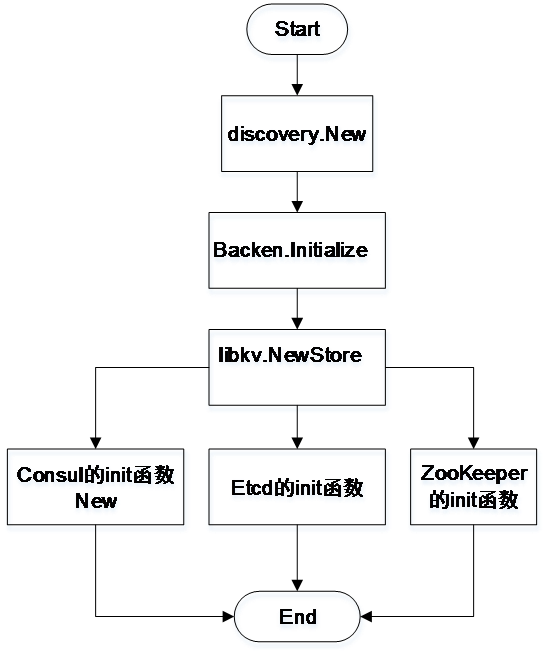
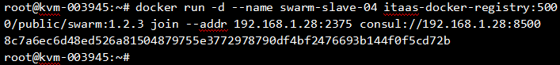
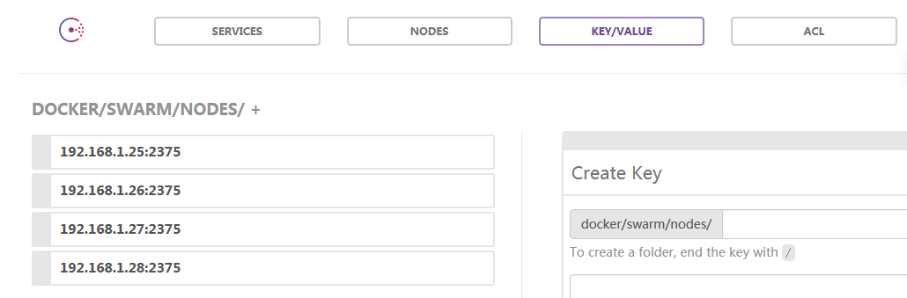

# 基于 Consul 的 Docker Swarm 服务发现
了解 Docker Swarm 服务

**标签:** 容器

[原文链接](https://developer.ibm.com/zh/articles/os-cn-consul-docker-swarm/)

邱娇娇

发布: 2017-01-10

* * *

Docker 是一种新型的虚拟化技术，它的目标在于实现轻量级操作系统的虚拟化。相比传统的虚拟化方案，Docker 虚拟化技术有一些很明显的优势：启动容器的速度明显快于传统虚拟化技术，同时创建一台虚拟机占用的资源也要远远小于传统的虚拟技术。Swarm 是 Docker 集群化的技术，而 Swarm 集群化 Docker 离不开服务发现。Consul 能够解决 Swarm 的服务发现问题。本文将介绍 Swarm 如何使用 Consul 作为服务发现。

## Docker Swarm 服务发现

Docker 集群化可以通过 Swarm 来实现。Swarm 对 Docker 集群中节点的动态加入和退出的感知叫做服务发现。Docker Swarm 支持多种服务发现方式，下面进行详细介绍。

### 服务发现方式

Docker Swarm 支持的服务发现方式主要有以下几种：

1. Token

    Token 发现策略使用 ID 来唯一标识集群，每一个节点通过指定集群 ID 来标识加入的集群。所以首先使用 Swarm 产生一个集群 ID，然后每一个节点通过 join Cluster-ID 动态加入这个集群。

2. Nodes

    Nodes 发现策略依赖于集群节点，我们在集群 manage 节点执行加入集群指令时，就需要指定要加入集群的其他节点。所以集群成员需要预先定义。

3. File

    首先将加入集群的节点存储在一个文件中，我们在集群 manage 节点执行加入集群指令时，指定存储集群中所有节点的文件。所以集群成员也是需要预先定义。

4. 分布式 key/value 存储

    Swarm 使用第三方软件的 key/value 形式存储节点信息，分布式 key-value 存储不仅能够实现 Swarm 节点的动态加入，同时提供了很多其他的功能，直观显示集群中的每个节点以及每个节点提供的服务等。


Swarm 通过 key/value 存储实现的服务发现有三种，接下来，分别进行介绍。

### 分布式 key/value 存储

Swarm 通过分布式 key/value 存储实现的服务发现方式有以下三种：

1. ZooKeeper

    ZooKeeper 是比较成熟的分布式 key/value 存储，但是使用复杂，入门门槛较高，需要借助第三方软件来发送 key-value 数据给 ZooKeeper 完成数据存储。

2. Etcd

    Etcd 部署使用简单，提供了可靠的数据存储，但是需要借助第三方软件，手动将 key/value 数据发送给 Etcd 来存储。

3. Consul

    Consul 提供了可靠的数据存储，并且提供了服务发现框架，不需要借助第三方软件。


本文主要介绍第三方服务发现 Consul 在 Docker Swarm 中的的使用，接下来对 Consul 进行介绍。

## Consul 简介

Consul 提供了分布式环境中服务的注册和发现，支持分布式，高可用，多数据中心。

### Consul 重要概念

Consul 中的重要概念：

1. Agent：Consul 集群中每个成员运行的守护进程，以 Client 或者 Server 的模式存在。

2. Client：发送 RPC 请求给服务器的 Agent。

3. Server：是一个 Agent，负责响应 RPC 查询，维护集群状态，参与 Raft 仲裁等。


Server 有三种存在状态。接下来，分别介绍这三种状态以及它们之间的关系。

### Server 存在状态

Server 的三种状态形式：Leader，Follower，Candidate。

1. Candidate：Server 参与 Raft 仲裁，竞选期间所有服务器的状态。

2. Leader：Server 参与 Raft 仲裁，竞选结束获胜服务器的状态。

3. Follower：Server 参与 Raft 仲裁，竞选结束未获胜服务器的状态。


三种状态之间关系如下：

Consul 集群 Server 节点中要有一个 Leader。Leader 负责维护集群中所有节点的状态。当集群还没有 Leader 或者 Leader 出现故障时候，所有的 Server 运行 Raft 算法，开始竞选。竞选期间所有 Server 的状态称为 Candidate。最终集群中的 Server 经过竞选，只有一台 Server 获胜，竞选结束。这个时候集群中获胜的 Server 称为 Leader，其他的 Server 称为 Follower。

### Consul 架构

为了从整体上对 Consul 有一个了解，下面以一个数据中心的 Consul 部署结构图来对 Consul 进行说明。一个数据中心的 Consul 集群由客户端和服务器组成，服务器以 Leader 和 Follower 两种角色存在。Client 会定时向 Server 发送 RPC 请求，汇报自己的运行状态。Leader 收到 Client 的 RPC 请求，会给 client 发送 RPC 响应，同时存储 Client 的状态等信息。Follower 收到 Client 的 RPC 请求，会转发给 Leader。Leader 存储该 Client 的信息。

Consul 的架构如下图 1 所示。

##### 图 1\. Consul 架构图


对 Swarm 的服务发现策略和 Consul 有了整体了解后，下面具体介绍在代码实现中，Swarm 如何使用 Consul 作为服务发现。

## Swarm Consul 服务发现源码解析

在 GitHub 官网可以下载 [Swarm 源码](https://github.com/docker/swarm) 。本文以 Swarm 1.2.4 为例，通过介绍 swarm join 的流程，来说明 Swarm 使用 Consul 的服务发现过程。

首先，我们简单说明 Swarm 源码文件夹结构以及每个文件的功能。

### Swarm 源码文件夹结构

Swarm 源码的文件夹结构如下表 1 所示。

##### 表 1\. Swarm 源码的文件夹结构

文件夹名称文件夹说明apiSwarm 对外提供的 APIcliSwarm 命令行解析clusterSwarm 集群管理discoverySwarm 集群发现（Token 方式）docsSwarm 文档experimentalSwarm 实验性功能GodepsGo 语言包依赖管理工具schedulerSwarm 调度器scriptSwarm 脚本swarmclientDocker Engine 操作 Swarm 的 APItestSwarm 测试vendorSwarm 的依赖包versionSwarm 版本main.goSwarm 入口函数

Swarm join 是 Swarm 节点加入 Swarm 集群的命令，并且节点在执行 swarm join 命令时，可以指定 Swarm 的服务发现方式。在对 Swarm 源码的文件结构有了整体了解后，接下来我们通过分析 swarm join 的源码，理解 Swarm 使用 Consul 作为服务发现的过程。

### Swarm join 源码解析

Swarm 支持一定的命令行操作。当客户端输入 swarm join 命令时，Swarm 会首先在自己支持的命令集合中找到该命令，同时找到该命令对应的处理函数。然后执行 swarm join 的处理函数。在该处理函数中，swarm 会根据命令行输入的服务发现策略 Consul，初始化一个 Consul 客户端，而后向 Consul 服务器发送注册消息，完成客户端加入集群的操作。

Swarm 所有操作的入口函数是 main 函数，如清单 1 所示。

##### 清单 1\. Swarm 入口函数

```
func main() {
cli.Run()
}

```

Show moreShow more icon

main 函数的功能是启动命令行应用程序。命令行应用程序在启动的时候主要做三件事：1、创建命令行应用程序。2、初始化 Swarm 支持的命令。3、运行命令行应用程序。其中初始化 Swarm 支持的命令，定义了每个版本的 Swarm 支持的命令行集合，以及每个命令对应的处理函数。清单 2 是命令行程序启动时的主要代码。

##### 清单 2\. 创建命令行应用程序

```
func Run() {
    //1、创建 go 的命令行应用 app
    app := cli.NewApp()
    //2、初始化 app 的命令行参数
    app.Commands = commands
    //3、运行 app
    if err := app.Run(os.Args); err != nil {
        log.Fatal(err)
    }
}

```

Show moreShow more icon

以上代码清单位于文件 cli/cli.go。下面对以上代码的主要功能进行详细说明。

1. 创建命令行应用程序

    该功能是利用第三方库 github.com/codegangsta/cli 来创建 Go 的命令行应用程序。在 Swarm 的第三方依赖文件夹 vendor/github.com/codegangsta/cli 可以找到创建 Go 应用程序的依赖文件。

2. 初始化 Swarm 支持的命令

    这个部分是很关键的一部分，该版本的 Swarm 支持的所有命令以及每个命令对应的处理函数等信息都在此处完成初始化。Swarm 使用数组 commands 完成所有命令的初始化。commands 的定义位于文件 cli\\commands.go，关键代码如下。


```
var (
    commands = []cli.Command{
        {
            Name:      "create",
            ShortName: "c",
            Usage:     "Create a cluster",
            Action:    create,
        },
        {
            Name:      "list",
            ShortName: "l",
            Usage:     "List nodes in a cluster",
           Flags:     []cli.Flag{flTimeout, flDiscoveryOpt},
            Action:    list,
        },
        {
            Name:      "manage",
            ShortName: "m",
            Usage:     "Manage a docker cluster",
            //Flags 定义...
            Action: manage,
        },
        {
            Name:      "join",
            ShortName: "j",
            Usage:     "Join a docker cluster",
            //Flags 定义...
            Action:    join,
            },
        }
)

```

Show moreShow more icon

在上面的 commands 的定义中，Name 字段指定了 Swarm 支持的每个命令，Action 字段指定了每个命令的处理函数。下面我们把 swarm join 命令和上面的定义结合起来，具体说明下当在节点的终端输入 join 命令时，swarm 代码是如何执行的。

join 命令在终端的使用如下：

```
docker run -d -p 2376:2375 --name swarm-slave-01 swarm join
-addr 192.168.1.28:2376 consul://192.168.1.28:8500

```

Show moreShow more icon

当我们在终端输入以上命令，Swarm 会首先解析命令，解析出用户要执行的命令是 join 命令。然后在上面 commands 的定义中找到 join 命令的处理函数是 join 函数。接下来就调用 join 函数完成 join 命令的执行。

清单 3 展示了 Swarm 解析执行终端命令的过程。

##### 清单 3\. 命令行解析函数

```
func (a *App) Run(arguments []string) (err error){
    args := context.Args()
    if args.Present() {
       //...
        c := a.Command(name)
        if c != nil {
           //调用 Command 的 Run 函数来执行操作
            return c.Run(context)
        }
    }
    // Run default Action
    a.Action(context)
}
//Command 的 Run 函数
func (c Command) Run(ctx *Context) error {
    context.Command = c
//调用 Command 的 Action 函数，如果我们输入的是 join 函数，接下来就会执行 join 函数
    c.Action(context)
}

```

Show moreShow more icon

以上代码清单位于 github.com/codegangsta/cli/app.go 中的 Run 函数。

Swarm 在初始化的时候，会初始化它支持的第三方服务发现。当我们在终端指定第三方服务发现的时候，Swarm 会调用对应的第三方服务发现接口，创建并初始化第三方服务发现客户端，然后向第三方服务发现服务器发送注册消息，完成注册。

下一步，我们将要考虑 join 函数的具体实现，Swarm 创建 Consul 客户端以及向 Consul 服务器的注册过程。join 函数如清单 4 所示。

##### 清单 4\. join 函数

```
func join(c *cli.Context) {
    dflag := getDiscovery(c)
    1、创建服务发现
    d, err := discovery.New(dflag, hb, ttl, getDiscoveryOpt(c))
    for {
        2、注册服务发现
        if err := d.Register(addr); err != nil {//....}
    }//.

```

Show moreShow more icon

以上代码位于 cli/join.go。

join 函数主要功能是：创建服服务发现客户端和向服务发现服务器注册。

1. 创建服务发现

创建第三方服务发现客户端使用的是简单工厂模式。Swarm 会首先将支持的第三方服务发现初始化在一个 map 中，然后根据我们在命令行指定的第三方服务发现，去调用对应的初始化方法。所以如果我们自己写了一个第三方服务发现软件，可以很方便地嵌入到 Swarm 中。

创建服务发现的数据流程图如下图 2 所示。

##### 图 2\. 创建服务发现流程图



Swarm 首先调用 discovery 包下面的 New 函数，在该函数中调用 Backen 接口的 Initialize 方法，在 Initialize 方法中，调用 libkv 包下的 NewStore 方法。在 NewStore 方法中，首先判断 Swarm 是否支持终端输入的服务发现，如果支持，就去调用该服务发现的初始化方法完成第三方服务发现的初始化。

Consul 初始化函数 New 函数位于 github/com/docker/libkv/store/consul/consul.go，如清单 5。

##### 清单 5\. Consul 初始化函数

```
func New(endpoints []string, options *store.Config) (store.Store, error) {
    s := &Consul{}
    config := api.DefaultConfig()
    s.config = config
    config.HttpClient = http.DefaultClient
    config.Address = endpoints[0]
    config.Scheme = "http"
    ....
    // Creates a new client
    client, err := api.NewClient(config)
    ...
    s.client = client
    return s, nil
}

```

Show moreShow more icon

在 Consul 的初始化函数中，新创建一个 Consul 客户端，并完成 Consul 客户端一些参数的初始化。

1. 注册服务发现

consul 完成服务发现的初始化，就会发送注册信息给 consul 服务器完成注册。key/value 的注册代码位于 github.com\\docker\\docker\\pkg\\discovery\\kv\\kv.go ，如清单 6：

##### 清单 6\. 服务注册

```
// Register is exported
func (s *Discovery) Register(addr string) error {
    opts := &store.WriteOptions{TTL: s.ttl}
    return s.store.Put(path.Join(s.path, addr), []byte(addr), opts)
}

```

Show moreShow more icon

Consul 发送注册地址到 Consul 服务器，完成 Consul 的注册。

## Consul 实现 Docker Swarm 服务注册例子

结合 [Swarm join 源码解析](#swarm-join-源码解析) ，下面介绍如何使用 Consul 实现 Docker Swarm 服务发现。

在 Swarm 的 Client 节点（IP 地址为 192.168.1.28）执行加入集群的指令，并指定 Consul 作为服务发现。命令如图 3 所示。

##### 图 3\. Swarm Join 指令



`
`
使用 Consul 的 Web UI 查看命令执行结果。在浏览器地址栏输入 [http://192.168.1.28:8500，然后选择](http://192.168.1.28:8500，然后选择) key/value 选项卡，在该选项卡下选择 docker/swarm/nodes，可以看到 192.168.1.28 这个节点已经注册到 Docker Swarm 集群。

Consul 服务发现的结果如下图 4 所示。

##### 图 4\. Consul 服务发现结果



## 结束语

本文概述了 Docker Swarm 服务发现的四种策略并进行了简单的比较，简单介绍了 Consul，详述了 Swarm 使用 Consul 作为服务发现的代码流程，最后用一个例子说明了 Docker Swarm 使用 Consul 作为服务发现的过程，希望能够让大家对 Swarm 服务发现的过程有所了解。

通过对 Swarm 服务发现源码的解析，可以看到 Swarm 源码中使用第三方 key/value 作为服务发现的实现采用了简单工厂模式，我们也可以很容易地将其他的第三方 key/value 插件，以及自己设计的服务发现插件嵌入到 Swarm 的服务发现中。