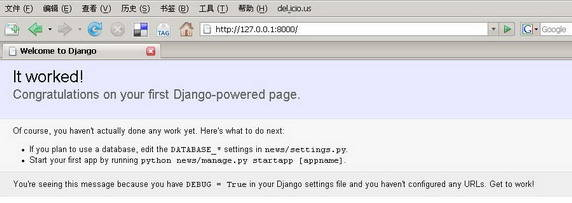
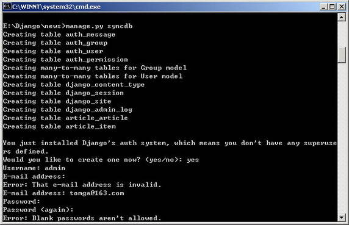
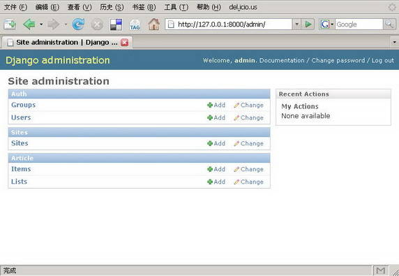
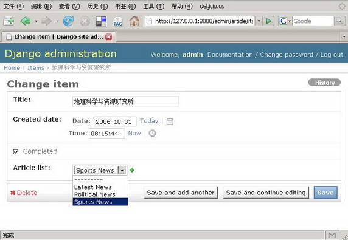

# 基于 Django 框架的敏捷 Web 开发
敏捷开发上手

**标签:** Python,Web 开发

[原文链接](https://developer.ibm.com/zh/articles/os-cn-django/)

高昂

发布: 2007-08-31

* * *

## 前言

传统 Web 开发方式常常需要编写繁琐乏味的重复性代码，不仅页面表现与逻辑实现的代码混杂在一起，而且代码编写效率不高。对于开发者来说，选择一个功能强大并且操作简洁的开发框架来辅助完成繁杂的编码工作，将会对开发效率的提升起到很大帮助。幸运的是，这样的开发框架并不少见，需要做的仅是从中选出恰恰为开发者量身打造的那款Web框架。

自从基于 MVC 分层结构的 Web 设计理念普及以来，选择适合的开发框架无疑是项目成功的关键性因素。无论是 Struts、Spring 或是其他 Web 框架的出现，目的都是为帮助开发者把所有的编码工作打理的井井有条、赏心悦目。在动态语言领域，Python、Ruby、Groovy 等语言在 Web 开发中也逐渐发展壮大，掀起一浪接一浪的开发热潮。面对 Ruby on Rails 渐渐深入人心的宣传攻势和火热势头，更为成熟且不乏优秀程序员的Python 社区也纷纷推出欲与之抗衡的Web开发框架。在对 Python 旗下的开发框架经过一番取舍比较之后，笔者选择了 Python 框架 Django 作为 Web 开发框架的首选，究其缘由，就是看中了 Django 新颖简洁的开发模式和巨大的发展潜力。

在下面的章节里，将通过一个完整的 Django 框架 Web 开发示例，详细讲解开发过程中 MVC 各层次代码编写过程中所需的各种要素与资源，通过实例体验 Django 为 Web开发者带来的高效与便捷。

## 细说 Django

Django 是应用于 Web 开发的高级动态语言框架，最初起源于美国芝加哥的 Python 用户组，具有新闻从业背景的 Adrian Holovaty 是 Django 框架的主要开发者。在 Adrian 的带领下，Django 小组致力于为 Web 开发者贡献一款高效完美的Python 开发框架，并且在 BSD 开放源代码协议许可下授权给开发者自由使用。

Django 拥有完善的模板机制、对象关系映射机制以及用于动态创建后台管理界面的功能，利用 Django，可以快速设计和开发具有 MVC 层次的 Web 应用。为了打消开发者选用 Django 框架时的疑虑，首先分析一下 Django 引人注目的特性。在实体映射方面，Django 的对象相关映射机制帮助开发者在 Python 类中灵活定义数据模型，并且Django 具有功能丰富的动态数据库访问 API，可以大幅度简化书写 SQL 语句的繁杂工作。同时 Django 支持包括 Postgresql，MySql，Sqlite，Oracle 在内的多种后台数据库。Django 的 URL 分发设计的十分简洁美观，不会在链接中产生一大串杂乱且难以理解的字符。使用 Django 可扩展的内置模板，可以将模型层、控制层与页面模板完全独立开来进行编码。Django 还具有自己的 Cache 系统，如果需要，也可以根据开发者的要求嵌套其他的 Cache 框架。

## 起程前的准备

即使是对 Python 语言还不太熟悉，Django 开发的起步过程对于新手来说也并不复杂，通过使用 Django 框架完成下面的 Web 应用开发，可以在过程的每个步骤之中体会到 Django 框架赋予开发者的敏捷与自由。

在开始之前，首先要配置好Python和Django的开发环境，下面的示例将在Windows操作系统下进行，与Linux/Unix操作系统环境下的开发过程相比，仅在环境变量配置等方面略有不同。目前Python的最新版本是2.5.1，在官方站点 [Python.org](http://www.Python.org) 下载安装包后搭建好Python的编译运行环境，接下来还需要把Python的安装路径添加在系统环境变量path里面，以便在命令行下使用Python进行编译及运行。

Django目前的最新发行版本是0.96版，其压缩包可以在官方站点 [djangoproject.com](http://www.djangoproject.com) 下载。解压后进入Django目录，在命令行里执行python setup.py install，这样Django就会作为第三方模块被安装在Python的site-packages目录中，然后把Django中bin目录的路径添加到环境变量path里面，这样在命令行里就可以方便的使用Django提供的各种指令。

## 开始 Django 的旅程

在下面的步骤里，将会利用Django框架实现一个完整小巧的Web应用程序。应用实例将创建实现一个新闻公告牌，用户可以从后台添加新闻分类和条目，然后在前端页面中显示新闻的统计信息。在应用的实现过程中，将会逐步介绍Django的开发方式及其带来的快捷体验。

为帮助开发者实现不同的功能，Django为我们提供了众多的开发指令，大部分繁琐的操作都被Django集成在简洁的命令行提示符中实现。现在打开命令提示符，进入到想要创建应用的目录后键入django-admin.py startproject news命令，调用Django的控制台命令新建一个名为news的工程，与此同时Django还在新创建的news文件夹下生成以下四个分工不同的文件。

- **init.py**

    文件 **init**.py可以向Python编译器表明当前文件夹下的内容是Python工程模块。

- **2.manage.py**

    manage.py是Python脚本文件，与Django的命令行工具django-admin.py配合，可以对建立的工程进行管理配置。

- **settings.py**

    这是Django工程的配置文件，与工程相关的工程模块和数据库全局配置信息都在settings.py中设置。

- **urls.py**

    文件urls.py负责配置URL的地址映射以及管理URL的地址格式。


当新的工程建立好之后，假如迫不及待就想知道新建工程的模样，Django已经为你准备好一款轻量级的Web服务器以便在开发过程中随时测试使用。开发者只需在命令提示符下进入工程目录，键入命令manage.py runserver，就可以启动Web服务器来测试新建立的工程，如果启动没有错误，将可以看到下面这样的提示信息：`Development server is running at http://127.0.0.1:8000/` 表示当前工程已经可以通过本机的8000端口访问。通过浏览器打开上述地址，如图1所示的Django项目初始页面将会出现在读者面前。

##### 图 1\. Django 项目初始页面



在命令行里使用Ctrl+Break或Ctrl+C的组合键可以停止runserver命令启动的Web服务器。当然，Django自带的Web服务器一般只是在开发测试的过程中使用，当Django工程真正发布时，可以通过加载mod\_python.so模块把Django应用部署在Apache上，以方便Web访问的管理和配置。

## Django 的模型定义

在工程建立好之后，接下来就可以编写Django的应用模块。键入命令python manage.py startapp article，命令会在当前工程下生成一个名为article的模块，目录下除了标识Python模块的 **init**.py文件，还有额外的两个文件models.py和views.py。

在传统的Web的开发中，很大的一部分工作量被消耗在数据库中创建需要的数据表和设置表字段上，而Django为此提供了轻量级的解决方案。借助Django内部的对象关系映射机制，可以用Python语言实现对数据库表中的实体进行操作，实体模型的描述需要在文件models.py中配置。

在当前的工程中，需要有两个Models模型，分别对应List表和Item表，用来存储新闻的分类和新闻的条目，每个Item项都会有一个外键来标记文章的归属分类。下面打开Django创建的models.py文件，按照文件注释中提示的模块添加位置，编写如下的代码：

##### 清单 1\. models.py 文件模型定义

```
class List(models.Model):
title = models.CharField(maxlength=250, unique=True)
def __str__(self):
return self.title
class Meta:
ordering = ['title']
class Admin:
pass

```

Show moreShow more icon

上面这段Python代码定义了存储新闻分类的List数据表，上述模型中的定义会被Django转换成与数据库直接交互的结构化查询语言来建立数据表，即创建一个名为List的表格，表格内的两个字段分别是Django自动生成的整型主键id和最大宽度为250个字符的VARCHAR类型字段title，并且在title字段上定义了唯一性约束，来保证新闻分类不会有完全相同的名称。

在List类文件里还定义了函数 **str**()，作用是返回self字符串表示的title字段。而在类Meta中，设置了List表格按照title字母顺序的排序方式。在类Admin的设置中，允许Django针对当前的Models模型自动生成Django超级用户的后台管理入口，关键词pass设定Django将按照默认方式生成后台管理界面。这一部分在稍后的章节可以看到，由此也可以体会到Django带来的独特魅力。下面再来添加新闻条目Item对应的Models模型，代码如下面所示：

##### 清单 2\. 添加新闻条目 Models 模型

```
import datetime
class Item(models.Model):
title = models.CharField(maxlength=250)
created_date = models.DateTimeField(default=datetime.datetime.now)
completed = models.BooleanField(default=False)
article_list = models.ForeignKey(List)
def __str__(self):
return self.title
class Meta:
ordering = ['-created_date', 'title']
class Admin:
pass

```

Show moreShow more icon

Item数据表对应的Models代码稍微复杂一些，但并不晦涩。代码里首先引入datetime类型，用于定义表示文章创建日期的created\_date字段，并且通过Python的标准函数datetime.datetime.now返回系统当前日期来设置字段的默认值。在记录排序的ordering设置中，符号”-”表示按照日期的倒序进行排列，如果文章创建日期相同，则再按照title的字母序正序排列。

到此为止，应用中模型部分需要定义的两个数据表都已经创建完毕，下一步的工作是让Django部署并在数据库中生成已经写好的Models模型。

## Django 模块的部署

在Django中，与工程全局相关的设置都需要在配置文件settings.py中添加。笔者使用MySQL作为后台数据库，并且已经在MySQL中创建名为django\_news的数据库。则需要在settings.py文件中的相应位置设定DATABASE\_ENGINE = “mysql” 以及 DATABASE\_NAME = “django\_news”。

这里要注意的是，如果使用SQLite数据库，Django可以根据数据库的名称自动在SQLite中创建新的数据库，而在MySQL、PostgreSQL或其他的数据库中，则需要先创建与设定名称对应的数据库。在使用MySQL数据库时，需要额外安装MySQL的Python链接库MySQLdb-1.2.1，这个模块可以在站点 [http://sourceforge.net/projects/mysql-python/](http://sourceforge.net/projects/mysql-python/) 下载，目前支持的Python版本为2.4，所以使用MySQL数据库需要在2.4版本的Python环境来开发运行。

接下来的DATABASE\_USER和DATABASE\_PASSWORD两项内容则需要用户根据本机设置填写访问数据库的用户名和密码。如果数据库安装在其他机器上或者更改了数据库的监听端口，则还需要设置DATABASE\_HOST地址和DATABASE\_PORT项。笔者使用的Mysql数据库设置为：

```
DATABASE_USER = 'django'
DATABASE_PASSWORD = 'django_password'

```

Show moreShow more icon

为了使Django识别开发者添加的应用模块，在settings.py文件的INSTALLED\_APPS部分中，需要定义Django工程加载的应用列表。默认情况下，列表中已经添加了Django工程运行所需的部分自带模块，我们还需要把刚才编写好的应用模块news.article加入其中，同时添加Django自带的django.contrib.admin应用模块，修改好的代码如下所示：

##### 清单 3\. 添加所需的模块

```
INSTALLED_APPS = (
'django.contrib.auth',
'django.contrib.contenttypes',
'django.contrib.sessions',
'django.contrib.sites',
'django.contrib.admin',
'news.article',
)

```

Show moreShow more icon

添加admin模块后还不能立即使用Django的admin后台管理界面，需要打开News工程根目录下的urls.py文件，将”# Uncomment this for admin:”后面的#注释去掉，使得Django针对管理界面的URL转向”(r’^admin/’, include(‘django.contrib.admin.urls’)),”可用，这样访问admin模块时Django就可以顺利解析访问地址并转向后台管理界面。

当配置文件的改动完成之后，就可以在News工程的命令提示符下执行manage.py syncdb指令。Django会根据模型的定义自动完成ORM的数据库映射工作，屏蔽了底层数据库细节和SQL查询的编写。

展示Django魅力的时刻已经来临，Django框架将让开发者开始神奇的体验。随着命令执行后的滚动提示，Django已经根据我们刚才在models里定义的映射文件，自动在数据库里创建好对应的表和字段。命令执行的同时会提示用户创建”superuser”账户，来登陆Django自动创建好的后台管理界面对模型进行管理。指令执行时同步更新数据库表的命令提示如图2所示：

##### 图 2\. Django 指令执行时同步更新数据库表



维持学习动力的最好方式就是随时都可以找到一点小小的成就感，下面来看一下这些步骤完成了哪些工作。再次使用命令manage.py runserver来启动Django自带的Web服务器后，在浏览器中访问地址 [http://127.0.0.1:8000/admin/](http://127.0.0.1:8000/admin/) ，使用刚才创建的superuser用户的账号和密码登陆，如图3所示漂亮的Django后台管理界面就出现在眼前。

##### 图 3\. Django 根据模型自动生成的后台管理界面



在admin管理界面中，显示了应用中已经定义的各个models模块，当点击查看时，则会显示models中存在的数据库对象列表。Django提供的后台管理界面方便用户直接更改或添加数据库字段，下面我们点击”Lists”项旁边的”Add”来添加新的新闻分类。在title字段中键入”Sports News”或其他你喜欢的分类后保存。然后在”Items”项中点击”Add”，填入新闻的第一个条目，每个Item条目都对应List中的一个分类项，添加Item的界面如图4所示，由于设置了表之间的关联，Django的Item管理界面中会为已添加List分类自动生成内容的下拉选项。

##### 图 4\. 添加新闻条目的界面



Django便捷的后台管理界面为Web开发人员节省了大量的时间，目前使用到的只是Django默认的后台管理方式，开发者还可以参考Django提供的用户手册对后台进行进一步的定制和个性化。

## 实现 Django 的控制层和表现层

进行到这里，Django工程中的模型层已经处理完成，下面要做的就是如何用代码来与models中定义的字段进行交互，这就是Django中的View部分。与传统MVC分层定义略有不同的是，在Django中，View的功能是对页面请求进行响应和逻辑控制，而页面内容的表示则由Django的Template模板来完成。我们可以把Django的View理解为实现各种功能的Python函数，View负责接受URL配置文件urls.py中定义的URL转发并响应处理，当Django收到请求之后调用相应的View函数来完成功能，article模块中的views.py文件代码定义如下：

##### 清单 ４. views.py 代码定义

```
from django.shortcuts import render_to_response
from news.article.models import List

def news_report(request):
article_listing = []
for article_list in List.objects.all():
article_dict = {}
article_dict['news_object'] = article_list
article_dict['item_count'] = article_list.item_set.count()
article_dict['items_title'] = article_list.title
article_dict['items_complete'] = article_list.item_set.filter(completed=True).count()
article_dict['percent_complete'] =
        int(float(article_dict['items_complete']) / article_dict['item_count'] * 100)
article_listing.append(article_dict)
return render_to_response('news_report.html', { 'article_listing': article_listing })

```

Show moreShow more icon

这是一段简洁的Python代码，让我们看看在这段代码里面Django的函数做了哪些工作吧：

- List.objects.all方法返回news列表中所有的记录项，Django可以根据后台数据库转换成相应的SQL语句，在后台数据库中执行并返回查询结果。
- 每一条article文章都有item\_set属性，代表news新闻条目中的每一个item项。如果需要设置查询条件，也可以使用item\_set.filter方法来返回符合特定要求的item项。
- render\_to\_response函数返回浏览器指定的HTML页面，页面为Django的Template模板，负责展示被请求的页面内容。

在view部分的代码中，已经指定了页面显示模板为news\_report.html。其实，在Django工程中创建模板是一件非常方便的事情，下面要在article目录内创建这个模板页面，首先新建一个名为templates的文件夹，然后在这个模板目录里创建所需的news\_report.html模板文件，模板的代码如下：

##### 清单 ５. news\_report 模板代码

```
<html>
<head>
<meta http-equiv="Content-Type" content="text/html" />
<title>新闻统计列表</title>
</head>
<body>
<h1>新闻统计列表</h1>

<ul>
        <li>新闻的分类: {{ list_dict.items_title }}</li>
     <li>新闻的数目: {{ list_dict.item_count }}</li>
     <li>已发布的新闻数目:
           {{ list_dict.items_complete }} ({{ list_dict.percent_complete }}%)</li>
</ul>

</body>
</html>

```

Show moreShow more icon

一般来说，Django的模板代码和普通的HTML代码看上去没有太大差别，只是添加了Django特定的模板标记，这些标记允许开发者为Django模板添加页面逻辑，比方说将views.py中render\_to\_response函数返回的数据库结果集显示在页面中，Django特有的标签在模板页里以””作为结束。嵌入Django模板的变量则以”{{”作为开始并以”}}”结束。

在上面的模板代码里面，用到了标记以及。这样的标记告诉Django模板处理机制循环取出news中的item项输出在页面中，在for循环内部，通过article\_listing的属性得到View中对应的数据项字段的值并显示每个news项的Title标题以及news中的item项数目。

当Django的View和Template都已经准备妥当，下面仅需要几步配置来告诉Django存储工程应用的模板位置，这需要对配置文件setting.py中的TEMPLATE\_DIRS项进行设置。在本例中加入模板文件”news\_report.html”的存储路径就可以让Django把对View进行处理的结果集通过指定模板返回。按照本例应用的结构，TEMPLATE\_DIRS参数的内容设置为：

```
'./article/templates',

```

Show moreShow more icon

这里不要忘记Django需要在路径的最末尾添加一个逗号。接下来仅需要设置访问article时的URL转向地址就可以。打开urls.py文件，在admin后台管理的转向地址下一行添加如下语句：

```
(r'^report/$', 'news.article.views.news_report'),

```

Show moreShow more icon

在这里语段的最末尾，也需要有逗号标记段落的结束。在这里可以看到，Django的URL转发设计的非常简洁，在配置文件urls.py中对应于view的转发请求都由两部分组成，第一部分遵循正则表达式指定相匹配的URL地址，第二部分是对应在View里面处理转发请求的函数。

完成了这些步骤，就可以在命令提示符下再次启动Django服务器，看一下上述努力的成果了，在浏览器中打开链接 [http://127.0.0.1:8000/report/](http://127.0.0.1:8000/report/) ，将会看到新闻列表的返回界面。页面中显示了数据库中已添加所有新闻的分类统计信息。值得一提的是，Django模板支持多层嵌套，并且每一层都可以使用DIV+CSS方式完成布局，可以方便的让站点页面遵循统一风格，看起来美观大方。

在上述整个过程中，对使用Django进行Web开发进行了初步的介绍。在应用中写的Python代码不过几十行，比较起来其他的开发语言，Django显得非常便捷实用，最后再来回顾一下Django都帮助我们做了哪些工作吧：

- 通过Django的对象关系映射模型建立了存储新闻分类以及新闻项的两张数据表，并用syncdb命令同步更新到数据库。
- 借助Django的管理功能在应用中生成了一个漂亮实用的后台管理界面。
- 利用Django函数和标签编写了view功能模块以及显示数据结果的Template模板。

## 结束语

Django开发框架的出现，让本例所有的这些工作变得简洁有序、赏心悦目。随着Django开发框架的不断发展，更多新的特性将逐步被添加到框架体系中来。可以不夸张的说，Django已经从ROR的潜在竞争者，逐渐成长为可以与之针锋相对的Python框架。如果说与Ruby框架ROR的差距，或许Django目前最缺少的还是ROR那庞大的用户群体。

如果看完这篇文章，读者打算一步一步进入Django的精彩世界，可以在Django官方站点 [www.djangoproject.com](http://www.djangoproject.com) 上阅读更多的开发文档、订阅Google Group上的Django邮件讨论组，或者跟随Django官方的教程指南进行学习，开始一次让思想自由翱翔的旅程，相信在这个过程中收获的不仅仅是使用Django开发的新奇体验。

希望有更多的读者来使用Django框架，希望有更多的人来一起来关注Django的发展，甚至参与到Django的项目开发当中，为开源的社区贡献一份力量。期待Django快速发展的明天、期待Python实现的Rails框架将会有绚丽的未来！