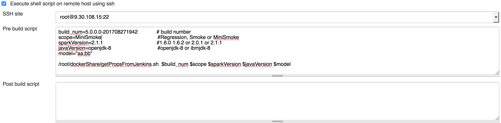
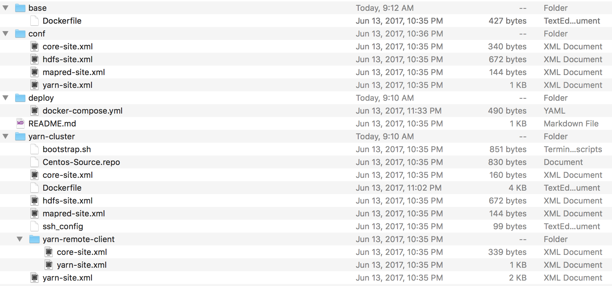
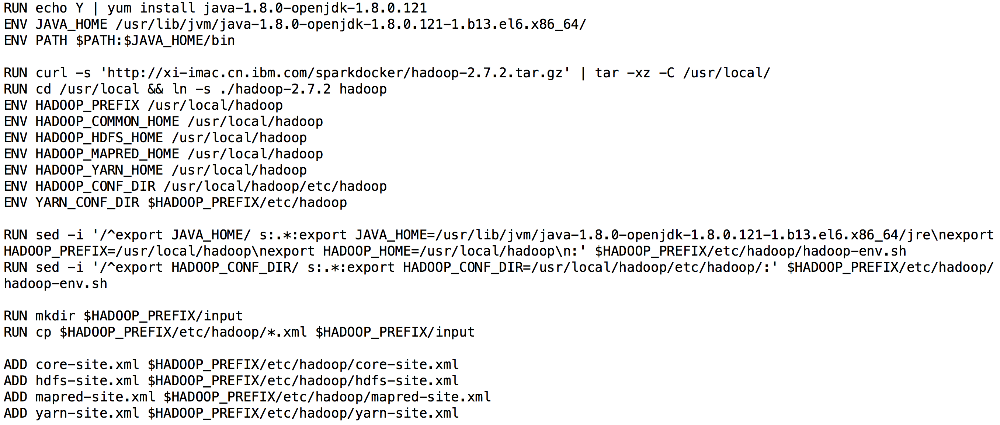
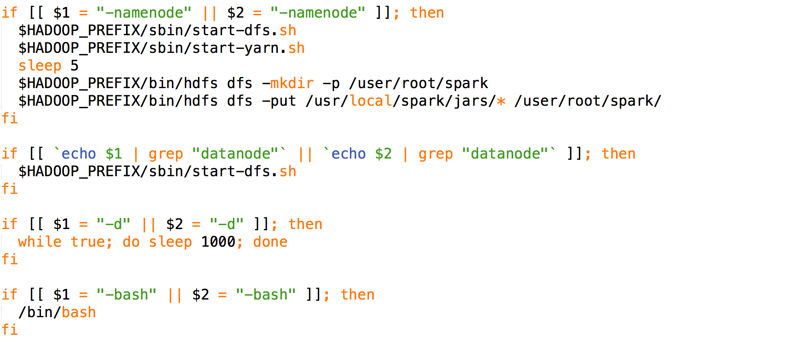
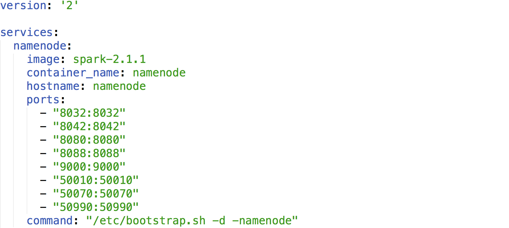
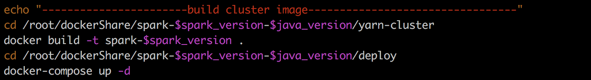
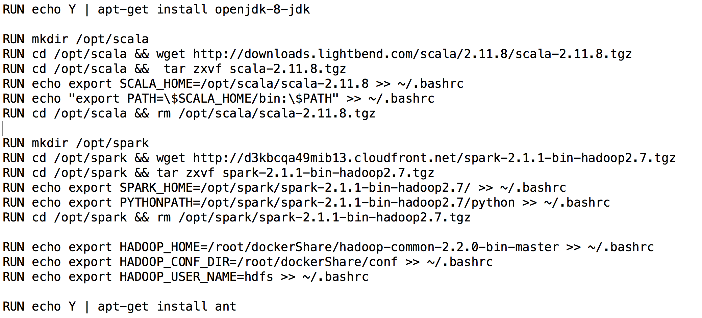
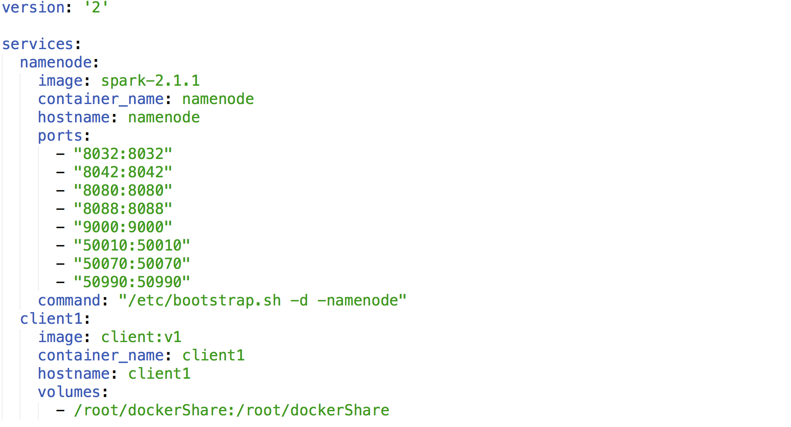
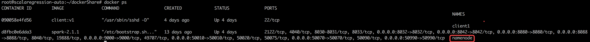
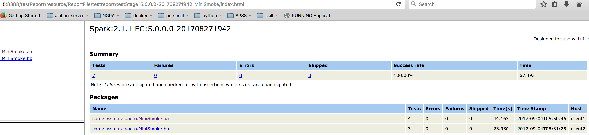

# 基于 Docker 快速部署多需求 Spark 自动化测试环境
了解自动化测试

**标签:** 分析

[原文链接](https://developer.ibm.com/zh/articles/l-lo-docker-quickly-deploy-multiple-demands-spark/)

周 良, 安 欢, 常 盎

发布: 2017-12-20

* * *

## 引言

在进行数据分析时，Spark 越来越广泛的被使用。在测试需求越来越多、测试用例数量越来越大的情况下，能够根据需求快速自动化部署 Spark 环境、快速完成所有测试越来越重要。

本文基于 Docker、Jenkins、Apache Ant、Apache Tomcat、Git、Shell 等技术或工具，根据用户对 Spark 版本、Scala 版本、JDK 版本、测试范围、测试版本等需求的不同，快速完成 Spark Cluster 环境以及相应的 Client 端测试环境的部署，进而实现快速自动化测试、结果呈报，从而提高开发测试效率。

## Docker 等相关技术和工具介绍

### Docker 介绍

Docker 是世界领先的开源应用容器引擎，提供了一个可供开发者打包其应用的可移植容器。开发者可以使用 Docker 来消除合作编码时所出现的”我的机器”问题，运营商可以使用 Docker 来运行和管理不同容器中的应用，企业可以使用 Docker 更加快速安全的建立敏捷软件交付管道。Docker 主要包括四部分：Docker Client、Docker Image、Docker Daemon、Docker Container。

Dockerfile 是为了快速构建 Docker Image 设计的，是一个包含了可用来创建镜像命令的脚本。当执行 docker build 命令时，Docker 可以通过从 Dockerfile 中自动读取指令来创建镜像。

Docker Compose 是一个用来定义和运行多容器复杂应用的工具。你可以使用一个 YAML 文件来配置你的应用和服务，然后仅使用一条命令就可以启动已配置的所有服务。

本系统中我们使用 Docker 来快速部署不同 Spark 版本、Scala 版本、JDK 版本的 Spark Cluster Server 和 Test 客户端，通过 Docker Compose 启动所需要的服务。

### Spark 介绍

Spark 是一种与 Hadoop 相似的专门为大数据处理设计的开源集群计算环境，使用 Scala 语言实现，以通用、易用为目标。Spark 的中间输出结果可以保存在内存中，不必重新读写 HDFS，从而使其具有 Hadoop MapReduce 所没有的优点，更适用于数据挖掘与机器学习等算法。

本系统中我们将不同版本的 Spark 部署在 Docker 中，通过 Dockerfile 控制 Spark 的版本选择，从而快速部署不同版本 Spark Cluster Server。

### Jenkins 介绍

Jenkins 是一种开源的持续集成工具，提供一个开放易用的平台用于监控持续重复工作，使得我们可以进行持续的软件版本发布和测试。

本系统中我们使用 Jenkins 创建 job 来控制测试的启动与停止，也可以进行周期性任务。

### Git 介绍

Git 是一个免费开源的分布式版本控制系统，可以高效地处理各种大小项目。Git 易于学习，性能高效，在廉价本地分支、方便的中转区、多工作流等方面都超越了传统的 SCM 工具，如 Subversion，Perforce，CVS，ClearCase 等。

本系统中使用 Git 进行代码的维护及实时更新。

### Apache Ant 介绍

Apache Ant 是一种用于在 Java 环境下进行软件开发的自动化工具，可以进行编译、测试、部署等步骤，其构建文件默认名为 build.xml，Ant 具有很好的跨平台性且操作简单。

本系统中我们使用 Ant 进行代码的编译、测试以及测试报告的生成。

### Apache Tomcat 介绍

Apache Tomcat 是一个开源的轻量级 Web 应用软件容器，可以用来响应 HTML 页面的访问请求，在中小型系统和并发用户访问场景中被广泛使用。

本系统中我们使用 Tomcat 来展现测试报告（即测试结果），使得多用户可以并发访问测试报告。

### Shell 介绍

Shell 脚本是在 Linux/Unix 系统中使用的一种类似于 Windows/Dos 批处理的脚本，功能与.bat 类似。Shell 是一种命令语言，可以互动式的执行用户命令，将各类命令依据逻辑关系放入文件中可以一次性执行，是 Linux 系统下广泛使用的一种脚本。

本文中我们使用的系统是支持 Docker 的 Linux Ubuntu 14.04，依靠 Shell 脚本将各个步骤联系起来组成一个完整的流程。

本文主要从自动化的系统整体构架以及环境部署流程方面进行介绍，扼其重点，以求给读者提供一个部署此类环境或系统的操作思路和流程，对于特别细节、特殊或者过于通用的部分不做详解，如一些软件的安装教程在网络上随处可见，本文不再赘述。下面章节首先介绍整个系统构架，然后对系统构架中各个部分进行具体介绍，最后进行总结。

## 环境部署测试整体架构

本章主要介绍自动化测试系统的整体框架和流程，如图 1 所示。我们通过在 Jenkins Server 上创建 Job 作为整个系统的测试入口，Jenkins 发起测试请求之后，接下来会进行环境部署（即图中 Deploy 阶段）和测试（即图中 Test 阶段）。环境部署包括通过 Docker 部署 Spark Cluster 和 Test Client，即测试所需要的服务器端和客户端。环境部署完毕后便可进行测试，从指定地方获取测试所需要的 Build 和 Code，Code 可以通过 Git 在本机上维护更新，通过对代码进行测试所必须的一些配置，然后便可进行编译、测试，测试执行完毕后对所生成的 xml 文件进行生成报告（HTML 文件生成），此处编译、测试、report 生成均由 Ant 实现，所生成的 report 展示由 Tomcat 实现，最后通过 Linux 系统的邮件功能给指定邮箱发送邮件完成整个测试流程。

##### 图 1\. 自动化测试系统整体架构

## 基于 Docker 的 Spark 环境部署测试

本章将根据上一章节中的自动化系统整体架构对流程中所涉及的各部分进行具体介绍，重点介绍自动化系统中基于 Docker 所部署的 Spark Cluster Server 端和 Client 端。

### Jenkins 任务

测试请求由 Jenkins 发起，安装 Jenkins 并新建 Remote SSH 任务后，在 Script 执行窗口指定配置信息，如图 2 所示，包括 build\_num、scope、sparkVersion、javaVersion、model，分别表示要进行测试的 build 版本（以 jar 包的形式存在），测试的范围（Regression、Smoke、MiniSmoke 所定义 case 的范围依次减小），Spark 版本（如 1.6.0、1.6.2、2.0.1、2.1.1 等，scala 版本由 spark 决定），Java 版本（如 openjdk8、ibmjdk8 等），模块（代码中所包含的要测试的模块）。这些配置信息通过位于远程机器上的 Shell 脚本 getPropsFromJenkins.sh 下发到机器上的配置文件中以便进行后续部署和测试流程。机器上的 buildScope.props 和 model.props 文件用于存储从 Jenkins 上获取的信息，后续所有需要这些信息的操作均从这两个文件中读取。需要特别说明的是 model 的各模块间逗号表示串行执行，分号表示并行执行，串行只需要启动一个 Client 端即可，并行需要启动多个 Client 端并发执行，这部分将在后续章节具体介绍。

##### 图 2\. Jenkins 任务配置

### Spark Cluster

Deploy 阶段将根据 Jenkins 下发的配置信息进行 Docker Spark Cluster 和 Client 的部署。

用于创建 Docker Spark Cluster 镜像及启动 Container 的脚本很多，代码内容也过于复杂，本节难以一一完全介绍，依旧依据之前约定对重点部分进行介绍，以为读者提供思路，具体细节可通过网络或者参考资料进一步深入研究。

每个版本的 Spark Docker 脚本我们都放在一个独立文件夹中，按照”spark-$spark\_version-$java\_version”的方式命名。以 spark-2.1.1-openjdk-8 为例，该文件夹结构如图 3 所示，文件夹中所含 xml 格式文件与实际安装的 Spark 环境对应文件类似，只是在 Docker 中我们使用 namenode 作为 container 的名字，core-site.xml 中要使用”hdfs://namenode:9000″替代实际环境中的”fs.default.name”。yarn-site.xml 中可以使用”yarn.nodemanager.resource.memory-mb”对 YARN 可使用的物理内存总量进行控制，默认 8192M，本系统我们为了并行两个 Client 端同时测试设置为 65536M。

##### 图 3\. spark-2.1.1-openjdk-8 文件夹结构

yarn-cluster 文件夹下的 Dockerfile 文件是整个 cluster 的核心，用于创建 Spark Cluster 镜像，内容主要包括配置 SSH 无密码访问、安装 Java 并配置环境变量、下载安装 Hadoop、加载 xml 文件（core-site.xml、hdfs-site.xml、mapred-site.xml、yarn-site.xml）、下载安装 Spark、开放 Spark 运行所需端口等。如图 4 所示为 Dockerfile 部分内容。

##### 图 4\. Dockerfile 片段

bootstrap.sh 文件主要用于在启动 container 时自动启动对应的 Spark 进程，如 start-dfs.sh、start-yarn.sh。其主要内容如图 5 所示。

##### 图 5\. bootstrap.sh 片段

我们使用 docker-compose 启动 container 来保证整个 Spark Cluster 工作为一个整体，其主要使用文件为 docker-compose.yml，如图 6 所示。图中还可以添加其他节点，本处为了简化只使用 namenode 一个节点。

##### 图 6\. docker-compose.yml 片段

Shell 脚本创建 Spark Cluster 镜像以及启动 container 的命令如图 7 所示，$spark\_version 和$java\_version 来决定切换到对应的 Spark 文件夹进行某个版本的创建，使用”docker build –t spark-2.1.1 .”命令创建 spark-2.1.1 的镜像，执行”docker-compose up -d”用于在后台启动 spark-2.1.1 的 container。

##### 图 7\. Spark Cluster 镜像和启动脚本

### Test Client

Client 端只需要启动一个系统为 Linux、带有所需软件的 Container，所以与 Server 端相比 Client 端的 Docker 脚本要简单的多，只需要一个 Dockerfile 文件用于创建 Client 镜像即可，针对各种 Spark 版本的 Dockerfile 文件按照”dockerfile-$spark\_version-$java\_version”的方式命名存放，执行时根据 Spark 版本信息将对应的文件拷贝成 dockerfile 的文件来创建镜像，文件内容包括安装 JDK、Scala、Spark、Ant 等。此处仍然以 Spark-2.1.1 为例，如图 8 所示，在此脚本中我们下载安装了 scala-2.11.8、spark-2.1.1-bin-hadoop2.7 以及 Ant，并且配置了部分所需要的环境变量。

##### 图 8\. Client Dockerfile 脚本

Client 端镜像的创建命令为”docker build -t client:v1 .”，为了使得 Client 端和 Server 端的通信更加通畅可以通过在上节 docker-compose.yml 中加入 Client 。如图 9 所示，client1 表示我们只启动一个 Client 端，没有并行。如果需要启动两个 Client 端并行，在脚本后继续添加 client2 对应代码即可，与 client1 类似，client 数目的控制由 shell 脚本通过 model 信息确定。

##### 图 9\. 添加 client 的 docker-compose.yml

在 Spark Cluster 和 Client 镜像创建完成后，通过”docker-compose up -d”启动对应的 Container，Container 运行情况如图 10 所示。

##### 图 10\. namenode 和 client container

### Test

环境部署完毕后接下来就是要利用代码进行实际的测试，即 Test 阶段。

Test Configuration 主要是利用 Jenkins 上指定的配置信息对代码进行特定的配置，比如通过 wget 命令从远端下载 Jenkins 上所指定的 build 版本，在此 build 上对代码进行编译等。本机上通过 Git 维护一套代码，并且进行实时更新以获取最新代码。如上节图 10 所示 Client 启动时已通过 volumes 命令将本机的 dockerShare 文件夹共享进 Client 的 docker container 内部，以便于在 docker 内部进行编译测试。

Test 和 Report 为测试的主题阶段，依据代码进行编译测试和报告生成，这一阶段是通过 Apache Ant 实现的，我们先来看一下 Ant 的构建文件 build.xml。build.xml 的内容主要包括以下几部分：代码编译所依赖的 jar 包、编译命令、测试命令、创建 report 命令。

如图 11 所示，”build”指定了编译依赖于”clean，prebuild”，以及要编译文件的目录和文件后缀（.scala 文件）。”run”指定了要执行的文件即实际测试的文件（.class 文件），”showoutput”指定是否输出所有的 log 日志，”printsummary”指定是否输出每个文件执行完毕后的总结（即总共多少个 case，成功失败数目各为多少），”haltonfailure”指定是否遇到错误就停止，”include name=”用于控制要测试的 scope 和模块（分别从 buildScope.prop 和 model.props 中获取），如此处 scope 为”MiniSmoke”，模块为 aa，新增一个模块则新加一行”include name=”，可通过 Shell 控制。”report”指定利用测试完毕后所生成的所有名称为”TEST-\*.xml”的文件生成 report。

##### 图 11\. build.xml 片段

编译、测试、Report 阶段依次执行命令为”ant build”、”ant run”和”ant report”，测试并生成 report 之后将生成的 report 文件全部放入 Apache Tomcat 特定目录中并且启动 Tomcat，即可通过 Tomcat 的端口访问 report 内容。为了完全实现自动化，我们将此访问链接通过邮件系统发送到指定的邮箱中，可以通过 Linux 系统下的 sendmail 功能发送，也可以通过 Jenkins 的 mail 功能发送，即流程中的 Mail Notification 阶段。

如图 12 所示，邮件所收到的 report 链接是以”ip:端口/目录/build 号\_scope/index.xml”的样式存在，Tomcat 默认端口是 8080，可以自行修改（apache-tomcat-7.0.77/conf/server.xml 中），本系统中我们改成了 8888，build 号\_scope 保证了多个 report 并存互不影响从而使得我们可以同时管理很多历史 report 以便于后续查看。

##### 图 12\. report 页面

## 总结

基于 Docker 的环境部署及测试涉及大量细节，如各个软件的安装配置、整个系统各个部分是如何通过 shell 脚本一一串联起来以完成整个流程、report 页面上各种信息的显示、代码编译出错后停止后续流程自动发送邮件将错误信息通知维护人员等等，由于内容过于繁琐且文章篇幅有限在此不能一一介绍，在实际环境部署测试过程中大家可以具体体会。文中所涉及的软件技术均为当今业界比较流行的技术，参考资料也相对较多，网络或官网上均可以查找到相关帮助，有兴趣的可以做进一步深入研究。

## 参考资源

- [Docker 官网](https://docs.docker.com/)
- [Apache Ant 官网](http://ant.apache.org/)
- [Apache Tomcat 官网](http://tomcat.apache.org/)
- [Spark 官网](http://spark.apache.org/)