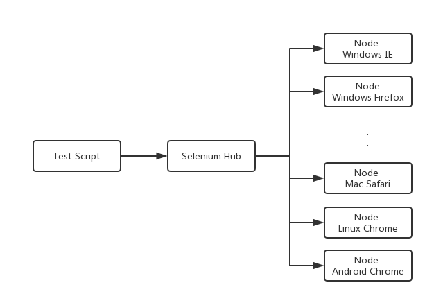
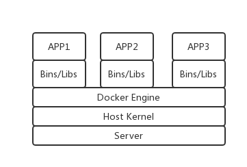
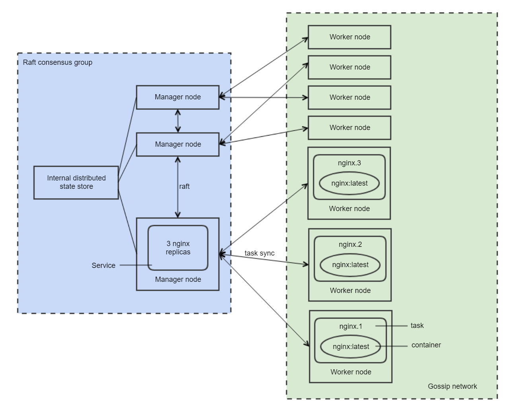
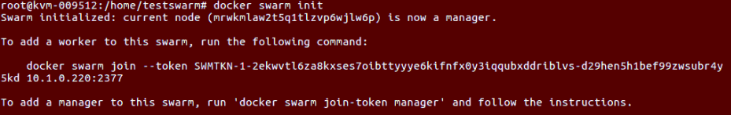
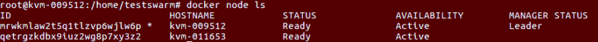
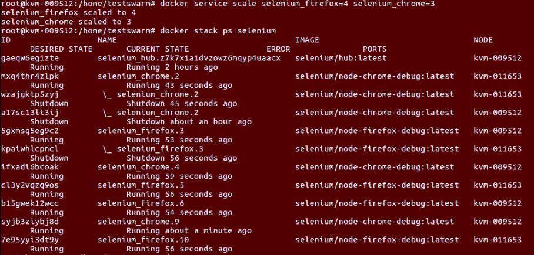
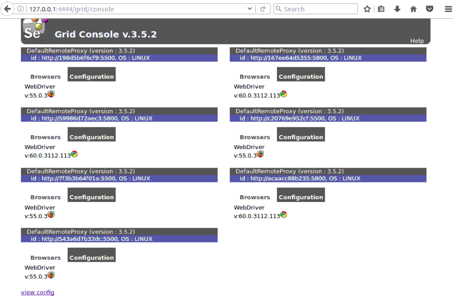

# 基于 Docker 构建 Selenium Grid 分布式测试环境
一种易于上手的分布式测试环境

**标签:** DevOps

[原文链接](https://developer.ibm.com/zh/articles/os-cn-docker-selenium-grid-test/)

林张瑜, 陈梦奇

发布: 2017-10-31

* * *

本文将介绍如何使用 Docker 来构建 Selenium Grid 分布式测试环境。Docker 作为一个管理容器的开源平台，可以很轻松地创建轻量级，可移植的容器。这种低投入，轻量级的分布式运作平台让 web 自动化测试环境构建起来大大减少工作量。本文利用 Docker 内置的 Swarm mode 集群工具，同时结合 Docker Compose 编排工具，组成构建在不同的平台和不同的浏览器中的 Selenium Grid 分布式测试环境。本文会讲述一个关于怎么构建这个框架的应用实例。

## Selenium Grid 框架的介绍

笔者所从事的 IBM 全球化测试项目，需要对产品进行大量的手工截图给翻译测试人员做翻译测试，这会带来很大的工作量。而且全球化测试中项目不同版本的发布，这样就需要对同一个测试用例进行多次反复的截图。大家都知道 Selenium 是支持多种浏览器多个编程语言的一个自动化测试工具。而 Selenium Grid 是一种可以让用户在不同的环境和不同的浏览器上并行运行 web 测试用例的框架。换而言之，使用 Selenium Grid 可以让我们在分布式测试环境下执行测试，例如 Windows，Linux，Mac OS，Andoid/iOS 等等，这样可以大大减少重复的工作量，提高我们的工作效率。

一个 Grid 框架包含一个 hub 节点和若干个 node 节点。hub 节点是管理所有 node 节点的注册和状态等信息，是一个中心控制节点。也就是说 hub 节点一接收到用户的调用请求，就会把这个请求再转给 node 这类工作节点，node 节点便会在相应的环境及浏览器中执行由 hub 下发的测试用例。原则上说，node 越多的话，该测试环境自动化执行效率就会越高。

##### 图 1\. Selenium Grid 框架图



## 引入 Docker

Docker 作为一个用来管理应用容器（Container）的开源平台，可以很轻松地为任何一个应用创建可移植的，轻量级的容器。Docker 的容器虚拟化技术，不同于虚拟机 VM，因为 VM 是拥有自己独立的操作系统以及硬件资源，而 Docker 创建的容器可以看做是在操作系统中相互隔离运行的进程，但是共享同一个宿主机的硬件资源，比 VM 来说更加轻量级，更容易管理与配置。Docker 容器的虚拟化技术架构如图 2 所示：

##### 图 2\. Docker 容器的虚拟化架构图



传统的 VM 是基于对硬件的模拟，还有仿真，所以它的创建速度是很慢的，同时也存在比较大的性能损耗。而 Docker 采用共享宿主机硬件资源的方式，而不需要在每个容器里都执行操作系统，因此它不需要这个等待操作系统开机的过程，几秒钟便可以启动容器，比起传统的 VM 启动要快的多。APP 直接依赖 Bins/Libs，基于操作系统内核之上，在性能上几乎没有损耗。

可以这样说，Docker 是一种创新型的技术解决方案。再加上它把源代码托管在 GitHub 上，并遵从 Apache2.0 协议开源，更得到了很多像 IBM，RedHat，Google 等全球知名公司的技术支持，使得它的应用越来越广泛。

Docker 可以提供轻量级，低投入的分布式测试环境，所以 Selenium Grid 与 Docker 的结合使用，才能真正使测试用例在分布式环境中更自如的运行。Docker 创建的容器在 Selenium Grid 里可以看做是一个个 node 工作节点，而不是传统的虚拟机拿来当 node 工作节点，这样让节点管理控制起来就变的很容易。而且用 Docker 来做浏览器自动化测试还有一个优势，就是它可以同时执行多个不同版本的浏览器。比如说你要用到不同版本的 chrome 浏览器，但是在同一个环境里只会驱动一个版本的浏览器，但是用 Docker 就可以避免这样的问题。

同时 Selenium Grid 框架中的 hub 节点和 node 节点是分布在不同的环境和浏览器里，大量的容器集群就需要相应的管理工具去维护与管理。Docker 支持分布式集群应用，就能强而有力的解决这些问题。由此，本文使用 Docker 公司的 Swarm node 集群工具来管理容器集群，将多个 Docker 宿主机变成一个单一的虚拟主机，并结合 Docker Compose 编排工具去定义和配置容器执行，从而构建了一个能在不同平台，不同浏览器中并行运行测试用例的自动化测试环境。

## Docker Swarm mode

### Swarm mode 简介

继 Docker 1.12 版本之后，Docker 中就内置了 Swarm mode 集群管理框架，这将启用集群模式变得更加简单，只需要通过初始化集群或加入现有的集群就可以了，而且它可以直接通过 Docker CLI 命令来创建、部署、调度应用服务。

除集群管理内置于 Docker 引擎这个特性之外，Swarm mode 的重要特性还有：去中心化设计，声明式服务模型，服务发现，负载均衡，服务扩容缩容，协调预期状态与实际状态的一致性，多主机网络，安全策略，滚动更新等等，可以参考 Docker 官网上的 [Swarm mode 官方文档](https://docs.docker.com/engine/swarm/) 的介绍。

### Swarm mode 与 Docker Swarm 的差异及改进之处

Docker Swarm Mode 和 Docker Swarm 虽然都是集群管理和服务编排工具，名称也类似，但他们是两个不同的概念。Docker Swarm 是一个原生的 Docker 集群管理工具，他将一组 Docker 主机作为一个虚拟的 Docker 主机来管理。在 Docker1.12 版本之前，只有原生的 Docker Swarm 集群，它结合 machine 和 compose 来操作所有的机器，是一种较旧的独立产品。而 Swam mode 是内置于 Docker 引擎的，是利用 SwarmKit 实现的。从下表可以明显看出原生 Swarm 与 Swarm mode 的区别。

##### 表 1\. Swarm 和 Swarm mode 比较表格

**Swarm****Swarm Mode**独立的产品内置于 Docker Engine 中需要额外的 KVstore不需要额外的 KVstore，通过 Raft 协议保持整个集群和运行在其上的所有服务的一致状态。Swarm 自己不运行容器，只作为调度的节点，来管理容器Swarm mode 的管理节点既可以作为管理节点，也可以作为工作节点，但管理节点中，只能有一个 leader结合 machine 和 compose 来操作所有的机器还没有和 Docker machine 与 Docker compose 集成

### Swarm mode 工作原理

Docker Swarm mode 中有三个核心的概念：Node，Service 和 Task。

Node 是参与集群的 Docker 引擎实例，你可以只在一台物理计算机或云服务器上运行一个或多个节点，但是实际应用中，集群部署通常会分布在多个物理机或者云机器上。Node 又分为 manager node 和 worker Node。在使用中，初始化 Swarm 集群的时候，第一个 node 便被一起创建出来了，初始的 node 是 manager node。Manager node 负责将 task 分派给 worker node。Manager node 还负责任务编排和集群管理功能，以维护集群所需的状态。如果集群中有多个 manager node，则只会选择其中一个 manager node 来作为最终的 leader 来执行编配任务。Worker node 接收并执行从 manager node 发出的任务。默认情况下，manager node 也会作为 worker node 运行各项任务，但你也可以将它们配置为单纯的 manager node，只运行管理任务。worker node 会通知 Manager node 当前分配的任务的状态，这样 manager node 就可以维护每个 worker node，以达到期望状态。

Service 指的是在 worker node 上执行的任务的描述。Service 是 Swarm 系统的中心架构，是用户跟 Swarm 交互的基础。在你创建 service 时，你需要指定容器镜像，容器里面执行的命令等。service 有 replicated service 和 global service 两种运行模式。在 replicated service 模式下，Swarm 按照一定规则在各个 worker node 上运行指定个数的 task；在 global service 模式下，每个 woker node 上运行一个 service 对应的 task。

Task 指的是一个 Docker 容器以及需要在该容器内运行的命令，是 Swarm 的最小调度单元。Manager node 根据 service scale 的副本数量将 task 分配到 worker node 上。被分配到一个 node 上的 task 不会被莫名移到另一 node 上，除非运行失败。

以下架构图很好的阐述了 Swarm mode 中 node、service 和 task 之间的关系：

##### 图 3\. Swarm mode 集群架构图



架构特点：

1. 无外部依赖，Manager 之间通过 Raft 协议保持整个集群和运行在其上的所有服务的一致状态。
2. 高可用架构，在具有 N 个管理节点的集群中，最大可容忍 (N-1)/2 个机器失效。
3. 由于没有外部依赖，swarm mode 集群的部署非常简单，只需要安装好 Docker Engine，再设置好节点角色即可。

## Docker Compose

Docker Compose 是一个可以在同一个环境中定义和执行多个容器的编排工具。从字面意思来理解，Compose 就好比是一个大箱子，可以把多个没有关联的沙箱整合到一起，变为一个整体。此文用这个 Compose 编排工具去管理配置 Selenium Grid 里的 hub 主节点和 node 子节点，可以简单化管理多容器的运作。你只需要定义一个配置文件，即 docker-compose.yml，里面包含了要配置的多个容器的信息，然后运行一条非常简单的命令就可以完成所有事情。它可以解决多个容器部署的问题并提高了多个容器解决方案的可移植性。

### 工作原理

Docker Compose 把所管理的容器分为三个部分，项目（project），服务（service）以及容器（contaienr）。它的工作原理就是将当前运行的目录下所有文件组合成为一个项目，一个项目里包含多个服务，这些服务就是由配置文件定义，包含有容器运行的镜像，依赖，端口等等。

1.首先要定义一个 docker-compose.yml 配置文件

配置文件的样例如下所示，摘自 [Docker Compose 官方文档](https://docs.docker.com/compose/) ：

#### 清单 1\. docker-compose.yml 样例

```
version: '3'
services:
web:
build: .
ports:
- "5000:5000"
volumes:
- .:/code
- logvolume01:/var/log
links:
- redis
image: redis
volumes:
logvolume01: {}

```

Show moreShow more icon

我们可以从这个样例中看到，这个 compose file 是基于 version 3 的，是最新的也是最为推荐的，因为这个版本与 Swarm mode 兼容性会更好。web 和 redis 是要启动的两个服务，web 服务是 link 到 redis 服务的，所以应该是由 redis 服务先启动。build 命令用来加载当前目录下的 Dockerfile，它可以创建一个自定义的 image，image 就是这个服务要用的 docker 镜像。ports 即是映射宿主机和容器的端口，volumes 是挂载一个目录或者已经存在的数据卷容器。更多的关于各个属性的使用请参考 [Docker Compose 官方文档](https://docs.docker.com/compose/) 。

2.最后运行 docker-compose up 这个命令就可以把配置文件中定义的多个容器启动起来，它会解析多个容器之间的依赖关系（link，volume 等）按照先后顺序来启动。相反的，若是你想要停止这些容器以及删除它们，可以通过 docker-compose down 这个命令去一键完成。

### Docker Compose 与 Swarm mode 的结合

Docker 早在 2016 年 6 月在 1.12 版本的 Engine 里加入了 Swarm mode，在容器之上引入了 Services 的概念。但是这个版本上面的 Docker Compose 面向容器编排设计，与 Swarm mode 不能很好的相兼容。然而，在 Docker 2017 年 1 月发布的 1.13 版本里，对于 Swarm mode 的技术支持进一步扩展，Docker Compose file 有了新的 v3 版本可以全面支持 Swarm mode。另外很重要的一点，就是 Docker 1.13 版本中引入 stack 这个应用栈来支持对于 Swarm mode 的部署管理，从而大大简化了使用容器编排的复杂性。

采用 Swarm mode，Compose，Selenium Grid 三者结合的方式来部署分布式测试环境，可以借助 Swarm mode 简化集群的部署过程，通过 Compose 快速的搭建 Selenium Grid 测试环境，并且可以随时调整部署环境。三者的配合使用，可以有效地解决其跨主机网络问题，也便于统一部署管理，使得整个测试过程中达到更高的测试效率。

## 实例演示

### 安装环境

本文所涉及的 Docker 安装及代码运行环境是基于 Ubuntu 16 的环境。具体的安装过程本文不赘述，读者可以参考 [Docker 的官方文档](https://docs.docker.com/) 去了解和安装 Docker，以及参考资源里的其他关于 [Swarm mode 官方文档](https://docs.docker.com/engine/swarm/) 和 [Docker Compose 官方文档](https://docs.docker.com/compose/) 的链接去了解其配置与使用，还有 Github 上 [seleniumHQ/docker-selenium 项目链接](https://github.com/SeleniumHQ/docker-selenium) 下载相关的 Selenium 的各个镜像，包括有 selenium/hub, selenium/node-chrome-debug, selenium/node-firefox-debug 等镜像。

本文提及的 selenium/node-chrome-debug 镜像，它除了跟 selenium/node-chrome 镜像一样包含了 chrome，而且还包含 VNC Server；selenium/node-firefox-debug 镜像也是类似的，是包含了 firefox 和 VNC Server 的 Selenium Grid Node 镜像。这类镜像包含了 VNC Server 可以直接连接容器方便读者开发与调试。

### 具体配置和运行

该节主要描述如何配置和结合运用 Swarm mode 集群和 Docker Compose 编排工具去搭建 Selenium Grid 分布式测试环境的一个实例。

首先要在测试环境的主机上初始化 Swarm mode，生成出一个 token，该主机便成为 Swarm mode 的 manager node。如图 4 所示。

##### 图 4\. Swarm mode 初始化



然后在另一台测试环境中，利用之前得到的 token 用 docker swarm join 命令去加入到 swarm 集群里，成为 work node。这时候我们再去测试主机 manager node 上可以查看当前的所有已添加到 swarm 集群中的 node 列表。如图 5 所示。

##### 图 5\. swarm node 列表



接下来我们需要部署配置文件 docker-compose.yml，里面需要构建三个服务，分别名字为 hub，firefox，chrome。这些服务里面定义了它运行容器的镜像，端口号以及链接到 hub 容器。如清单 2 所示。

#### 清单 2\. 配置 docker-compose.yml

```
version: '3'
networks:
private:
driver: overlay
services:
hub:
image: selenium/hub
ports:
- "4444:4444"
deploy:
mode: global
placement:
constraints:
- node.role == manager
networks:
- private
chrome:
image: selenium/node-chrome-debug
depends_on:
- hub
entrypoint: bash -c 'SE_OPTS="-host $$HOSTNAME -port 5800" /opt/bin/entry_point.sh'
ports:
- "5800:5800"
environment:
- HUB_PORT_4444_TCP_PORT=4444
 - HUB_PORT_4444_TCP_ADDR=hub
- NODE_MAX_SESSION=1
deploy:
replicas: 1
networks:
- private
firefox:
image: selenium/node-firefox-debug
depends_on:
- hub
    entrypoint: bash -c 'SE_OPTS="-host $$HOSTNAME -port 5500" /opt/bin/entry_point.sh'
ports:
environment:
- HUB_PORT_4444_TCP_PORT=4444
- HUB_PORT_4444_TCP_ADDR=hub
- NODE_MAX_SESSION=1
deploy:
replicas: 1
networks:
- private

```

Show moreShow more icon

接着便是要启动服务。我们在 Swarm mode 下如果还是用原生的 compose 启动服务的命令 docker-compose up 的话，Docker Compose 启动就会出错。这时，我们可以用到在 1.13 Docker 核心项目里加入的 stack 命令。如清单 3 所示。给 docker stack deploy 指定我们刚才定义的 docker-compose.yml 文件便可以一键启动所有的服务。

#### 清单 3.

```
>root@kvm-009512:/home/testswarm# docker stack deploy --compose-file=./docker-compose.yml selenium

```

Show moreShow more icon

服务启动之后，我们也可以通过 docker service scale 按照个人项目去配置更多的容器，以达到分布式测试环境的需求。通过 docker stack ps 可以查看到我们所有启动的容器，以及它分布在哪个 node 上。如图 6 所示。

##### 图 6\. 多个服务配置



或者，我们可以直接打开 [http://localhost:4444/grid/console](http://localhost:4444/grid/console) 登录到 Selenium Grid 的 console 界面。如图 7 所示。这样，Selenium Grid 的分布式测试环境就构建好了。

##### 图 7\. Selenium Grid Console



## 结束语

本文使用 Docker 的 Swarm mode 和 Compose 两大工具来构建 web 自动化测试的分布式环境，无需多余的硬件资源支持，无需繁琐的系统安装和软件安装环境，就可以通过简单的配置与应用，轻松的，低投入的搭建出来整个测试环境。