# 基于 IBM Cloud Availability Monitoring 的 Web 应用性能测试配置详解
确保应用总是可用并且时刻满足用户对响应时间的需求

**标签:** 云计算

[原文链接](https://developer.ibm.com/zh/articles/cl-lo-ibm-cloud-availability-monitoring/)

安芹, 杨晓蓓, 斐赵, 卢江

发布: 2018-05-16

* * *

## 概述

为了确保应用总是可用并且时刻满足用户对响应时间的需求，本文将介绍如何使用 Availability Monitoring 来监控应用，及时检测到问题并在影响到用户之前通知开发人员解决掉问题。在本教程中，您将学习如何配置综合测试，以监视您的 Web 页面、API 以及应用的用户交互行为。

## Availability Monitoring 简介

通过 IBM Cloud Availability Monitoring 服务，您可以创建、编辑和查看多种类型的合成测试，如 Web 页面测试，REST API 测试，可模拟 Web 应用程序中终端用户行为的合成测试。Availability Monitoring 仪表板上会显示由不同的 IBM 云区域（Region）监视着的 URL 和 API 的可用性和响应时间信息。使用仪表板可通过图形、故障表和映射试图，监视不同位置的与应用程序相关联的警报和活动。

这个服务具有以下几个关键特性：

- **启动时间不超过 5 分钟** 。不管应用程序在何处运行，都为其提供了即用型监视功能部件（例如，自动配置的可用性测试）。
- **最大限度地提高正常运行时间和用户满意度** 。监控每分钟您的应用程序在几个地理位置的正常运行时间和响应时间；运行合成测试来评估网站加载和 API 调用的响应时间；监视用于从不同位置模拟用户流的脚本；使用过滤器控制哪些依赖项和资源有助于测试 Web 应用程序的响应时间。
- **主动接收提示** 。 _可以_ 接收电子邮件，Slack，或短信通知，在问题影响到用户之前提醒您。可以使用集成的 Alert Notification 服务创建警报策略，以减少警报噪声。
- **隔离部署问题** 。为了帮助隔离由于代码部署而发生的问题，您可以分析相关的因素，如响应时间、可用性和警报。
- **准确快速地查明失败原因** 。瀑布图分析可以帮助您找出确切的发生故障的步骤及失败原因；例如，断开的链接，超大图片，慢查询，或外部请求。自动创建屏幕截图，帮助您诊断浏览器故障和历史性能问题。下载每月、每周、每日可用性和响应时间的平均测试报告。
- **监控真实用户满意度** 。监视用户对应用程序响应性能的满意程度。比较满意程度与应用程序的吞吐量。配置数据收集器从应用程序收集用户事务数据。

## 需要做的准备工作

1. IBM Cloud 帐户。如果您还没有帐户，可以先注册一个 [免费试用](https://cocl.us/IBM_CLOUD_GCG) 帐户。
2. 准备一个 Web 应用。可以在 IBM Cloud 创建一个 Cloud Foundry 应用。在本文中我们使用的是 [“从想法到代码-利用 Bluemix ToolChain 服务进行项目管理”](https://www.ibm.com/developerworks/cn/devops/from-idea-to-code-project-ma-using-the-ibm-cloud-tool-chain-service/index.html?ca=drs-) 一文中的应用程序。
3. 安装 [Selenium IDE](https://www.ibm.com/support/knowledgecenter/SSMKFH/com.ibm.apmaas.doc/install/admin_syn_record_script.htm) 。

## 将 IBM Cloud Availability Monitoring 绑定到应用

如果要监视应用程序，请在应用程序界面的所有应用程序列表中单击应用程序名称（如 TestAM-app 本文中使用的应用名称）。如果您还没有应用程序，请先创建一个应用，应用程序面板会自动打开。

Availability Monitoring 服务在 IBM Cloud 的 DevOps 服务目录下。您可以选择在该目录下创建一个实例。但默认情况下，在 **Cloud Foundry apps** 的面板中，直接点击 **Monitoring** 选项卡时自动创建一个名为 **availability-monitoring-auto** 的 Availability Monitoring 服务，并绑定到当前应用，如图 1 所示。

##### 图 1\. 默认创建的 availability-monitoring-auto 服务

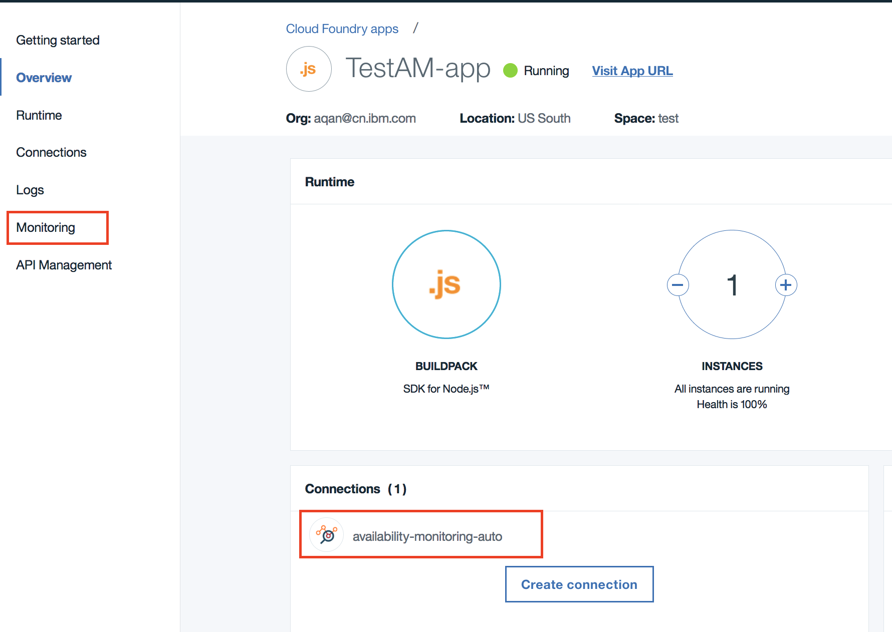

## 配置 Availability Monitoring 测试

在创建完 Availability Monitoring 服务后，就可以开始配置应用程序的测试了，我们会通过三个测试场景分别对应不同的 Availability Monitoring 测试实例。

### 场景一：监控应用的页面，确保加载时间

我们的应用有 3 个页面 ，所以这里我们将会创建 3 个页面测试来对这 3 个页面进行监控。

- 登陆页面：


    ##### 图 2\. 登陆页面


    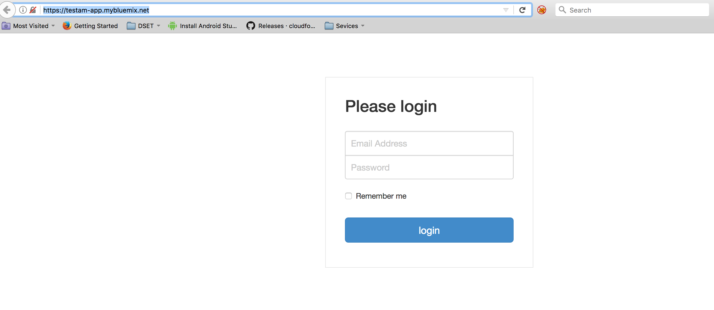

- 地图页面：


    ##### 图 3\. 地图界面


    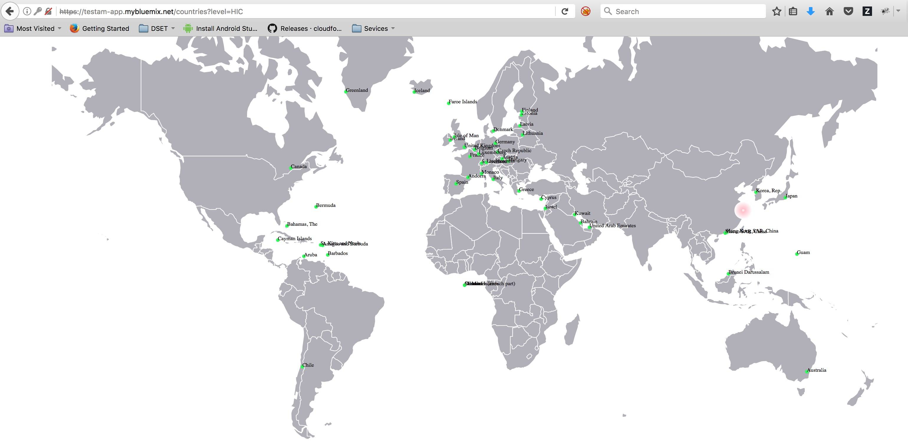

- 收入信息页面：


    ##### 图 4\. 收入信息页面


    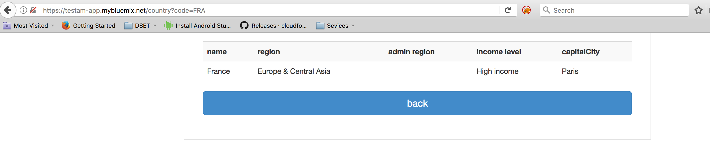


测试配置步骤：

1. 在应用界面点击 **Monitoring** 选项卡，监视选项卡显示了三个仪表，它们显示了在过去 24 小时内的平均测试可用性、当前测试状态和当前计划分配的使用情况。

2. 选择 **Add New Test** 。如图 5 所示。


    ##### 图 5\. Availability Monitoring 仪表盘


    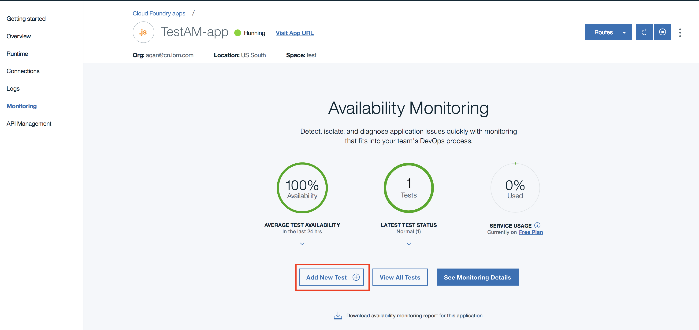

3. 选择 **Single Action** ，然后选择 **Webpage** 。

4. 输入名字和 URL。 名称是标识您的测试的名称，如 Test Webpage 。URL 是应用程序的 Web 页面的 URL，如地图页面 `https://testam-app.mybluemix.net/countries?level=HIC`。如图 6 所示。


    ##### 图 6\. Webpage 测试名称和 Webpage URL


    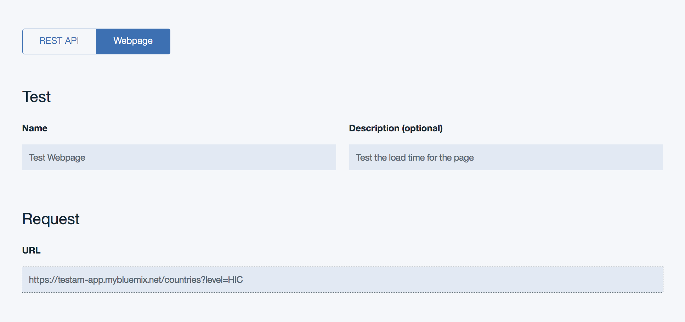

5. 在响应验证部分配置测试的警告和临界警报阈值。编辑每行的值和单位。超过警告和临界阈值的响应时间将会触发警报。

6. 使用黑名单和白名单指定发送请求的 URL 和域名有助于您的度量和应用试验情况。更多关于白名单和黑名单的信息，请参照 [Blocking and filtering with the whitelist and blacklist](https://cloud.ibm.com/docs/services/AvailabilityMonitoring?topic=availability-monitoring-avmon_filters) 。

7. 设置完后，点击 **Verify** 。 Availability Monitoring 通过向测试 URL 发送 GET 请求来确定测试有效性。在测试验证期间不进行响应验证。已验证的测试显示在验证项目表中。如图 7 所示。


    ##### 图 7\. 验证项目表


    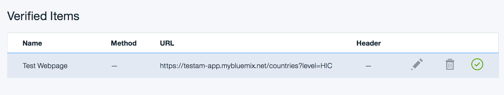

8. 下拉到页面下方，点击 **Next** 。

9. 在 **Settings** 旁边点击 **Edit** 。设置时间间隙（ **Interval** ），为了尽快看到测试结果，我们这里设置时间间隔是 3 分钟 (即每 3 分钟运行一次测试脚本)，位置（ **Locations** ），响应时间阈值，然后点击 **Finish** 。如图 8 所示。


    ##### 图 8\. 配置 Settings 项目


    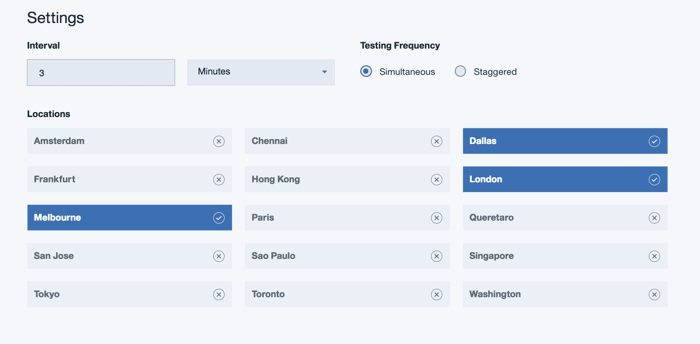


按照 3-8 步骤配置其他两个页面的测试。

### 场景二：通过自动化的 Selenium 测试脚本监听用户交互行为

使用 Selenium IDE，您可以在网页上记录用户操作，例如加载页面、单击链接或选择对象。在录制 IDE 时，它会为脚本中的每个用户操作生成命令。然后，使用合成脚本管理器，您可以配置脚本来模拟用户行为。注意：使用 Firefox 浏览器和 Selenium IDE 插件记录合成脚本。

#### 1.下载并安装 Selenium IDE

如果您还没有安装 Selenium IDE，请先安装 [Selenium IDE](https://www.ibm.com/support/knowledgecenter/SSMKFH/com.ibm.apmaas.doc/install/admin_syn_record_script.htm) 。

#### 2.使用 Selenium IDE 录制脚本

1. 打开应用，同时打开 Selenium IDE 窗口，点击红色（Record）按钮开始录制。

2. 回到应用，开始在页面的一些操作。操作流程：

3. 输入用户名和密码登录。

4. 进入高收入国家显示界面（地图页面）。
5. 选择某个国家，查看详细信息。

6. 然后回到 Selenium IDE 窗口，点击红色按钮，停止录制。如图 9 所示。


    ##### 图 9\. Selenium IDE 录制的脚本窗口


    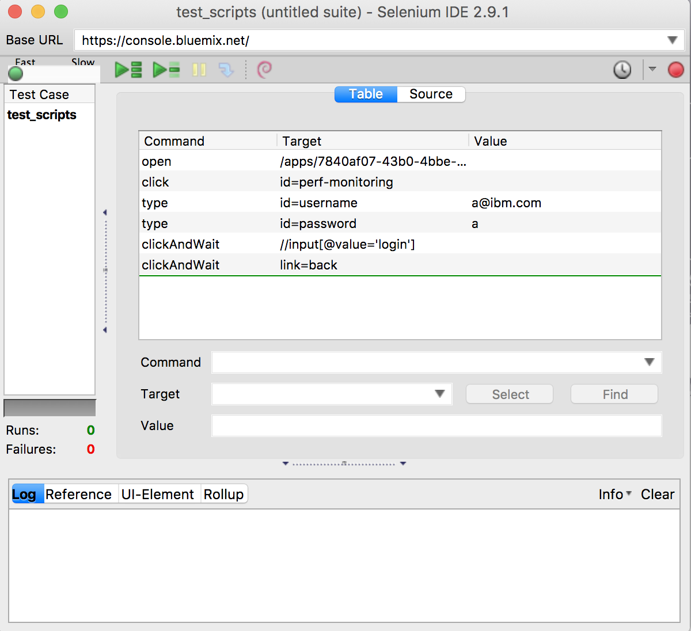

7. 点击文件>保存测试用例。给定一个有意义的名称作为脚本的名字并保存为 HTML 文件，如 test\_scripts.html。图 10 显示了对应用的操作脚本。


    ##### 图 10\. 录制的用户操作脚本


    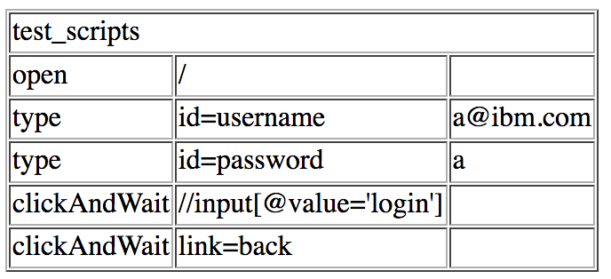


#### 3.创建 Selenium 脚本测试

1. 选择 **Add New Test** 。
2. 选择 **Scripted Behavior** 。选择 **Upload File** 选项卡。
3. 输入名称（如 Test script behavior）和描述。
4. 将之前录制的 HTML 文件上传，如图 11 所示。

    注意：上传的文件必须是.zip 或.html 格式的且文件大小不超过 1MB。


    ##### 图 11\. Scripted Behavior 测试配置界面


    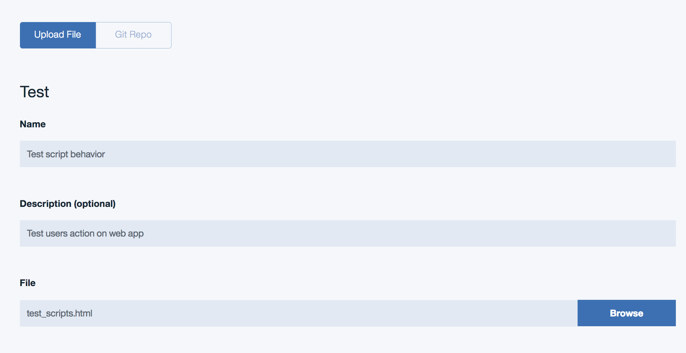

5. 点击 **Next** 。

6. 设置时间间隙（ **Interval** ），同样设为 3 分钟，位置（ **Locations** ），响应时间阈值，然后点击 **Finish** 。

### 场景三：监控 REST API

使用 REST API 测试来监视 Web 应用程序和其他 URL 的可用性和性能，以响应 REST 调用。请按照下面步骤创建一个 REST API 测试。

1. 选择 **Add New Test** 。

2. 选择 **Single Action** ，然后选择 **REST API** 。

3. 输入测试名称 (如 Test REST API) 和描述。

4. 在请求部分中，从方法列表中选择方法的类型，并输入要用此方法进行测试的 URL。您可以选择 GET、PUT、POST 或 DELETE。

5. 输入要监测的 REST API URL。

6. 您可以配置测试以包含特定的头和值。在头字段中输入标头名称和标头值。如果选择了 POST 方法，则可以在请求主体（可选）字段中输入主体内容进行测试。如图 12 所示。


    ##### 图 12\. POST 方法测试 REST API URL 的配置页面


    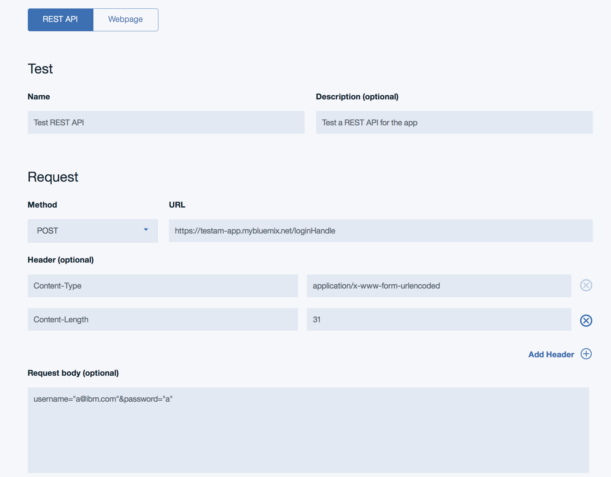

7. 在响应验证部分配置测试的警告和临界警报阈值。编辑每行的值和单位。超过警告和临界阈值的响应时间将会触发警报。

8. 单击 **Add Condition** 定义和添加定制的响应验证条件。对定制的响应验证条件进行总体评估，以生成警报。如图 13 所示。


    ##### 图 13\. 响应验证条件配置


    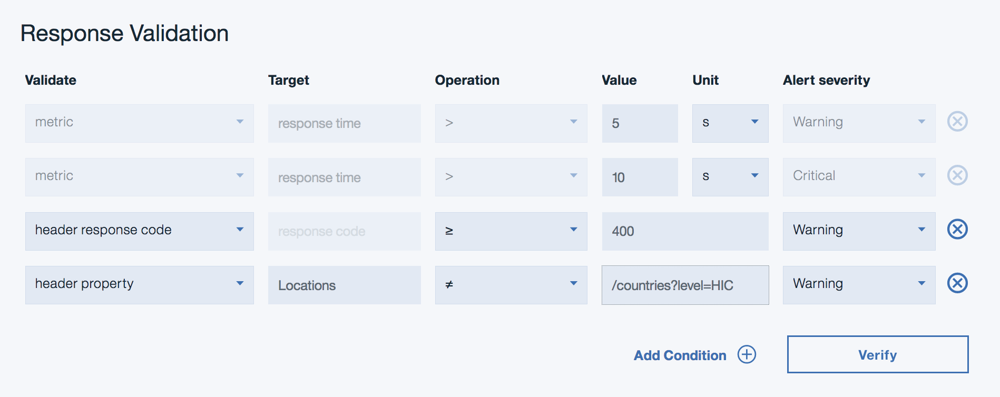

9. 设置完后，点击 **Verify** 。 已验证的测试显示在验证项目表中。

10. 下拉到页面下方，点击 **Next** 。

11. 在 **Settings** 旁边点击 **Edit** 。设置时间间隙（Interval），位置（Locations），然后点击 **Finish** 。


所有配置的测试会在合成测试部分（Synthetic Tests）显示，您可以在这里修改，启动／停止，或删除您配置的测试。如图 14 所示。

```
##### 图 14. 配置的所有测试 {: #图-14-配置的所有测试}


```

Show moreShow more icon

## 测试并查看测试结果

Available Monitoring 的测试会根据您之前设置的时间间隔运行，当不符合测试条件时，会在监视页面显示出来。

您可以返回到监视选项卡来查看您的合成测试结果：

1. 在应用页面，点击 **Monitoring** 选项卡，打开 **Available Monitoring** 仪表板。

2. 在最近测试状态部分，单击箭头。查看显示的详细信息。如图 15 所示。


    ##### 图 15\. 所有测试的状态


    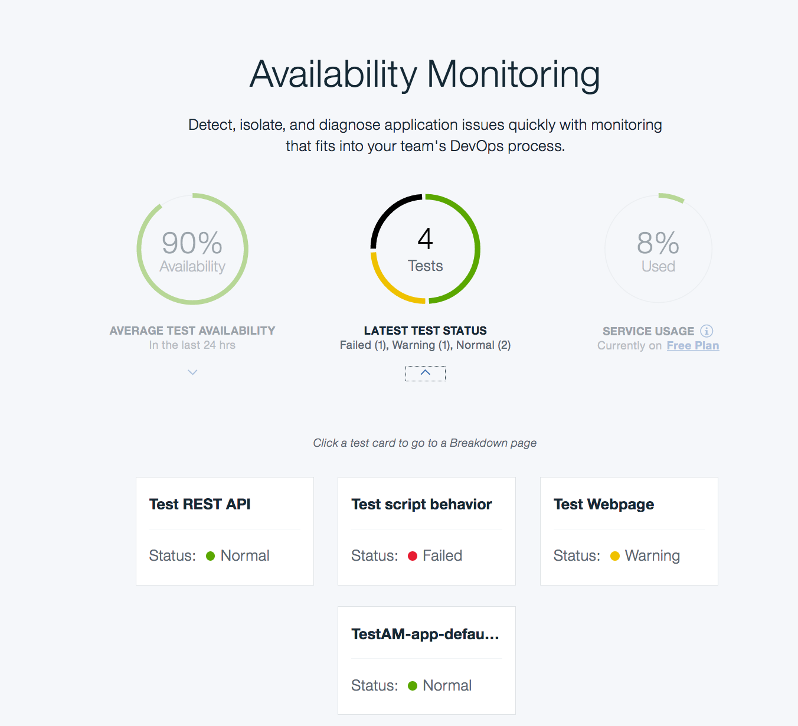

3. 要查看测试的详细结果，包括检测到的任何缓慢或无反应的结果，请单击指定的单个测试卡。

     这个页面包括测试总结、测试案例、响应时间和可用性，以及应用活动。


    ##### 图 16.Test script behavior 测试的详细信息一


    


    ##### 图 17.Test script behavior 测试的详细信息二


    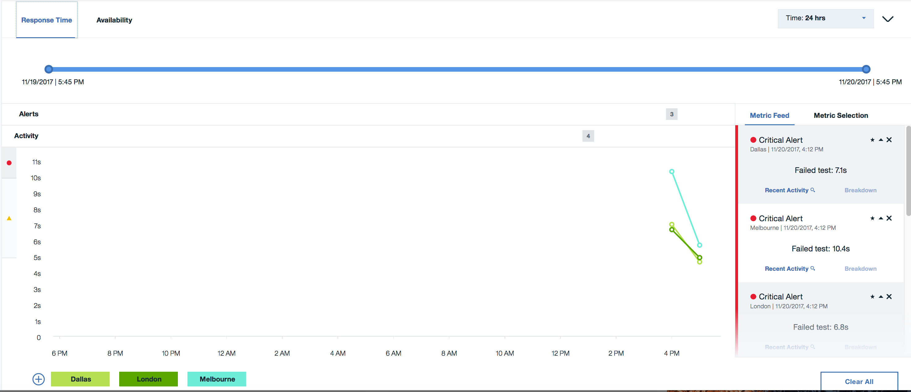

4. 每个测试案例的右边有三个操作项，第一个可以查看错误发生时的截图，中间一个是把错误信息打包成一个 HAR 文件并下载到本地查看，最后一个可以把测试信息展开，查看具体的失败步骤。如图 18 所示。


    ##### 图 18\. 操作脚本测试结果


    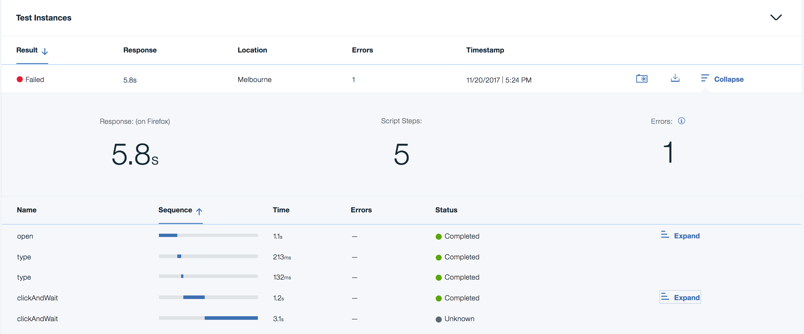

5. 您可以使用 IBM Alert Notification 服务来配置监视功能，以便在事件发生时发送通知。您可以使用邮件接收任何超过阈值的警报，还可以设置高级通知选项。例如，您可以通过 Slack 或短信接收警报 。关于如何设置高级通知选项，如何使用 IBM Alert Notification 服务来配置接收警报，会在另一篇文章中详细介绍。


## 参考信息

- [Available Monitoring 文档](https://cloud.ibm.com/docs/services/AvailabilityMonitoring?topic=availability-monitoring-avmon_gettingstarted),了解更多的 Available Monitoring 的功能及使用教程。
- [IBM Cloud 文档](https://cocl.us/IBM_CLOUD_GCG)，了解 IBM Cloud 上更多的服务与应用。