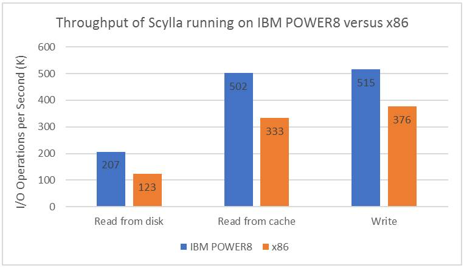

# 基于 IBM Power Systems 运行的 Scylla 的性能
在 IBM POWER8 与基于 Intel x86 处理器的服务器上运行读写工作负载的吞吐量和延迟之比较

**标签:** IBM Power Systems,Linux,数据库

[原文链接](https://developer.ibm.com/zh/articles/l-performance-scylla/)

Beth Hoffman, Vlad Zolotarov, Thomas Chen, Sandy Kao

发布: 2018-01-17

* * *

## 简介

由 IBM 和 ScyllaDB 相关专家组成的团队通力合作，着手证明与基于 Intel x86 处理器的服务器相比，在基于 IBM® POWER8® 处理器的服务器上运行 ScyllaDB 有何价值。 测试结果证明，在基于 IBM POWER8 处理器的服务器上运行 Scylla 时，读写操作方面的吞吐量更大，并且写延迟也更低。

本文描述了所使用的测试环境与硬件配置、测试结果及支持数据，以及 POWER8 调整示例和调优建议。另外，本文还介绍了有助于彰显 Scylla 卓越性能的多项 POWER8 功能。

## Scylla 简介

Scylla 是开源非关系型数据库，可随时直接替代 Apache Cassandra。Scylla 和 Cassandra 均为宽列存储数据库。Scylla 可利用 Cassandra 的最佳功能，同时提供的性能是 Cassandra 的 10 倍，并实现了更低级别的延迟。Scylla 具有高度可扩展的架构，在单一服务器上每秒可处理一百万个数据库事务。Scylla 还具有跨节点的自动故障转移和复制功能，最大限度提升了可用性与可靠性。工作负载调整可提供一组动态调度算法，最大限度减少数据库操作延迟抖动，并缩短压缩流处理和修复时间。

Scylla 的环状架构使数据库能够向上和向外扩展。当数据集过大，不适合位于单一节点中时，Scylla 架构会提供以散列环形式直观显示的节点集群。所有节点都应为使用无共享方法的同构节点。Scylla 使用密钥空间和复制因子来定义在整个集群中复制数据的方式。复制有助于提升容错能力。

ScyllaDB 使用 SSTable (Sorted Strings Table)，这种存储格式按键排序，存储键/值字符串对。SSTable 的一项主要优势在于能够压缩 SSTable 数据文件。由于从数据文件执行随机访问读取至关重要，Apache Cassandra 实施了分块压缩。未压缩文件被分为多个可配置的固定大小（通常为 64 KB）区块，每个区块都单独压缩并写入压缩数据文件。

阅读 [Scylla Architecture](http://docs.scylladb.com/architecture/) ，获取更多详细信息。

阅读 [Scylla Apache Cassandra Compatibility](http://docs.scylladb.com/cassandra-compatibility/) ，了解 Scylla 与 Cassandra 的兼容情况。

## IBM Power Systems 对于 Scylla 的价值

Scylla 非常适合在 IBM POWER8 服务器上运行，主要原因有很多。由于 POWER8 支持每个核心最多八个线程，因此与基于 x86 处理器的服务器相比，Scylla 中的分片功能更适合在 POWER8 上扩展。由此每个核心可提供八个 Scylla 分片，最大限度提升了可同时执行的数据库读写操作数量。

POWER8 的高速缓存层次结构和内存带宽更胜一筹，进而提高了数据访问速率。POWER8 的内存容量更大，可支持更大的内存数据库。

## 测试环境

设置了两种测试环境：一种环境用于在 x86 上运行 Scylla，另一种环境用于在 POWER8 上运行 Scylla。每台服务器均采用相似配置，并且在每台服务器上均分配类似资源用于测试。在这两种服务器环境中运行测试时，使用了相同的性能基准。在基于 IBM POWER® 处理器的服务器测试中使用的 Scylla 软件为尚未公开发行的 _Alpha_ 测试版本。

### 基准

使用开源 `cassandra-stress` 工具进行基准评测和负载测试。 `cassandra-stress` 是基于 Java 的工具，提供了内置方法来填充测试数据和执行各种工作负载压力测试。

对以下两项关键数据库操作进行了测试：读操作和写操作。在每次测试运行期间测量吞吐量和延迟。以每秒读（或写）操作数来测量吞吐量。以完成一次读或写操作所需毫秒数来测量延迟。针对读和写操作均多次运行测试，并计算平均值。

在此次测试中，使用了 16 个 `cassandra-stress` 装载程序。每个 `cassandra-stress` 实例均读取或写入自己的密钥空间”ksX”，其中 X 范围为 0 到 15。在集群不含任何数据时，启动每个写测试迭代（清空数据，每次迭代前重新启动 Scylla）。

在每个”从磁盘读取”迭代之前，重新启动 Scylla。在测试中使用了大小为 12 GB 的数据集。每个分区一行数据。平均行大小为 310 字节。以下是所使用的模式：

```
cqlsh> DESC KEYSPACE ks1

CREATE KEYSPACE ks1 WITH replication = {'class': 'NetworkTopologyStrategy', 'datacenter1':
'1'} AND durable_writes = true;

CREATE TABLE ks1.standard1 (
      key blob PRIMARY KEY,
      "C0" blob,
      "C1" blob,
      "C2" blob,
      "C3" blob,
      "C4" blob
) WITH COMPACT STORAGE AND bloom_filter_fp_chance = 0.01
      AND caching = {'keys': 'ALL', 'rows_per_partition': 'ALL'}
      AND comment = ''
      AND compaction = {'class': 'SizeTieredCompactionStrategy'}
      AND compression = {}
      AND crc_check_chance = 1.0
      AND dclocal_read_repair_chance = 0.1
      AND default_time_to_live = 0
      AND gc_grace_seconds = 864000
      AND max_index_interval = 2048
      AND memtable_flush_period_in_ms = 0
      AND min_index_interval = 128
      AND read_repair_chance = 0.0
      AND speculative_retry = '99.0PERCENTILE';

```

Show moreShow more icon

在每台服务器上运行 Scylla 数据库后，使用以下命令调用为读测试和写测试调用 `cassandra-stress` 工具。

对于写测试：

```
/home/user1/scylla-tools-java/tools/bin/cassandra-stress write no-warmup n=2500000 -node <IP>
-rate threads=200 -mode native cql3 -schema keyspace=ksX replication(strategy=NetworkTopologyStrategy,
datacenter1=1)

```

Show moreShow more icon

对于读测试：

```
/home/user1/scylla-tools-java/tools/bin/cassandra-stress read no-warmup n=2500000 -node <IP>
-rate threads=200 -mode native cql3 -schema keyspace=ksX replication(strategy=NetworkTopologyStrategy,
datacenter1=1)

```

Show moreShow more icon

### 硬件配置

表 1 显示安装了 Scylla 数据库的 POWER8 服务器和基于 x86 处理器的服务器的配置。每个配置中都使用了相同的核心数、内存和存储空间。在这些测试中，服务器的操作系统均以裸机非虚拟化方式配置。

##### 表 1\. POWER8 服务器和 x86 数据库服务器的硬件配置

组件IBM POWER8 服务器Intel x86 服务器**型号**IBM Power® System S821LCHP ProLiant DL380**处理器**10 个核心，单插槽10 个核心，单插槽 Intel Xeon® E5-2630 v4**内存**128 GB128 GB**存储空间**PCI 连接的 1.6 TB（含 NVMe）PCI 连接的 1.6 TB（含 NVMe）

### 网络配置

`cassandra-stress` 测试驱动程序在与表 1 中所述数据库服务器不同的服务器上安装并运行。使用了 40 Gbps 网络交换机。在压力测试服务器与所测试的每台数据库服务器之间使用了相同的网络配置。

## 测试结果

测试结果显示，在吞吐量方面，Scylla 在 POWER8 上运行时的表现优于在基于 x86 处理器的服务器上的表现。这些结果意味着，在相同占地空间内，POWER8 系统可完成的 _工作量_ 更多，因为两台测试服务器大小均为 2U（两个单元）。这同时还表明单次操作完成速度更快，因此用户可以更快获得结果。

### 吞吐量

图 1 中显示了吞吐量结果。通过执行读操作测试，从磁盘和高速缓存中检索数据。

- Scylla 在 POWER8 上每秒完成的数据库 **磁盘读取** 操作数，是在 x86 上完成的操作数的 **1.68 倍** 。
- Scylla 在 POWER8 上每秒完成的数据库 **高速缓存读取** 操作数，是在 x86 上完成的操作数的 **1.5 倍** 。
- Scylla 在 POWER8 上每秒完成的数据库 **写** 操作数，是在 x86 上完成的操作数的 **1.37 倍** 。

##### 在 IBM POWER8 与 x86 上运行的 Scylla 的吞吐量之比较



## 调优

ScyllaDB 提供的 [System Configuration Guide](http://docs.scylladb.com/system-configuration/) 中记录了针对各种环境要素（包括硬件、存储、文件系统、网络和 Scylla 软件）的配置建议。同时还提供了若干个脚本，进一步简化配置过程。除了这些配置，还额外提供了数据库调优和 POWER8 调优建议。

### 数据库调优

在测试环境下，对 ScyllaDB 数据库的多个关键方面进行了调优。

以下是在 x86 服务器上启动 Scylla 时所使用的命令调用：

```
/home/scylla/.ccm/scylla-1-1/node1/bin/scylla --options-file
/home/scylla/.ccm/scylla-1-1/node1/conf/scylla.yaml
--log-to-stdout 1 --memory 100G --default-log-level info --smp 20 --cpuset 12-21,36-45 --max-io-requests 300
--developer-mode false --collectd 0 --num-io-queues 20 --prometheus-address 172.31.255.10
--background-writer-scheduling-quota 0.5 --auto-adjust-flush-quota 1 --api-address 10.13.100.22
--collectd-hostname xnode12-22.pub.pic2.ibm.com.node1

```

Show moreShow more icon

以下是在 POWER8 服务器上启动 Scylla 时所使用的命令调用：

```
/home/user1/.ccm/scylla-1-1/node1/bin/scylla --options-file /home/user1/.ccm/scylla-1-1/node1/conf/scylla.yaml
--log-to-stdout 1 --memory 100G --default-log-level info --smp 80 --cpuset 80-159 --max-io-requests 300
--developer-mode false --collectd 0 --num-io-queues 75 --prometheus-address 172.31.254.14
--background-writer-scheduling-quota 0.5 --auto-adjust-flush-quota 1 --api-address 10.13.104.5
--collectd-hostname brnode13-5.node1

```

Show moreShow more icon

### POWER8 调优

在测试期间，更改了以下三项关键的 POWER8 系统级别环境设置，实现了在 POWER8 上运行的 Scylla 的最佳性能。

- **频率**

    将频率性能方式设置为 Turbo。在裸机环境中，CPU 能耗调速器受操作系统 (OS) 控制。使用 `cpupower` 命令来验证和设置频率，如下所示：


    ```
    cpupower -c 0-159 frequency-info

    cpupower -c 0-159 frequency-set -g performance

    ```


    Show moreShow more icon

- **同步多线程 (SMT)**

    通过使用 SMT，可以在同一个核心上并发运行多个线程的指令流。在基于 IBM POWER8 处理器的服务器上，SMT8 是缺省设置，大部分工作负载都可在此缺省设置下良好运行。对于包含 Scylla 在内的各种数据库，最佳做法是将 SMT 设置为 SMT8 方式。POWER8 服务器每个核心最多可提供八个线程，而 x86 服务器每个核心仅提供两个线程。因此，当 ScyllaDB 运行时，它在 POWER8 上每个核心使用八个分片，在 x86 上每个核心使用两个分片。

    使用 `ppc64_cpu` 命令将 SMT 方式设置为 8、4 或 2，如下所示：

    SMT8： `ppc64_cpu --smt=8`

    SMT4: `ppc64_cpu –-smt=4`

    SMT2: `ppc64_cpu –-smt=2`

- **内存亲缘关系和 CPU 绑定**

    仅当使用一小部分服务器资源时，内存亲缘关系和 CPU 绑定才具有重要意义。在 Scylla 测试期间，由于两台服务器均为 2U，但仅 1U 用于测试，因此执行了 CPU 绑定。对于其他环境，亲缘关系也很重要，在服务器经过虚拟化时更是如此，例如，使用了 IBM PowerVM® 的情况。

    - 有关内存亲缘关系的更多信息，请查看以下 IBM 红皮书中的”Chapter 3. The IBM POWER Hypervisor”： [Performance Optimization and Tuning Techniques for IBM Power Systems Processors Including IBM POWER8](http://www.redbooks.ibm.com/abstracts/sg248171.html?Open)
    - 将运行的基准进程固定至特定核心。
    - 为避免在创建虚拟机 (VM) 时受到非均匀内存访问 (NUMA) 的影响，将内存限制于单一芯片或节点。
    - 在生产环境中不建议执行 CPU 绑定。但是，对于基准测试，这是一项实用功能。在 Scylla 测试中，当在 x86 和 POWER8 服务器上启动数据库时，使用 `cpuset` 参数完成 CPU 绑定。

## 硬件配置

表 2 显示了三种不同安装规模的 POWER8 配置示例。

##### 表 2\. 针对 IBM POWER8 服务器的 Scylla 安装规模示例

安装规模IBM Power 型号核心数内存磁盘网络测试，最小规模S821LC8 核32 GB仅一个 SSD1 Gbps生产S822LC for BigData16 核- 双插槽，每个插槽 8 个核心128 GBRAID-0、4 个 SSD、1-5 TB10 Gbps分析，重负载S822LC for BigData22 核- 双插槽，每个插槽 11 个核心256 GBNVMe，10 TB10-40 Gbps

## 小结

Scylla 已在 IBM POWER8 服务器上进行了测试，在数据库读写操作两方面都实现了卓越的吞吐量。Scylla 非常适合在 IBM POWER8 服务器上运行，主要原因有很多。由于 POWER 支持每个核心最多八个线程，因此与基于 x86 处理器的服务器相比，Scylla 中的分片功能更适合在 POWER8 上扩展。POWER8 的内存设计更出色，因而提高了数据访问速率。

## 附录

### 延迟

基于图 1 中所示的吞吐量测量结果，以完成一次操作所需的毫秒数来测量客户端延迟时间。以百分位数来报告延迟。例如，第 95百分位意味着 95% 的操作的延迟不高于表 3 中所示延迟数值。图 3 中显示了延迟结果。

##### 表 3\. 在 IBM POWER8 与 x86 上运行的 Scylla 的客户端延迟之比较

**测试 IBM POWER8 x86 从磁盘读取的延迟**第 95 百分位的延迟17.4 毫秒8.8 毫秒第 99 百分位的延迟191.4 毫秒878.6 毫秒**从高速缓存读取的延迟**第 95 百分位的延迟10.0 毫秒21.2 毫秒第 99 百分位的延迟24.1 毫秒117.7 毫秒**写延迟**第 95 百分位的延迟10.2 毫秒12.7 毫秒第 99 百分位的延迟21.4 毫秒24.1 毫秒

## 其他资源

- [ScyllaDB 网站](http://www.scylladb.com/)
- 以下 IBM 红皮书中介绍的 IBM POWER Hypervisor： [Performance Optimization and Tuning Techniques for IBM Power Systems Processors Including IBM POWER8](http://www.redbooks.ibm.com/abstracts/sg248171.html?Open)
- [Scylla 架构](http://docs.scylladb.com/architecture/)
- [Scylla Apache Cassandra 兼容性](http://docs.scylladb.com/cassandra-compatibility/)
- Scylla [System Configuration Guide](http://docs.scylladb.com/system-configuration/)

本文翻译自： [Performance of Scylla running on IBM Power Systems](https://developer.ibm.com/articles/l-performance-scylla/)（2018-01-17）