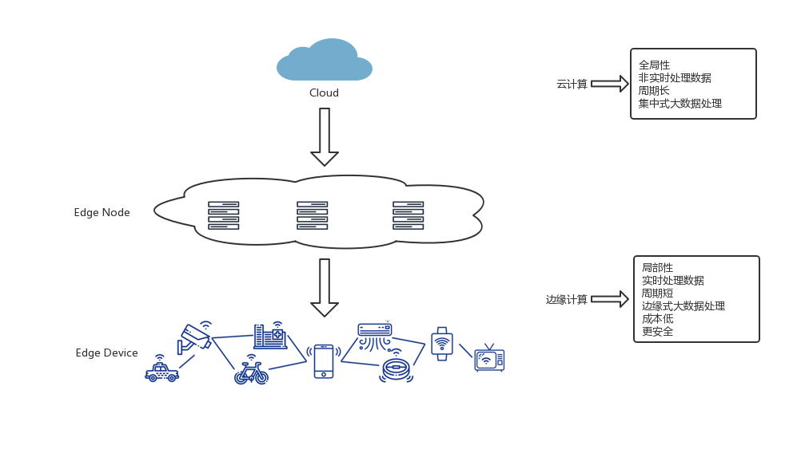
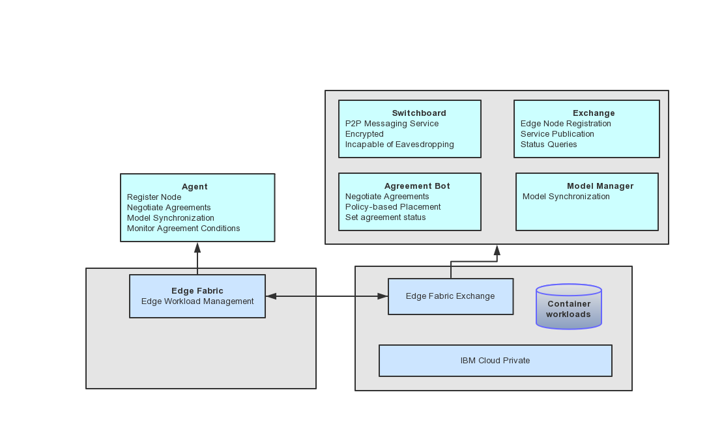
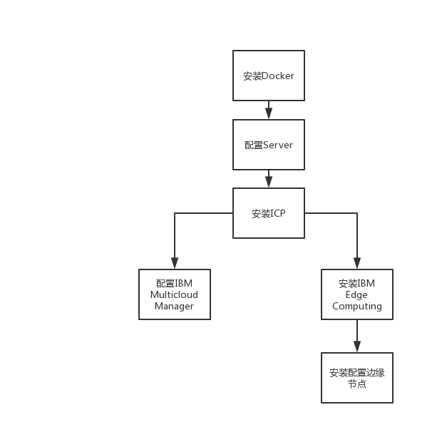
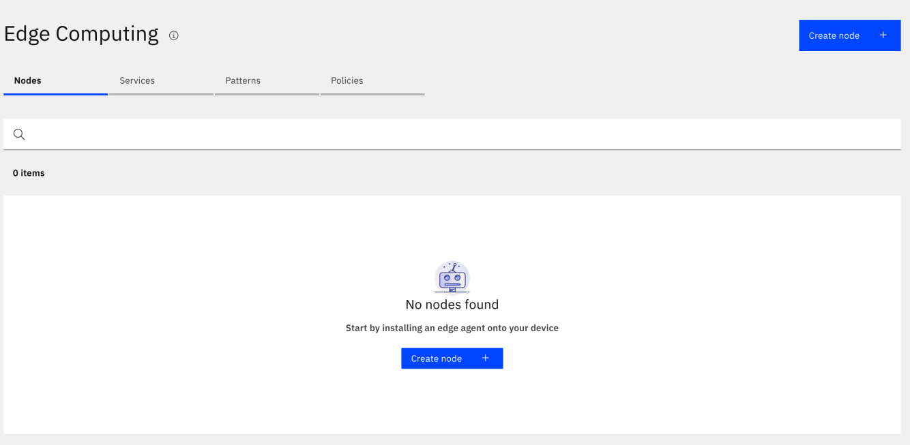
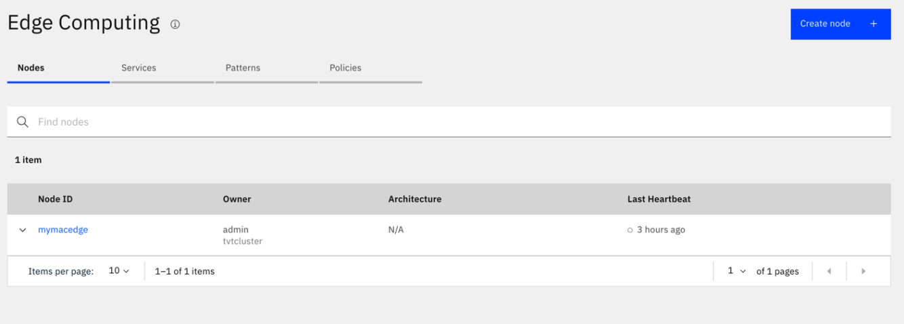

# 基于 ICP 的 IBM Edge Computing 的环境搭建
IBM Edge Computing 边缘节点的搭建

**标签:** 云计算,边缘计算

[原文链接](https://developer.ibm.com/zh/articles/cl-lo-icp-based-ibm-edge-computing-environment-setup/)

林 张瑜

发布: 2019-12-11

* * *

## 前言

### IBM Cloud Private 平台简介

IBM Cloud Private（简称 ICP），作为一个可以被企业用来开发和管理容器化的应用程序的集成平台，它基于 Docker 容器和 Kubernetes 技术，支持开发运维一体化，也即是 Devops，从而给客户提供理想的容器解决方案。它可以部署在 Openstack、VMWare 等 Iaas 云平台架构上，并且支持 x86、POWERLinux 及 zLinux 架构。企业可以通过 ICP 去构建、运行和管理相关的云应用。

ICP 主要包含两个主要组件，即容器管理器 Docker，以及容器编排器 Kubernetes。其他组件，例如提供授权、存储、网络、安全、日志、监视和警报、Helm、Catalog 以及集群管理控制台等，都是与以上两个主要组件共同配合工作的。同时，ICP 可以提供支持云计算的 IBM 中间件，对应用程序运行环境、数据库和数据分析服务，它可以基于 Cloud Foundry 开发和部署相关的应用程序，ICP 可以很好的满足开发者利用快速迭代的方法去部署以及实现企业的业务需求。总而言之，ICP 是私有容器即服务 (CaaS)、平台即服务 (PaaS) 和基础架构即服务 (IaaS) 云平台。

### IBM Edge Computing 产品介绍

边缘计算的概念是伴随着物联网的发展而衍生起来的。边缘计算是一种分散式运算的架构。在这种架构下，将应用程序、数据资料与服务的运算，由网络中心节点转交给网络上的各个边缘节点来处理。换句话说，边缘运算将原本完全由中心节点处理大型服务加以分解，切割成更小与更容易管理的部分，分散到边缘节点去处理。边缘计算旨在使你的工作更接近创建数据的位置，以及需要进行数据处理的位置。边缘计算将应用程序的处理工作从集中位置移动到远程位置，它的应用场景有工厂车间、仓库、配送中心、零售店、运输中心等。

### 边缘计算与云计算的区别

通俗的说，边缘计算可以看做是边缘大数据的处理计算，而云计算是集中式的大数据的处理计算。因为边缘计算不需要将数据传到遥远的云端，而是直接在边缘节点上进行处理计算，所以它更适合实时去进行数据的分析和智能化的处理，相比云计算，边缘计算更显得高效而且安全。进一步说，边缘计算是对云计算的一种补充和优化。

图 1\. 边缘计算与云计算



边缘计算主要有以下几个优势：

1. 可以使得设备的支持数量提升几个数量级，由于边缘计算距离更接近数据源端，在边缘节点就对大数据进行了分析和处理，因此它的 **效率更高，响应数据的时间也大大减少。**
2. 让计算变得 **更加智能化**，更加灵活和可控。
3. **成本更低。** 边缘计算的数据主要是在边缘节点处理，因此在网络传输、中心运算、中心存储、回传等各个环节，都能节省大量的服务器、存储、交换、带宽等等诸多成本。
4. **更易部署，更易管理。**
5. **安全性更高。** 由于计算分布在各个不同的边缘节点，就算某个边缘节点遭到数据损坏，也不影响其他的边缘节点和网络中心服务器。

### IBM Edge Computing

本文所提到的 IBM Edge Computing，指的就是 IBM Edge Computing for Devices。IBM Edge Computing 可以管理和分配所有物理设备上的工作负载，由中央 IBM Edge Hub 管理各个边缘设备与边缘服务器之间的通信。而这类设备只需要不到 1GB 的硬件容量，规模可达成千上万个。边缘计算应用也很广泛，例如，无人机、传感器、摄像头以及其他制造设备、零件等。

IBM Edge Computing 它是基于 open-horizon 这个开源平台的，它可以自动部署上千个容器化的边缘设备，不需要经过人工干预便能通过部署的规则和限制条件持续监控与管理这些边缘设备。IBM Edge Computing 支持 ARM、x86 CPU 和 Linux OS，每台设备占用的内存空间非常小（占约 30MB），可以实现多种容器化的工作，例如人工智能、分析、程序以及微服务。

图 2\. IBM Edge Computing 架构图



从图 2 中，可以看出 IBM Edge Computing 这个产品基于 Horizon 开发平台包含的几个主要组件，有 Agent、Switchboard、Exchange、Agreement Bot。

Agent 是在每个 Horizon 边缘节点上运行，以注册节点并执行 Edge Hub 为其设置的策略和服务。同时，服务器给每个边缘节点上的部署模式都分配了一个 Agreement Bot（简称 Agbot）进程。只要 Agbot 和 Agent 达成协议，它们就会合作管理相对应的边缘节点的整个软件生命周期。但是，Agent 并不与 Agbot 直接交互，而是需要通过 Horizon Switchboard 来为其建立 mailbox，并在 Horizon Exchange 中创建节点资源。每个边缘节点的 Agent 不断轮询 Horizon Switchboard，以查看邮箱中是否有任何消息。当 Agent 从 Agbot 收到提议时，它将根据边缘节点所有者在配置边缘节点时设置的策略来评估该提议，并选择是否接受该提议。接受部署模式建议后，Agent 会继续从 Docker Registry 中提取适当的服务容器，验证服务签名，配置服务并运行该服务。而且，Horizon Switchboard 和 Agbot 之间的数据通信都是经过加密的，即是这些数据是存储在 Horizon Switchboard 中，Horizon Switchboard 也无法解密这些数据。

Horizon Exchange 是这个架构里面的核心模块之一。不管是创建或者发布一个应用程序、Service 或 Policy 等，都是要通过 Exchange 这个模块，包括对边缘节点进行注册。对开发者来说，hzn exchange 这个命令已经包含了所有跟 Exchange 模块交互的操作。

比如，查询当前 exchange 版本信息：

```
$ hzn exchange version

```

Show moreShow more icon

查询当前 exchange 的状态信息：

```
$ hzn exchange status

```

Show moreShow more icon

## 环境的准备以及安装

### 环境要求

本文在 IBM Cloud Private 3.2.0 的平台上去搭建 IBM Edge Computing，是需要 Multi-node 的 cluster 环境去搭建。本文是采用最简化的一个环境，即是只需要搭建一个 Master node 和一个 Worker node，而没有 Proxy Node 和 Boot Node。其中 IBM Edge Computing 就需要部署在 Worker node 上。至于 ICP multi-node 的搭建的硬件要求，如表 1 所示。读者也可以参考 [ICP Knowledge Center 环境需求](https://www.ibm.com/support/knowledgecenter/SSBS6K_3.2.0/supported_system_config/hardware_reqs.html) 相关的文章。

表 1\. Multi-node cluster 环境需求

环境需求Master nodeWorker nodeCores8 or more2 or moreCPU>= 2.4 GHz>= 2.4 GHzRAM>=16 GB>=4 GBFree disk space to install>=300 GB>=150 GB

本文搭建 ICP 的 Master node 使用 Redhat 7.5 的环境。而 Worker node 使用 Ubuntu 16.04 的环境，是考虑到 IBM Edge Computing 基于 Horizon 平台，而 Horizon 目前只提供 Debian Linux 的安装版本，所以我们需要 Ubuntu 环境去安装。另外我们还需要一个环境作为 IBM Edge Computing 的边缘设备节点。

IBM Edge Computing 它支持的边缘设备节点系统有如下

1. Linux on ARM(32 位)：例如 Raspberry Pi
2. Linux on ARM(64 位)：例如 NVIDIA Jetson Nano、 TX1， 还有 TX2
3. Linux x86\_64 系统
4. IBM Power8 系统
5. Mac OS X

本文采用的是 Mac OS X 的环境去作为 IBM Edge Computing 的边缘设备节点。

在 IBM Cloud Private 的 Multi-node 环境上去搭建 IBM Edge Computing 产品，大致的安装过程如图 3 所示。

图 3\. 安装流程


### ICP Multi-node 环境搭建

本文所做的示例是最轻量级的，所以只准备一个 master node 和一个 worker node，如表 2 所示。

表 2\. master node 与 worker node

Node TypeIPHost Namemaster node9.112.229.50IEC-icpmasterworker node9.110.177.188IEC-unew

这里，将重点介绍一下本文需要用到这两个 Master node 和 Worker node 的一些参数是如何配置的。

首先，我们需要在 Master node 上安装 Docker for IBM Cloud Private。

```
$ chmod +x icp-docker-18.06.2_x86_64.bin
$ sudo ./icp-docker-18.06.2_x86_64.bin --install

```

Show moreShow more icon

在 Master node 上，需要配置/etc/hosts 这个文件，将 Master node 和 Worker node 这两个 IP 及其 Host name 添加到这个文件：

```
9.112.229.50 IEC-icpmaster
9.110.177.188 IEC-unew

```

Show moreShow more icon

然后，可以通过以下命令去创建 ssh key，从而建立这个 master node 与 worker node 之间的安全连接。本机 ICP 的安装路径定义在 /opt/ICP。

```
$ mkdir /opt/ICP
$ cd /opt/ICP
$ mkdir -p keys_dir
$ ssh-keygen -t rsa -f keys_dir/ssh_key -P ''

```

Show moreShow more icon

输入以下命令，就可将 ssh key 送到远程主机 worker node 上。

```
ssh-copy-id -i keys_dir/ssh_key root@9.110.177.188

```

Show moreShow more icon

登录到 hyc-cloud-private-release-docker-local 的 artifactory。接着我们可以使用 docker pull 将要安装的 ICP image 拉取出来。本文安装的 ICP 版本是 icp-inception:3.2.0 release 版本。

```
$ docker login -u w3EmailAddress -p ArtifactoryAPIKey hyc-cloud-private- release-docker-local.artifactory.swg-devops.com
$ docker pull hyc-cloud-private-release-docker-local.artifactory.swg-devops.com/ibmcom-amd64/icp-inception:3.2.0
$ docker run --rm -v $(pwd):/data -e LICENSE=accept hyc-cloud-private-release-docker-local.artifactory.swg-devops.com/ibmcom-amd64/icp-inception:3.2.0 cp -r cluster /data

```

Show moreShow more icon

通过执行以上的命令便会在 /opt/ICP/ 路径生成 cluster 文件夹，里面包含一些默认的安装配置文件。接下来，也是最重要的一个步骤，配置 /opt/ICP/cluster/config.yaml 这个文件，添加以下几个配置信息，便于安装 ICP。需要注意的是，default\_admin\_password 是自己设定的一组 32 位（只可以字母加数字的组合）密码；因为本文搭建的环境没有用到 Proxy node，所以 proxy\_lb\_address 和 cluster\_lb\_address 一样都是设置为 Master node 的 IP；image\_repo 是指需要下载的 ICP 版本所在的 repository，本文下载的 ICP 是 3.2.0 release 的版本，相应的信息也需要填写在 url 里：

```
default_admin_user: admin
default_admin_password: < password>
proxy_lb_address: 9.112.229.50
cluster_lb_address: 9.112.229.50

private_registry_enabled: true
image_repo: "hyc-cloud-private-release-docker-local.artifactory.swg-devops.com/ibmcom-amd64"
docker_username: < w3EmailAddress>
docker_password: < ArtifactoryAPIKey>

chart_repo:
addons:
    url: "https://na.artifactory.swg-devops.com/artifactory/ui/artifactactions/downloadfolder?repoKey=hyc-cloud-private-release-helm-local& path=3.2.0& archiveType=tgz& includeChecksumFiles=false"
    header: "X-JFrog-Art-Api: <ArtifactoryAPIKey> "

```

Show moreShow more icon

接着，编辑 /opt/ICP/cluster/hosts，添加 Master node、Proxy node 以及 Worker node 相对应的 IP 信息。

```
[master]
9.112.229.50

[worker]
9.110.177.188

[proxy]
9.112.229.50

```

Show moreShow more icon

待所有配置完成后，便可执行以下命令进行在线安装：

```
$ docker run -t --net=host -e LICENSE=accept -v $(pwd)/cluster:/installer/cluster hyc-cloud-private-release-docker-local.artifactory.swg-devops.com/ibmcom-amd64/icp-inception:3.2.0 install

```

Show moreShow more icon

完成安装以后，便可以通过浏览器，输入网址：`https://9.112.229.50:8443`，使用之前我们在 config.yaml 文件中定义的 default\_admin\_user 和 default\_admin\_password 属性值即可登录 ICP cluster。

### 部署 IBM Multi Cloud Manager

IBM Multi Cloud Manager 是一种 IBM 多云管理解决方案，它可以管理和监控 Kubernetes 集群，它通过仪表板界面给提供了用户可见性，以应用程序为中心的管理（策略、部署、运行状况、操作）以及跨云和集群的基于策略的合规性。

部署了 IBM Multi Cloud Manager 之后，你可以查询有关连接到系统的所有集群的信息。通过使用集群标签，你可以根据不同的云提供商、地理区域、数据中心和各个集群的功能用途来组织群集。在控制台中，你可以查看在这些群集中运行的 Pod、节点以及应用程序的运行状况。

IBM Multi Cloud Manager（简称为 MCM）的部署相对来说较为简单，实际上是 chart 的一种安装，该 chart 的详细介绍可以参考 [github ibm-mcm-chart 链接](https://github.ibm.com/IBMPrivateCloud/ibm-mcm-chart)。

以下是 MCM 的具体安装步骤。

1. 通过 ssh 连接到 worker node。


    ```
    $ ssh root@9. 110.177.188

    ```


    Show moreShow more icon

2. 使用 cloudctl 登录到之前部署的 ICP 上。


    ```
    $ cloudctl login -a https://9.112.229.50:8443 --skip-ssl-validation -u admin -p passwordforicp312passwordforicp3 -c "tvtcluster Account" -n kube-system
    Authenticating...
    OK

    Targeted account tvtcluster Account (id-tvtcluster-account)

    Targeted namespace kube-system

    Configuring kubectl ...
    Property "clusters.tvtcluster" unset.
    Property "users.tvtcluster-user" unset.
    Property "contexts.tvtcluster-context" unset.
    Cluster "tvtcluster" set.
    User "tvtcluster-user" set.
    Context "tvtcluster-context" created.
    Switched to context "tvtcluster-context".
    OK

    Configuring helm: /root/.helm
    OK

    ```


    Show moreShow more icon

3. 从 GitHub 上下载 ibm-mcm-chart。


    ```
    $ git clone https://github.ibm.com/IBMPrivateCloud/ibm-mcm-chart.git

    ```


    Show moreShow more icon

4. 通过 kubectl create secret docker-registry 命令去创建 MCM 的密钥。


    ```
    $ kubectl create secret docker-registry -n kube-system mcm-imagepull-regcred --docker-server=hyc-cloud-private-integration-docker-local.artifactory.swg-devops.com --docker-username=< w3emailaddress> --docker-password=< ArtifactoryAPIKey>

    ```


    Show moreShow more icon

5. 编辑 stable/ibm-mcm-prod/value.yaml 文件，更改 pullSecret 属性为 mcm-imagepull-regcred。
6. 最后，便可以执行 helm install 去安装 MCM。


    ```
    $ helm install stable/ibm-mcm-prod/ -n mcm --tls --namespace kube-system

    ```


    Show moreShow more icon


    ### 部署 IBM Edge Computing 以及配置


    完成了 ICP 和 MCM 的部署之后，接下来就可以在 Worker node 去安装 IBM Edge Computing 这个产品了，详细安装步骤也是可以参考 [IBM Edge Computing 产品链接](https://www.ibm.com/support/knowledgecenter/SSBS6K_3.2.0/supported_environments/edge_devices/edge_devices.html)。

IBM Edge Computing 这个产品安装相对比较容易。首先，将 IBM Edge Computing 的 UI 镜像 push 到 ICP 的私有镜像仓库中去。

```
EDGE_UI_TAG=$(ls edge-ui-amd64-docker-image_* | awk -F '_' '{print $NF}');
docker load -i edge-ui-amd64-docker-image_$EDGE_UI_TAG;
UI_IMAGE_TAG=$(kubectl --namespace=kube-system get secret platform-auth-secret -o jsonpath="{.metadata.annotations['certmanager\.k8s\.io/common-name']}"):8500/kube-system/edge-ui-amd64:$EDGE_UI_TAG;
docker tag edge-ui-amd64:$EDGE_UI_TAG $UI_IMAGE_TAG;
docker push $UI_IMAGE_TAG

```

Show moreShow more icon

最后，运行安装文件里提供的安装脚本，即可成功安装 IBM Edge Computing。在浏览器中输入网址：`https://9.112.229.50:8443/edge#/`，输入之前部署 ICP 的用户名和密码登录 ICP，在菜单栏选择 Add-ons -> Edge Computing 之后就会进入 Edge Computing 的页面，如下图所示。

图 4\. Edge Computing UI 界面



IBM Edge Computing 安装完成之后，需要做一些配置，包括对 horizon CLI 的安装、IBM Cloud Private 证书的下载、一些 service 样例的下载，以及验证 Exchange API 是否可以成功连接。具体步骤可以参考 IBM Edge Computing 产品 knowledge Center 链接的 Post installation configuration 部分。

## IBM Edge Computing 的边缘节点

### 什么是 Agent

IBM Edge Computing 的边缘节点中，最主要的一个组件就是 Agent。Agent 在 Horizon Exchange 中发布其公钥，并与远程 Agbot 进程进行协商以管理本地节点的软件。它负责将软件或者数据下载到边缘节点上，验证软件，然后运行软件并将其与边缘节点上的其他软件和硬件链接。每个 Agent 能且只能管理一个边缘节点，它除了运行自己所属的边缘节点之外没有其他任何权限。

也是由于各个 Agent 都是相对独立的，所以就算边缘节点上的 Agent 被黑客入侵或者受到其他方式的损害，而只会对该边缘节点造成影响，IBM Edge Computing 系统中其他的边缘节点和组件都均不受影响。

### 部署 Agent

可以拿来作为边缘节点的设备之前章节已经讨论过，可以是 Raspberry Pi、NVIDIA Jetson Nano、 Linux x86 系统，或者 Mac 等等。本文就用 Mac 作为边缘节点的设备去进行部署。

首先，需要在 Mac 机器上安装 Docker，具体的安装步骤可以参考 [Docker 官网](https://docs.docker.com/docker-for-mac/install/)。还需要安装 socat 以及 wget。

```
$ brew install socat
$ brew install wget

```

Show moreShow more icon

将 horizon-cli 证书安装到 Mac 机器上。

```
$ wget http://pkg.bluehorizon.network/macos/certs/horizon-cli.crt
$ sudo security add-trusted-cert -d -r trustRoot -k /Library/Keychains/System.keychain horizon-cli.crt

```

Show moreShow more icon

接下来，安装 Horizon CLI。从以下命令可以获取到针对 Mac 系统最新的安装包。

```
$ wget -q -O - http://pkg.bluehorizon.network/macos/testing

```

Show moreShow more icon

从以上命令获取到的 list 中选择你想要的版本去进行下载，比如 horizon-cli-2.23.29.pkg，执行以下命令，就可以将这个版本的安装包下载到本地当前的路径。

```
$ wget
                       http://pkg.bluehorizon.network/macos/testing/horizon-cli-2.23.29.pkg
                       --2019-09-29 13:50:03--
                       http://pkg.bluehorizon.network/macos/testing/horizon-cli-2.23.29.pkg
                       Resolving pkg.bluehorizon.network (pkg.bluehorizon.network)...
                       169.45.88.181 Connecting to pkg.bluehorizon.network
                       (pkg.bluehorizon.network)|169.45.88.181|:80... connected. HTTP
                       request sent, awaiting response... 200 OK Length: 8302164 (7.9M)
                       [application/octet-stream] Saving to: ‘horizon-cli-2.23.29.pkg’
                       horizon-cli-2.23.29.pkg
                       100%[=================================================================================================>]
                       7.92M 548KB/s in 52s 2019-09-29 13:50:55 (156 KB/s) -
                       ‘horizon-cli-2.23.29.pkg’ saved
                       [8302164/8302164]

```

Show moreShow more icon

下载完成以后，便可以进行安装：

```
$ hzn version
Horizon CLI version: 2.23.29
Horizon Agent version: 2.23.29

```

Show moreShow more icon

创建一个 API Key 用来做 Horizon Exchange 用户权限的认证。复制生成的 API Key 内容，将它设置为 HZN\_EXCHANGE\_USER\_AUTH 环境变量的值。

```
$ cloudctl iam api-key-create "testkey" -d "test"
Creating API key testkey as admin...
OK
API key testkey created

Please preserve the API key! It cannot be retrieved after it's created.

Name          testkey
Description   test
Bound To      crn:v1:icp:private:iam-identity:::IBMid:user:admin
Created At    2019-08-22T06:55+0000
API Key       E6yz-g3pG6zVcOzaIl6cNHedtEr3eiyHVwDgRO47QQVf

```

Show moreShow more icon

设置以下环境变量。其中 HZN\_ORG\_ID 是安装 ICP 时定义的 cluster name，我们可以用 curl -sk [https://9.112.229.50:8443/api/v1/config](https://9.112.229.50:8443/api/v1/config) \| jq -r .cluster\_ca\_domain 这个命令获取。

```
export HZN_ORG_ID='tvtcluster'
export HZN_EXCHANGE_USER_AUTH='iamapikey:E6yz-g3pG6zVcOzaIl6cNHedtEr3eiyHVwDgRO47QQVf'
export HZN_DEVICE_ID='mymacedge'
export HZN_DEVICE_TOKEN='mytoken'
export HZN_EXCHANGE_NODE_AUTH='mymacedge:mytoken'
export HZN_EXCHANGE_URL=https://9.112.229.50:8443/ec-exchange/v1

```

Show moreShow more icon

编辑 /etc/horizon/hzn.json，把对应的网址更改成目前 ICP 的地址。

```
{
"HZN_EXCHANGE_URL": "https://9.112.229.50:8443/ec-exchange/v1",
"HZN_FSS_CSSURL": "https://9.112.229.50:8443/css/"
}

```

Show moreShow more icon

执行以下命令去创建这个边缘节点。

```
$ hzn exchange node create -n $HZN_EXCHANGE_NODE_AUTH

```

Show moreShow more icon

注册该边缘节点。

```
$ hzn register -v -p IBM/pattern-ibm.helloworld
[verbose] Reading configuration file: /usr/local/etc/horizon/hzn.json
[verbose] Reading configuration file: /etc/default/horizon
[verbose] Config file does not exist: /Users/zhyulin/.hzn/hzn.json.
[verbose] No project level configuration file found.
[verbose] GET http://localhost:8081/status
[verbose] HTTP code: 200
[verbose] The exchange url: https://9.112.229.50:8443/ec-exchange/v1
Warning: cli is configured with exchange url https://9.112.229.50:8443/ec-exchange/v1, and the agent is configured with exchange url https://9.112.229.50:8443/ec-exchange/v1/. This may cause enexpected behavior. Please update /etc/default/horizon and run 'service horizon restart'.
[verbose] GET https://9.112.229.50:8443/ec-exchange/v1/orgs/tvtcluster/nodes/mymacedge
[verbose] HTTP code: 200
Node tvtcluster/mymacedge exists in the exchange
Initializing the Horizon node...
[verbose] POST http://localhost:8081/node
[verbose] HTTP code: 201
Warning: no input file was specified. This is only valid if none of the services need variables set (including GPS coordinates).
Changing Horizon state to configured to register this node with Horizon...
[verbose] PUT http://localhost:8081/node/configstate
[verbose] HTTP code: 201
Horizon node is registered. Workload agreement negotiation should begin shortly. Run 'hzn agreement list' to view.

```

Show moreShow more icon

我们可以通过以下命令去验证该节是否成功注册到 Edge Hub 中去。

```
$ hzn node list
{
"id": "mymacedge",
"organization": "tvtcluster",
"pattern": "IBM/pattern-ibm.helloworld",
"name": "mymacedge",
"token_last_valid_time": "2019-09-29 16:04:56 +0800 CST",
"token_valid": true,
"ha": false,
"configstate": {
    "state": "configured",
    "last_update_time": "2019-09-29 16:04:57 +0800 CST"
},
"configuration": {
    "exchange_api": "https://9.112.229.50:8443/ec-exchange/v1/",
    "exchange_version": "1.100.0",
    "required_minimum_exchange_version": "1.98.0",
    "preferred_exchange_version": "1.98.0",
    "mms_api": "https://9.112.229.50:8443/ec-css",
    "architecture": "amd64",
    "horizon_version": "2.23.13"
},
"connectivity": {
    "firmware.bluehorizon.network": true,
    "images.bluehorizon.network": true
}
}

```

Show moreShow more icon

Node 注册成功后，可以刷新网页的链接，可以看到在 Nodes 页面多了一个刚注册的 mymacedge 节点。如图 5 所示。当然，节点注册成功之后，开发者可以去给节点创建自己需要的 Service 以及相应的 Policy，以实现想要达到的功能。大量的节点部署，在节点设备就把所要的数据信息给处理完成，呈现给服务器，这就是 Edge Computing 要做到的事情。

图 5\. IBM Edge Computing Node



## 结束语

本文基于 IBM Cloud Private 平台上搭建 IBM Edge Computing 的环境，无需太多繁琐的系统和软件环境的安装，基于 Docker 容器轻松搭建出 IBM Edge Computing 的边缘节点。