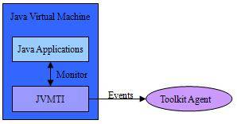
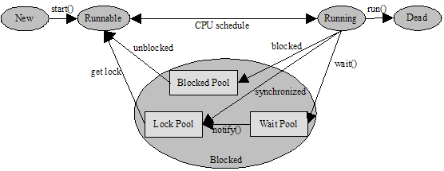
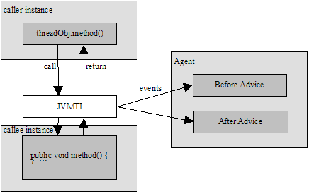
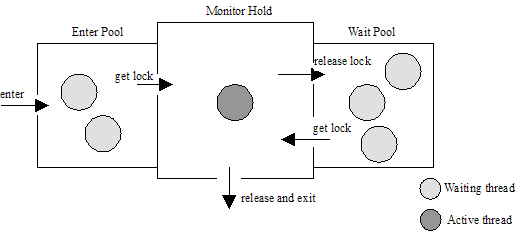

# 基于 JVMTI 实现 Java 线程的监控
深入分析了 JVM 中的 Java 线程模型

**标签:** Java

[原文链接](https://developer.ibm.com/zh/articles/j-lo-jvmti/)

李凌

发布: 2009-12-10

* * *

## JVMTI 工具接口

随着多核 CPU 技术的发展，多线程编程技术被广泛地应用，从而充分发挥整个系统的性能。Java 语言对多线程编程提供了语言级的支持，可以方便地创建、运行、销毁线程。然而，多线程的使用也给应用程序开发人员带来了巨大的挑战，不正确地使用多线程可能造成线程死锁或资源竞争，导致系统瘫痪。

为了帮助 Java 开发人员诊断和跟踪 Java 线程状态的切换，Sun 公司在 Java 开发工具包（Java2 Software Development Kit, JDK）1.5.0 版本中引进了 Java 虚拟机工具接口（Java Virtual Machine Toolkit Interface，JVMTI），用于替代在先前的 JDK 版本中作为试验功能存在的 Java 虚拟机剖析接口（Java Virtual Machine Profiling Interface，JVMPI）和 Java 虚拟机调试接口（Java Virtual Machine Debugging Interface，JVMDI）。通过 JVMTI 接口可以创建代理程序（Agent）以监视和控制 Java 应用程序，包括剖析、调试、监控、分析线程等等，其架构模型如图 1 所示。

##### 图 1\. JVMTI 架构模型



Agent 可以向运行中的虚拟机实例订阅感兴趣的事件，当这些事件发生的时候，会以事件回调函数的方式激活代理程序，同时 JVMTI 提供了众多的功能函数，以查询和控制 Java 应用程序的运行状态。Agent 通过 JVMTI 所提供的接口与虚拟机进行通信，并同步监控虚拟机的运行状态，它与运行中的 Java 应用程序是相对独立的，不会干扰程序的正常运行。Agent 可以用任何支持 C 语言标准的本地语言来编写，并以动态链接库的方式存在；Java 程序启动的时候可以加载这个动态链接库。

基于 JVMTI 接口构建的 Agent 可以方便地实现对 Java 线程状态切换的跟踪，从而使开发人员能够在运行时清楚地了解多线程应用程序中线程的工作情况，方便进行调试和除错。本文后续部分将介绍如何基于 JVMTI 接口构建 Java 线程切换监控代理。

## Java 线程模型

要对 Java 线程的切换进行监控，必须先了解 JVM 中的 Java 线程模型。Java 线程模型可以用图 2 所示的 Java 线程生命周期来描述。Java 线程的生命周期包括创建，就绪，运行，阻塞，死亡 5 个状态。一个 Java 线程总是处于这 5 个生命周期状态之一，并在一定条件下可以在不同状态之间进行转换 。

##### 图 2\. Java 线程模型



- 创建状态 (New Thread)

    在 Java 语言中使用 new 操作符创建一个线程后，该线程仅仅是一个空对象，它具备了线程的一些特征，但此时系统没有为其分配资源，这时的线程处于创建状态。

- 就绪状态 (Runnable)

    使用 start() 方法启动一个线程后，系统为该线程分配了除 CPU 外的所需资源，使该线程处于就绪状态。此外，如果某个线程执行了 yield() 方法，那么该线程会被暂时剥夺 CPU 资源，重新进入就绪状态。

- 运行状态 (Running)

    Java 运行系统通过调度选中一个处于就绪状态的线程，使其占有 CPU 并转为运行状态。此时，系统真正执行线程的 run() 方法。

- 阻塞状态 (Blocked)

    一个正在运行的线程因某些原因不能继续运行时，它就进入阻塞状态。这些原因包括：当执行了某个线程对象的 suspend()、sleep() 等阻塞类型的方法时，该线程对象会被置入一个阻塞集（Blocked Pool）内，等待被唤醒（执行 resume() 方法）或是因为超时而时自动苏醒；当多个线程试图进入某个同步区域（synchronized）时，没能进入该同步区域的线程会被置入锁定集（Lock Pool），直到获得该同步区域的锁，进入就绪状态；当线程执行了某个对象的 wait() 方法时，线程会被置入该对象的等待集（Wait Pool）中，直到执行了该对象的 notify() 方法，wait()/notify() 方法的执行要求线程首先获取到该对象的锁。

- 死亡状态 (Dead)

    线程在 run() 方法执行结束后进入死亡状态。此外，如果线程执行了 interrupt() 或 stop() 方法，那么它也会以异常退出的方式进入死亡状态。


## Java 线程切换的上下文信息

通过对 Java 线程模型的分析，可以将 Java 线程切换所涉及的上下文信息分为显式线程切换信息和隐式线程切换信息。在 Java 线程切换时通过 JVMTI 接口捕获线程切换的上下文信息，即可实现对 Java 线程切换的监控。

- 显式线程切换信息

    显式线程切换是指一个线程对象显式地对另一个线程对象进行操作（调用线程方法），使目标线程的状态发生变换；其上下文信息可以用三元组 < 操作线程，动作，被操作线程 \> 来描述。例如，Java 线程的启动上下文就可以描述为 <thread-caller, start, thread-callee>。从 Java 线程模型可知，Java 中线程的创建是通过派生 Thread 类或 Runnable 接口来实现的，并通过调用 Thread 类中的 start() 方法来启动新建立的线程对象；因此，通过监控 start() 方法的调用，并结合对 Java 方法调用堆栈的分析，就可以分析出线程启动的上下文信息。根据 Java 线程模型可知，显式线程切换共涉及到 start()、interrupt()、join()、resume()、suspend()、sleep()、yield() 和 stop() 这几个线程方法。

- 隐式线程切换信息

    在某些情况下，线程的切换并不是通过线程之间直接调用线程方法进行的，而是通过线程间通信的方式进行。这种由线程间通信产生的上下文信息，称之为隐式线程切换信息。一个典型的例子就是 Java 线程池。通常，线程池内存储了若干个预先创建好的线程，这项线程处于阻塞状态，并不处理任务；当某个任务到来的时候，负责任务调度的线程会唤醒线程池中某个处于阻塞状态的空闲线程处理这个任务；一旦任务完成，执行该任务的线程不会被撤销，而是继续处于阻塞状态，并被重新置回线程池中，等待下一次调度。虽然 Java 线程池的实现方式不尽相同，但究其本质都是通过 Java 中 Object 类的线程通信原语 wait() 和 notify()/notifyAll() 方法来实现的。wait() 方法会使线程在指定目标上等待，而 notify() 方法则使等待在指定目标上的某个线程苏醒，具体哪个线程真正被唤醒取决于虚拟机的实现方式， notifyAll() 方法则是使所有的线程都苏醒。隐式线程切换信息同样可以用三元组 < 操作线程，动作，被操作线程 > 来描述，但该三元组的确立比显式线程切换要复杂，需要通过分析线程通信原语执行的上下文信息来得到。


下一节将介绍如何获取线程切换的上下文信息。

## Java 线程切换的监控模型

根据 Java 线程切换机制设计的 Java 线程监控模型如图 3 所示。线程监控代理 Agent 通过 JVMTI 在方法调用者和被调用者之间注册一个事件监听器，用于监听线程切换事件（即引起线程切换的方法调用）。当某个线程方法即将被调用的时候，监听器发送方法进入事件（Method Entry）到 Agent 的 Before Advice 回调方法；当某个线程方法返回的时候，监听器发送方法返回（Method Exit）事件到 Agent 的 After Advice 回调方法。Before Advice 和 After Advice 分别负责处理线程方法调用前的线程状态和线程方法调用后的线程状态。这样，线程监控代理就能够监控到 Java 线程的状态切换情况。

##### 图 3\. Java 线程监控模型



**_获取显式线程切换的上下文信息_**

在 Java 方法调用发生的时候，通过 JVMTI 接口能够很轻易的获取到方法名称和执行该方法的线程标识。因此，确定线程切换上下文三元组 < 操作线程，动作，被操作线程 > 的关键在于，如何获取被操作线程对象标识，而这需要对 Java 方法的调用机制进行分析。

每当启动一个新线程的时候，Java 虚拟机会为它分配一个 Java 栈。Java 栈以帧（Frame）为单位保存线程的运行状态。虚拟机只会对 Java 栈执行两种操作：以帧为单位的入栈和出栈。

当线程调用一个 Java 方法时，虚拟机会在该线程所在的 Java 栈压入一个新的栈帧（Stack Frame），用于存储该 Java 方法的地址；该方法被称为当前方法，该栈帧被成为当前栈帧。栈帧通常由局部变量区、操作数栈和帧数据区组成。在执行当前方法时，它使用当前栈帧来存储参数、局部变量、中间运算结果等等数据。栈帧在方法调用的时候被创建，并在方法完成的时候销毁。

通过对栈帧的进一步研究发现，当一个对象的某个实例方法执行时，Java 虚拟机会隐式地在该方法的当前栈帧的局部变量区加入一个指向该对象的引用。尽管在方法源代码中并没有显式声明这个参数，但这个参数对于任何一个实例方法都是由 JVM 隐含加入的，而且它始终在局部变量区的首位。局部变量区是根据索引进行寻址的，第一个局部变量的索引是 0，因此可以使用局部变量区索引 0 的方式来访问这个对象引用，如表 1 所示。

##### 表 1\. 局部变量区

索引参数0对象引用1局部变量 12局部变量 2…………

如此一来，当被操作线程对象执行某个线程方法的时候，可以通过分析当前操作线程的当前栈帧的本地方法区获取到被操作线程对象的引用。这样，就可以完整地确定显式线程切换的三元组 < 操作线程，动作，被操作线程 \> 信息。

需要注意的是，有一些线程方法，例如 sleep() 和 yield() 方法，它们是作为本地方法（Native Method）来实现的，它们在被调用的过程中不会生成 Java 栈中的当前方法帧，而是将信息保存在本地方法栈（Native Stack）内。因此，对这些方法引起的线程切换不能直接采用上述分析方法，而是应该分析本地方法栈。

**_获取隐式线程切换的上下文信息_**

类似的，获取隐式线程切换上下文信息的关键也是确定三元组 < 操作线程，动作，被操作线程 \> 中的被操作线程对象标识，而这需要对 Java 线程的同步机制进行分析。

Java 使用名为监视器（Monitor）的同步机制来调节多个线程的活动和共享数据，如图 4 所示。Java 中，每个对象都对应一个监视器，即使在多线程的情况下，该监视器监视的区域同一时间只会被一个线程执行。一个线程想要执行监视区域的代码，唯一的途径就是获得该区域对应的监视器。当一个线程到达了一个监视区域的开始处（Entry Point），它就会被置入该监视器的请求集（Entry Pool）。如果此时没有其他线程在请求集中等待，并且也没有其它线程正持有该监视器（Monitor Hold），那么该线程就可以获得监视器，并继续执行监视区域中的代码。当这个线程执行完监视区域代码后，它就会退出并释放该监视器（Release Monitor）。如果线程在执行监视区域代码的过程中，执行了 wait() 方法，那么该线程会暂时释放该监视器，并被置入等待集（Wait Pool），等待被唤醒；如果线程在这个过程中执行了 notify() 方法，那么在等待集中的某个线程就会被标记为即将苏醒，这个即将苏醒的线程将在某个监视器空闲的时刻获取该监视器，并执行该监视区域代码，具体哪个线程被唤醒视虚拟机的实现方式而定。notifyAll() 方法会将等待集中的所有线程标记为即将苏醒，并接受虚拟机的调度。一个线程只有在它已经持有监视器时才能执行 wait() 方法，并且它只能通过再次成为监视器的持有者才能离开等待集。

##### 图 4\. Java 线程的同步机制



根据上述对 Java 线程同步机制的分析，如果能够在执行 wait()/notify()/notifyAll() 方法的前后分别获取其监视器等待集的状态快照并加以比较，就可以得出是哪个或者是哪些线程被唤醒，而这些线程就是这次隐式线程切换的被操作线程。这样，就可以确定线程切换的三元组 < 操作线程，动作，被操作线程 > 信息。

此外，由于一个线程可能同时拥有多个对象监视器，因此必须对每个监视器上的等待集进行分析，以确定当前执行的 wait()/notify()/notifyAll() 方法所真正作用的监视器。

## 实现 Java 线程监控代理

本节介绍了如何依据 Java 线程切换监控模型，实现 Java 线程监控代理（Agent）。

线程监控代理是一个基于 JVMTI 的 C 语言实现，它可以从虚拟机运行时实例中捕获运行中的 Java 应用程序的线程切换信息，同时不影响该程序的运行。

### 初始化监控代理

首先，监控代理必须包括一个 JVMTI 的头文件，主要代码片段如清单 1 所示。该头文件包含 JVMTI 必须的一些定义，通常它存在于 JDK 安装目录的 include 目录下。

其次，需要对代理进行初始化，这个工作由 Agent\_OnLoad() 方法完成。这个方法主要用于在初始化 Java 虚拟机之前设置所需的功能（Capabilities）、注册事件通知（Event Notification）和指定事件回调函数（Callback Method）。其中，GetEnv() 方法用于获取当前的虚拟机运行环境；AddCapabilities() 方法用于设置线程监控代理所需要的功能，包括方法的调用和返回事件、访问方法局部变量、获取对象或线程拥有的监视器信息；SetEventNotificationMode() 方法用于捕获每个实例方法的调用和返回的事件通知；SetEventCallbacks() 方法用于注册相应的方法进入回调函数和方法退出回调函数。

##### 清单 1\. 初始化 Agent

```
include "jvmti.h"
JNIEXPORT jint JNICALL Agent_OnLoad(JavaVM *jvm, char *options, void *reserved) {
    jvm->GetEnv((void **) &gb_jvmti, JVMTI_VERSION_1_0);

    gb_capa.can_generate_method_exit_events = 1;
    gb_capa.can_access_local_variables=1;
    gb_capa.can_get_monitor_info=1;
    gb_jvmti->AddCapabilities(&gb_capa);

    callbacks.MethodEntry = &callbackMethodEntry;
    callbacks.MethodExit = &callbackMethodExit;
    gb_jvmti->SetEventCallbacks(&callbacks, sizeof(callbacks));

    gb_jvmti->SetEventNotificationMode(JVMTI_ENABLE,JVMTI_EVENT_METHOD_ENTRY,NULL);
    gb_jvmti->SetEventNotificationMode(JVMTI_ENABLE,JVMTI_EVENT_METHOD_EXIT,NULL);
    return JNI_OK;
}

```

Show moreShow more icon

### 监控显式线程切换

显式线程切换的监控通过 callbackMethodEntry() 回调方法完成，主要代码片段如清单 2 所示。该回调方法使用 RawMonitorEntry() 和 RawMonitorExit() 方法设定原始监视器的监视区域，监视引起显式线程切换的线程方法，例如 start()、interrupt()、join()、resume() 等。

当上述某个线程方法即将被调用时，先用 GetObjectHashCode() 方法计算当前操作线程的哈希值，籍此唯一标识这个线程对象；然后使用 GetLocalObject() 方法获取操作线程 Java 栈中当前方法帧的对象引用，这个引用指向了被操作线程对象。这样就可以获得一个显式线程切换的上下文信息，可以被描述为：<thread-a, start, thread-b>、<thread-b, resume, thread-c> 等等。

##### 清单 2\. 监控显式线程切换

```
static void JNICALL callbackMethodEntry(jvmtiEnv *jvmti_env, JNIEnv* env,
jthread thr, jmethodID method) {
    gb_jvmti->RawMonitorEnter(gb_lock);
    if (strcmp(name,"start")==0||strcmp(name,"interrupt")==0||
        strcmp(name,"join")==0||strcmp(name,"stop")==0||
        strcmp(name,"suspend")==0||strcmp(name,"resume")==0){
        gb_jvmti->GetLocalObject(thr,0,0,&thd_ptr);
        gb_jvmti->GetObjectHashCode(thd_ptr, &hash_code);
    }
    gb_jvmti->RawMonitorExit(gb_lock);
}

```

Show moreShow more icon

### 监控隐式线程切换

隐式线程切换的监控通过捕获 wait()/notify()/notifyAll() 方法调用前和调用后的等待集信息来实现。

以 notify() 方法为例，当 notify() 方法即将被调用时，在 callbackMethodEntry() 方法中首先使用 GetOwnedMonitorInfo() 方法获取当前操作线程所拥有的监视器，然后用 GetObjectMonitorUsage() 方法获取每个监视器上等待的线程对象，并将它们保存在隐式线程切换信息链表中等待分析，主要代码片段如清单 3 所示。

##### 清单 3\. 获取 notify 方法调用前的等待集

```
static void JNICALL callbackMethodEntry(jvmtiEnv *jvmti_env, JNIEnv* env,
jthread thr, jmethodID method){
    if(strcmp(name,"notify")==0||strcmp(name,"notifyAll")==0) {
        gb_jvmti->GetOwnedMonitorInfo(thr,&owned_monitor_count,&owned_monitors_ptr);
        for(int index=0;index<owned_monitor_count;index++){
            jvmtiMonitorUsage *info_ptr=NULL;
            info_ptr=(jvmtiMonitorUsage*)malloc(sizeof(jvmtiMonitorUsage));
            gb_jvmti->GetObjectMonitorUsage(*(owned_monitors_ptr+index),info_ptr);
            insertElem(&inf_head,&inf_tail,info_ptr);
        }
    }
}

```

Show moreShow more icon

当 notify() 方法即将完成调用时，在 callbackMethodExit() 方法中，同样获取当前操作线程的等待集（notify\_waiters），然后与之前记录的等待集进行比较，其中有差异的对象即为被操作线程对象。这样就能确定隐式线程切换的上下文信息，它可以被描述为：<thread-a, notify, thread-b>。其主要代码片段如清单 4 所示。

##### 清单 4\. 分析 notify 方法调用前后的等待集

```
static void JNICALL callbackMethodExit(jvmtiEnv *jvmti_env, JNIEnv* env,
jthread thr, jmethodID method){
    //compare the two wait pools
    if(info_ptr->notify_waiter_count!=inf_head->info_ptr->notify_waiter_count){
        for(int i=0;i<inf_head->info_ptr->notify_waiter_count;i++){
            for(int j=0;j<info_ptr->notify_waiter_count;j++){
                if(inf_head->info_ptr->notify_waiters+i!=info_ptr->notify_waiters+j){
                    isObj=false;
                    break;
                }
            }
            if(isObj==true) {
                GetObjectHashCode(*(inf_head->info_ptr->notify_waiters+i), &hash_code);
                insertElem(&ctx_head,&ctx_tail,thr_hash_code,hash_code,name);
            }
        }
    }
}

```

Show moreShow more icon

## 测试监控代理

线程监控代理可以用任何 C 语言编译器编译，并以动态连接库的形式加载到 Java 虚拟机中，监控正在运行的 Java 程序。使用下列命令行加载代理库并运行目标 Java 应用程序：

```
java -agentlib:ThreadMonitor JavaThreadPoolApp

```

Show moreShow more icon

或者：

```
java -agentpath:/<Path>/ThreadMonitor JavaThreadPoolApp

```

Show moreShow more icon

为了演示对线程切换的监控，JavaThreadPoolApp 这个样例程序实现了一个 Java 线程池，其中涉及到大量的线程状态的切换。这个应用启动的时候会初始化一个线程池，池内初始化两个子线程，并让它们处于 wait 状态；当有客户端程序需要使用线程池中的某个线程时，使用 notify 将池内的某个线程唤醒；使用完毕后，该线程重新进入 wait 状态等待下一次调度。这些线程切换活动都可以被监控代理所监控，并产生如下输出。结合应用程序的相关信息，可以进一步得出 JavaThreadPoolApp 客户端应用程序使用了线程池中的 Thread-60934352 线程并执行了 3068 毫秒。

```
Thread-32452561, start, Thread-60934352
Thread-32452561, start, Thread-89877242
Thread-60934352, wait, Thread-60934352, active 8 ms
Thread-89877242, wait, Thread-89877242, active 9 ms
Thread-32452561, notify, Thread-60934352
Thread-60934352, wait, Thread-60934352, active 3068 ms

```

Show moreShow more icon

使用线程监控代理可以实时监控 JVM 中线程运行情况，帮助开发人员诊断多线程应用中可能存在的线程调度问题。

## 结束语

多线程应用程序的开发存在着诸多挑战，例如线程死锁、资源竞争等。因此，开发人员需要一种运行时线程监控工具来协助诊断和跟踪 Java 线程状态的切换。Sun 公司在 JDK 1.5.0 版本中引进了 JVMTI 接口用于实时监控和分析 JVM 运行状态。

本文首先介绍了 JVMTI接口；然后详细分析了 Java 线程模型，并提出了 Java 线程的监控模型；最后基于 JVMTI 接口实现了 Java 线程监控代理，以协助诊断多线程应用中可能存在的线程调度问题。

## 下载示例代码

[TMonDemo913.zip](http://www.ibm.com/developerworks/cn/java/j-lo-jvmti/TMonDemo913.zip): 样例代码