# 基于 Jenkins 快速搭建持续集成环境
从持续集成的基本概念入手，通过具体实例介绍了如何基于 Jenkins 快速搭建持续集成环境

**标签:** Java

[原文链接](https://developer.ibm.com/zh/articles/j-lo-jenkins/)

刘华婷

发布: 2011-11-24

* * *

## 持续集成概述

### 什么是持续集成

随着软件开发复杂度的不断提高，团队开发成员间如何更好地协同工作以确保软件开发的质量已经慢慢成为开发过程中不可回避的问题。尤其是近些年来，敏捷（Agile） 在软件工程领域越来越红火，如何能再不断变化的需求中快速适应和保证软件的质量也显得尤其的重要。

持续集成正是针对这一类问题的一种软件开发实践。它倡导团队开发成员必须经常集成他们的工作，甚至每天都可能发生多次集成。而每次的集成都是通过自动化的构建来验证，包括自动编译、发布和测试，从而尽快地发现集成错误，让团队能够更快的开发内聚的软件。

持续集成的核心价值在于：

1. 持续集成中的任何一个环节都是自动完成的，无需太多的人工干预，有利于减少重复过程以节省时间、费用和工作量；
2. 持续集成保障了每个时间点上团队成员提交的代码是能成功集成的。换言之，任何时间点都能第一时间发现软件的集成问题，使任意时间发布可部署的软件成为了可能；
3. 持续集成还能利于软件本身的发展趋势，这点在需求不明确或是频繁性变更的情景中尤其重要，持续集成的质量能帮助团队进行有效决策，同时建立团队对开发产品的信心。

### 持续集成的原则

业界普遍认同的持续集成的原则包括：

1）需要版本控制软件保障团队成员提交的代码不会导致集成失败。常用的版本控制软件有 IBM Rational ClearCase、CVS、Subversion 等；

2）开发人员必须及时向版本控制库中提交代码，也必须经常性地从版本控制库中更新代码到本地；

3）需要有专门的集成服务器来执行集成构建。根据项目的具体实际，集成构建可以被软件的修改来直接触发，也可以定时启动，如每半个小时构建一次；

4）必须保证构建的成功。如果构建失败，修复构建过程中的错误是优先级最高的工作。一旦修复，需要手动启动一次构建。

### 持续集成系统的组成

由此可见，一个完整的构建系统必须包括：

1. 一个自动构建过程，包括自动编译、分发、部署和测试等。
2. 一个代码存储库，即需要版本控制软件来保障代码的可维护性，同时作为构建过程的素材库。
3. 一个持续集成服务器。本文中介绍的 Jenkins 就是一个配置简单和使用方便的持续集成服务器。

## Jenkins 简介

Jenkins 是一个开源项目，提供了一种易于使用的持续集成系统，使开发者从繁杂的集成中解脱出来，专注于更为重要的业务逻辑实现上。同时 Jenkins 能实施监控集成中存在的错误，提供详细的日志文件和提醒功能，还能用图表的形式形象地展示项目构建的趋势和稳定性。下面将介绍 Jenkins 的基本功能。

Jenkins 的安装非常简单，只需要从 Jenkins 的主页上下载最新的 jenkins.war 文件然后运行 java -jar jenkins.war。同时，还可以点击 Jenkins 页面上的 launch 按钮完成下载和运行 Jenkins。

##### 图 1\. Jenkins Launch 按钮

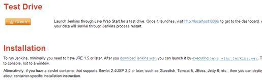

启动 Jenkins 后，会有一个后台进程在命令行模式下运行。此时在浏览器地址栏中打开 `http://localhost:8080` 就可以看到 Jenkins 的页面了。Jenkins 的可贵之处在于具有非常高的可用性，从它的界面中能很轻松地完成各种配置，更多的配置和使用信息，可以在 Jenkins 的官方网站上查询。

##### 图 2\. 命令行模式下运行 Jenkins

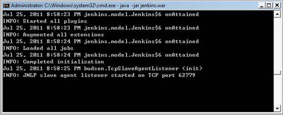

##### 图 3\. Jenkins 主界面

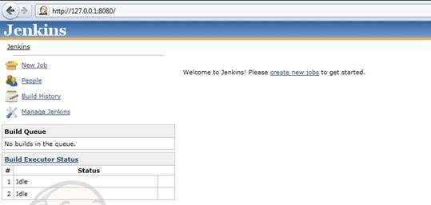

非常有趣的是，Jenkins 还提供了非常丰富的插件支持，这使得 Jenkins 变得越来越强大。我们可以方便的安装各种第三方插件，从而方便快捷的集成第三方的应用。比如 Jenkins 提供了对于 IBM Rational ClearCase 的插件支持。

##### 图 4\. Jenkins 可以集成 ClearCase 插件

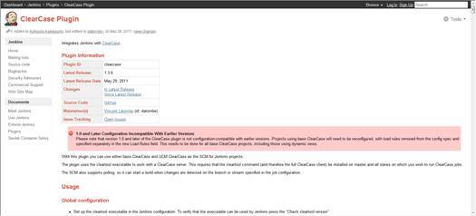

此外，Jenkins 提供了丰富的管理和配置的功能，包括系统配置、管理插件、查看系统信息、系统日志、节点管理、Jenkins 命令行窗口、信息统计等功能。试试看，您就会发现 Jenkins 非常好上手使用。

##### 图 5\. Jenkins 提供了丰富的管理功能

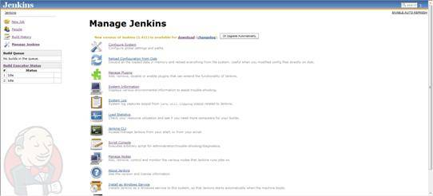

## 基于 Jenkins 快速搭建持续集成环境

正如前文中所描述的那样，一个持续集成环境需要包括三个方面要素：代码存储库、构建过程和持续集成服务器。对 Jenkins 有了初步了解后，我们通过一个实例来集中展示如何快速搭建一个简单的基于 Jenkins 的持续集成环境。

假设我们使用的代码存储库是 IBM Rational ClearCase。Jenkins 提供了对 ClearCase 的插件支持，它能方便地让我们连接到 Base ClearCase 或者 UCM ClearCase，使其成为 Jenkins Project 的代码控制器。另外，这个插件是基于 cleartool 命令的，所以必须在 Jenkins 的持续集成服务器上安装 ClearCase 的客户端程序。

在 Jenkins 的插件管理界面中选择 ClearCase Plugin，点击页面下方的 Install 按钮。

##### 图 6\. 选择 ClearCase 插件

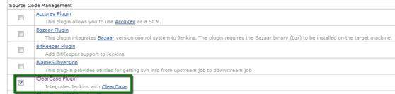

在打开的页面中提示安装完成后，Jenkins 需要重新启动来激活这个插件。重新执行 java -jar Jenkins.war 后，在 Jenkins 的页面中，我们就能看到 ClearCase plugin 已经被安装到 Jenkins 了。

##### 图 7\. ClearCase 插件安装成功

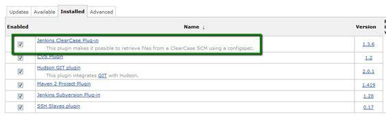

类似 IBM Rational ClearCase，SVN（subversion）是目前比较流行的版本管理工具。很多开源软件都是用 SVN 作为代码版本管理软件。为了让实例更具有代表性，本文中我们使用 SVN 作为代码存储器。

接下来，我们开始新建一个 Jenkins 项目， 由于我们需要连接 SVN 的代码存储器， 我们选择 Build a free-style software project。

##### 图 8\. 新建 JenkinsTest Job

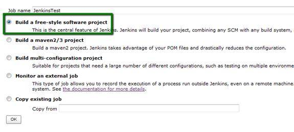

然后我们就可以很方便的配置这个 JenkinsTest 项目了。Jenkins 很人性化的一点是在每个配置项的右侧都有一个帮助的图标，点击这个图标，Jenkins 会告诉您如何配置这个配置项。

##### 图 9\. 配置 JenkinsTest

根据实际的 SVN 服务器服务器信息配置 Source Code Management，这能让 Jenkins 知道如何从哪里获取最新的代码。本例中假设 Repository 就在本地。

##### 图 10\. 配置连接到 SVN 服务器

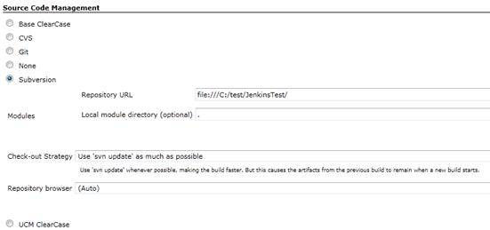

根据开发需要，假设每一个小时我们需要重新构建一次。选择 Build periodically，在 Schedule 中填写 0 。

第一个参数代表的是分钟 minute，取值 0~59；

第二个参数代表的是小时 hour，取值 0~23；

第三个参数代表的是天 day，取值 1~31；

第四个参数代表的是月 month，取值 1~12；

最后一个参数代表的是星期 week，取值 0~7，0 和 7 都是表示星期天。

所以 0  表示的就是每个小时的第 0 分钟执行一次构建。

##### 图 11\. 选择如何触发构建

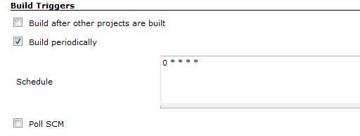

接下来就是要添加 build 的步骤了。Jenkins 提供了四个选项供我们选择，可以根据需要执行或调用外部命令和脚本。

##### 图 12\. 四种 build step 供选择

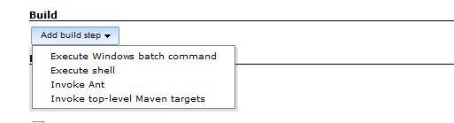

在本例中，我们通过调用和执行 Windows batch command，将 SVN repository 中 Java 代码编译并生成 Jar 文件。也可以根据项目的实际编写自己的 shell 脚本配置在这里。

##### 图 13\. 配置 Execute Windows batch command

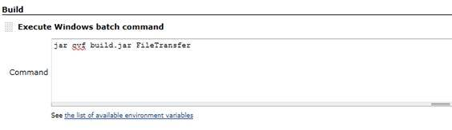

选择和配置其他的选项，比如邮件提醒，然后点击 save 保存。

##### 图 14\. 配置邮件提醒

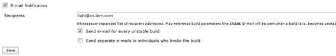

接下来的每小时的第 0 分钟，JenkinsTest Job 就会被构建。我们可以在 Jenkins 中观察构建的进度和最终的状态——成功或者失败。太阳代表之前的构建没有任何失败，蓝色的小球代表构建成功。

##### 图 15\. JenkinsTest 开始构建

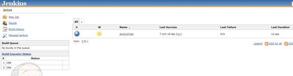

同时我们可以点击 JenkinsTest 查看单次构建的 Console 的输出结果。从中我们能看到构建的第一步是从 SVN 服务器上 check out 代码，然后调用我们先前配置的 Windows batch command。

##### 图 16\. JenkinsTest 构建的 console 输出

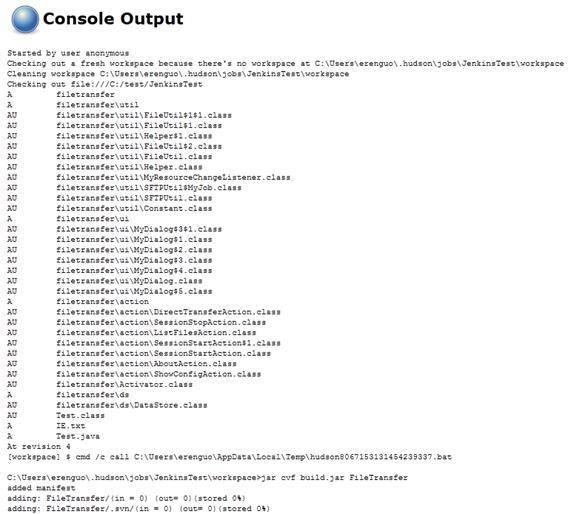

最后，我们可以看到 build 的最后结果 Success，表明本次构建成功。

##### 图 17\. 构建成功的 Console 输出

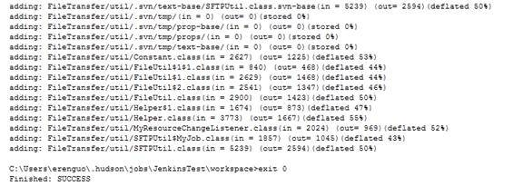

接下来我们再次新建一个 Jenkins 的 Job，用于将生成的 build 分发到不同的节点上。这次 build triggers 我们选择 Build after other projects are built，让这个 Job 在 JenkinsTest 成功 build 后触发。这样一来就能达到我们自动 build 和自动分发的功能。

##### 图 18\. 新建 Distribute job

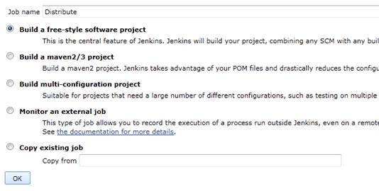

不同的是，这次我们选择调用 Ant 脚本来完成分发的工作。只需要将 Ant 脚本的 XML 的文件配置在 Targets 中供 Jenkins 调用。

##### 图 19\. Distribute 调用外部 Ant 脚本

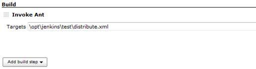

然后我们就可以在 Jenkins 中观察构建的状态了。一旦构建失败我们能看到相应的警示图标，同时，如果配置了邮件提醒，相关人员也会受到邮件。记住我们先前所提醒的那样，分析和处理构建的失败是优先级最高的工作。接下来，我们还可以加入更多的 Jenkins 项目来实现自动化测试等功能，让持续集成更方便有效地服务于项目开发。

##### 图 20\. 查看持续集成状态

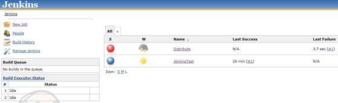

## 结束语

本文简单介绍了持续集成的概念并着重介绍了如何基于 Jenkins 快速构建持续集成环境。通过具体实例的描述，相信读者对 Jenkins 的基本功能和实现方法有个更清楚地认识和理解。其实，Jenkins 的功能远不至文中所述的这些，Jenkins 还有详尽的日志处理和持续集成构建状态的分析等功能。希望在进一步的学习和应用中与大家分享。