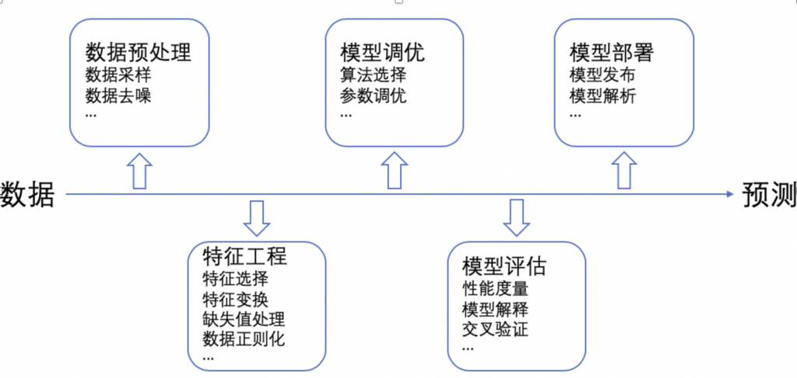
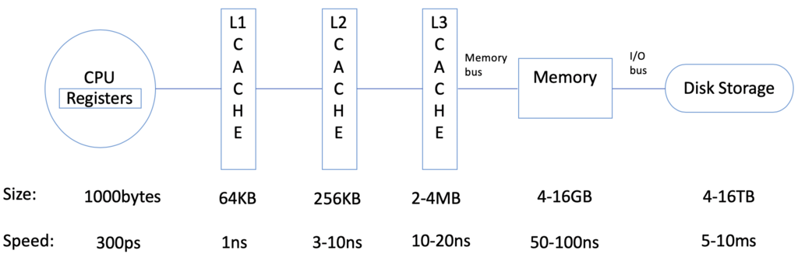
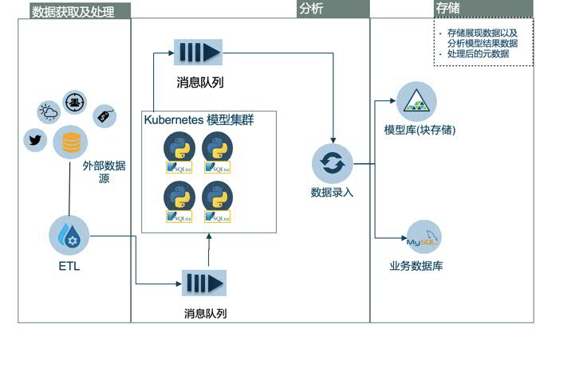
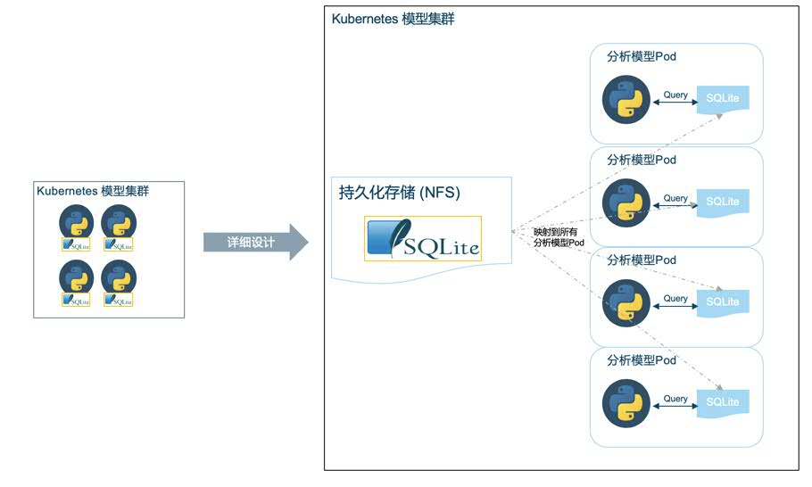
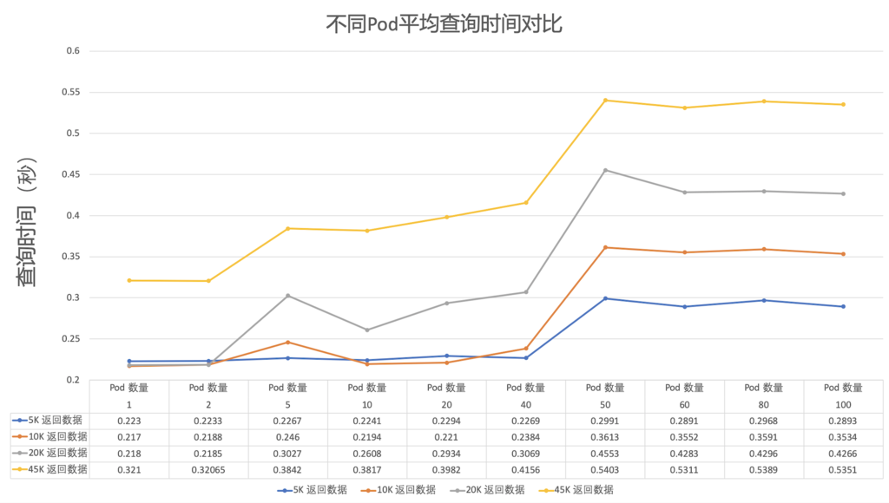

# 基于 Kubernetes 的大规模机器学习系统设计方法
分布式解决方案和内存数据库在智能零售行业的应用

**标签:** 云计算

[原文链接](https://developer.ibm.com/zh/articles/cl-lo-large-scale-machine-learning-system-based-on-kubernetes/)

梁 戈, 王 晔, 王 勇

发布: 2019-11-06

* * *

伴随着人工智能时代的来临，越来越多的业务场景需要我们利用 AI 技术去支持，而机器学习则是目前人工智能方向最重要的子领域之一。各种机器学习模型构建的过程可以抽象概括为：收集数据和数据预处理、特征工程、模型调优和效果评估以及模型部署，整个过程如图 1 所示。在企业级应用场景中，通常在数据预处理和特征工程中会涉及海量数据的收集处理。因此，在大规模模型的处理和运算过程中，如何高效利用海量数据、批量生成机器学习模型就是一个关键问题。

##### 图 1\. 机器学习模型构建图

本文介绍了一种大规模机器学习系统在 Kubernetes 中结合分布式内存数据库来完成海量模型训练和使用的方法。首先，对业务场景进行分析和数据洞察，将算法模型相关的数据从原有的系统主存储库中拆分出来，然后利用 Kubernetes 中的 PV 组件构建一个面向模型容器集群的内存数据库，在模型训练的特征工程阶段对其进行海量并行只读操作。这种设计模式极大的提高了模型的训练效率。本文同时也对该方法进行了实验验证分析，证实了所提出的架构设计的高效率。

## 业务场景及问题描述

在零售和消费品行业，销售预测是以指导运营、平衡供销关系、提高企业利润为目的的商业活动。为了达到货品销售的精准预测，机器学习模型往往需要考虑多维度的因素（例如天气、销售区域经济情况、人员情况、历史销售情况等）来作为精准预测的输入，通常创建一个模型需要 100-200 个模型特征以及该特征 2 至 3 年的历史数据来完成。因此，模型训练对应的输入数据常常达到百万到千万级。

除此之外，为了达到精细化推荐，我们将模型的粒度细化到货品 SKU (Stock Keeping Unit）级别。针对一种商品而言，当其品牌、型号、配置、等级、花色、包装容量等属性中的任一属性与其他商品存在不同时，即是一个单独的 SKU。通常一个便利店中的 SKU 可以成千上万，一个超市的 SKU 可以达到数万。针对一个连锁超市，不同门店的 SKU 集合会在数十万到百万级，相应的模型需求也会在数十万到百万个。比如，以一个拥有 10 家连锁超市的企业，每个超市有 10 万 SKU 的情况来看，假设一个机器学习模型的训练时间是 2 分钟，那么整个项目所有模型训练的时间大概是 347 天。显而易见地，这样的效率是不能满足业务需求的。因此我们将问题总结为：

在不损失模型准确率和模型的精细化程度的前提下，如何高效读取海量数据，创建海量精细化机器学习预测模型。

## 技术方案设计

本文提出的解决方案使用了 Kubernetes 系统，将机器学习系统的功能模块抽象成一个个服务容器，将模型训练部分构建成一个机器学习模型容器集群，每个机器学习模型容器传入不同的参数，请求不同的训练数据，并发地生成和训练 SKU 粒度的预测模型。

### 相关技术

Kubernetes 是目前主流的基于容器技术的分布式架构解决方案，是一个开放的开发平台。它将各种业务程序映射为单个的服务（Service）通过标准 TCP 通信协议进行交互，从而实现多任务交互和通信。使用 Kubernetes 能够轻松实现和运维大型分布式系统，其超强的扩容能力使得系统可平滑地从小规模集群扩展到上百个节点的大规模分布式集群上。

对于数据要进行持久化的应用系统，Kubernetes 需使用可靠的存储机制来保存系统内产生的重要数据，以便容器应用在重建后仍然可以使用历史数据。为了能够屏蔽底层数据存储实现的细节，方便用户使用及管理员管理，Kubernetes 提供共享存储机制实现对存储的管理子系统。共享存储的具体实现有 NFS、GlusterFS 以及 CephFS 等方法。其中，网络文件系统 NFS（Network File System）是可移植、可扩展且具有高性能的系统，基于远程过程调用 RPC（Remote Procedure Call）实现，允许应用系统通过网络共享文件和目录来使用户与程序可以像访问本地文件一般访问远程服务器中的文件并且支持 Kubernetes 的回收策略。

在数据持久化存储方面，主要采用关系型数据库，包括 MySQL、DB2、SQLServer、Oracle 等数据库系统，它们在数据存取方面都拥有着卓越的性能。但是，当我们每次任务的读取操作远远多于写入操作时，使用这些功能强大、完整的数据库系统将会造成资源浪费且在一定程度上降低系统的效率。这种情况下，内存数据库就可以发挥出其相应的优势。内存数据库（In-Memory Database, IMDB）是一种依赖于主存作为数据存储介质的数据库管理系统，IMDB 直接从内存中读取数据，速度要优于基于磁盘的数据库系统。其中，SQLite 数据库是一种小型轻量级嵌入式关系型数据库，具有 ACID 特性。通常情况下 SQLite 的数据存储于单一磁盘文件中，但我们可以通过在创建数据库连接时传入”:memory:”参数来创建纯内存数据库。另外，由于 SQLite 通过简化数据库功能来追求最大的磁盘效率，加之其读取操作可以完全基于内存，对数据读取的操作具有优于 MySQL 等数据库的速率。从内存读取数据的时间量级要明显小于从硬盘读取数据，CPU 从不同对象中读取数据所需的时间如图 2 所示，可以看出，CPU 读取内存的效率是从磁盘读取效率的一万倍。因此，在频繁读取而少量写入的应用系统中，通过对数据的读写分离，将 MySQL 等功能更全面的数据库作为中央数据库负责数据更新及高并发操作，在 worker 节点中使用 SQLite 这一轻量级数据库负责频繁数据读取的任务，这将会大大提高系统的运行效率，并使得海量模型并发训练成为可能。

##### 图 2\. CPU 从不同对象取数据耗时图

### 技术方案

如图 3 所示，本系统架构主要由以下三层组成，分别是数据获取及处理层、分析层和数据存储层。其中数据获取层从用户提供的数据、第三方数据等多个方面获取天气数据、销售数据、人文数据以及地理数据等多维度数据；分析层包含业务处理后端、消息队列以及模型容器集群等，可以接收用户传入的模型训练参数，支持不同模型同时批量训练。我们使用 Kubernetes 创建了一个可靠易扩展的模型容器集群，从消息队列服务中监听接收消息，然后去训练模型；数据存储层主要用来存储模型训练任务完成后产生的数据，将模型训练完成后产生的序列化模型文件以及根据模型结果绘制的预测图存储到对象存储服务器中，将任务的开始时间、结束时间和模型属性等数据存储到业务数据库中。

##### 图 3\. 系统架构图

在 Kubernetes 模型集群中，所有功能服务都被独立地封装在不同的 Pod 中，将各功能注册为 Kubernetes 中的 service，实现了业务的逻辑解耦。该设计的核心在于构建了一个模型容器集群以及一个为了提高模型训练速度的内存数据库，然后再使用 NFS 和 Kubernetes 中的 PV 功能将其提供给封装了模型容器的 Pod。在数据库的设计过程中，我们对模型训练和业务过程进行了深入分析，将只供模型训练使用的数据拆分成单独的表存放在内存数据库中，并且这些数据不会由于模型的某次训练而产生修改，再将这些表属性修改为 “read uncommitted”，这样就可以进行大量的并发读取操作。

##### 图 4\. 详细设计图

数据映射过程如图 4 所示，训练数据只需要存储一份，然后便可以通过 NFS+PV 的方式映射给多个模型 Pod，供其训练使用。这种设计方法节省了大量的存储空间，而且 CPU 从内存读取数据的速度远远大于从硬盘读取，所以对训练数据的读取速度也极快；但是值得注意的是，在这里由于真实的数据只有一份，在数据的请求过程中涉及到了网络交互，由于 Kubernetes 中所有模型 Pod 处于同一局域网，同一局域网内网络延时极小，所以 Pod 请求数据的时间也是显著小于优化前原时间。

## 方案验证

为了说明该方法的有效性，我们对该设计方案进行了横纵对比，统计分析原有非分布式机器学习模型在训练大量模型时所需要的时间，并与采用 Kubernetes 分布式设计优化后的机器学习系统进行对比。此外，我们也使用了不同数量的 Pod 对象进行实验来分析 Pod 数量对整体性能的影响。详细的实验说明如下。

##### 表 1\. 优化前后系统运行时间表（秒）

数据量原有系统架构Kubernetes 分布式架构提升效率（倍）读取 2K 数据69.904.2116.60读取 100K 数据179.9016.4110.90

### 技术方案的横向对比（使用和未使用设计方案的实验）

如表 1 所示，通过读取不同规模的数据来对比原有系统架构和 Kubernetes 分布式架构的读取效率。对其特征构建模块进行时间测算（模型的主要耗时操作存在于该模块中），主要测算的指标为模型所处理数据的规模以及根据该数据构建特征的时间（单位秒）。两组结果数据均在相同环境中运行模型得出。其中测算的时间还包括构建模型时特征合并和格式转换操作。

从表 1 中可以发现使用分布式架构且采用 SQLite 内存数据库进行模型特征构建和训练能够极大提升系统运行速度。在单次读取小规模数据时（2K），特征构建模块总计可提高 16.6 倍速度，而在单次读取更大规模数据时（100K），其运行速率可以有 10.9 倍的提升。通过横向对比实验可以验证所提出的架构设计及优化方法在提升系统运行速率方面表现优异。此外，通过实验我们发现当单表数据行数低于 15M 时，SQLite 在单表查询方面表现不俗，但其在跨表连接时性能不足。对于该问题，我们采用单表查询并将结果使用 Dataframe 进行存储的方法，将跨表连接操作转移到应用内部进行，从而进一步优化速率。

##### 图 5\. 不同数量 Pod 的平均查询时间对比图

### 在大规模批量模型上验证方法有效性，进行纵向对比实验。

为了进一步证明单服务器多进程同时进行 SQLite 数据查询操作的性能，我们通过不断增加分布式集群中 Pod 对象的数量并且针对不同规模的数据（5K～45K）进行相关验证实验。其中，每个 Pod 运行一个任务，多个 Pod 将同时并发执行任务，当该任务完成后相应的 Pod 将被关闭。具体实验结果以曲线图的形式表示从整体走势来发现其中的相关性。如图 5 所示。

从图 5 中可以得出随着 Kubernetes 服务器中 Pod 数量（1～100）的增加（并行任务数量），模型特征构建模块的平均查询时间增大了约 1.6 倍。造成这一现象的原因在于随着 Pod 数量的增加，集群在多任务调度方面耗费了一定的时间从而导致整体运行时间的增多。另外，随着数据规模的增大，平均查询时间有着相同的趋势。当 Pod 数量大于 50 时，由于受到我们 Kubernetes 服务器的资源限制，查询时间逐渐趋于稳定。此外，我们固定了并发数量，同时增加集群的任务总数（当一个 Pod 任务运行结束后，将立刻为其分配新的任务），以此来探明并发数量一定时，集群可支持的最大任务数。实验结果如表 2 和图 5 所示。从中我们可以看到，当 Pod 数量固定时，随着任务数的增多每个模型的平均时间是逐渐降低的，但是由于服务器资源限制，在到达一定量任务数量时，平均时间趋于稳定。

##### 表 2\. 不同数量任务的耗时表

Pod 数量任务数总时间（秒）单任务平均时间（秒）401027127.120360185065513.180104913.1125100121512.15250284711.388

##### 图 6\. 固定 Pod 数量增大任务数时模型的平均时间

## 结束语

本文针对大规模机器学习系统架构设计提出了一个高效可行的设计方案。该方案结合 Kubernetes、网络文件系统以及内存数据库构建了分布式机器学习系统，以并发的方式同时运行多个模型，能够在大规模数据下大幅度提高系统运行效率。文中对方案涉及到的相关技术、具体实施方案且通过设计不同的实验对方案的有效性进行了验证。该方案来源于真实的客户案例，相关的实验也证实了在企业实际应用中具有可行性。