# 基于 Kubernetes 集群的 Serverless 在 IoT 中的应用
Serverless 与 IoT 的结合

**标签:** 云计算

[原文链接](https://developer.ibm.com/zh/articles/cl-lo-serverless-on-private-cloud/)

魏 新宇

发布: 2018-12-05

* * *

Serverless 最初由公有云厂商提出，是时下比较受关注的一个概念。目前，有一些公有云厂商开始提供 Serverless 的服务。但我们知道，很多用户目前已经在数据中心内部部署了基于 Kubernetes 集群的 PaaS 平台。那么，对于这些用户，Serverless 如何在 Kubernetes 集群上落地呢？此外，针对现在很多制造行业 IoT 的需求，基于 Kubernetes 集群的 Serverless 如何支撑 IoT 呢？

带着这两个问题，请阅读本文。

## 无服务器架构 Serverless

要想深入理解 Serverless 架构，我们需要从基础架构和应用架构两者的持续演进开始。

- 基础架构：物理服务器、X86 虚拟化、容器。

- 应用架构：单体应用、服务化、微服务。


基础架构的主线发展和应用架构是平行进行的。

### 应用架构的演进

**第一阶段：早期的应用，是单体架构。**

单体应用（monolith application）将应用程序的所有功能都打包成一个独立的单元。针对于 Java，就通常是 JAR、WAR、EAR 归档格式。

随着应用功能越来越多，单体应用越来越大，产生很多问题，如：灵活性差、升级困难（牵一发而动全身）等。这个时候，SOA 的概念应运而生。

**第二阶段：应用服务化**

“面向服务的架构（SOA）是一个组件模型，它将应用程序的不同功能单元（称为服务）通过这些服务之间定义良好的接口和契约联系起来。接口是采用中立的方式进行定义的，它应该独立于实现服务的硬件平台、操作系统和编程语言。这使得构建在各种各样的系统中的服务可以以一种统一和通用的方式进行交互。”（百度百科）

也就是说，通过面向服务的架构，我们让一个大的单体应用的各个功能组件之间实现松耦合。在谈到 SOA 的时候，不得不谈到一个技术：企业系统总线（ESB）。ESB 的主要功能是提供通信应用程序之间的连接 – 非常像路由器来控制数据。它通常用于企业应用程序集成（EAI）或面向服务的体系结构（SOA）原则。组件之间的交互和通信跨越总线，其具有与物理计算机总线类似的功能，以处理服务之间的数据传输或消息交换，而无需编写任何实际代码。

所以说，ESB 是 SOA 实现的一种模型，是 SOA 的一种技术实现。

**第三阶段：应用的微服务化**

Microservices 是一种软件开发技术，它是 SOA 体系结构样式的进阶模式，它将应用程序构建为松散耦合的服务集合。在微服务架构中，服务是细粒度的，协议是轻量级的。将应用程序分解为不同的较小服务的好处是提高了模块性。这使得应用程序更易于理解、开发、测试，并且更具弹性。它通过使小型自治团队能够独立开发、部署和扩展各自的服务来实现开发的并行化。它还允许通过连续重构来实现单个服务的体系结构。基于微服务的架构可实现持续交付和部署。

### 基础架构的演进

相对于应用的演进，基础架构的演进更容易理解。接下来，我们将应用的演进与基础架构的演进一起来介绍。

**第一阶段：** 应用运行在物理服务器上。彼时，应用是单体的、有状态的、应用各个组件之间是紧耦合的。应用的高可用通常需要基础架构加上操作系统来保证。如在 AIX 服务器上的 PowerHA、HPUX 上的 MC/SG 等。

**第二阶段：** 应用运行在 X86 虚拟化服务器上。这时，应用通过 SOA 等技术，实现了功能组件之间的松耦合。但这个时候，由于 X86 虚拟化软件实现了操作系统和 X86 服务器的松耦合，并提供了多种保护虚拟的技术，很多运行在 X86 虚拟化上应用的高可用，不必再由操作系统级别的高可用软件来保护，通过如 vSphere 的 HA 技术解决计划外故障，通过 vMotion 解决计划内停机等。

**第三阶段:** 微服务和容器的兴起。对于微服务架构的应用，大多数微服务都基于容器架构来部署。这时，单个微服务出现故障，不会影响整个微服务体系对外提供服务（例如一个电商的评论组件出问题，并不会影响大家购物）。同时，单个微服务的高可用，现在通过容器 PaaS 平台，也都可以得到保证。

那么，什么是 Serverless 呢？

Serverless 实际上是一种云计算执行模型。在这种模型下，云计算提供商动态管理所有机器资源的分配。因此，其定价基于应用程序消耗的实际资源量，而不是预先购买的资源容量。

Serverless 又分为两类：Backend as a Service（BaaS）和 Function as a Service（FaaS）。

BaaS 指的是：应用的大部分功能，依赖于第三方云中运行的应用程序或服务，来处理服务器端的状态或逻辑。而这些第三方的应用程序或服务构成了一个庞大的生态系统。如可通过云接入的数据库，服务等。

FaaS 指的是：服务器端逻辑仍由应用程序开发人员编写，但与传统体系架构不同的是，这些应用程序是在无状态计算容器中运行，并且是基于事件触发、短生命周期的（可能仅仅被调用一次），并由第三方完全管理。

所以 FaaS 是 Serverless 的高模式，FaaS 也是应用架构发展的第四个阶段（单体应用、面向服务、微服务之后）。

## Serverless 的技术种类

Serverless 较早在公有云上得到了实现，大多基于闭源的技术。但近年来，基于开源、可在私有云上部署的 Serverless 架构发展很快。

接下来，我们看一下主流 Serverless 技术种类和其启动的时间：

##### 表 1\. Serverless 技术种类

**项目****是否开源****是否支持 Kubernetes****启动时间**[IBM Cloud Function](https://cloud.ibm.com/functions/?cm_sp=ibmdev-_-developer-articles-_-cloudreg)YesYes2017Apache OpenWhiskYesYes2015FissionYesYes2016FunktionYesYes2017Project RiffYesYes2017Amazon LambdaNoNo2014Azure FunctionsNoNo2016Google Cloud Functions (beta)NoNo2016

在 Serverless 的相关开源社区中，Apache OpenWhisk 是规模最大的，同时还支持 Kubernetes，该项目由 IBM 在 2016 年公布并贡献给开源社区。因此，本文接下来将针对 OpenWhisk 在私有 Kubernetes 上展开。

## OpenWhisk 的核心概念

在 OpenWhisk 中有六个较为核心的概念：Triger、Action、Rule、Sequence、Package、Feeds，我们先介绍这六个概念的含义。

**Trigger** 是一类事件的命名通道，以便 OpenWhisk 具备事件驱动的能力。以下是触发器的示例：

- 位置更新事件的触发器。
- 文档上传到网站的触发器。
- 传入电子邮件的触发器。
- 可以使用键值对字典来触发（激活）触发器。

**Action** 是无状态函数，它封装了要在 OpenWhisk 平台上运行的代码。一个 Action 可以写成 JavaScript、Swift、Python 或 PHP 函数、Java 方法，任何二进制兼容的可执行文件，包括 Go 程序和打包为 Docker 容器的自定义可执行文件。

Action 可以显式调用操作，也可以响应事件运行操作。每次运行操作都会生成由唯一激活 ID 标识的激活记录。Action 的输入和 Action 的结果是键值对的字典，其中键是字符串，值是有效的 JSON 值。Action 也可以由对其他 Action 的调用或定义的 Action 序列组成。

**Rule** 将一个 Trigger 与一个 Action 相关联，Trigger 的每次触发都会导致以 Trigger 事件作为输入调用相应的操作。

使用适当的规则集，单个触发器事件可以调用多个操作，或者可以调用操作作为对来自多个触发器的事件的响应。

##### 图 1\. Trigger、Rule 和 Action 之间的关系

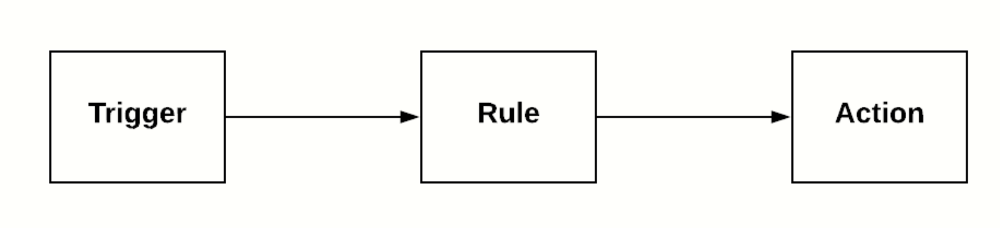

在了解了 Triger、Action、Rule 三个概念以及三者之间的关系后，接下来，我们再看另外三个概念：Sequence、Package、Feeds。

**Sequence:** 比较好理解，它创建 Action 之间的调用关系。OpenWhisk 提供将多个操作链接在一起的功能，其中一个操作的输出是另一个操作的输入。此功能称为序列。序列是完全独立的操作，并定义了执行操作的顺序。

**Package:** 我们可以将多个相关 Action 组合放到一个 Package 中。Package 允许将常见的资源集（例如参数）应用于多个 Action。

**Feeds:** 本质的作用是将环境外部的事件连接到 Trigger 上。Feed 是 OpenWhisk 中的一个高级概念，用户可以在 Package 中暴露 event producer service。Feed 由 Feed Action 控制，Feed Action 处理删除、暂停和恢复事件流。

## 基于 Kubernetes 集群部署的 OpenWhisk

在本小节中，我们基于一个现有 Kubernetes 集群部署一套 OpenWhisk。

首先我们可以看到，Kubernetes 集群有一个 Master，三个 Node。

##### 图 2\. 查看 Kubernetes 集群

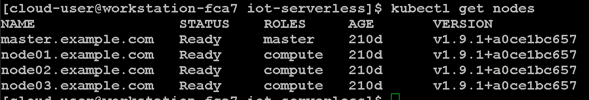

基于集群安装 OpenWhisk 的方法，在 github 上有 [详细介绍](https://github.com/apache/incubator-openwhisk-deploy-kube) ，由于篇幅有限，本文只介绍大致的安装步骤。

首先在 Kubernetes 集群中创建一个 Namespaces，名字为 openwhisk，用于后续部署 OpenWhisk：

##### 图 3\. 创建 namespace

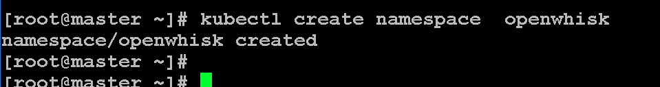

然后设置一个计算节点部署 OpenWhisk：

##### 图 4\. 创建集群部署文件

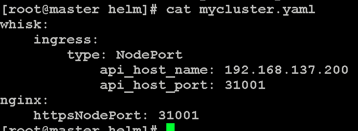

然后通过 helm 安装 OpenWhisk：

##### 图 5\. 创建 OpenWhisk 集群

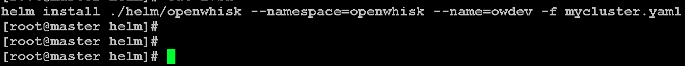

OpenWhisk 部署完毕后，其组件以 pod 方式运行在 Kubernetes 的 Namespace 中：

##### 图 6\. 查看 Pods

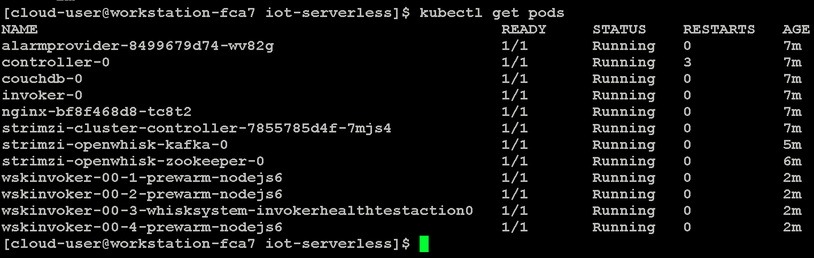

部署成功以后，可以执行 wsk 命令：

##### 图 7\. OpenWhisk 命令行

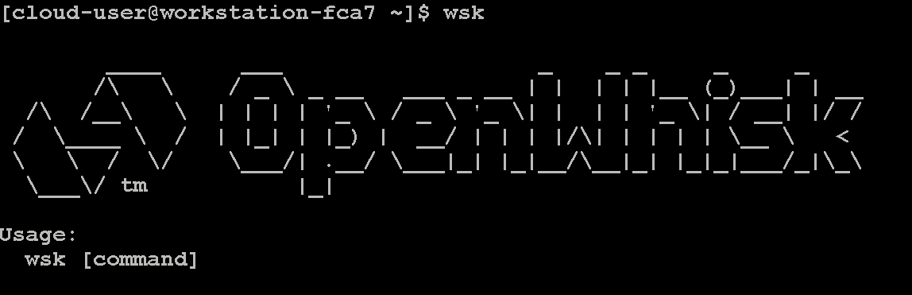

## 创建并调用 Action

首先查看已有的 package：

##### 图 8\. 查看已有的 Package

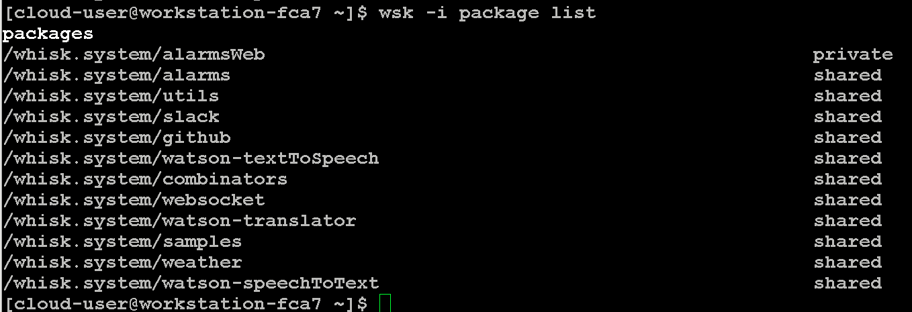

接下来，将使用一个简单的 JavaScript 函数来说明如何创建调用操作。调用时，该操作将返回 “Hello World” 样式响应。 使用以下内容在工作区文件夹中创建名为 test\_openwhisk.js 的文件。

##### 图 9\. 创建 test\_openwhisk.js 文件

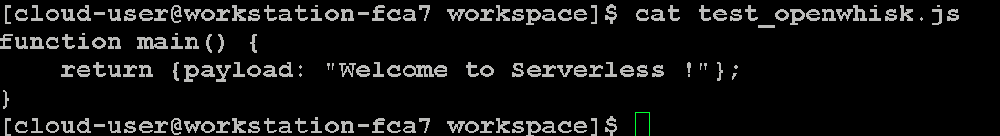

创建好函数后，使用 wsk 工具创建名为 test\_openwhisk 的 action：

##### 图 10\. 创建 Action test\_openwhisk


最后，使用以下命令调用该 Action：

##### 图 11\. 调用 Action test\_openwhisk

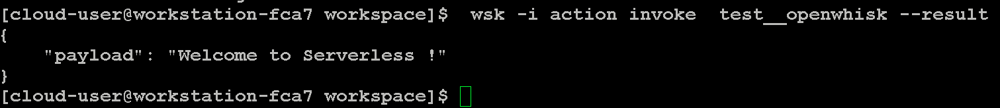

Action 还可以接受可用于驱动执行的输入参数。为了说明此功能，创建一个名为 topicReplace.js 的新文件，该文件将包含一个操作，该操作将使用正斜杠替换名为 topic 的参数中的任何句点。

##### 图 12\. 创建 topicReplace.js

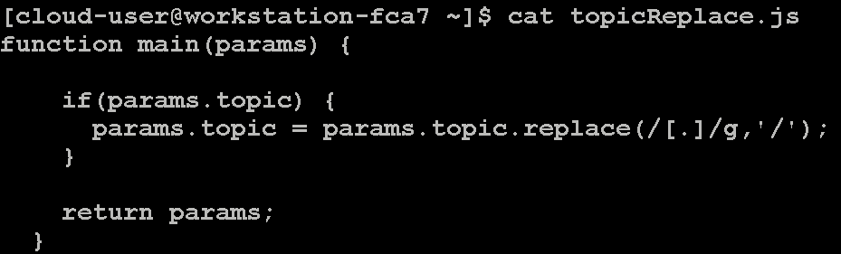

使用以下命令创建名为 topicReplace 的 Action：

##### 图 13\. 创建 Action topicReplace

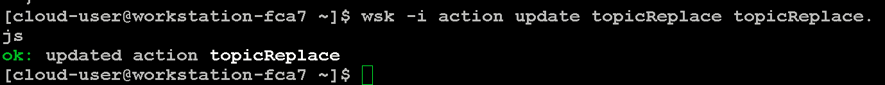

我们还使用 –param 标志将参数传递给操作。通过提供名为 topic 的参数以及包含句点的内容来验证操作是否正确执行。返回的结果，使用斜杠替换句点：

##### 图 14\. 调用 Action topicReplace

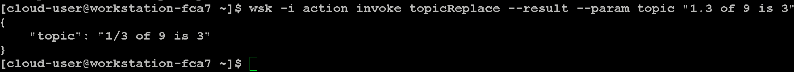

截至到目前，相信大家对于 OpenWhisk 的概念和 Action 的作用有了一个简单的了解。接下来，我们结合一个 IoT 的案例，详解介绍 OpenWhisk 的功能以及其所发挥的作用。

## Serverless 与 IoT 的配合

本小节，我们将通过一个 Serverless 与 IoT 结合的案例，来验证 Serverless 的作用。

### 场景描述

在本实验案例中，工厂希望在其生命周期内密切监控关键资产，以提高运营效率。每台设备（资产）都分配到工厂的特定区域（地理围栏）；设备主动报告它们的实时位置坐标（通过 mqtt 协议发送）。该位置数据（经纬度）被转换并存储在数据库中，以便使用各种功能进行持久存储。如果设备移出其地理围栏，则使用其他功能触发警报。

本案例最终会调用 Google 地图 API（Google Geolocation API）在地理地图上显示资产位置。使用不同的标记动态更新地图数据，用于指示资产是否在其地理围栏内。

在案例中，整个 IoT 的实现，Serverless 将起到如下作用：

1. 格式化资产传递过来的原始数据（经纬度）；
2. 然后 Serverless 拿格式化后的经纬度去 MongoDB 中进行查询，显示该资产的具体信息；
3. Serverless 判断资产是否超出了其地理围栏。

接下来，我们进行详细介绍。

首先，在 K8s 集群中创建一个 Namespace，然后部署 MongoDB 数据库，将资产详细信息录入到数据库。

##### 图 15\. 查看 Namespaces


##### 图 16\. 查看 pods

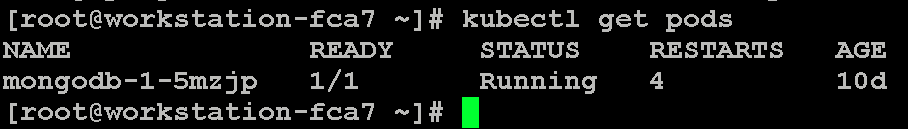

我们查看 MogoDB 中的内容，MongoDB 存放的是资产的详细信息（名称、图片、资产的地理围栏范围）。

##### 图 17\. 查看 MogoDB 内容

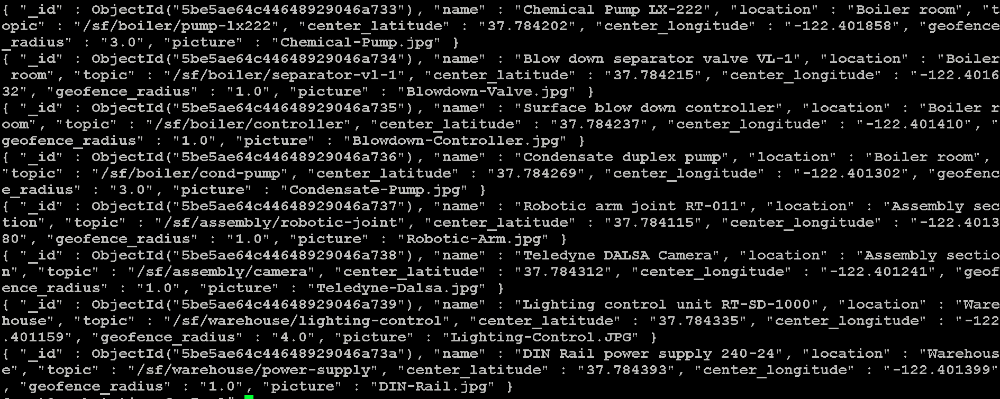

创建一个 IoT Package，用于存放后续实现相关的 Action 等内容：

_$ wsk -i package create –shared yes iot-serverless_

##### 图 18\. 查看 Package

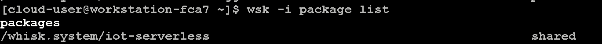

接下来，我们创建三个 Action，第一个是基于 JavaScript 的 formatInput、第二个基于 node.js 的 enricher、第三个是基于 JavaScript 的 geofence。

### 创建并验证第一个 Action：formatInput

我们先看以一个 Action：formatInput，它的源码如下：

##### 清单 1\. formatInput 源码

```
$cat formatInput.js
function main(params) {

    // Format the Topic to replace . with /
    if(params.topic) {
      params.topic = params.topic.replace(/[.]/g,'/');
    }

    // Parse the input data to provide lat/long
    if(params.data) {
      data_values = params.data.split(" ");

      params.latitude = data_values[0];
      params.longitude = data_values[1];
    }

return params;

```

Show moreShow more icon

这个 Action 的作用是对传入的参数进行格式化（资产将其经纬度实时经纬度传递过来，formatInput 对传递过来的数值进行格式化）：

1. 对于传入的 topic 参数，使用正斜杠替换名为 topic 的参数中的任何句点。
2. 对于传入的数据进行数据拆分，前半部分是 latitude（维度），后半部分是 longitude（经度）。

创建 Action：

##### 图 19\. 创建 Action

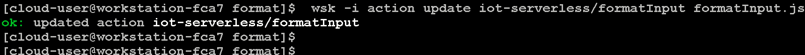

Action 创建成功。

然后，我们创建一个触发 Action 的 Trigger

$ wsk -i trigger create iotServerlessTrigger

##### 图 20\. 查看 Trigger


创建一个 Rule，将 iotServerlessTrigger Trigger 与 formatInput Action 相关联：

##### 图 21\. 创建 Rule

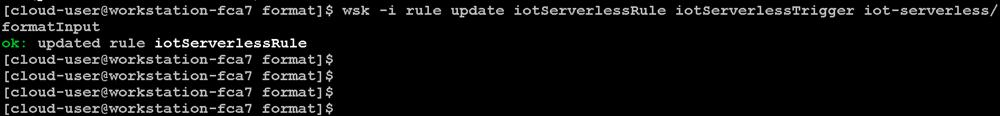

截至到目前，Trigger 已通过 Rule 连接到 Action，我们可以通过触发 Trigger 来调用 Action。 formatInput Action 需要指定两个参数：topic 和 data。

##### 图 22\. 触发 Trigger

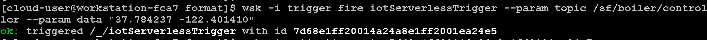

当 Trigger 被触发，会输出一个 ID（7d68e1ff20014a24a8e1ff2001ea24e5）。这表示 OpenWhisk 已经处理了请求。而返回的 ID 是与 Activation Record 相关的。

虽然我们调用了 Trigger，但 Trigger 并不会产生结果，结束是由 Rule 调用 Action 才能产生最终的结果。

但我们可以通过刚才输出的 ID，获取 activationId。

##### 图 23\. 获取 activationId

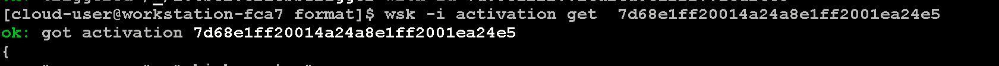

直接查看 log 部分，得到 activationId：2f6d169ce51046d9ad169ce510d6d912。

##### 图 24\. 查看 log 结果

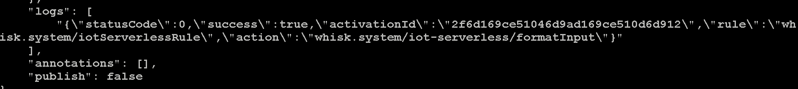

最后通过上一步获取到的 activationid（2f6d169ce51046d9ad169ce510d6d912），来查询 activation：

##### 图 25\. 执行命令获取结果

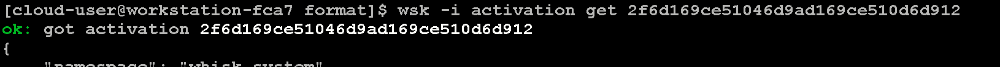

命令执行成功，我们看执行结果的核心部分：

##### 图 26\. 查看执行结果

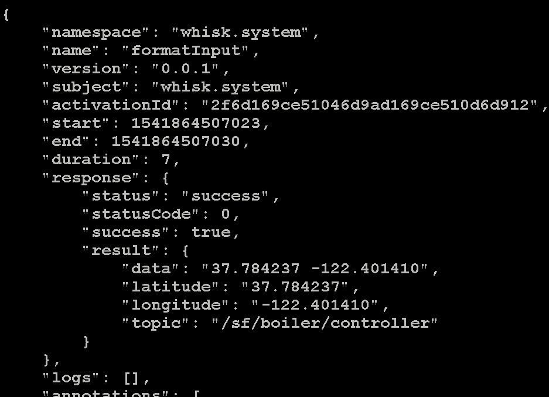

如上图所示，我们调用 Trigger 时传入的参数，通过我们定义的 Rule 发送到 formatInput Action，Action 根据字段中提供的值拆分纬度和经度字段（latitude 和 longitude）。

### 创建并验证第二个 Action：enricher

接下来，我们创建第二个 Action：enricher。它的作用是：根据传入的经纬度，在 MongDB 中查找资产的详细信息（名称、其地理围栏范围、图片等）。

enricher.js 是 OpenWhisk action 的源码。

##### 清单 2\. enricher 源码

```
var path = require("path");
const format= require('util').format;
require('dotenv').config({path: path.join(__dirname, '.env')});

var MongoClient = require('mongodb').MongoClient;

function enrich(params) {

    // Validate Parameters
    var mongoDbUser = process.env.MONGODB_USER;
    var mongoDbPassword = process.env.MONGODB_PASSWORD;
    var mongoDbHost = process.env.MONGODB_HOST;
    var mongoDbDatabase = process.env.MONGODB_DATABASE;

    if(!mongoDbUser || !mongoDbPassword || !mongoDbHost || !mongoDbDatabase) {
      return {error: "Database Values Have Not Been Provided!"}
    }

    var url = format('mongodb://%s:%s@%s:27017/%s', mongoDbUser, mongoDbPassword, mongoDbHost, mongoDbDatabase);

    var topic = params.topic;

    if(topic) {
      return new Promise(function(resolve, reject) {

        MongoClient.connect(url, function(err, client){

          if(err) {
            console.error(err);
            reject({"error":err.message});
            return;
          }

          var db = client.db(mongoDbDatabase);

          db.collection('assets').findOne({"topic": topic}, function (err, doc) {
            if(err) {
              console.error(err);
              reject({"error":err.message});
              return;
            }

            if(doc) {
                for(index in doc) {
                  if(index != "_id") {
                    params[index] = doc[index];
                  }
                }
            }
            else {
                console.log("No Asset Found with topic '%s'", topic);
            }
            client.close();
            resolve(params);
        });

        });

      });
    }
    else {
      console.log("Topic Has Not Been Provided")
      return params;
    }

};

```

Show moreShow more icon

从上面的源码可以看出，名为 enricher 的 Action，不仅可以显示资产的经纬度，还能够显示资产的名称、地理围栏半径。

##### 图 27\. 部署 Action

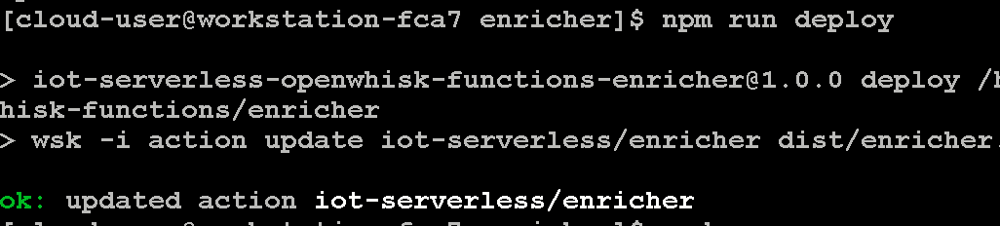

我们直接调用 Action，传入的参数是 topic：

##### 图 28\. 调用 Action

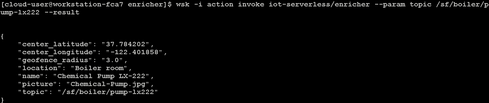

### 将两个 Action 链接

在上两个小节，我们已经创建了两个 Action，一个将执行输入格式标准化（formatInput），另一个 Action（enricher）将根据被调用时传入的 topic 值，从数据库 MongoDB 执行查找，以显示资产的相关信息。

OpenWhisk 允许将多个 Action 链接在一起，也就是说前一个 Action 的输出是后一个 Action 的输入。此功能称为序列，序列定义了执行 Action 的顺序；同时，序列也是一种 Action。

我们创建一个名为 iotServerlessSequence 的新序列 Action，该操作首先首先调用 formatInputAction，然后使用输出作为 richher Action 的输入参数。

##### 图 29\. 创建序列

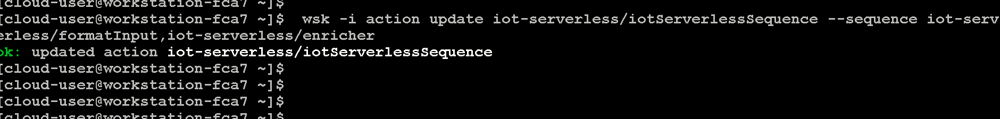

接下来，我们更新之前创建的 iotServerlessRule，让它调用 iotServerlessSequence 序列操作，而不是直接调用 formatInput 操作：

##### 图 30\. 更新 rule

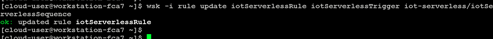

然后，我们触发 Trigger（传入的参数是 Topic 和经纬度数据）：

##### 图 31\. 触发 trigger

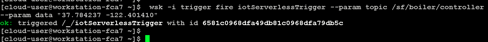

我们从输出结果获取到了 ID：6581c0968dfa49db81c0968dfa79db5c。

接下来，我们用刚获取到的 ID 来查询 activationId：

##### 图 32\. 查询 activationId

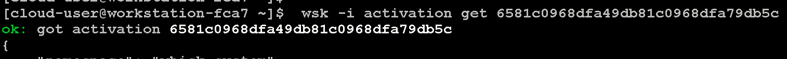

查看 log 部分的 activationId，得到 1567ea66c3ff4099a7ea66c3ffb099a8。

##### 图 33\. 查询 log

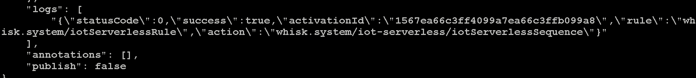

用上一步获取到的 activationId，查看最终调用执行结果：

##### 图 34\. 查询执行结果

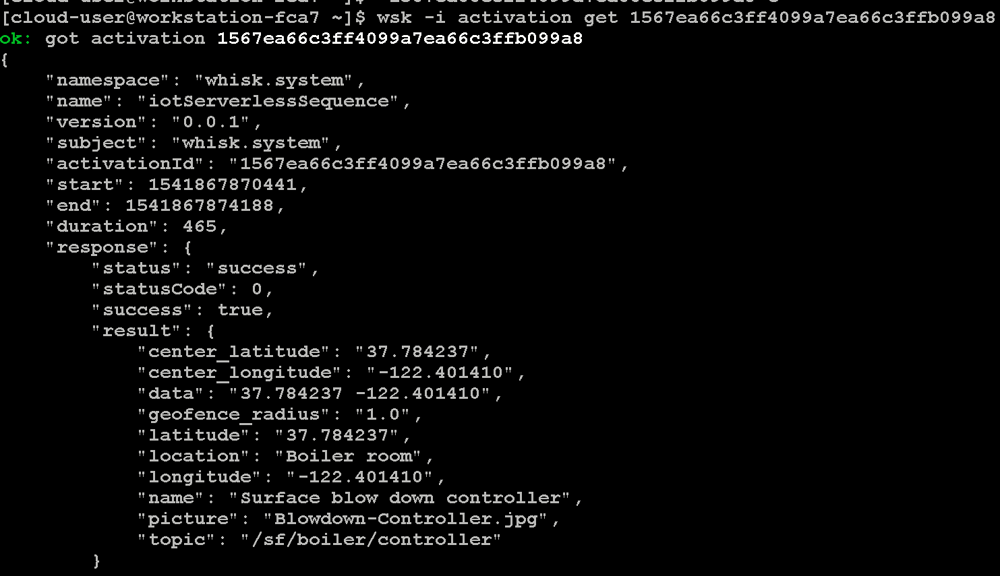

从结果中，我们可以看到资产的信息、其地理围栏信息、资产的图片等。这达到了我们预想的结果。

### 创建并验证第三个 Action：geofence

地理围栏是地理区域的虚拟边界。地理围栏可用于许多物联网用例，包括资产跟踪、安全、监控和零售等。

geofence.js 是 geofence Action 的源码：

##### 清单 3\. geofence 源码

```
// Execute logic to enforce geofence if required parameters are present
    if(params.latitude && params.longitude && params.center_latitude && params.center_longitude && params.geofence_radius) {

      var R = 6371e3; // metres
      var φ1 = degrees_to_radians(params.center_latitude);
      var φ2 = degrees_to_radians(params.latitude);
      var Δφ = degrees_to_radians(params.latitude-params.center_latitude);
      var Δλ = degrees_to_radians(params.longitude-params.center_longitude);

      var a = Math.sin(Δφ/2) * Math.sin(Δφ/2) +
              Math.cos(φ1) * Math.cos(φ2) *
              Math.sin(Δλ/2) * Math.sin(Δλ/2);
      var c = 2 * Math.atan2(Math.sqrt(a), Math.sqrt(1-a));

      var d = R * c;

      if(d > params.geofence_radius) {
        params.alert = 1;
      }
      else {
        params.alert = 0;
      }
    }
    else {
      console.log("Required Parameters for Geofence Calculation Not Provided");
      return {error: "Required Parameters for Geofence Calculation Not Provided"}
    }

    return params;
}

function degrees_to_radians(degrees)
{
var pi = Math.PI;
return degrees * (pi/180);
}

```

Show moreShow more icon

从源码我们可以大致看出，geofence Action 的作用是确认资产是否在其地理围栏之内。

##### 图 35\. 查询执行结果

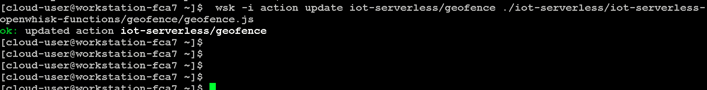

截止到目前，我们已经为 Package iot-serverless 创建完成三个 Action：

##### 图 36\. 查看 Action

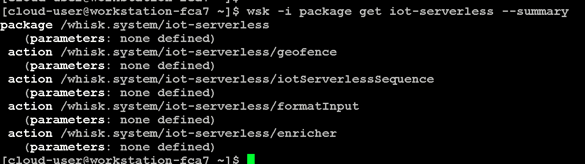

最后，我们更新 iotServerlessSequence 序列，以便将刚创建的 Action 加入到序列：

##### 图 37\. 查看序列

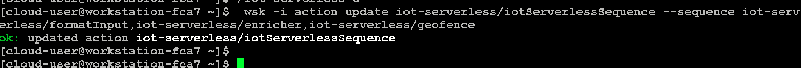

接下来，我们通过直接调用的方式，验证刚刚创建的 Action.

工厂有一个资产，该资产预计位于（37.784393，-122.401399），并且只能在指定区域（3m）内移动。此半径位于仓库的备用库存部分中。如果此资产移出此指定区域（地理围栏），则会触发警报。假设资产现在将其当前位置报告为（37.784420，-122.401399），这超出了其地理位置，我们看通过调用 geofence Action 是否会产生告警。

##### 图 38\. 查看结果

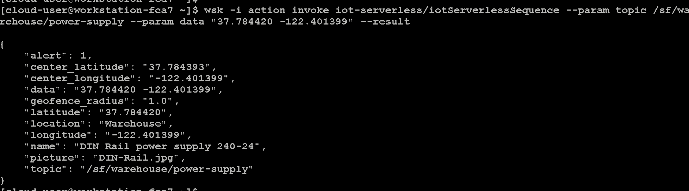

在上面的结果中，”alert”：1 这表明资产在地理围栏允许区域之外。 如果资产位于地理围栏区域内，则返回”alert”：0 值。

### 验证包含三个 Action 的序列

接下来，验证刚刚更新好的序列。

首先触发 Trigger，得到：7da0013806cf4c6ea0013806cf5c6e76

##### 图 39\. 触发 trigger

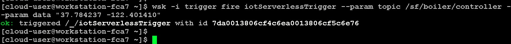

##### 图 40\. 获取 actionid

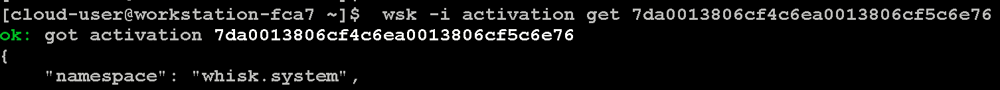

得到：”5668f3a262dd47f7a8f3a262dd17f705

##### 图 41\. 查看结果

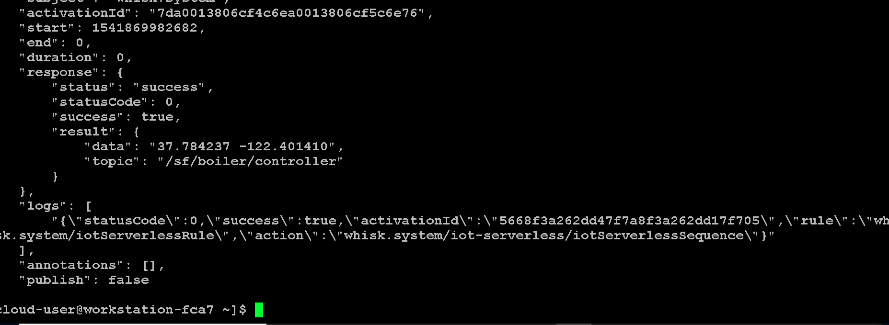

##### 图 42\. 查询 id

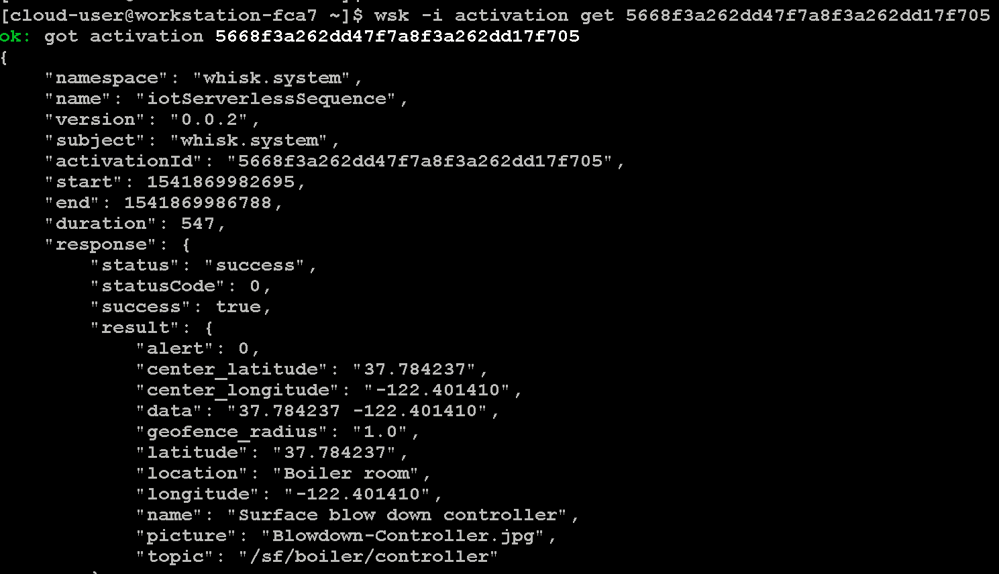

得到 eff72f9a99f443d6b72f9a99f453d6ab

##### 图 43\. 查看 log 中的 id

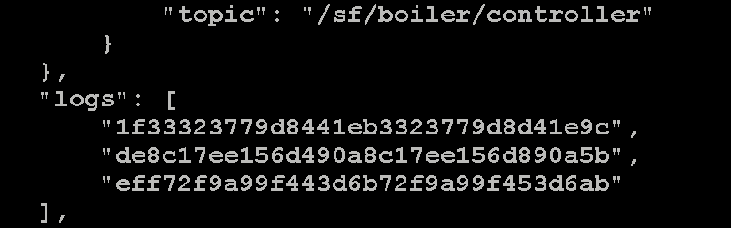

查询最终结果：

##### 图 44\. 查看最终结果

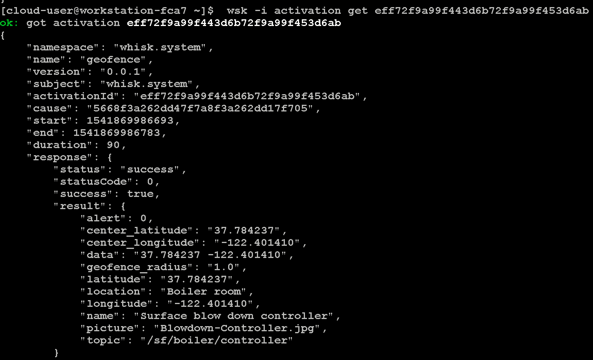

可以看到，该资产在其物理围栏之内（如上图所示），为了方便读者查看，我将其贴出：

##### {: \#}

```
"result": {
    "alert": 0,
    "center_latitude": "37.784237",
    "center_longitude": "-122.401410",
    "data": "37.784237 -122.401410",
    "geofence_radius": "1.0",
    "latitude": "37.784237",
    "location": "Boiler room",
    "longitude": "-122.401410",
    "name": "Surface blow down controller",
    "picture": "Blowdown-Controller.jpg",
    "topic": "/sf/boiler/controller"
}

```

Show moreShow more icon

截至到目前，我们已经创建完成了三个 Action、一个序列，并实现了通过分析对输入的原始设备坐标，最终判断资产是否在其地理围栏之内，并给出详细的信息。

而最终 UI 展示的效果，如下图所示：

即根据资产的经纬度，调用 Google Map，显示其物理位置。如果显示红色，则表示该资产已经超出了其地理围栏（红色圆圈显示其地理围栏）。

##### 图 45\. 卫星图像

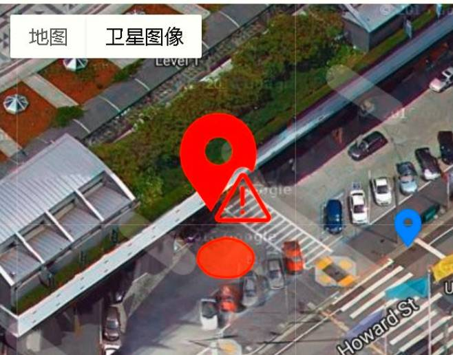

同时，我们还可以看到资产的信息。

##### 图 46\. 资产信息

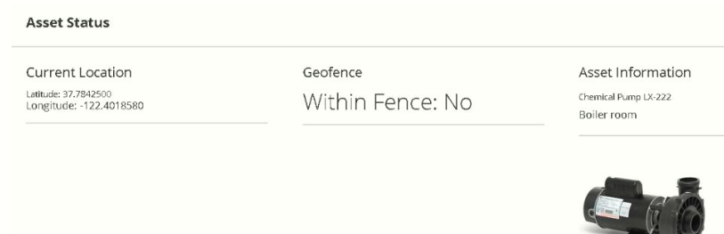

## 结束语

通过本文的介绍，相信您对 Serverless 的概念有了一定的了解。通过实验的介绍，对于 OpenWhisk 架构和功能也有了一定的理解。同时，也能够了解到 Serverless 与 IoT 的结合场景。

## 参考资源

- [Serverless for IoT lab](https://github.com/sabre1041/iot-serverless)
- [OpenWhisk 安装方法](https://github.com/apache/incubator-openwhisk-deploy-kube)
- 百度百科： [无服务器计算](https://baike.baidu.com/item/无服务器计算/22695177?fr=aladdin)
- martinfowler.com： [Serverless Architectures](https://martinfowler.com/articles/serverless.html)
- Github： [https://github.com/apache/incubator-openwhisk-deploy-kube](https://github.com/apache/incubator-openwhisk-deploy-kube)
- 相关文章： [OpenWhisk 的本地部署和应用](https://developer.ibm.com/zh/articles/cl-lo-local-deployment-and-application-of-openwhisk/)
- 开源技术 \\* IBM 微讲堂系列： [Serverless 应用案例赏析](https://developer.ibm.com/zh/series/os-academy-serverless/)