# 基于 OpenShift 构建面向企业的 CI/CD
借助 Jenkins 和 Tekton 实现 OpenShift Pipeline

**标签:** DevOps,云计算

[原文链接](https://developer.ibm.com/zh/articles/cl-lo-building-an-enterprise-oriented-cicd-based-on-openshift/)

魏 新宇

发布: 2020-01-15

* * *

## 在 OpenShift 中构建应用

OpenShift 上，很多时候我们直接部署包含应用的容器镜像。但客户的开发人员在使用 OpenShift 平台时，会要求应用能够在 OpenShift 上自动化构建，并进一步实现 CI/CD。这就涉及到如何在 OpenShift 中构建应用。接下来，我们先介绍 OpenShift 上应用的构建方式，然后分析如何在 OpenShift 上实现 CI/CD。

### OpenShift 上应用构建的方式

在 OpenShift 上构建应用方式包括三种：

- Dockerfile 构建
- Jenkins 构建
- Source to Image 构建（简称 S2I）

在三种方式中，书写 dockerfile 进行构建最为常见，这也是应用容器化的一种方式。但在大规模的 CI/CD 环境中，通过 Dockerfile 方式构建应用的方式显然效率较低。

在企业环境中，大多数客户的应用构建都是通过 Jenkins 方式完成的。Jenkins 面向多种构建环境，容器环境只是它的一种使用场景。在容器环境中，Jenkins 集群在 CI 流程中调用 Maven 执行构建，生成应用包。

Source to Image 是红帽 OpenShift 原创的应用构建和部署方式。红帽官方会提供很多 S2I Builder Image（如果客户需要的 Builder Image 红帽官网没有提供，则需要自行制作）。在这种模式下，我们在构建应用时，需要选择应用所在的代码库（如 git）和 S2I Builder Image（例如 tomcat），然后 OpenShift 会自动构建源码，并自动将编译打包好的软件包拷贝到容器镜像的对应目录中，完成应用容器化的步骤。

在 OpenShift 上，应用构建推荐使用 Jenkins 还是 S2I 呢？实际上，这两种方式并不冲突。在很多场景中的，它们是相互补充的。单一使用 Jenkins 构建应用的缺点是微服务多语言多版本混合构建时无隔离，此外 Jenkins 也比较消耗内存资源；单一使用 S2I 的缺点是难以实现 CI/CD 流水线管理。

接下来，我们介绍 S2I 和 Jenkins 结合使用构建应用并实现 CI/CD 的方式。

### S2I 与 Jenkins 结合使用实现 CI/CD

S2I 与 Jenkins 相结合实现 CI/CD 主要有以下三种方式：

- Jenkins 负责 CI、S2I 负责 CD。
- Jenkins 管理 Pipeline，调度 OpenShift S2I 完成 CI/CD。
- 在 OpenShift 上使用 Jenkins file，调用 Jenkins 实现 CI、OpenShift 负责 CD。我们称这种方式为 OpenShift Pipeline。

在第一种方式中，Jenkins 负责 CI，输出物是应用软件包（如 Jar、War 包），然后应用包以 Binary to Image（简称 B2I）的方式注入到 Builder Image 中。本质上，B2I 是 S2I 的一个特殊使用场景，如下图 1 所示。

##### 图 1\. 第一种 CI/CD 实现方式

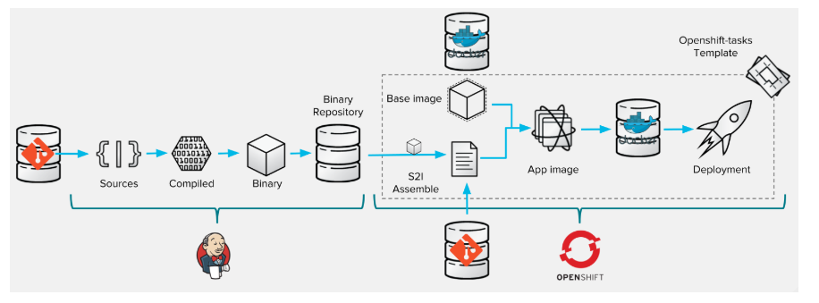

第二种方式中，整个 CI/CD 的动作都是由 S2I 完成，但由 Jenkins 控制整个 Pipeline。在这种方式下，Pipeline 的触发是在 Jenkins 上完成的，如下图 2 所示：

##### 图 2\. 第二种 CI/CD 实现方式

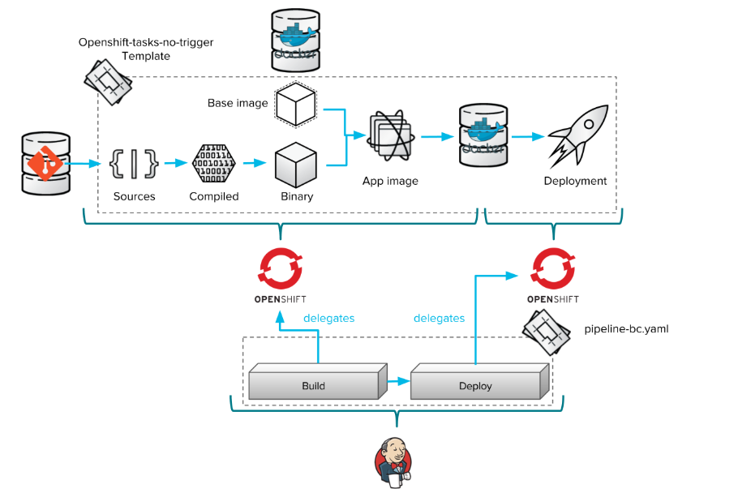

第三种即 OpenShift Pipeline 的方式。在这种方式下，通过 Jenkins file 定义整个 Pipeline，Pipeline 的触发在 OpenShift 界面上完成。CI 通过 Jenkins 完成，CD 通过 OpenShift 完成，如图 3 所示：

##### 图 3\. 第三种 CI/CD 实现方式

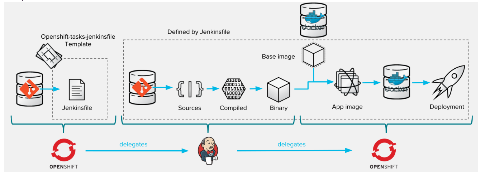

在以上三种方式中，我们推荐使用第三种 OpenShift Pipeline 的方式。这种方式的好处是：

1. 便于管理：Pipeline 的管理由 OpenShift 完成，避免客户反复切换界面；
2. 可维护性强：如果我们想要修改 CI/CD 流水线的环节（如增加 UAT），只需要修改 Jenkins file 即可。

红帽 OpenShift 平台提供 Jenkins 的容器化镜像，如图 4 所示。在 OpenShift 上部署的 Jenkins，可以实现与 OpenShift 账户的单点登录。

##### 图 4\. OpenShift 提供的 Jenkins 的镜像


如上文所述，此前 OpenShift Pileline 是通过 Jenkins 实现的。在 OpenShift 最新版本 4.2 中，OpenShift Pipeline 又有了新的实现方式。

## OpenShift 4.2 中的 OpenShift Pipeline

在上文中我们提到过，CI 工具中 Jenkins 的功能较强，使用范围也很广。OpenShift 3 的 Pipeline 就是使用 Jenkins。但是对于容器和 Kubernetes 来说，Jenkins 的劣势在于：

- Jenkins 不是为容器环境构建的；
- Jenkins 不适合微服务团队结构；
- Jenkins 插件太多，造成了微服实现 CI/CD 的复杂度。

在 OpenShift 4.2 中，OpenShift Pipeline 使用云原生的 CI/CD 工具 Tekton，它具有如下优势：

- 具有基于 Tekton 的标准 Kubernetes 自定义资源（CRDs）的声明性 pipeline
- 在容器中运行 pipeline
- 使用 Kubernetes 上的容器按需扩展 pipeline 执行
- 使用 Kubernetes 工具构建 Image
- 可以自行选择（source-to-image、buildah、kaniko、jib 等）来构建容器镜像，然后部署到多个平台，如无服务器架构、虚拟机和 Kubernetes
    接下来，我们先介绍 Tekton 的概念，再介绍如何在 OpenShift 上使用 Tekton 实现 CI/CD。

### Tekton 简介

Tekton 是由谷歌主导的开源项目，它一个功能强大且灵活的 Kubernetes 原生开源框架，用于创建持续集成和交付（CI/CD）。通过抽象底层实现细节，用户可以跨多云平台和本地系统进行构建、测试和部署。

Tekton 将许多 Kubernetes 自定义资源（CR）定义为构建块，这些自定义资源是 Kubernetes 的扩展，允许用户使用 kubectl 和其他 Kubernetes 工具创建这些对象并与之交互。

Tekton 的自定义资源包括：

- Step：在包含卷、环境变量等内容的容器中运行命令。
- Task：执行特定 task 的可重用、松散耦合的 Step（例如，building a container image）。Task 中的 step 是串行执行的。
- Pipeline：Pipeline 由多个 tasks 组成，按照指定的顺序执行，task 可以运行在不同的节点上，他们之间有相互的输入输出。
- PipelineResource：Pileline 的资源，例如：输入（例如，git 存储库）和输出（例如，image registry）。
- TaskRun：是 CRDS 运行时，运行 task 实例的结果。
- PipelineRun：是 CRDs 运行时，运行 pipeline 实例的结果，其中包含许多 TaskRuns。

OpenShift Pipeline 的工作流程图如下所示。通过 task 定义 pipeline；Tekton 执行 pipeline，task 和 pipeline 变成运行时状态，并且 OpenShift 中启动 pod 来运行 pipeline，如下图 5 所示：

##### 图 5\. OpenShift Pipeline 工作流程

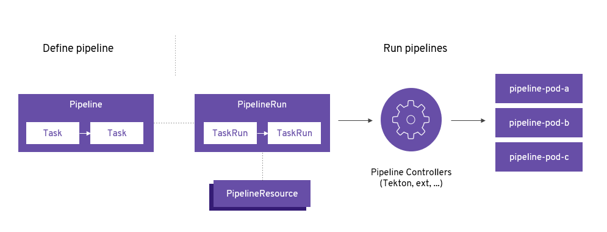

虽然 OpenShift 4.2 Pipeline 默认使用 Teckton，但 OpenShift 会继续发布并支持 Jenkins image 和 plugin，如下图 6 所示：OpenShift 4.2 的服务目录所示 Jenkins 的内容。

##### 图 6\. OpenShift 4.2 上 Jenkins 的模板

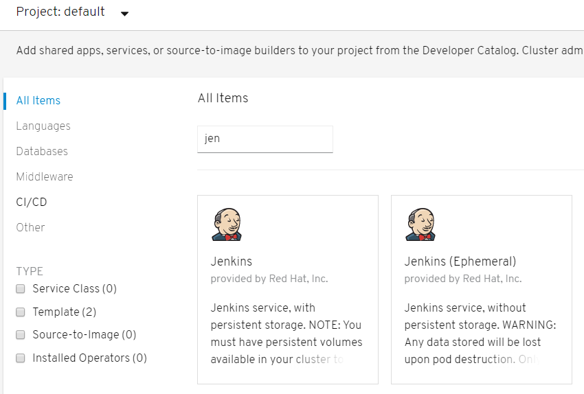

在介绍了 Tekton 的概念后，接下来我们学习如何在 OpenShift 4.2 中部署 OpenShift Pipeline。

### 安装 OpenShift Pipeline

OpenShift Pipelines 在 OpenShift 4.2 中，可以通过 OpenShift Operator Hub 中提供的 Operator 进行安装。在 Operator Hub 中搜索到 OpenShift Pipeline Operator，如下图 7 所示：

##### 图 7\. Operator Hub 界面

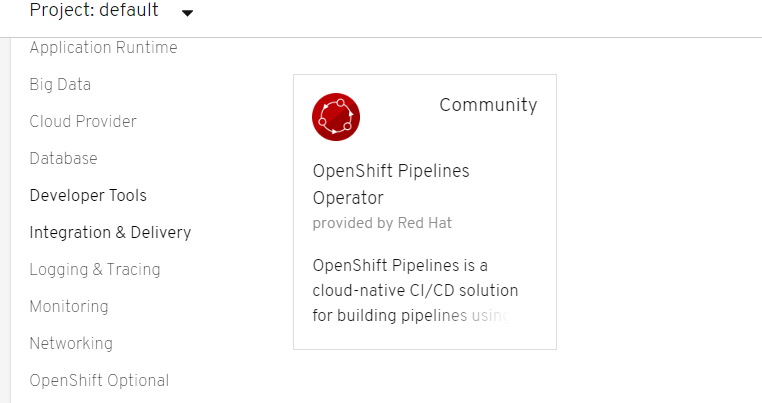

点击 install 安装 OpenShift Pipeline Operator，如下图 8 所示：

##### 图 8\. 安装 OpenShift Pipeline Operator

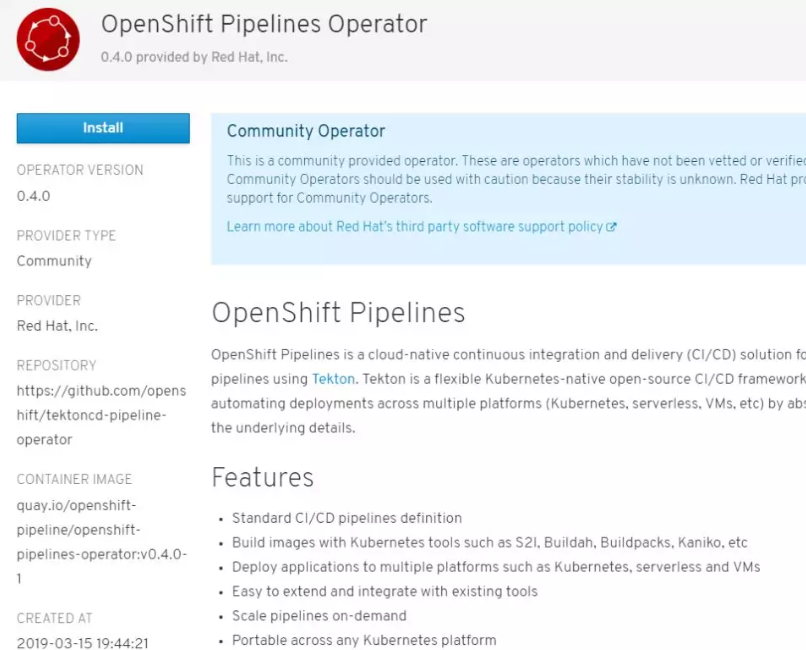

接下来，创建 Operator 订阅，指定要部署的项目，如下图 9 所示，点击 Subscribe：

##### 图 9\. 创建 Operator 订阅

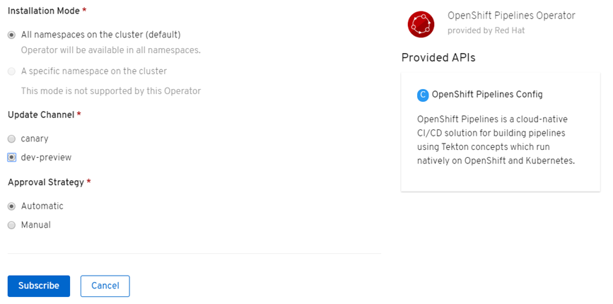

在 OpenShift 中创建运行 OpenShift Pipeline 的项目：

```
[root@master ~]# oc new-project pipelines-tutorial

```

Show moreShow more icon

### 验证 OpenShift Pipeline

我们使用一个 Spring PetClinic 示例进行测试，这是一个简单的 Spring Boot 应用程序。

首先应用如下配置，它会创建应用的 ImageStream、DeploymentConfig、Route 和 Service 等资源。由于配置文件内容较多，我们将它放在 GitHub 上： [https://github.com/ocp-msa-devops/teckton/blob/master/petclinic.yaml](https://github.com/ocp-msa-devops/teckton/blob/master/petclinic.yaml)。

应用配置：

```
# oc create -f petclinic.yaml

```

Show moreShow more icon

我们可以在 OpenShift Web 控制台中看到部署的内容，如下图 10 所示：

##### 图 10\. 查看应用部署

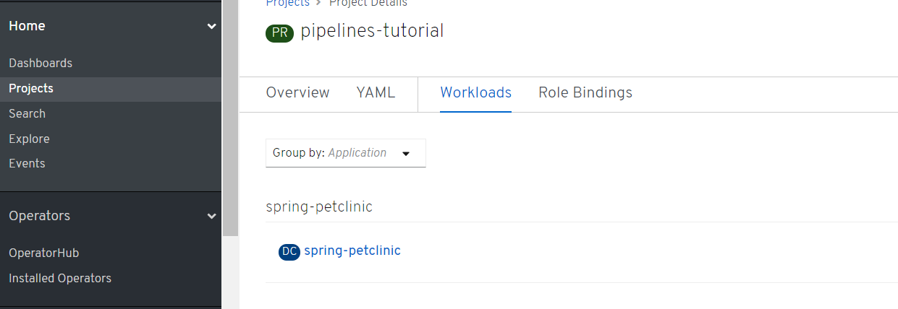

接下来，我们展示创建 task 的一个示例。task 含许多按顺序执行的 step。一个 task 的 steps 顺序地在在同一个 pod 中的单独容器中执行。它们具有输入和输出，以便与 pipeline 中的其他 task 进行交互。

我们创建两个 task：openshift-client 和 s2i-java task。第一个 task 执行参数传入的 oc 命令，第二个 task 是基于 Openjdk 做 S2I 的模板。配置文件内容如清单 1 和清单 2 所示：

##### 清单 1\. openshift-client-task.yaml 配置文件：

```
apiVersion: tekton.dev/v1alpha1
kind: Task
metadata:
name: openshift-client
spec:
inputs:
    params:
      - name: ARGS
        description: The OpenShift CLI arguments to run
        default: help
steps:
    - name: oc
      image: quay.io/openshift-pipeline/openshift-cli:latest
      command: ["/usr/local/bin/oc"]
args:
        - "${inputs.params.ARGS}"

```

Show moreShow more icon

##### 清单 2\. s2i-java-8-task.yaml 配置文件

```
apiVersion: tekton.dev/v1alpha1
kind: Task
metadata:
name: s2i-java-8
spec:
inputs:
    resources:
      - name: source
        type: git
    params:
      - name: PATH_CONTEXT
        description: The location of the path to run s2i from.
        default: .
      - name: TLSVERIFY
        description: Verify the TLS on the registry endpoint (for push/pull to a non-TLS registry)
        default: "true"
outputs:
    resources:
      - name: image
        type: image
steps:
    - name: generate
      image: quay.io/openshift-pipeline/s2i
      workingdir: /workspace/source
      command: ['s2i', 'build', '${inputs.params.PATH_CONTEXT}', 'registry.access.redhat.com/redhat-openjdk-18/openjdk18-openshift', '--image-scripts-url', 'image:///usr/local/s2i', '--as-dockerfile', '/gen-source/Dockerfile.gen']
      volumeMounts:
        - name: gen-source
          mountPath: /gen-source
    - name: build
      image: quay.io/buildah/stable
      workingdir: /gen-source
      command: ['buildah', 'bud', '--tls-verify=${inputs.params.TLSVERIFY}', '--layers', '-f', '/gen-source/Dockerfile.gen', '-t', '${outputs.resources.image.url}', '.']
      volumeMounts:
        - name: varlibcontainers
          mountPath: /var/lib/containers
        - name: gen-source
          mountPath: /gen-source
      securityContext:
        privileged: true
    - name: push
      image: quay.io/buildah/stable
      command: ['buildah', 'push', '--tls-verify=${inputs.params.TLSVERIFY}', '${outputs.resources.image.url}', 'docker://${outputs.resources.image.url}']
      volumeMounts:
        - name: varlibcontainers
          mountPath: /var/lib/containers
      securityContext:
        privileged: true
volumes:
    - name: varlibcontainers
      emptyDir: {}
    - name: gen-source
      emptyDir: {}

```

Show moreShow more icon

应用两个配置文件：

```
# oc create -f openshift-client-task.yaml
# oc create -f s2i-java-8-task.yaml

```

Show moreShow more icon

通过 tkn 命令行查看 task，可以上面步骤创建的两个 task，如下图 11 所示：

```
[root@master /]# ./tkn task ls

```

Show moreShow more icon

##### 图 11\. 查看 Tekton 任务

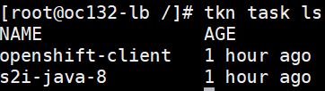

接下来创建 Pipeline。Pipeline 定义了执行的 task 以及它们如何通过输入和输出相互交互。Pipeline 从 GitHub 获取 PetClinic 应用程序的源代码，然后使用 Source-to-Image（S2I）在 OpenShift 上构建和部署它，如下图 12 所示：

##### 图 12\. 构建过程

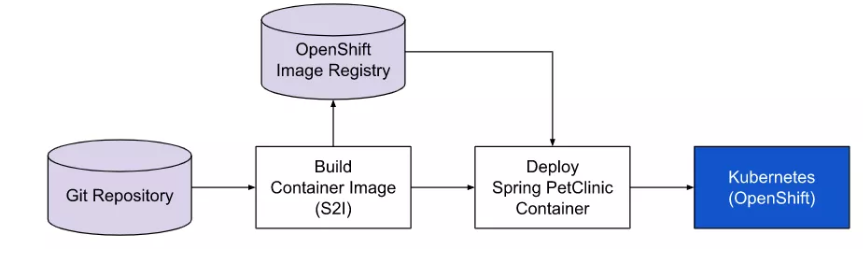

上图 Pipeline 的 YAML 文件（pipeline.yaml）配置如清单 3 所示。pipeline 将我们之前创建的两个 task（openshift-client 和 s2i-java task）串联。

##### 清单 3\. Pipeline 的 Yaml 配置文件：

```
        apiVersion: tekton.dev/v1alpha1
kind: Pipeline
metadata:
name: deploy-pipeline
spec:
resources:
  - name: app-git
    type: git
  - name: app-image
    type: image
tasks:
  - name: build
    taskRef:
      name: s2i-java-8
    params:
      - name: TLSVERIFY
        value: "false"
    resources:
      inputs:
      - name: source
        resource: app-git
      outputs:
      - name: image
        resource: app-image
  - name: deploy
    taskRef:
      name: openshift-client
    runAfter:
      - build
    params:
    - name: ARGS
      value: "rollout latest spring-petclinic"

```

Show moreShow more icon

此 Pipeline 执行以下操作：

- 从 Git 存储库（app-git 资源）克隆应用程序的源代码。
- 使用 s2i-java-8 task 构建容器镜像，该 task 为应用程序生成 Dockerfile 并使用 Buildah 构建镜像。
- 应用程序镜像被推送到容器镜像注册表。
- 使用 openshift-cli 在 OpenShift 上部署新的应用程序镜像。

我们注意到，在上面的配置中：没有指定 PetClinic Git 的源码地址，这些将会在 Pipeline 执行的时候用参数传递进去。一个 Pipeline 中 task 的执行顺序，通过输入和输出在 task 之间定义的依赖关系以及 runAfter 定义的显式顺序确定。

通过运行以下命令创建 Pipeline：

```
# oc create -f pipeline.yaml

```

Show moreShow more icon

查看创建好的 Pipeline

```
[root@master /]# ./tkn pipeline ls
NAME              AGE              LAST RUN   STARTED   DURATION   STATUS
deploy-pipeline   30 seconds ago   ---        ---       ---        ---

```

Show moreShow more icon

接下来，我们传入参数、启动 PipelineRun：

```
[root@oc132-lb /]# tkn pipeline start petclinic-deploy-pipeline \
>         -r app-git=petclinic-git \
>         -r app-image=petclinic-image \
>         -s pipeline
Pipelinerun started: petclinic-deploy-pipeline-run-gwxlz

```

Show moreShow more icon

当然，我们也可以通过 OpenShift 4.2 的 Developer 界面启动 Pipeline，如下图 13 所示：

##### 图 13\. 通过 OpenShift Developer 界面启动 Pipeline

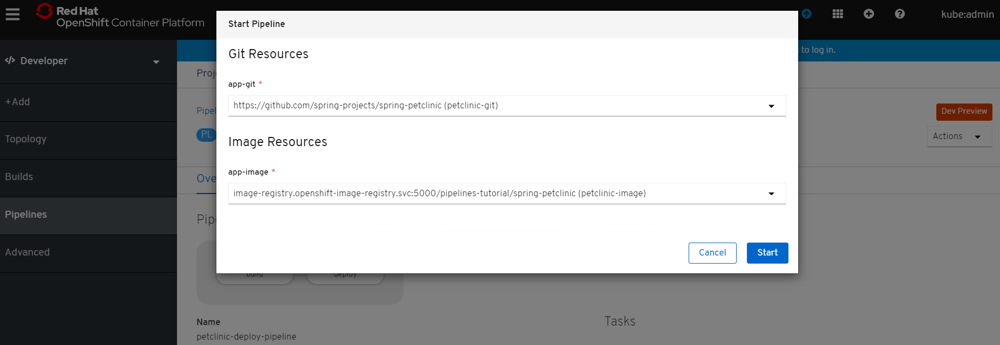

查看 pipeline 的运行，如下图 14 所示：

```
[root@master /]# ./tkn pr ls

```

Show moreShow more icon

##### 图 14\. 查看 Tekton 的运行情况

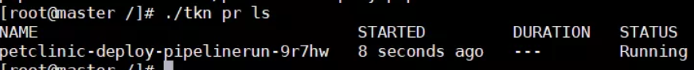

查看 pipeline 的运行日志，运行正常，如下图 15 所示：

```
[root@master /]# ./tkn pr logs petclinic-deploy-pipelinerun-9r7hw -f

```

Show moreShow more icon

##### 图 15\. 查看 pipeline 的运行日志

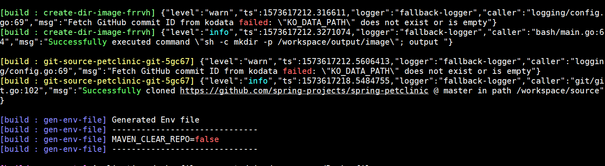

红帽 OpenShift4.2 的 Developer 界面，可以监控 Pileline 运行情况，如下图 16 所示：

##### 图 16\. 查看 pipeline 的图形化界面

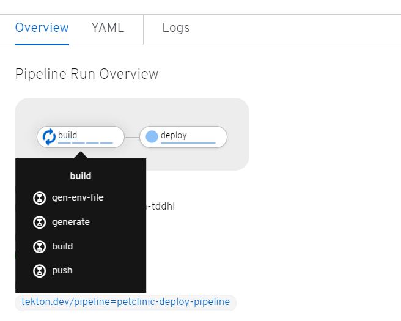

过一段时间后，Pipeline 运行完毕，如下图 17 所示：

##### 图 17\. Pipeline 运行成功

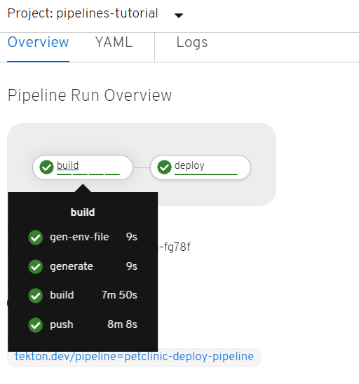

查看部署好的应用 pod，如图 18 所示：

##### 图 18\. 查看部署好的应用

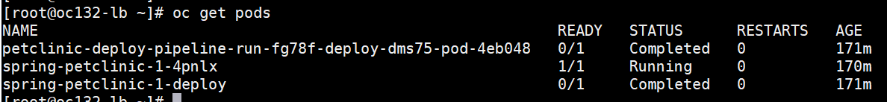

使用 oc get route 查看应用的路由后，通过浏览器可以访问应用，如图 19 所示：

##### 图 19\. 通过浏览器访问应用

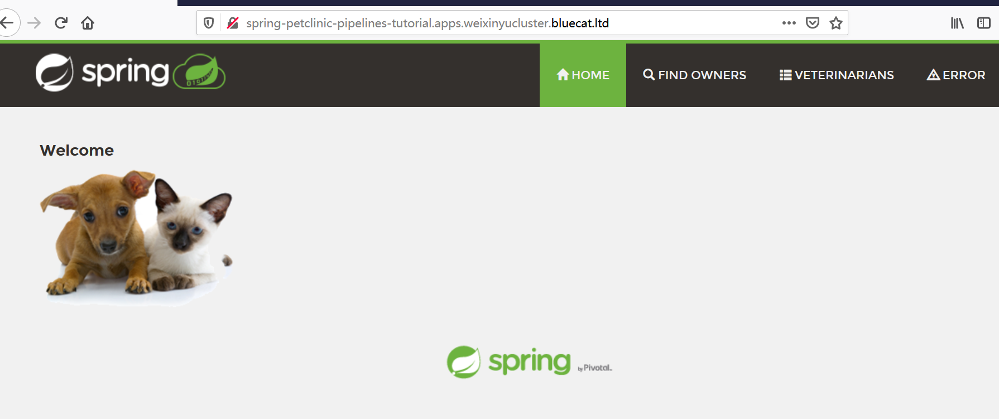

至此，我们成功通过 Tekton 的 Pipeline，在 OpenShift 上成功构建并部署应用。

## 结束语

在本文中，我们介绍了 OpenShift3 中通过 S2I 和 Jenkins 配合的方式，实现 CI/CD。此外，我们还介绍 OpenShift 4.2 中通过 Tekton 实现 OpenShift Pipeline 的方式，并通过具体的实验进行了展现。在未来，Tekton 会逐渐成为主流。